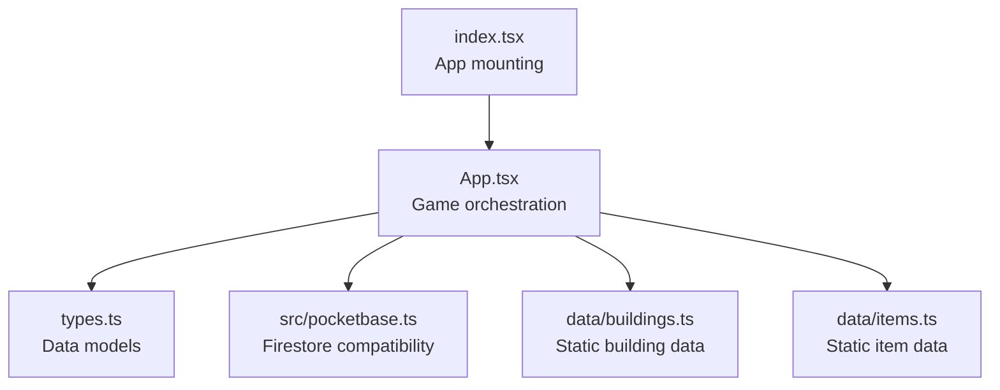
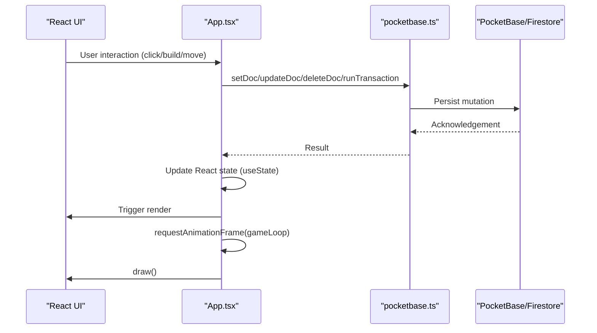
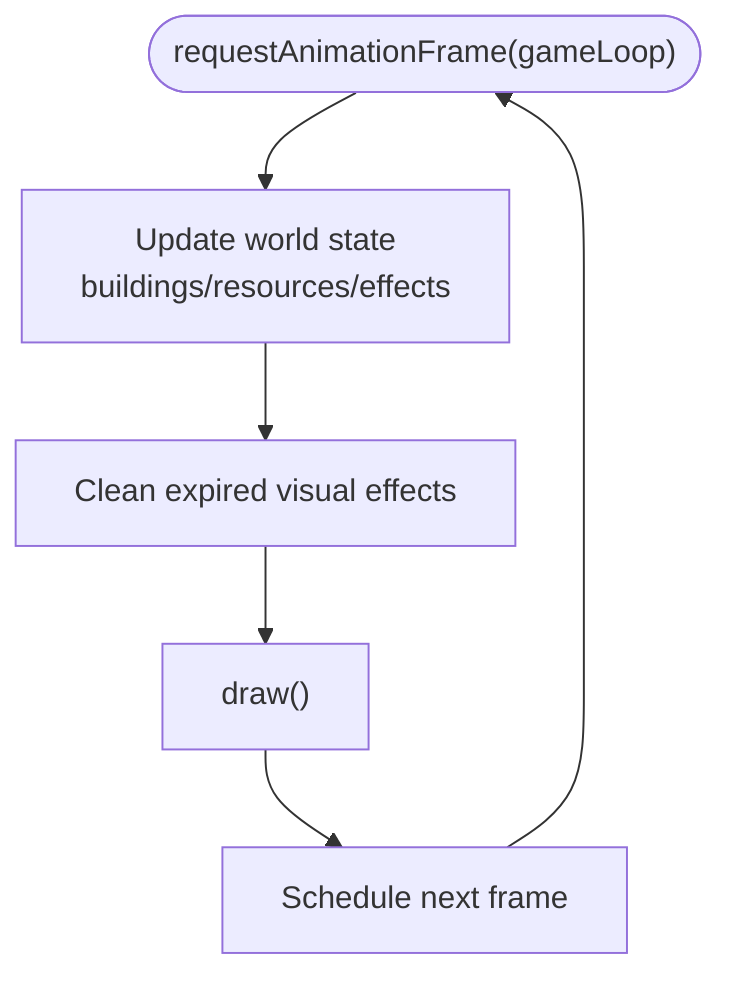
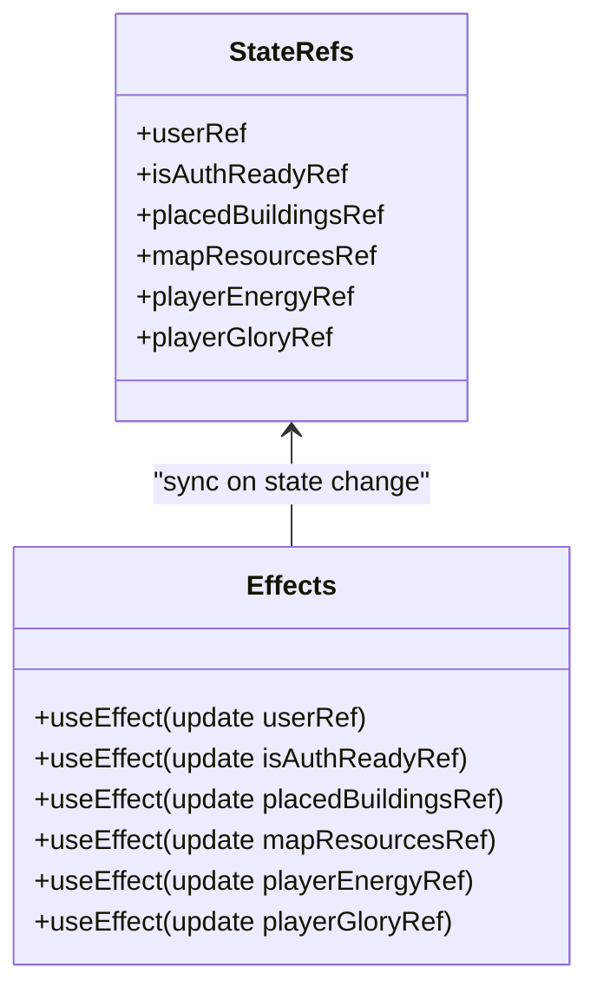
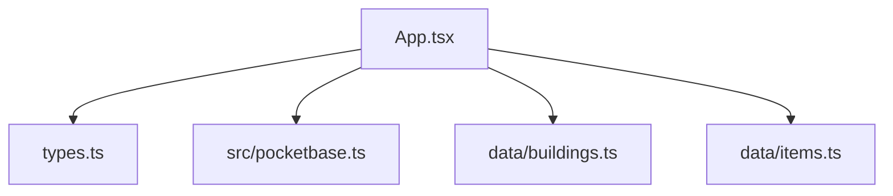

# Game Loop and State Management

<cite>
**Referenced Files in This Document**
- [index.tsx](file://index.tsx)
- [App.tsx](file://App.tsx)
- [types.ts](file://types.ts)
- [pocketbase.ts](file://src/pocketbase.ts)
- [buildings.ts](file://data/buildings.ts)
- [items.ts](file://data/items.ts)
</cite>

## Table of Contents
1. [Introduction](#introduction)
2. [Project Structure](#project-structure)
3. [Core Components](#core-components)
4. [Architecture Overview](#architecture-overview)
5. [Detailed Component Analysis](#detailed-component-analysis)
6. [Dependency Analysis](#dependency-analysis)
7. [Performance Considerations](#performance-considerations)
8. [Troubleshooting Guide](#troubleshooting-guide)
9. [Conclusion](#conclusion)

## Introduction
This document explains the game loop architecture and state management patterns used throughout the engine. It covers how React state integrates with real-time Firestore via PocketBase, how useEffect patterns coordinate different game systems, and how ref synchronization ensures consistency across asynchronous operations. It also documents state hooks for buildings, resources, player data, and UI state, along with practical patterns for state derivation, memoization, and performance optimization.

## Project Structure
The project is a React application bootstrapped in index.tsx and centered around a single App component that orchestrates the entire game. Data models are defined in types.ts, persistence and real-time synchronization are handled by a PocketBase compatibility layer in src/pocketbase.ts, and static game data (buildings and items) is loaded from data/buildings.ts and data/items.ts.



**Diagram sources**
- [index.tsx:1-20](file://index.tsx#L1-L20)
- [App.tsx:1-8217](file://App.tsx#L1-L8217)
- [types.ts:1-197](file://types.ts#L1-L197)
- [pocketbase.ts:1-825](file://src/pocketbase.ts#L1-L825)
- [buildings.ts:1-800](file://data/buildings.ts#L1-L800)
- [items.ts:1-415](file://data/items.ts#L1-L415)

**Section sources**
- [index.tsx:1-20](file://index.tsx#L1-L20)
- [App.tsx:1-8217](file://App.tsx#L1-L8217)

## Core Components
- App.tsx: Houses all game state, effects, and logic. It defines:
  - Player and UI state (useState)
  - Refs for consistency (useRef)
  - Derived state computations (useMemo)
  - Effects coordinating game systems (useEffect)
  - Real-time synchronization via PocketBase compatibility
- types.ts: Defines core data structures for buildings, items, map resources, and game entities.
- pocketbase.ts: Provides Firestore-compatible helpers (getDoc, setDoc, updateDoc, onSnapshot, runTransaction) and a thin wrapper around PocketBase to emulate Firebase APIs.
- data/buildings.ts and data/items.ts: Static lookup tables for building/item metadata used throughout the game logic.

Key state categories:
- Player state: user, playerLevel, playerGlory, playerGold, playerRubies, playerEnergy, inventory, banEndTime, etc.
- World state: placedBuildings, mapResources, droppedItems, visualEffects
- UI state: modal flags, tooltips, menus, selections, etc.
- Refs for consistency: userRef, isAuthReadyRef, placedBuildingsRef, mapResourcesRef, and others

**Section sources**
- [App.tsx:255-403](file://App.tsx#L255-L403)
- [types.ts:100-147](file://types.ts#L100-L147)
- [pocketbase.ts:288-426](file://src/pocketbase.ts#L288-L426)
- [buildings.ts:4-96](file://data/buildings.ts#L4-L96)
- [items.ts:4-415](file://data/items.ts#L4-L415)

## Architecture Overview
The engine uses a hybrid React + real-time database architecture:
- React manages UI state and renders the game world.
- useEffect hooks coordinate subsystems: auth, world sync, resource generation, and the game loop.
- useRef bridges React state and asynchronous operations by providing consistent references.
- useMemo optimizes derived computations to minimize re-renders.
- requestAnimationFrame drives the game loop, updating state and triggering redraws.



**Diagram sources**
- [App.tsx:3609-3627](file://App.tsx#L3609-L3627)
- [pocketbase.ts:338-426](file://src/pocketbase.ts#L338-L426)

## Detailed Component Analysis

### Game Loop and Rendering
The game loop is implemented as a requestAnimationFrame-driven effect that:
- Updates game world state (buildings, effects)
- Synchronizes visual effects
- Triggers redraws



**Diagram sources**
- [App.tsx:3609-3627](file://App.tsx#L3609-L3627)

**Section sources**
- [App.tsx:3609-3627](file://App.tsx#L3609-L3627)

### State Hooks and Derived State Patterns
- Grouped useState declarations at the top of App.tsx to avoid temporal dead zone issues.
- useMemo for expensive derived computations:
  - Population and capacity calculations
  - Town hall presence checks
  - Max buildings count
  - Presence of clan-related structures
- useCallback for stable function references used in effects and event handlers.

Examples of derived state patterns:
- Population: computed from placed buildings and building stats
- Capacity: base capacity plus storage building bonuses
- UI toggles: derived from presence of specific buildings

**Section sources**
- [App.tsx:489-547](file://App.tsx#L489-L547)
- [App.tsx:383-403](file://App.tsx#L383-L403)

### useEffect Patterns for Game Systems
- Authentication and user initialization:
  - onAuthStateChanged subscription
  - Initialize user records if missing
  - Migrate guest buildings to authenticated user
- Real-time world synchronization:
  - onSnapshot subscriptions for buildings, map_resources, dropped_items
  - Zone-based subscriptions with throttled camera offset
  - Intel notifications for new resources
- Asynchronous resource generation:
  - Periodic spawners for oil, quarries, chests, and wild monsters
- Game loop and timers:
  - requestAnimationFrame-driven loop
  - Energy regeneration timer
  - Production completion timer

```mermaid
sequenceDiagram
participant Auth as "Auth Effect"
participant World as "World Sync Effect"
participant Loop as "Game Loop Effect"
participant Spawn as "Spawner Effects"
Auth->>Auth : onAuthStateChanged
Auth->>Auth : Initialize user record
World->>World : onSnapshot(map_resources/buildings/dropped_items)
World->>World : Zone filtering + throttling
Spawn->>Spawn : Interval-based resource spawn
Loop->>Loop : requestAnimationFrame(gameLoop)
```

**Diagram sources**
- [App.tsx:1559-1599](file://App.tsx#L1559-L1599)
- [App.tsx:822-893](file://App.tsx#L822-L893)
- [App.tsx:3661-3703](file://App.tsx#L3661-L3703)
- [App.tsx:3705-3747](file://App.tsx#L3705-L3747)
- [App.tsx:3749-3790](file://App.tsx#L3749-L3790)
- [App.tsx:3792-3856](file://App.tsx#L3792-L3856)
- [App.tsx:3609-3627](file://App.tsx#L3609-L3627)

**Section sources**
- [App.tsx:1559-1599](file://App.tsx#L1559-L1599)
- [App.tsx:822-893](file://App.tsx#L822-L893)
- [App.tsx:3661-3703](file://App.tsx#L3661-L3703)
- [App.tsx:3705-3747](file://App.tsx#L3705-L3747)
- [App.tsx:3749-3790](file://App.tsx#L3749-L3790)
- [App.tsx:3792-3856](file://App.tsx#L3792-L3856)
- [App.tsx:3609-3627](file://App.tsx#L3609-L3627)

### Ref Synchronization Strategies
Refs are used to bridge React state and asynchronous operations:
- userRef, isAuthReadyRef, placedBuildingsRef, mapResourcesRef, playerEnergyRef, playerGloryRef
- useEffects update refs whenever their corresponding state changes
- Logic consistently reads from refs during async callbacks to avoid stale closure issues



**Diagram sources**
- [App.tsx:548-558](file://App.tsx#L548-L558)

**Section sources**
- [App.tsx:548-558](file://App.tsx#L548-L558)

### Relationship Between React State and Game Logic
- React state drives UI and user interactions.
- Game logic updates React state, often with optimistic local updates followed by server-side persistence.
- Refs provide consistent references for async callbacks and timers.
- Memoized computations ensure derived state remains efficient.

**Section sources**
- [App.tsx:1040-1067](file://App.tsx#L1040-L1067)
- [App.tsx:3609-3620](file://App.tsx#L3609-L3620)

### State Hooks for Buildings, Resources, Player Data, and UI
- Buildings: placedBuildings (useState), building selection and actions
- Resources: mapResources (useState), droppedItems (useState)
- Player data: user, playerLevel, playerGlory, playerGold, playerRubies, playerEnergy, inventory, banEndTime
- UI state: modal flags, tooltips, menus, selections, visual effects

**Section sources**
- [App.tsx:261-325](file://App.tsx#L261-L325)
- [App.tsx:1040-1067](file://App.tsx#L1040-L1067)

### State Derivation and Memoization Strategies
- useMemo for:
  - Population totals
  - Max population and building permits
  - Presence checks for key buildings
- useCallback for:
  - Event handlers and helper functions passed to effects
  - Stable references for dependencies

**Section sources**
- [App.tsx:489-547](file://App.tsx#L489-L547)
- [App.tsx:409-441](file://App.tsx#L409-L441)

### Performance Optimization Techniques
- Throttled camera offset to reduce zone subscription churn
- Zone-based queries to limit data volume
- Optimistic UI updates with later reconciliation
- Memoized derived state to avoid unnecessary recalculations
- Efficient rendering order and visibility checks

**Section sources**
- [App.tsx:570-576](file://App.tsx#L570-L576)
- [App.tsx:822-877](file://App.tsx#L822-L877)
- [App.tsx:2817-2840](file://App.tsx#L2817-L2840)

### Common State Management Challenges and Solutions
- Reference updates: refs synchronized via useEffect
- Stale closures: read from refs in async callbacks
- Consistency across asynchronous operations: optimistic updates + server reconciliation
- Race conditions: handleFirestoreError filters expected errors; onSnapshot error handling; runTransaction for atomicity

**Section sources**
- [App.tsx:27-33](file://App.tsx#L27-L33)
- [pocketbase.ts:787-800](file://src/pocketbase.ts#L787-L800)
- [pocketbase.ts:716-746](file://src/pocketbase.ts#L716-L746)

## Dependency Analysis
The App component depends on:
- types.ts for type safety
- pocketbase.ts for persistence and real-time
- data/buildings.ts and data/items.ts for static metadata



**Diagram sources**
- [App.tsx:1-30](file://App.tsx#L1-L30)
- [types.ts:1-197](file://types.ts#L1-L197)
- [pocketbase.ts:1-825](file://src/pocketbase.ts#L1-L825)
- [buildings.ts:1-800](file://data/buildings.ts#L1-L800)
- [items.ts:1-415](file://data/items.ts#L1-L415)

**Section sources**
- [App.tsx:1-30](file://App.tsx#L1-L30)
- [types.ts:1-197](file://types.ts#L1-L197)
- [pocketbase.ts:1-825](file://src/pocketbase.ts#L1-L825)
- [buildings.ts:1-800](file://data/buildings.ts#L1-L800)
- [items.ts:1-415](file://data/items.ts#L1-L415)

## Performance Considerations
- Minimize real-time subscriptions by zone-based queries and throttling camera updates.
- Use memoization for derived state to avoid expensive recomputations.
- Prefer optimistic UI updates to improve perceived responsiveness.
- Batch updates where possible to reduce render cycles.
- Limit the scope of onSnapshot listeners to only necessary collections and fields.

## Troubleshooting Guide
Common issues and mitigations:
- Expected Firestore errors: handleFirestoreError ignores specific permission and missing document errors to avoid noisy alerts.
- Stale state in async callbacks: ensure refs are updated and read from refs inside async handlers.
- Race conditions: use runTransaction for multi-field updates; handle errors gracefully.
- Infinite loops: verify dependency arrays in useEffect; avoid mutating refs without updating state.

**Section sources**
- [App.tsx:27-33](file://App.tsx#L27-L33)
- [pocketbase.ts:787-800](file://src/pocketbase.ts#L787-L800)
- [App.tsx:548-558](file://App.tsx#L548-L558)

## Conclusion
The engine combines React’s declarative UI with a requestAnimationFrame-driven game loop and real-time synchronization via a PocketBase compatibility layer. State management emphasizes grouped hooks, memoization, and ref synchronization to address asynchronous operations and performance. The architecture cleanly separates UI state, game logic, and persistence, enabling scalable multiplayer gameplay.