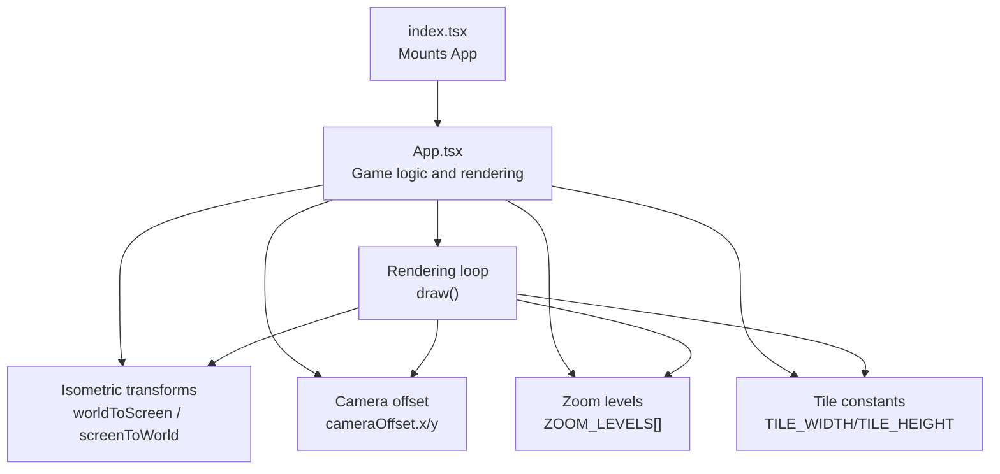
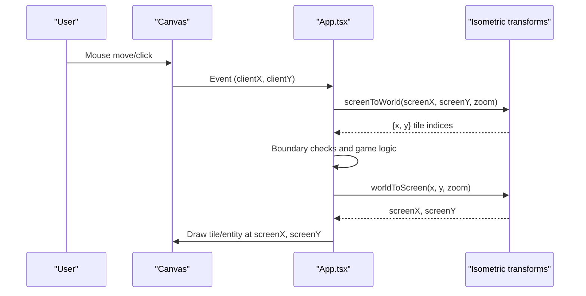
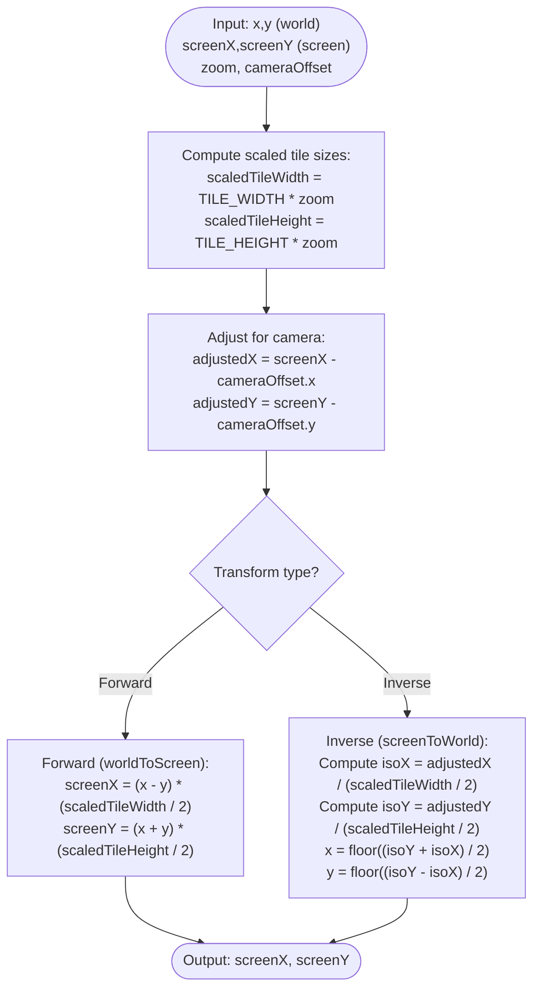
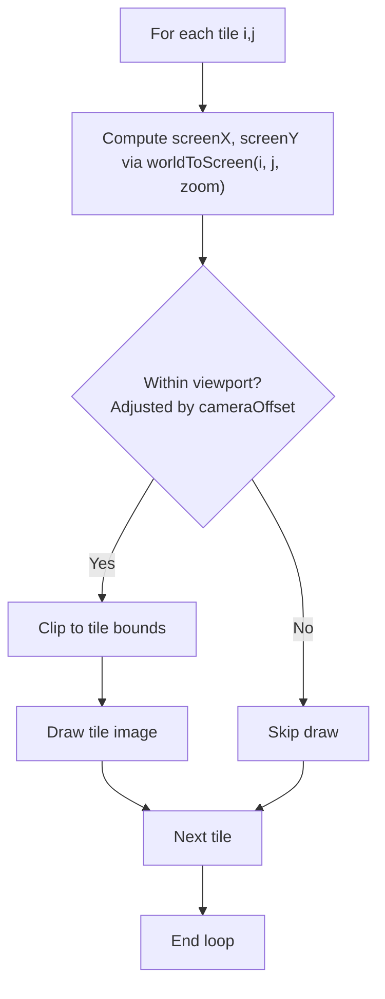
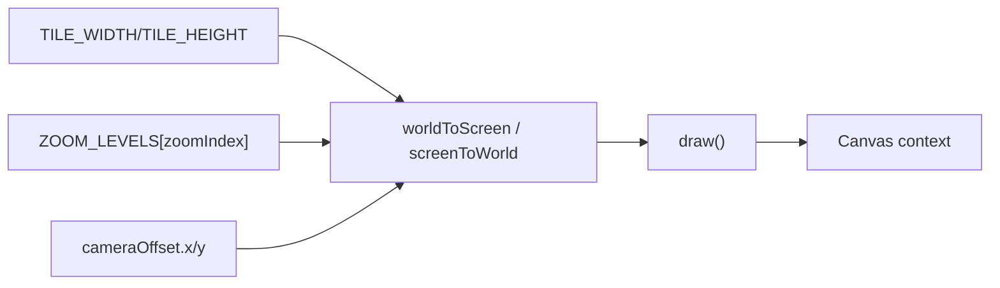

# Isometric Coordinate System

<cite>
**Referenced Files in This Document**
- [App.tsx](file://App.tsx)
- [index.tsx](file://index.tsx)
- [final_performance_optimization.cjs](file://final_performance_optimization.cjs)
</cite>

## Table of Contents
1. [Introduction](#introduction)
2. [Project Structure](#project-structure)
3. [Core Components](#core-components)
4. [Architecture Overview](#architecture-overview)
5. [Detailed Component Analysis](#detailed-component-analysis)
6. [Dependency Analysis](#dependency-analysis)
7. [Performance Considerations](#performance-considerations)
8. [Troubleshooting Guide](#troubleshooting-guide)
9. [Conclusion](#conclusion)

## Introduction
This document explains the isometric coordinate system used by the game engine. It covers the mathematical transformations between world coordinates (tile indices) and screen coordinates, the role of tile dimensions and zoom levels, and how the isometric projection influences rendering. It also documents mouse interaction mapping, camera positioning, and the relationship to tile-based game mechanics. Practical guidance is included for precision, boundary checks, and performance optimization.

## Project Structure
The isometric math is implemented in the main application file and is used across rendering, input handling, and camera logic. The entry point initializes the app and mounts the root component.

**Diagram sources**
- [index.tsx:12-19](file://index.tsx#L12-L19)
- [App.tsx:36-39](file://App.tsx#L36-L39)
- [App.tsx:257-258](file://App.tsx#L257-L258)
- [App.tsx:473-486](file://App.tsx#L473-L486)
- [App.tsx:2762-2811](file://App.tsx#L2762-L2811)

**Section sources**
- [index.tsx:12-19](file://index.tsx#L12-L19)
- [App.tsx:36-39](file://App.tsx#L36-L39)
- [App.tsx:257-258](file://App.tsx#L257-L258)
- [App.tsx:473-486](file://App.tsx#L473-L486)
- [App.tsx:2762-2811](file://App.tsx#L2762-L2811)

## Core Components
- Tile dimensions: width and height define the isometric tile shape.
- Zoom levels: discrete scaling factors applied to tile dimensions.
- Camera offset: translation applied to the canvas to implement panning.
- Conversion functions:
  - worldToScreen: converts world tile indices to screen coordinates.
  - screenToWorld: converts screen coordinates to world tile indices.

These components work together to render an isometric grid and translate user input to tile-space actions.

**Section sources**
- [App.tsx:36-39](file://App.tsx#L36-L39)
- [App.tsx:257-258](file://App.tsx#L257-L258)
- [App.tsx:473-486](file://App.tsx#L473-L486)

## Architecture Overview
The isometric pipeline follows a predictable flow: input coordinates are transformed via camera offset and zoom, then mapped to world tile indices for game logic, while the reverse mapping renders tiles and entities.

**Diagram sources**
- [App.tsx:473-486](file://App.tsx#L473-L486)
- [App.tsx:1336-1353](file://App.tsx#L1336-L1353)
- [App.tsx:2762-2811](file://App.tsx#L2762-L2811)

## Detailed Component Analysis

### Mathematical Foundation
The isometric projection maps 2D world coordinates (tile indices) to screen coordinates using linear transformations that depend on tile dimensions and zoom. The forward transform is:
- screenX = (x - y) * (TILE_WIDTH * zoom / 2)
- screenY = (x + y) * (TILE_HEIGHT * zoom / 2)

The inverse transform (from screen to world) adjusts for camera offset and solves the linear system to recover integer tile indices.

**Diagram sources**
- [App.tsx:473-486](file://App.tsx#L473-L486)
- [App.tsx:783-796](file://App.tsx#L783-L796)

**Section sources**
- [App.tsx:473-486](file://App.tsx#L473-L486)
- [App.tsx:783-796](file://App.tsx#L783-L796)

### Tile Dimensions and Zoom Levels
- Tile dimensions: 128 pixels wide by 64 pixels tall.
- Zoom levels: discrete scales [0.5, 1.0, 1.5, 2.0, 2.5].
- Scaled tile sizes are recomputed per frame using the current zoom index.

Practical impact:
- Larger zoom increases perceived tile size and drawing scale.
- Rendering bounds and visibility checks rely on scaled dimensions.

**Section sources**
- [App.tsx:36-39](file://App.tsx#L36-L39)
- [App.tsx:2765-2768](file://App.tsx#L2765-L2768)

### Camera Positioning
- Camera offset is stored as cameraOffset.x and cameraOffset.y.
- The renderer translates the canvas by this offset before drawing.
- Mouse-to-world conversions subtract the camera offset to compute adjusted screen coordinates.

Common usage:
- Panning updates cameraOffset.
- Centering logic computes world coordinates at canvas center using screenToWorld.

**Section sources**
- [App.tsx:257-258](file://App.tsx#L257-L258)
- [App.tsx:2773-2774](file://App.tsx#L2773-L2774)
- [App.tsx:1870-1871](file://App.tsx#L1870-L1871)
- [App.tsx:5605-5630](file://App.tsx#L5605-L5630)

### Mouse Interaction Mapping
- Mouse move/up/down events trigger screenToWorld to convert pointer coordinates to tile indices.
- Boundary checks ensure coordinates are within the world grid before applying game logic.
- Clicks on tiles can select buildings, collect resources, or initiate placement/move operations.

Example flow:
- On mouse move: convert to gridX/gridY, update hover state if within bounds.
- On mouse up: validate bounds, check for items/buildings/resources, and perform action.

**Section sources**
- [App.tsx:1336-1353](file://App.tsx#L1336-L1353)
- [App.tsx:1005-1006](file://App.tsx#L1005-L1006)
- [App.tsx:1015-1016](file://App.tsx#L1015-L1016)
- [App.tsx:1351-1353](file://App.tsx#L1351-L1353)

### Rendering Pipeline and Isometric Projection
- The draw loop iterates world tiles and calls worldToScreen for each tile.
- Visibility culling clips tiles outside the viewport using camera offset and scaled dimensions.
- Entities (resources, buildings, dropped items) are drawn at computed screen positions with depth sorting.

**Diagram sources**
- [App.tsx:2778-2811](file://App.tsx#L2778-L2811)
- [App.tsx:2819-2826](file://App.tsx#L2819-L2826)

**Section sources**
- [App.tsx:2762-2811](file://App.tsx#L2762-L2811)
- [App.tsx:2819-2826](file://App.tsx#L2819-L2826)

### Relationship to Tile-Based Mechanics
- World grid: 200x200 tiles.
- Tile-based interactions: placement, movement, resource harvesting, and building selection operate on integer tile indices.
- Occupancy checks and boundary validations ensure actions occur only on valid tiles.

**Section sources**
- [App.tsx:40-42](file://App.tsx#L40-L42)
- [App.tsx:1015-1016](file://App.tsx#L1015-L1016)
- [App.tsx:1069-1072](file://App.tsx#L1069-L1072)

## Dependency Analysis
The isometric transforms are central to rendering and input handling. They depend on:
- Tile constants (width/height)
- Zoom levels
- Camera offset
- Canvas size and context

**Diagram sources**
- [App.tsx:36-39](file://App.tsx#L36-L39)
- [App.tsx:257-258](file://App.tsx#L257-L258)
- [App.tsx:473-486](file://App.tsx#L473-L486)
- [App.tsx:2762-2811](file://App.tsx#L2762-L2811)

**Section sources**
- [App.tsx:36-39](file://App.tsx#L36-L39)
- [App.tsx:257-258](file://App.tsx#L257-L258)
- [App.tsx:473-486](file://App.tsx#L473-L486)
- [App.tsx:2762-2811](file://App.tsx#L2762-L2811)

## Performance Considerations
- Visible tile range optimization: compute approximate center tile under the camera and iterate only within a bounded range around it, reducing unnecessary worldToScreen calls.
- Sorting by (x + y) ensures correct depth ordering for isometric rendering.
- Clipping bounds avoid drawing off-screen tiles and entities.

Practical tips:
- Prefer precomputing scaled tile sizes per frame rather than recalculating repeatedly.
- Minimize Math.floor usage in tight loops; cache intermediate values.
- Keep cameraOffset immutable during a single frame to avoid repeated recomputations.

**Section sources**
- [final_performance_optimization.cjs:30-44](file://final_performance_optimization.cjs#L30-L44)
- [App.tsx:2819-2826](file://App.tsx#L2819-L2826)
- [App.tsx:2783-2790](file://App.tsx#L2783-L2790)

## Troubleshooting Guide
Common issues and resolutions:
- Precision and rounding:
  - Use Math.floor when converting from continuous screen coordinates to discrete tile indices to avoid partial tile artifacts.
  - Ensure zoom scaling is applied consistently in both forward and inverse transforms.
- Boundary checks:
  - Validate tile indices against world grid dimensions before performing actions.
  - Clamp camera offset to keep the world within reasonable bounds.
- Mouse-to-tile mapping:
  - Confirm camera offset is subtracted before inverse projection.
  - Verify zoom index corresponds to the current frame’s zoom level.
- Rendering order:
  - Sort by (x + y) to maintain proper isometric depth; add secondary sorting for tie-breaking (e.g., entity type).
- Performance regressions:
  - Revert to naive loops only for debugging; ensure optimized visible-range iteration is active.

**Section sources**
- [App.tsx:479-486](file://App.tsx#L479-L486)
- [App.tsx:1015-1016](file://App.tsx#L1015-L1016)
- [App.tsx:1069-1072](file://App.tsx#L1069-L1072)
- [App.tsx:2819-2826](file://App.tsx#L2819-L2826)
- [final_performance_optimization.cjs:30-44](file://final_performance_optimization.cjs#L30-L44)

## Conclusion
The isometric coordinate system in the game engine is built around clean linear transformations between world tile indices and screen coordinates, driven by fixed tile dimensions and discrete zoom levels. Camera offset enables smooth panning, while mouse interactions map directly to tile indices with robust boundary checks. The rendering pipeline leverages these transforms for efficient, depth-correct drawing, and performance optimizations further constrain work to visible regions. By following the outlined practices—consistent scaling, precise rounding, and optimized iteration—the system remains responsive and accurate across zoom levels and camera positions.