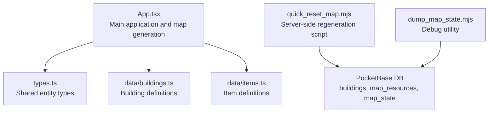
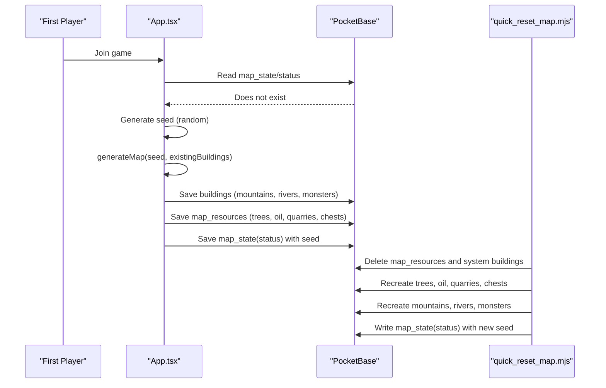
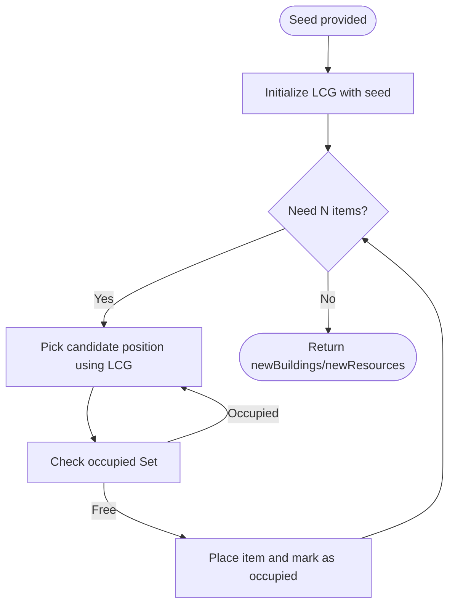
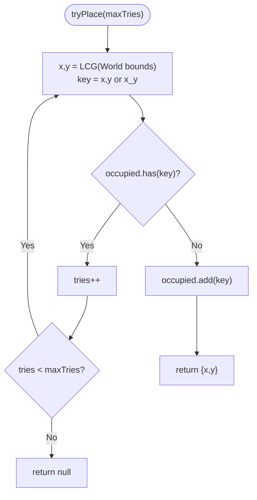
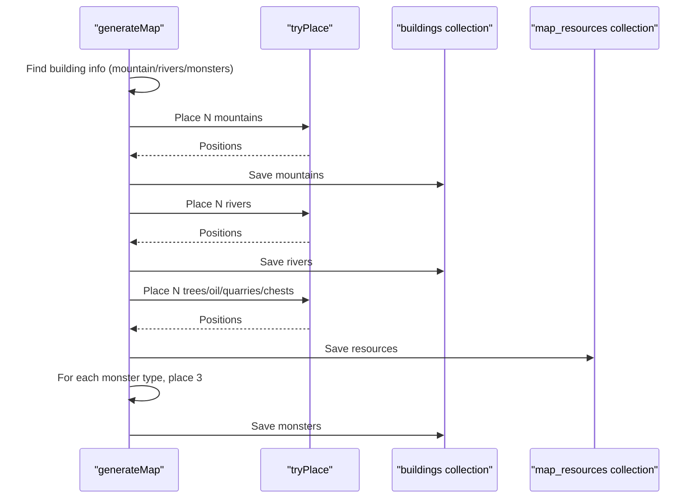
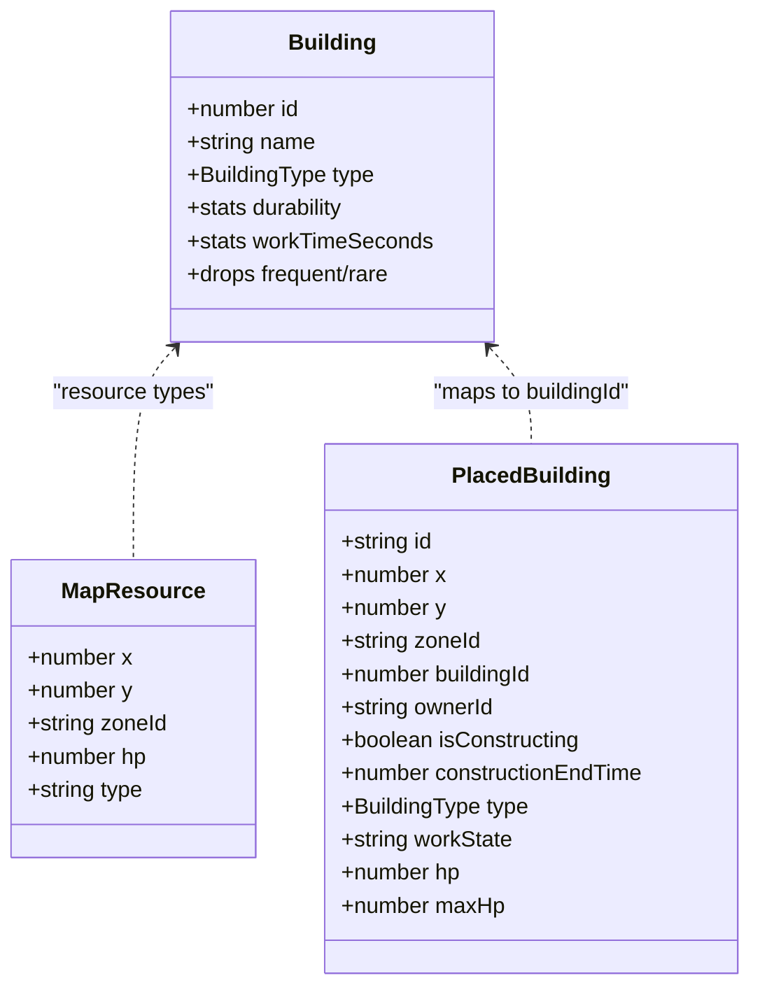
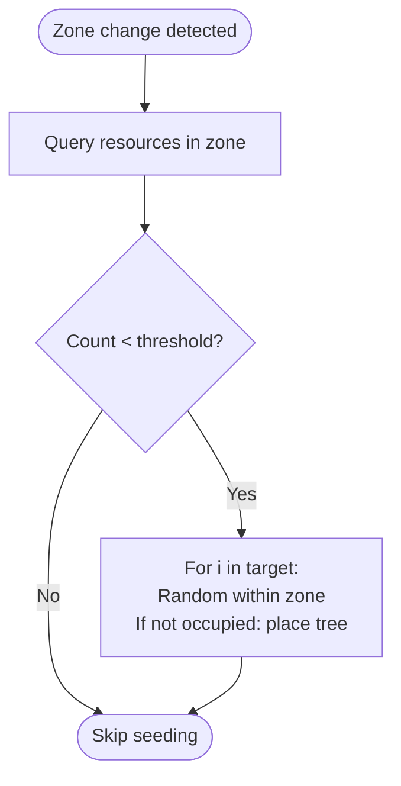
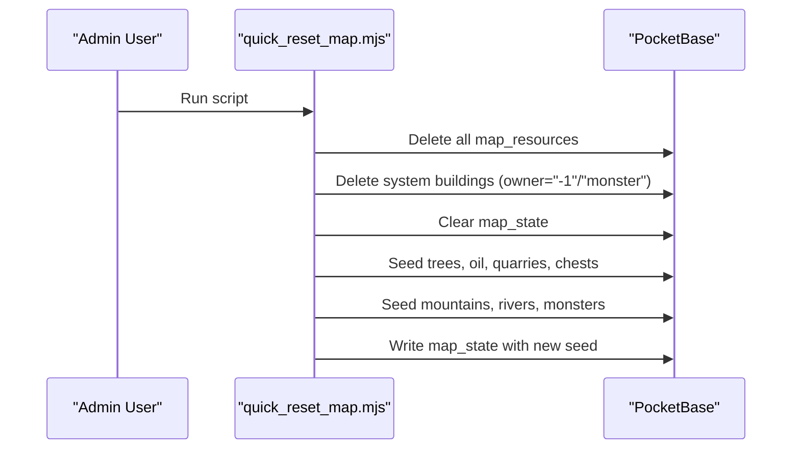
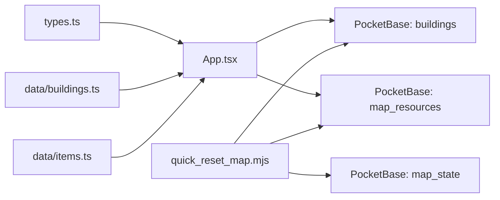

# Map Generation and Procedural Content

<cite>
**Referenced Files in This Document**
- [App.tsx](file://App.tsx)
- [types.ts](file://types.ts)
- [buildings.ts](file://data/buildings.ts)
- [items.ts](file://data/items.ts)
- [quick_reset_map.mjs](file://quick_reset_map.mjs)
- [dump_map_state.mjs](file://dump_map_state.mjs)
</cite>

## Table of Contents
1. [Introduction](#introduction)
2. [Project Structure](#project-structure)
3. [Core Components](#core-components)
4. [Architecture Overview](#architecture-overview)
5. [Detailed Component Analysis](#detailed-component-analysis)
6. [Dependency Analysis](#dependency-analysis)
7. [Performance Considerations](#performance-considerations)
8. [Troubleshooting Guide](#troubleshooting-guide)
9. [Conclusion](#conclusion)

## Introduction
This document explains the procedural map generation system that creates diverse game worlds. It focuses on the generateMap function, seed-based deterministic randomness, and placement algorithms for mountains, rivers, trees, oil deposits, quarries, chests, and monsters. It also documents the tryPlace collision detection mechanism, occupied tile tracking, and how building types relate to map features. Examples of generation parameters, density controls, and the balance between variety and gameplay are included, along with performance implications and techniques for ensuring playable maps.

## Project Structure
The map generation logic is implemented in the main application file and supported by shared types and data definitions. A dedicated script is provided to reset and regenerate the map state for testing and maintenance.

**Diagram sources**
- [App.tsx:578-718](file://App.tsx#L578-L718)
- [types.ts:111-147](file://types.ts#L111-L147)
- [buildings.ts:1-4665](file://data/buildings.ts#L1-L4665)
- [items.ts:1-415](file://data/items.ts#L1-L415)
- [quick_reset_map.mjs:1-301](file://quick_reset_map.mjs#L1-L301)
- [dump_map_state.mjs:1-12](file://dump_map_state.mjs#L1-L12)

**Section sources**
- [App.tsx:36-95](file://App.tsx#L36-L95)
- [App.tsx:578-718](file://App.tsx#L578-L718)
- [quick_reset_map.mjs:21-46](file://quick_reset_map.mjs#L21-L46)

## Core Components
- World and zone constants define the map grid and subdivision for spatial locality.
- Seed-based deterministic pseudo-random generator ensures reproducible maps.
- tryPlace collision detection prevents overlapping placements.
- Generation pipeline places mountains, rivers, trees, oil, quarries, chests, and monsters.
- Zone-aware seeding populates empty sectors on demand.

Key generation parameters and densities:
- World size: 200×200 tiles.
- Zones: 5×5 cells of 40×40 tiles each.
- Trees: 13,000 units.
- Mountains: 70 units.
- Rivers: 55 units.
- Oil deposits: 8 units.
- Quarries: 6 units.
- Chests: 15 units.
- Wild monsters: 3 types × 3 spawns each; additional wild monsters spawn later with a cap.

**Section sources**
- [App.tsx:36-95](file://App.tsx#L36-L95)
- [App.tsx:578-718](file://App.tsx#L578-L718)
- [App.tsx:907-932](file://App.tsx#L907-L932)

## Architecture Overview
The generation flow is orchestrated by the main application. On first join, a random seed is generated, and the map is created and persisted. Subsequent clients load the pre-generated state. A secondary script supports rapid regeneration for development and testing.

**Diagram sources**
- [App.tsx:749-778](file://App.tsx#L749-L778)
- [App.tsx:578-718](file://App.tsx#L578-L718)
- [quick_reset_map.mjs:249-295](file://quick_reset_map.mjs#L249-L295)

## Detailed Component Analysis

### Seed-Based Randomness and Determinism
- The generateMap function initializes a linear congruential generator (LCG) with the provided seed, ensuring deterministic outcomes.
- The LCG produces uniformly distributed pseudo-random values used for selecting positions across the world grid.

**Diagram sources**
- [App.tsx:578-604](file://App.tsx#L578-L604)

**Section sources**
- [App.tsx:578-584](file://App.tsx#L578-L584)

### Collision Detection and Occupancy Tracking
- The occupied Set tracks all tile keys currently hosting buildings or resources.
- tryPlace selects random coordinates and retries until a free tile is found or max attempts are exceeded.
- For resources, the Set uses "x_y" keys; for buildings/resources combined checks, the Set uses "x,y" keys.

**Diagram sources**
- [App.tsx:590-604](file://App.tsx#L590-L604)
- [App.tsx:1259-1277](file://App.tsx#L1259-L1277)

**Section sources**
- [App.tsx:590-604](file://App.tsx#L590-L604)
- [App.tsx:1259-1277](file://App.tsx#L1259-L1277)

### Placement Algorithms and Feature Types
- Mountains: Placed as default-type buildings with high durability, owned by the system.
- Rivers: Placed as default-type buildings with high durability, owned by the system.
- Trees: Placed as map resources with low hit points, intended for harvesting.
- Oil deposits: Placed as map resources with moderate hit points.
- Quarries: Placed as map resources with higher hit points.
- Chests: Placed as map resources with minimal hit points.
- Monsters: Placed as default-type buildings with monster-specific stats, owned by the monster faction.

**Diagram sources**
- [App.tsx:606-629](file://App.tsx#L606-L629)
- [App.tsx:631-654](file://App.tsx#L631-L654)
- [App.tsx:656-685](file://App.tsx#L656-L685)
- [App.tsx:687-715](file://App.tsx#L687-L715)

**Section sources**
- [App.tsx:606-715](file://App.tsx#L606-L715)

### Relationship Between Building Types and Map Features
- BuildingType.Default is used for passive world features (mountains, rivers) and hostile structures (monster buildings).
- These features are not player-buildable and are owned by the system or monsters.
- Player-buildable structures are defined in the buildings dataset and use BuildingType.Residential and others.

**Diagram sources**
- [types.ts:35-96](file://types.ts#L35-L96)
- [types.ts:111-147](file://types.ts#L111-L147)

**Section sources**
- [types.ts:35-96](file://types.ts#L35-L96)
- [types.ts:111-147](file://types.ts#L111-L147)

### Zone-Aware Seeding and Sector Population
- Empty or sparsely populated zones are detected and filled on-demand.
- Local occupancy tracking ensures no overlap during a single seeding pass.
- Trees are seeded with a target density per zone.

**Diagram sources**
- [App.tsx:907-932](file://App.tsx#L907-L932)

**Section sources**
- [App.tsx:907-932](file://App.tsx#L907-L932)

### Server-Side Regeneration Script
- Deletes all map_resources and system-owned buildings, preserving player structures.
- Recreates trees, oil, quarries, chests, mountains, rivers, and monsters with new random seed.
- Writes map_state to reflect the regenerated world.

**Diagram sources**
- [quick_reset_map.mjs:249-295](file://quick_reset_map.mjs#L249-L295)

**Section sources**
- [quick_reset_map.mjs:1-301](file://quick_reset_map.mjs#L1-L301)

## Dependency Analysis
- App.tsx depends on types.ts for entity shapes and data/buildings.ts for building metadata.
- Generation functions create records stored in PocketBase collections: buildings and map_resources.
- quick_reset_map.mjs orchestrates bulk deletions and recreations against the same collections.

**Diagram sources**
- [types.ts:111-147](file://types.ts#L111-L147)
- [buildings.ts:1-4665](file://data/buildings.ts#L1-L4665)
- [items.ts:1-415](file://data/items.ts#L1-L415)
- [App.tsx:578-718](file://App.tsx#L578-L718)
- [quick_reset_map.mjs:249-295](file://quick_reset_map.mjs#L249-L295)

**Section sources**
- [App.tsx:578-718](file://App.tsx#L578-L718)
- [quick_reset_map.mjs:249-295](file://quick_reset_map.mjs#L249-L295)

## Performance Considerations
- Deterministic LCG avoids expensive cryptographic randomness and guarantees reproducibility.
- tryPlace uses retry loops with bounded attempts; with 200×200 tiles and modest counts, collisions are rare, so most placements succeed quickly.
- Batched writes in the regeneration script minimize round-trips to the database.
- Zone-aware seeding reduces contention by limiting placement scope to sparse sectors.
- Occupancy sets provide O(1) average-time checks for collisions.

Recommendations:
- Keep maxTries reasonable to bound worst-case placement time.
- Use zone-based seeding to avoid global scans and improve responsiveness.
- Consider spatial indexing or grid hashing for very large worlds to accelerate collision checks.

[No sources needed since this section provides general guidance]

## Troubleshooting Guide
Common issues and remedies:
- No map generated on first join:
  - Verify map_state/status exists after initial generation.
  - Check for errors during Firestore writes in the generation phase.
- Regeneration not taking effect:
  - Ensure the regeneration script runs with admin credentials.
  - Confirm deletion of system buildings and map_resources succeeded.
  - Validate that map_state was updated with a new seed.
- Overlapping placements:
  - Increase maxTries or reduce counts to lower collision probability.
  - Review existingBuildings passed to generateMap to ensure accurate occupancy.

Operational utilities:
- Use the map state dumper to inspect current state and seed.

**Section sources**
- [App.tsx:749-778](file://App.tsx#L749-L778)
- [quick_reset_map.mjs:249-295](file://quick_reset_map.mjs#L249-L295)
- [dump_map_state.mjs:1-12](file://dump_map_state.mjs#L1-L12)

## Conclusion
The procedural generation system combines seed-based determinism, efficient collision detection, and targeted density controls to produce varied yet balanced worlds. By leveraging zones and on-demand seeding, it maintains performance while ensuring interesting terrain features and resource distribution. The provided regeneration script streamlines development workflows and supports consistent map resets without disrupting player-built structures.