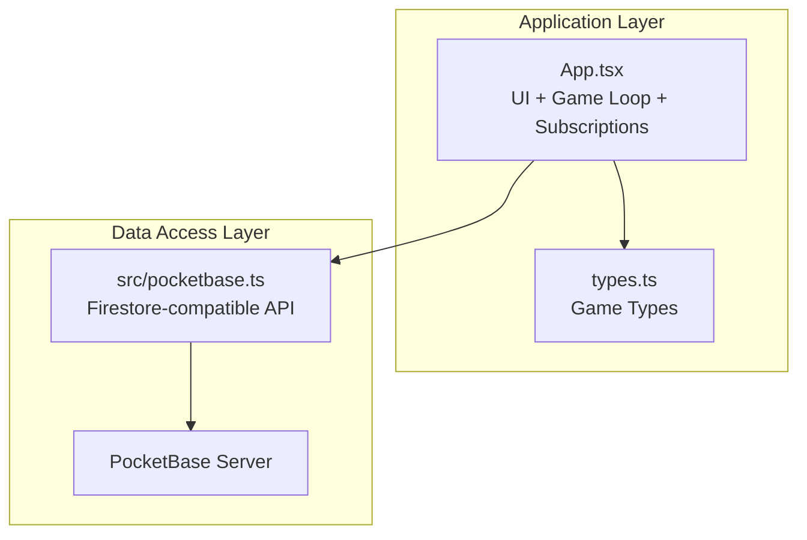
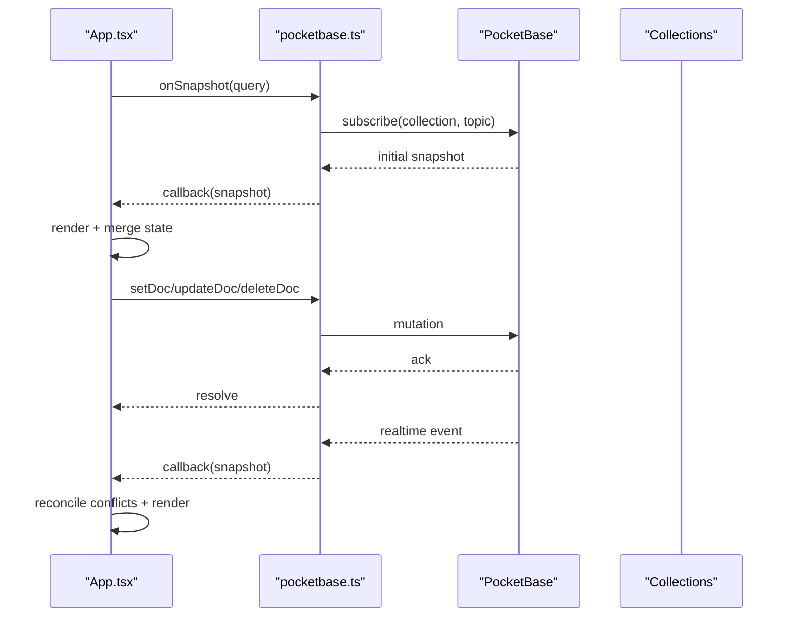
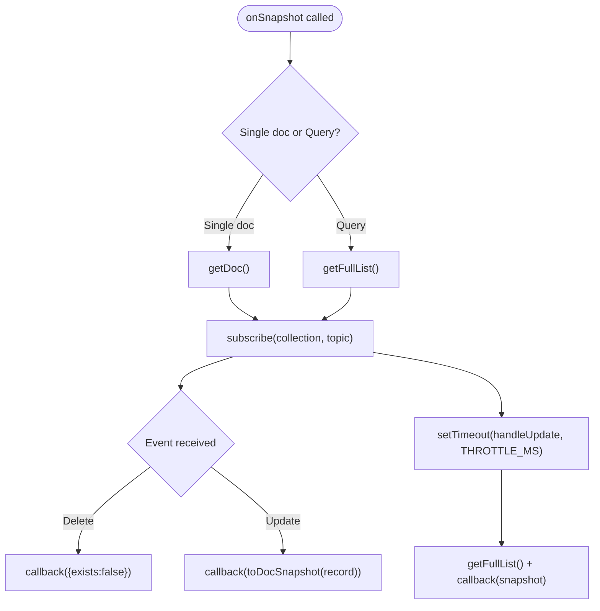
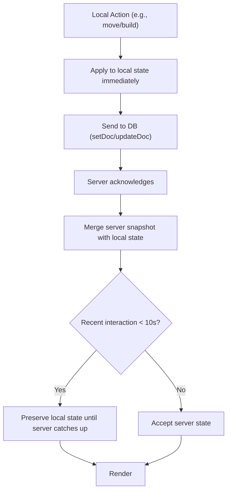
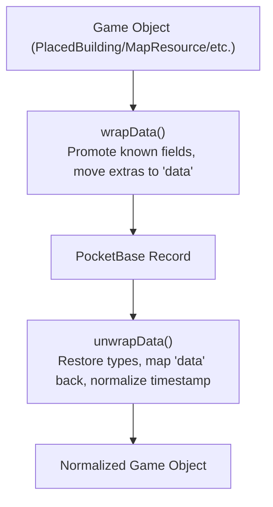
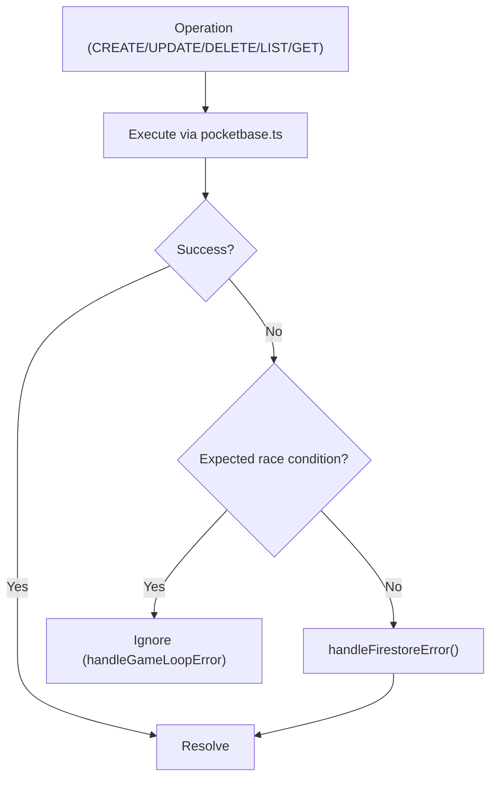
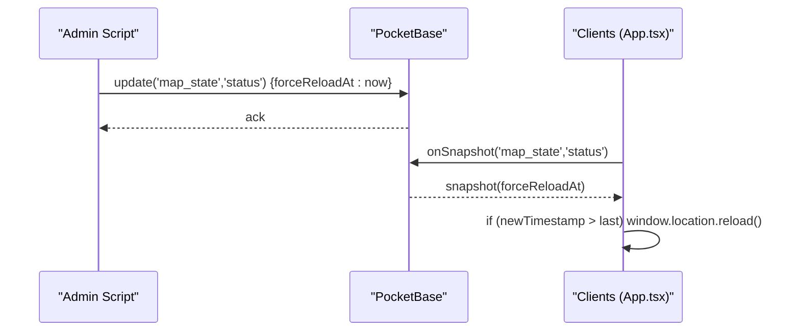
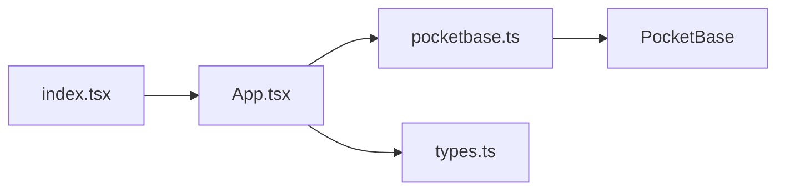

# Real-Time Synchronization

<cite>
**Referenced Files in This Document**
- [App.tsx](file://App.tsx)
- [pocketbase.ts](file://src/pocketbase.ts)
- [types.ts](file://types.ts)
- [index.tsx](file://index.tsx)
- [README.md](file://README.md)
</cite>

## Table of Contents
1. [Introduction](#introduction)
2. [Project Structure](#project-structure)
3. [Core Components](#core-components)
4. [Architecture Overview](#architecture-overview)
5. [Detailed Component Analysis](#detailed-component-analysis)
6. [Dependency Analysis](#dependency-analysis)
7. [Performance Considerations](#performance-considerations)
8. [Troubleshooting Guide](#troubleshooting-guide)
9. [Conclusion](#conclusion)

## Introduction
This document explains the real-time synchronization system that maintains consistency across multiple players in a shared game world. It covers onSnapshot subscriptions, optimistic updates, conflict resolution, error handling for race conditions, and the global reload mechanism. It also documents data transformation between game objects and database records, automatic reconnection handling, performance optimizations, and debugging techniques.

## Project Structure
The synchronization system spans three primary areas:
- Application-level orchestration and UI lifecycle in App.tsx
- Cross-platform Firestore-style wrapper for PocketBase in src/pocketbase.ts
- Type definitions for game entities in types.ts

**Diagram sources**
- [App.tsx:1-120](file://App.tsx#L1-L120)
- [pocketbase.ts:1-120](file://src/pocketbase.ts#L1-L120)
- [types.ts:1-197](file://types.ts#L1-L197)

**Section sources**
- [App.tsx:1-120](file://App.tsx#L1-L120)
- [pocketbase.ts:1-120](file://src/pocketbase.ts#L1-L120)
- [types.ts:1-197](file://types.ts#L1-L197)

## Core Components
- Real-time subscriptions via onSnapshot with automatic reconnection and throttling
- Optimistic updates with sticky interaction logic to prevent rollback
- Conflict resolution through merge-and-protection of server vs. local state
- Error handling tailored to race conditions and transient failures
- Global reload mechanism to force synchronized restarts
- Data transformation layer to normalize between game objects and database records

**Section sources**
- [App.tsx:27-33](file://App.tsx#L27-L33)
- [App.tsx:2024-2091](file://App.tsx#L2024-L2091)
- [pocketbase.ts:578-707](file://src/pocketbase.ts#L578-L707)
- [pocketbase.ts:787-825](file://src/pocketbase.ts#L787-L825)

## Architecture Overview
The system uses a hybrid approach:
- UI and game logic live in App.tsx
- Real-time subscriptions and CRUD operations are abstracted behind a Firestore-compatible API in pocketbase.ts
- Data is normalized through a wrapping/unwrapping layer to handle PocketBase schema constraints
- Conflict-free updates are achieved via optimistic UI plus server reconciliation

**Diagram sources**
- [pocketbase.ts:578-707](file://src/pocketbase.ts#L578-L707)
- [App.tsx:822-877](file://App.tsx#L822-L877)
- [App.tsx:2093-2145](file://App.tsx#L2093-L2145)

## Detailed Component Analysis

### Real-time Subscriptions (onSnapshot)
- Supports single-document and collection queries
- Performs an initial fetch followed by live subscription
- Includes automatic reconnection with jitter and retry on stale client ID errors
- Uses throttling to coalesce rapid updates for collection subscriptions

**Diagram sources**
- [pocketbase.ts:578-707](file://src/pocketbase.ts#L578-L707)

**Section sources**
- [pocketbase.ts:578-707](file://src/pocketbase.ts#L578-L707)

### Optimistic Updates and Conflict Resolution
- Optimistic updates are applied immediately to local state for responsiveness
- Sticky interaction logic prevents rollback during short-lived local actions
- Merge strategy combines server state with local additions and protects recent local changes
- Deletion tracking avoids flicker when removing objects mid-sync

**Diagram sources**
- [App.tsx:1040-1067](file://App.tsx#L1040-L1067)
- [App.tsx:2056-2090](file://App.tsx#L2056-L2090)

**Section sources**
- [App.tsx:1040-1067](file://App.tsx#L1040-L1067)
- [App.tsx:2056-2090](file://App.tsx#L2056-L2090)

### Data Transformation Between Game Objects and Database Records
- Known fields are promoted to top-level; arbitrary game data is moved into a JSON "data" field
- Type normalization restores numeric fields and timestamp mapping
- Sanitization ensures stable, exactly 15-character IDs for PocketBase

**Diagram sources**
- [pocketbase.ts:145-218](file://src/pocketbase.ts#L145-L218)
- [pocketbase.ts:252-276](file://src/pocketbase.ts#L252-L276)

**Section sources**
- [pocketbase.ts:145-218](file://src/pocketbase.ts#L145-L218)
- [pocketbase.ts:252-276](file://src/pocketbase.ts#L252-L276)

### Error Handling for Race Conditions and Transient Failures
- handleGameLoopError ignores expected race condition messages (permissions, missing docs)
- handleFirestoreError logs structured errors and details, with permission hints
- Automatic reconnection retries on stale client ID errors
- Graceful degradation for presence and non-critical listeners

**Diagram sources**
- [App.tsx:27-33](file://App.tsx#L27-L33)
- [pocketbase.ts:787-825](file://src/pocketbase.ts#L787-L825)

**Section sources**
- [App.tsx:27-33](file://App.tsx#L27-L33)
- [pocketbase.ts:787-825](file://src/pocketbase.ts#L787-L825)

### Global Reload Mechanism
- A dedicated document tracks a forceReloadAt timestamp
- Clients listen and refresh when the timestamp advances
- Admin-trigger script updates the document to broadcast reload

**Diagram sources**
- [App.tsx:719-747](file://App.tsx#L719-L747)
- [force_reload.mjs:1-46](file://force_reload.mjs#L1-L46)

**Section sources**
- [App.tsx:719-747](file://App.tsx#L719-L747)
- [force_reload.mjs:1-46](file://force_reload.mjs#L1-L46)

### Subscription Patterns and Examples
Common subscription patterns used in the app:
- Zone-scoped map resources and dropped items
- Player-specific buildings and global zone buildings
- Presence and chat channels
- Private messages filtered by participants

Example patterns:
- Zone-based resource sync: [App.tsx:822-877](file://App.tsx#L822-L877)
- My buildings sync: [App.tsx:2093-2145](file://App.tsx#L2093-L2145)
- Presence and online users: [App.tsx:1936-1993](file://App.tsx#L1936-L1993)
- Private messages: [App.tsx:2474-2494](file://App.tsx#L2474-L2494)

**Section sources**
- [App.tsx:822-877](file://App.tsx#L822-L877)
- [App.tsx:2093-2145](file://App.tsx#L2093-L2145)
- [App.tsx:1936-1993](file://App.tsx#L1936-L1993)
- [App.tsx:2474-2494](file://App.tsx#L2474-L2494)

### Automatic Reconnection Handling
- Subscriptions staggered with jitter to avoid thundering herd
- Retries on stale client ID errors (404) with exponential backoff
- Cleanup on unsubscription to prevent leaks

**Section sources**
- [pocketbase.ts:587-621](file://src/pocketbase.ts#L587-L621)
- [pocketbase.ts:698-706](file://src/pocketbase.ts#L698-L706)

## Dependency Analysis
The synchronization system depends on:
- PocketBase for real-time events and persistence
- Firestore-compatible wrappers for cross-platform compatibility
- React hooks for state and lifecycle management

**Diagram sources**
- [App.tsx:1-30](file://App.tsx#L1-L30)
- [pocketbase.ts:1-120](file://src/pocketbase.ts#L1-L120)
- [types.ts:1-197](file://types.ts#L1-L197)
- [index.tsx:1-20](file://index.tsx#L1-L20)

**Section sources**
- [App.tsx:1-30](file://App.tsx#L1-L30)
- [pocketbase.ts:1-120](file://src/pocketbase.ts#L1-L120)
- [types.ts:1-197](file://types.ts#L1-L197)
- [index.tsx:1-20](file://index.tsx#L1-L20)

## Performance Considerations
- Throttling: Collection updates are throttled to reduce network and CPU usage
  - [pocketbase.ts:679-696](file://src/pocketbase.ts#L679-L696)
- Zone-based subscriptions: Camera offset is throttled and mapped to a small set of zones
  - [App.tsx:570-576](file://App.tsx#L570-L576)
  - [App.tsx:800-820](file://App.tsx#L800-L820)
- Batch operations: writeBatch and runTransaction minimize round-trips
  - [pocketbase.ts:716-765](file://src/pocketbase.ts#L716-L765)
- Memory management: Deleting buildings are tracked to prevent UI flicker and unnecessary renders
  - [App.tsx:2042-2054](file://App.tsx#L2042-L2054)
- Large dataset handling: getDocs used for infrequent bulk reads (e.g., clans, market)
  - [App.tsx:1821-1839](file://App.tsx#L1821-L1839)
  - [App.tsx:2147-2165](file://App.tsx#L2147-L2165)

**Section sources**
- [pocketbase.ts:679-696](file://src/pocketbase.ts#L679-L696)
- [App.tsx:570-576](file://App.tsx#L570-L576)
- [App.tsx:800-820](file://App.tsx#L800-L820)
- [pocketbase.ts:716-765](file://src/pocketbase.ts#L716-L765)
- [App.tsx:2042-2054](file://App.tsx#L2042-L2054)
- [App.tsx:1821-1839](file://App.tsx#L1821-L1839)
- [App.tsx:2147-2165](file://App.tsx#L2147-L2165)

## Troubleshooting Guide
Common issues and resolutions:
- Expected race conditions during gameplay (permissions, missing docs): ignored by handleGameLoopError
  - [App.tsx:27-33](file://App.tsx#L27-L33)
- Permission errors: handleFirestoreError logs detailed field validation errors
  - [pocketbase.ts:787-825](file://src/pocketbase.ts#L787-L825)
- Stale client ID errors: automatic retry with jitter
  - [pocketbase.ts:587-621](file://src/pocketbase.ts#L587-L621)
- Presence and non-critical listeners: errors are ignored to keep gameplay smooth
  - [App.tsx:1864-1901](file://App.tsx#L1864-L1901)
  - [App.tsx:2474-2494](file://App.tsx#L2474-L2494)
- Debugging tips:
  - Use browser console logs for [PB Realtime] and [POCKETBASE ERROR] prefixes
  - Inspect sanitized IDs via sanitizePbId warnings
  - Monitor throttle and subscription lifecycles in onSnapshot

**Section sources**
- [App.tsx:27-33](file://App.tsx#L27-L33)
- [pocketbase.ts:787-825](file://src/pocketbase.ts#L787-L825)
- [pocketbase.ts:587-621](file://src/pocketbase.ts#L587-L621)
- [App.tsx:1864-1901](file://App.tsx#L1864-L1901)
- [App.tsx:2474-2494](file://App.tsx#L2474-L2494)

## Conclusion
The synchronization system achieves responsive, consistent multiplayer gameplay through:
- Real-time subscriptions with robust reconnection and throttling
- Optimistic UI updates with intelligent conflict resolution
- Structured error handling that tolerates expected race conditions
- A global reload mechanism for coordinated maintenance
- Carefully designed data transformation and ID sanitization
- Practical performance optimizations for large datasets and frequent updates