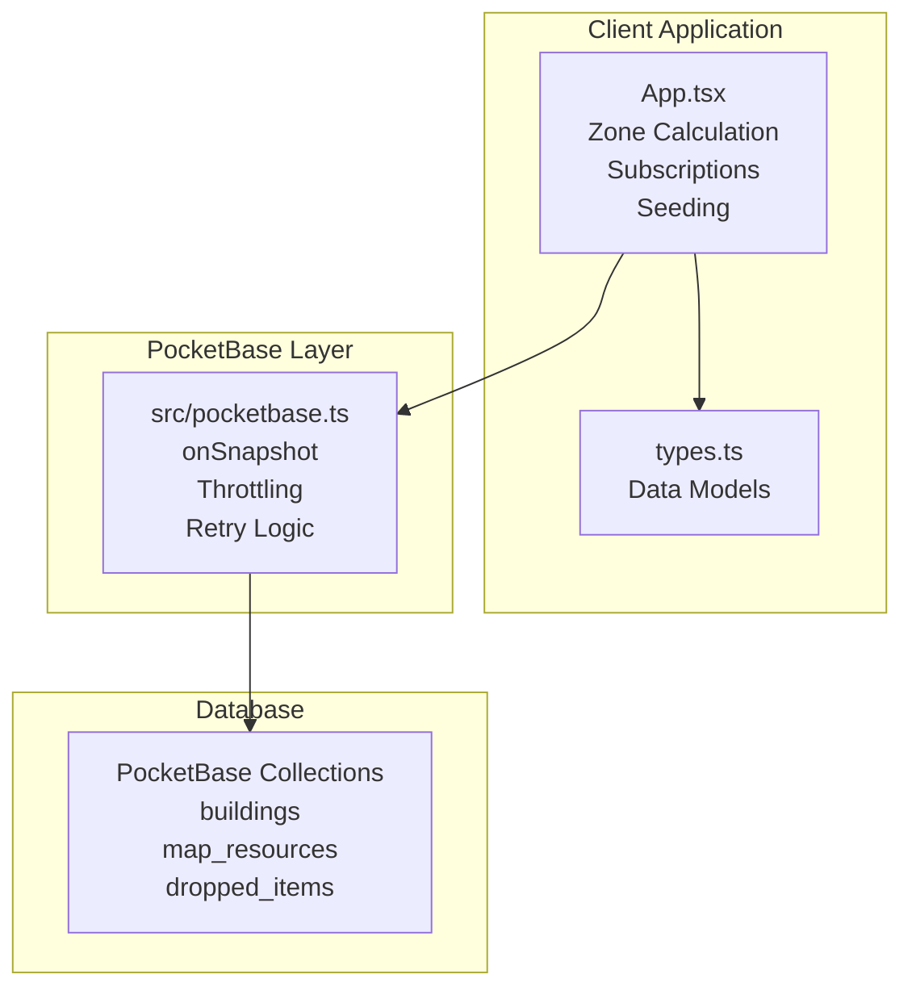
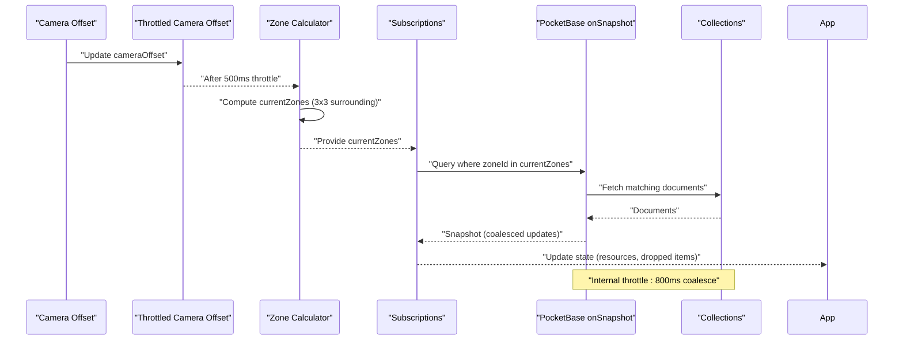
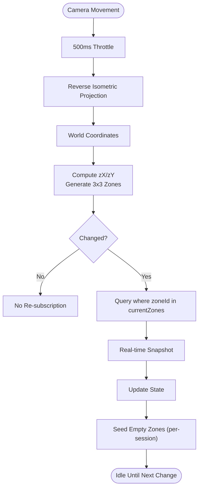
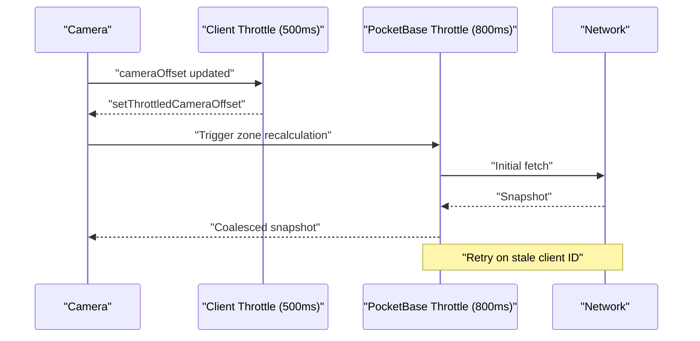
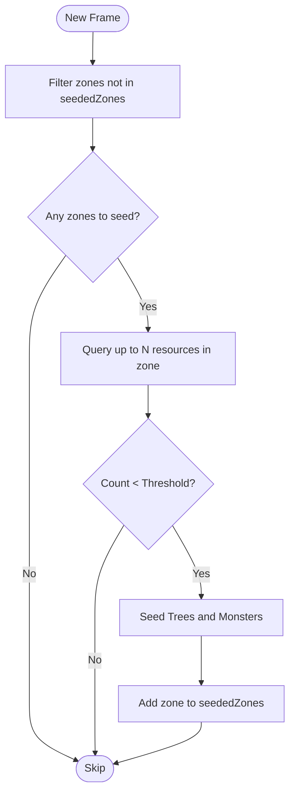
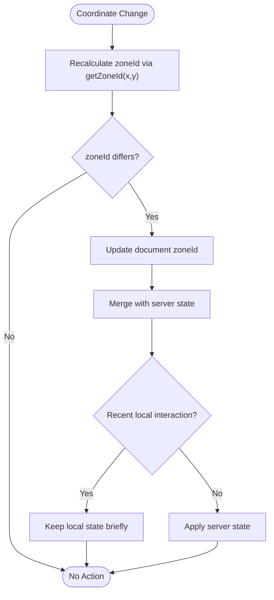
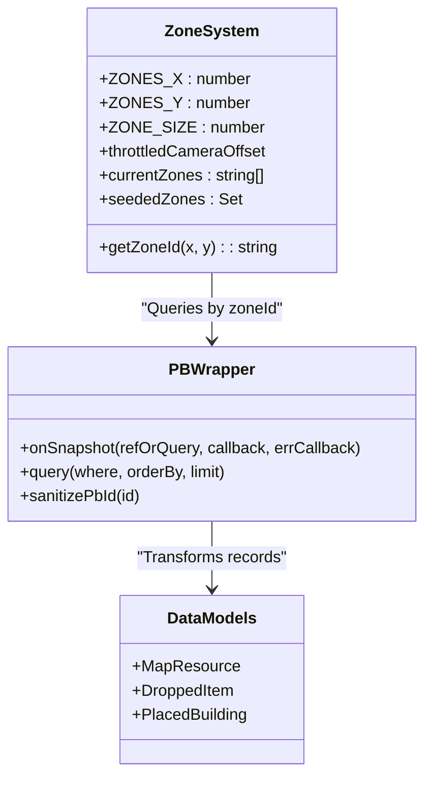
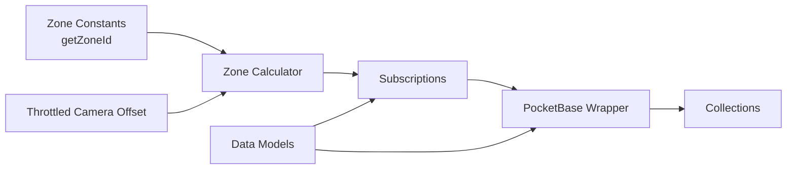

# Zone-Based Data Management

<cite>
**Referenced Files in This Document**
- [App.tsx](file://App.tsx)
- [pocketbase.ts](file://src/pocketbase.ts)
- [types.ts](file://types.ts)
- [migrate_zones_80.mjs](file://migrate_zones_80.mjs)
- [all_consts.txt](file://all_consts.txt)
- [README.md](file://README.md)
</cite>

## Table of Contents
1. [Introduction](#introduction)
2. [Project Structure](#project-structure)
3. [Core Components](#core-components)
4. [Architecture Overview](#architecture-overview)
5. [Detailed Component Analysis](#detailed-component-analysis)
6. [Dependency Analysis](#dependency-analysis)
7. [Performance Considerations](#performance-considerations)
8. [Troubleshooting Guide](#troubleshooting-guide)
9. [Conclusion](#conclusion)

## Introduction
This document explains the zone-based data management system that optimizes performance through spatial partitioning. The system divides the 200x200 tile world into a 5x5 grid of zones, where each zone covers 40x40 tiles. A dedicated getZoneId function computes zone identifiers from world coordinates. Camera movement is throttled to reduce unnecessary real-time subscriptions, and seededZones tracks which zones have been populated to avoid redundant seeding. The system prevents excessive real-time updates by subscribing only to relevant zones and by applying a secondary throttle at the PocketBase layer. Zone boundary handling ensures data consistency during transitions, and the relationship with PocketBase real-time synchronization is carefully managed to minimize bandwidth and CPU usage.

## Project Structure
The zone system spans several key files:
- App.tsx: Implements constants, throttled camera offset, zone calculation, subscription management, seededZones tracking, and zone seeding logic.
- src/pocketbase.ts: Provides a Firestore-compatible wrapper around PocketBase, including onSnapshot with internal throttling and retry logic for stale client IDs.
- types.ts: Defines data models for map resources, dropped items, and placed buildings, including zoneId fields.
- migrate_zones_80.mjs: Demonstrates the getZoneId function used historically for zone migrations.
- all_consts.txt: Contains references to zone-related constants and logic used across the application.

**Diagram sources**
- [App.tsx:388-820](file://App.tsx#L388-L820)
- [pocketbase.ts:578-707](file://src/pocketbase.ts#L578-L707)
- [types.ts:111-147](file://types.ts#L111-L147)

**Section sources**
- [App.tsx:388-820](file://App.tsx#L388-L820)
- [pocketbase.ts:578-707](file://src/pocketbase.ts#L578-L707)
- [types.ts:111-147](file://types.ts#L111-L147)

## Core Components
- Zone constants and calculation:
  - ZONES_X and ZONES_Y define the 5x5 grid.
  - ZONE_SIZE is 40, ensuring 200x200 total world coverage.
  - getZoneId computes zone identifiers from world coordinates.
- Throttled camera offset:
  - A 500 ms throttle reduces frequent zone recalculations and minimizes real-time subscription churn.
- Zone subscription management:
  - Subscriptions query collections by zoneId using an 'in' filter against currentZones.
  - Subscriptions are refreshed when currentZones changes.
- SeededZones tracking:
  - A Set<string> prevents repeated seeding of the same zones during a session.
- PocketBase real-time throttling:
  - Internal 800 ms throttle in onSnapshot coalesces rapid updates.
  - Retry logic handles stale client IDs gracefully.

**Section sources**
- [App.tsx:43-46](file://App.tsx#L43-L46)
- [App.tsx:45](file://App.tsx#L45)
- [App.tsx:570-576](file://App.tsx#L570-L576)
- [App.tsx:780-820](file://App.tsx#L780-L820)
- [App.tsx:822-877](file://App.tsx#L822-L877)
- [App.tsx:879-893](file://App.tsx#L879-L893)
- [App.tsx:896-953](file://App.tsx#L896-L953)
- [pocketbase.ts:678-700](file://src/pocketbase.ts#L678-L700)

## Architecture Overview
The zone-based system orchestrates camera-driven zone discovery, targeted subscriptions, and periodic seeding to balance performance and completeness.

**Diagram sources**
- [App.tsx:570-576](file://App.tsx#L570-L576)
- [App.tsx:780-820](file://App.tsx#L780-L820)
- [App.tsx:822-877](file://App.tsx#L822-L877)
- [App.tsx:879-893](file://App.tsx#L879-L893)
- [pocketbase.ts:678-700](file://src/pocketbase.ts#L678-L700)

## Detailed Component Analysis

### Zone Calculation and Subscription Management
- Zone calculation:
  - Uses reverse isometric projection to translate screen coordinates to world coordinates, then divides by ZONE_SIZE to compute zX and zY.
  - Generates a 3x3 neighborhood of zones around the camera to ensure smooth transitions.
- Subscription pattern:
  - Subscribes to map_resources and dropped_items using where('zoneId', 'in', currentZones).
  - Subscriptions are torn down and recreated when currentZones changes, preventing stale subscriptions.

**Diagram sources**
- [App.tsx:780-820](file://App.tsx#L780-L820)
- [App.tsx:822-877](file://App.tsx#L822-L877)
- [App.tsx:879-893](file://App.tsx#L879-L893)
- [App.tsx:896-953](file://App.tsx#L896-L953)

**Section sources**
- [App.tsx:780-820](file://App.tsx#L780-L820)
- [App.tsx:822-877](file://App.tsx#L822-L877)
- [App.tsx:879-893](file://App.tsx#L879-L893)
- [App.tsx:896-953](file://App.tsx#L896-L953)

### Throttled Camera Offsets and Real-Time Control
- Client-side throttle:
  - A 500 ms timeout updates throttledCameraOffset after each camera change, reducing zone recalculation frequency.
- PocketBase-level throttle:
  - onSnapshot internally throttles updates by 800 ms to coalesce rapid changes and reduce network overhead.
- Retry logic:
  - Handles stale client IDs by retrying subscriptions with exponential backoff.

**Diagram sources**
- [App.tsx:570-576](file://App.tsx#L570-L576)
- [pocketbase.ts:587-621](file://src/pocketbase.ts#L587-L621)
- [pocketbase.ts:678-700](file://src/pocketbase.ts#L678-L700)

**Section sources**
- [App.tsx:570-576](file://App.tsx#L570-L576)
- [pocketbase.ts:587-621](file://src/pocketbase.ts#L587-L621)
- [pocketbase.ts:678-700](file://src/pocketbase.ts#L678-L700)

### SeededZones Tracking and Zone Seeding
- SeededZones:
  - A per-session Set<string> tracks zones already checked for seeding to avoid redundant operations.
- Seeding logic:
  - For each currentZones not yet seen, queries up to N resources in the zone.
  - If the count is below a threshold, seeds the zone with trees and monsters.
  - Uses local occupancy tracking to avoid placing on occupied tiles.

**Diagram sources**
- [App.tsx:896-953](file://App.tsx#L896-L953)

**Section sources**
- [App.tsx:896-953](file://App.tsx#L896-L953)

### Zone Boundary Handling and Data Consistency
- Boundary safety:
  - Zone generation clamps coordinates to valid grid bounds (0..ZONES_X-1, 0..ZONES_Y-1).
- Data consistency:
  - Self-healing logic in building subscriptions recalculates and updates zoneId when coordinates change.
  - Sticky interaction logic prevents jitter by retaining local state briefly when recent interactions occurred.

**Diagram sources**
- [App.tsx:2109-2115](file://App.tsx#L2109-L2115)
- [App.tsx:2056-2070](file://App.tsx#L2056-L2070)

**Section sources**
- [App.tsx:2109-2115](file://App.tsx#L2109-L2115)
- [App.tsx:2056-2070](file://App.tsx#L2056-L2070)

### Relationship Between Zone Management and PocketBase Real-Time Synchronization
- Zone-to-collection mapping:
  - map_resources and dropped_items are queried by zoneId; buildings are filtered by ownerId for personal builds.
- Real-time throttling:
  - onSnapshot coalesces updates to reduce bandwidth and CPU usage.
- Retry and resilience:
  - Staggered subscription start and retry on stale client IDs improve reliability.

**Diagram sources**
- [App.tsx:43-46](file://App.tsx#L43-L46)
- [App.tsx:45](file://App.tsx#L45)
- [App.tsx:780-820](file://App.tsx#L780-L820)
- [pocketbase.ts:578-707](file://src/pocketbase.ts#L578-L707)
- [types.ts:111-147](file://types.ts#L111-L147)

**Section sources**
- [App.tsx:780-820](file://App.tsx#L780-L820)
- [pocketbase.ts:578-707](file://src/pocketbase.ts#L578-L707)
- [types.ts:111-147](file://types.ts#L111-L147)

## Dependency Analysis
- App.tsx depends on:
  - Zone constants and getZoneId for spatial partitioning.
  - Throttled camera offset to stabilize zone calculations.
  - Subscriptions to map_resources and dropped_items keyed by zoneId.
  - SeededZones to avoid redundant seeding.
- pocketbase.ts provides:
  - onSnapshot with internal throttling and retry logic.
  - Query builders and sanitization utilities.
- types.ts defines:
  - Data structures that include zoneId fields for spatial filtering.

**Diagram sources**
- [App.tsx:43-46](file://App.tsx#L43-L46)
- [App.tsx:45](file://App.tsx#L45)
- [App.tsx:570-576](file://App.tsx#L570-L576)
- [App.tsx:780-820](file://App.tsx#L780-L820)
- [pocketbase.ts:578-707](file://src/pocketbase.ts#L578-L707)
- [types.ts:111-147](file://types.ts#L111-L147)

**Section sources**
- [App.tsx:43-46](file://App.tsx#L43-L46)
- [App.tsx:45](file://App.tsx#L45)
- [App.tsx:570-576](file://App.tsx#L570-L576)
- [App.tsx:780-820](file://App.tsx#L780-L820)
- [pocketbase.ts:578-707](file://src/pocketbase.ts#L578-L707)
- [types.ts:111-147](file://types.ts#L111-L147)

## Performance Considerations
- Spatial partitioning:
  - 5x5 zones with 40x40 tiles reduce the volume of data fetched per frame.
- Client and server throttling:
  - 500 ms client throttle plus 800 ms PocketBase throttle minimize redundant network traffic.
- Selective subscriptions:
  - Subscribing only to currentZones avoids streaming unrelated world data.
- Seeding thresholds:
  - Seeding triggers only when zones are nearly empty, balancing completeness with efficiency.
- Data model alignment:
  - zoneId fields enable efficient filtering and reduce client-side filtering costs.

[No sources needed since this section provides general guidance]

## Troubleshooting Guide
- Zone boundaries:
  - Ensure coordinates remain within [0, WORLD_WIDTH_TILES) and [0, WORLD_HEIGHT_TILES). The zone calculator clamps to valid grid bounds.
- Stale client IDs:
  - onSnapshot retries on stale client ID errors; if persistent, verify network stability and subscription lifecycle.
- Inconsistent zoneIds:
  - Self-healing logic updates zoneId when coordinates change; monitor logs for correction events.
- Excessive real-time churn:
  - Verify the 500 ms client throttle and 800 ms PocketBase throttle are active; confirm subscriptions update only on currentZones changes.

**Section sources**
- [App.tsx:806-811](file://App.tsx#L806-L811)
- [pocketbase.ts:600-621](file://src/pocketbase.ts#L600-L621)
- [App.tsx:2109-2115](file://App.tsx#L2109-L2115)

## Conclusion
The zone-based data management system achieves significant performance gains by combining spatial partitioning, client and server throttling, and selective subscriptions. The 5x5 grid of 40x40 zones confines data streams to the player’s immediate vicinity, while throttled camera offsets and internal PocketBase throttling reduce unnecessary updates. SeededZones and boundary checks ensure data consistency and completeness without overwhelming the network. Together, these mechanisms deliver a responsive, scalable real-time experience aligned with PocketBase’s capabilities.