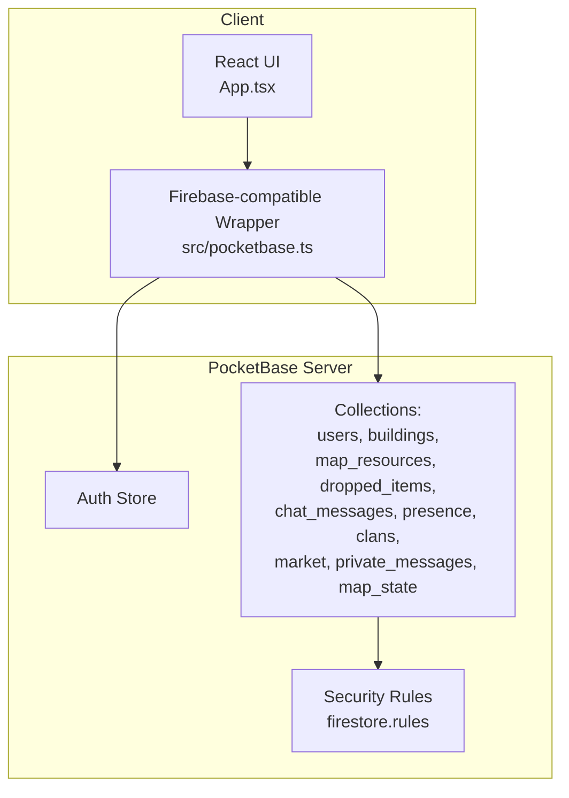
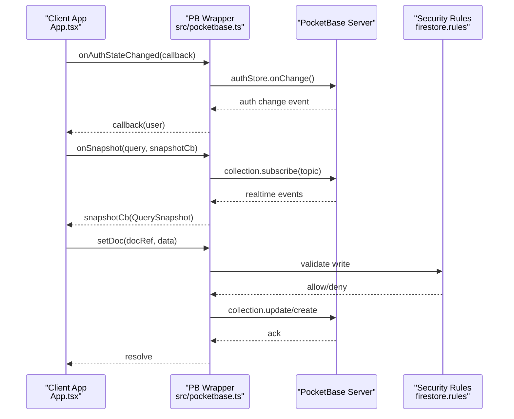
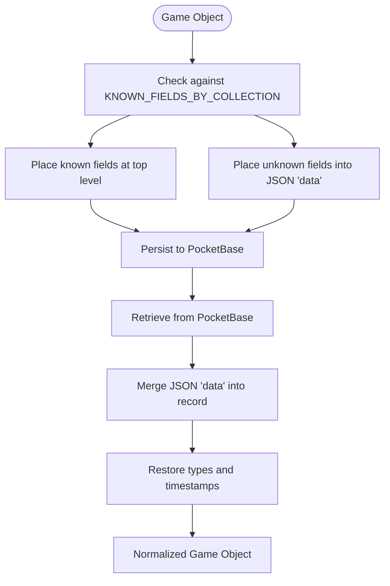
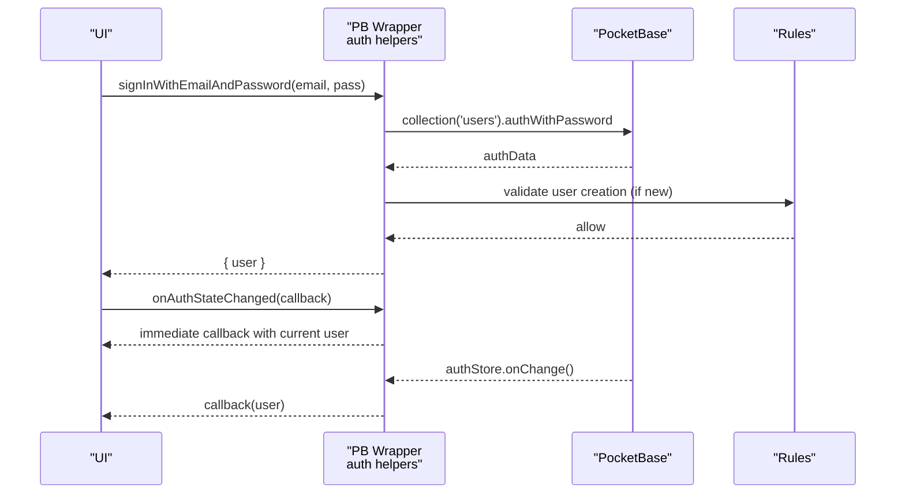
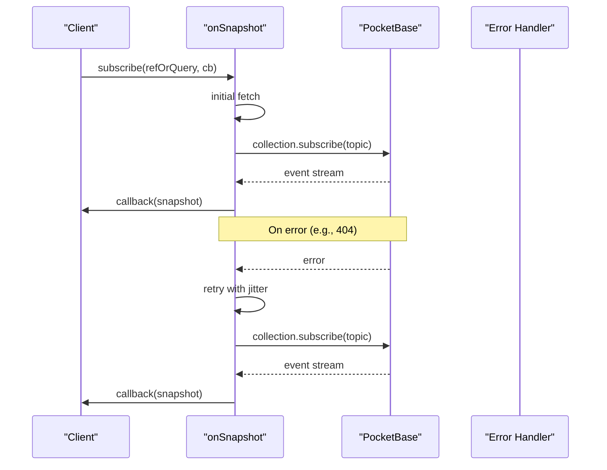
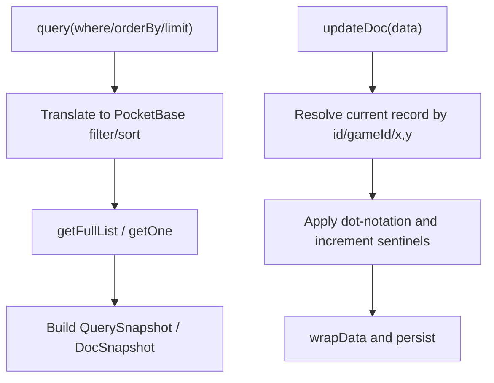
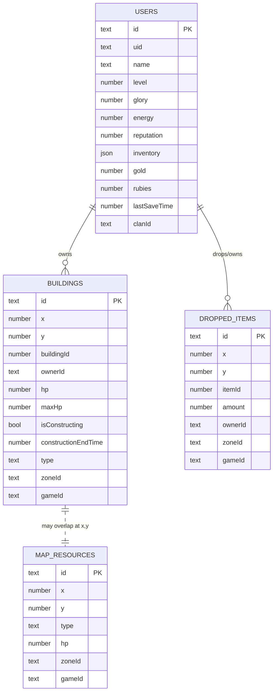
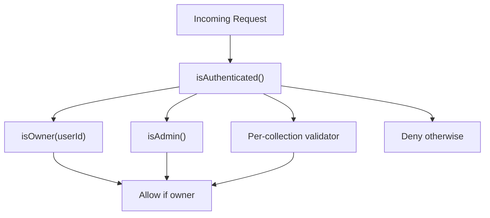
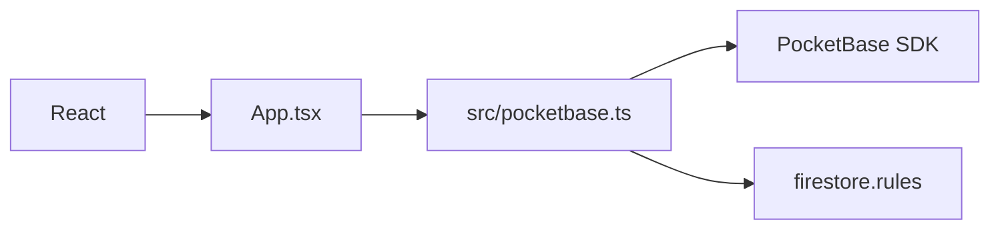

# Database Integration

<cite>
**Referenced Files in This Document**
- [pocketbase.ts](file://src/pocketbase.ts)
- [App.tsx](file://App.tsx)
- [types.ts](file://types.ts)
- [firestore.rules](file://firestore.rules)
- [firebase_dump.json](file://firebase_dump.json)
- [check_schema.mjs](file://check_schema.mjs)
- [fix_schema.mjs](file://fix_schema.mjs)
- [fix_schema_final.mjs](file://fix_schema_final.mjs)
- [migrate_zones_80.mjs](file://migrate_zones_80.mjs)
- [force_reload.mjs](file://force_reload.mjs)
- [dump_map_state.mjs](file://dump_map_state.mjs)
- [clean_orphans.mjs](file://clean_orphans.mjs)
- [package.json](file://package.json)
</cite>

## Table of Contents
1. [Introduction](#introduction)
2. [Project Structure](#project-structure)
3. [Core Components](#core-components)
4. [Architecture Overview](#architecture-overview)
5. [Detailed Component Analysis](#detailed-component-analysis)
6. [Dependency Analysis](#dependency-analysis)
7. [Performance Considerations](#performance-considerations)
8. [Troubleshooting Guide](#troubleshooting-guide)
9. [Conclusion](#conclusion)
10. [Appendices](#appendices)

## Introduction
This document provides comprehensive data model documentation for the PocketBase database integration powering the real-time multiplayer game. It covers the Firebase-compatible API wrapper, real-time subscriptions, data transformation layer between game objects and database records, security rules and authentication, authorization patterns, data access patterns, caching strategies, performance considerations for real-time synchronization, database schema relationships, automatic reconnection mechanisms, error handling, validation rules, data lifecycle management, retention policies, backup procedures, and practical examples of CRUD, real-time queries, and batch operations.

## Project Structure
The integration centers around a thin Firebase-compatible wrapper built on PocketBase’s JavaScript SDK. The wrapper exposes familiar Firestore-style APIs for authentication, document and collection operations, queries, and real-time subscriptions. Game state is synchronized via real-time subscriptions scoped to zones and filtered by ownership and entity types. Security is enforced by PocketBase collection-level rules mirroring legacy Firestore rules.

**Diagram sources**
- [pocketbase.ts:1-825](file://src/pocketbase.ts#L1-L825)
- [App.tsx:1-8217](file://App.tsx#L1-L8217)
- [firestore.rules:1-355](file://firestore.rules#L1-L355)

**Section sources**
- [pocketbase.ts:1-825](file://src/pocketbase.ts#L1-L825)
- [App.tsx:1-8217](file://App.tsx#L1-L8217)
- [firestore.rules:1-355](file://firestore.rules#L1-L355)

## Core Components
- Firebase-compatible API wrapper:
  - Authentication: sign-in/sign-up with email/password, Google OAuth, sign-out, onAuthStateChanged.
  - Document and collection operations: getDoc, setDoc, updateDoc, deleteDoc, getDocs.
  - Query builder: query, where, orderBy, limit with PocketBase filter translation.
  - Real-time subscriptions: onSnapshot with automatic retry on stale client ID errors.
  - Transactions and batch writes: runTransaction and writeBatch.
  - Data transformation helpers: wrapData and unwrapData to normalize schema and preserve game IDs.
  - ID sanitization: sanitizePbId to enforce strict 15-character alphanumeric IDs.
- Security rules:
  - Owner checks, admin/moderator checks, clan membership checks, and per-collection validators.
  - Field-level validation and restricted updates for sensitive fields.
- Migration and maintenance scripts:
  - Schema alignment, zone grid migration, orphan cleanup, and global reload signaling.

**Section sources**
- [pocketbase.ts:14-825](file://src/pocketbase.ts#L14-L825)
- [firestore.rules:1-355](file://firestore.rules#L1-L355)
- [fix_schema.mjs:1-158](file://fix_schema.mjs#L1-L158)
- [fix_schema_final.mjs:1-79](file://fix_schema_final.mjs#L1-L79)
- [migrate_zones_80.mjs:1-59](file://migrate_zones_80.mjs#L1-L59)
- [clean_orphans.mjs:1-40](file://clean_orphans.mjs#L1-L40)
- [force_reload.mjs:1-47](file://force_reload.mjs#L1-L47)

## Architecture Overview
The system uses a Firebase-like API surface backed by PocketBase. The wrapper translates game objects into normalized records with top-level filterable fields and a JSON data payload. Real-time subscriptions are scoped to collections and topics, with automatic retry logic for transient errors. Security rules enforce ownership, roles, and field restrictions.

**Diagram sources**
- [pocketbase.ts:571-707](file://src/pocketbase.ts#L571-L707)
- [pocketbase.ts:787-800](file://src/pocketbase.ts#L787-L800)
- [firestore.rules:240-355](file://firestore.rules#L240-L355)

## Detailed Component Analysis

### Data Model and Transformation Layer
- Known fields by collection define top-level filterable attributes for efficient querying and indexing.
- wrapData moves non-known fields into a JSON data payload while preserving known fields at the top level.
- unwrapData merges the JSON payload back into the record and restores types, ensuring compatibility with game logic.
- sanitizePbId ensures all records use exactly 15-character alphanumeric IDs, enforcing strict uniqueness and indexing.

**Diagram sources**
- [pocketbase.ts:145-218](file://src/pocketbase.ts#L145-L218)
- [pocketbase.ts:252-276](file://src/pocketbase.ts#L252-L276)

**Section sources**
- [pocketbase.ts:145-218](file://src/pocketbase.ts#L145-L218)
- [pocketbase.ts:252-276](file://src/pocketbase.ts#L252-L276)

### Authentication and Authorization
- Authentication:
  - Email/password sign-in and sign-up with automatic post-creation initialization.
  - Google OAuth sign-in mapped to provider auth.
  - onAuthStateChanged mirrors Firebase behavior with immediate callback and onChange subscription.
- Authorization:
  - Owner-only operations for user profiles and buildings.
  - Admin/moderator privileges for elevated actions.
  - Clan membership checks for clan-related operations.
  - Restricted updates for sensitive fields (e.g., bans, reputation adjustments).

**Diagram sources**
- [pocketbase.ts:18-121](file://src/pocketbase.ts#L18-L121)
- [firestore.rules:246-262](file://firestore.rules#L246-L262)

**Section sources**
- [pocketbase.ts:18-121](file://src/pocketbase.ts#L18-L121)
- [firestore.rules:60-80](file://firestore.rules#L60-L80)
- [firestore.rules:246-262](file://firestore.rules#L246-L262)

### Real-Time Subscriptions and Automatic Reconnection
- onSnapshot supports single-doc and collection/query subscriptions.
- Automatic retry on “stale client ID” errors (HTTP 404) with exponential backoff-like delays.
- Initial fetch followed by subscription to minimize gaps.
- Throttled rebuild of QuerySnapshot for collection subscriptions to avoid overload.

**Diagram sources**
- [pocketbase.ts:578-707](file://src/pocketbase.ts#L578-L707)

**Section sources**
- [pocketbase.ts:578-707](file://src/pocketbase.ts#L578-L707)

### Data Access Patterns and Batch Operations
- CRUD:
  - getDoc/getDocs for reads.
  - setDoc performs robust upsert using existence checks.
  - updateDoc supports dot notation and numeric increments via sentinel markers.
  - deleteDoc handles both ID and composite key scenarios.
- Queries:
  - query with where/in/array-contains, orderBy, limit translated to PocketBase filters.
- Transactions and batch:
  - runTransaction queues operations and executes them sequentially.
  - writeBatch batches operations and commits them concurrently.

**Diagram sources**
- [pocketbase.ts:487-560](file://src/pocketbase.ts#L487-L560)
- [pocketbase.ts:337-448](file://src/pocketbase.ts#L337-L448)
- [pocketbase.ts:724-765](file://src/pocketbase.ts#L724-L765)

**Section sources**
- [pocketbase.ts:288-448](file://src/pocketbase.ts#L288-L448)
- [pocketbase.ts:487-560](file://src/pocketbase.ts#L487-L560)
- [pocketbase.ts:724-765](file://src/pocketbase.ts#L724-L765)

### Database Schema and Entity Relationships
The game defines core entities with typed interfaces. The PocketBase schema is aligned to support these entities and real-time filtering.

**Diagram sources**
- [types.ts:100-147](file://types.ts#L100-L147)
- [fix_schema.mjs:5-89](file://fix_schema.mjs#L5-L89)
- [fix_schema_final.mjs:4-35](file://fix_schema_final.mjs#L4-L35)

**Section sources**
- [types.ts:100-147](file://types.ts#L100-L147)
- [fix_schema.mjs:5-89](file://fix_schema.mjs#L5-L89)
- [fix_schema_final.mjs:4-35](file://fix_schema_final.mjs#L4-L35)

### Security Rules and Validation
- Owner checks ensure only the record owner can modify their own data.
- Admin/moderator privileges enable elevated operations.
- Clan membership checks restrict access to clan-related documents.
- Per-field validators enforce data shape and constraints.
- Restricted updates prevent unauthorized changes to sensitive fields.

**Diagram sources**
- [firestore.rules:60-80](file://firestore.rules#L60-L80)
- [firestore.rules:102-127](file://firestore.rules#L102-L127)
- [firestore.rules:246-291](file://firestore.rules#L246-L291)

**Section sources**
- [firestore.rules:60-80](file://firestore.rules#L60-L80)
- [firestore.rules:102-127](file://firestore.rules#L102-L127)
- [firestore.rules:246-291](file://firestore.rules#L246-L291)

### Practical Examples
- CRUD operations:
  - Create a building: setDoc(doc('buildings', `${gameId}`), buildingData).
  - Update a building: updateDoc(doc('buildings', `${gameId}`), { hp: increment(-10) }).
  - Delete a dropped item: deleteDoc(doc('dropped_items', `${x}_${y}`)).
- Real-time queries:
  - Subscribe to user buildings: onSnapshot(query('buildings', where('ownerId', '==', uid)), cb).
  - Subscribe to map resources in a zone: onSnapshot(query('map_resources', where('zoneId', '==', zoneId)), cb).
- Batch operations:
  - writeBatch(db).set(...).update(...).commit().

**Section sources**
- [pocketbase.ts:288-448](file://src/pocketbase.ts#L288-L448)
- [pocketbase.ts:487-560](file://src/pocketbase.ts#L487-L560)
- [pocketbase.ts:748-765](file://src/pocketbase.ts#L748-L765)

## Dependency Analysis
- Client dependencies include React, PocketBase SDK, and UI libraries.
- The wrapper depends on PocketBase for authentication, CRUD, queries, and subscriptions.
- Security rules depend on the schema and field definitions.

**Diagram sources**
- [package.json:12-21](file://package.json#L12-L21)
- [pocketbase.ts:1-11](file://src/pocketbase.ts#L1-L11)
- [firestore.rules:1-355](file://firestore.rules#L1-L355)

**Section sources**
- [package.json:12-21](file://package.json#L12-L21)
- [pocketbase.ts:1-11](file://src/pocketbase.ts#L1-L11)

## Performance Considerations
- Real-time throttling: Collection snapshots are throttled to reduce server load during bursts.
- Zone-based subscriptions: Clients subscribe to relevant zones to minimize unnecessary updates.
- Batch deletions: deleteAll uses chunked deletions to avoid server overload.
- ID sanitization: Enforcing 15-char IDs improves indexing and lookup performance.
- Type restoration: Minimizing type conversions in unwrapData reduces overhead.

[No sources needed since this section provides general guidance]

## Troubleshooting Guide
- Stale client ID errors:
  - The wrapper retries subscriptions with jitter on HTTP 404 errors.
- Expected race conditions:
  - The game loop ignores specific permission and not-found errors to avoid noisy logs.
- Error logging:
  - handleFirestoreError centralizes error reporting with operation type and path.

**Section sources**
- [pocketbase.ts:587-621](file://src/pocketbase.ts#L587-L621)
- [App.tsx:27-33](file://App.tsx#L27-L33)
- [pocketbase.ts:787-800](file://src/pocketbase.ts#L787-L800)

## Conclusion
The PocketBase integration provides a robust, Firebase-like API surface for a real-time multiplayer game. The wrapper normalizes data, enforces strict ID constraints, and offers efficient real-time subscriptions with automatic reconnection. Security rules ensure proper ownership and role-based access. Migration scripts keep the schema aligned with game requirements, and operational scripts support maintenance and global updates.

[No sources needed since this section summarizes without analyzing specific files]

## Appendices

### Database Schema Alignment Scripts
- Schema inspection and fixes ensure required fields exist for game queries.
- Final schema alignment script adds missing fields consistently.
- Zone migration script recalculates zone IDs for existing records.
- Orphan cleanup removes invalid building records.
- Global reload script triggers a forced refresh across clients.

**Section sources**
- [check_schema.mjs:1-22](file://check_schema.mjs#L1-L22)
- [fix_schema.mjs:1-158](file://fix_schema.mjs#L1-L158)
- [fix_schema_final.mjs:1-79](file://fix_schema_final.mjs#L1-L79)
- [migrate_zones_80.mjs:1-59](file://migrate_zones_80.mjs#L1-L59)
- [clean_orphans.mjs:1-40](file://clean_orphans.mjs#L1-L40)
- [force_reload.mjs:1-47](file://force_reload.mjs#L1-L47)

### Example Data Dump Reference
- firebase_dump.json demonstrates typical records for users, buildings, and map resources, aiding schema understanding and testing.

**Section sources**
- [firebase_dump.json:1-800](file://firebase_dump.json#L1-L800)