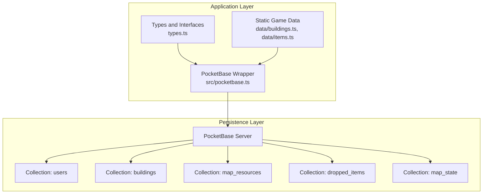
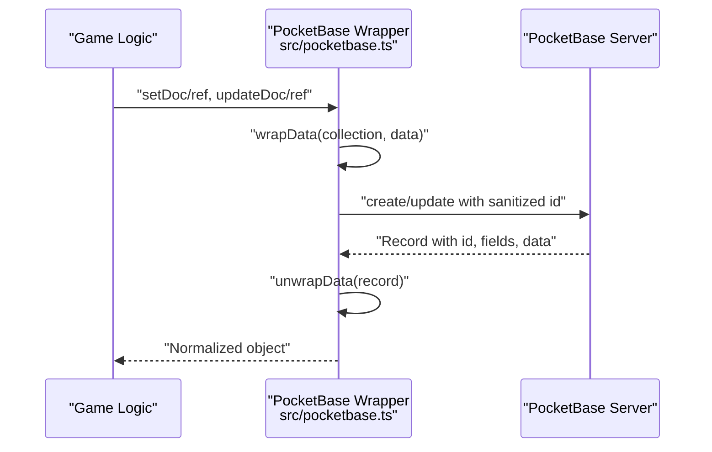
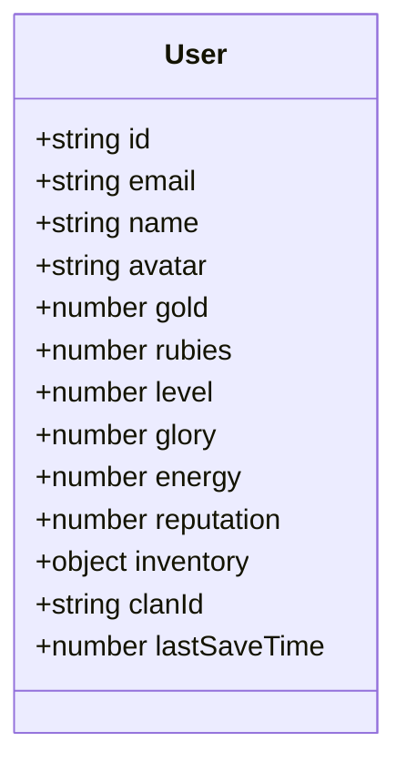
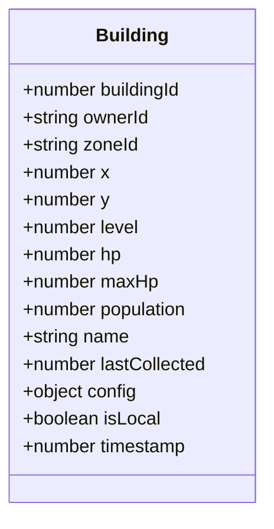
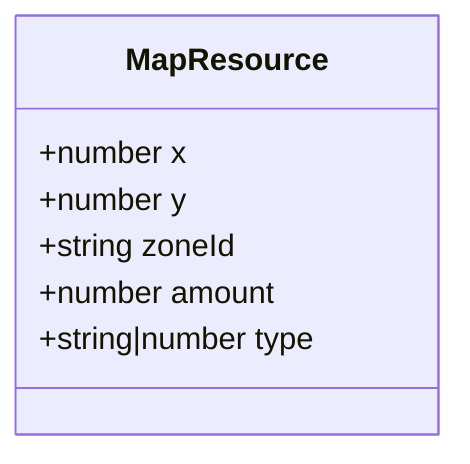
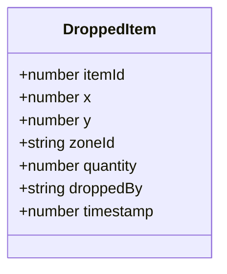
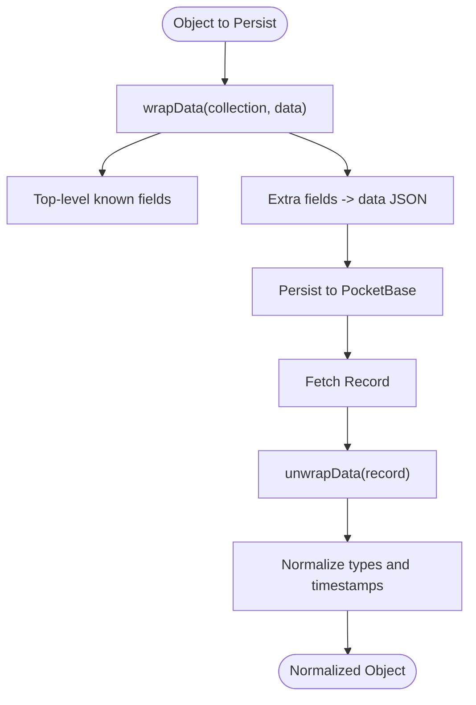
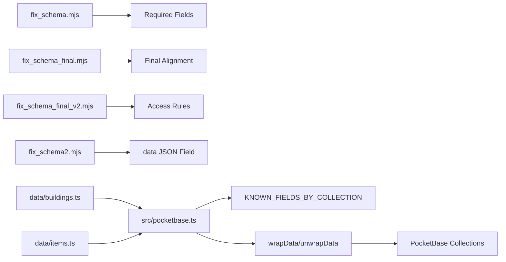

# Core Collections

<cite>
**Referenced Files in This Document**
- [types.ts](file://types.ts)
- [fix_schema.mjs](file://fix_schema.mjs)
- [fix_schema_final.mjs](file://fix_schema_final.mjs)
- [fix_schema_final_v2.mjs](file://fix_schema_final_v2.mjs)
- [fix_schema2.mjs](file://fix_schema2.mjs)
- [check_schema.mjs](file://check_schema.mjs)
- [dump_map_state.mjs](file://dump_map_state.mjs)
- [pocketbase.ts](file://src/pocketbase.ts)
- [buildings.ts](file://data/buildings.ts)
- [items.ts](file://data/items.ts)
</cite>

## Table of Contents
1. [Introduction](#introduction)
2. [Project Structure](#project-structure)
3. [Core Components](#core-components)
4. [Architecture Overview](#architecture-overview)
5. [Detailed Component Analysis](#detailed-component-analysis)
6. [Dependency Analysis](#dependency-analysis)
7. [Performance Considerations](#performance-considerations)
8. [Troubleshooting Guide](#troubleshooting-guide)
9. [Conclusion](#conclusion)

## Introduction
This document describes the core PocketBase collections that underpin the Basingsemmorpg game state: users, buildings, map_resources, and dropped_items. It defines field schemas, data types, validation rules, relationships, and operational semantics. It also explains how the application transforms game objects into database records using a strict schema and a JSON data field for flexible storage, and outlines indexing and query patterns for optimal performance.

## Project Structure
The repository organizes game data models in TypeScript interfaces and maintains PocketBase schema definitions via migration scripts. The PocketBase client wrapper enforces schema compliance and normalizes data between the application and the database.

**Diagram sources**
- [pocketbase.ts:150-161](file://src/pocketbase.ts#L150-L161)
- [fix_schema.mjs:5-89](file://fix_schema.mjs#L5-L89)
- [fix_schema_final.mjs:4-35](file://fix_schema_final.mjs#L4-L35)
- [fix_schema_final_v2.mjs:5-38](file://fix_schema_final_v2.mjs#L5-L38)
- [fix_schema2.mjs:18-38](file://fix_schema2.mjs#L18-L38)

**Section sources**
- [types.ts:1-197](file://types.ts#L1-L197)
- [pocketbase.ts:150-161](file://src/pocketbase.ts#L150-L161)
- [fix_schema.mjs:5-89](file://fix_schema.mjs#L5-L89)
- [fix_schema_final.mjs:4-35](file://fix_schema_final.mjs#L4-L35)
- [fix_schema_final_v2.mjs:5-38](file://fix_schema_final_v2.mjs#L5-L38)
- [fix_schema2.mjs:18-38](file://fix_schema2.mjs#L18-L38)

## Core Components
This section defines the core collections and their fields, types, and roles in the game state.

- users
  - Purpose: Player account and profile storage.
  - Required top-level fields (schema alignment):
    - name: text
    - avatar: text
    - gameId: text
    - data: json
    - gold: number
    - rubies: number
    - level: number
    - glory: number
    - energy: number
    - reputation: number
    - inventory: json
    - clanId: text
    - lastSaveTime: number
  - Notes:
    - Profile stats (level, glory, energy, reputation) are stored as numeric fields.
    - Inventory is a JSON blob for flexible item stacks and metadata.
    - The wrapper normalizes ids and timestamps for consistency.

- buildings
  - Purpose: Persistent building instances across zones.
  - Required top-level fields (schema alignment):
    - ownerId: text
    - zoneId: text
    - x: number
    - y: number
    - data: json
    - gameId: text
    - buildingId: number
  - Additional tracked fields (from game logic):
    - level: number
    - hp, maxHp: number
    - population: number
    - name: text
    - lastCollected: number
    - config: json
    - isLocal: bool
    - timestamp: number
  - Notes:
    - Positional data (x, y) and ownership (ownerId) enable spatial queries.
    - Health and construction state are part of the JSON data field.

- map_resources
  - Purpose: Temporary resource nodes on the map.
  - Required top-level fields (schema alignment):
    - type: text
    - x: number
    - y: number
    - zoneId: text
    - data: json
    - gameId: text
  - Additional tracked fields (from game logic):
    - amount: number
  - Notes:
    - Resource types are tree, oil, quarry, chest (as strings or numbers depending on normalization).
    - Extraction mechanics are handled by game logic; the DB tracks remaining amount and position.

- dropped_items
  - Purpose: Floating loot on the map for temporary collection.
  - Required top-level fields (schema alignment):
    - itemId: number
    - zoneId: text
    - data: json
    - gameId: text
  - Additional tracked fields (from game logic):
    - x, y: number
    - quantity: number
    - droppedBy: text
    - timestamp: number
  - Notes:
    - Ownership constraints can be encoded in data for restricted pickups.
    - Cleanup policies can leverage timestamp or amount=0.

**Section sources**
- [fix_schema.mjs:5-23](file://fix_schema.mjs#L5-L23)
- [fix_schema.mjs:60-76](file://fix_schema.mjs#L60-L76)
- [fix_schema_final.mjs:4-35](file://fix_schema_final.mjs#L4-L35)
- [fix_schema_final_v2.mjs:5-38](file://fix_schema_final_v2.mjs#L5-L38)
- [fix_schema2.mjs:18-38](file://fix_schema2.mjs#L18-L38)
- [pocketbase.ts:150-161](file://src/pocketbase.ts#L150-L161)
- [types.ts:100-147](file://types.ts#L100-L147)
- [types.ts:111-117](file://types.ts#L111-L117)

## Architecture Overview
The PocketBase wrapper enforces schema compliance and normalizes data between the application and the database. Game objects are split into known filterable fields and a JSON data blob to accommodate evolving structures.

**Diagram sources**
- [pocketbase.ts:165-218](file://src/pocketbase.ts#L165-L218)
- [pocketbase.ts:338-426](file://src/pocketbase.ts#L338-L426)

**Section sources**
- [pocketbase.ts:145-218](file://src/pocketbase.ts#L145-L218)
- [pocketbase.ts:338-426](file://src/pocketbase.ts#L338-L426)

## Detailed Component Analysis

### User Profile Model
- Fields
  - Account attributes: email, name, avatar, uid alias, verified.
  - Game stats: gold, rubies, level, glory, energy, reputation.
  - Inventory: JSON object for item stacks and metadata.
  - Clans: clanId for affiliation.
  - Persistence: lastSaveTime for sync and rollback.
- Validation and normalization
  - The wrapper ensures top-level known fields are preserved and non-system extras go into data.
  - Timestamps are normalized from created when missing.
- Relationships
  - Players own buildings (ownerId).
  - Players can drop items (droppedBy).
  - Players belong to clans (clanId).

**Diagram sources**
- [pocketbase.ts:39-45](file://src/pocketbase.ts#L39-L45)
- [fix_schema.mjs:151](file://fix_schema.mjs#L151)

**Section sources**
- [pocketbase.ts:39-45](file://src/pocketbase.ts#L39-L45)
- [fix_schema.mjs:151](file://fix_schema.mjs#L151)

### Building System
- Fields
  - Spatial: x, y
  - Ownership: ownerId, zoneId
  - Identity: buildingId, gameId
  - Stats: level, hp, maxHp, population, name, lastCollected
  - Config: config (JSON)
  - Flags: isLocal, timestamp
  - Data: arbitrary game state (data JSON)
- Construction and health
  - Construction progress and state are stored in data.
  - Health is tracked via hp/maxHp.
- Relationships
  - Owned by a user (ownerId).
  - Zone-scoped (zoneId) for spatial queries.

**Diagram sources**
- [fix_schema.mjs:6-23](file://fix_schema.mjs#L6-L23)
- [types.ts:119-147](file://types.ts#L119-L147)

**Section sources**
- [fix_schema.mjs:6-23](file://fix_schema.mjs#L6-L23)
- [types.ts:119-147](file://types.ts#L119-L147)

### Map Resource Types and Extraction Mechanics
- Fields
  - type: text or number (normalized)
  - Position: x, y
  - Scope: zoneId
  - Data: arbitrary resource state (data JSON)
  - Additional tracked: amount (remaining)
- Resource types
  - tree, oil, quarry, chest (as strings or numbers depending on normalization).
- Extraction mechanics
  - Game logic decrements amount or removes the record upon depletion.
  - Ownership and cooldowns can be stored in data.

**Diagram sources**
- [fix_schema.mjs:60-67](file://fix_schema.mjs#L60-L67)
- [types.ts:111-117](file://types.ts#L111-L117)

**Section sources**
- [fix_schema.mjs:60-67](file://fix_schema.mjs#L60-L67)
- [types.ts:111-117](file://types.ts#L111-L117)

### Dropped Items System
- Fields
  - Identity: itemId, zoneId, gameId
  - Position: x, y
  - Quantity: quantity
  - Origin: droppedBy
  - Timestamp: timestamp
  - Data: arbitrary pickup rules (data JSON)
- Behavior
  - Temporary loot; cleanup on collection or expiry.
  - Optional owner restriction via data.

**Diagram sources**
- [fix_schema.mjs:68-76](file://fix_schema.mjs#L68-L76)
- [types.ts:100-109](file://types.ts#L100-L109)

**Section sources**
- [fix_schema.mjs:68-76](file://fix_schema.mjs#L68-L76)
- [types.ts:100-109](file://types.ts#L100-L109)

### JSON Data Field Usage and Transformation
- Purpose
  - Store arbitrary game state without schema churn.
- Transformation
  - wrapData: moves non-system, known-filterable fields to top-level; others into data.
  - unwrapData: merges data back, restores types, normalizes timestamps, strips accidental flags.
- Id normalization
  - Sanitization to exactly 15-character alphanumeric ids for PocketBase.

**Diagram sources**
- [pocketbase.ts:165-218](file://src/pocketbase.ts#L165-L218)
- [pocketbase.ts:252-276](file://src/pocketbase.ts#L252-L276)

**Section sources**
- [pocketbase.ts:165-218](file://src/pocketbase.ts#L165-L218)
- [pocketbase.ts:252-276](file://src/pocketbase.ts#L252-L276)

## Dependency Analysis
- Schema enforcement
  - Migration scripts define required fields per collection.
  - Final alignment scripts add missing fields and open access rules.
- Wrapper dependencies
  - KNOWN_FIELDS_BY_COLLECTION lists top-level filterable fields per collection.
  - wrapData/unwrapData depend on these lists and system fields.
- Game data dependencies
  - Static building/item definitions inform buildingId and itemId references.

**Diagram sources**
- [fix_schema.mjs:5-89](file://fix_schema.mjs#L5-L89)
- [fix_schema_final.mjs:4-35](file://fix_schema_final.mjs#L4-L35)
- [fix_schema_final_v2.mjs:5-38](file://fix_schema_final_v2.mjs#L5-L38)
- [fix_schema2.mjs:18-38](file://fix_schema2.mjs#L18-L38)
- [pocketbase.ts:150-161](file://src/pocketbase.ts#L150-L161)
- [buildings.ts:1-800](file://data/buildings.ts#L1-L800)
- [items.ts:1-415](file://data/items.ts#L1-L415)

**Section sources**
- [fix_schema.mjs:5-89](file://fix_schema.mjs#L5-L89)
- [fix_schema_final.mjs:4-35](file://fix_schema_final.mjs#L4-L35)
- [fix_schema_final_v2.mjs:5-38](file://fix_schema_final_v2.mjs#L5-L38)
- [fix_schema2.mjs:18-38](file://fix_schema2.mjs#L18-L38)
- [pocketbase.ts:150-161](file://src/pocketbase.ts#L150-L161)
- [buildings.ts:1-800](file://data/buildings.ts#L1-L800)
- [items.ts:1-415](file://data/items.ts#L1-L415)

## Performance Considerations
- Indexing and query patterns
  - Spatial queries: filter by zoneId, x, y for buildings and map_resources.
  - Ownership queries: filter by ownerId for buildings and dropped_items.
  - Type filtering: filter by type for map_resources.
  - Sorting: order by timestamp or updated for recency.
- Data layout
  - Keep frequently filtered fields at top-level (zoneId, ownerId, type, itemId, buildingId).
  - Use the data JSON field for large or rarely queried structures to minimize schema bloat.
- Batch operations
  - Use getFullList with filters and sorts to reduce client-side filtering.
  - Chunk deletions to avoid server overload.
- Id normalization
  - Sanitized 15-char ids improve consistency and reduce lookup overhead.

**Section sources**
- [pocketbase.ts:487-560](file://src/pocketbase.ts#L487-L560)
- [pocketbase.ts:451-469](file://src/pocketbase.ts#L451-L469)
- [fix_schema.mjs:6, 60, 68:6-6](file://fix_schema.mjs#L6-L6)
- [fix_schema.mjs:60-67](file://fix_schema.mjs#L60-L67)
- [fix_schema.mjs:68-76](file://fix_schema.mjs#L68-L76)

## Troubleshooting Guide
- Schema mismatches
  - Use check_schema to enumerate fields and compare against required sets.
  - Apply fix_schema and fix_schema_final to add missing fields.
- Access and permissions
  - Ensure listRule/viewRule/createRule/updateRule are set appropriately after schema updates.
- Data anomalies
  - Verify that isLocal is stripped during unwrapData to prevent ghost records.
  - Confirm type restoration for buildingId and map_resource type.
- Debugging
  - Dump map_state to inspect global state snapshots.
  - Inspect transformed records via wrapper logs and error handling.

**Section sources**
- [check_schema.mjs:5-21](file://check_schema.mjs#L5-L21)
- [fix_schema.mjs:91-157](file://fix_schema.mjs#L91-L157)
- [fix_schema_final.mjs:37-79](file://fix_schema_final.mjs#L37-L79)
- [fix_schema_final_v2.mjs:40-93](file://fix_schema_final_v2.mjs#L40-L93)
- [pocketbase.ts:194-218](file://src/pocketbase.ts#L194-L218)
- [dump_map_state.mjs:1-12](file://dump_map_state.mjs#L1-L12)

## Conclusion
The PocketBase-backed data model for Basingsemmorpg separates stable, filterable fields from flexible JSON blobs to balance schema stability and extensibility. The wrapper enforces strict id normalization, type restoration, and timestamp handling. With targeted indexing on zoneId, ownerId, type, and itemId, and careful use of batch operations, the system supports responsive gameplay and reliable synchronization.