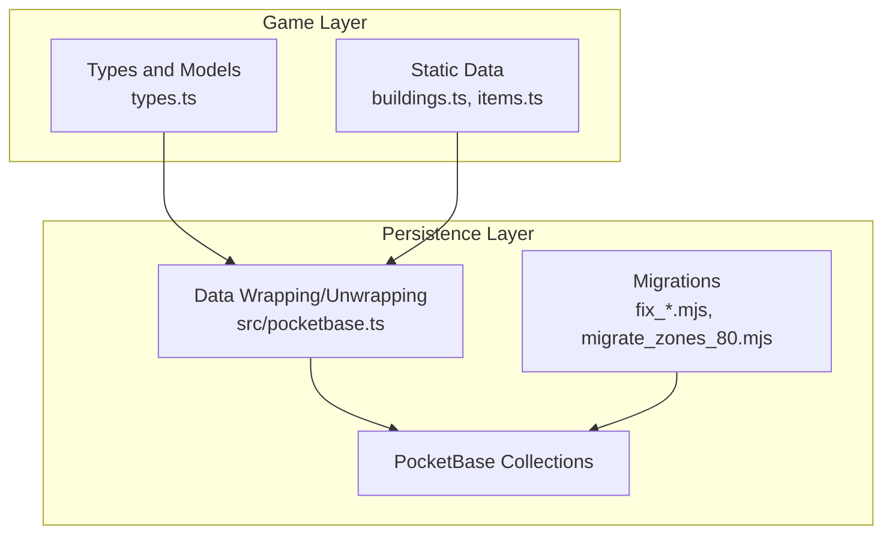
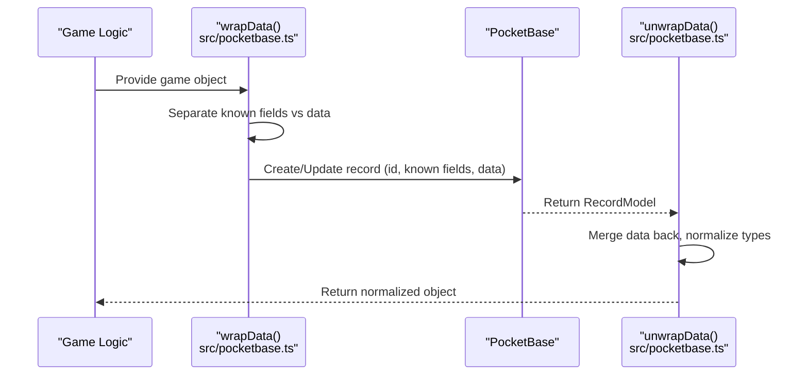
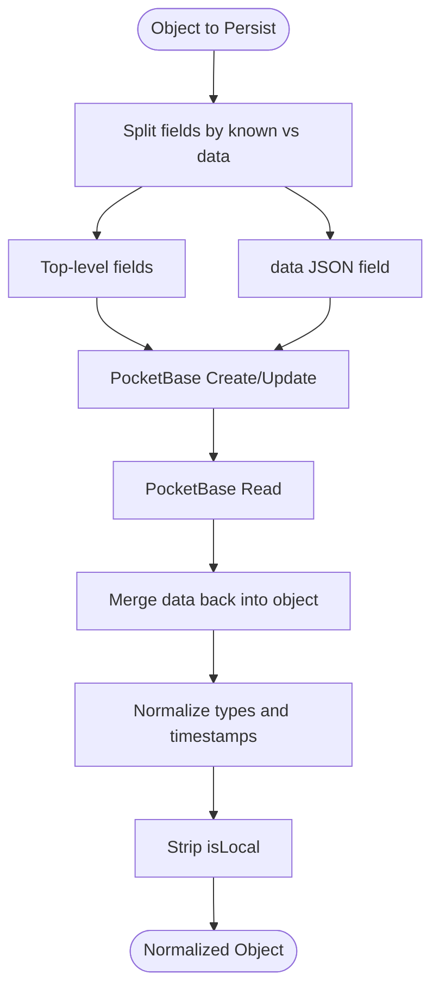
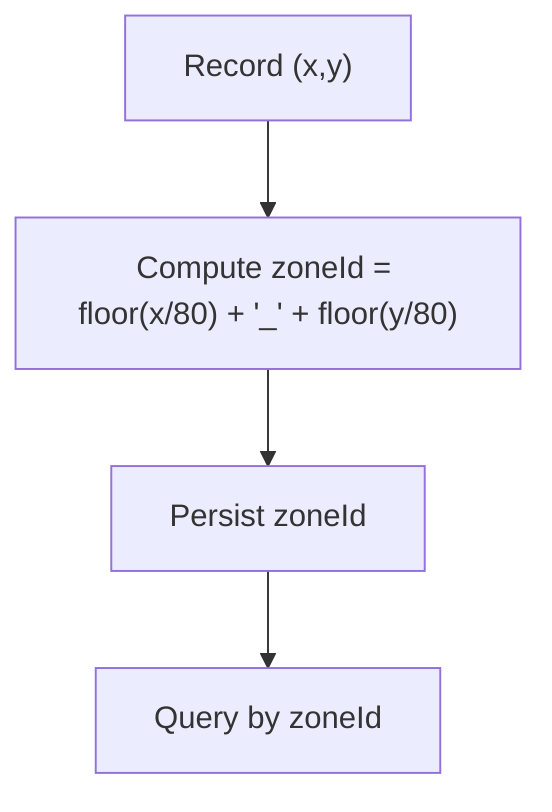
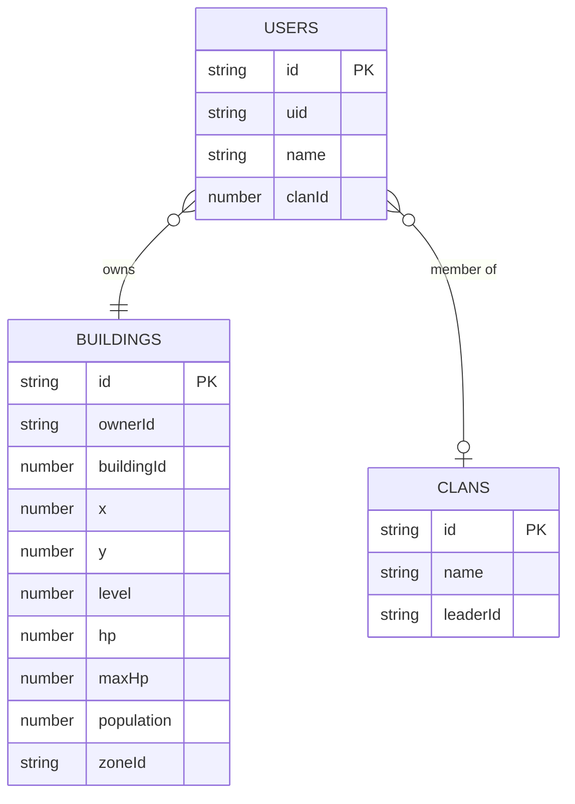
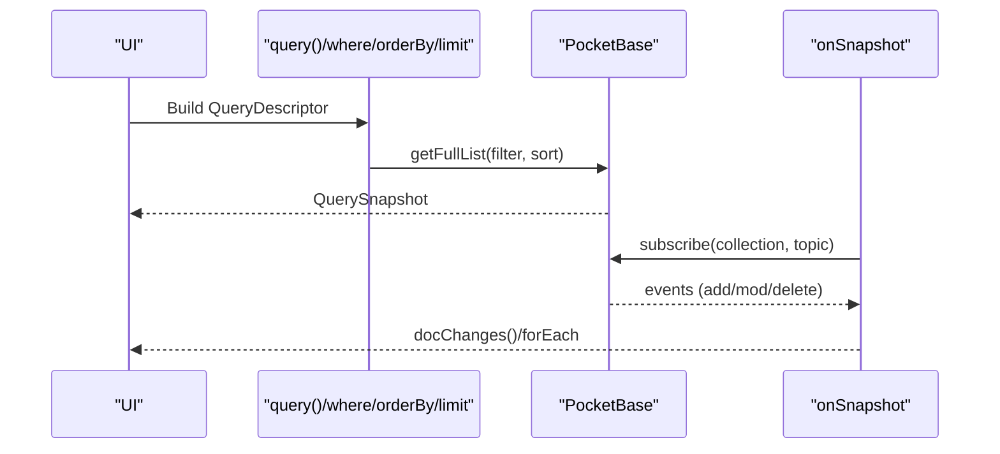
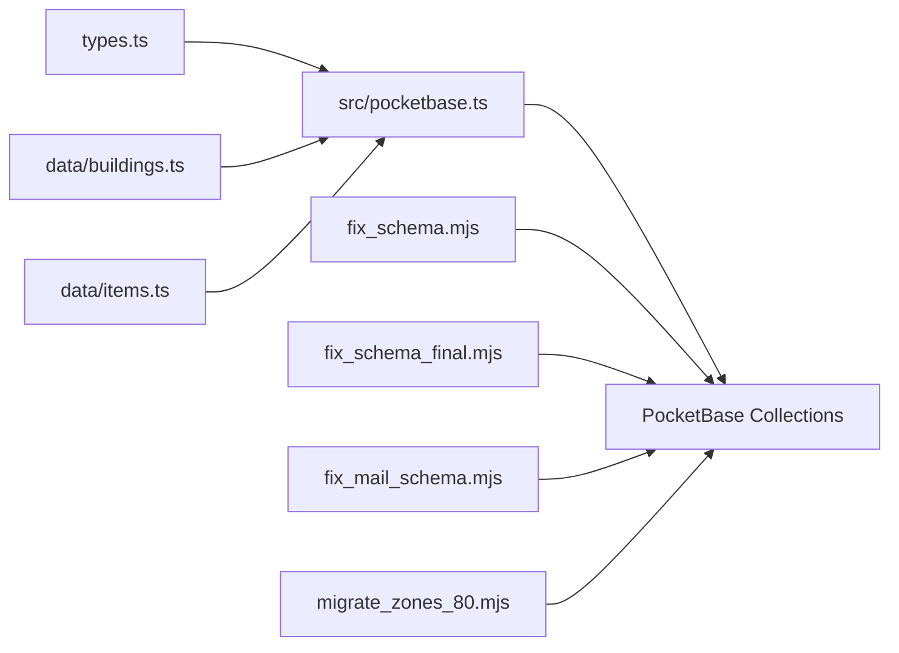

# Database Schema and Data Models

<cite>
**Referenced Files in This Document**
- [firebase-blueprint.json](file://firebase-blueprint.json)
- [pocketbase.ts](file://src/pocketbase.ts)
- [types.ts](file://types.ts)
- [fix_schema.mjs](file://fix_schema.mjs)
- [fix_schema_final.mjs](file://fix_schema_final.mjs)
- [fix_mail_schema.mjs](file://fix_mail_schema.mjs)
- [migrate_zones_80.mjs](file://migrate_zones_80.mjs)
- [check_schema.mjs](file://check_schema.mjs)
- [dump_map_state.mjs](file://dump_map_state.mjs)
- [test_create_building.mjs](file://test_create_building.mjs)
- [buildings.ts](file://data/buildings.ts)
- [items.ts](file://data/items.ts)
</cite>

## Table of Contents
1. [Introduction](#introduction)
2. [Project Structure](#project-structure)
3. [Core Components](#core-components)
4. [Architecture Overview](#architecture-overview)
5. [Detailed Component Analysis](#detailed-component-analysis)
6. [Dependency Analysis](#dependency-analysis)
7. [Performance Considerations](#performance-considerations)
8. [Troubleshooting Guide](#troubleshooting-guide)
9. [Conclusion](#conclusion)
10. [Appendices](#appendices)

## Introduction
This document describes the PocketBase-backed database schema and data models for the MMORPG game. It covers each collection, field definitions, data types, validation rules, relationships, indexing and query patterns, data lifecycle management, migrations, and schema evolution practices. It also explains the data transformation pipeline that moves between game objects and PocketBase records, including the use of a JSON data field for flexible game data.

## Project Structure
The schema is implemented using PocketBase collections with a strict 15-character alphanumeric record ID policy and a unified data transformation layer. Supporting scripts manage schema alignment, zone-based partitioning, and data fixes.



**Diagram sources**
- [pocketbase.ts:145-218](file://src/pocketbase.ts#L145-L218)
- [fix_schema.mjs:1-158](file://fix_schema.mjs#L1-L158)
- [migrate_zones_80.mjs:1-59](file://migrate_zones_80.mjs#L1-L59)

**Section sources**
- [pocketbase.ts:145-218](file://src/pocketbase.ts#L145-L218)
- [fix_schema.mjs:1-158](file://fix_schema.mjs#L1-L158)
- [migrate_zones_80.mjs:1-59](file://migrate_zones_80.mjs#L1-L59)

## Core Components
This section defines each collection, its fields, types, and validation rules, and maps them to the blueprint schema.

- users
  - Purpose: Player profile, stats, inventory, and metadata.
  - Key fields:
    - id: string (PocketBase record id)
    - name: string
    - avatar: string (avatar URL)
    - gold: integer
    - rubies: integer
    - level: integer
    - glory: integer
    - energy: integer
    - reputation: integer
    - inventory: json (map of resource ids to amounts)
    - clanId: number
    - lastSaveTime: integer (timestamp)
    - data: json (arbitrary game data)
    - gameId: string (legacy id mapping)
  - Validation: Top-level known fields are enforced; arbitrary fields go into data.
  - Notes: Auth PK is record.id; frontend aliases uid to record.id for compatibility.

- buildings
  - Purpose: Shared map structures (town halls, residences, defenses, etc.).
  - Key fields:
    - id: string (PocketBase record id)
    - ownerId: string (player uid or special identifiers)
    - zoneId: string (zone grid id)
    - x: number
    - y: number
    - buildingId: number (type id)
    - level: number
    - hp: number
    - maxHp: number
    - population: number
    - name: string
    - lastCollected: number
    - inventory: json
    - config: json
    - isLocal: boolean
    - timestamp: number
    - data: json
    - gameId: string
  - Validation: Required fields include ownerId, zoneId, buildingId, x, y, level, hp, maxHp, population, name, lastCollected, inventory, config, isLocal, timestamp, gameId.

- map_resources
  - Purpose: Resources on the map (trees, oil, chests, quarries).
  - Key fields:
    - id: string (PocketBase record id)
    - type: string enum ("tree", "oil", "chest", "quarry")
    - x: number
    - y: number
    - amount: number
    - zoneId: string
    - data: json
    - gameId: string
  - Validation: Required fields include type, x, y, amount, zoneId, gameId.

- dropped_items
  - Purpose: Items dropped on the ground.
  - Key fields:
    - id: string (PocketBase record id)
    - itemId: number
    - x: number
    - y: number
    - quantity: number
    - droppedBy: string
    - timestamp: number
    - zoneId: string
    - data: json
    - gameId: string
  - Validation: Required fields include itemId, x, y, quantity, droppedBy, timestamp, zoneId, gameId.

- map_state
  - Purpose: Global map generation status.
  - Key fields:
    - id: string (PocketBase record id)
    - data: json
    - gameId: string
  - Validation: Required fields include data, gameId.

- private_messages
  - Purpose: Direct messages between users.
  - Key fields:
    - id: string (PocketBase record id)
    - chatId: string
    - senderId: string
    - receiverId: string
    - text: string
    - timestamp: number
    - senderName: string
    - participants: json (array of user ids)
    - data: json
    - gameId: string
  - Validation: Required fields include senderId, receiverId, text, timestamp, senderName, participants, gameId.

- chat_messages
  - Purpose: Chat messages across channels.
  - Key fields:
    - id: string (PocketBase record id)
    - senderId: string
    - senderName: string
    - text: string
    - timestamp: number
    - channel: string
    - displayName: string
    - data: json
    - gameId: string
  - Validation: Required fields include senderId, senderName, text, timestamp, channel, displayName, gameId.

- presence
  - Purpose: User presence and activity.
  - Key fields:
    - id: string (PocketBase record id)
    - uid: string
    - displayName: string
    - lastSeen: number
    - isOnline: boolean
    - x: number
    - y: number
    - level: number
    - clanName: string
    - data: json
    - gameId: string
  - Validation: Required fields include uid, displayName, lastSeen, isOnline, x, y, level, clanName, gameId.

- clans
  - Purpose: Player-created clans.
  - Key fields:
    - id: string (PocketBase record id)
    - name: string
    - leaderId: string
    - members: json (array of user ids)
    - description: string
    - avatarUrl: string
    - data: json
    - gameId: string
  - Validation: Required fields include name, leaderId, members, description, avatarUrl, gameId.

- market
  - Purpose: Active market listings.
  - Key fields:
    - id: string (PocketBase record id)
    - sellerId: string
    - sellerName: string
    - itemId: number
    - itemName: string
    - quantity: number
    - price: number
    - timestamp: number
    - data: json
    - gameId: string
  - Validation: Required fields include sellerId, sellerName, itemId, itemName, quantity, price, timestamp, gameId.

**Section sources**
- [firebase-blueprint.json:1-191](file://firebase-blueprint.json#L1-L191)
- [fix_schema.mjs:5-89](file://fix_schema.mjs#L5-L89)
- [fix_schema_final.mjs:4-35](file://fix_schema_final.mjs#L4-L35)
- [fix_mail_schema.mjs:11-46](file://fix_mail_schema.mjs#L11-L46)

## Architecture Overview
The system uses a strict 15-character alphanumeric record id policy and a wrapping/unwrapping layer to separate PocketBase schema fields from arbitrary game data.



**Diagram sources**
- [pocketbase.ts:165-218](file://src/pocketbase.ts#L165-L218)

**Section sources**
- [pocketbase.ts:165-218](file://src/pocketbase.ts#L165-L218)

## Detailed Component Analysis

### Data Transformation Pipeline
- Known fields: Defined in KNOWN_FIELDS_BY_COLLECTION and persisted as top-level fields in PocketBase.
- Flexible data: Arbitrary fields are moved into the data JSON field to accommodate evolving game data without schema churn.
- Type normalization: Certain fields are coerced to strings for schema compatibility and restored to numbers on read.
- Timestamp mapping: created is mapped to timestamp if missing.
- Ghost guard: isLocal is stripped to prevent phantom records.



**Diagram sources**
- [pocketbase.ts:165-218](file://src/pocketbase.ts#L165-L218)

**Section sources**
- [pocketbase.ts:165-218](file://src/pocketbase.ts#L165-L218)

### Zone-Based Partitioning
- Zone grid: 80x80 cells; each record computes zoneId as floor(x/80)_floor(y/80).
- Migration: Scripts iterate all records and update zoneId consistently.
- Queries: Filtering by zoneId enables efficient spatial queries.



**Diagram sources**
- [migrate_zones_80.mjs:8-10](file://migrate_zones_80.mjs#L8-L10)

**Section sources**
- [migrate_zones_80.mjs:1-59](file://migrate_zones_80.mjs#L1-L59)

### Owner Relationship Between Users and Buildings
- Ownership: ownerId in buildings references a user uid. Special values may represent neutral or monster ownership.
- Inventory linkage: buildings.inventory holds resource stacks owned by the building.
- Clan linkage: users.clanId links to clans.



**Diagram sources**
- [fix_schema.mjs:6-23](file://fix_schema.mjs#L6-L23)
- [types.ts:170-178](file://types.ts#L170-L178)

**Section sources**
- [fix_schema.mjs:6-23](file://fix_schema.mjs#L6-L23)
- [types.ts:170-178](file://types.ts#L170-L178)

### Blueprint Schema Mapping
The blueprint defines entity shapes and required fields. The PocketBase schema is aligned via migration scripts to match these shapes.

```mermaid
erDiagram
USER_ENTITY {
string uid
string name
integer level
integer glory
integer energy
integer reputation
number clanId
object inventory
integer gold
integer rubies
integer lastSaveTime
number banEndTime
object activeCurse
string role
}
BUILDING_ENTITY {
number id
number x
number y
number buildingId
string ownerId
number hp
number maxHp
boolean isConstructing
number constructionEndTime
string workState
number workEndTime
number lastMoveTime
number protectionEndTime
boolean isDestroying
number destructionEndTime
string initiatorId
number pendingDamage
string hostId
}
MAP_RESOURCE_ENTITY {
number x
number y
number hp
string type
}
PRIVATE_MESSAGE_ENTITY {
string id
string chatId
string senderId
string receiverId
string text
number timestamp
boolean read
array participants
}
CHAT_MESSAGE_ENTITY {
number id
string sender
string text
string type
number timestamp
string tab
number|string|null clanId
object teleportCoordinates
}
PRESENCE_ENTITY {
string uid
string name
string activeTab
number|string|null clanId
number lastSeen
}
MAP_STATE_ENTITY {
boolean generated
number seed
}
CLAN_ENTITY {
number id
string name
string description
string avatarUrl
string leaderName
string leaderUid
number membersCount
}
MARKET_LISTING_ENTITY {
number id
string sellerName
string sellerId
number resourceId
number amount
number price
string currency
}
```

**Diagram sources**
- [firebase-blueprint.json:1-191](file://firebase-blueprint.json#L1-L191)

**Section sources**
- [firebase-blueprint.json:1-191](file://firebase-blueprint.json#L1-L191)

### CRUD and Query Patterns
- CRUD:
  - getDoc: fetch single record by sanitized id.
  - getDocs: fetch full list with optional filter/sort.
  - setDoc: robust upsert using id existence check.
  - updateDoc: supports increment sentinel and dot notation updates.
  - deleteDoc: delete by id; special handling for map_resources by coordinates.
  - deleteAll: batch-delete with chunking.
- Query builder:
  - where: equality, inequality, greater/less-than, array-contains, in.
  - orderBy: asc/desc by field; timestamp maps to updated.
  - limit: cap results.
- Real-time:
  - onSnapshot: subscribe to doc or collection/query with throttled refresh and stale client handling.



**Diagram sources**
- [pocketbase.ts:487-560](file://src/pocketbase.ts#L487-L560)
- [pocketbase.ts:578-707](file://src/pocketbase.ts#L578-L707)

**Section sources**
- [pocketbase.ts:288-448](file://src/pocketbase.ts#L288-L448)
- [pocketbase.ts:487-560](file://src/pocketbase.ts#L487-L560)
- [pocketbase.ts:578-707](file://src/pocketbase.ts#L578-L707)

### Practical Examples
- Create a building record with data payload and gameId mapping.
- Query buildings by zoneId and owner.
- Update building inventory with increment sentinel.
- Subscribe to chat messages in a channel.

**Section sources**
- [test_create_building.mjs:8-27](file://test_create_building.mjs#L8-L27)
- [pocketbase.ts:487-560](file://src/pocketbase.ts#L487-L560)
- [pocketbase.ts:358-426](file://src/pocketbase.ts#L358-L426)
- [pocketbase.ts:578-707](file://src/pocketbase.ts#L578-L707)

## Dependency Analysis
- Data models (types.ts) define game entities and structures used across the app.
- Static data (buildings.ts, items.ts) informs building stats, costs, and resource relations.
- Migration scripts enforce schema parity with game expectations.
- The PocketBase wrapper encapsulates persistence, transformations, and real-time subscriptions.



**Diagram sources**
- [types.ts:1-197](file://types.ts#L1-L197)
- [buildings.ts:1-800](file://data/buildings.ts#L1-L800)
- [items.ts:1-415](file://data/items.ts#L1-L415)
- [pocketbase.ts:145-218](file://src/pocketbase.ts#L145-L218)
- [fix_schema.mjs:1-158](file://fix_schema.mjs#L1-L158)
- [fix_schema_final.mjs:1-79](file://fix_schema_final.mjs#L1-L79)
- [fix_mail_schema.mjs:1-83](file://fix_mail_schema.mjs#L1-L83)
- [migrate_zones_80.mjs:1-59](file://migrate_zones_80.mjs#L1-L59)

**Section sources**
- [types.ts:1-197](file://types.ts#L1-L197)
- [buildings.ts:1-800](file://data/buildings.ts#L1-L800)
- [items.ts:1-415](file://data/items.ts#L1-L415)
- [pocketbase.ts:145-218](file://src/pocketbase.ts#L145-L218)
- [fix_schema.mjs:1-158](file://fix_schema.mjs#L1-L158)
- [fix_schema_final.mjs:1-79](file://fix_schema_final.mjs#L1-L79)
- [fix_mail_schema.mjs:1-83](file://fix_mail_schema.mjs#L1-L83)
- [migrate_zones_80.mjs:1-59](file://migrate_zones_80.mjs#L1-L59)

## Performance Considerations
- Indexing: Use zoneId for spatial filtering; ownerId for ownership queries; channel for chat; senderId/receiverId for PMs.
- Batch operations: deleteAll uses chunking to avoid overload.
- Real-time: onSnapshot throttles updates to reduce load; safeSubscribe handles stale client ids.
- Data size: Keep data JSON minimal; persist only frequently accessed fields at top-level.

## Troubleshooting Guide
- Stale client id errors: onSnapshot retries with jitter on 404 client id errors.
- 404 deletes: deleteDoc tolerates 404; map_resources has fallback by coordinates.
- Schema mismatches: fix_schema.mjs and fix_schema_final.mjs add missing fields; fix_mail_schema.mjs ensures PM/clan/market fields.
- Zone migration: migrate_zones_80.mjs recalculates zoneId for all records.
- Data dumps: dump_map_state.mjs retrieves map_state records for inspection.

**Section sources**
- [pocketbase.ts:587-621](file://src/pocketbase.ts#L587-L621)
- [pocketbase.ts:428-448](file://src/pocketbase.ts#L428-L448)
- [fix_schema.mjs:91-155](file://fix_schema.mjs#L91-L155)
- [fix_schema_final.mjs:37-76](file://fix_schema_final.mjs#L37-L76)
- [fix_mail_schema.mjs:5-82](file://fix_mail_schema.mjs#L5-L82)
- [migrate_zones_80.mjs:12-37](file://migrate_zones_80.mjs#L12-L37)
- [dump_map_state.mjs:3-11](file://dump_map_state.mjs#L3-L11)

## Conclusion
The PocketBase schema is designed around strict record IDs, a separation of known and flexible fields, and a zone-based partitioning system. The transformation layer ensures compatibility between game objects and database records, while migration scripts keep the schema aligned with evolving gameplay needs. Real-time subscriptions and batch operations provide scalable persistence and synchronization.

## Appendices

### Appendix A: Field Reference by Collection
- users: name, avatar, gold, rubies, level, glory, energy, reputation, inventory, clanId, lastSaveTime, data, gameId
- buildings: ownerId, zoneId, x, y, buildingId, level, hp, maxHp, population, name, lastCollected, inventory, config, isLocal, timestamp, data, gameId
- map_resources: type, x, y, amount, zoneId, data, gameId
- dropped_items: itemId, x, y, quantity, droppedBy, timestamp, zoneId, data, gameId
- map_state: data, gameId
- private_messages: senderId, receiverId, participants, text, timestamp, senderName, data, gameId
- chat_messages: senderId, channel, data, gameId
- presence: uid, lastSeen, isOnline, data, gameId
- clans: name, leaderId, members, description, avatarUrl, data, gameId
- market: sellerId, sellerName, itemId, itemName, quantity, price, timestamp, data, gameId

**Section sources**
- [pocketbase.ts:150-161](file://src/pocketbase.ts#L150-L161)
- [fix_schema.mjs:5-89](file://fix_schema.mjs#L5-L89)
- [fix_schema_final.mjs:4-35](file://fix_schema_final.mjs#L4-L35)
- [fix_mail_schema.mjs:11-46](file://fix_mail_schema.mjs#L11-L46)

### Appendix B: Validation Rules Summary
- Required fields per collection are enforced by migration scripts.
- Timestamp fallback: created maps to timestamp if missing.
- Type coercion: buildingId and map_resources.type are normalized to numbers/strings as needed.

**Section sources**
- [fix_schema.mjs:5-89](file://fix_schema.mjs#L5-L89)
- [pocketbase.ts:200-214](file://src/pocketbase.ts#L200-L214)