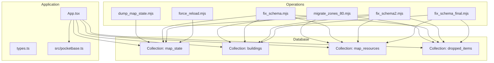
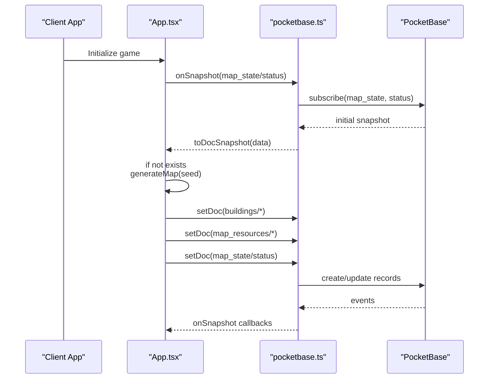
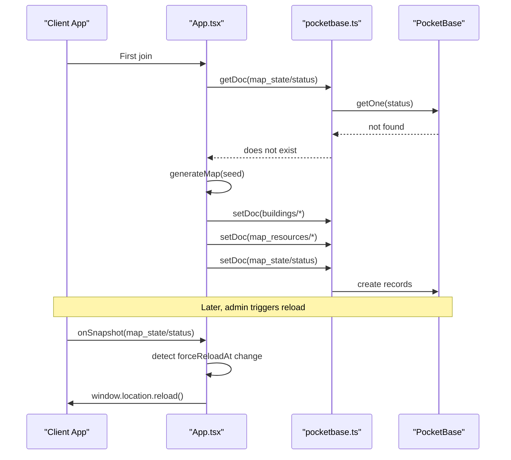
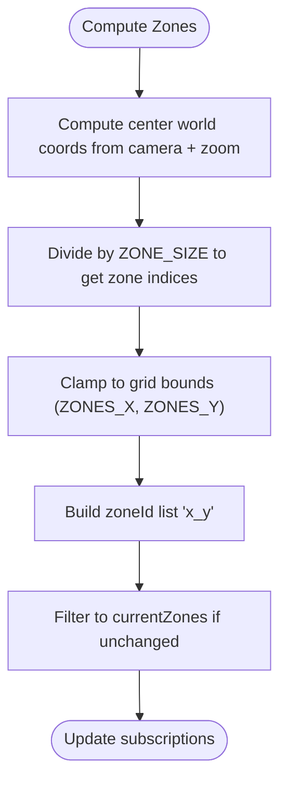
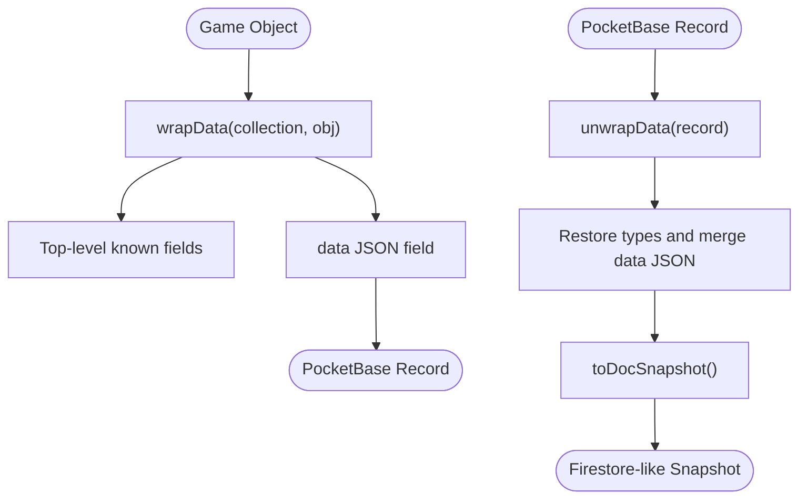
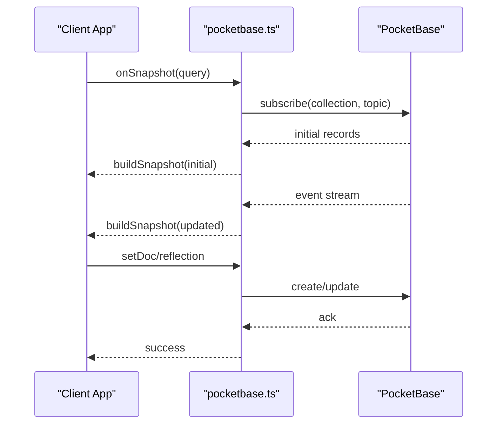
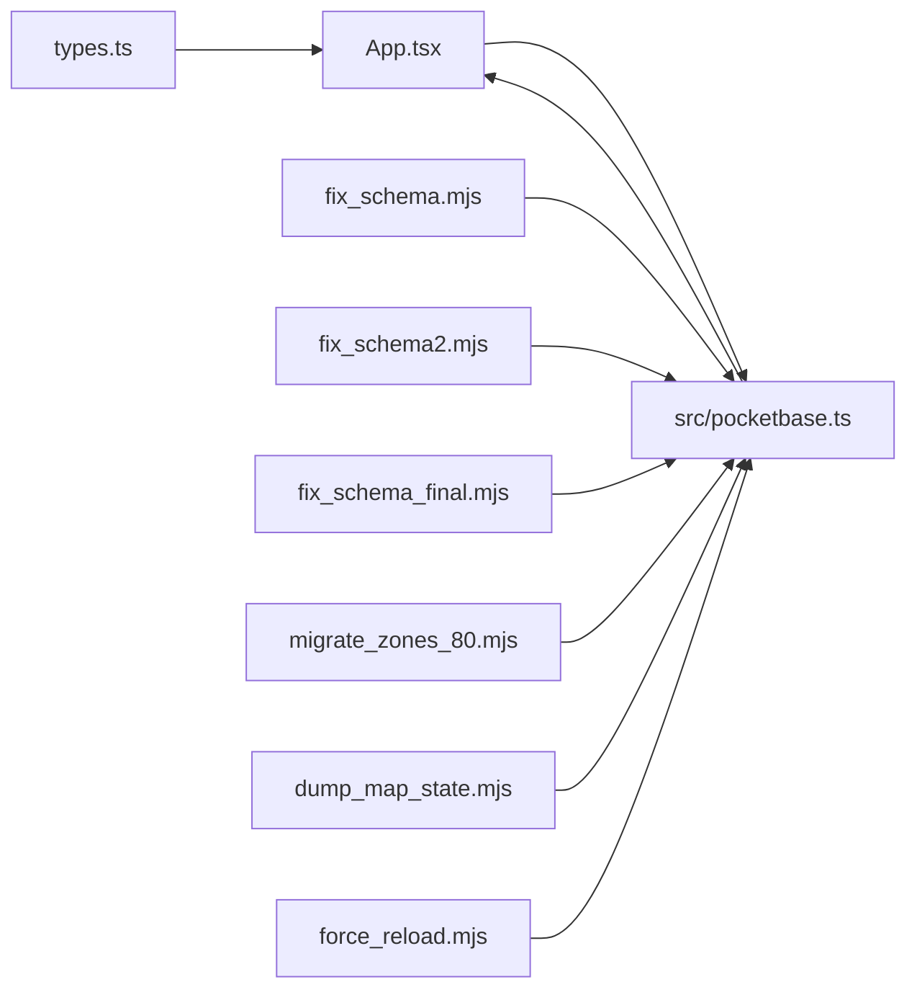
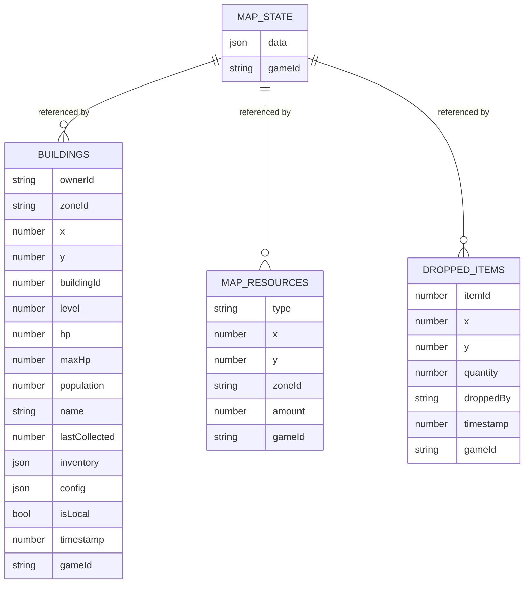

# Game State and Configuration Collections

<cite>
**Referenced Files in This Document**
- [App.tsx](file://App.tsx)
- [types.ts](file://types.ts)
- [pocketbase.ts](file://src/pocketbase.ts)
- [dump_map_state.mjs](file://dump_map_state.mjs)
- [migrate_zones_80.mjs](file://migrate_zones_80.mjs)
- [fix_schema.mjs](file://fix_schema.mjs)
- [fix_schema2.mjs](file://fix_schema2.mjs)
- [fix_schema_final.mjs](file://fix_schema_final.mjs)
- [force_reload.mjs](file://force_reload.mjs)
</cite>

## Table of Contents
1. [Introduction](#introduction)
2. [Project Structure](#project-structure)
3. [Core Components](#core-components)
4. [Architecture Overview](#architecture-overview)
5. [Detailed Component Analysis](#detailed-component-analysis)
6. [Dependency Analysis](#dependency-analysis)
7. [Performance Considerations](#performance-considerations)
8. [Troubleshooting Guide](#troubleshooting-guide)
9. [Conclusion](#conclusion)
10. [Appendices](#appendices)

## Introduction
This document describes the game state management collections and configuration systems used to persist and synchronize the live game world. It focuses on:
- MapState and its role in map generation tracking, seed values, and global reload signaling
- Zone-based data partitioning and its integration with the database schema for performance
- Configuration collections managing game constants, rule sets, and dynamic content
- Data transformation between game state objects and database records, including the JSON data field usage
- Schema evolution strategies, backward compatibility, and migration procedures
- Real-time synchronization mechanisms and conflict resolution for concurrent modifications

## Project Structure
The game state and configuration logic spans the main application and supporting scripts:
- Application logic for map generation, zone partitioning, and real-time synchronization
- Type definitions for game entities and state
- PocketBase compatibility layer for Firestore-style operations and data wrapping
- Migration and schema-fix scripts for evolving the database schema

**Diagram sources**
- [App.tsx:749-778](file://App.tsx#L749-L778)
- [pocketbase.ts:150-161](file://src/pocketbase.ts#L150-L161)
- [dump_map_state.mjs:1-12](file://dump_map_state.mjs#L1-L12)
- [migrate_zones_80.mjs:1-59](file://migrate_zones_80.mjs#L1-L59)
- [fix_schema.mjs:1-158](file://fix_schema.mjs#L1-L158)
- [fix_schema2.mjs:1-39](file://fix_schema2.mjs#L1-L39)
- [fix_schema_final.mjs:1-79](file://fix_schema_final.mjs#L1-L79)
- [force_reload.mjs:1-46](file://force_reload.mjs#L1-L46)

**Section sources**
- [App.tsx:749-778](file://App.tsx#L749-L778)
- [pocketbase.ts:150-161](file://src/pocketbase.ts#L150-L161)

## Core Components
- MapState: Centralized record storing map generation metadata and global reload signals
- Zone-based partitioning: Grid-based subdivision of the world to optimize queries and reduce load
- Configuration collections: Collections that store game constants, rule sets, and dynamic content
- Data transformation layer: Wrapping/unwrapping of game objects into PocketBase records with a JSON data field

Key responsibilities:
- Track map generation seed and status
- Partition world into zones and subscribe to relevant zones
- Persist and transform game entities into database records
- Evolve schema safely with migrations and backward compatibility

**Section sources**
- [App.tsx:749-778](file://App.tsx#L749-L778)
- [App.tsx:806-820](file://App.tsx#L806-L820)
- [pocketbase.ts:165-218](file://src/pocketbase.ts#L165-L218)

## Architecture Overview
The system uses a hybrid approach:
- Game-side logic manages map generation, zone selection, and real-time subscriptions
- PocketBase compatibility layer translates Firestore-style operations to PocketBase
- JSON data field stores arbitrary game data while known fields remain filterable at the top level

**Diagram sources**
- [App.tsx:749-778](file://App.tsx#L749-L778)
- [pocketbase.ts:578-707](file://src/pocketbase.ts#L578-L707)

## Detailed Component Analysis

### MapState and Map Generation Tracking
MapState is a singleton record under the map_state collection used to:
- Store whether the map has been generated
- Store the seed used for procedural generation
- Broadcast a global reload signal to all clients

Generation flow:
- On first join, the app checks for the existence of the map_state/status record
- If absent, it generates a random seed, creates buildings and map resources procedurally, and writes them to their respective collections
- It then writes the map_state/status record with generated and seed values

Global reload mechanism:
- An external script updates the map_state/status record to forceReloadAt
- Clients listen for changes and refresh the page upon detecting a newer timestamp

**Diagram sources**
- [App.tsx:749-778](file://App.tsx#L749-L778)
- [force_reload.mjs:5-29](file://force_reload.mjs#L5-L29)
- [pocketbase.ts:578-707](file://src/pocketbase.ts#L578-L707)

**Section sources**
- [App.tsx:749-778](file://App.tsx#L749-L778)
- [force_reload.mjs:1-46](file://force_reload.mjs#L1-L46)

### Zone-Based Data Partitioning
World is divided into fixed-size zones. The application:
- Computes current zones based on camera position and zoom level
- Subscribes to map_resources filtered by zoneId
- Seeds empty zones with procedural content when needed

Zone computation:
- Uses a constant ZONE_SIZE to derive zone IDs from tile coordinates
- Maintains a throttled camera offset to reduce unnecessary re-subscriptions

**Diagram sources**
- [App.tsx:798-820](file://App.tsx#L798-L820)
- [App.tsx:822-834](file://App.tsx#L822-L834)

**Section sources**
- [App.tsx:798-820](file://App.tsx#L798-L820)
- [App.tsx:822-834](file://App.tsx#L822-L834)
- [App.tsx:908-932](file://App.tsx#L908-L932)

### Configuration Collections and Dynamic Content
Configuration collections store game constants, rule sets, and dynamic content:
- Required fields are enforced in the schema to support efficient filtering
- Arbitrary game data is stored in a JSON data field to preserve flexibility
- Known filterable fields are kept at the top level for queries

Known fields by collection include:
- users: name, avatar, gameId, data, gold, rubies, level, glory, energy, reputation, inventory, clanId, lastSaveTime
- buildings: ownerId, zoneId, x, y, data, gameId, buildingId
- map_resources: type, x, y, zoneId, data, gameId
- dropped_items: itemId, zoneId, data, gameId
- map_state: data, gameId
- private_messages: senderId, receiverId, participants, text, timestamp, senderName, gameId, data
- chat_messages: senderId, channel, gameId, data
- presence: uid, lastSeen, isOnline, gameId, data
- clans: name, leaderId, members, description, gameId, data
- market: sellerId, sellerName, itemId, itemName, quantity, price, timestamp, gameId, data

**Section sources**
- [pocketbase.ts:150-161](file://src/pocketbase.ts#L150-L161)

### Data Transformation Between Game Objects and Database Records
The compatibility layer wraps and unwraps records:
- wrapData: Moves non-known fields into the JSON data field and normalizes known fields
- unwrapData: Restores fields from the JSON data field and performs type conversions
- toDocSnapshot: Produces a Firestore-like snapshot with a stable id field

Key transformations:
- Known filterable fields are preserved at the top level
- Non-known fields are moved into the data JSON field
- Types are normalized (e.g., numeric ids restored)
- System fields like isLocal are stripped to prevent ghost records

**Diagram sources**
- [pocketbase.ts:165-218](file://src/pocketbase.ts#L165-L218)

**Section sources**
- [pocketbase.ts:165-218](file://src/pocketbase.ts#L165-L218)

### Schema Evolution Strategies and Backward Compatibility
Schema evolution is handled through a series of scripts:
- fix_schema.mjs: Adds required fields to all targeted collections
- fix_schema2.mjs: Ensures a data JSON field exists on all collections
- fix_schema_final.mjs: Finalizes schema alignment with known fields and types
- migrate_zones_80.mjs: Updates zoneId for existing records to match new grid size

Backward compatibility:
- Existing records are migrated rather than deleted
- Known fields remain filterable while arbitrary data stays in data JSON
- Type normalization ensures older records remain usable

**Section sources**
- [fix_schema.mjs:1-158](file://fix_schema.mjs#L1-L158)
- [fix_schema2.mjs:1-39](file://fix_schema2.mjs#L1-L39)
- [fix_schema_final.mjs:1-79](file://fix_schema_final.mjs#L1-L79)
- [migrate_zones_80.mjs:1-59](file://migrate_zones_80.mjs#L1-L59)

### Real-Time Synchronization and Conflict Resolution
Real-time synchronization:
- onSnapshot subscribes to documents or collections and returns a stable callback interface
- For collections, it computes docChanges by comparing previous and current snapshots
- Initial fetch is combined with subscription events

Conflict resolution:
- setDoc performs an upsert by checking for existing records and creating or updating accordingly
- updateDoc resolves the current record, merges incremental updates, and writes back
- deleteDoc removes records and includes a fallback path for map_resources by coordinate
- runTransaction batches operations sequentially (not atomic) to simplify conflict handling

**Diagram sources**
- [pocketbase.ts:578-707](file://src/pocketbase.ts#L578-L707)
- [pocketbase.ts:337-426](file://src/pocketbase.ts#L337-L426)

**Section sources**
- [pocketbase.ts:578-707](file://src/pocketbase.ts#L578-L707)
- [pocketbase.ts:337-426](file://src/pocketbase.ts#L337-L426)

## Dependency Analysis
- App.tsx depends on pocketbase.ts for database operations and on types.ts for entity definitions
- Scripts depend on PocketBase client to mutate schema and data
- Zone logic depends on constants like ZONE_SIZE and ZONES_X/Y

**Diagram sources**
- [App.tsx:24-25](file://App.tsx#L24-L25)
- [pocketbase.ts:1-11](file://src/pocketbase.ts#L1-L11)
- [fix_schema.mjs:1-10](file://fix_schema.mjs#L1-L10)
- [fix_schema2.mjs:1-10](file://fix_schema2.mjs#L1-L10)
- [fix_schema_final.mjs:1-10](file://fix_schema_final.mjs#L1-L10)
- [migrate_zones_80.mjs:1-10](file://migrate_zones_80.mjs#L1-L10)
- [dump_map_state.mjs:1-10](file://dump_map_state.mjs#L1-L10)
- [force_reload.mjs:1-10](file://force_reload.mjs#L1-L10)

**Section sources**
- [App.tsx:24-25](file://App.tsx#L24-L25)
- [pocketbase.ts:1-11](file://src/pocketbase.ts#L1-L11)

## Performance Considerations
- Zone-based queries minimize data transfer and improve responsiveness
- Throttled camera updates reduce redundant subscriptions
- Batched deletions and upserts help avoid server overload during maintenance
- Using known filterable fields at the top level enables efficient queries

## Troubleshooting Guide
Common issues and resolutions:
- Missing or insufficient permissions: Expected during race conditions; errors are ignored in the game loop to avoid noisy logs
- Stale client ID in real-time subscriptions: Retries are attempted automatically with jitter
- Ghost buildings caused by isLocal: The compatibility layer strips isLocal from persisted records
- Field type mismatches: wrapData and unwrapData normalize types to ensure compatibility

**Section sources**
- [App.tsx:27-33](file://App.tsx#L27-L33)
- [pocketbase.ts:600-621](file://src/pocketbase.ts#L600-L621)
- [pocketbase.ts:194-218](file://src/pocketbase.ts#L194-L218)

## Conclusion
The system combines procedural map generation with a robust, schema-evolved persistence layer. Zone-based partitioning and a JSON data field strategy enable scalable, flexible storage while maintaining query performance. Real-time synchronization and careful conflict handling ensure a smooth multiplayer experience, and migration scripts provide a clear path for evolving the schema without breaking backward compatibility.

## Appendices

### Appendix A: Data Model Overview

**Diagram sources**
- [fix_schema.mjs:5-89](file://fix_schema.mjs#L5-L89)
- [fix_schema_final.mjs:4-35](file://fix_schema_final.mjs#L4-L35)