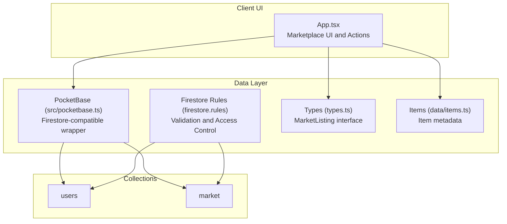
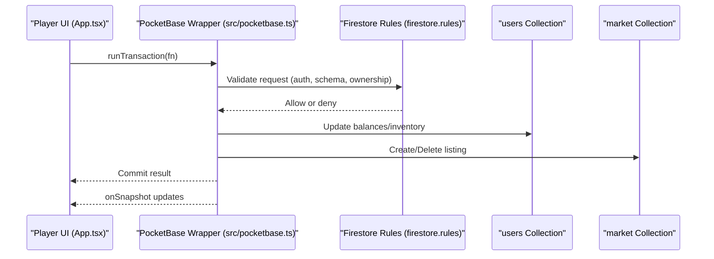
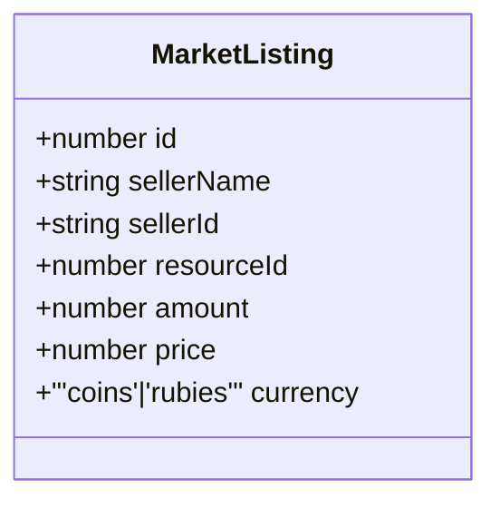
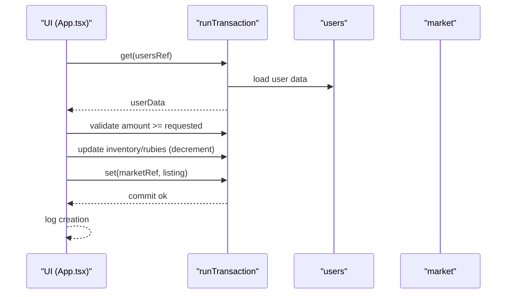
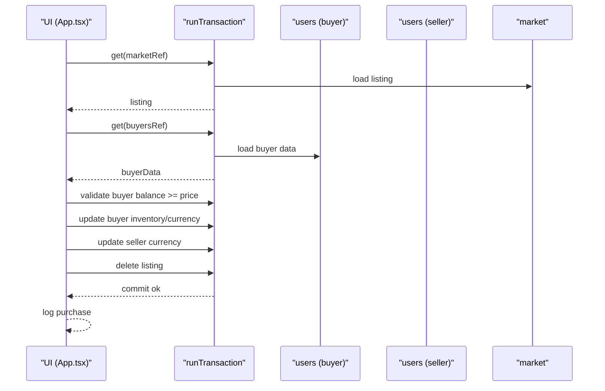
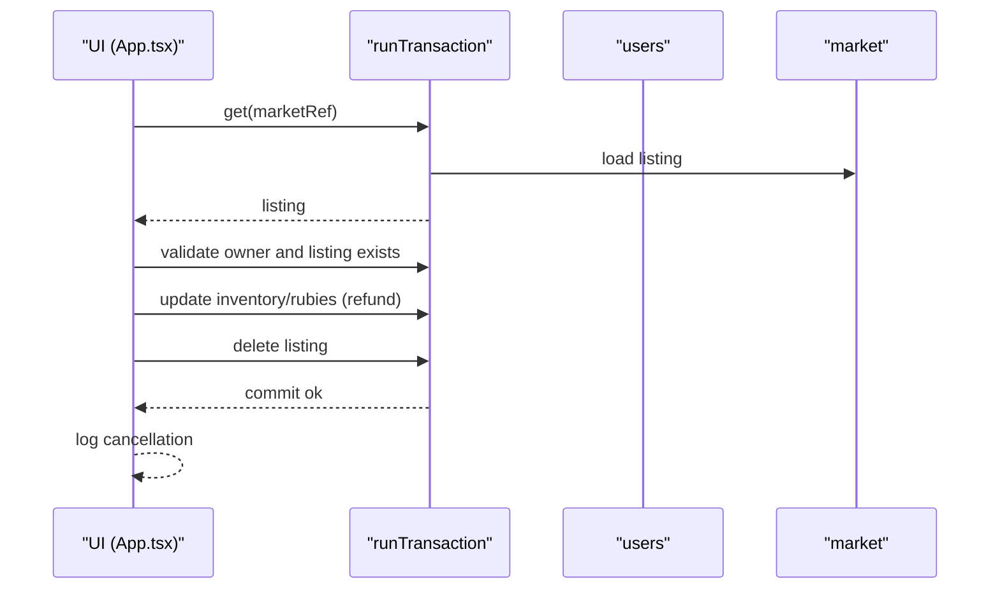
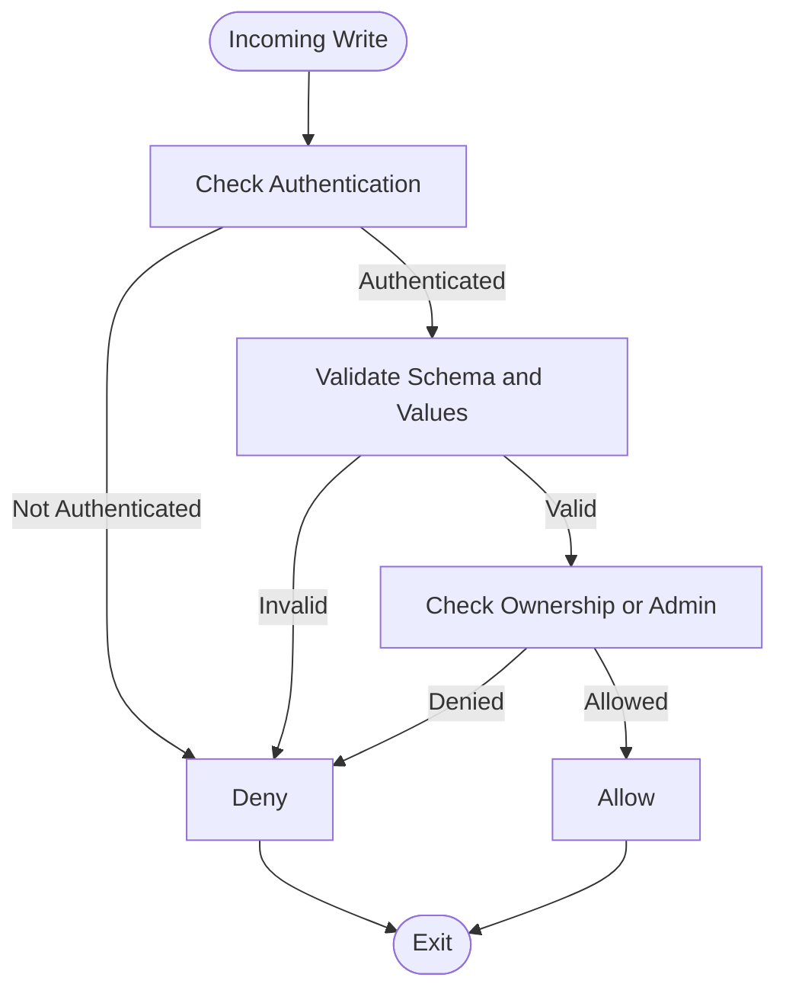
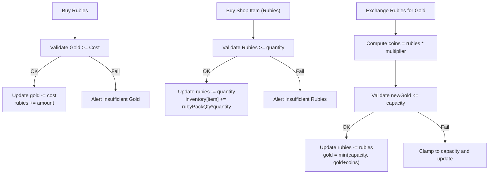
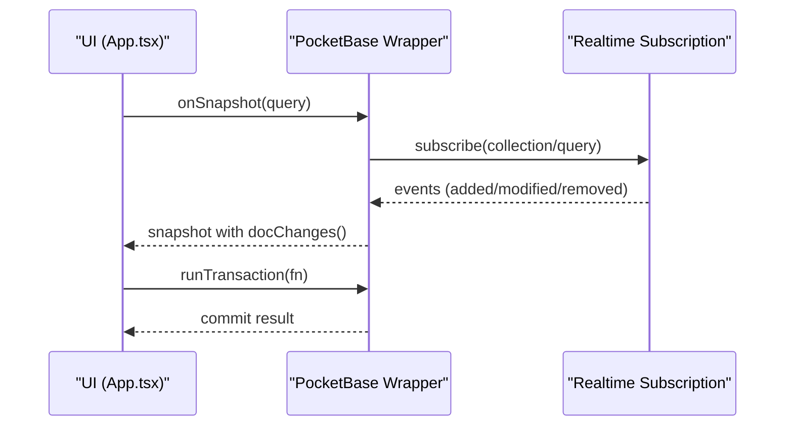
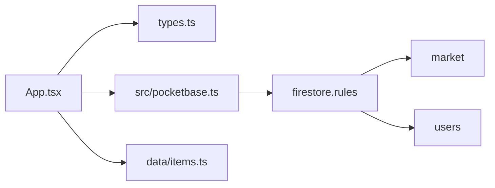

# Market and Economy Collections

<cite>
**Referenced Files in This Document**
- [App.tsx](file://App.tsx)
- [types.ts](file://types.ts)
- [firestore.rules](file://firestore.rules)
- [src/pocketbase.ts](file://src/pocketbase.ts)
- [data/items.ts](file://data/items.ts)
</cite>

## Table of Contents
1. [Introduction](#introduction)
2. [Project Structure](#project-structure)
3. [Core Components](#core-components)
4. [Architecture Overview](#architecture-overview)
5. [Detailed Component Analysis](#detailed-component-analysis)
6. [Dependency Analysis](#dependency-analysis)
7. [Performance Considerations](#performance-considerations)
8. [Troubleshooting Guide](#troubleshooting-guide)
9. [Conclusion](#conclusion)

## Introduction
This document describes the MarketListing collection and the broader economy system in the game. It covers marketplace functionality (resource sales, pricing, and currency types), listing lifecycle, seller verification, buyer protection, data validation, integration with user inventory and currency management, real-time matching and transaction processing, audit logging, and performance optimization strategies for high-volume trading.

## Project Structure
The economy system spans several areas:
- Types define the MarketListing interface and related game entities.
- Firestore rules enforce schema and access control for the market and users.
- App.tsx implements marketplace actions (create, buy, cancel) and currency/inventory updates.
- src/pocketbase.ts provides a Firestore-compatible wrapper around PocketBase for transactions and real-time subscriptions.
- data/items.ts defines item metadata including rubies and pack quantities used in shop and exchange logic.

**Diagram sources**
- [App.tsx](file://App.tsx)
- [src/pocketbase.ts](file://src/pocketbase.ts)
- [firestore.rules](file://firestore.rules)
- [types.ts](file://types.ts)
- [data/items.ts](file://data/items.ts)

**Section sources**
- [App.tsx](file://App.tsx)
- [types.ts](file://types.ts)
- [firestore.rules](file://firestore.rules)
- [src/pocketbase.ts](file://src/pocketbase.ts)
- [data/items.ts](file://data/items.ts)

## Core Components
- MarketListing interface: Defines the shape of a listing with identifiers, seller info, resource, amount, price, and currency.
- Marketplace actions: Creation, purchase, cancellation, and shop/exchange flows.
- Validation and access control: Firestore rules for market listings and user accounts.
- Inventory and currency: User balances and inventory managed via transactions.
- Real-time and transactions: Firestore-compatible transactions and subscriptions.

**Section sources**
- [types.ts:160-168](file://types.ts#L160-L168)
- [App.tsx](file://App.tsx)
- [firestore.rules](file://firestore.rules)
- [src/pocketbase.ts](file://src/pocketbase.ts)

## Architecture Overview
The marketplace operates on a client-server model:
- Client UI triggers marketplace actions.
- Transactions ensure atomic updates to user balances, inventory, and market listings.
- Firestore rules validate data and enforce ownership and permissions.
- Real-time subscriptions keep the UI synchronized with remote state.

**Diagram sources**
- [App.tsx](file://App.tsx)
- [src/pocketbase.ts](file://src/pocketbase.ts)
- [firestore.rules](file://firestore.rules)

## Detailed Component Analysis

### MarketListing Data Model
- Fields: id, sellerName, sellerId, resourceId, amount, price, currency.
- Currency types: coins and rubies.
- Constraints enforced by rules: positive amount, non-negative price, valid currency enum.

**Diagram sources**
- [types.ts:160-168](file://types.ts#L160-L168)

**Section sources**
- [types.ts:160-168](file://types.ts#L160-L168)
- [firestore.rules:129-138](file://firestore.rules#L129-L138)

### Marketplace Lifecycle and Operations

#### Listing Creation
- Validation: Requires selected item, positive amount and price, sufficient inventory/rubies.
- Atomic update: Deduct items/rubies from seller inventory and create a listing document.
- Audit: Logs creation event.

**Diagram sources**
- [App.tsx](file://App.tsx)
- [src/pocketbase.ts](file://src/pocketbase.ts)

**Section sources**
- [App.tsx](file://App.tsx)
- [src/pocketbase.ts](file://src/pocketbase.ts)

#### Purchase Flow
- Validation: Buyer must have sufficient balance (coins or rubies).
- Atomic transfer: Deduct buyer’s currency, add items/rubies to buyer inventory, credit seller, and delete listing.
- Audit: Logs purchase event.

**Diagram sources**
- [App.tsx](file://App.tsx)
- [src/pocketbase.ts](file://src/pocketbase.ts)

**Section sources**
- [App.tsx](file://App.tsx)
- [src/pocketbase.ts](file://src/pocketbase.ts)

#### Cancellation Flow
- Validation: Only the listing owner can cancel; listing must still exist.
- Atomic refund: Return items/rubies to seller and delete listing.

**Diagram sources**
- [App.tsx](file://App.tsx)
- [src/pocketbase.ts](file://src/pocketbase.ts)

**Section sources**
- [App.tsx](file://App.tsx)
- [src/pocketbase.ts](file://src/pocketbase.ts)

### Data Validation and Access Control
- Market listings: Required fields, amount > 0, price >= 0, currency in ['coins','rubies'].
- Users: Required fields include gold and rubies; updates are restricted except for specific allowed changes.
- Ownership: Sellers must match the authenticated user or be admin; admins have elevated privileges.

**Diagram sources**
- [firestore.rules](file://firestore.rules)

**Section sources**
- [firestore.rules](file://firestore.rules)

### Currency and Inventory Management
- Currency: gold (coins) and rubies tracked per user.
- Inventory: map of item IDs to amounts.
- Shop and Exchange:
  - Buy rubies with gold at a fixed cost.
  - Buy shop items with rubies using rubyPackQuantity multipliers.
  - Exchange rubies for gold with a fixed multiplier, capped by gold capacity.

**Diagram sources**
- [App.tsx](file://App.tsx)

**Section sources**
- [App.tsx](file://App.tsx)
- [data/items.ts](file://data/items.ts)

### Real-Time Matching and Transactions
- Real-time subscriptions: onSnapshot provides live updates for collections and documents.
- Transactions: runTransaction batches reads and writes atomically; PocketBase wrapper executes queued operations sequentially.
- Throttling: Collection updates are throttled to reduce churn.

**Diagram sources**
- [src/pocketbase.ts](file://src/pocketbase.ts)

**Section sources**
- [src/pocketbase.ts](file://src/pocketbase.ts)

### Audit Trail and Logging
- UI logs economy events (purchase, sale, exchange) into a history log with timestamps and types.
- These logs serve as an audit trail for economic activity.

**Section sources**
- [App.tsx](file://App.tsx)

## Dependency Analysis
- App.tsx depends on:
  - types.ts for MarketListing interface.
  - src/pocketbase.ts for Firestore-compatible operations and transactions.
  - data/items.ts for item metadata and pack quantities.
- firestore.rules governs:
  - MarketListing schema and access control.
  - User balances and inventory constraints.

**Diagram sources**
- [App.tsx](file://App.tsx)
- [types.ts](file://types.ts)
- [src/pocketbase.ts](file://src/pocketbase.ts)
- [firestore.rules](file://firestore.rules)
- [data/items.ts](file://data/items.ts)

**Section sources**
- [App.tsx](file://App.tsx)
- [types.ts](file://types.ts)
- [src/pocketbase.ts](file://src/pocketbase.ts)
- [firestore.rules](file://firestore.rules)
- [data/items.ts](file://data/items.ts)

## Performance Considerations
- Transaction batching: Use runTransaction to minimize conflicts and ensure atomicity.
- Real-time throttling: Collection updates are throttled to reduce UI churn and server load.
- Query constraints: Use filters and limits to restrict listing queries (e.g., by resource type).
- Client-side caching: Keep recent market listings in memory to reduce repeated reads.
- Bulk operations: Use writeBatch semantics where available to group updates.
- Indexing: Ensure Firestore/PocketBase indexes exist for frequently queried fields (sellerId, resourceId, currency).

[No sources needed since this section provides general guidance]

## Troubleshooting Guide
Common issues and resolutions:
- Permission denied: Verify authentication and ownership checks in rules; ensure user IDs match.
- Validation errors: Confirm listing fields meet schema requirements (amount > 0, price >= 0, currency enum).
- Insufficient funds: Ensure buyer has enough gold or rubies before purchase.
- Transaction failures: Review runTransaction callbacks and error handling; check for stale client IDs in realtime subscriptions.
- Real-time disconnects: Subscriptions retry on stale client ID errors; monitor logs for transient failures.

**Section sources**
- [firestore.rules](file://firestore.rules)
- [src/pocketbase.ts](file://src/pocketbase.ts)
- [App.tsx](file://App.tsx)

## Conclusion
The marketplace and economy system combine a strict schema and access-control layer with robust client-side transaction logic. MarketListing encapsulates essential trade data, while Firestore rules and transactions ensure data integrity and fairness. Real-time subscriptions and throttling provide responsive UX, and audit logs capture economic activity. By following the validation rules and leveraging transactions, the system supports high-volume trading with strong buyer and seller protections.