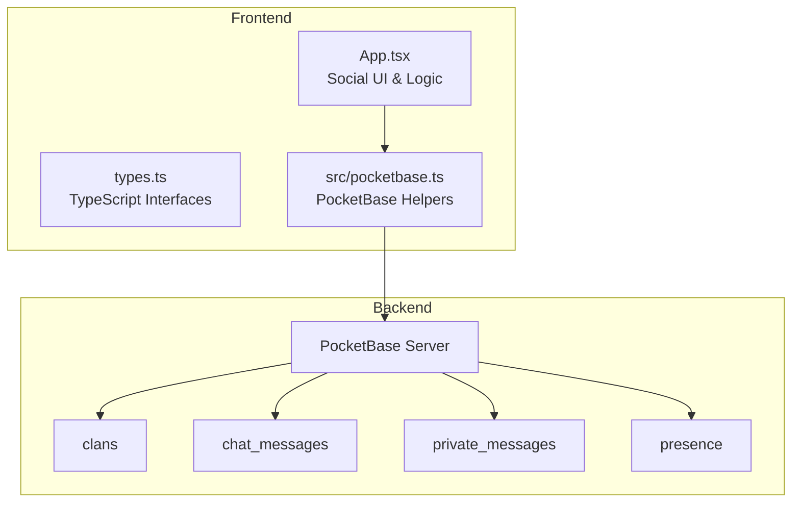
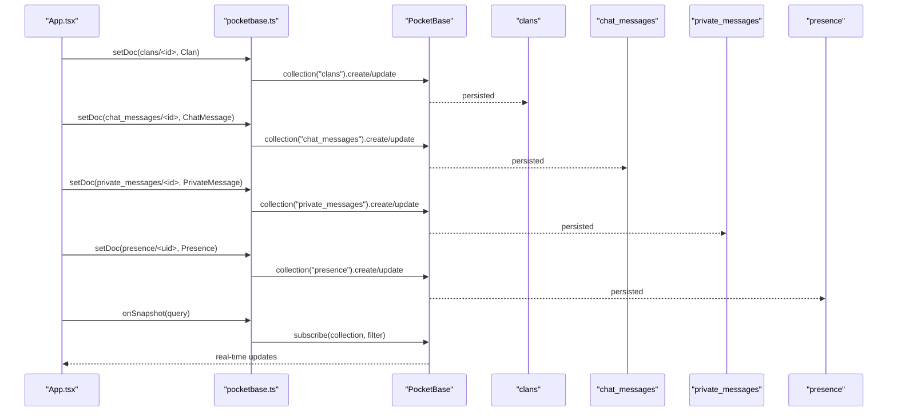
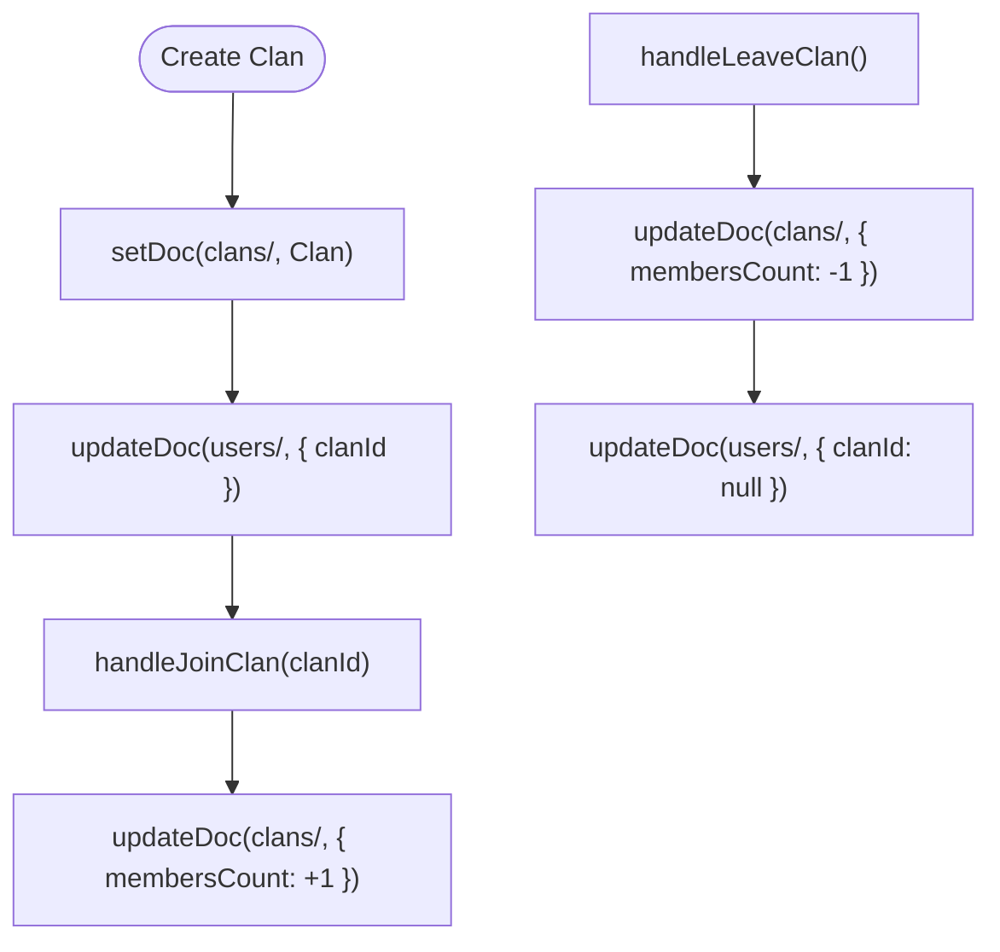
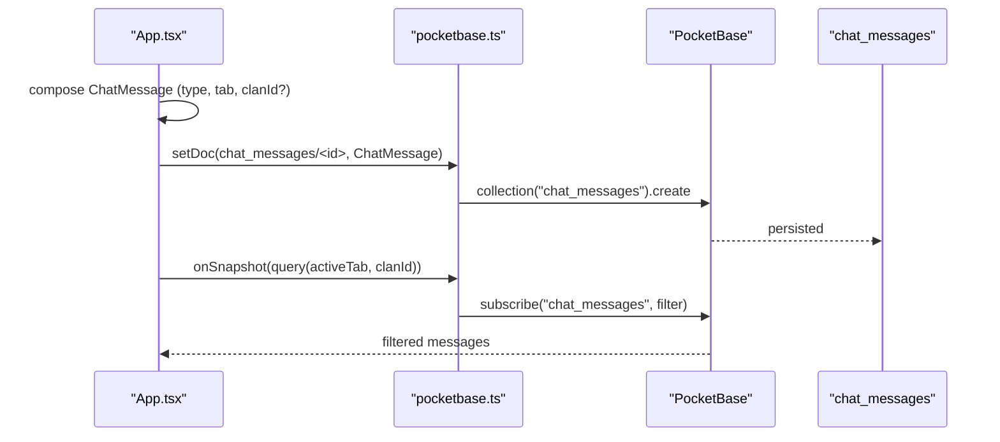
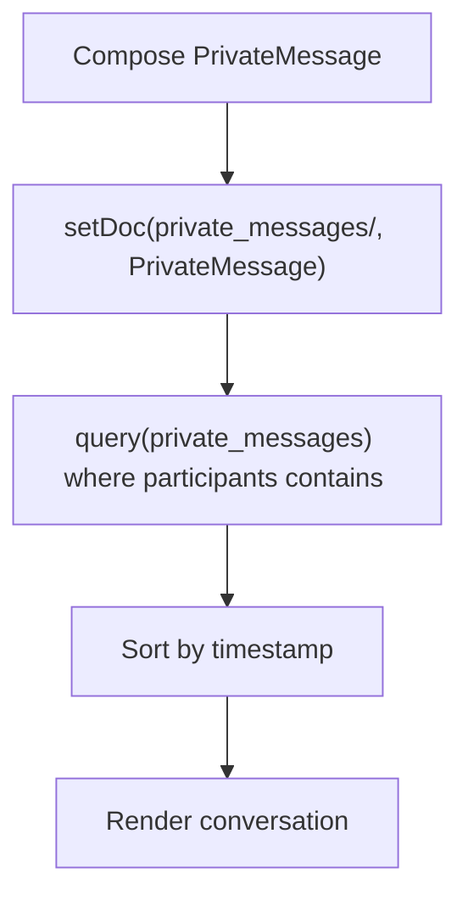
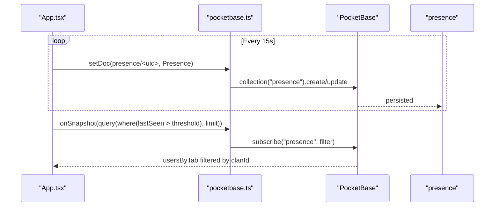
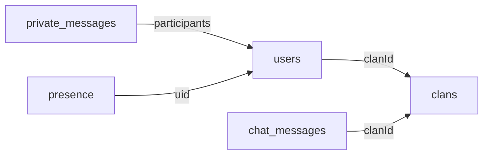

# Social and Communication Collections

<cite>
**Referenced Files in This Document**
- [App.tsx](file://App.tsx)
- [types.ts](file://types.ts)
- [pocketbase.ts](file://src/pocketbase.ts)
- [check_schema.mjs](file://check_schema.mjs)
- [fix_schema.mjs](file://fix_schema.mjs)
- [fix_schema_final.mjs](file://fix_schema_final.mjs)
- [fix_schema_final_v2.mjs](file://fix_schema_final_v2.mjs)
- [firebase-blueprint.json](file://firebase-blueprint.json)
- [clear_database.js](file://clear_database.js)
</cite>

## Table of Contents
1. [Introduction](#introduction)
2. [Project Structure](#project-structure)
3. [Core Components](#core-components)
4. [Architecture Overview](#architecture-overview)
5. [Detailed Component Analysis](#detailed-component-analysis)
6. [Dependency Analysis](#dependency-analysis)
7. [Performance Considerations](#performance-considerations)
8. [Troubleshooting Guide](#troubleshooting-guide)
9. [Conclusion](#conclusion)

## Introduction
This document describes the social and communication data models used by the game, focusing on four collections: Clan, ChatMessage, PrivateMessage, and Presence. It explains how these collections are structured, how data flows through the system, and how real-time synchronization is achieved via PocketBase. It also covers validation rules implied by the code, privacy and moderation considerations, and anti-spam safeguards built into the schema and client-side logic.

## Project Structure
The social and communication features are implemented primarily in the frontend application and backed by PocketBase. The relevant pieces are:
- TypeScript interfaces define the shape of social entities.
- Frontend logic creates, reads, updates, and deletes records in the social collections.
- PocketBase helpers translate between the app’s internal representation and PocketBase’s schema.
- Schema maintenance scripts ensure the backend schema stays aligned with the app’s expectations.

**Diagram sources**
- [App.tsx](file://App.tsx)
- [types.ts](file://types.ts)
- [pocketbase.ts](file://src/pocketbase.ts)

**Section sources**
- [App.tsx](file://App.tsx)
- [types.ts](file://types.ts)
- [pocketbase.ts](file://src/pocketbase.ts)

## Core Components
This section defines the core social entities and their fields, along with validation rules and relationships.

- Clan
  - Purpose: Organize players into guild-like groups with leadership and membership tracking.
  - Fields:
    - id: number
    - name: string
    - description: string
    - avatarUrl: string | null
    - leaderName: string
    - leaderUid: string
    - membersCount: number
  - Validation and relationships:
    - leaderName and leaderUid pair identifies the current leader.
    - membersCount reflects the number of members; it is decremented when leaving and incremented when joining.
    - Player-to-clan relationship is maintained via users.clanId.

- ChatMessage
  - Purpose: Store chat messages across tabs (general, banya, loot, clan) with optional teleport coordinates and clan scoping.
  - Fields:
    - id: number
    - sender: string
    - senderId: string | undefined
    - text: string
    - type: 'normal' | 'shout' | 'system'
    - timestamp: number
    - tab: 'general' | 'banya' | 'loot' | 'clan' | 'all'
    - teleportCoordinates: { x: number, y: number } | undefined
    - clanId: number | null | undefined
  - Validation and relationships:
    - type determines presentation and moderation behavior (e.g., shout costs).
    - tab scopes visibility; clanId restricts clan tab to members of the same clan.
    - teleportCoordinates may be attached to messages carrying location data.

- PrivateMessage
  - Purpose: Enable direct messaging between two users with read status and conversation management.
  - Fields:
    - id: string
    - chatId: string
    - senderId: string
    - receiverId: string
    - text: string
    - timestamp: number
    - read: boolean
    - participants: string[]
  - Validation and relationships:
    - participants must include both senderId and receiverId.
    - read indicates whether the message has been viewed by the receiver.
    - chatId groups related messages into conversations.

- Presence
  - Purpose: Track user location, activity, and online status for real-time features.
  - Fields:
    - uid: string
    - name: string
    - activeTab: 'general' | 'banya' | 'loot' | 'clan'
    - clanId: number | null
    - lastSeen: number
    - x: number
    - y: number
    - level: number
    - glory: number
    - reputation: number
    - avatar: string | null
    - activeCurse: any | null
  - Validation and relationships:
    - lastSeen is updated periodically; users inactive beyond a threshold are considered offline.
    - activeTab and clanId are used to filter presence data per tab and clan.
    - x/y represent the user’s world coordinates derived from camera position.

**Section sources**
- [types.ts:170-197](file://types.ts#L170-L197)
- [App.tsx:163-174](file://App.tsx#L163-L174)
- [App.tsx:1867-1892](file://App.tsx#L1867-L1892)

## Architecture Overview
The social system uses a hybrid Firestore-style API abstraction layered over PocketBase. The frontend writes and subscribes to collections using helper functions that normalize IDs, wrap/unwrap data, and manage real-time subscriptions.

**Diagram sources**
- [pocketbase.ts](file://src/pocketbase.ts)
- [App.tsx](file://App.tsx)

**Section sources**
- [pocketbase.ts](file://src/pocketbase.ts)
- [App.tsx](file://App.tsx)

## Detailed Component Analysis

### Clan Model
- Creation and membership:
  - Players can create a clan with a name, description, and avatar.
  - Membership is tracked by incrementing membersCount when joining and decrementing when leaving.
  - Leadership is tracked via leaderName and leaderUid.
- Relationship to users:
  - users.clanId links a user to their current clan.
- Anti-escape and moderation:
  - Joining requires selecting a clan from a list; leaving decrements the previous clan’s membersCount.
  - Leader-specific actions are enforced by checking leaderUid.

**Diagram sources**
- [App.tsx:5692-5711](file://App.tsx#L5692-L5711)
- [App.tsx:5713-5747](file://App.tsx#L5713-L5747)
- [App.tsx:5749-5772](file://App.tsx#L5749-L5772)

**Section sources**
- [App.tsx:5692-5711](file://App.tsx#L5692-L5711)
- [App.tsx:5713-5747](file://App.tsx#L5713-L5747)
- [App.tsx:5749-5772](file://App.tsx#L5749-L5772)

### ChatMessage Model
- Message types:
  - normal: standard chat messages.
  - shout: public broadcast requiring resource costs.
  - system: system-generated notifications.
- Tab-based organization:
  - Messages are scoped by tab; clan tab is restricted to members of the same clan.
- Teleport coordinates:
  - Messages may carry teleportCoordinates for location sharing.
- Persistence and filtering:
  - Messages are written to chat_messages with sanitized IDs.
  - Filtering logic ensures only relevant messages are shown per tab and clan.

**Diagram sources**
- [App.tsx:5538-5551](file://App.tsx#L5538-L5551)
- [App.tsx:5581-5593](file://App.tsx#L5581-L5593)
- [App.tsx:5599-5615](file://App.tsx#L5599-L5615)
- [App.tsx:5800](file://App.tsx#L5800)

**Section sources**
- [App.tsx:163-174](file://App.tsx#L163-L174)
- [App.tsx:5538-5551](file://App.tsx#L5538-L5551)
- [App.tsx:5581-5593](file://App.tsx#L5581-L5593)
- [App.tsx:5599-5615](file://App.tsx#L5599-L5615)
- [App.tsx:5800](file://App.tsx#L5800)

### PrivateMessage Model
- Conversation management:
  - Messages are grouped by chatId.
  - participants array must include both senderId and receiverId.
- Read status:
  - read flag indicates whether the receiver has viewed the message.
- Delivery and retrieval:
  - Messages are written to private_messages and retrieved by querying participants.

**Diagram sources**
- [App.tsx:366-369](file://App.tsx#L366-L369)
- [App.tsx:5465-5495](file://App.tsx#L5465-L5495)
- [App.tsx:2479-2487](file://App.tsx#L2479-L2487)

**Section sources**
- [types.ts:187-197](file://types.ts#L187-L197)
- [App.tsx:366-369](file://App.tsx#L366-L369)
- [App.tsx:5465-5495](file://App.tsx#L5465-L5495)
- [App.tsx:2479-2487](file://App.tsx#L2479-L2487)

### Presence Model
- Real-time tracking:
  - Presence is updated periodically with activeTab, clanId, lastSeen, and coordinates.
  - Online users are determined by lastSeen within a recent window.
- Filtering by tab and clan:
  - Presence subscriptions filter users by activeTab and clanId for tab/clan-specific views.
- Interpolation:
  - Client interpolates positions for smooth rendering.

**Diagram sources**
- [App.tsx:1875-1892](file://App.tsx#L1875-L1892)
- [App.tsx:1938-1990](file://App.tsx#L1938-L1990)

**Section sources**
- [App.tsx:1875-1892](file://App.tsx#L1875-L1892)
- [App.tsx:1938-1990](file://App.tsx#L1938-L1990)

## Dependency Analysis
- Frontend depends on PocketBase helpers for:
  - ID sanitization and wrapping/unwrapping of data.
  - CRUD operations and real-time subscriptions.
- Collections are loosely coupled except for cross-references:
  - users.clanId references clans.id.
  - chat_messages.clanId references clans.id.
  - private_messages.participants reference users.uid.
  - presence.uid references users.uid.

**Diagram sources**
- [App.tsx:1795](file://App.tsx#L1795)
- [App.tsx:5742](file://App.tsx#L5742)
- [App.tsx:5766](file://App.tsx#L5766)
- [App.tsx:5546](file://App.tsx#L5546)
- [App.tsx:5588](file://App.tsx#L5588)
- [App.tsx:5495](file://App.tsx#L5495)
- [App.tsx:1880](file://App.tsx#L1880)

**Section sources**
- [App.tsx:1795](file://App.tsx#L1795)
- [App.tsx:5742](file://App.tsx#L5742)
- [App.tsx:5766](file://App.tsx#L5766)
- [App.tsx:5546](file://App.tsx#L5546)
- [App.tsx:5588](file://App.tsx#L5588)
- [App.tsx:5495](file://App.tsx#L5495)
- [App.tsx:1880](file://App.tsx#L1880)

## Performance Considerations
- Real-time throttling:
  - Presence updates occur every 15 seconds to balance responsiveness and bandwidth.
  - Chat subscriptions throttle updates to reduce churn.
- Query limits:
  - Presence queries limit results to a small number and recent activity windows.
- Data normalization:
  - wrapData/unwrappedData minimize schema mismatches and reduce accidental overwrites.

**Section sources**
- [App.tsx:1896](file://App.tsx#L1896)
- [App.tsx:1941-1942](file://App.tsx#L1941-L1942)
- [pocketbase.ts:165-218](file://src/pocketbase.ts#L165-L218)

## Troubleshooting Guide
- Schema synchronization:
  - Maintenance scripts add missing fields and open access rules for social collections.
  - Use these scripts to ensure backend schema matches frontend expectations.
- Common issues:
  - Missing fields in chat_messages or presence: run the schema fix scripts.
  - Access denied errors: verify list/view/create/update rules are set.
  - Presence not updating: confirm uid is used as the document ID and lastSeen is refreshed.

**Section sources**
- [fix_schema.mjs:91-128](file://fix_schema.mjs#L91-L128)
- [fix_schema_final.mjs:46-78](file://fix_schema_final.mjs#L46-L78)
- [fix_schema_final_v2.mjs:45-93](file://fix_schema_final_v2.mjs#L45-L93)
- [check_schema.mjs:10](file://check_schema.mjs#L10)
- [clear_database.js:8](file://clear_database.js#L8)

## Conclusion
The social and communication system combines typed models, robust persistence via PocketBase, and efficient real-time updates. The schema supports clan leadership, tab-scoped chat, private messaging with read status, and presence tracking for location and activity. Privacy and moderation are addressed through tab and clan scoping, participant lists, and cooldowns for sensitive actions like shouting and location sharing.