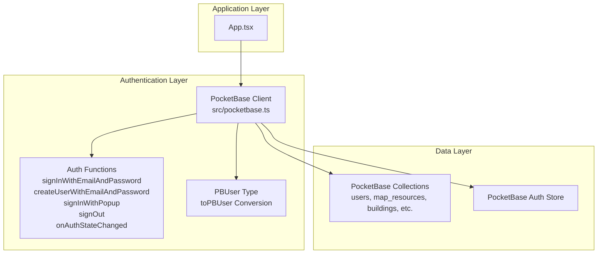
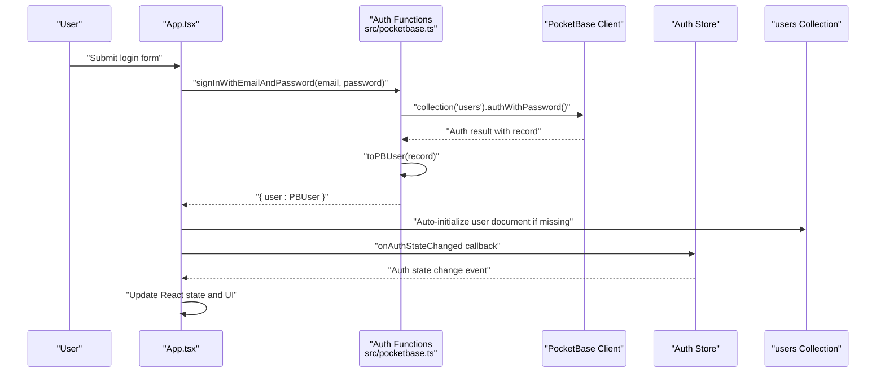
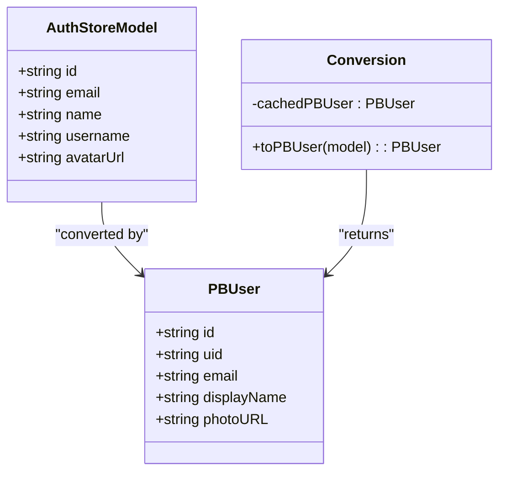
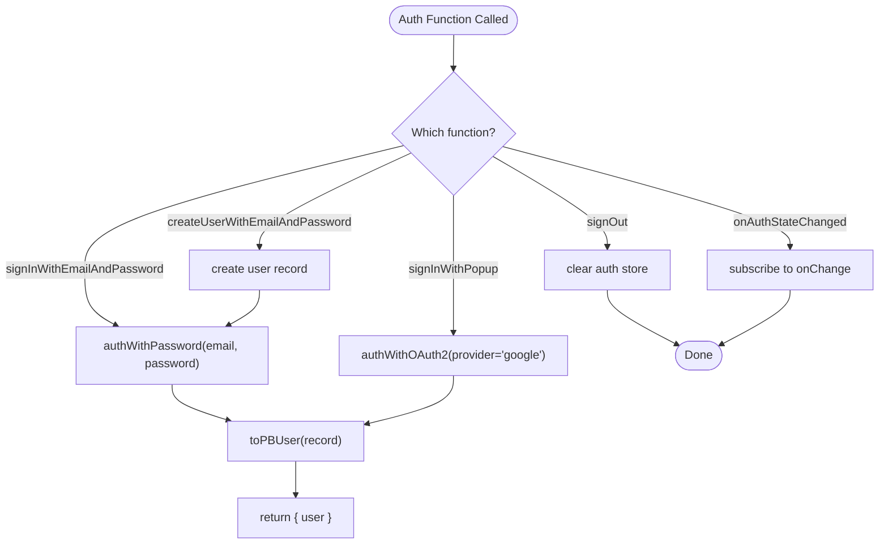
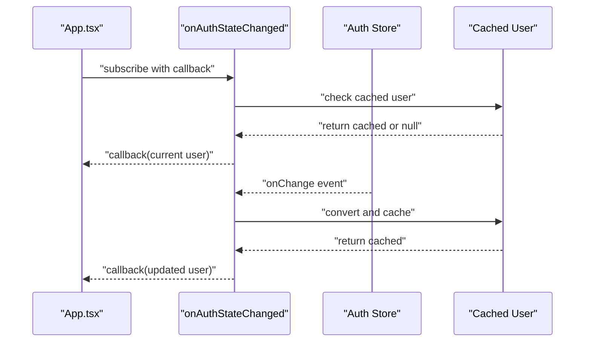
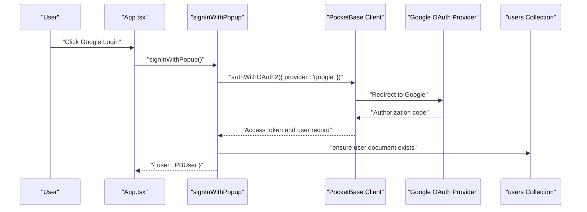
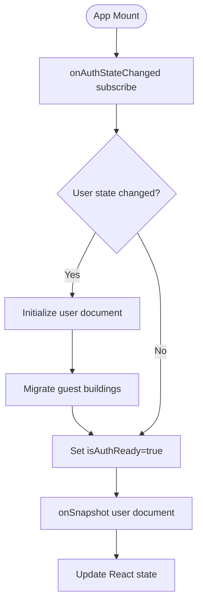
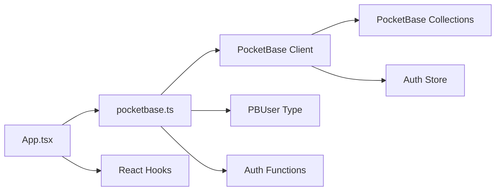

# Authentication System

<cite>
**Referenced Files in This Document**
- [pocketbase.ts](file://src/pocketbase.ts)
- [App.tsx](file://App.tsx)
- [types.ts](file://types.ts)
- [package.json](file://package.json)
- [README.md](file://README.md)
</cite>

## Table of Contents
1. [Introduction](#introduction)
2. [Project Structure](#project-structure)
3. [Core Components](#core-components)
4. [Architecture Overview](#architecture-overview)
5. [Detailed Component Analysis](#detailed-component-analysis)
6. [Dependency Analysis](#dependency-analysis)
7. [Performance Considerations](#performance-considerations)
8. [Troubleshooting Guide](#troubleshooting-guide)
9. [Conclusion](#conclusion)

## Introduction
This document provides comprehensive documentation for the PocketBase authentication system implementation used in the game application. It explains the Firebase-compatible authentication functions, the PBUser type definition, the toPBUser conversion function, authentication state management with automatic token refresh, and the cached user pattern for performance optimization. It also covers practical authentication flows, error handling strategies, and integration patterns with the React application, including Google OAuth using nip.io domain mapping and fallback mechanisms for new user account creation.

## Project Structure
The authentication system is implemented primarily in the PocketBase client wrapper and consumed by the main React application component. The key files involved are:
- src/pocketbase.ts: Implements Firebase-compatible authentication functions and PBUser conversion logic
- App.tsx: Integrates authentication state management, user initialization, and error handling
- types.ts: Defines game-related types (not directly related to authentication)
- package.json: Declares PocketBase dependency
- README.md: Project overview

**Diagram sources**
- [pocketbase.ts:1-121](file://src/pocketbase.ts#L1-L121)
- [App.tsx:1558-1616](file://App.tsx#L1558-L1616)

**Section sources**
- [pocketbase.ts:1-121](file://src/pocketbase.ts#L1-L121)
- [App.tsx:1558-1616](file://App.tsx#L1558-L1616)
- [package.json:12-20](file://package.json#L12-L20)

## Core Components
This section outlines the primary authentication components and their responsibilities.

- PocketBase Client Initialization
  - Creates a PocketBase client instance configured with a nip.io domain mapping for Google OAuth compatibility
  - Enables automatic cancellation to keep auth tokens alive

- Firebase-Compatible Auth Functions
  - signInWithEmailAndPassword: Authenticates users with email/password
  - createUserWithEmailAndPassword: Creates a new user and signs them in
  - signInWithPopup: Replaces popup-based Google OAuth with PocketBase OAuth2
  - signOut: Clears the auth store
  - onAuthStateChanged: Subscribes to authentication state changes

- PBUser Type and Conversion
  - PBUser defines a Firebase-like user object with id, uid, email, displayName, and photoURL
  - toPBUser converts PocketBase authStore models to PBUser, with caching for performance

- Authentication State Management
  - Automatic token refresh via PocketBase authStore.onChange
  - Cached user pattern to minimize object churn and improve React rendering performance

**Section sources**
- [pocketbase.ts:7-121](file://src/pocketbase.ts#L7-L121)
- [pocketbase.ts:39-78](file://src/pocketbase.ts#L39-L78)
- [pocketbase.ts:106-121](file://src/pocketbase.ts#L106-L121)

## Architecture Overview
The authentication architecture mirrors Firebase’s API surface while leveraging PocketBase’s capabilities. The React application subscribes to authentication state changes and initializes user data upon login. Google OAuth uses a nip.io domain mapping to satisfy OAuth provider requirements.

**Diagram sources**
- [pocketbase.ts:18-21](file://src/pocketbase.ts#L18-L21)
- [pocketbase.ts:49-78](file://src/pocketbase.ts#L49-L78)
- [App.tsx:1558-1616](file://App.tsx#L1558-L1616)

## Detailed Component Analysis

### PBUser Type and Conversion
The PBUser type provides a Firebase-compatible representation of authenticated users, enabling seamless integration with existing React components that expect Firebase-like user objects. The toPBUser function performs the conversion from PocketBase’s authStore model to PBUser, with caching to avoid unnecessary object recreation.

**Diagram sources**
- [pocketbase.ts:39-78](file://src/pocketbase.ts#L39-L78)

**Section sources**
- [pocketbase.ts:39-78](file://src/pocketbase.ts#L39-L78)

### Authentication Functions Implementation
The Firebase-compatible authentication functions wrap PocketBase’s native methods, providing a familiar API surface for the React application.

- signInWithEmailAndPassword
  - Uses PocketBase’s authWithPassword on the users collection
  - Converts the resulting record to PBUser via toPBUser
  - Returns an object containing the user

- createUserWithEmailAndPassword
  - Creates a new user record with passwordConfirm
  - Immediately signs the user in using signInWithEmailAndPassword

- signInWithPopup (Google OAuth)
  - Uses PocketBase’s authWithOAuth2 with provider 'google'
  - Ensures the user document exists in the users collection
  - Returns the converted PBUser

- signOut
  - Clears the PocketBase auth store

- onAuthStateChanged
  - Calls back immediately with the current state
  - Subscribes to auth store changes and invokes the callback on updates

**Diagram sources**
- [pocketbase.ts:18-37](file://src/pocketbase.ts#L18-L37)
- [pocketbase.ts:82-98](file://src/pocketbase.ts#L82-L98)
- [pocketbase.ts:100-121](file://src/pocketbase.ts#L100-L121)

**Section sources**
- [pocketbase.ts:18-37](file://src/pocketbase.ts#L18-L37)
- [pocketbase.ts:82-98](file://src/pocketbase.ts#L82-L98)
- [pocketbase.ts:100-121](file://src/pocketbase.ts#L100-L121)

### Authentication State Management and Token Refresh
The onAuthStateChanged function provides immediate feedback and continuous updates via PocketBase’s authStore.onChange. The cached user pattern ensures that React components receive stable object references, reducing unnecessary re-renders.

**Diagram sources**
- [pocketbase.ts:106-121](file://src/pocketbase.ts#L106-L121)
- [pocketbase.ts:49-78](file://src/pocketbase.ts#L49-L78)

**Section sources**
- [pocketbase.ts:106-121](file://src/pocketbase.ts#L106-L121)
- [pocketbase.ts:49-78](file://src/pocketbase.ts#L49-L78)

### Google OAuth Implementation with nip.io Domain Mapping
Google OAuth requires a real domain. The implementation uses a nip.io mapping to convert an IP address to a domain name, satisfying OAuth provider requirements. The signInWithPopup function triggers PocketBase’s OAuth2 flow with provider 'google'.

**Diagram sources**
- [pocketbase.ts:82-98](file://src/pocketbase.ts#L82-L98)
- [pocketbase.ts:7-8](file://src/pocketbase.ts#L7-L8)

**Section sources**
- [pocketbase.ts:82-98](file://src/pocketbase.ts#L82-L98)
- [pocketbase.ts:7-8](file://src/pocketbase.ts#L7-L8)

### React Application Integration Patterns
The React application integrates authentication through a dedicated effect that subscribes to auth state changes. Upon successful authentication, it initializes user data and migrates guest data if applicable.

- Auth Listener Effect
  - Subscribes to onAuthStateChanged
  - Sets user state and marks authentication ready
  - Initializes user document if missing
  - Migrates guest-owned buildings to the authenticated user

- Error Handling
  - Translates PocketBase error messages into user-friendly strings
  - Handles common validation errors (unique email, invalid email, password length)
  - Provides localized error messages for authentication failures

- User Data Synchronization
  - Loads user data via onSnapshot
  - Updates local state and persists changes to PocketBase collections
  - Handles presence tracking and online user synchronization

**Diagram sources**
- [App.tsx:1558-1616](file://App.tsx#L1558-L1616)
- [App.tsx:1678-1753](file://App.tsx#L1678-L1753)
- [App.tsx:1767-1819](file://App.tsx#L1767-L1819)

**Section sources**
- [App.tsx:1558-1616](file://App.tsx#L1558-L1616)
- [App.tsx:1678-1753](file://App.tsx#L1678-L1753)
- [App.tsx:1767-1819](file://App.tsx#L1767-L1819)

## Dependency Analysis
The authentication system relies on the PocketBase client library and integrates with React’s state management. The key dependencies and relationships are:

- PocketBase Client
  - Provides authentication APIs and real-time subscriptions
  - Manages auth store and token lifecycle
  - Handles OAuth flows and collection operations

- React Application
  - Consumes Firebase-compatible auth functions
  - Manages authentication state and user initialization
  - Synchronizes user data via onSnapshot

**Diagram sources**
- [pocketbase.ts:1-121](file://src/pocketbase.ts#L1-L121)
- [App.tsx:1558-1616](file://App.tsx#L1558-L1616)
- [package.json:18](file://package.json#L18)

**Section sources**
- [pocketbase.ts:1-121](file://src/pocketbase.ts#L1-L121)
- [App.tsx:1558-1616](file://App.tsx#L1558-L1616)
- [package.json:18](file://package.json#L18)

## Performance Considerations
- Cached User Pattern
  - The toPBUser function caches the last PBUser instance and returns it if no fields have changed, minimizing object churn and improving React rendering performance.

- Automatic Token Refresh
  - The auth store’s onChange mechanism ensures that UI updates occur reactively without manual polling, keeping the application responsive.

- Efficient Data Loading
  - The application uses onSnapshot for real-time updates and getDocs for bulk operations, balancing responsiveness with performance.

- Optimistic Updates
  - Certain UI actions (e.g., moving buildings) update local state immediately and reconcile with server data asynchronously, providing a snappy user experience.

[No sources needed since this section provides general guidance]

## Troubleshooting Guide
Common authentication issues and their resolutions:

- Authentication Failures
  - Verify PocketBase server connectivity and correct endpoint configuration
  - Check that email/password credentials are valid and meet schema requirements
  - Review translated error messages for specific validation failures

- Google OAuth Issues
  - Ensure the nip.io domain mapping is correctly configured
  - Verify OAuth provider settings in PocketBase admin panel
  - Confirm that redirect URIs match the configured domain

- User Initialization Problems
  - Check that user documents are being created in the users collection
  - Verify that guest-to-user data migration occurs when switching identities
  - Monitor presence and online user synchronization for debugging

- Error Handling
  - The application translates common PocketBase errors into user-friendly messages
  - Review console logs for detailed error information during authentication attempts

**Section sources**
- [App.tsx:1678-1753](file://App.tsx#L1678-L1753)
- [pocketbase.ts:82-98](file://src/pocketbase.ts#L82-L98)

## Conclusion
The PocketBase authentication system provides a robust, Firebase-compatible layer for the game application. Through the PBUser type, toPBUser conversion, and reactive auth state management, it enables seamless integration with React components while leveraging PocketBase’s OAuth capabilities and real-time features. The cached user pattern and automatic token refresh contribute to a responsive and reliable user experience, while comprehensive error handling ensures clear feedback during authentication flows.