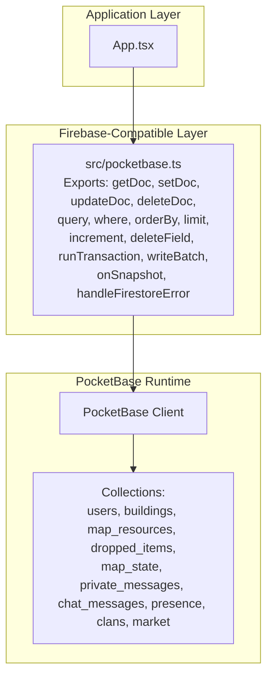
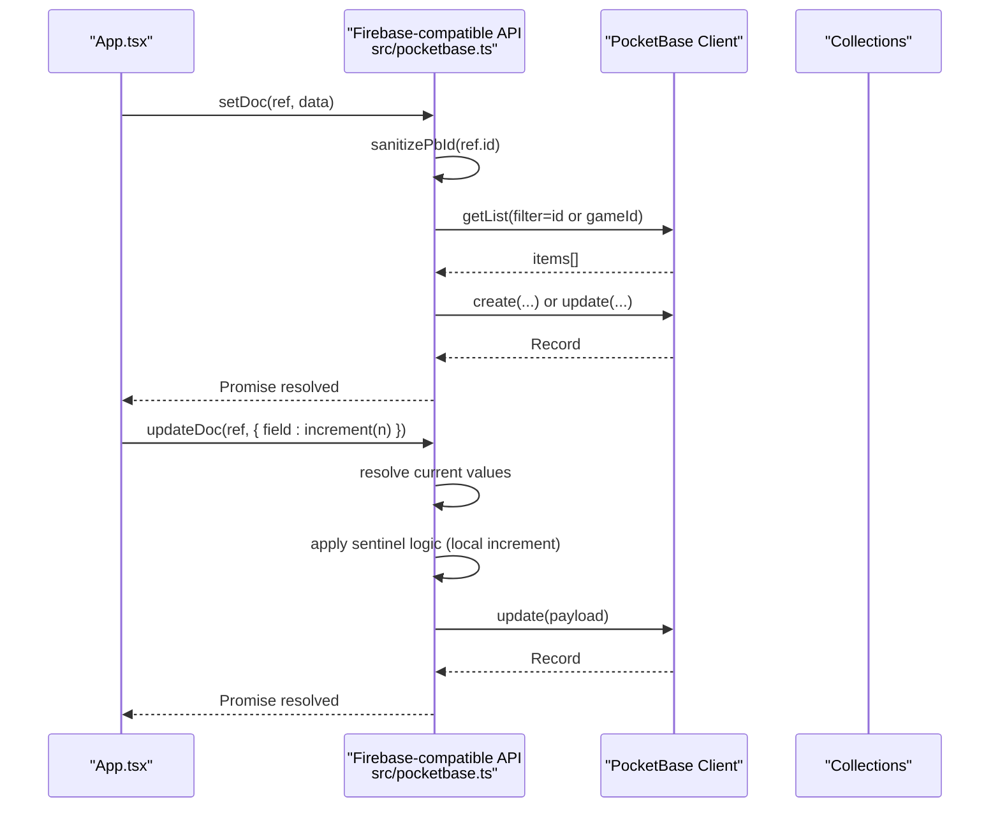
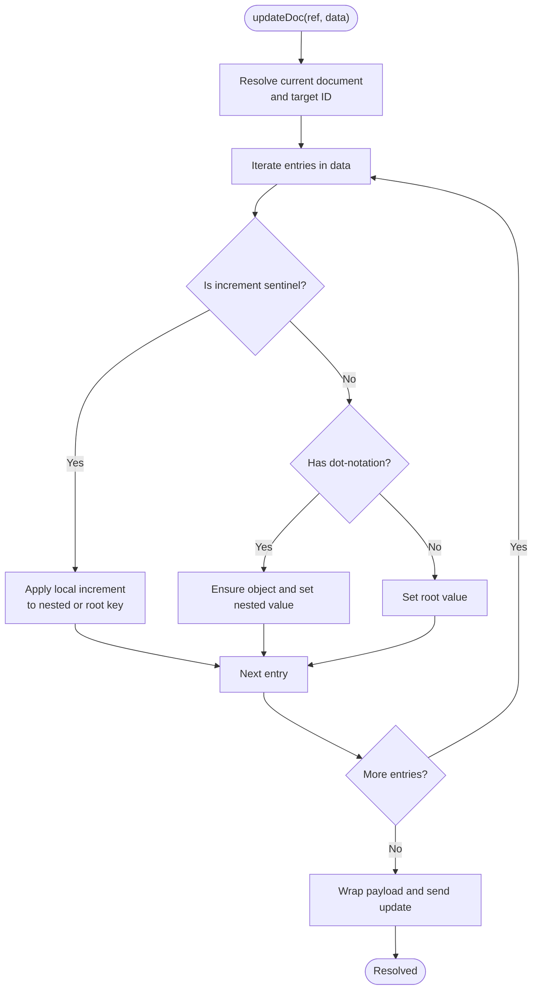
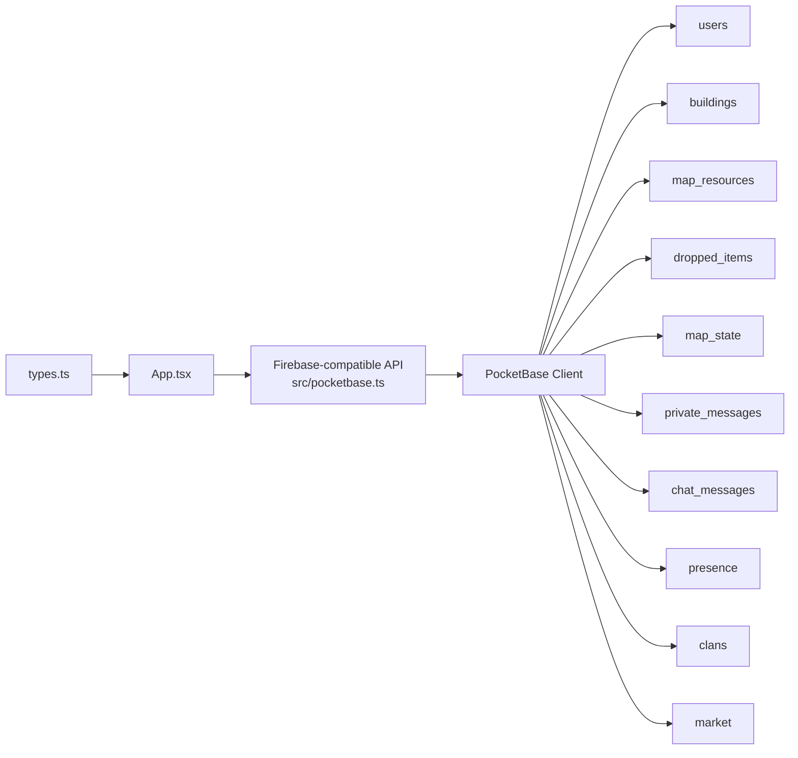

# CRUD Operations

<cite>
**Referenced Files in This Document**
- [pocketbase.ts](file://src/pocketbase.ts)
- [App.tsx](file://App.tsx)
- [types.ts](file://types.ts)
</cite>

## Table of Contents
1. [Introduction](#introduction)
2. [Project Structure](#project-structure)
3. [Core Components](#core-components)
4. [Architecture Overview](#architecture-overview)
5. [Detailed Component Analysis](#detailed-component-analysis)
6. [Dependency Analysis](#dependency-analysis)
7. [Performance Considerations](#performance-considerations)
8. [Troubleshooting Guide](#troubleshooting-guide)
9. [Conclusion](#conclusion)
10. [Appendices](#appendices)

## Introduction
This document explains the Firebase-compatible CRUD layer built on top of PocketBase. It covers the four primary operations (getDoc, setDoc, updateDoc, deleteDoc), the query builder (where, orderBy, limit), the increment sentinel for numeric updates, the deleteField sentinel for removing fields, and the transaction system (runTransaction) and batch writes (writeBatch). It also documents error handling, retry mechanisms, optimistic update patterns, and practical usage patterns observed in the codebase.

## Project Structure
The Firebase-compatible layer is implemented in a single module that wraps PocketBase’s client and exposes familiar Firebase-style APIs. The main application code (App.tsx) demonstrates how these APIs are used for real-time gameplay state synchronization.

**Diagram sources**
- [pocketbase.ts](file://src/pocketbase.ts)
- [App.tsx](file://App.tsx)

**Section sources**
- [pocketbase.ts](file://src/pocketbase.ts)
- [App.tsx](file://App.tsx)

## Core Components
- getDoc: Fetches a single document by sanitized ID, returning a snapshot that reports existence and data.
- setDoc: Upserts a document by creating if missing or updating if present, using a robust detection strategy.
- updateDoc: Partially updates a document with support for nested keys and numeric increments via a sentinel.
- deleteDoc: Removes a document, with special handling for map_resources using coordinates.
- query builder: where, orderBy, limit produce PocketBase-compatible filter and sort clauses.
- increment sentinel: Marks numeric increments to be applied locally before sending updates.
- deleteField sentinel: Produces a marker to remove a field during updates.
- runTransaction: Executes a transactional function with get/update/set/delete; operations are queued and executed sequentially after the function completes.
- writeBatch: Queues operations and commits them concurrently.
- onSnapshot: Subscribes to real-time updates with retry logic and throttled refresh for queries.

**Section sources**
- [pocketbase.ts](file://src/pocketbase.ts)

## Architecture Overview
The layer translates Firebase-style calls into PocketBase requests, normalizes IDs, transforms data to/from the PocketBase schema, and provides real-time subscriptions with retry and throttling.

**Diagram sources**
- [pocketbase.ts](file://src/pocketbase.ts)

## Detailed Component Analysis

### getDoc
- Purpose: Retrieve a single document by DocRef.
- Behavior:
  - Sanitizes the incoming ID to a 15-character alphanumeric ID.
  - Calls PocketBase getOne; if not found, returns a non-existing snapshot.
- Error handling: Swallows not-found errors and returns an empty snapshot.
- Typical usage: Initial fetch before subscribing or conditional reads.

**Section sources**
- [pocketbase.ts](file://src/pocketbase.ts)

### setDoc
- Purpose: Create or replace a document (upsert).
- Behavior:
  - Sanitizes ID.
  - Wraps data according to collection-specific known fields and moves extras into a JSON data field.
  - Detects existence via a lightweight list query and either creates with the sanitized ID or updates existing.
- Error handling:
  - Ignores 404 anomalies from the detection step.
  - Routes other errors to centralized handler.
- Notes:
  - Ensures the record ID is exactly 15 characters.
  - Uses a wrapper/unwrapper to keep “filterable” fields at top-level and arbitrary game data under a JSON field.

**Section sources**
- [pocketbase.ts](file://src/pocketbase.ts)

### updateDoc
- Purpose: Partial update with support for nested keys and numeric increments.
- Behavior:
  - Resolves current document (including fallbacks for map_resources by coordinates).
  - Applies sentinel logic:
    - increment(n): adds to numeric values (supports nested dot notation).
    - deleteField(): removes a field by setting it to null.
  - Supports dot-notation for nested updates.
  - Wraps and sends the payload to PocketBase.
- Error handling:
  - Centralized error handler invoked; rethrows to caller to surface failures.
- Optimistic updates:
  - The application layer performs optimistic UI updates alongside asynchronous server writes (see usage examples).

**Diagram sources**
- [pocketbase.ts](file://src/pocketbase.ts)

**Section sources**
- [pocketbase.ts](file://src/pocketbase.ts)

### deleteDoc
- Purpose: Remove a document by ID.
- Behavior:
  - Sanitizes ID and deletes by ID.
  - Special-case for map_resources: if deletion fails with 404, attempts to locate by coordinates and delete the matched record.
- Error handling:
  - Ignores 404 for map_resources fallback.
  - Other errors routed to centralized handler.

**Section sources**
- [pocketbase.ts](file://src/pocketbase.ts)

### Query Builder (where, orderBy, limit)
- where(field, op, value):
  - Translates Firebase-style operators to PocketBase equivalents.
  - Special handling:
    - in: expands to multiple equality clauses joined by OR.
    - array-contains: uses JSON array containment operator.
    - timestamp maps to updated for ordering.
- orderBy(field, direction):
  - Sorts ascending or descending; timestamp maps to updated.
- limit(n):
  - Limits returned items.
- Translation to PocketBase:
  - where produces a filter expression.
  - orderBy produces a sort expression.
  - limit sets perPage.

**Section sources**
- [pocketbase.ts](file://src/pocketbase.ts)

### Increment Sentinel (increment)
- Purpose: Mark numeric increments in update payloads.
- Behavior:
  - Returned sentinel is recognized by updateDoc to perform local arithmetic before sending to PocketBase.
  - Supports nested keys via dot notation.

**Section sources**
- [pocketbase.ts](file://src/pocketbase.ts)

### Delete Field Sentinel (deleteField)
- Purpose: Remove a field from a document.
- Behavior:
  - Returns null; updateDoc treats this as a deletion instruction.

**Section sources**
- [pocketbase.ts](file://src/pocketbase.ts)

### Transactions (runTransaction)
- Purpose: Execute a function with transactional semantics.
- Behavior:
  - Provides a transaction object with get/update/set/delete.
  - Queues operations; executes them sequentially after the function returns.
- Limitations:
  - Not atomic across the wire; operations are queued and executed concurrently post-function.
  - No rollback; failures in queued operations are handled by centralized error handler.

**Section sources**
- [pocketbase.ts](file://src/pocketbase.ts)

### Batch Writes (writeBatch)
- Purpose: Queue multiple operations and commit them concurrently.
- Behavior:
  - set/update/delete enqueue operations.
  - commit executes all enqueued operations concurrently.

**Section sources**
- [pocketbase.ts](file://src/pocketbase.ts)

### Real-Time Subscriptions (onSnapshot)
- Purpose: Subscribe to single documents or queries with live updates.
- Behavior:
  - Initial fetch followed by subscription to PocketBase events.
  - Retry logic for stale client IDs with exponential backoff.
  - Queries are throttled to reduce churn.
- Error handling:
  - Passes errors to an optional error callback.

**Section sources**
- [pocketbase.ts](file://src/pocketbase.ts)

## Dependency Analysis
- App.tsx depends on the Firebase-compatible layer exported from src/pocketbase.ts.
- The layer depends on PocketBase client and translates operations to PocketBase collections.
- Data types in types.ts define the shape of game entities and are used throughout the app to drive UI and logic.

**Diagram sources**
- [pocketbase.ts](file://src/pocketbase.ts)
- [App.tsx](file://App.tsx)
- [types.ts](file://types.ts)

**Section sources**
- [pocketbase.ts](file://src/pocketbase.ts)
- [App.tsx](file://App.tsx)
- [types.ts](file://types.ts)

## Performance Considerations
- ID sanitization ensures exactly 15-character IDs for consistency and avoids schema mismatches.
- getDocs paginates with a perPage cap to prevent oversized responses.
- deleteAll deletes in chunks to avoid overwhelming the server.
- onSnapshot throttles query refreshes to reduce network load.
- runTransaction and writeBatch queue operations to minimize round trips.

[No sources needed since this section provides general guidance]

## Troubleshooting Guide
Common issues and strategies:
- Permission errors:
  - The centralized error handler logs detailed field-level validation errors and suggests checking PocketBase API rules.
- Stale client ID in real-time:
  - onSnapshot retries with backoff when encountering stale client ID errors.
- Expected race conditions:
  - The application wraps handleFirestoreError to ignore benign race conditions in the game loop.
- Network failures:
  - Use try/catch around operations and rely on centralized error logging.
  - For transient failures, consider retrying at the application layer with backoff.

**Section sources**
- [pocketbase.ts](file://src/pocketbase.ts)
- [App.tsx](file://App.tsx)

## Conclusion
The Firebase-compatible layer provides a pragmatic bridge to PocketBase with familiar CRUD and query APIs, robust ID normalization, data wrapping/unwrapping, and real-time subscriptions with retry and throttling. While transactions and batches are not truly atomic across the wire, they offer predictable sequencing and improved performance. The sentinel system enables expressive updates for numeric increments and field removal. The application demonstrates optimistic updates and centralized error handling to deliver a responsive multiplayer experience.

[No sources needed since this section summarizes without analyzing specific files]

## Appendices

### Practical Patterns and Examples Observed in the Application
- Upsert and initial generation:
  - Use setDoc to create or update game state documents.
  - Example pattern: generate map resources and buildings, then persist to collections.
- Conditional updates with increments:
  - Use updateDoc with increment sentinel to adjust counters and inventories.
  - Example pattern: award gold or items and update user inventory.
- Field removal:
  - Use deleteField sentinel to remove optional fields (e.g., timers or flags).
- Batch updates:
  - Use writeBatch to atomically update multiple documents and commit in parallel.
- Transactions:
  - Use runTransaction to coordinate multi-field updates with local sequencing.
- Real-time synchronization:
  - Use onSnapshot to subscribe to collections and documents, with throttling and error callbacks.

**Section sources**
- [App.tsx](file://App.tsx)
- [pocketbase.ts](file://src/pocketbase.ts)