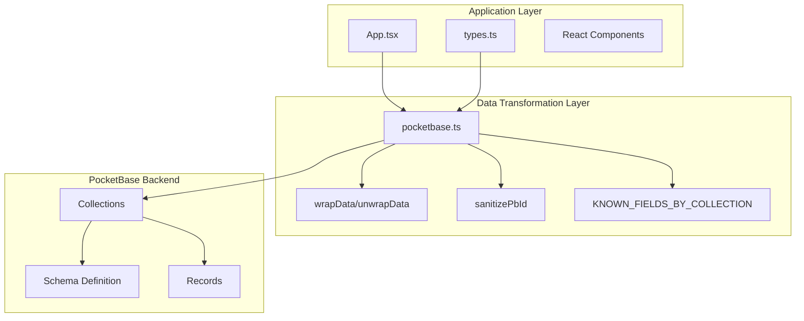
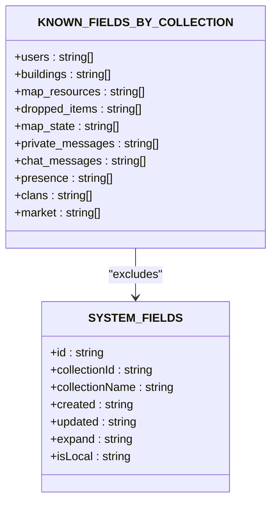
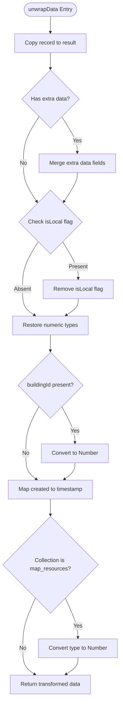
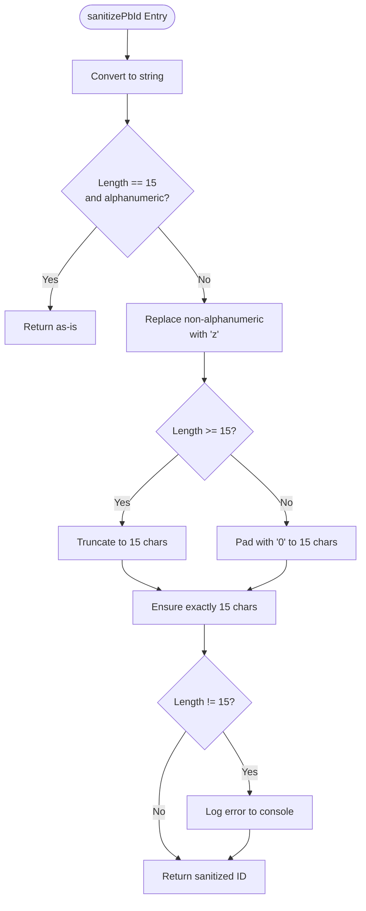
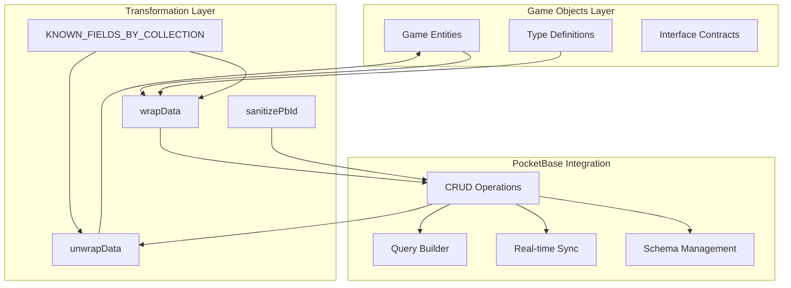
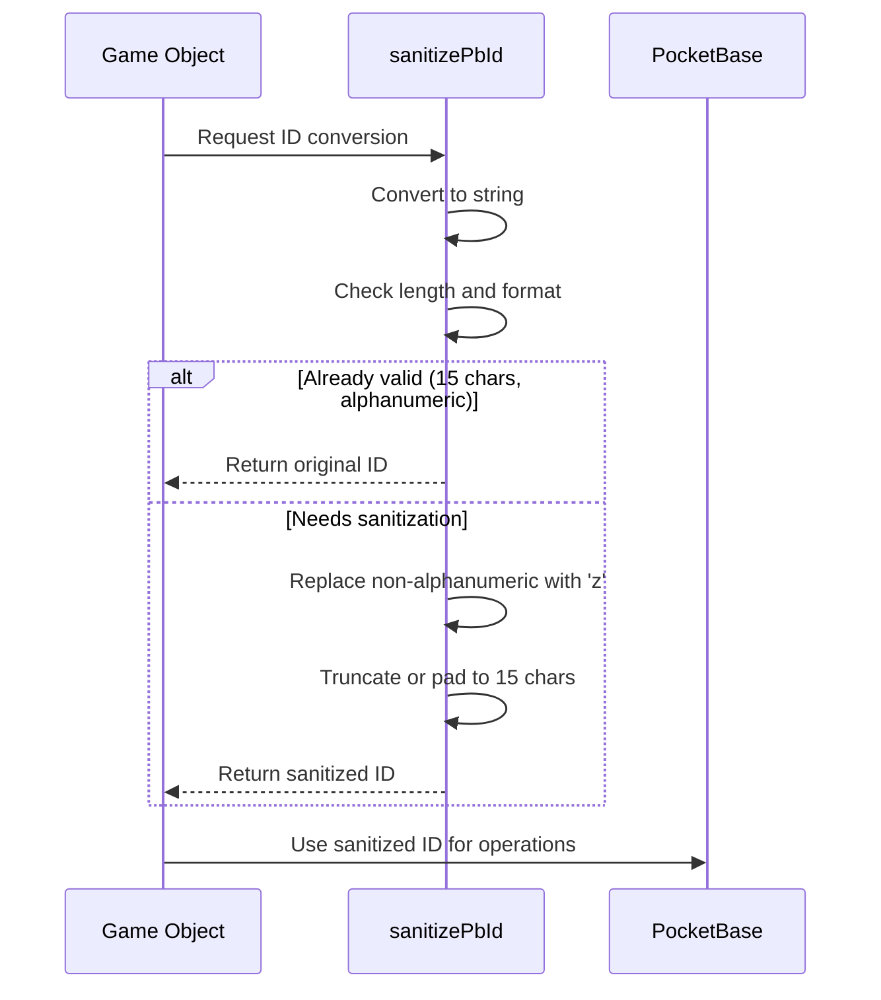
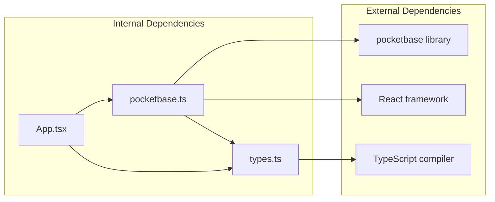

# Data Transformation Layer

<cite>
**Referenced Files in This Document**
- [pocketbase.ts](file://src/pocketbase.ts)
- [types.ts](file://types.ts)
- [App.tsx](file://App.tsx)
- [fix_schema2.mjs](file://fix_schema2.mjs)
</cite>

## Table of Contents
1. [Introduction](#introduction)
2. [Project Structure](#project-structure)
3. [Core Components](#core-components)
4. [Architecture Overview](#architecture-overview)
5. [Detailed Component Analysis](#detailed-component-analysis)
6. [Dependency Analysis](#dependency-analysis)
7. [Performance Considerations](#performance-considerations)
8. [Troubleshooting Guide](#troubleshooting-guide)
9. [Conclusion](#conclusion)

## Introduction

The data transformation layer serves as a bridge between the game's object-oriented data structures and PocketBase's strict schema requirements. This layer handles the conversion between game data and PocketBase records, manages field mapping strategies, and ensures data integrity through type restoration and ID sanitization mechanisms.

The system addresses several key challenges:
- PocketBase requires all fields to be defined in the schema, while games often have dynamic data structures
- Game objects use various data types that PocketBase cannot directly store
- Game-generated IDs must conform to PocketBase's strict 15-character alphanumeric format
- Real-time synchronization requires consistent data representation across clients

## Project Structure

The data transformation layer is primarily implemented in the PocketBase client module, with supporting type definitions and usage examples throughout the application.



**Diagram sources**
- [pocketbase.ts:143-276](file://src/pocketbase.ts#L143-L276)
- [types.ts:1-197](file://types.ts#L1-L197)

**Section sources**
- [pocketbase.ts:143-276](file://src/pocketbase.ts#L143-L276)
- [types.ts:1-197](file://types.ts#L1-L197)

## Core Components

### KNOWN_FIELDS_BY_COLLECTION Mapping System

The mapping system defines which fields are stored at the top level versus in the JSON data field for each PocketBase collection. This approach allows for efficient querying while accommodating arbitrary game data.



**Diagram sources**
- [pocketbase.ts:150-161](file://src/pocketbase.ts#L150-L161)
- [pocketbase.ts:163](file://src/pocketbase.ts#L163)

The mapping system categorizes fields into two groups:
- **Top-level filterable fields**: Stored directly in the collection schema for efficient querying
- **JSON data field**: Contains arbitrary game data that doesn't require indexing

**Section sources**
- [pocketbase.ts:150-161](file://src/pocketbase.ts#L150-L161)
- [pocketbase.ts:163](file://src/pocketbase.ts#L163)

### wrapData Function

The `wrapData` function transforms game objects into PocketBase-compatible records by separating filterable fields from arbitrary data.

```mermaid
flowchart TD
Start([wrapData Entry]) --> GetFields["Get KNOWN_FIELDS for collection"]
GetFields --> InitResult["Initialize result with { data: {} }"]
InitResult --> IterateFields["Iterate through object fields"]
IterateFields --> CheckData{"Is field 'data'?"}
CheckData --> |Yes| SkipData["Skip raw 'data' property"]
CheckData --> |No| CheckKnown{"Is field in KNOWN_FIELDS<br/>and not SYSTEM_FIELDS?"}
CheckKnown --> |Yes| TypeCheck{"Special type handling?"}
TypeCheck --> |Yes| ForceString["Force string conversion<br/>(buildingId, type)"}
TypeCheck --> |No| KeepOriginal["Keep original value"]
CheckKnown --> |No| StoreExtra["Store in result.data"]
ForceString --> AddToResult["Add to result"]
KeepOriginal --> AddToResult
StoreExtra --> AddToResult
AddToResult --> NextField["Next field"]
SkipData --> NextField
NextField --> IterateFields
IterateFields --> |Complete| ReturnResult["Return transformed object"]
```

**Diagram sources**
- [pocketbase.ts:165-184](file://src/pocketbase.ts#L165-L184)

**Section sources**
- [pocketbase.ts:165-184](file://src/pocketbase.ts#L165-L184)

### unwrapData Function

The `unwrapData` function restores PocketBase records back to game-friendly objects by merging top-level fields with JSON data and applying type corrections.



**Diagram sources**
- [pocketbase.ts:186-218](file://src/pocketbase.ts#L186-L218)

**Section sources**
- [pocketbase.ts:186-218](file://src/pocketbase.ts#L186-L218)

### sanitizePbId Function

The `sanitizePbId` function ensures all game-generated IDs conform to PocketBase's strict requirements of exactly 15 alphanumeric characters.



**Diagram sources**
- [pocketbase.ts:252-276](file://src/pocketbase.ts#L252-L276)

**Section sources**
- [pocketbase.ts:252-276](file://src/pocketbase.ts#L252-L276)

## Architecture Overview

The data transformation layer follows a layered architecture that separates concerns between game logic, transformation logic, and PocketBase integration.



**Diagram sources**
- [pocketbase.ts:143-456](file://src/pocketbase.ts#L143-L456)

**Section sources**
- [pocketbase.ts:143-456](file://src/pocketbase.ts#L143-L456)

## Detailed Component Analysis

### Field Mapping Strategies

The system employs several strategies to handle different types of data:

#### Top-Level Filterable Fields
Fields listed in `KNOWN_FIELDS_BY_COLLECTION` are stored directly in the PocketBase schema for efficient querying. These typically include:
- Owner identifiers (`ownerId`, `senderId`, `receiverId`)
- Position coordinates (`x`, `y`, `zoneId`)
- Game identifiers (`gameId`, `buildingId`, `itemId`)
- Timestamps (`timestamp`, `created`, `updated`)
- Counters and quantities (`gold`, `rubies`, `level`, `glory`, `energy`)

#### JSON Data Field Strategy
Arbitrary game data is stored in the `data` JSON field, allowing for:
- Complex nested structures
- Dynamic properties that don't require indexing
- Game-specific configurations and state
- Historical data and metadata

#### Special Type Handling

Certain fields require special treatment during transformation:

**Numeric Field Restoration**
- `buildingId`: Converted from string back to number for game logic
- `map_resources.type`: Converted from string to number for resource type identification

**String Forced Conversion**
- `buildingId`: Forced to string for PocketBase Text fields
- `map_resources.type`: Forced to string for schema compatibility

**Section sources**
- [pocketbase.ts:150-161](file://src/pocketbase.ts#L150-L161)
- [pocketbase.ts:172-178](file://src/pocketbase.ts#L172-L178)
- [pocketbase.ts:200-209](file://src/pocketbase.ts#L200-L209)

### Data Transformation Patterns

#### Example 1: Building Object Transformation

**Input (Game Object):**
```typescript
{
  id: "17_52",
  x: 10,
  y: 20,
  zoneId: "0_1",
  buildingId: 301,
  ownerId: "user_123",
  ownerName: "Player1",
  isConstructing: true,
  constructionEndTime: 1640995200000,
  hp: 100,
  maxHp: 100
}
```

**Output (PocketBase Record):**
```typescript
{
  x: 10,
  y: 20,
  zoneId: "0_1",
  buildingId: "301",
  ownerId: "user_123",
  data: {
    id: "17_52",
    ownerName: "Player1",
    isConstructing: true,
    constructionEndTime: 1640995200000,
    hp: 100,
    maxHp: 100
  }
}
```

#### Example 2: User Object Transformation

**Input (Game Object):**
```typescript
{
  uid: "user_123",
  name: "Player1",
  avatar: "avatar_url",
  gold: 1000,
  rubies: 100,
  level: 5,
  inventory: { 10001: 50, 10005: 25 }
}
```

**Output (PocketBase Record):**
```typescript
{
  name: "Player1",
  avatar: "avatar_url",
  gold: 1000,
  rubies: 100,
  level: 5,
  data: {
    uid: "user_123",
    inventory: { 10001: 50, 10005: 25 }
  }
}
```

**Section sources**
- [pocketbase.ts:165-184](file://src/pocketbase.ts#L165-L184)
- [pocketbase.ts:186-218](file://src/pocketbase.ts#L186-L218)

### ID Sanitization Mechanism

The ID sanitization process ensures all game-generated IDs meet PocketBase's requirements:



**Diagram sources**
- [pocketbase.ts:252-276](file://src/pocketbase.ts#L252-L276)

**Section sources**
- [pocketbase.ts:252-276](file://src/pocketbase.ts#L252-L276)

## Dependency Analysis

The data transformation layer has minimal external dependencies and maintains loose coupling with the broader application architecture.



**Diagram sources**
- [pocketbase.ts:1-11](file://src/pocketbase.ts#L1-L11)
- [types.ts:1-197](file://types.ts#L1-L197)

**Section sources**
- [pocketbase.ts:1-11](file://src/pocketbase.ts#L1-L11)
- [types.ts:1-197](file://types.ts#L1-L197)

## Performance Considerations

### Memory Efficiency
- The transformation functions operate on object copies rather than modifying original game objects
- JSON data field minimizes memory overhead by storing only necessary top-level fields
- Type restoration occurs only when needed during data retrieval

### Network Optimization
- Field mapping reduces payload sizes by storing only frequently queried fields at the top level
- Real-time synchronization benefits from efficient data structures
- Batch operations leverage PocketBase's built-in optimization

### Processing Overhead
- ID sanitization adds minimal computational overhead (O(n) where n is character count)
- Type restoration performs constant-time conversions
- Field mapping operations are linear in the number of object properties

## Troubleshooting Guide

### Common Transformation Issues

**Issue: Type Conversion Errors**
- **Symptom**: Numbers appearing as strings in game logic
- **Cause**: Missing type restoration in unwrapData
- **Solution**: Verify that numeric fields are properly converted back to numbers

**Issue: ID Format Errors**
- **Symptom**: PocketBase errors indicating invalid record ID format
- **Cause**: Non-sanitized game-generated IDs
- **Solution**: Ensure all IDs pass through sanitizePbId before PocketBase operations

**Issue: Field Missing from Queries**
- **Symptom**: Query results missing expected fields
- **Cause**: Field not included in KNOWN_FIELDS_BY_COLLECTION
- **Solution**: Add field to appropriate collection mapping

**Issue: Data Loss During Transformation**
- **Symptom**: Arbitrary game data disappearing
- **Cause**: Data stored in wrong location (top-level vs JSON field)
- **Solution**: Review field categorization in KNOWN_FIELDS_BY_COLLECTION

### Debugging Strategies

**Enable Debug Logging**
The system includes debug logging for ID sanitization failures:
- Check browser console for "ID IS NOT 15 CHARS!" error messages
- Monitor PocketBase logs for validation errors
- Use browser developer tools to inspect transformed objects

**Validation Checks**
- Verify that all required fields are present in KNOWN_FIELDS_BY_COLLECTION
- Test ID sanitization with various input formats
- Validate type restoration with edge cases (null, undefined, empty strings)

**Section sources**
- [pocketbase.ts:272-273](file://src/pocketbase.ts#L272-L273)
- [pocketbase.ts:800-816](file://src/pocketbase.ts#L800-L816)

## Conclusion

The data transformation layer provides a robust bridge between game objects and PocketBase records through carefully designed field mapping, type restoration, and ID sanitization mechanisms. The system's architecture balances flexibility with performance, allowing games to maintain complex data structures while leveraging PocketBase's powerful backend capabilities.

Key strengths of the implementation include:
- Comprehensive field mapping system that accommodates diverse game data structures
- Efficient type restoration that maintains game logic expectations
- Strict ID sanitization that prevents database corruption
- Minimal performance impact through optimized transformation algorithms
- Clear separation of concerns that facilitates maintenance and extension

The layer successfully addresses the fundamental challenge of bridging dynamic game data with static database schemas, enabling real-time multiplayer functionality while maintaining data integrity and performance.