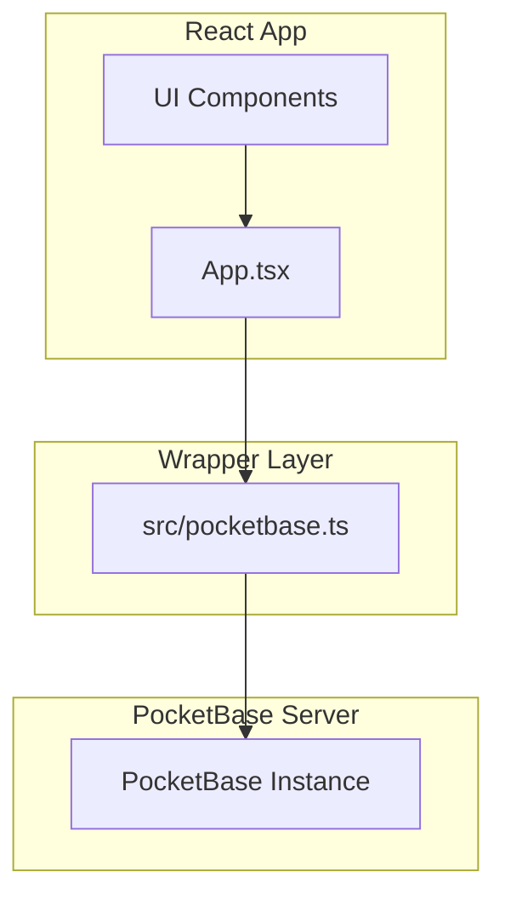
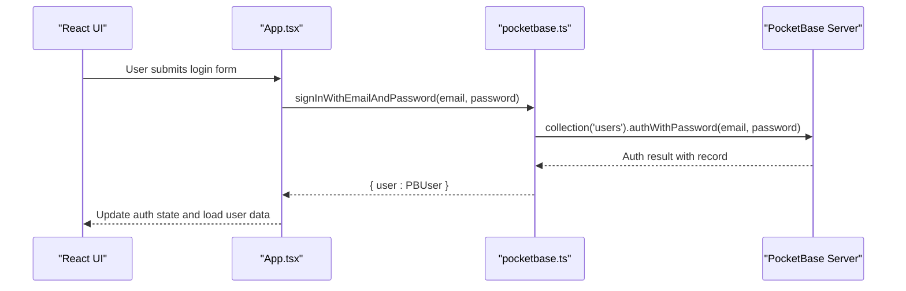
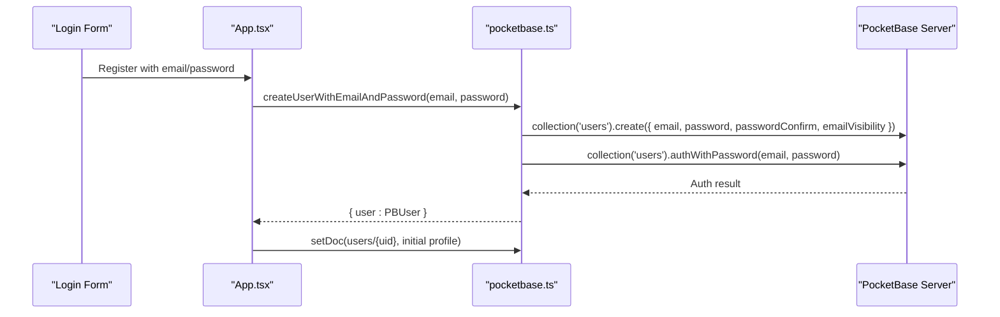
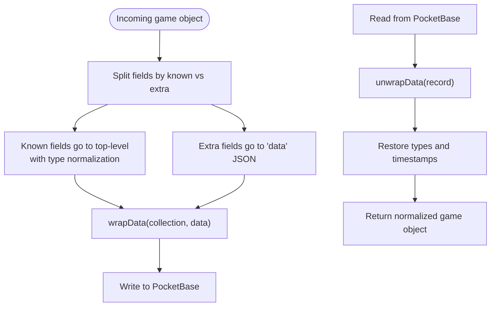
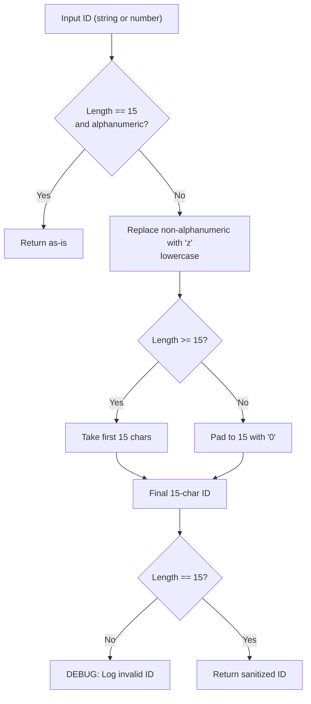
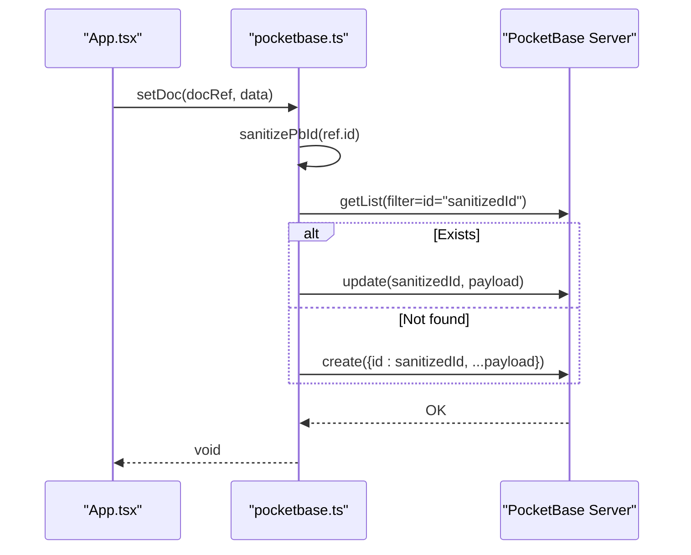
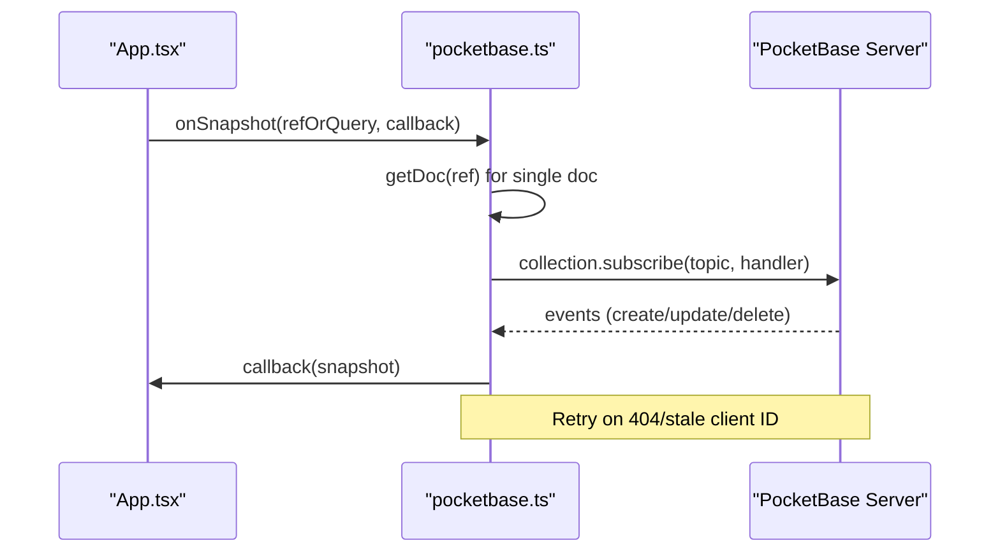
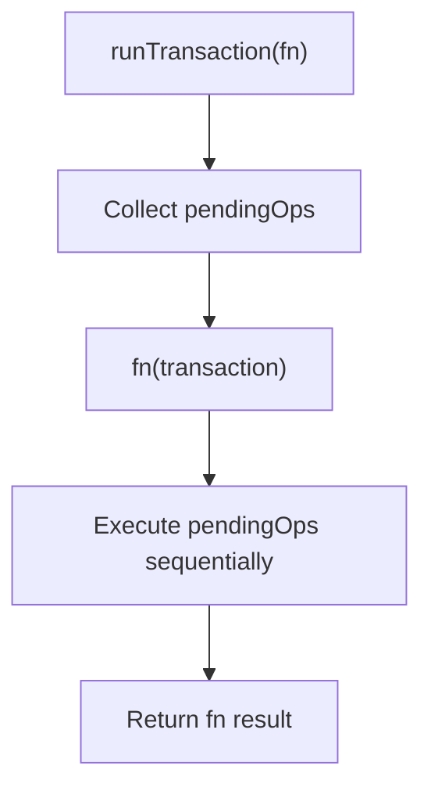
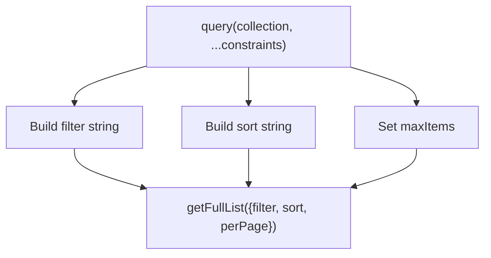
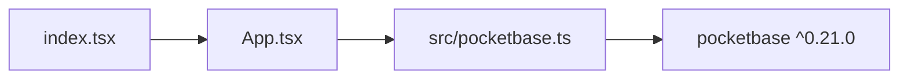

# PocketBase Wrapper Implementation

<cite>
**Referenced Files in This Document**
- [pocketbase.ts](file://src/pocketbase.ts)
- [App.tsx](file://App.tsx)
- [types.ts](file://types.ts)
- [package.json](file://package.json)
- [index.tsx](file://index.tsx)
</cite>

## Table of Contents
1. [Introduction](#introduction)
2. [Project Structure](#project-structure)
3. [Core Components](#core-components)
4. [Architecture Overview](#architecture-overview)
5. [Detailed Component Analysis](#detailed-component-analysis)
6. [Dependency Analysis](#dependency-analysis)
7. [Performance Considerations](#performance-considerations)
8. [Troubleshooting Guide](#troubleshooting-guide)
9. [Conclusion](#conclusion)

## Introduction
This document explains the PocketBase wrapper implementation that provides a Firebase-compatible API abstraction layer for a React-based real-time MMORTS game. It covers:
- Authentication system: email/password login, Google OAuth integration, and user session management
- Data transformation layer: conversion between game objects and PocketBase records
- ID sanitization to enforce PocketBase’s strict 15-character alphanumeric record IDs
- CRUD operations with error handling and retry mechanisms
- Real-time subscriptions and transaction/work batching limitations
- Practical usage patterns demonstrated in the React application

## Project Structure
The wrapper is implemented as a single module that exports a Firebase-like API surface backed by PocketBase. The React app imports and uses these APIs directly.

**Diagram sources**
- [pocketbase.ts:1-12](file://src/pocketbase.ts#L1-L12)
- [App.tsx:1-11](file://App.tsx#L1-L11)

**Section sources**
- [pocketbase.ts:1-12](file://src/pocketbase.ts#L1-L12)
- [App.tsx:1-11](file://App.tsx#L1-L11)
- [package.json:12-21](file://package.json#L12-L21)

## Core Components
- PocketBase client initialization and auto-cancellation
- Authentication helpers mirroring Firebase auth exports
- Firestore-compatible helpers and types
- Data transformation functions (wrapData, unwrapData)
- ID sanitization to enforce 15-character alphanumeric IDs
- CRUD operations (getDoc, setDoc, updateDoc, deleteDoc)
- Query builder and real-time subscriptions with retry logic
- Transaction and write batch abstractions (non-atomic)

**Section sources**
- [pocketbase.ts:7-11](file://src/pocketbase.ts#L7-L11)
- [pocketbase.ts:13-121](file://src/pocketbase.ts#L13-L121)
- [pocketbase.ts:143-240](file://src/pocketbase.ts#L143-L240)
- [pocketbase.ts:165-218](file://src/pocketbase.ts#L165-L218)
- [pocketbase.ts:252-276](file://src/pocketbase.ts#L252-L276)
- [pocketbase.ts:288-448](file://src/pocketbase.ts#L288-L448)
- [pocketbase.ts:477-560](file://src/pocketbase.ts#L477-L560)
- [pocketbase.ts:578-707](file://src/pocketbase.ts#L578-L707)
- [pocketbase.ts:716-765](file://src/pocketbase.ts#L716-L765)

## Architecture Overview
The wrapper exposes a Firebase-like API surface while internally delegating to PocketBase. It normalizes differences between Firebase and PocketBase semantics:
- Authentication: email/password and Google OAuth
- Collections: map to PocketBase collections
- Documents: map to PocketBase records with sanitized IDs
- Queries: translated to PocketBase filter/sort
- Real-time: PocketBase collection subscriptions with retry and throttling

**Diagram sources**
- [pocketbase.ts:18-37](file://src/pocketbase.ts#L18-L37)
- [App.tsx:1711-1733](file://App.tsx#L1711-L1733)

**Section sources**
- [pocketbase.ts:18-37](file://src/pocketbase.ts#L18-L37)
- [App.tsx:1711-1733](file://App.tsx#L1711-L1733)

## Detailed Component Analysis

### Authentication System
The wrapper provides Firebase-compatible authentication functions:
- Email/password login and signup
- Google OAuth login (replacing signInWithPopup)
- Session management via authStore
- Auth state change listener

Key behaviors:
- Email/password signup creates a user record and logs in immediately
- Google OAuth authenticates via provider and ensures a user document exists
- Auth state caching avoids unnecessary conversions
- Sign-out clears the auth store

**Diagram sources**
- [pocketbase.ts:26-37](file://src/pocketbase.ts#L26-L37)
- [pocketbase.ts:82-98](file://src/pocketbase.ts#L82-L98)
- [App.tsx:1711-1729](file://App.tsx#L1711-L1729)

**Section sources**
- [pocketbase.ts:18-37](file://src/pocketbase.ts#L18-L37)
- [pocketbase.ts:82-121](file://src/pocketbase.ts#L82-L121)
- [App.tsx:1711-1733](file://App.tsx#L1711-L1733)

### Data Transformation Layer
PocketBase requires all fields to be defined in the schema. The wrapper:
- Maintains a whitelist of known fields per collection
- Moves arbitrary game data into a JSON “data” field
- Restores types and timestamps during reads
- Strips internal flags that could cause ghost records

**Diagram sources**
- [pocketbase.ts:150-184](file://src/pocketbase.ts#L150-L184)
- [pocketbase.ts:186-218](file://src/pocketbase.ts#L186-L218)

**Section sources**
- [pocketbase.ts:150-184](file://src/pocketbase.ts#L150-L184)
- [pocketbase.ts:186-218](file://src/pocketbase.ts#L186-L218)

### ID Sanitization
PocketBase record IDs must be exactly 15 characters and alphanumeric. The sanitizer:
- Converts input to string
- Ensures length 15 and character set compliance
- Uses deterministic padding/replacement for non-conforming inputs
- Logs debug warnings if IDs are invalid

**Diagram sources**
- [pocketbase.ts:252-276](file://src/pocketbase.ts#L252-L276)

**Section sources**
- [pocketbase.ts:252-276](file://src/pocketbase.ts#L252-L276)

### CRUD Operations
The wrapper implements Firebase-like CRUD with PocketBase semantics:
- getDoc: fetch a single document by sanitized ID; returns empty snapshot if not found
- setDoc: robust upsert using existence check; creates with explicit ID
- updateDoc: partial update with dot notation and increment sentinel support
- deleteDoc: remove a document; special-case handling for map_resources by coordinates

Error handling:
- Catch-all try/catch blocks
- Dedicated error handler prints structured logs and details
- Permission-related messages are surfaced for visibility

**Diagram sources**
- [pocketbase.ts:338-356](file://src/pocketbase.ts#L338-L356)

**Section sources**
- [pocketbase.ts:288-298](file://src/pocketbase.ts#L288-L298)
- [pocketbase.ts:338-356](file://src/pocketbase.ts#L338-L356)
- [pocketbase.ts:358-426](file://src/pocketbase.ts#L358-L426)
- [pocketbase.ts:428-448](file://src/pocketbase.ts#L428-L448)
- [pocketbase.ts:787-816](file://src/pocketbase.ts#L787-L816)

### Real-Time Subscriptions and Retry Logic
Real-time subscriptions use PocketBase collection subscriptions with:
- Initial fetch before subscribing
- Retry logic for stale client ID errors
- Throttled refresh for collection queries
- Snapshot building with docChanges

**Diagram sources**
- [pocketbase.ts:578-707](file://src/pocketbase.ts#L578-L707)

**Section sources**
- [pocketbase.ts:578-707](file://src/pocketbase.ts#L578-L707)

### Transactions and Write Batches
The wrapper provides transaction and write batch abstractions:
- runTransaction: collects operations and executes them sequentially (not atomic)
- writeBatch: collects operations and commits them concurrently

Limitations:
- No native PocketBase transaction support
- Operations are executed via Promise.all after fn completes
- Use carefully to avoid race conditions

**Diagram sources**
- [pocketbase.ts:724-746](file://src/pocketbase.ts#L724-L746)
- [pocketbase.ts:749-765](file://src/pocketbase.ts#L749-L765)

**Section sources**
- [pocketbase.ts:716-765](file://src/pocketbase.ts#L716-L765)

### Query Builder and Filtering
The wrapper translates Firebase-style queries to PocketBase filters:
- where: supports equality, inequality, array-contains, and in
- orderBy: maps to sort order
- limit: limits results
- Timestamp mapping: converts timestamp to updated for PocketBase

**Diagram sources**
- [pocketbase.ts:487-560](file://src/pocketbase.ts#L487-L560)

**Section sources**
- [pocketbase.ts:487-560](file://src/pocketbase.ts#L487-L560)

### Practical Usage Patterns in the React App
- Authentication: email/password registration and login, sign-out
- Real-time user profile sync via onSnapshot
- CRUD operations for game entities (buildings, map resources, dropped items)
- Incremental updates using the increment sentinel
- Presence tracking and chat message synchronization

Examples of usage:
- Registration and initial user profile creation
- Real-time presence updates
- Resource harvesting and map resource respawn logic
- Inventory and gold updates using increment sentinel

**Section sources**
- [App.tsx:1711-1733](file://App.tsx#L1711-L1733)
- [App.tsx:1768-1819](file://App.tsx#L1768-L1819)
- [App.tsx:1089-1111](file://App.tsx#L1089-L1111)
- [App.tsx:1245-1279](file://App.tsx#L1245-L1279)

## Dependency Analysis
The wrapper depends on the PocketBase client library and is consumed by the React application.

**Diagram sources**
- [package.json](file://package.json#L18)
- [pocketbase.ts](file://src/pocketbase.ts#L1)
- [App.tsx:1-11](file://App.tsx#L1-L11)
- [index.tsx:1-20](file://index.tsx#L1-L20)

**Section sources**
- [package.json:12-21](file://package.json#L12-L21)
- [pocketbase.ts](file://src/pocketbase.ts#L1)
- [App.tsx:1-11](file://App.tsx#L1-L11)
- [index.tsx:1-20](file://index.tsx#L1-L20)

## Performance Considerations
- Real-time subscriptions stagger initial subscribe to avoid “subscription storm”
- Collection snapshots throttle updates to reduce server load
- Batch deletions use chunking to avoid overload
- Increment sentinel performs optimistic updates; PocketBase does not support atomic increments
- Known fields whitelist minimizes schema mismatches and reduces transform overhead

[No sources needed since this section provides general guidance]

## Troubleshooting Guide
Common issues and resolutions:
- Permission errors: The error handler logs detailed field validation errors and suggests checking PocketBase API rules
- Stale client ID errors: Real-time subscriptions retry with exponential backoff
- Not found errors: getDoc returns empty snapshots; updateDoc gracefully handles missing documents
- Type mismatches: unwrapData restores numeric types and timestamps; wrapData enforces string conversion for specific fields

**Section sources**
- [pocketbase.ts:787-816](file://src/pocketbase.ts#L787-L816)
- [pocketbase.ts:588-621](file://src/pocketbase.ts#L588-L621)
- [pocketbase.ts:288-298](file://src/pocketbase.ts#L288-L298)
- [pocketbase.ts:358-426](file://src/pocketbase.ts#L358-L426)
- [pocketbase.ts:186-218](file://src/pocketbase.ts#L186-L218)

## Conclusion
The PocketBase wrapper provides a pragmatic Firebase-compatible API for a real-time game backend. It handles authentication, data transformation, ID sanitization, and CRUD operations with robust error handling and retry logic. While PocketBase lacks native transactions, the wrapper offers transaction and write batch abstractions to coordinate multiple operations. The design prioritizes stability and compatibility with minimal friction for the React application.