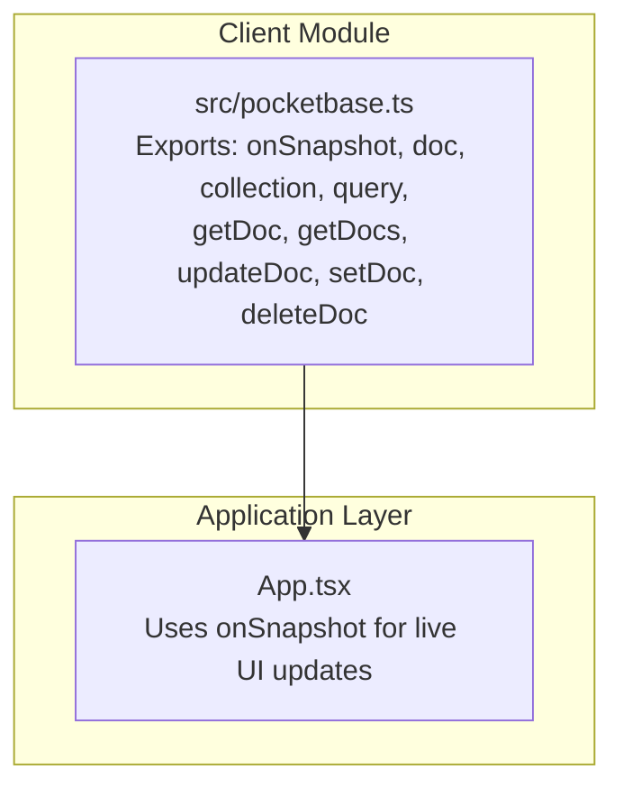
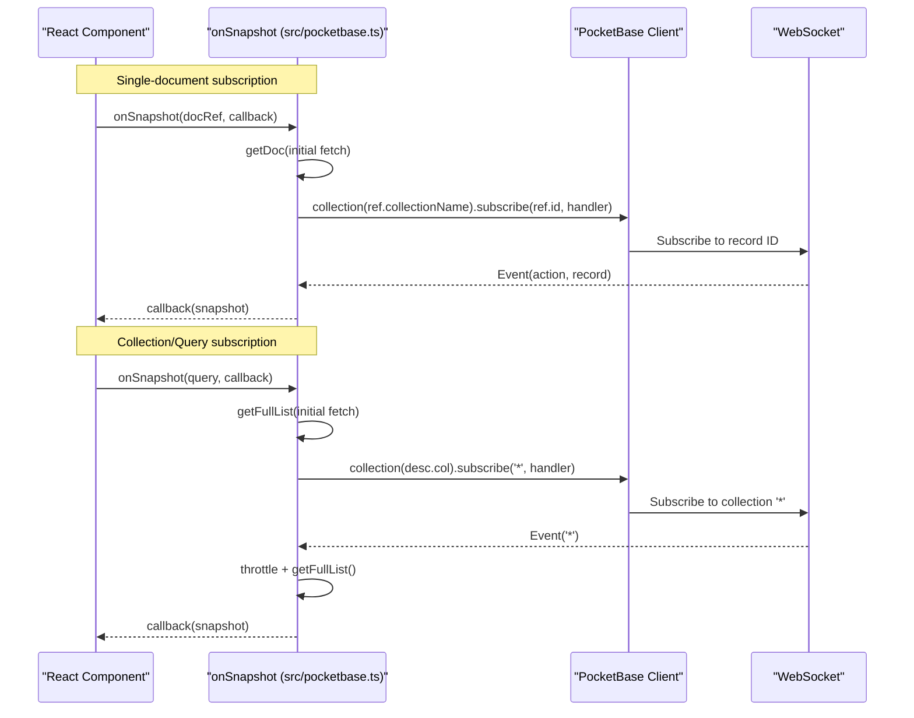
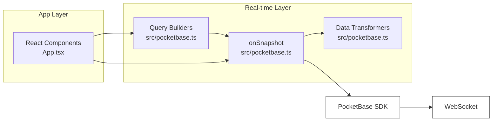

# Real-time Subscriptions

<cite>
**Referenced Files in This Document**
- [pocketbase.ts](file://src/pocketbase.ts)
- [App.tsx](file://App.tsx)
</cite>

## Table of Contents
1. [Introduction](#introduction)
2. [Project Structure](#project-structure)
3. [Core Components](#core-components)
4. [Architecture Overview](#architecture-overview)
5. [Detailed Component Analysis](#detailed-component-analysis)
6. [Dependency Analysis](#dependency-analysis)
7. [Performance Considerations](#performance-considerations)
8. [Troubleshooting Guide](#troubleshooting-guide)
9. [Conclusion](#conclusion)

## Introduction
This document explains the real-time subscription system that provides Firebase-compatible onSnapshot functionality using PocketBase's WebSocket subscriptions. It covers:
- Single-document and collection/query subscriptions
- Initial data fetch patterns and real-time update handling
- Safety mechanisms: stale client ID detection and automatic retry logic
- Throttling system for collection updates to prevent performance issues
- Unsubscribe patterns, cleanup procedures, and error handling
- Practical subscription patterns, performance optimization techniques, and debugging approaches

## Project Structure
The real-time subscription system is implemented in a dedicated client module and consumed throughout the application via React components.

**Diagram sources**
- [pocketbase.ts:578-707](file://src/pocketbase.ts#L578-L707)
- [App.tsx:822-877](file://App.tsx#L822-L877)

**Section sources**
- [pocketbase.ts:1-121](file://src/pocketbase.ts#L1-L121)
- [App.tsx:1-120](file://App.tsx#L1-L120)

## Core Components
- onSnapshot: The central real-time subscription function supporting both single documents and collections/queries. It performs initial fetches and sets up PocketBase WebSocket subscriptions with robust retry logic for stale client IDs.
- Query builders: doc, collection, query, where, orderBy, limit enable constructing typed queries compatible with PocketBase filters and sorts.
- Data transformation helpers: wrapData, unwrapData, toDocSnapshot, toQuerySnapshot normalize PocketBase records into a normalized shape for the app.
- Error handling: handleFirestoreError centralizes logging and user-friendly messaging for PocketBase API errors.

Key responsibilities:
- Single-document subscriptions: initial fetch plus per-record updates via WebSocket.
- Collection/Query subscriptions: initial full-list fetch plus throttled full-list refresh on wildcard events.
- Safety: staggered subscription start, retry on stale client ID (404), and controlled cleanup.
- Performance: throttle collection updates to reduce network and CPU load.

**Section sources**
- [pocketbase.ts:578-707](file://src/pocketbase.ts#L578-L707)
- [pocketbase.ts:477-560](file://src/pocketbase.ts#L477-L560)
- [pocketbase.ts:124-141](file://src/pocketbase.ts#L124-L141)
- [pocketbase.ts:165-240](file://src/pocketbase.ts#L165-L240)
- [pocketbase.ts:787-816](file://src/pocketbase.ts#L787-L816)

## Architecture Overview
The system bridges Firebase-like APIs to PocketBase WebSocket subscriptions. Single-document subscriptions listen to a specific record ID; collection subscriptions listen to '*' and then refresh the full list with throttling.

**Diagram sources**
- [pocketbase.ts:578-707](file://src/pocketbase.ts#L578-L707)
- [pocketbase.ts:300-335](file://src/pocketbase.ts#L300-L335)

**Section sources**
- [pocketbase.ts:578-707](file://src/pocketbase.ts#L578-L707)

## Detailed Component Analysis

### onSnapshot Implementation
- Single-document:
  - Performs an initial getDoc to populate the UI immediately.
  - Subscribes to the specific record ID; deletes trigger a special callback with exists() false.
- Collection/Query:
  - Performs an initial getFullList to populate the UI.
  - Subscribes to '*' to receive collection-wide events.
  - Uses a throttle timeout to coalesce rapid updates into a single refresh cycle.

Safety and reliability:
- Subscription jitter: random delay prevents synchronized storms on initial mount.
- Retry on stale client ID: detects 404 or "client id" errors and retries with exponential backoff timing.
- Cleanup: returned unsubscribe clears throttle timeout and calls PocketBase unsubscribe.

Throttling:
- 800 ms throttle for collection updates to avoid excessive refreshes during bursts.

Unsubscribe:
- Sets a destroyed flag and clears throttle timeout before calling cleanup.

**Section sources**
- [pocketbase.ts:578-707](file://src/pocketbase.ts#L578-L707)

### Query Builders and Snapshot Types
- QueryDescriptor supports where (including 'in' and 'array-contains'), orderBy, and limit.
- DocSnapshot and QuerySnapshot mirror Firebase semantics for data access and iteration.

These abstractions enable writing queries that map cleanly to PocketBase filters and sorts.

**Section sources**
- [pocketbase.ts:477-560](file://src/pocketbase.ts#L477-L560)
- [pocketbase.ts:124-141](file://src/pocketbase.ts#L124-L141)

### Data Transformation Helpers
- wrapData and unwrapData normalize schema fields and handle JSON data embedding.
- toDocSnapshot and toQuerySnapshot convert PocketBase records to normalized snapshots with id, exists(), and data().

These helpers ensure the app receives consistent shapes regardless of PocketBase's internal representation.

**Section sources**
- [pocketbase.ts:165-240](file://src/pocketbase.ts#L165-L240)

### Usage Examples in App
- Map resources: subscribes to map_resources filtered by zoneId and reacts to docChanges for notifications.
- Dropped items: subscribes to dropped_items filtered by zoneId.
- Buildings: maintains separate subscriptions for "my buildings" and "zone buildings" and merges them.
- Users: subscribes to individual user documents for live stats.
- Presence: subscribes to presence with time-based filtering to show online users.

These demonstrate:
- Using query builders to constrain collections.
- Leveraging docChanges for targeted UI updates.
- Managing multiple subscriptions with proper cleanup.

**Section sources**
- [App.tsx:822-877](file://App.tsx#L822-L877)
- [App.tsx:880-893](file://App.tsx#L880-L893)
- [App.tsx:2125-2145](file://App.tsx#L2125-L2145)
- [App.tsx:1768-1819](file://App.tsx#L1768-L1819)
- [App.tsx:1936-1993](file://App.tsx#L1936-L1993)

## Dependency Analysis
The real-time system depends on PocketBase's subscribe API and integrates with the app's React lifecycle.

**Diagram sources**
- [pocketbase.ts:578-707](file://src/pocketbase.ts#L578-L707)
- [pocketbase.ts:477-560](file://src/pocketbase.ts#L477-L560)
- [pocketbase.ts:165-240](file://src/pocketbase.ts#L165-L240)
- [App.tsx:822-877](file://App.tsx#L822-L877)

**Section sources**
- [pocketbase.ts:578-707](file://src/pocketbase.ts#L578-L707)
- [App.tsx:822-877](file://App.tsx#L822-L877)

## Performance Considerations
- Throttling: Collection updates are throttled to 800 ms to prevent rapid successive refreshes.
- Initial fetch vs. real-time: Single-document subscriptions rely on immediate getDoc plus per-record events; collection subscriptions rely on initial getFullList plus periodic throttled refreshes.
- Query scoping: Use where clauses (including 'in' arrays) to minimize payload sizes.
- Batch operations: Prefer getDocs for bulk reads when appropriate to reduce subscription overhead.
- Zone-based subscriptions: The app computes a small set of zones and filters by zoneId to limit data volume.

Practical tips:
- Keep query filters tight to reduce event volume.
- Avoid subscribing to very large collections without filters.
- Use docChanges to react only to modified items when appropriate.

**Section sources**
- [pocketbase.ts:678-700](file://src/pocketbase.ts#L678-L700)
- [App.tsx:822-877](file://App.tsx#L822-L877)

## Troubleshooting Guide
Common issues and resolutions:
- Stale client ID (404): The system detects stale client IDs and retries with backoff. If persistent, check network stability or client recreation.
- Permission errors (403): handleFirestoreError logs detailed validation errors and suggests checking PocketBase API rules.
- Network interruptions: onSnapshot retries automatically; ensure the app remains mounted to avoid orphaned subscriptions.
- Excessive updates: Verify throttling is active and consider adding more restrictive filters.

Debugging steps:
- Enable console logs for "[PB Realtime]" warnings and "[POCKETBASE ERROR]" entries.
- Confirm subscription cleanup by checking that returned unsubscribe functions are called on unmount.
- Validate query filters and sorts to ensure they match PocketBase expectations.

**Section sources**
- [pocketbase.ts:587-621](file://src/pocketbase.ts#L587-L621)
- [pocketbase.ts:787-816](file://src/pocketbase.ts#L787-L816)

## Conclusion
The real-time subscription system provides a robust, Firebase-like onSnapshot experience built on PocketBase's WebSocket subscriptions. It ensures reliable initial data delivery, handles rapid changes gracefully with throttling, and recovers from transient failures using retry logic. By structuring subscriptions around scoped queries and leveraging docChanges, applications can achieve responsive, efficient real-time UI updates.