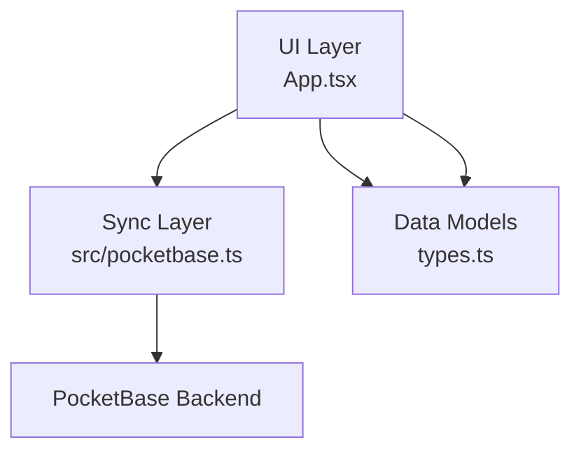
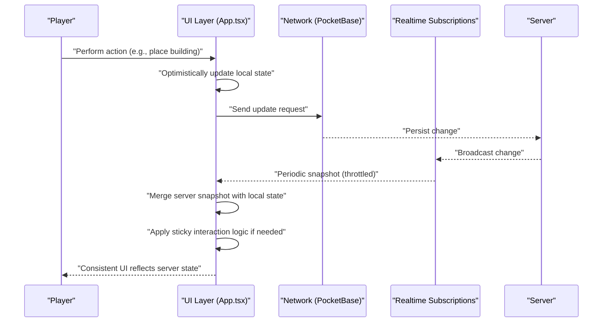
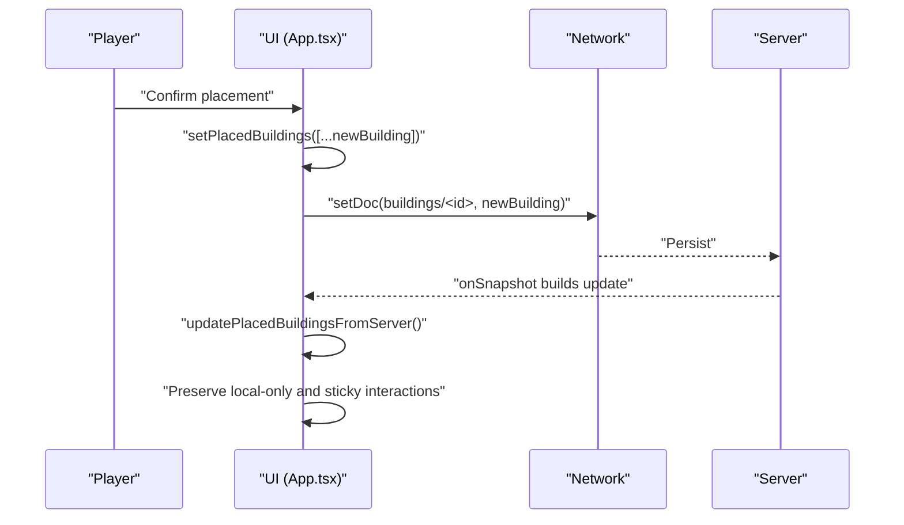
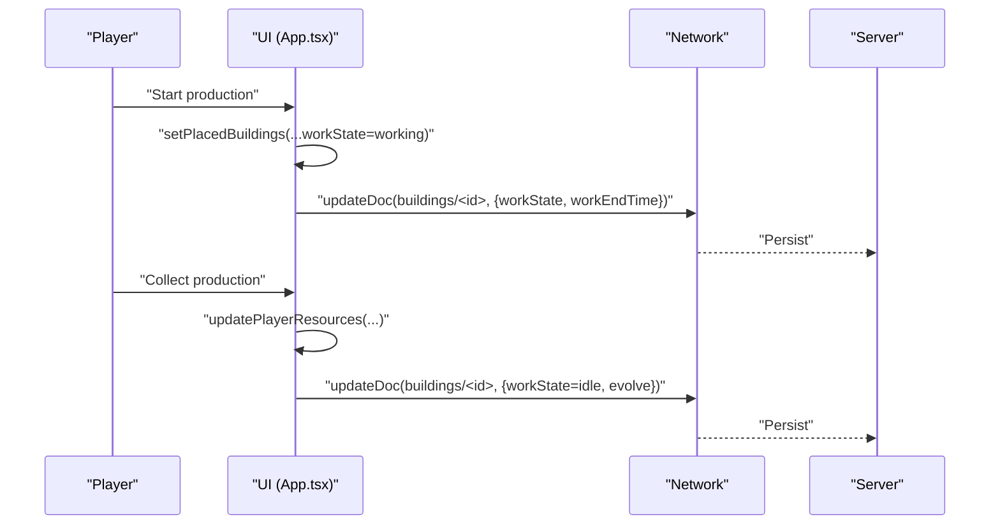
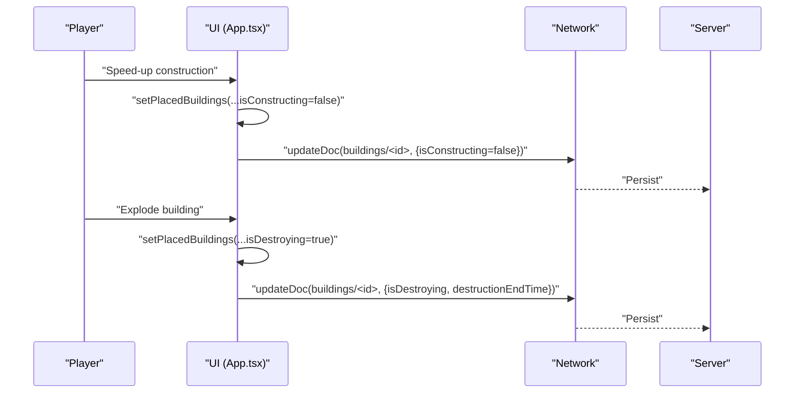
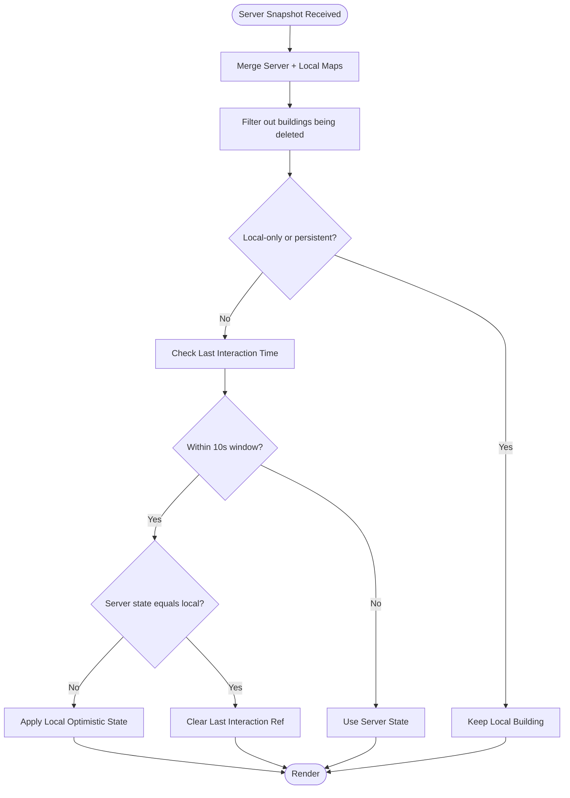
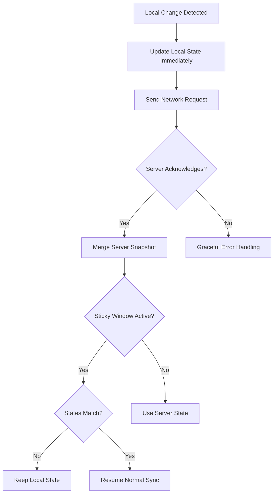
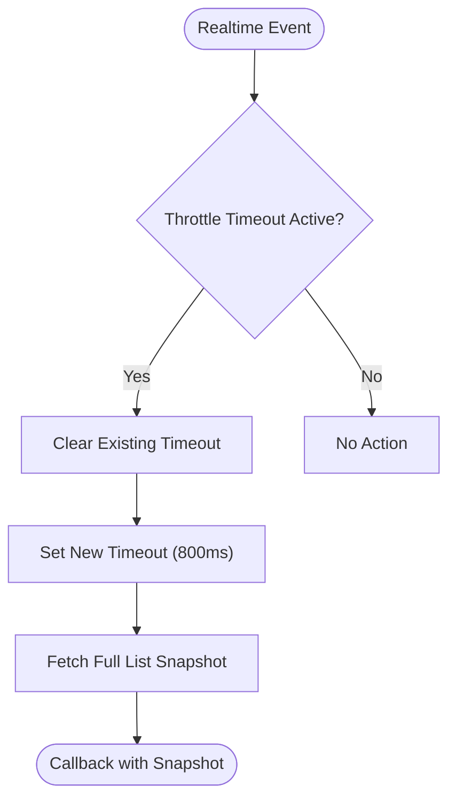
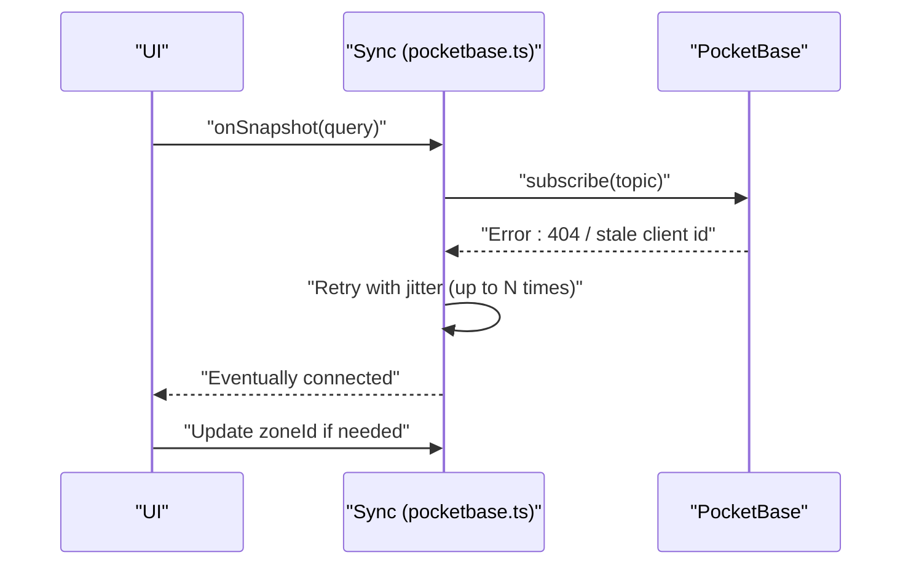
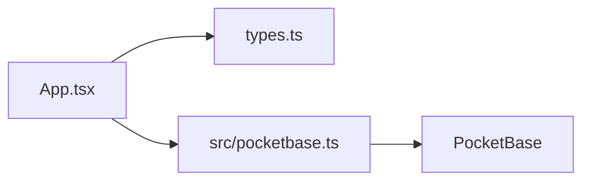

# Optimistic Updates and Conflict Resolution

<cite>
**Referenced Files in This Document**
- [App.tsx](file://App.tsx)
- [pocketbase.ts](file://src/pocketbase.ts)
- [types.ts](file://types.ts)
</cite>

## Table of Contents
1. [Introduction](#introduction)
2. [Project Structure](#project-structure)
3. [Core Components](#core-components)
4. [Architecture Overview](#architecture-overview)
5. [Detailed Component Analysis](#detailed-component-analysis)
6. [Dependency Analysis](#dependency-analysis)
7. [Performance Considerations](#performance-considerations)
8. [Troubleshooting Guide](#troubleshooting-guide)
9. [Conclusion](#conclusion)

## Introduction
This document explains how the real-time synchronization system applies optimistic updates and resolves conflicts for concurrent edits across building placement, resource extraction, and player actions. It covers immediate UI feedback, server consistency maintenance, conflict detection and reconciliation, rollback safeguards, debouncing and throttling to reduce network overhead, and robustness against network failures. Practical patterns are illustrated with concrete implementation references from the codebase.

## Project Structure
The optimistic update and conflict resolution logic spans three primary areas:
- UI and game loop orchestration: central state, refs, and rendering logic
- Real-time synchronization layer: PocketBase-compatible wrappers and subscriptions
- Data models: shared types for buildings, resources, and game entities

**Diagram sources**
- [App.tsx:1-200](file://App.tsx#L1-L200)
- [pocketbase.ts:1-120](file://src/pocketbase.ts#L1-L120)
- [types.ts:119-147](file://types.ts#L119-L147)

**Section sources**
- [App.tsx:1-200](file://App.tsx#L1-L200)
- [pocketbase.ts:1-120](file://src/pocketbase.ts#L1-L120)
- [types.ts:119-147](file://types.ts#L119-L147)

## Core Components
- Optimistic update pattern: immediately mutate local state/UI upon user actions, then reconcile with server updates.
- Sticky interaction logic: temporarily preserves local optimistic state when server response is stale.
- Deletion protection: guards against premature removal of local-only or recently created entities.
- Debounce/throttle: limits update storms and reduces network load.
- Conflict detection and resolution: merges server snapshots with local state, preserving recent local changes.
- Rollback safeguards: uses timestamps and flags to detect and resolve divergences.

Key implementation references:
- Local-only building preservation and sticky interaction: [App.tsx:2046-2091](file://App.tsx#L2046-L2091)
- Last interaction timestamps and refs: [App.tsx:389-395](file://App.tsx#L389-L395)
- Real-time subscription throttling: [pocketbase.ts:680-700](file://src/pocketbase.ts#L680-L700)
- Optimistic building placement and construction: [App.tsx:4200-4246](file://App.tsx#L4200-L4246)
- Optimistic production start and collect: [App.tsx:4547-4670](file://App.tsx#L4547-L4670)
- Optimistic speed-up and destruction: [App.tsx:5326-5374](file://App.tsx#L5326-L5374)

**Section sources**
- [App.tsx:2046-2091](file://App.tsx#L2046-L2091)
- [App.tsx:389-395](file://App.tsx#L389-L395)
- [pocketbase.ts:680-700](file://src/pocketbase.ts#L680-L700)
- [App.tsx:4200-4246](file://App.tsx#L4200-L4246)
- [App.tsx:4547-4670](file://App.tsx#L4547-L4670)
- [App.tsx:5326-5374](file://App.tsx#L5326-L5374)

## Architecture Overview
The system combines immediate UI updates with eventual consistency:
- UI triggers actions and updates local state immediately (optimistic).
- Network requests are sent asynchronously; errors are handled gracefully.
- Real-time subscriptions receive server snapshots periodically, which are merged with local state.
- Sticky interaction logic ensures local changes remain visible until server confirms parity.

**Diagram sources**
- [App.tsx:2046-2091](file://App.tsx#L2046-L2091)
- [pocketbase.ts:680-700](file://src/pocketbase.ts#L680-L700)

## Detailed Component Analysis

### Optimistic Building Placement and Construction
- Immediate feedback: sets a temporary local flag and constructs a new building object with construction timers.
- Server persistence: writes to the buildings collection; deletes the underlying resource tile.
- Reconciliation: server snapshots merge with local state; local-only buildings are preserved until synced.

**Diagram sources**
- [App.tsx:4200-4246](file://App.tsx#L4200-L4246)
- [App.tsx:2046-2091](file://App.tsx#L2046-L2091)

**Section sources**
- [App.tsx:4200-4246](file://App.tsx#L4200-L4246)
- [App.tsx:2046-2091](file://App.tsx#L2046-L2091)

### Optimistic Production Start and Collect
- Start production: marks building as working with a work end time; immediately updates UI.
- Collect production: updates player resources and building state; transitions to idle with optional evolution.

**Diagram sources**
- [App.tsx:4547-4670](file://App.tsx#L4547-L4670)

**Section sources**
- [App.tsx:4547-4670](file://App.tsx#L4547-L4670)

### Optimistic Speed-Up and Destruction
- Speed-up: immediately ends construction timers and sets idle state; debits rubies after persistence.
- Destruction: applies pending damage with a destruction timer; removes protection if present.

**Diagram sources**
- [App.tsx:5326-5374](file://App.tsx#L5326-L5374)
- [App.tsx:5241-5324](file://App.tsx#L5241-L5324)

**Section sources**
- [App.tsx:5326-5374](file://App.tsx#L5326-L5374)
- [App.tsx:5241-5324](file://App.tsx#L5241-L5324)

### Sticky Interaction Logic and Rollback Prevention
- Local-only preservation: keeps buildings marked as local or specific persistent entities until server confirms absence.
- Sticky interaction: if a building’s state differs from server within a short window, the UI retains the local optimistic state until server matches.
- Last interaction timestamps: track when a building was last modified locally to decide whether to keep local state.

**Diagram sources**
- [App.tsx:2046-2091](file://App.tsx#L2046-L2091)
- [App.tsx:389-395](file://App.tsx#L389-L395)

**Section sources**
- [App.tsx:2046-2091](file://App.tsx#L2046-L2091)
- [App.tsx:389-395](file://App.tsx#L389-L395)

### Conflict Detection and Resolution Strategies
- Detection: compare server and local states for the same entity; if mismatch persists beyond the sticky window, server wins.
- Resolution: apply server state; if local changes were made, they are reapplied optimistically after reconciliation.
- Deletion protection: maintain a deletion guard set to prevent removing local-only entries prematurely.

**Diagram sources**
- [App.tsx:2046-2091](file://App.tsx#L2046-L2091)
- [pocketbase.ts:787-816](file://src/pocketbase.ts#L787-L816)

**Section sources**
- [App.tsx:2046-2091](file://App.tsx#L2046-L2091)
- [pocketbase.ts:787-816](file://src/pocketbase.ts#L787-L816)

### Debounce and Throttle Mechanisms
- Real-time subscription throttling: batches frequent updates to reduce churn and server load.
- Camera offset throttling: delays zone recalculations to minimize re-subscriptions.

**Diagram sources**
- [pocketbase.ts:680-700](file://src/pocketbase.ts#L680-L700)

**Section sources**
- [pocketbase.ts:680-700](file://src/pocketbase.ts#L680-L700)

### Handling Network Failures and Data Integrity
- Graceful error handling: logs and surfaces permission-related issues without crashing background sync.
- Stale client ID retries: resubscribe with jitter to recover from stale client identifiers.
- Self-healing: corrects zone IDs for buildings when coordinates change.

**Diagram sources**
- [pocketbase.ts:587-621](file://src/pocketbase.ts#L587-L621)
- [App.tsx:2109-2115](file://App.tsx#L2109-L2115)

**Section sources**
- [pocketbase.ts:587-621](file://src/pocketbase.ts#L587-L621)
- [App.tsx:2109-2115](file://App.tsx#L2109-L2115)

### Practical Patterns for Different Game Actions
- Building placement: immediate local push, server write, merge with sticky interaction.
- Production start/collect: optimistic UI, server write, optional evolution.
- Speed-up: immediate UI change, server write, rubies debited post-persistence.
- Destruction: optimistic damage application, server write, protection removal.

Implementation references:
- Placement: [App.tsx:4200-4246](file://App.tsx#L4200-L4246)
- Production: [App.tsx:4547-4670](file://App.tsx#L4547-L4670)
- Speed-up: [App.tsx:5326-5374](file://App.tsx#L5326-L5374)
- Destruction: [App.tsx:5241-5324](file://App.tsx#L5241-L5324)

**Section sources**
- [App.tsx:4200-4246](file://App.tsx#L4200-L4246)
- [App.tsx:4547-4670](file://App.tsx#L4547-L4670)
- [App.tsx:5326-5374](file://App.tsx#L5326-L5374)
- [App.tsx:5241-5324](file://App.tsx#L5241-L5324)

## Dependency Analysis
- UI depends on refs and maps to track server state and local-only entities.
- Sync layer wraps PocketBase operations and exposes a Firestore-compatible API.
- Types define the canonical shape of buildings and resources.

**Diagram sources**
- [App.tsx:1-120](file://App.tsx#L1-L120)
- [pocketbase.ts:1-120](file://src/pocketbase.ts#L1-L120)
- [types.ts:119-147](file://types.ts#L119-L147)

**Section sources**
- [App.tsx:1-120](file://App.tsx#L1-L120)
- [pocketbase.ts:1-120](file://src/pocketbase.ts#L1-L120)
- [types.ts:119-147](file://types.ts#L119-L147)

## Performance Considerations
- Subscription throttling reduces update storms and server load.
- Camera throttling minimizes zone recalculations and re-subscriptions.
- Batched writes and transactions consolidate network requests.
- Sticky interaction avoids unnecessary flicker and re-renders.

[No sources needed since this section provides general guidance]

## Troubleshooting Guide
Common issues and resolutions:
- Permission errors: surfaced via centralized error handler; inspect PocketBase rules for affected collections.
- Stale client ID: automatic retries with jitter; monitor logs for repeated 404 errors.
- Conflicts and rollback: verify sticky interaction timestamps and local-only preservation logic.
- Network failures: ensure graceful handling and reconnection; confirm self-healing corrections (e.g., zoneId).

Debugging references:
- Error handling: [pocketbase.ts:787-816](file://src/pocketbase.ts#L787-L816)
- Stale client retries: [pocketbase.ts:587-621](file://src/pocketbase.ts#L587-L621)
- Sticky interaction refs: [App.tsx:389-395](file://App.tsx#L389-L395)

**Section sources**
- [pocketbase.ts:787-816](file://src/pocketbase.ts#L787-L816)
- [pocketbase.ts:587-621](file://src/pocketbase.ts#L587-L621)
- [App.tsx:389-395](file://App.tsx#L389-L395)

## Conclusion
The system achieves immediate feedback and eventual consistency by applying optimistic updates, protecting local-only entities, and intelligently merging server snapshots. Sticky interaction logic prevents jitters and rollbacks, while throttling and batching reduce network overhead. Robust error handling and self-healing mechanisms ensure resilience during network failures and rule mismatches.