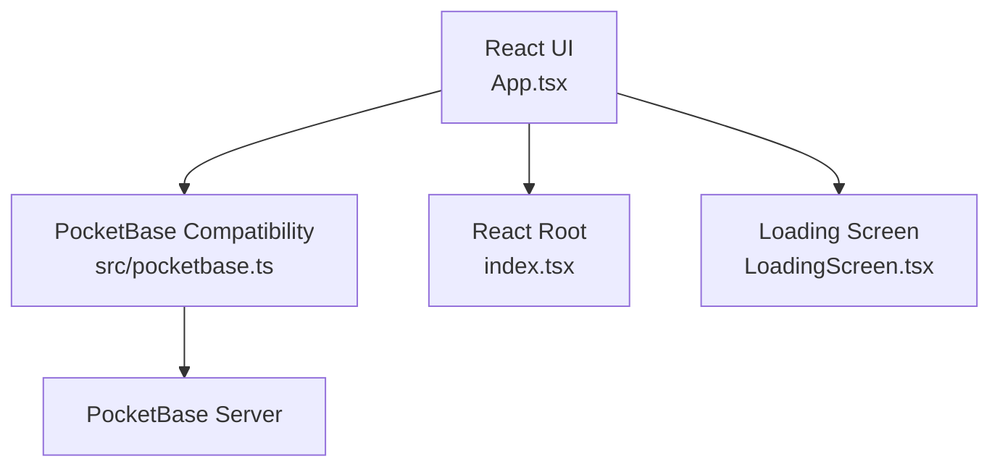
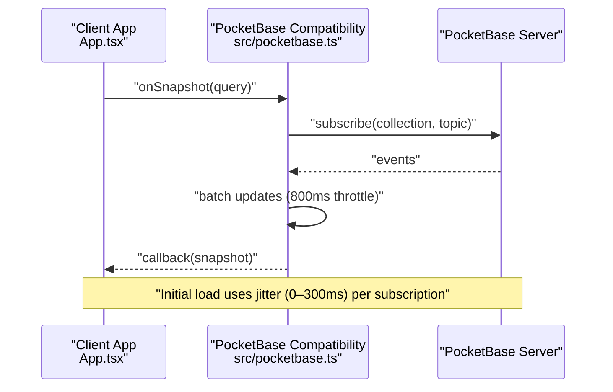
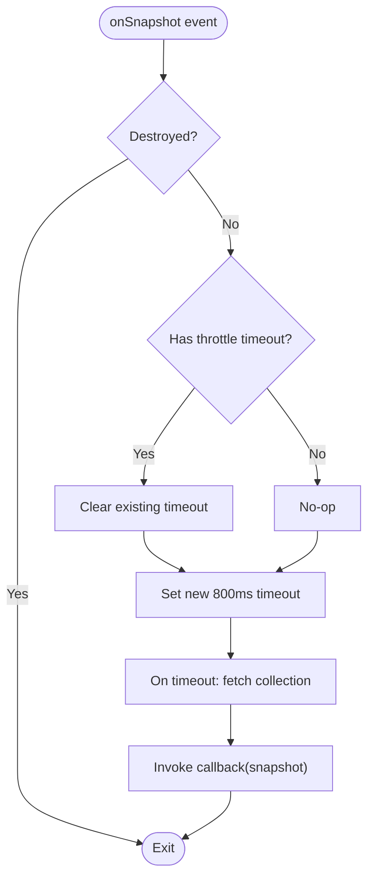
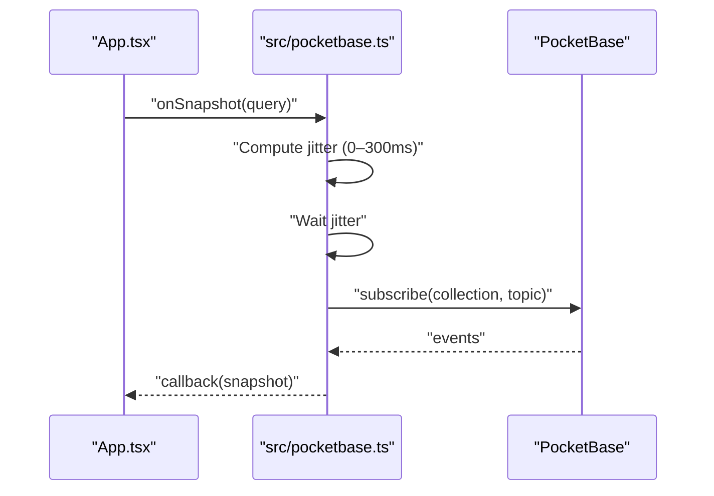
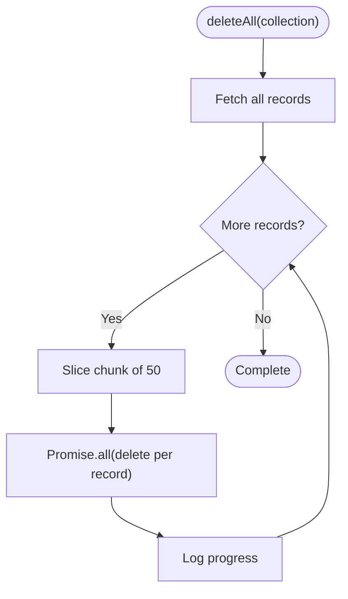
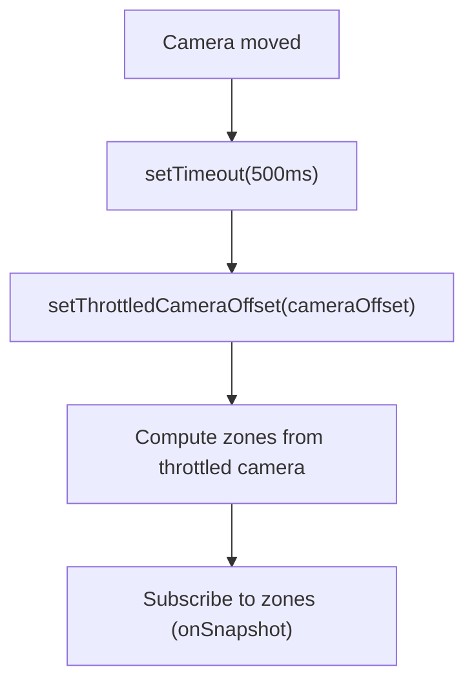
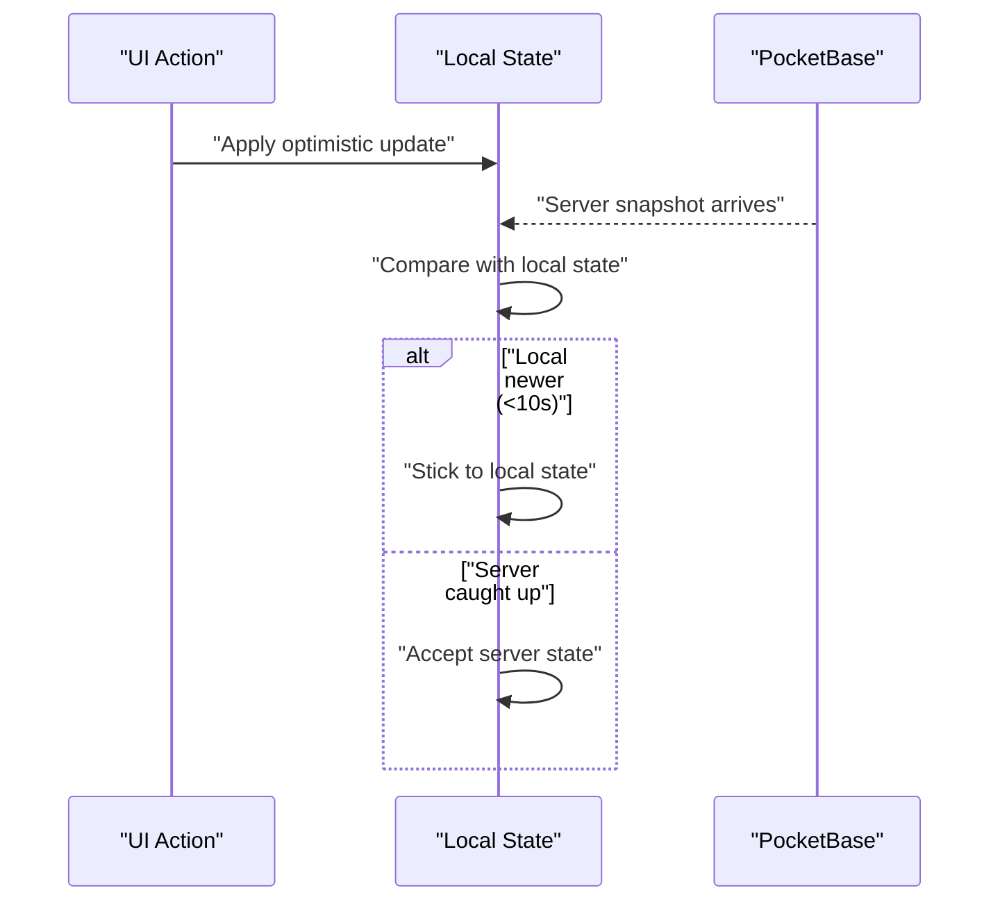
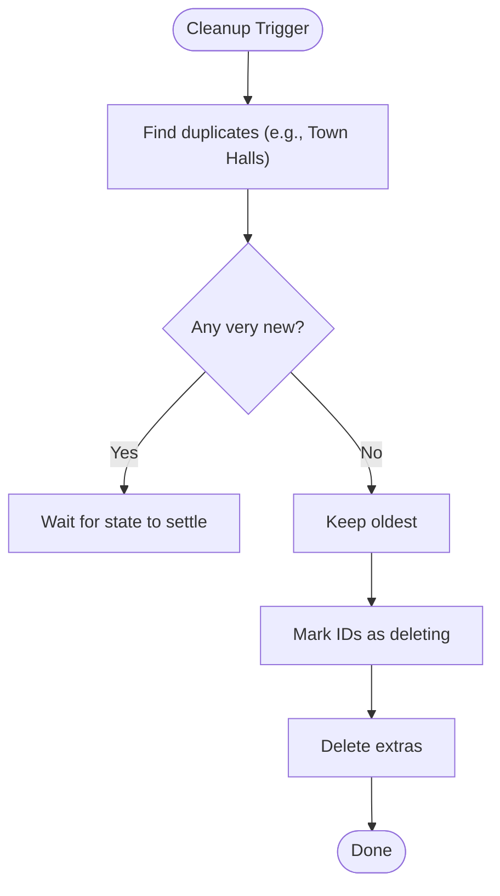
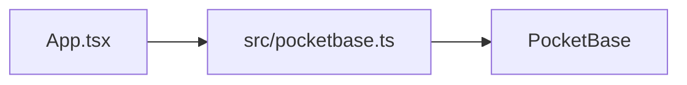

# Performance Optimization and Throttling

<cite>
**Referenced Files in This Document**
- [index.tsx](file://index.tsx)
- [App.tsx](file://App.tsx)
- [src/pocketbase.ts](file://src/pocketbase.ts)
- [LoadingScreen.tsx](file://LoadingScreen.tsx)
</cite>

## Table of Contents
1. [Introduction](#introduction)
2. [Project Structure](#project-structure)
3. [Core Components](#core-components)
4. [Architecture Overview](#architecture-overview)
5. [Detailed Component Analysis](#detailed-component-analysis)
6. [Dependency Analysis](#dependency-analysis)
7. [Performance Considerations](#performance-considerations)
8. [Troubleshooting Guide](#troubleshooting-guide)
9. [Conclusion](#conclusion)
10. [Appendices](#appendices)

## Introduction
This document explains the performance optimization and throttling mechanisms in the real-time synchronization system. It focuses on:
- The 800 ms throttle used to batch collection updates and prevent update storms
- The jitter-based staggering mechanism that prevents subscription storms during initial application load
- The chunked deletion strategy for large collections to avoid server overload
- Memory management techniques for handling large datasets and preventing memory leaks
- Subscription cleanup procedures that prevent zombie subscriptions
- Performance monitoring techniques and metrics for measuring real-time synchronization efficiency
- Scaling considerations for high-concurrency scenarios and how the throttling system adapts to different load conditions
- Trade-offs between real-time responsiveness and system performance
- Guidelines for optimizing subscription patterns and reducing unnecessary updates

## Project Structure
The real-time synchronization relies on a thin compatibility layer over PocketBase that exposes a Firestore-like API surface. The main application orchestrates subscriptions, throttling, and rendering.

**Diagram sources**
- [index.tsx:1-20](file://index.tsx#L1-L20)
- [App.tsx:1-1616](file://App.tsx#L1-L1616)
- [src/pocketbase.ts:1-12](file://src/pocketbase.ts#L1-L12)
- [LoadingScreen.tsx:131-154](file://LoadingScreen.tsx#L131-L154)

**Section sources**
- [index.tsx:1-20](file://index.tsx#L1-L20)
- [App.tsx:1-1616](file://App.tsx#L1-L1616)
- [src/pocketbase.ts:1-12](file://src/pocketbase.ts#L1-L12)
- [LoadingScreen.tsx:131-154](file://LoadingScreen.tsx#L131-L154)

## Core Components
- Real-time subscriptions with batching and jitter staggering
- Throttled camera-zone updates to minimize re-subscriptions
- Chunked deletion for large collections
- Optimistic updates and sticky interaction logic to reduce perceived latency
- Cleanup routines to prevent duplicate or stale entities
- Presence and heartbeat mechanisms to keep clients synchronized

**Section sources**
- [src/pocketbase.ts:571-707](file://src/pocketbase.ts#L571-L707)
- [App.tsx:570-576](file://App.tsx#L570-L576)
- [App.tsx:822-877](file://App.tsx#L822-L877)
- [App.tsx:2496-2542](file://App.tsx#L2496-L2542)
- [App.tsx:1864-1901](file://App.tsx#L1864-L1901)

## Architecture Overview
The system uses a Firestore-like API abstraction over PocketBase. Subscriptions are created per zone and per user, with batching and jitter to avoid update storms. Large-scale deletions are chunked to prevent server overload.

**Diagram sources**
- [src/pocketbase.ts:571-707](file://src/pocketbase.ts#L571-L707)
- [App.tsx:822-877](file://App.tsx#L822-L877)

## Detailed Component Analysis

### Throttling Mechanism for Collection Updates
- Purpose: Prevent update storms by batching frequent updates into a single refresh cycle.
- Implementation: A throttle timeout accumulates updates and triggers a single fetch after the timeout elapses.
- Timeout value: 800 ms.
- Effect: Reduces network and CPU overhead when many updates occur rapidly.

**Diagram sources**
- [src/pocketbase.ts:678-696](file://src/pocketbase.ts#L678-L696)

**Section sources**
- [src/pocketbase.ts:678-696](file://src/pocketbase.ts#L678-L696)

### Jitter-Based Staggering for Initial Subscriptions
- Purpose: Prevent subscription storms during initial application load by staggering subscription starts.
- Implementation: Each subscription waits a random jitter between 0 and 300 ms before subscribing.
- Effect: Distributes load across time, avoiding spikes when many subscriptions start simultaneously.

**Diagram sources**
- [src/pocketbase.ts:587-621](file://src/pocketbase.ts#L587-L621)

**Section sources**
- [src/pocketbase.ts:587-621](file://src/pocketbase.ts#L587-L621)

### Chunked Deletion Strategy for Large Collections
- Purpose: Prevent server overload when clearing large collections.
- Implementation: Fetch all records and delete them in chunks of 50, awaiting Promise.all per chunk.
- Effect: Limits concurrent requests and reduces risk of timeouts or overload.

**Diagram sources**
- [src/pocketbase.ts:450-469](file://src/pocketbase.ts#L450-L469)

**Section sources**
- [src/pocketbase.ts:450-469](file://src/pocketbase.ts#L450-L469)

### Camera-Driven Zone Updates and Throttling
- Purpose: Reduce the frequency of zone-based subscriptions by throttling camera movements.
- Implementation: A 500 ms throttle updates a throttled camera offset, which determines the set of zones to watch.
- Effect: Minimizes repeated subscriptions when the camera moves frequently.

**Diagram sources**
- [App.tsx:570-576](file://App.tsx#L570-L576)
- [App.tsx:822-820](file://App.tsx#L822-L820)

**Section sources**
- [App.tsx:570-576](file://App.tsx#L570-L576)
- [App.tsx:822-820](file://App.tsx#L822-L820)

### Optimistic Updates and Sticky Interaction Logic
- Purpose: Improve perceived responsiveness by applying local changes immediately and reconciling with server later.
- Implementation: 
  - Optimistic updates are applied to local state right away.
  - Sticky interaction logic retains local state for a short period if the server version appears stale.
  - After reconciliation, local state is cleared and normal sync resumes.
- Effect: Reduces perceived latency and avoids rollback jitters.

**Diagram sources**
- [App.tsx:2024-2091](file://App.tsx#L2024-L2091)

**Section sources**
- [App.tsx:2024-2091](file://App.tsx#L2024-L2091)

### Subscription Cleanup Procedures and Zombie Prevention
- Purpose: Prevent duplicate or stale entities from persisting after deletions or sync races.
- Implementation:
  - During cleanup, a set of IDs being deleted is maintained to suppress flicker and stale renders.
  - Duplicate Town Halls are detected and cleaned up, keeping the oldest one.
  - Presence and heartbeat mechanisms keep clients synchronized without relying on local presence.
- Effect: Ensures a consistent world state and prevents “zombie” entities.

**Diagram sources**
- [App.tsx:2496-2542](file://App.tsx#L2496-L2542)

**Section sources**
- [App.tsx:2496-2542](file://App.tsx#L2496-L2542)
- [App.tsx:1864-1901](file://App.tsx#L1864-L1901)

### Performance Monitoring and Metrics
- Connection health checks: A dedicated function tests connectivity to PocketBase.
- Logging: Extensive console logs for synchronization events, deletions, and reload signals.
- UI feedback: Loading screen indicates progress and readiness.
- Metrics ideas:
  - Measure average time between subscription events and render updates.
  - Track number of batches per second and average batch size.
  - Monitor server-side latency and error rates.
  - Track presence heartbeat intervals and staleness thresholds.

**Section sources**
- [src/pocketbase.ts:818-824](file://src/pocketbase.ts#L818-L824)
- [LoadingScreen.tsx:131-154](file://LoadingScreen.tsx#L131-L154)

## Dependency Analysis
- App.tsx depends on src/pocketbase.ts for Firestore-like APIs and real-time subscriptions.
- Real-time subscriptions are zone-scoped and user-scoped, minimizing cross-entity noise.
- Throttling and jitter are centralized in the compatibility layer to ensure consistent behavior across all subscriptions.

**Diagram sources**
- [App.tsx:1-1616](file://App.tsx#L1-L1616)
- [src/pocketbase.ts:1-12](file://src/pocketbase.ts#L1-L12)

**Section sources**
- [App.tsx:1-1616](file://App.tsx#L1-L1616)
- [src/pocketbase.ts:1-12](file://src/pocketbase.ts#L1-L12)

## Performance Considerations
- Throttle timeout: 800 ms balances responsiveness with throughput. Lower values increase server load; higher values increase perceived latency.
- Jitter: Random 0–300 ms stagger prevents thundering herds of simultaneous subscriptions.
- Chunked deletion: 50-record batches reduce server pressure and improve reliability.
- Zone scoping: Subscriptions are limited to visible zones, reducing data volume.
- Optimistic updates: Immediate UI feedback improves perceived responsiveness; sticky logic ensures eventual consistency.
- Cleanup: Deduplication and deletion tracking prevent stale entities and reduce churn.

[No sources needed since this section provides general guidance]

## Troubleshooting Guide
- Subscription storms: Verify jitter is enabled and throttle is active. Check for excessive subscriptions or missing zone scoping.
- Stale client ID errors: The compatibility layer retries with backoff; ensure retries are not exhausted.
- Overloaded deletions: Confirm chunked deletion is used for large collections.
- Presence issues: Heartbeat intervals and filtering by last-seen timestamps help maintain accurate online lists.
- Error logging: Use the centralized error handler to capture operation type, path, and details.

**Section sources**
- [src/pocketbase.ts:587-621](file://src/pocketbase.ts#L587-L621)
- [src/pocketbase.ts:678-696](file://src/pocketbase.ts#L678-L696)
- [src/pocketbase.ts:450-469](file://src/pocketbase.ts#L450-L469)
- [src/pocketbase.ts:787-816](file://src/pocketbase.ts#L787-L816)

## Conclusion
The system employs a layered approach to performance optimization:
- Centralized batching and jitter reduce update storms.
- Zone-scoped subscriptions and throttled camera updates minimize unnecessary work.
- Chunked deletions protect the server from overload.
- Optimistic updates and sticky interaction logic improve responsiveness without sacrificing correctness.
- Cleanup routines and presence mechanisms prevent stale or duplicate entities.

These techniques collectively balance real-time responsiveness with system stability and scalability.

[No sources needed since this section summarizes without analyzing specific files]

## Appendices

### Guidelines for Optimizing Subscription Patterns
- Scope subscriptions tightly (by zone and user).
- Use batching and throttling for high-frequency updates.
- Apply jitter on initial subscription creation.
- Prefer chunked operations for large deletions or bulk writes.
- Use optimistic updates with sticky interaction logic for immediate feedback.
- Implement cleanup routines to prevent duplicates and stale entities.
- Monitor connection health and adjust throttle timeouts based on observed load.

[No sources needed since this section provides general guidance]