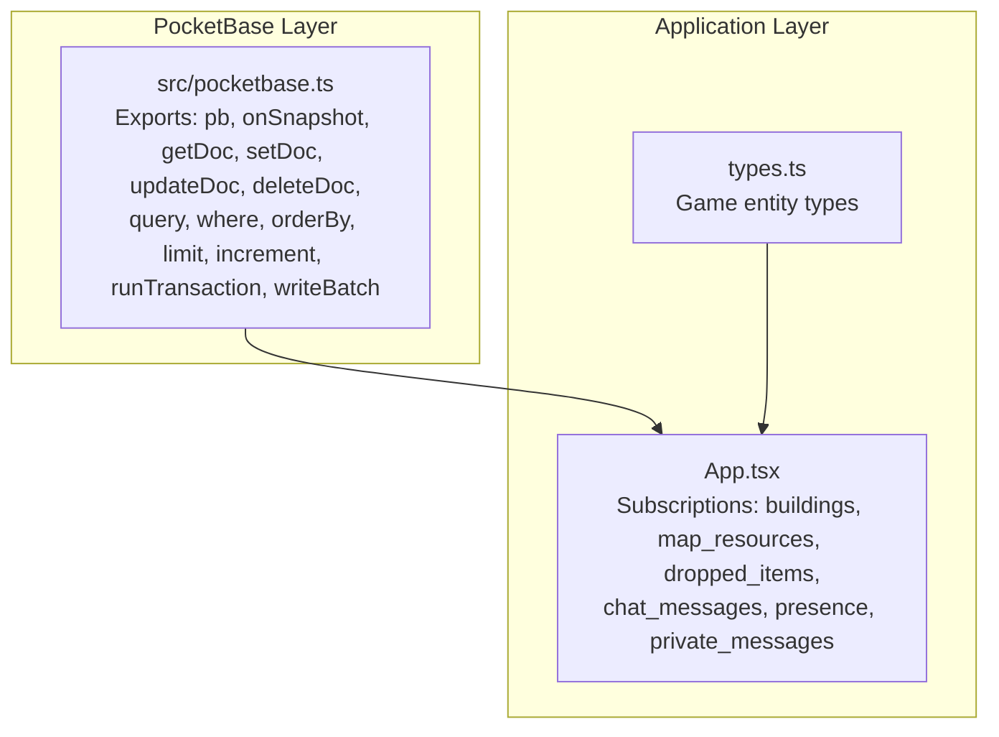
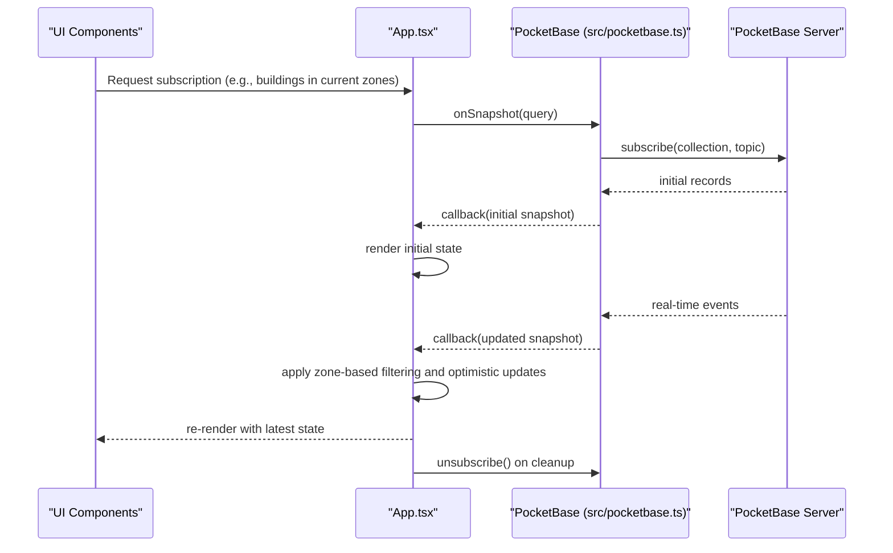
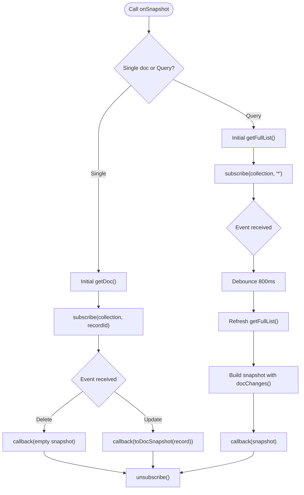
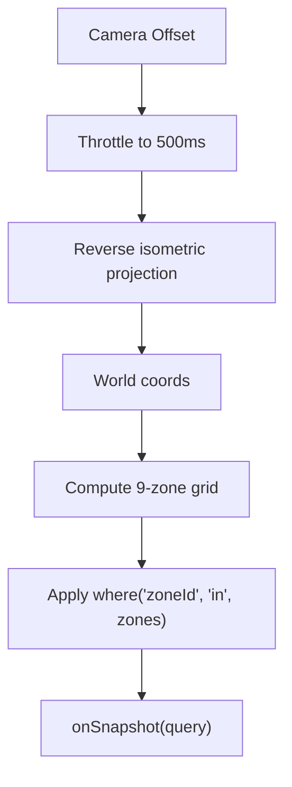
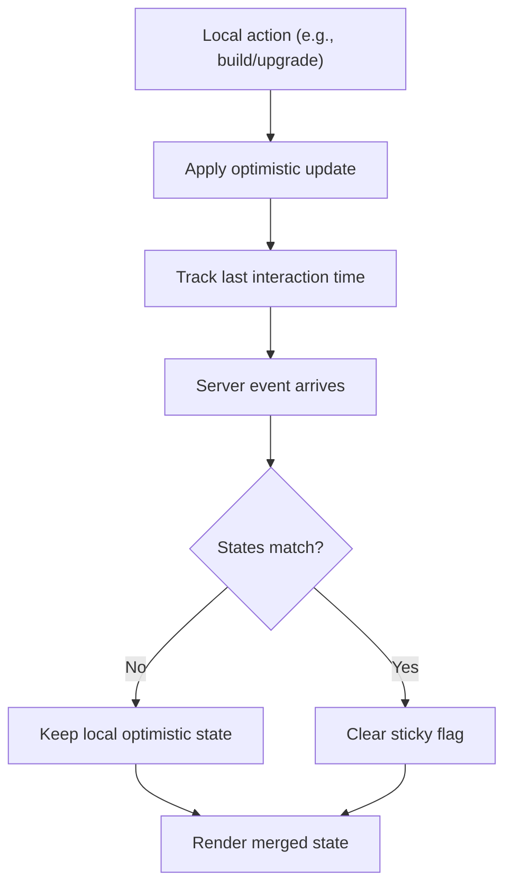
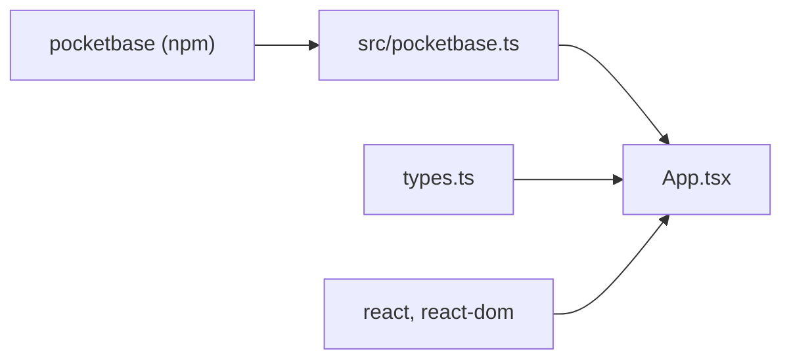

# Real-time Synchronization and Subscriptions

<cite>
**Referenced Files in This Document**
- [pocketbase.ts](file://src/pocketbase.ts)
- [App.tsx](file://App.tsx)
- [types.ts](file://types.ts)
- [package.json](file://package.json)
</cite>

## Table of Contents
1. [Introduction](#introduction)
2. [Project Structure](#project-structure)
3. [Core Components](#core-components)
4. [Architecture Overview](#architecture-overview)
5. [Detailed Component Analysis](#detailed-component-analysis)
6. [Dependency Analysis](#dependency-analysis)
7. [Performance Considerations](#performance-considerations)
8. [Troubleshooting Guide](#troubleshooting-guide)
9. [Conclusion](#conclusion)
10. [Appendices](#appendices)

## Introduction
This document explains the real-time synchronization system built on PocketBase’s subscription API. It covers how onSnapshot delivers live updates for both individual documents and query results, how subscriptions are managed (including automatic reconnection for stale client IDs), how throttling prevents update storms, and how zone-based data partitioning optimizes bandwidth and CPU. It also documents optimistic updates and conflict resolution for concurrent edits, the subscription lifecycle from initialization to cleanup, practical examples for buildings, resources, and player data, and performance/memory considerations and debugging techniques.

## Project Structure
The real-time system spans two primary areas:
- A PocketBase compatibility layer that exposes a Firebase-like API surface and implements onSnapshot and related helpers.
- An application layer that orchestrates subscriptions for buildings, resources, chat, presence, and other game state, and applies zone-based filtering and optimistic updates.

**Diagram sources**
- [pocketbase.ts:1-825](file://src/pocketbase.ts#L1-L825)
- [App.tsx:1-8217](file://App.tsx#L1-L8217)
- [types.ts:1-197](file://types.ts#L1-L197)

**Section sources**
- [pocketbase.ts:1-825](file://src/pocketbase.ts#L1-L825)
- [App.tsx:1-8217](file://App.tsx#L1-L8217)
- [types.ts:1-197](file://types.ts#L1-L197)

## Core Components
- PocketBase client and auth helpers: initializes the client, exposes auth functions mirroring Firebase, and manages user conversion.
- Data transformation helpers: wraps/unwraps documents to/from the PocketBase schema, normalizes IDs, and ensures type consistency.
- Query builder: translates Firebase-style constraints into PocketBase filters/sorts.
- onSnapshot: the core real-time subscription engine for single documents and collections/queries.
- CRUD helpers: getDoc, setDoc, updateDoc, deleteDoc, runTransaction, writeBatch.
- Zone-based partitioning: camera-positioned zone computation and subscription scoping.
- Optimistic updates and conflict resolution: sticky interaction logic and anti-jitter protections.

**Section sources**
- [pocketbase.ts:1-825](file://src/pocketbase.ts#L1-L825)
- [App.tsx:780-877](file://App.tsx#L780-L877)
- [App.tsx:2040-2090](file://App.tsx#L2040-L2090)

## Architecture Overview
The real-time architecture combines a thin PocketBase compatibility layer with application-level orchestration:
- Application computes the current camera-aligned zones.
- Subscriptions are scoped to relevant zones for buildings and map resources.
- onSnapshot handles initial fetches, live events, and cleanup.
- Zone-based filtering reduces traffic and improves responsiveness.
- Optimistic updates are applied locally and reconciled when server confirms.

**Diagram sources**
- [pocketbase.ts:578-707](file://src/pocketbase.ts#L578-L707)
- [App.tsx:2094-2145](file://App.tsx#L2094-L2145)

## Detailed Component Analysis

### onSnapshot Implementation
onSnapshot provides real-time updates for both single documents and query results:
- Single document: performs an initial getDoc, then subscribes to the specific record ID. Deletions are reported as empty snapshots.
- Query: performs an initial getFullList, then subscribes to '*' for the collection. Updates are debounced via a throttle timer to prevent update storms.

Key behaviors:
- Automatic reconnection for stale client IDs: retries with jitter and backoff when receiving 404 or “client id” errors.
- Throttling: a 800 ms debounce prevents rapid successive refreshes during bursts.
- Cleanup: returns an unsubscribe function that clears timers and unsubscribes from PocketBase.

**Diagram sources**
- [pocketbase.ts:578-707](file://src/pocketbase.ts#L578-L707)

**Section sources**
- [pocketbase.ts:578-707](file://src/pocketbase.ts#L578-L707)

### Subscription Management: Reconnection, Throttling, and Cleanup
- Reconnection: safeSubscribe retries on 404/stale client ID with exponential backoff and jitter to avoid thundering herd.
- Throttling: a single throttle timer per query subscription ensures updates are coalesced.
- Cleanup: unsubscribe clears the throttle timeout and calls the underlying PocketBase unsubscribe.

Practical implications:
- Avoids “update storms” during initial loads.
- Handles transient network issues gracefully.
- Ensures no memory leaks or dangling subscriptions.

**Section sources**
- [pocketbase.ts:587-707](file://src/pocketbase.ts#L587-L707)

### Zone-Based Data Partitioning
The application computes a small neighborhood around the camera to limit subscriptions to relevant zones:
- Camera position is throttled to reduce frequent zone recomputation.
- Zone IDs are derived from world coordinates and a fixed zone size.
- Subscriptions filter by zoneId using where('zoneId', 'in', currentZones).

Benefits:
- Reduces network and CPU load by limiting data transfer.
- Improves perceived performance by focusing on visible content.

**Diagram sources**
- [App.tsx:780-820](file://App.tsx#L780-L820)
- [App.tsx:822-877](file://App.tsx#L822-L877)
- [App.tsx:2125-2145](file://App.tsx#L2125-L2145)

**Section sources**
- [App.tsx:780-820](file://App.tsx#L780-L820)
- [App.tsx:822-877](file://App.tsx#L822-L877)
- [App.tsx:2125-2145](file://App.tsx#L2125-L2145)

### Optimistic Updates and Conflict Resolution
Optimistic updates improve responsiveness by applying local changes immediately. The system includes safeguards to resolve conflicts:
- Sticky interaction logic: if a local interaction occurred within the last 10 seconds, the UI preserves the local state until the server confirms the change.
- Anti-jitter protection: merges server and local states intelligently, clearing the sticky flag when server and local states converge.
- Self-healing: zoneId corrections are issued when coordinates change to keep zone membership consistent.

**Diagram sources**
- [App.tsx:2056-2090](file://App.tsx#L2056-L2090)

**Section sources**
- [App.tsx:2040-2090](file://App.tsx#L2040-L2090)

### Subscription Lifecycle: Initialization, Active Listening, Cleanup
Lifecycle stages:
- Initialization: compute current zones, build query with zone filters, call onSnapshot, and render initial snapshot.
- Active listening: handle incoming events, debounce updates, rebuild snapshots, and update UI.
- Cleanup: unsubscribe to cancel timers and PocketBase subscriptions.

Examples in the app:
- Buildings (my buildings and zone buildings)
- Map resources (zone-scoped)
- Dropped items (zone-scoped)
- Chat messages (time-limited order)
- Presence (online users filtered by recency)

**Section sources**
- [App.tsx:2094-2145](file://App.tsx#L2094-L2145)
- [App.tsx:822-877](file://App.tsx#L822-L877)
- [App.tsx:1845-1862](file://App.tsx#L1845-L1862)
- [App.tsx:1936-1960](file://App.tsx#L1936-L1960)

### Practical Examples

- Buildings (per-player):
  - Query: where('ownerId', '==', user.uid)
  - Purpose: show only the current player’s buildings
  - Behavior: onSnapshot updates the player’s building map and triggers reconciliation logic

- Buildings (zone-scoped):
  - Query: where('zoneId', 'in', currentZones)
  - Purpose: render nearby buildings for the current viewport
  - Behavior: merges server and local state, applies sticky interaction logic

- Map resources (zone-scoped):
  - Query: where('zoneId', 'in', currentZones)
  - Purpose: stream trees/oil/chests/quarries in the visible area
  - Behavior: initial load plus docChanges() notifications for new spawns

- Player data (presence and chat):
  - Presence: periodic updates with recency filtering
  - Chat: recent messages ordered by timestamp

**Section sources**
- [App.tsx:2094-2145](file://App.tsx#L2094-L2145)
- [App.tsx:822-877](file://App.tsx#L822-L877)
- [App.tsx:1845-1862](file://App.tsx#L1845-L1862)
- [App.tsx:1864-1934](file://App.tsx#L1864-L1934)

### Relationship Between Subscriptions and State Management
- Zone computation drives subscription scope, reducing unnecessary traffic.
- onSnapshot callbacks update React state, which triggers re-renders.
- Optimistic updates are applied to local state; server confirmations reconcile differences.
- Sticky interaction logic prevents jank and rollback by preserving local intent until server catches up.

**Section sources**
- [App.tsx:780-820](file://App.tsx#L780-L820)
- [App.tsx:2040-2090](file://App.tsx#L2040-L2090)
- [pocketbase.ts:578-707](file://src/pocketbase.ts#L578-L707)

## Dependency Analysis
- PocketBase client: the compatibility layer depends on the official PocketBase SDK.
- React ecosystem: subscriptions are integrated into React lifecycle via useEffect and callbacks.
- Types: game entity types define the shape of synchronized data.

**Diagram sources**
- [package.json:12-20](file://package.json#L12-L20)
- [pocketbase.ts:1-11](file://src/pocketbase.ts#L1-L11)
- [App.tsx:1-10](file://App.tsx#L1-L10)
- [types.ts:1-197](file://types.ts#L1-L197)

**Section sources**
- [package.json:12-20](file://package.json#L12-L20)
- [pocketbase.ts:1-11](file://src/pocketbase.ts#L1-L11)
- [App.tsx:1-10](file://App.tsx#L1-L10)
- [types.ts:1-197](file://types.ts#L1-L197)

## Performance Considerations
- Zone-based filtering: limits data volume and reduces rendering overhead.
- Throttling: coalesces rapid updates to avoid UI thrash.
- Efficient snapshot building: uses maps to compute docChanges() deterministically.
- Batched writes: use writeBatch/runTransaction to minimize round trips.
- Memory hygiene: always return unsubscribe handlers from effects to prevent leaks.

[No sources needed since this section provides general guidance]

## Troubleshooting Guide
Common issues and remedies:
- Stale client ID errors (404): the system retries with jitter/backoff; ensure subscriptions are not prematurely cleaned up.
- Update storms: verify throttle is active and not disabled; ensure zone scoping is correct.
- Missing data after movement: confirm currentZones update and that subscriptions re-run with new filters.
- Conflicts after fast edits: rely on sticky interaction logic; if states diverge long-term, investigate server-side reconciliation.

Debugging tips:
- Observe console warnings for stale client ID retries.
- Add logging around onSnapshot callbacks to inspect snapshot sizes and docChanges().
- Verify zone computations by logging currentZones and the computed 3x3 grid.
- Use getDocs for one-off reads to compare with live streams.

**Section sources**
- [pocketbase.ts:587-621](file://src/pocketbase.ts#L587-L621)
- [App.tsx:780-820](file://App.tsx#L780-L820)
- [App.tsx:2056-2090](file://App.tsx#L2056-L2090)

## Conclusion
The real-time synchronization system leverages PocketBase’s subscription API with thoughtful design choices: zone-based partitioning, throttling, optimistic updates, and robust cleanup. Together, these patterns deliver responsive gameplay while maintaining consistency and resilience under load.

[No sources needed since this section summarizes without analyzing specific files]

## Appendices

### API Surface Summary
- onSnapshot: subscribe to single docs or queries; returns unsubscribe.
- getDoc/setDoc/updateDoc/deleteDoc: CRUD helpers with sanitization and wrapping.
- query/where/orderBy/limit: query builder mapped to PocketBase filters/sorts.
- increment/runTransaction/writeBatch: helpers for atomicity and batching.
- sanitizePbId: enforces strict 15-character IDs.

**Section sources**
- [pocketbase.ts:252-284](file://src/pocketbase.ts#L252-L284)
- [pocketbase.ts:288-448](file://src/pocketbase.ts#L288-L448)
- [pocketbase.ts:477-560](file://src/pocketbase.ts#L477-L560)
- [pocketbase.ts:562-570](file://src/pocketbase.ts#L562-L570)
- [pocketbase.ts:578-707](file://src/pocketbase.ts#L578-L707)