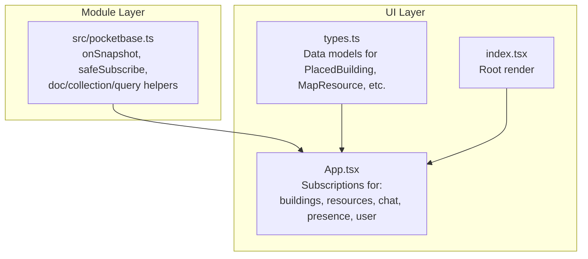
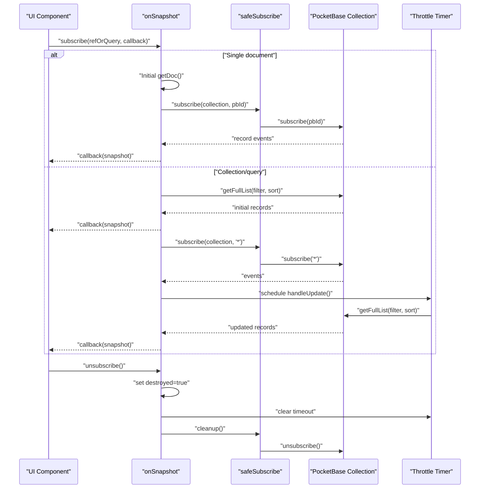
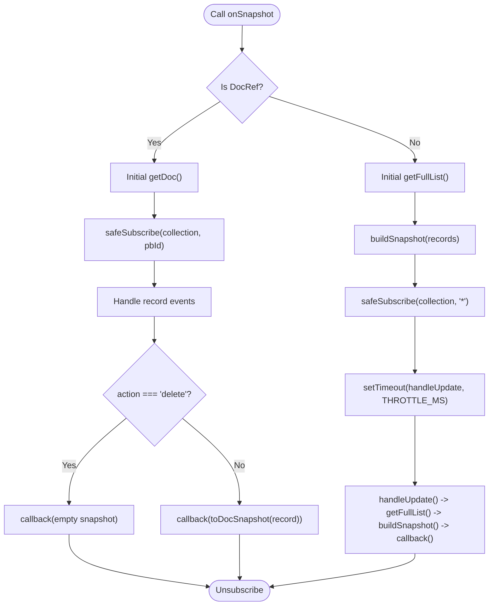
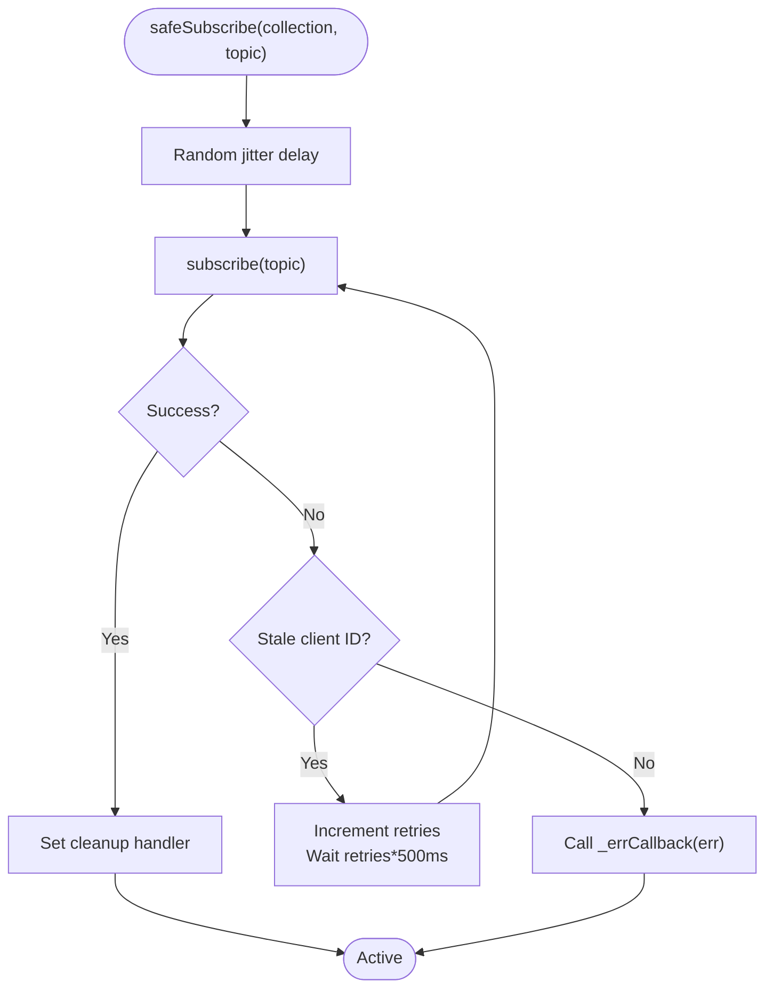
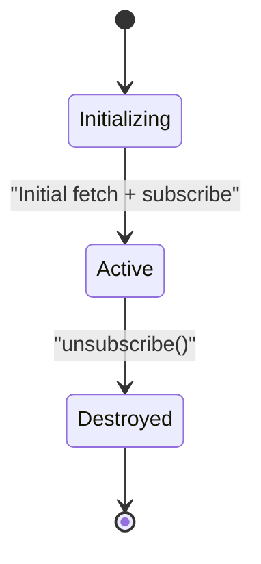
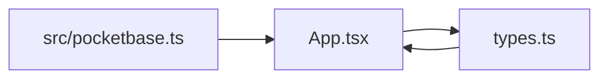

# Subscription Management and Lifecycle

<cite>
**Referenced Files in This Document**
- [pocketbase.ts](file://src/pocketbase.ts)
- [App.tsx](file://App.tsx)
- [types.ts](file://types.ts)
- [index.tsx](file://index.tsx)
</cite>

## Table of Contents
1. [Introduction](#introduction)
2. [Project Structure](#project-structure)
3. [Core Components](#core-components)
4. [Architecture Overview](#architecture-overview)
5. [Detailed Component Analysis](#detailed-component-analysis)
6. [Dependency Analysis](#dependency-analysis)
7. [Performance Considerations](#performance-considerations)
8. [Troubleshooting Guide](#troubleshooting-guide)
9. [Conclusion](#conclusion)
10. [Appendices](#appendices)

## Introduction
This document explains the subscription management system integrated with PocketBase in the application. It focuses on the onSnapshot implementation that supports both single document and collection/query subscriptions, the lifecycle from initialization to cleanup, the safeSubscribe mechanism with automatic retry for stale client IDs, and the differences between document-level and collection-level subscriptions. Practical examples demonstrate how to subscribe to buildings, resources, and player data. The guide also covers state management patterns, error handling, and debugging techniques for subscription-related issues.

## Project Structure
The subscription system is implemented in a dedicated module and consumed across the application’s UI components. Key areas:
- Subscription implementation and PocketBase compatibility helpers live in a single module.
- The main application component orchestrates multiple subscriptions for buildings, resources, chat, presence, and user data.
- Types define the shape of synchronized data for strong typing during subscription callbacks.

**Diagram sources**
- [pocketbase.ts](file://src/pocketbase.ts)
- [App.tsx](file://App.tsx)
- [types.ts](file://types.ts)
- [index.tsx](file://index.tsx)

**Section sources**
- [pocketbase.ts](file://src/pocketbase.ts)
- [App.tsx](file://App.tsx)
- [types.ts](file://types.ts)
- [index.tsx](file://index.tsx)

## Core Components
- onSnapshot: The central subscription function that supports both single document and collection/query subscriptions. It returns an unsubscribe function and integrates with safeSubscribe for robustness.
- safeSubscribe: Retries subscription attempts when encountering stale client IDs (HTTP 404) using exponential backoff and jitter.
- Query builder: query, where, orderBy, limit to construct collection/query subscriptions.
- Data transformation helpers: toDocSnapshot, unwrapData, wrapData to normalize PocketBase records into app-friendly shapes.
- Error handling: handleFirestoreError centralizes logging and user-visible warnings for permission and validation errors.

**Section sources**
- [pocketbase.ts](file://src/pocketbase.ts)

## Architecture Overview
The subscription architecture follows a real-time synchronization pattern:
- Single document subscriptions receive individual record events and handle deletes by emitting an empty snapshot.
- Collection/query subscriptions perform an initial full list fetch, then subscribe to wildcard topics to receive incremental updates. Updates are throttled to reduce load.
- safeSubscribe ensures resilience against stale client IDs by retrying with exponential backoff and jitter.
- Subscriptions are cleaned up via returned unsubscribe functions, and internal cleanup references are used to cancel timers and underlying subscriptions.

**Diagram sources**
- [pocketbase.ts](file://src/pocketbase.ts)

## Detailed Component Analysis

### onSnapshot Implementation
- Purpose: Unified subscription entry point for single documents and collections/queries.
- Single document:
  - Performs an initial getDoc to populate state immediately.
  - Subscribes to the specific record ID; deletes are handled by emitting an empty snapshot.
- Collection/query:
  - Performs an initial getFullList and builds a QuerySnapshot with docChanges.
  - Subscribes to '*' to receive updates; updates are throttled to reduce churn.
- Cleanup:
  - Returns an unsubscribe function that sets a destroyed flag, clears throttle timers, and invokes the underlying cleanup.

**Diagram sources**
- [pocketbase.ts](file://src/pocketbase.ts)

**Section sources**
- [pocketbase.ts](file://src/pocketbase.ts)

### safeSubscribe Mechanism
- Purpose: Retry subscription on stale client ID errors (HTTP 404) with exponential backoff and jitter.
- Behavior:
  - Adds a small random delay to stagger initial subscriptions.
  - On error, detects stale client ID by status code or error message.
  - Retries up to a fixed number of times with increasing delays.
  - Invokes the provided error callback on failure or when destroyed.

**Diagram sources**
- [pocketbase.ts](file://src/pocketbase.ts)

**Section sources**
- [pocketbase.ts](file://src/pocketbase.ts)

### Subscription Lifecycle
- Initialization:
  - Single document: immediate initial fetch plus subscription registration.
  - Collection/query: initial full list plus wildcard subscription registration.
- Active Listening:
  - Single document: receives record events; deletes emit empty snapshots.
  - Collection/query: receives wildcard events; throttled periodic refresh rebuilds snapshots.
- Cleanup:
  - Unsubscribe sets a destroyed flag, clears throttle timers, and calls cleanup handlers.

**Diagram sources**
- [pocketbase.ts](file://src/pocketbase.ts)

**Section sources**
- [pocketbase.ts](file://src/pocketbase.ts)

### Document-Level vs Collection-Level Subscriptions
- Document-level:
  - Use doc(...) with onSnapshot to watch a single record.
  - Ideal for user profiles, presence, and small scoped data.
  - Lower overhead; precise updates; handles deletes explicitly.
- Collection/query-level:
  - Use collection(...) + query(...) with onSnapshot to watch filtered lists.
  - Ideal for buildings, resources, chat, and market listings.
  - Uses wildcard subscription; throttled refresh to balance freshness and performance.

Practical examples in the application:
- User profile: subscribe to the user document by UID.
- Buildings:
  - My buildings: query by ownerId equals current user UID.
  - Zone buildings: query by zoneId in current zones.
- Resources: query by zoneId in current zones.
- Chat messages: query by order and limit.
- Presence: query by lastSeen threshold and limit.

**Section sources**
- [App.tsx](file://App.tsx)
- [pocketbase.ts](file://src/pocketbase.ts)

### Subscription State Management and Application Patterns
- State updates:
  - Subscriptions update React state directly inside callbacks.
  - For collections, docChanges() enables targeted UI updates (add/remove/modify).
- Throttling:
  - Collection updates are throttled to reduce frequent re-renders and server load.
- Zone-based subscriptions:
  - Camera position is throttled; subscriptions update when zones change.
- Cleanup in effects:
  - Each subscription is returned from useEffect and cleaned up on unmount or dependency changes.

**Section sources**
- [App.tsx](file://App.tsx)
- [pocketbase.ts](file://src/pocketbase.ts)

### Practical Examples

#### Example 1: Subscribing to Player Data (Document)
- Subscribe to the user document by UID.
- On first render, initialize player stats from the document.
- On subsequent updates, update state and heal corrupted fields.

**Section sources**
- [App.tsx](file://App.tsx)
- [pocketbase.ts](file://src/pocketbase.ts)

#### Example 2: Subscribing to Buildings (Collection)
- My buildings: filter by ownerId equal to current user UID.
- Zone buildings: filter by zoneId in current zones.
- Update internal maps and trigger UI reconciliation.

**Section sources**
- [App.tsx](file://App.tsx)
- [pocketbase.ts](file://src/pocketbase.ts)

#### Example 3: Subscribing to Map Resources (Collection)
- Filter by zoneId in current zones.
- On initial load, mark resources as loaded.
- On subsequent adds, optionally notify financial intelligence logic.

**Section sources**
- [App.tsx](file://App.tsx)
- [pocketbase.ts](file://src/pocketbase.ts)

#### Example 4: Subscribing to Chat Messages (Collection)
- Order by created descending and limit to recent messages.
- Merge with system messages and sort by timestamp for display.

**Section sources**
- [App.tsx](file://App.tsx)
- [pocketbase.ts](file://src/pocketbase.ts)

## Dependency Analysis
- Module boundaries:
  - src/pocketbase.ts encapsulates PocketBase integration and subscription logic.
  - App.tsx depends on src/pocketbase.ts for subscriptions and CRUD helpers.
  - types.ts defines shared data models used across subscriptions.
- Coupling:
  - UI components depend on onSnapshot and query builders.
  - No circular dependencies observed between modules.
- External dependencies:
  - PocketBase client is the primary external dependency for real-time subscriptions.

**Diagram sources**
- [pocketbase.ts](file://src/pocketbase.ts)
- [App.tsx](file://App.tsx)
- [types.ts](file://types.ts)

**Section sources**
- [pocketbase.ts](file://src/pocketbase.ts)
- [App.tsx](file://App.tsx)
- [types.ts](file://types.ts)

## Performance Considerations
- Throttling: Collection updates are throttled to reduce server load and re-render frequency.
- Zone scoping: Subscriptions are limited to current zones to minimize data volume.
- Initial fetch + real-time: Combine initial full list with wildcard subscription for correctness and responsiveness.
- Jitter: Randomized start delays prevent subscription storms on initial mount.
- Error handling: Centralized error logging avoids crashing background sync while surfacing actionable warnings.

[No sources needed since this section provides general guidance]

## Troubleshooting Guide
Common issues and remedies:
- Stale client ID (404):
  - Symptom: Repeated warnings about stale client ID and retries.
  - Cause: Client ID mismatch or expired subscription.
  - Remedy: safeSubscribe retries automatically; ensure unsubscribe is not called prematurely.
- Permission errors (403/Forbidden):
  - Symptom: Permission denied logs and ignored operations.
  - Cause: API rules restrict access.
  - Remedy: Review PocketBase API rules for the affected collection.
- Validation errors:
  - Symptom: Field validation errors logged with details.
  - Cause: Schema violations or unexpected data types.
  - Remedy: Normalize data using wrapData/unwrapData and ensure schema compliance.
- Over-subscription storms:
  - Symptom: High server load on initial mount.
  - Remedy: rely on jitter and throttling; avoid creating subscriptions in tight loops.
- Cleanup leaks:
  - Symptom: Memory growth or duplicate updates.
  - Remedy: Always return unsubscribe from useEffect; ensure dependencies are correct.

**Section sources**
- [pocketbase.ts](file://src/pocketbase.ts)

## Conclusion
The subscription system provides a robust, efficient, and resilient way to synchronize real-time data from PocketBase. It supports both document-level and collection/query subscriptions, incorporates safe retry logic for stale client IDs, and offers careful lifecycle management with cleanup. By leveraging throttling, zone scoping, and centralized error handling, the system balances responsiveness with performance. The practical examples in the application demonstrate how to apply these patterns to buildings, resources, player data, chat, and presence.

[No sources needed since this section summarizes without analyzing specific files]

## Appendices

### API Surface for Subscriptions
- onSnapshot(refOrQuery, callback, errCallback?): Returns unsubscribe function.
- doc(collectionName, id): Creates a document reference.
- collection(collectionName): Creates a collection reference.
- query(collection, ...constraints): Builds a query descriptor.
- where(field, op, value), orderBy(field, dir), limit(n): Query constraints.

**Section sources**
- [pocketbase.ts](file://src/pocketbase.ts)

### Data Models Used in Subscriptions
- PlacedBuilding, MapResource, DroppedItem, MarketListing, Clan, HistoryEntry, PrivateMessage are synchronized via subscriptions.

**Section sources**
- [types.ts](file://types.ts)