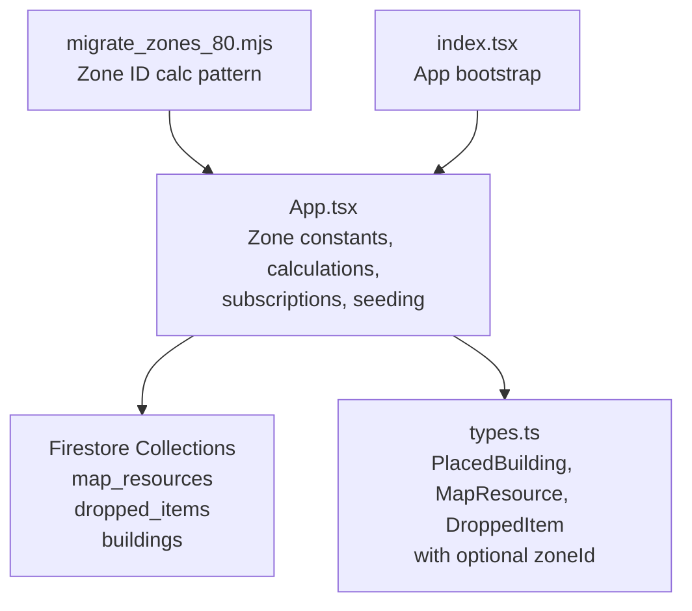
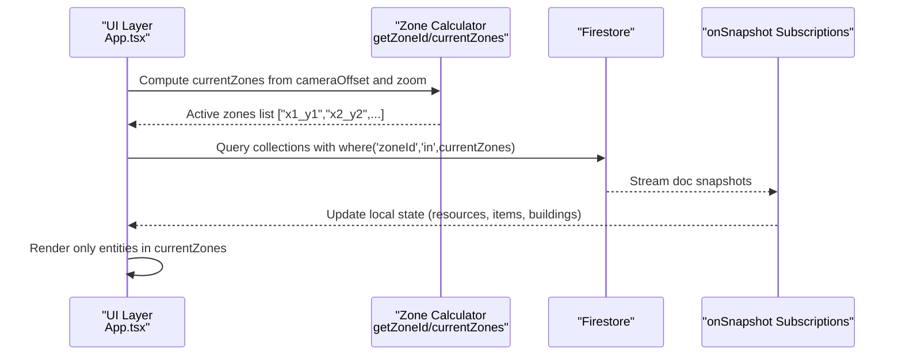
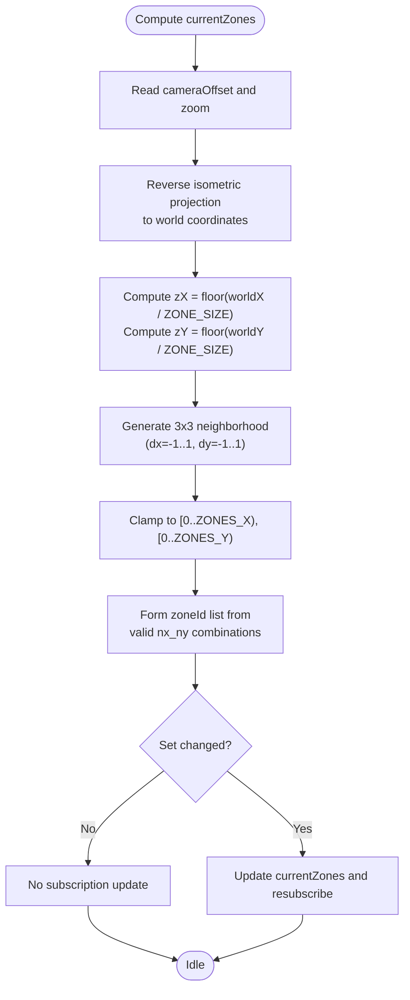
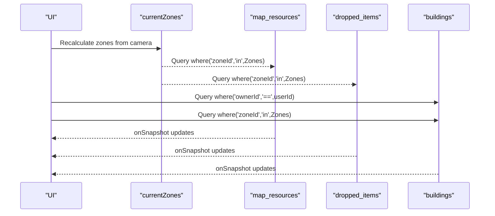
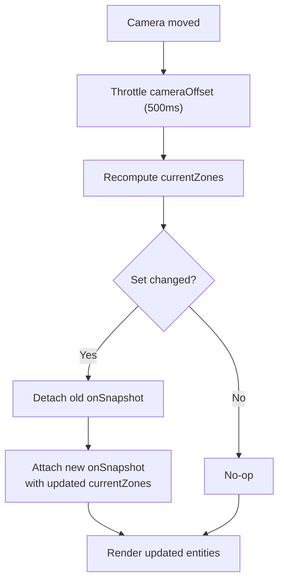
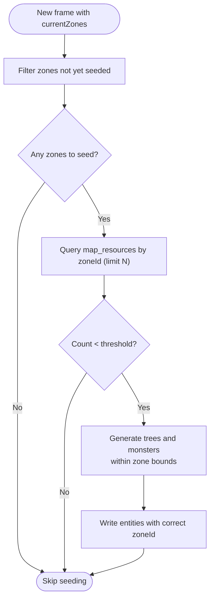
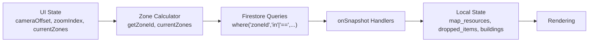

# Zone-based Data Partitioning

<cite>
**Referenced Files in This Document**
- [App.tsx](file://App.tsx)
- [migrate_zones_80.mjs](file://migrate_zones_80.mjs)
- [types.ts](file://types.ts)
- [index.tsx](file://index.tsx)
</cite>

## Table of Contents
1. [Introduction](#introduction)
2. [Project Structure](#project-structure)
3. [Core Components](#core-components)
4. [Architecture Overview](#architecture-overview)
5. [Detailed Component Analysis](#detailed-component-analysis)
6. [Dependency Analysis](#dependency-analysis)
7. [Performance Considerations](#performance-considerations)
8. [Troubleshooting Guide](#troubleshooting-guide)
9. [Conclusion](#conclusion)

## Introduction
This document explains the zone-based data partitioning system that optimizes real-time updates by subscribing only to relevant zones. The system divides the 200x200 tile game world into a 5x5 grid of equal-sized square zones, each 40x40 tiles. Spatial partitioning reduces bandwidth and CPU load by limiting Firestore subscriptions to the zones currently visible to the player’s viewport. The document covers zone ID calculation, coordinate-to-zone mapping, dynamic subscription management, zone transition logic, performance benefits, and edge cases such as border zones and overlapping subscriptions. It also describes how this partitioning integrates with the real-time synchronization pipeline.

## Project Structure
The zone system is implemented in the main application file and supported by shared types and a migration utility:
- App.tsx: Defines constants, zone calculation, viewport-to-zones mapping, Firestore subscriptions, and zone seeding.
- types.ts: Declares entity types that carry optional zoneId fields for spatial partitioning.
- migrate_zones_80.mjs: Demonstrates a prior migration to a different zone size and illustrates the zone ID calculation pattern.
- index.tsx: Application bootstrap (not part of zone logic, but included for completeness).

**Diagram sources**
- [App.tsx:36-46](file://App.tsx#L36-L46)
- [App.tsx:780-820](file://App.tsx#L780-L820)
- [App.tsx:822-893](file://App.tsx#L822-L893)
- [App.tsx:2125-2145](file://App.tsx#L2125-L2145)
- [types.ts:100-147](file://types.ts#L100-L147)
- [migrate_zones_80.mjs:8-10](file://migrate_zones_80.mjs#L8-L10)
- [index.tsx:1-20](file://index.tsx#L1-L20)

**Section sources**
- [App.tsx:36-46](file://App.tsx#L36-L46)
- [App.tsx:780-820](file://App.tsx#L780-L820)
- [App.tsx:822-893](file://App.tsx#L822-L893)
- [App.tsx:2125-2145](file://App.tsx#L2125-L2145)
- [types.ts:100-147](file://types.ts#L100-L147)
- [migrate_zones_80.mjs:8-10](file://migrate_zones_80.mjs#L8-L10)
- [index.tsx:1-20](file://index.tsx#L1-L20)

## Core Components
- Zone constants and calculation:
  - World grid: 5x5 zones.
  - Zone size: 40x40 tiles.
  - Zone ID formula: integer division of coordinates by zone size, forming a “x_y” string identifier.
- Viewport-to-zones mapping:
  - Camera position is translated to world coordinates via reverse isometric projection.
  - Current zone indices are computed, then a 3x3 neighborhood (including diagonals) defines the active zones.
  - Subscriptions update only when the set of active zones changes.
- Real-time subscriptions:
  - Subscriptions to map_resources, dropped_items, and buildings use Firestore queries filtered by “zoneId in currentZones”.
  - Separate subscriptions track the player’s own buildings and nearby zone buildings.
- Zone seeding:
  - When a zone appears to be empty, the client seeds it with resources and monsters to improve perceived richness.

**Section sources**
- [App.tsx:36-46](file://App.tsx#L36-L46)
- [App.tsx:780-820](file://App.tsx#L780-L820)
- [App.tsx:822-893](file://App.tsx#L822-L893)
- [App.tsx:2125-2145](file://App.tsx#L2125-L2145)
- [App.tsx:894-953](file://App.tsx#L894-L953)

## Architecture Overview
The zone system sits between the UI rendering and Firestore, reducing the volume of real-time updates delivered to the client.

**Diagram sources**
- [App.tsx:780-820](file://App.tsx#L780-L820)
- [App.tsx:822-893](file://App.tsx#L822-L893)
- [App.tsx:2125-2145](file://App.tsx#L2125-L2145)

## Detailed Component Analysis

### Zone ID Calculation and Coordinate-to-Zone Mapping
- Zone ID calculation:
  - Formula: integer division of world coordinates by zone size, producing a “qX_qY” string.
  - Used for assigning zoneId to new entities and validating existing ones.
- Viewport-to-zones mapping:
  - Camera position is converted to world coordinates using reverse isometric projection.
  - The central zone index is derived, and a 3x3 neighborhood forms the currentZones set.
  - A deduplication check ensures subscriptions only update when the set changes.

**Diagram sources**
- [App.tsx:783-820](file://App.tsx#L783-L820)
- [App.tsx:44-46](file://App.tsx#L44-L46)

**Section sources**
- [App.tsx:44-46](file://App.tsx#L44-L46)
- [App.tsx:783-820](file://App.tsx#L783-L820)

### Dynamic Subscription Management Based on Player Location and Viewport
- Subscriptions:
  - map_resources: subscribe to “where('zoneId','in',currentZones)”.
  - dropped_items: similar “in” query on currentZones.
  - buildings: two streams:
    - Player-owned buildings: “where('ownerId','==',userId)”.
    - Nearby zone buildings: “where('zoneId','in',currentZones)”.
- Throttling:
  - Camera offset updates are throttled to reduce unnecessary resubscriptions.
- Change detection:
  - For map_resources, docChanges are observed to trigger notifications and intel alerts.

**Diagram sources**
- [App.tsx:822-893](file://App.tsx#L822-L893)
- [App.tsx:2125-2145](file://App.tsx#L2125-L2145)

**Section sources**
- [App.tsx:822-893](file://App.tsx#L822-L893)
- [App.tsx:2125-2145](file://App.tsx#L2125-L2145)

### Zone Transition Logic and Subscription Updates
- Transition triggers:
  - Movement of the camera causes recomputation of currentZones.
  - Only when the set of zones changes does the subscription update occur.
- Subscription lifecycle:
  - onSnapshot handlers return unsubscribe functions to cleanly detach old subscriptions before attaching new ones.
- Throttling impact:
  - 500 ms throttle on cameraOffset prevents rapid oscillations and redundant resubscriptions.

**Diagram sources**
- [App.tsx:570-576](file://App.tsx#L570-L576)
- [App.tsx:780-820](file://App.tsx#L780-L820)
- [App.tsx:822-893](file://App.tsx#L822-L893)
- [App.tsx:2125-2145](file://App.tsx#L2125-L2145)

**Section sources**
- [App.tsx:570-576](file://App.tsx#L570-L576)
- [App.tsx:780-820](file://App.tsx#L780-L820)
- [App.tsx:822-893](file://App.tsx#L822-L893)
- [App.tsx:2125-2145](file://App.tsx#L2125-L2145)

### Zone Seeding Pattern for Empty Zones
- Purpose:
  - Improve perceived richness by generating resources and monsters in zones that appear empty.
- Mechanism:
  - For each new zone in currentZones, check if the zone has fewer than a threshold of resources.
  - If so, insert a batch of trees and monsters at random positions within the zone’s bounds.
- Persistence:
  - Newly inserted entities are saved with their correct zoneId.

**Diagram sources**
- [App.tsx:894-953](file://App.tsx#L894-L953)
- [App.tsx:904-945](file://App.tsx#L904-L945)

**Section sources**
- [App.tsx:894-953](file://App.tsx#L894-L953)
- [App.tsx:904-945](file://App.tsx#L904-L945)

### Practical Examples of Zone Queries and Subscription Patterns
- Example 1: Subscribe to map resources in the current 3x3 zone neighborhood.
  - Query: where('zoneId','in',currentZones)
  - Trigger: currentZones change
  - Source: [App.tsx:822-893](file://App.tsx#L822-L893)
- Example 2: Subscribe to dropped items in the current zones.
  - Query: where('zoneId','in',currentZones)
  - Source: [App.tsx:880-893](file://App.tsx#L880-L893)
- Example 3: Subscribe to buildings in the current zones.
  - Query: where('zoneId','in',currentZones)
  - Source: [App.tsx:2125-2145](file://App.tsx#L2125-L2145)
- Example 4: Subscribe to the player’s own buildings.
  - Query: where('ownerId','==',userId)
  - Source: [App.tsx:2096-2123](file://App.tsx#L2096-L2123)
- Example 5: Zone ID calculation for a given coordinate pair.
  - Formula: getZoneId(x,y) = `${Math.floor(x / ZONE_SIZE)}_${Math.floor(y / ZONE_SIZE)}`
  - Source: [App.tsx:44-46](file://App.tsx#L44-L46)

**Section sources**
- [App.tsx:822-893](file://App.tsx#L822-L893)
- [App.tsx:880-893](file://App.tsx#L880-L893)
- [App.tsx:2125-2145](file://App.tsx#L2125-L2145)
- [App.tsx:2096-2123](file://App.tsx#L2096-L2123)
- [App.tsx:44-46](file://App.tsx#L44-L46)

### Edge Cases and Overlaps
- Border zones:
  - The 3x3 neighborhood computation clamps indices to valid ranges, preventing out-of-bounds zone IDs.
  - Source: [App.tsx:801-811](file://App.tsx#L801-L811)
- Overlapping subscriptions:
  - Player-owned buildings and zone buildings are subscribed separately; merging occurs in memory to avoid duplication.
  - Source: [App.tsx:2096-2123](file://App.tsx#L2096-L2123), [App.tsx:2125-2145](file://App.tsx#L2125-L2145)
- Stale or incorrect zoneId:
  - Self-healing logic recalculates and updates zoneId for buildings whose coordinates no longer match their stored zoneId.
  - Source: [App.tsx:2109-2115](file://App.tsx#L2109-L2115)
- Transition jitter mitigation:
  - A sticky interaction mechanism preserves local optimistic state briefly while waiting for server convergence.
  - Source: [App.tsx:2056-2091](file://App.tsx#L2056-L2091)

**Section sources**
- [App.tsx:801-811](file://App.tsx#L801-L811)
- [App.tsx:2096-2123](file://App.tsx#L2096-L2123)
- [App.tsx:2125-2145](file://App.tsx#L2125-L2145)
- [App.tsx:2109-2115](file://App.tsx#L2109-L2115)
- [App.tsx:2056-2091](file://App.tsx#L2056-L2091)

### Relationship to Overall Game Architecture and Real-Time Synchronization
- Spatial partitioning reduces the number of documents synchronized per tick by constraining queries to currentZones.
- The 5x5 grid and 40x40 zones align with a 200x200 tile world, ensuring manageable query sizes and predictable performance.
- Integration points:
  - Zone calculations depend on camera state and zoom level.
  - Subscriptions feed UI rendering and gameplay logic (e.g., resource gathering, combat).
  - Migration utilities demonstrate how zone IDs were recalculated for legacy datasets.
- Migration reference:
  - A separate migration script uses a different zone size (80x80) and the same integer division approach to compute zone IDs.
  - Source: [migrate_zones_80.mjs:8-10](file://migrate_zones_80.mjs#L8-L10)

**Section sources**
- [App.tsx:36-46](file://App.tsx#L36-L46)
- [App.tsx:780-820](file://App.tsx#L780-L820)
- [App.tsx:822-893](file://App.tsx#L822-L893)
- [App.tsx:2125-2145](file://App.tsx#L2125-L2145)
- [migrate_zones_80.mjs:8-10](file://migrate_zones_80.mjs#L8-L10)

## Dependency Analysis
The zone system depends on:
- UI state (cameraOffset, zoomIndex, currentZones).
- Firestore SDK for real-time subscriptions and writes.
- Entity types that include optional zoneId fields.

**Diagram sources**
- [App.tsx:780-820](file://App.tsx#L780-L820)
- [App.tsx:822-893](file://App.tsx#L822-L893)
- [App.tsx:2125-2145](file://App.tsx#L2125-L2145)

**Section sources**
- [App.tsx:780-820](file://App.tsx#L780-L820)
- [App.tsx:822-893](file://App.tsx#L822-L893)
- [App.tsx:2125-2145](file://App.tsx#L2125-L2145)

## Performance Considerations
- Reduced update frequency:
  - Subscriptions update only when currentZones changes, mitigated by a 500 ms throttle on camera movement.
- Optimized memory usage:
  - Entities outside the viewport are not subscribed to, keeping local state smaller.
- Query efficiency:
  - “where('zoneId','in',currentZones)” leverages indexed zoneId fields to minimize scan overhead.
- Rendering efficiency:
  - Additional optimizations filter entities by approximate visibility before sorting large lists.
- Bandwidth savings:
  - Limiting Firestore reads to a small subset of zones significantly reduces network traffic.

[No sources needed since this section provides general guidance]

## Troubleshooting Guide
- Symptom: Entities not appearing when moving quickly
  - Cause: Camera updates are throttled; currentZones may lag slightly.
  - Resolution: Allow the 500 ms throttle to settle; subscriptions will update automatically.
  - Source: [App.tsx:570-576](file://App.tsx#L570-L576)
- Symptom: Incorrect zoneId on buildings after movement
  - Cause: Coordinates changed without updating zoneId.
  - Resolution: Self-healing logic recalculates and updates zoneId; verify Firestore writes succeed.
  - Source: [App.tsx:2109-2115](file://App.tsx#L2109-L2115)
- Symptom: Excessive re-subscription noise
  - Cause: Rapid camera oscillations near borders.
  - Resolution: Confirm deduplication logic is active; ensure currentZones comparison runs before resubscribing.
  - Source: [App.tsx:813-820](file://App.tsx#L813-L820)
- Symptom: Empty zones feel barren
  - Cause: Low-density generation.
  - Resolution: Enable zone seeding; it will populate missing zones with trees and monsters.
  - Source: [App.tsx:894-953](file://App.tsx#L894-L953)

**Section sources**
- [App.tsx:570-576](file://App.tsx#L570-L576)
- [App.tsx:2109-2115](file://App.tsx#L2109-L2115)
- [App.tsx:813-820](file://App.tsx#L813-L820)
- [App.tsx:894-953](file://App.tsx#L894-L953)

## Conclusion
The zone-based data partitioning system achieves significant bandwidth and CPU savings by restricting real-time subscriptions to the player’s current viewport. The 5x5 grid of 40x40 zones, combined with a robust viewport-to-zones mapping and throttled updates, ensures responsive gameplay while maintaining scalability. Dynamic self-healing, overlapping subscription handling, and zone seeding further enhance reliability and user experience. This approach integrates cleanly with the broader real-time synchronization pipeline and supports efficient rendering and interaction logic.