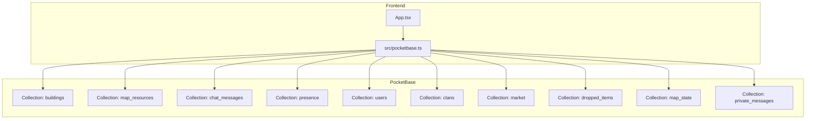
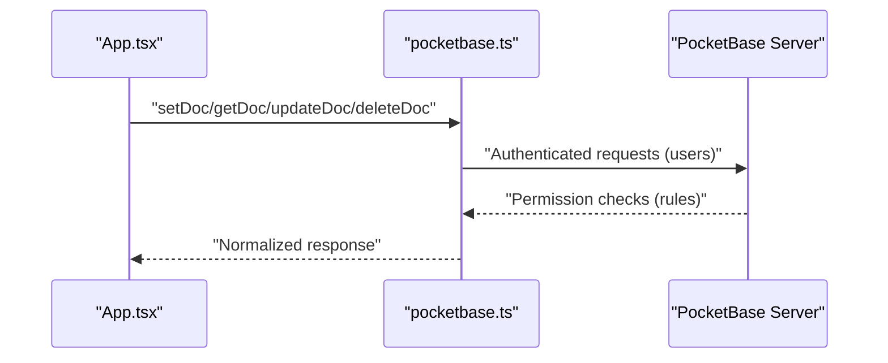
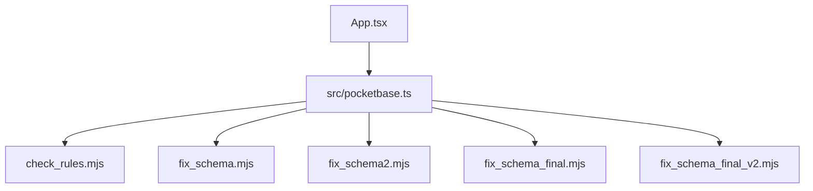
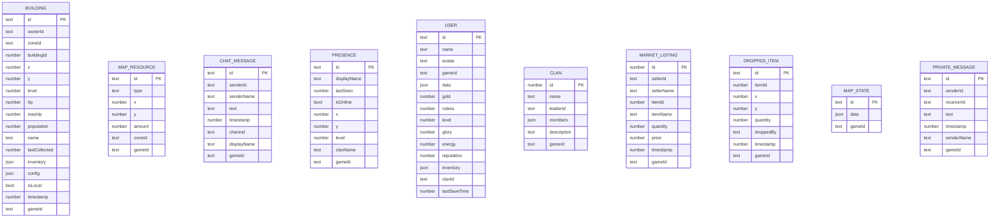

# Security Rules and Access Control

<cite>
**Referenced Files in This Document**
- [check_rules.mjs](file://check_rules.mjs)
- [check_schema.mjs](file://check_schema.mjs)
- [fix_schema.mjs](file://fix_schema.mjs)
- [fix_schema2.mjs](file://fix_schema2.mjs)
- [fix_schema_final.mjs](file://fix_schema_final.mjs)
- [fix_schema_final_v2.mjs](file://fix_schema_final_v2.mjs)
- [pocketbase.ts](file://src/pocketbase.ts)
- [App.tsx](file://App.tsx)
- [types.ts](file://types.ts)
- [buildings.ts](file://data/buildings.ts)
- [items.ts](file://data/items.ts)
- [README.md](file://README.md)
</cite>

## Table of Contents
1. [Introduction](#introduction)
2. [Project Structure](#project-structure)
3. [Core Components](#core-components)
4. [Architecture Overview](#architecture-overview)
5. [Detailed Component Analysis](#detailed-component-analysis)
6. [Dependency Analysis](#dependency-analysis)
7. [Performance Considerations](#performance-considerations)
8. [Troubleshooting Guide](#troubleshooting-guide)
9. [Conclusion](#conclusion)
10. [Appendices](#appendices)

## Introduction
This document explains the PocketBase security rules and access control system for the MMORPG project. It focuses on how rule-based permissions govern reads, writes, and modifications across collections, how authentication integrates with the permission model, and how authorization patterns protect sensitive operations such as building construction, resource extraction, and player interactions. It also provides examples of rule expressions for common scenarios, clarifies the relationship between PocketBase security rules and the application’s permission system, highlights common security pitfalls, and outlines guidelines for extending the ruleset for new features and collections.

## Project Structure
The repository contains:
- Frontend integration and data access layer using PocketBase client wrappers
- Scripts to inspect and synchronize PocketBase schema and rules
- Game data models and configuration for buildings and items
- Application logic that interacts with PocketBase collections

**Diagram sources**
- [pocketbase.ts:150-161](file://src/pocketbase.ts#L150-L161)
- [fix_schema.mjs:5-89](file://fix_schema.mjs#L5-L89)
- [fix_schema2.mjs:18-36](file://fix_schema2.mjs#L18-L36)
- [fix_schema_final.mjs:4-35](file://fix_schema_final.mjs#L4-L35)
- [fix_schema_final_v2.mjs:5-38](file://fix_schema_final_v2.mjs#L5-L38)

**Section sources**
- [README.md:1-21](file://README.md#L1-L21)
- [pocketbase.ts:150-161](file://src/pocketbase.ts#L150-L161)

## Core Components
- PocketBase client wrapper: Provides typed CRUD operations, real-time subscriptions, sanitization of IDs, and data transformation helpers to normalize fields and JSON payloads.
- Schema synchronization scripts: Ensure required fields exist across collections and align with game logic expectations.
- Rule inspection script: Retrieves and logs the current security rules for a given collection.

Key responsibilities:
- Enforce ownership and visibility via collection rules and field-level protections
- Normalize and validate data before persistence
- Maintain strict 15-character record IDs for consistency
- Support real-time updates with safe subscription handling

**Section sources**
- [pocketbase.ts:145-218](file://src/pocketbase.ts#L145-L218)
- [pocketbase.ts:286-448](file://src/pocketbase.ts#L286-L448)
- [pocketbase.ts:571-707](file://src/pocketbase.ts#L571-L707)
- [check_rules.mjs:1-18](file://check_rules.mjs#L1-L18)

## Architecture Overview
The application uses a thin client layer that communicates with PocketBase. Authentication is handled via the users collection, and authorization is enforced through PocketBase’s collection rules. The client normalizes data and ensures consistent IDs, while scripts manage schema alignment and rule inspection.

**Diagram sources**
- [pocketbase.ts:18-37](file://src/pocketbase.ts#L18-L37)
- [pocketbase.ts:286-448](file://src/pocketbase.ts#L286-L448)
- [pocketbase.ts:571-707](file://src/pocketbase.ts#L571-L707)

## Detailed Component Analysis

### Security Rules and Permission Model
- Collections involved in gameplay include: buildings, map_resources, chat_messages, presence, users, clans, market, dropped_items, map_state, private_messages.
- Ownership and visibility are controlled by PocketBase collection rules. The rule inspection script demonstrates how to retrieve and log the current rules for a collection.
- The schema synchronization scripts ensure required fields exist and align with the application’s expectations, which indirectly affects how rules can reference fields.

Recommended approach:
- Define collection rules per operation (list, view, create, update, delete) to enforce ownership and visibility.
- Use field-level protections (e.g., sensitive fields hidden from list/view) to minimize data exposure.
- Leverage the users collection for authentication and tie operations to the authenticated user’s identity.

**Section sources**
- [check_rules.mjs:5-15](file://check_rules.mjs#L5-L15)
- [fix_schema.mjs:5-89](file://fix_schema.mjs#L5-L89)
- [fix_schema2.mjs:18-36](file://fix_schema2.mjs#L18-L36)
- [fix_schema_final.mjs:4-35](file://fix_schema_final.mjs#L4-L35)
- [fix_schema_final_v2.mjs:40-87](file://fix_schema_final_v2.mjs#L40-L87)

### Authentication and User Identity
- Authentication is performed against the users collection with either email/password or OAuth providers.
- The client exposes helpers to sign in, sign up, sign out, and listen to auth state changes.
- The application’s permission model relies on the authenticated user’s identity being present in records (e.g., ownerId fields).

Authorization patterns:
- Owner-only operations: Allow updates/deletes only when the record’s ownerId equals the authenticated user’s ID.
- Visibility controls: Restrict list/view to records owned by the authenticated user or to public fields only.
- Clan-based access: Use fields like clanName/clanId to restrict visibility or actions to members of a specific clan.

**Section sources**
- [pocketbase.ts:18-37](file://src/pocketbase.ts#L18-L37)
- [pocketbase.ts:82-98](file://src/pocketbase.ts#L82-L98)
- [pocketbase.ts:106-121](file://src/pocketbase.ts#L106-L121)
- [types.ts:119-147](file://types.ts#L119-L147)

### Authorization Patterns for Sensitive Operations

#### Preventing Unauthorized Building Placement
- Enforce that only the authenticated user can create or modify buildings they own.
- Validate that placement does not overlap with existing buildings or resources.
- Use collection rules to prevent cross-user interference.

Rule expression example (conceptual):
- Create/update allowed only if requester is owner and placement is valid.

**Section sources**
- [types.ts:119-147](file://types.ts#L119-L147)
- [pocketbase.ts:337-356](file://src/pocketbase.ts#L337-L356)
- [pocketbase.ts:358-426](file://src/pocketbase.ts#L358-L426)

#### Protecting User Data Privacy
- Limit list/view to show only necessary fields.
- Hide sensitive fields (e.g., financial details) from list queries.
- Enforce per-record read access based on ownership.

Rule expression example (conceptual):
- List/view allowed only for records owned by the authenticated user.

**Section sources**
- [check_rules.mjs:8-14](file://check_rules.mjs#L8-L14)
- [fix_schema_final_v2.mjs:72-80](file://fix_schema_final_v2.mjs#L72-L80)

#### Controlling Clan Member Permissions
- Use clan-related fields to gate access to clan-specific data or actions.
- Allow only clan leaders or officers to perform administrative operations.

Rule expression example (conceptual):
- Update/delete allowed only for owners or authorized clan roles.

**Section sources**
- [types.ts:170-178](file://types.ts#L170-L178)
- [fix_schema.mjs:43-49](file://fix_schema.mjs#L43-L49)

### Data Normalization and Field Management
- The client wraps non-key fields into a JSON data payload and unwraps them on read to maintain compatibility with game logic.
- Certain internal flags (e.g., isLocal) are stripped to prevent accidental persistence.
- Known fields per collection are defined centrally to ensure consistent handling.

Implications for security:
- Centralized field mapping reduces risk of leaking internal fields.
- Type normalization prevents unexpected data types from entering the database.

**Section sources**
- [pocketbase.ts:150-161](file://src/pocketbase.ts#L150-L161)
- [pocketbase.ts:165-184](file://src/pocketbase.ts#L165-L184)
- [pocketbase.ts:186-218](file://src/pocketbase.ts#L186-L218)

### Real-Time Subscriptions and Safety
- Real-time subscriptions are throttled and retried on stale client ID errors.
- Initial snapshot is fetched before subscribing to avoid gaps.

Security considerations:
- Ensure subscriptions are scoped to relevant filters to minimize data exposure.
- Handle 404/stale client ID gracefully to avoid leaking subscription internals.

**Section sources**
- [pocketbase.ts:571-707](file://src/pocketbase.ts#L571-L707)

### Example Rule Expressions for Common Scenarios
Note: The following are conceptual expressions to illustrate typical patterns. Adapt them to your PocketBase rule syntax and field names.

- Owner-only read/write for buildings:
  - list: "@request.auth.id != null"
  - view: "ownerId == @request.auth.id"
  - create: "ownerId == @request.auth.id"
  - update: "ownerId == @request.auth.id"
  - delete: "ownerId == @request.auth.id"

- Public chat messages with restricted fields:
  - list: "@request.auth.id != null"
  - view: "channel == 'general' || ownerId == @request.auth.id"
  - create: "@request.auth.id != null && channel == 'general'"
  - update: "false" // disallow edits
  - delete: "false" // disallow deletes

- Clan-only chat:
  - list: "@request.auth.id != null"
  - view: "channel == 'clan' && clanName == @request.auth.record.clanName"
  - create: "@request.auth.id != null && channel == 'clan' && @request.auth.record.clanName != null"
  - update: "false"
  - delete: "false"

- Presence visibility:
  - list: "@request.auth.id != null"
  - view: "uid == @request.auth.id || isOnline == true"
  - create: "uid == @request.auth.id"
  - update: "uid == @request.auth.id"
  - delete: "uid == @request.auth.id"

- Market listings:
  - list: "@request.auth.id != null"
  - view: "true"
  - create: "sellerId == @request.auth.id"
  - update: "sellerId == @request.auth.id"
  - delete: "sellerId == @request.auth.id"

- Dropped items:
  - list: "@request.auth.id != null"
  - view: "ownerId == @request.auth.id || ownerId == null"
  - create: "true"
  - update: "false"
  - delete: "ownerId == @request.auth.id || ownerId == null"

- Private messages:
  - list: "@request.auth.id != null"
  - view: "senderId == @request.auth.id || receiverId == @request.auth.id"
  - create: "@request.auth.id != null"
  - update: "false"
  - delete: "false"

- Map state and map resources:
  - list: "@request.auth.id != null"
  - view: "true"
  - create: "false" // managed server-side
  - update: "false" // managed server-side
  - delete: "false" // managed server-side

**Section sources**
- [types.ts:119-147](file://types.ts#L119-L147)
- [types.ts:170-178](file://types.ts#L170-L178)
- [fix_schema.mjs:5-89](file://fix_schema.mjs#L5-L89)
- [fix_schema2.mjs:18-36](file://fix_schema2.mjs#L18-L36)
- [fix_schema_final.mjs:4-35](file://fix_schema_final.mjs#L4-L35)

### Relationship Between Security Rules and Application Permission System
- The application enforces ownership checks in the client (e.g., isMyBuilding) and uses ownerId fields to gate operations.
- PocketBase rules act as the authoritative enforcement layer, ensuring that even if client logic is bypassed, unauthorized access is prevented.
- The client’s data transformation and sanitization complement rules by keeping payloads consistent and secure.

**Section sources**
- [App.tsx:414-419](file://App.tsx#L414-L419)
- [pocketbase.ts:150-161](file://src/pocketbase.ts#L150-L161)
- [pocketbase.ts:165-184](file://src/pocketbase.ts#L165-L184)

### Common Security Vulnerabilities and Prevention Strategies
- Over-permissive list rules: Always require authentication and scope results to the authenticated user or public fields.
- Missing update/delete rules: Disallow edits/deletes unless explicitly authorized (often by owner).
- Exposed sensitive fields: Hide sensitive fields from list/view; expose only necessary fields.
- Cross-user interference: Enforce ownership checks and validate placement logic server-side via rules.
- Weak authentication: Use strong passwords and enable OAuth providers; ensure users’ IDs are properly mapped.
- Stale realtime subscriptions: Implement retry and jitter logic; handle 404/stale client ID gracefully.

**Section sources**
- [check_rules.mjs:8-14](file://check_rules.mjs#L8-L14)
- [pocketbase.ts:571-707](file://src/pocketbase.ts#L571-L707)

### Guidelines for Extending the Ruleset for New Features and Collections
- Define required fields for new collections using the schema synchronization scripts as templates.
- Add collection rules for each operation (list, view, create, update, delete) aligned with the intended permission model.
- Use field-level protections to hide sensitive data and minimize exposure.
- Scope real-time subscriptions to relevant filters and ensure clients handle errors gracefully.
- Maintain strict ID normalization and sanitization to prevent ID-related attacks.
- Test rules with the rule inspection script to confirm behavior.

**Section sources**
- [fix_schema.mjs:5-89](file://fix_schema.mjs#L5-L89)
- [fix_schema2.mjs:18-36](file://fix_schema2.mjs#L18-L36)
- [fix_schema_final.mjs:4-35](file://fix_schema_final.mjs#L4-L35)
- [fix_schema_final_v2.mjs:40-87](file://fix_schema_final_v2.mjs#L40-L87)
- [check_rules.mjs:5-15](file://check_rules.mjs#L5-L15)

## Dependency Analysis
The application depends on PocketBase for authentication, authorization, and data persistence. The client wrapper encapsulates CRUD, real-time subscriptions, and data normalization. Schema synchronization scripts ensure the database schema matches the application’s expectations.

**Diagram sources**
- [pocketbase.ts:1-11](file://src/pocketbase.ts#L1-L11)
- [check_rules.mjs:1-18](file://check_rules.mjs#L1-L18)
- [fix_schema.mjs:1-158](file://fix_schema.mjs#L1-L158)
- [fix_schema2.mjs:1-39](file://fix_schema2.mjs#L1-L39)
- [fix_schema_final.mjs:1-79](file://fix_schema_final.mjs#L1-L79)
- [fix_schema_final_v2.mjs:1-94](file://fix_schema_final_v2.mjs#L1-L94)

**Section sources**
- [pocketbase.ts:1-11](file://src/pocketbase.ts#L1-L11)
- [check_schema.mjs:5-19](file://check_schema.mjs#L5-L19)

## Performance Considerations
- Use targeted filters in queries to reduce payload sizes and improve responsiveness.
- Prefer list/view rules that limit returned fields to only what is necessary.
- Batch updates where possible to reduce network overhead.
- Monitor realtime subscription churn and adjust throttling and retry logic as needed.

## Troubleshooting Guide
- Missing or insufficient permissions: The application ignores expected race condition errors during the game loop; otherwise, it logs detailed errors with operation type and path.
- Stale realtime client IDs: The client retries subscriptions with jitter and handles 404 errors gracefully.
- Schema mismatches: Use the schema synchronization scripts to add missing fields and align types.

**Section sources**
- [App.tsx:27-33](file://App.tsx#L27-L33)
- [pocketbase.ts:787-800](file://src/pocketbase.ts#L787-L800)
- [pocketbase.ts:571-707](file://src/pocketbase.ts#L571-L707)
- [fix_schema.mjs:91-157](file://fix_schema.mjs#L91-L157)
- [fix_schema2.mjs:4-38](file://fix_schema2.mjs#L4-L38)
- [fix_schema_final.mjs:37-78](file://fix_schema_final.mjs#L37-L78)
- [fix_schema_final_v2.mjs:40-93](file://fix_schema_final_v2.mjs#L40-L93)

## Conclusion
PocketBase’s rule-based permissions, combined with the application’s client-layer safeguards, form a robust security foundation for the MMORPG. By enforcing ownership, scoping visibility, and normalizing data, the system protects sensitive operations and user privacy. Extending the ruleset for new features should follow the established patterns: define required fields, implement precise collection rules, and leverage the provided client helpers and scripts to maintain consistency and security.

## Appendices

### Appendix A: Data Models Overview

**Diagram sources**
- [types.ts:119-147](file://types.ts#L119-L147)
- [types.ts:111-117](file://types.ts#L111-L117)
- [types.ts:160-168](file://types.ts#L160-L168)
- [types.ts:100-109](file://types.ts#L100-L109)
- [types.ts:170-178](file://types.ts#L170-L178)
- [types.ts:187-196](file://types.ts#L187-L196)
- [types.ts:7-8](file://types.ts#L7-L8)
- [types.ts:1-197](file://types.ts#L1-L197)

### Appendix B: Example Rule Expression Reference
- Buildings: Owner-only create/update/delete; list/view scoped to owner or public fields.
- Map Resources: Public list/view; server-managed create/update/delete.
- Chat Messages: General chat open to authenticated users; clan chat restricted to clan members.
- Presence: Public visibility for online status; owner-only updates.
- Market: Owner-only listing management; public browsing.
- Dropped Items: Owner-specific visibility; public pickup when unowned.
- Private Messages: Sender/receiver only; server-managed creation.
- Map State: Server-managed; clients read-only.

**Section sources**
- [types.ts:119-147](file://types.ts#L119-L147)
- [types.ts:111-117](file://types.ts#L111-L117)
- [types.ts:160-168](file://types.ts#L160-L168)
- [types.ts:100-109](file://types.ts#L100-L109)
- [types.ts:170-178](file://types.ts#L170-L178)
- [types.ts:187-196](file://types.ts#L187-L196)
- [fix_schema.mjs:5-89](file://fix_schema.mjs#L5-L89)
- [fix_schema2.mjs:18-36](file://fix_schema2.mjs#L18-L36)
- [fix_schema_final.mjs:4-35](file://fix_schema_final.mjs#L4-L35)