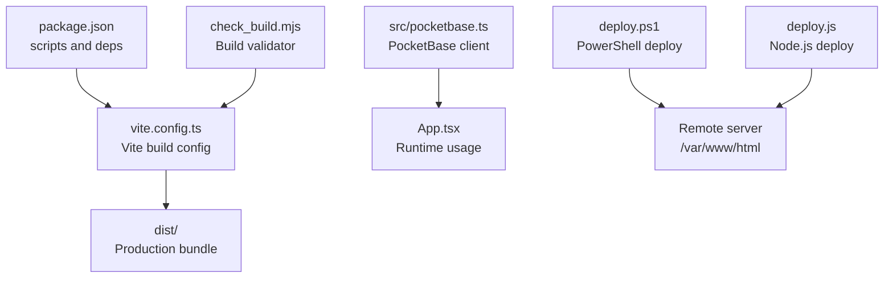
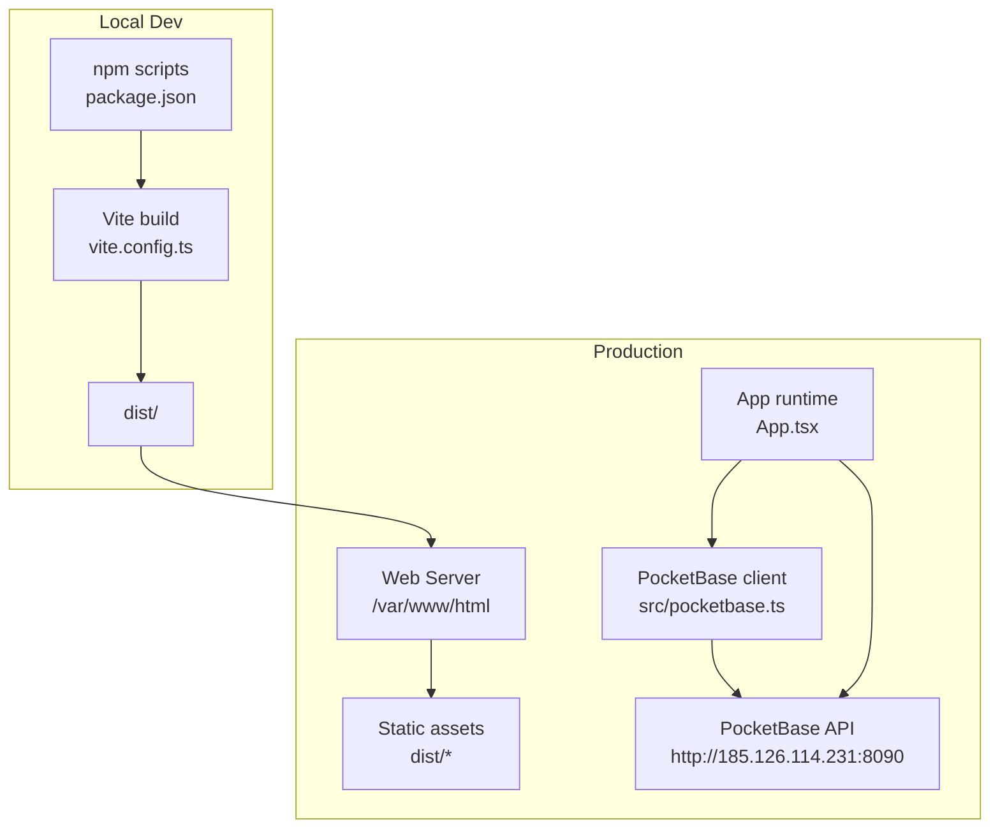
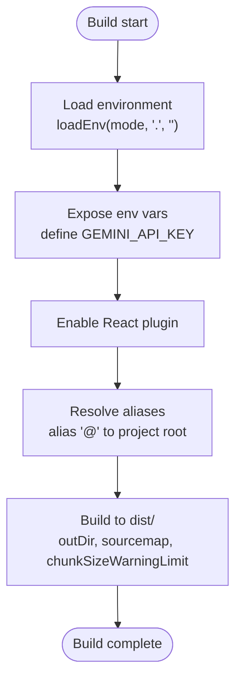
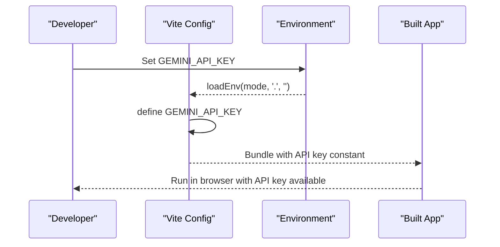
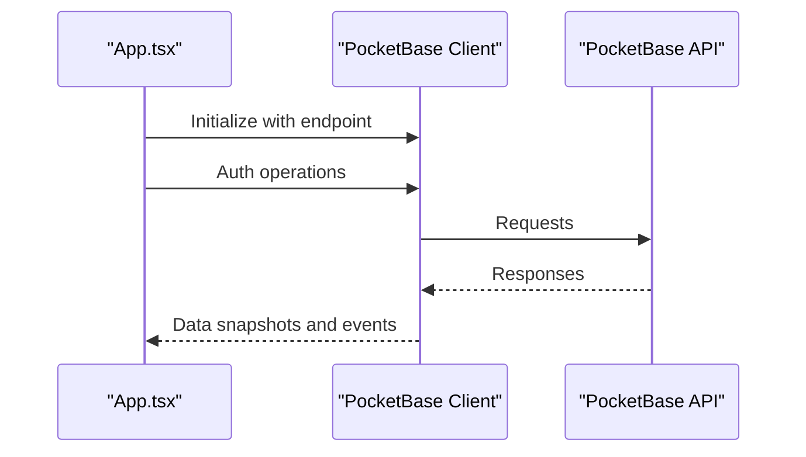
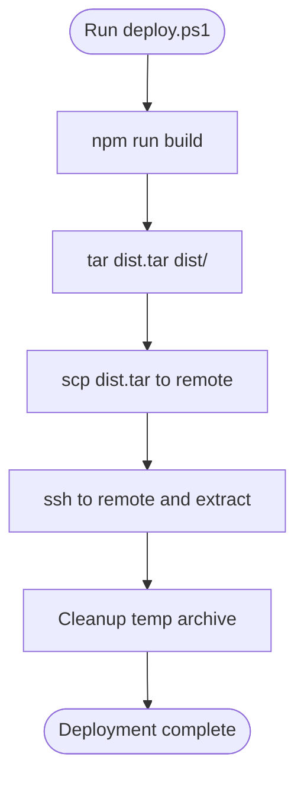
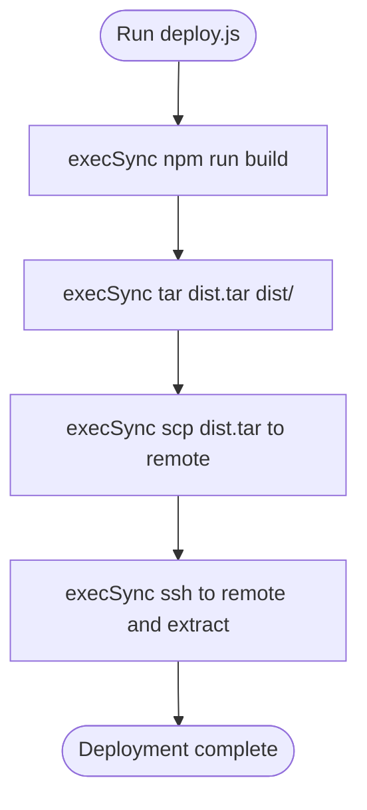
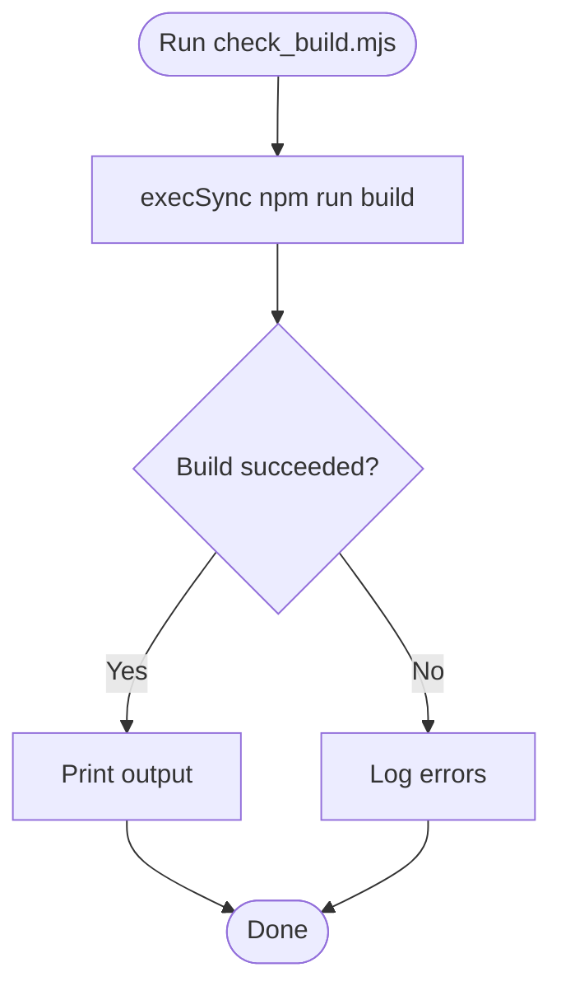
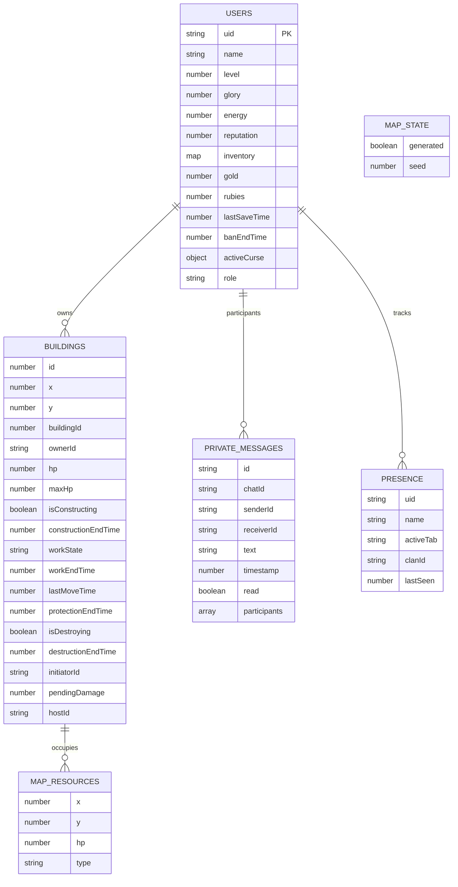
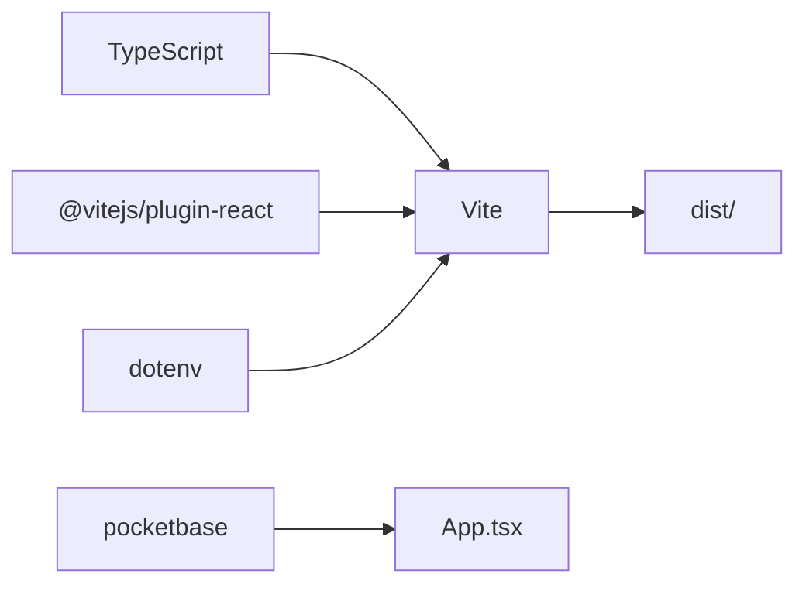

# Deployment Guide

<cite>
**Referenced Files in This Document**
- [package.json](file://package.json)
- [vite.config.ts](file://vite.config.ts)
- [README.md](file://README.md)
- [deploy.ps1](file://deploy.ps1)
- [deploy.js](file://deploy.js)
- [check_build.mjs](file://check_build.mjs)
- [src/pocketbase.ts](file://src/pocketbase.ts)
- [check_pb.js](file://check_pb.js)
- [firebase-blueprint.json](file://firebase-blueprint.json)
- [firestore.rules](file://firestore.rules)
- [index.tsx](file://index.tsx)
- [App.tsx](file://App.tsx)
</cite>

## Table of Contents
1. [Introduction](#introduction)
2. [Project Structure](#project-structure)
3. [Core Components](#core-components)
4. [Architecture Overview](#architecture-overview)
5. [Detailed Component Analysis](#detailed-component-analysis)
6. [Dependency Analysis](#dependency-analysis)
7. [Performance Considerations](#performance-considerations)
8. [Troubleshooting Guide](#troubleshooting-guide)
9. [Conclusion](#conclusion)
10. [Appendices](#appendices)

## Introduction
This deployment guide explains how to build, configure, and deploy the application for production. It covers:
- Build configuration and optimization settings via Vite
- Environment variable configuration and API key management
- Database connection setup using PocketBase
- Step-by-step deployment procedures for cloud and self-hosted environments
- Automated deployment scripts (PowerShell and Node.js)
- Scaling considerations, load balancing, and database optimization
- Troubleshooting, performance tuning, and monitoring approaches

## Project Structure
The repository is a React + TypeScript application built with Vite. Key deployment-relevant files include build configuration, environment handling, client-side PocketBase integration, and deployment automation scripts.

**Diagram sources**
- [package.json:6-11](file://package.json#L6-L11)
- [vite.config.ts:1-29](file://vite.config.ts#L1-L29)
- [src/pocketbase.ts:1-12](file://src/pocketbase.ts#L1-L12)
- [App.tsx:1-10](file://App.tsx#L1-L10)
- [deploy.ps1:1-5](file://deploy.ps1#L1-L5)
- [deploy.js:1-20](file://deploy.js#L1-L20)
- [check_build.mjs:1-12](file://check_build.mjs#L1-L12)

**Section sources**
- [package.json:1-31](file://package.json#L1-L31)
- [vite.config.ts:1-29](file://vite.config.ts#L1-L29)
- [README.md:1-21](file://README.md#L1-L21)

## Core Components
- Build and bundling: Vite configuration defines output directory, sourcemaps, chunk warnings, and environment variable exposure.
- Environment variables: API keys are loaded via Vite’s environment loader and exposed to the app at build time.
- Runtime database client: The PocketBase client is initialized with a production endpoint and used throughout the app.
- Deployment automation: PowerShell and Node.js scripts automate building, archiving, and deploying the built assets to a remote server.

**Section sources**
- [vite.config.ts:5-27](file://vite.config.ts#L5-L27)
- [src/pocketbase.ts:1-12](file://src/pocketbase.ts#L1-L12)
- [deploy.ps1:1-5](file://deploy.ps1#L1-L5)
- [deploy.js:1-20](file://deploy.js#L1-L20)

## Architecture Overview
The application runs as a static SPA served by a web server. Real-time and persistence are handled by PocketBase. The deployment pipeline builds the SPA and uploads it to the server.

**Diagram sources**
- [package.json:6-11](file://package.json#L6-L11)
- [vite.config.ts:22-26](file://vite.config.ts#L22-L26)
- [src/pocketbase.ts:8-11](file://src/pocketbase.ts#L8-L11)
- [deploy.ps1:1-5](file://deploy.ps1#L1-L5)

## Detailed Component Analysis

### Vite Build Configuration and Optimization
- Output directory: dist
- Sourcemaps enabled for debugging
- Chunk size warning threshold increased to accommodate larger bundles
- Environment variables exposed at build time for API keys
- React plugin enabled
- Server configured for development (port and host)

**Diagram sources**
- [vite.config.ts:5-27](file://vite.config.ts#L5-L27)

**Section sources**
- [vite.config.ts:5-27](file://vite.config.ts#L5-L27)

### Environment Variable Configuration and API Key Management
- API key is loaded from the environment and embedded into the build via Vite’s define mechanism.
- Local development requires setting the Gemini API key in a local environment file.
- Production deployments should set the same environment variable on the machine or CI runner performing the build.

**Diagram sources**
- [vite.config.ts:13-16](file://vite.config.ts#L13-L16)
- [README.md:18-18](file://README.md#L18-L18)

**Section sources**
- [vite.config.ts:13-16](file://vite.config.ts#L13-L16)
- [README.md:16-21](file://README.md#L16-L21)

### PocketBase Client Setup and Database Connections
- The PocketBase client is initialized with a production endpoint.
- Authentication and real-time subscriptions are managed through the client.
- The client is used across the application for reads, writes, and subscriptions.

**Diagram sources**
- [src/pocketbase.ts:8-11](file://src/pocketbase.ts#L8-L11)
- [App.tsx:4-10](file://App.tsx#L4-L10)

**Section sources**
- [src/pocketbase.ts:1-12](file://src/pocketbase.ts#L1-L12)
- [App.tsx:1-10](file://App.tsx#L1-L10)

### Automated Deployment Scripts

#### PowerShell Script (deploy.ps1)
- Builds the project
- Archives the dist folder
- Copies archive to a remote server
- Extracts and replaces the live site

**Diagram sources**
- [deploy.ps1:1-5](file://deploy.ps1#L1-L5)

**Section sources**
- [deploy.ps1:1-5](file://deploy.ps1#L1-L5)

#### Node.js Script (deploy.js)
- Similar workflow to the PowerShell script but executed via Node.js
- Uses child_process to run shell commands and stream output

**Diagram sources**
- [deploy.js:1-20](file://deploy.js#L1-L20)

**Section sources**
- [deploy.js:1-20](file://deploy.js#L1-L20)

### Build Validation Script (check_build.mjs)
- Runs the build command and captures stdout/stderr for diagnostics
- Useful for CI or pre-deploy checks

**Diagram sources**
- [check_build.mjs:1-12](file://check_build.mjs#L1-L12)

**Section sources**
- [check_build.mjs:1-12](file://check_build.mjs#L1-L12)

### Database Schema and Security (Firestore-style blueprint and rules)
- The blueprint defines collections and fields used by the app.
- Firestore rules enforce authentication, ownership, and data validation.

**Diagram sources**
- [firebase-blueprint.json:1-191](file://firebase-blueprint.json#L1-L191)

**Section sources**
- [firebase-blueprint.json:1-191](file://firebase-blueprint.json#L1-L191)
- [firestore.rules:1-355](file://firestore.rules#L1-L355)

## Dependency Analysis
- Build-time dependencies: Vite, React plugin, TypeScript, and related tooling.
- Runtime dependencies: React, React DOM, PocketBase client, and UI libraries.
- Environment variable exposure is handled at build time via Vite.

**Diagram sources**
- [package.json:12-29](file://package.json#L12-L29)
- [vite.config.ts:2-3](file://vite.config.ts#L2-L3)
- [src/pocketbase.ts:1-1](file://src/pocketbase.ts#L1-L1)

**Section sources**
- [package.json:12-29](file://package.json#L12-L29)
- [vite.config.ts:2-3](file://vite.config.ts#L2-L3)

## Performance Considerations
- Enable production builds with minification and tree-shaking via Vite.
- Monitor chunk sizes and adjust code splitting to keep initial payloads small.
- Use lazy loading for heavy components and images.
- Optimize asset delivery with a CDN behind a reverse proxy.
- For PocketBase, batch operations and use targeted queries to reduce load.
- Consider enabling HTTP/2 and compression on the web server.

[No sources needed since this section provides general guidance]

## Troubleshooting Guide
Common deployment issues and resolutions:
- Build fails locally or in CI:
  - Use the build validator script to capture detailed logs.
  - Verify environment variables are present during build.
- Remote deployment errors:
  - Confirm SSH access and remote paths.
  - Ensure the remote directory is writable by the deployment user.
- PocketBase connectivity:
  - Verify the PocketBase endpoint is reachable from the deployment server.
  - Check authentication credentials and collections exist.
- Static assets not loading:
  - Confirm the web server serves the dist directory at the correct path.
  - Clear browser cache after deployment.

**Section sources**
- [check_build.mjs:1-12](file://check_build.mjs#L1-L12)
- [deploy.ps1:1-5](file://deploy.ps1#L1-L5)
- [deploy.js:1-20](file://deploy.js#L1-L20)
- [src/pocketbase.ts:8-11](file://src/pocketbase.ts#L8-L11)
- [check_pb.js:1-20](file://check_pb.js#L1-L20)

## Conclusion
This guide outlined the complete deployment workflow: configuring environment variables, building with Vite, automating deployment via PowerShell or Node.js, and connecting to PocketBase for real-time data. For production, pair the SPA with a CDN-backed web server, monitor PocketBase performance, and implement robust logging and alerting.

[No sources needed since this section summarizes without analyzing specific files]

## Appendices

### Step-by-Step Deployment Procedures

- Prepare environment
  - Install dependencies and set the Gemini API key in the environment.
  - Build the project locally to validate the build.

- Cloud provider deployment (example steps)
  - Choose a cloud VM or container service.
  - Install Node.js and a web server (e.g., nginx).
  - Configure the web server to serve the dist directory.
  - Copy the built assets to the web server root.
  - Point DNS to the server’s IP address.

- Self-hosted deployment
  - Use the PowerShell or Node.js deployment scripts to automate copying to a remote server.
  - Ensure the remote server has the correct firewall and SSL/TLS configuration.

- Post-deployment verification
  - Open the site in a browser and confirm assets load.
  - Verify PocketBase connectivity and basic operations.

**Section sources**
- [README.md:16-21](file://README.md#L16-L21)
- [deploy.ps1:1-5](file://deploy.ps1#L1-L5)
- [deploy.js:1-20](file://deploy.js#L1-L20)
- [src/pocketbase.ts:8-11](file://src/pocketbase.ts#L8-L11)

### Scaling Considerations
- Horizontal scaling
  - Serve the SPA from multiple instances behind a load balancer.
  - Use sticky sessions only if required by the backend; otherwise, stateless design is preferred.
- Database optimization
  - Use targeted queries and pagination to limit response sizes.
  - Batch writes and use efficient filters to minimize load.
  - Monitor and tune PocketBase indexing and query plans.
- Real-time performance
  - Throttle frequent updates and coalesce events where possible.
  - Use server-side filtering and client-side debouncing to reduce traffic.

[No sources needed since this section provides general guidance]

### Monitoring and Health Checks
- Web server monitoring
  - Track uptime, response times, and error rates.
- Application monitoring
  - Log PocketBase errors and track client-side exceptions.
- Database monitoring
  - Observe query latency and collection sizes; alert on anomalies.

[No sources needed since this section provides general guidance]