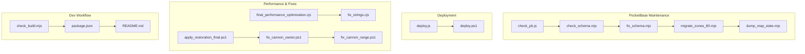
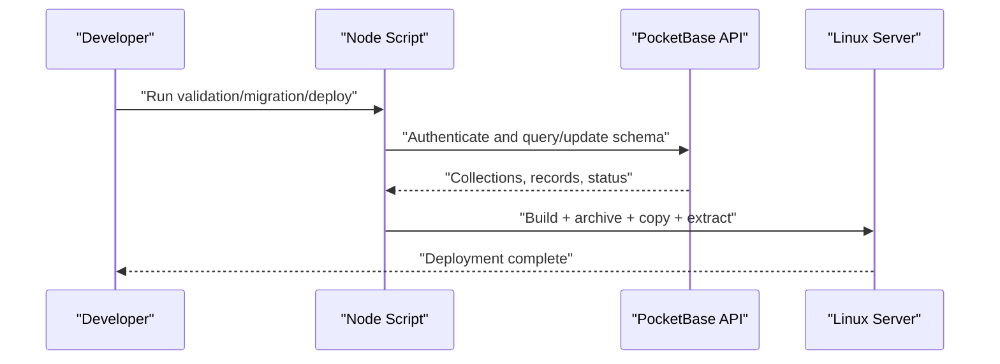
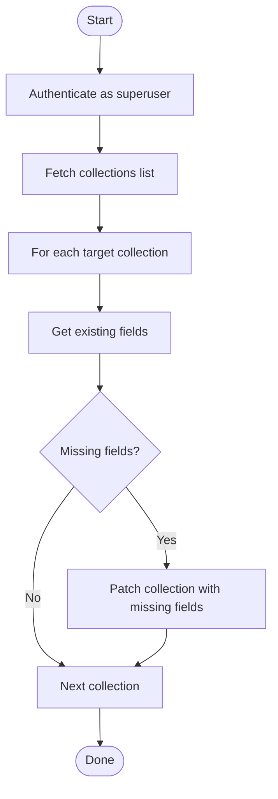
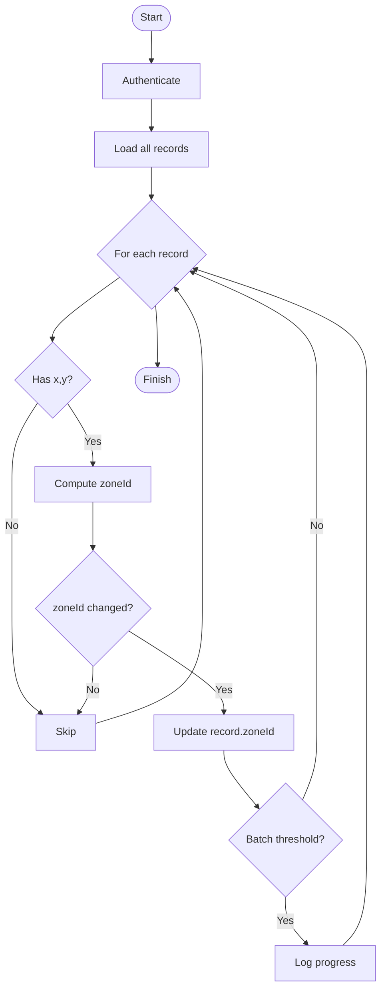
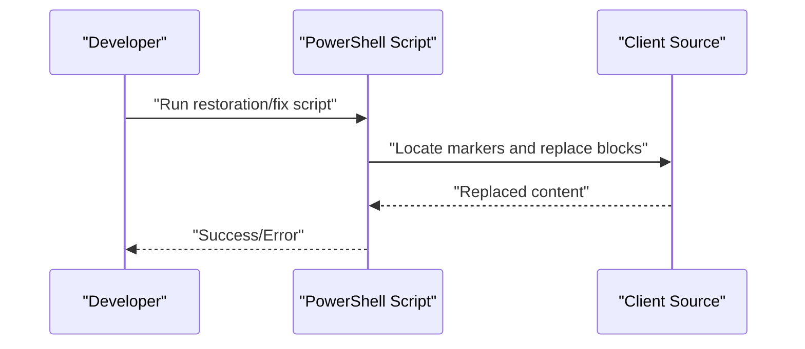
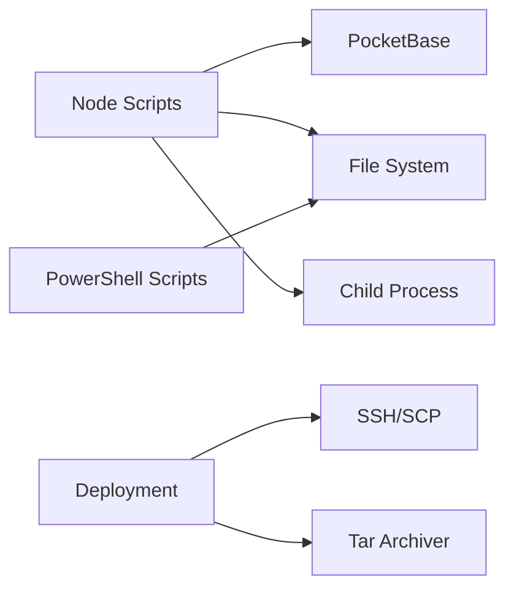

# Development Tools

<cite>
**Referenced Files in This Document**
- [check_pb.js](file://check_pb.js)
- [fix_schema.mjs](file://fix_schema.mjs)
- [check_schema.mjs](file://check_schema.mjs)
- [migrate_zones_80.mjs](file://migrate_zones_80.mjs)
- [dump_map_state.mjs](file://dump_map_state.mjs)
- [check_build.mjs](file://check_build.mjs)
- [deploy.js](file://deploy.js)
- [deploy.ps1](file://deploy.ps1)
- [package.json](file://package.json)
- [README.md](file://README.md)
- [fix_strings.cjs](file://fix_strings.cjs)
- [final_performance_optimization.cjs](file://final_performance_optimization.cjs)
- [apply_restoration_final.ps1](file://apply_restoration_final.ps1)
- [fix_cannon_owner.ps1](file://fix_cannon_owner.ps1)
- [fix_cannon_range.ps1](file://fix_cannon_range.ps1)
</cite>

## Table of Contents
1. [Introduction](#introduction)
2. [Project Structure](#project-structure)
3. [Core Components](#core-components)
4. [Architecture Overview](#architecture-overview)
5. [Detailed Component Analysis](#detailed-component-analysis)
6. [Dependency Analysis](#dependency-analysis)
7. [Performance Considerations](#performance-considerations)
8. [Troubleshooting Guide](#troubleshooting-guide)
9. [Conclusion](#conclusion)
10. [Appendices](#appendices)

## Introduction
This document describes the development tools and utility scripts supporting the Basingsemmorpg project. It focuses on:
- Database validation and schema maintenance for PocketBase
- Data migration utilities for spatial zones
- Deployment automation for Linux servers
- Performance optimization scripts for client-side rendering
- PowerShell scripts for targeted UI fixes and restoration
- Practical usage guidance, parameters, and expected outputs
- Debugging and monitoring techniques, plus extension guidelines

## Project Structure
The repository includes a mix of TypeScript/JavaScript frontend assets, PocketBase-related maintenance scripts, and Windows PowerShell automation helpers. Key categories:
- PocketBase maintenance: validation, schema correction, migrations
- Deployment: Node-based and PowerShell-based automation
- Performance: client-side optimization and rendering fixes
- Utilities: string fixes, map state dumps, build checks

**Diagram sources**
- [check_pb.js](file://check_pb.js)
- [check_schema.mjs](file://check_schema.mjs)
- [fix_schema.mjs](file://fix_schema.mjs)
- [migrate_zones_80.mjs](file://migrate_zones_80.mjs)
- [dump_map_state.mjs](file://dump_map_state.mjs)
- [deploy.js](file://deploy.js)
- [deploy.ps1](file://deploy.ps1)
- [final_performance_optimization.cjs](file://final_performance_optimization.cjs)
- [fix_strings.cjs](file://fix_strings.cjs)
- [apply_restoration_final.ps1](file://apply_restoration_final.ps1)
- [fix_cannon_owner.ps1](file://fix_cannon_owner.ps1)
- [fix_cannon_range.ps1](file://fix_cannon_range.ps1)
- [check_build.mjs](file://check_build.mjs)
- [package.json](file://package.json)
- [README.md](file://README.md)

**Section sources**
- [package.json](file://package.json)
- [README.md](file://README.md)

## Core Components
- PocketBase database validation and stats: [check_pb.js](file://check_pb.js)
- Schema inspection: [check_schema.mjs](file://check_schema.mjs)
- Schema correction: [fix_schema.mjs](file://fix_schema.mjs)
- Zone grid migration: [migrate_zones_80.mjs](file://migrate_zones_80.mjs)
- Map state dump: [dump_map_state.mjs](file://dump_map_state.mjs)
- Build verification: [check_build.mjs](file://check_build.mjs)
- Deployment automation (Node): [deploy.js](file://deploy.js)
- Deployment automation (PowerShell): [deploy.ps1](file://deploy.ps1)
- Client-side performance optimizations: [final_performance_optimization.cjs](file://final_performance_optimization.cjs)
- Drawing string fixes: [fix_strings.cjs](file://fix_strings.cjs)
- UI restoration and targeted fixes: [apply_restoration_final.ps1](file://apply_restoration_final.ps1), [fix_cannon_owner.ps1](file://fix_cannon_owner.ps1), [fix_cannon_range.ps1](file://fix_cannon_range.ps1)

**Section sources**
- [check_pb.js](file://check_pb.js)
- [check_schema.mjs](file://check_schema.mjs)
- [fix_schema.mjs](file://fix_schema.mjs)
- [migrate_zones_80.mjs](file://migrate_zones_80.mjs)
- [dump_map_state.mjs](file://dump_map_state.mjs)
- [check_build.mjs](file://check_build.mjs)
- [deploy.js](file://deploy.js)
- [deploy.ps1](file://deploy.ps1)
- [final_performance_optimization.cjs](file://final_performance_optimization.cjs)
- [fix_strings.cjs](file://fix_strings.cjs)
- [apply_restoration_final.ps1](file://apply_restoration_final.ps1)
- [fix_cannon_owner.ps1](file://fix_cannon_owner.ps1)
- [fix_cannon_range.ps1](file://fix_cannon_range.ps1)

## Architecture Overview
The development toolchain integrates local Node scripts with a remote PocketBase instance and a Linux web server. Typical flows:
- Validation and schema maintenance against PocketBase
- Batch data migrations for spatial indexing
- Local builds and automated deployment via SCP/SSH or PowerShell
- Client-side rendering optimizations and targeted UI fixes

**Diagram sources**
- [check_pb.js](file://check_pb.js)
- [fix_schema.mjs](file://fix_schema.mjs)
- [migrate_zones_80.mjs](file://migrate_zones_80.mjs)
- [deploy.js](file://deploy.js)
- [deploy.ps1](file://deploy.ps1)

## Detailed Component Analysis

### Database Validation and Stats: check_pb.js
Purpose:
- Authenticate as a superuser
- Enumerate non-system collections
- Fetch record counts per collection
- Write a summary to a statistics file

Usage:
- Run locally with Node
- Requires PocketBase endpoint and admin credentials configured
- Produces a statistics file for audit/triage

Parameters:
- Endpoint and credentials are embedded in the script
- No CLI arguments

Expected output:
- A statistics file containing collection names and their record counts

Typical use cases:
- Pre-deployment health check
- Post-migration verification
- Investigating unexpected data volume changes

**Section sources**
- [check_pb.js](file://check_pb.js)

### Schema Inspection: check_schema.mjs
Purpose:
- Authenticate as a superuser
- List selected collections and print their fields and types

Usage:
- Run locally with Node
- Filters specific collections for inspection

Parameters:
- Endpoint and credentials are embedded
- Hardcoded collection list for inspection

Expected output:
- Console logs of fields per collection

Typical use cases:
- Verifying schema completeness
- Diagnosing missing fields after migrations

**Section sources**
- [check_schema.mjs](file://check_schema.mjs)

### Schema Correction: fix_schema.mjs
Purpose:
- Ensure required fields exist in target collections
- Add missing fields with appropriate types
- Preserve existing fields and schema

Usage:
- Run locally with Node
- Requires PocketBase admin credentials

Parameters:
- Embedded endpoint and credentials
- Required fields definition per collection

Expected output:
- Console logs per collection indicating whether fields were added or were already present
- Final completion message

Typical use cases:
- Recovering from partial migrations
- Standardizing schema across environments

**Diagram sources**
- [fix_schema.mjs](file://fix_schema.mjs)

**Section sources**
- [fix_schema.mjs](file://fix_schema.mjs)

### Zone Grid Migration: migrate_zones_80.mjs
Purpose:
- Recalculate and update zone identifiers for buildings, resources, and dropped items
- Use a fixed zone size for tiling
- Batch updates with progress reporting

Usage:
- Run locally with Node
- Requires PocketBase admin credentials

Parameters:
- Zone size constant
- Batch size constant
- Target collections

Expected output:
- Progress logs during batch updates
- Completion summary with total updated items

Typical use cases:
- After changing zone grid size
- Bulk re-indexing after coordinate changes

**Diagram sources**
- [migrate_zones_80.mjs](file://migrate_zones_80.mjs)

**Section sources**
- [migrate_zones_80.mjs](file://migrate_zones_80.mjs)

### Map State Dump: dump_map_state.mjs
Purpose:
- Retrieve and print all map_state records for inspection

Usage:
- Run locally with Node
- Requires PocketBase endpoint

Parameters:
- Endpoint embedded

Expected output:
- Formatted JSON of records to console

Typical use cases:
- Verifying map state persistence
- Debugging map rendering issues

**Section sources**
- [dump_map_state.mjs](file://dump_map_state.mjs)

### Build Verification: check_build.mjs
Purpose:
- Execute the project build command and capture stdout/stderr
- Fail gracefully with captured errors

Usage:
- Run locally with Node
- Uses the project’s configured build script

Parameters:
- None (relies on npm scripts)

Expected output:
- Build logs or detailed error messages

Typical use cases:
- CI pre-flight checks
- Automated local verification

**Section sources**
- [check_build.mjs](file://check_build.mjs)
- [package.json](file://package.json)

### Deployment Automation (Node): deploy.js
Purpose:
- Build the project
- Archive the build output
- Copy archive to remote host and extract

Usage:
- Run locally with Node
- Requires SSH/SCP availability

Parameters:
- Host and destination paths are embedded

Expected output:
- Step-by-step logs and final success/failure

Typical use cases:
- Automated deployment pipeline
- One-command release

**Section sources**
- [deploy.js](file://deploy.js)

### Deployment Automation (PowerShell): deploy.ps1
Purpose:
- Build, archive, and deploy via PowerShell commands

Usage:
- Run locally in a Windows shell with PowerShell
- Requires tar.exe, scp, ssh availability

Parameters:
- Host and destination paths are embedded

Expected output:
- Step-by-step logs and final success/failure

Typical use cases:
- Windows-centric CI/CD or developer machines

**Section sources**
- [deploy.ps1](file://deploy.ps1)

### Client-Side Performance Optimizations: final_performance_optimization.cjs
Purpose:
- Optimize entity sorting by approximate visibility filtering
- Optimize ground tile loop by computing visible tile bounds

Usage:
- Run locally with Node
- Edits the client source file in place

Parameters:
- Path to the client source file is embedded

Expected output:
- Confirmation logs and verification markers in the file

Typical use cases:
- Reducing render cost for large worlds
- Improving frame rates under heavy entity counts

**Section sources**
- [final_performance_optimization.cjs](file://final_performance_optimization.cjs)

### Drawing String Fixes: fix_strings.cjs
Purpose:
- Fix malformed drawing color strings in the client source

Usage:
- Run locally with Node
- Edits the client source file in place

Parameters:
- Path to the client source file is embedded

Expected output:
- Success confirmation

Typical use cases:
- Restoring visuals after encoding or copy-paste issues

**Section sources**
- [fix_strings.cjs](file://fix_strings.cjs)

### UI Restoration and Targeted Fixes (PowerShell)
- apply_restoration_final.ps1: Replaces a game loop block and fixes a drawing effect in the client source
- fix_cannon_owner.ps1: Updates the cannonsAttacking filter logic and preserves debug logging
- fix_cannon_range.ps1: Rewrites the cannon processing block to enforce a 3-tile range targeting

Usage:
- Run locally in a Windows shell with PowerShell
- Operates on the client source file by replacing specific blocks

Parameters:
- Paths and markers are embedded

Expected output:
- Success/error messages per operation

Typical use cases:
- Quick UI/behavior fixes during hot-fixes
- Preserving diagnostic logs while applying functional changes

**Diagram sources**
- [apply_restoration_final.ps1](file://apply_restoration_final.ps1)
- [fix_cannon_owner.ps1](file://fix_cannon_owner.ps1)
- [fix_cannon_range.ps1](file://fix_cannon_range.ps1)

**Section sources**
- [apply_restoration_final.ps1](file://apply_restoration_final.ps1)
- [fix_cannon_owner.ps1](file://fix_cannon_owner.ps1)
- [fix_cannon_range.ps1](file://fix_cannon_range.ps1)

## Dependency Analysis
- Node scripts depend on:
  - PocketBase SDK for schema and record operations
  - Child process utilities for build and deployment
  - File system for in-place edits
- PowerShell scripts depend on:
  - File system editing capabilities
  - Text pattern matching and replacement
- Deployment relies on:
  - SSH/SCP connectivity to the remote host
  - Tar archiving on the target platform

**Diagram sources**
- [deploy.js](file://deploy.js)
- [deploy.ps1](file://deploy.ps1)
- [fix_schema.mjs](file://fix_schema.mjs)
- [migrate_zones_80.mjs](file://migrate_zones_80.mjs)

**Section sources**
- [deploy.js](file://deploy.js)
- [deploy.ps1](file://deploy.ps1)
- [fix_schema.mjs](file://fix_schema.mjs)
- [migrate_zones_80.mjs](file://migrate_zones_80.mjs)

## Performance Considerations
- Rendering optimization:
  - Apply visibility filtering before sorting large entity lists
  - Limit tile rendering to visible bounds
- Data operations:
  - Batch updates for migrations to reduce load
  - Use pagination or batching when fetching large datasets
- Build and deployment:
  - Archive only necessary artifacts
  - Prefer incremental deployments where possible

[No sources needed since this section provides general guidance]

## Troubleshooting Guide
Common issues and resolutions:
- Authentication failures:
  - Verify endpoint and credentials in scripts
  - Ensure PocketBase is reachable and admin account exists
- Network errors during deployment:
  - Confirm SSH/SCP availability and firewall rules
  - Validate remote paths and permissions
- Build failures:
  - Use the build checker script to capture detailed logs
  - Inspect TypeScript/React configuration and dependencies
- Schema mismatches:
  - Run schema inspection to compare expected vs actual fields
  - Apply schema correction to add missing fields
- Migration inconsistencies:
  - Re-run migration with updated coordinates
  - Verify zoneId computation and batch thresholds

**Section sources**
- [check_build.mjs](file://check_build.mjs)
- [check_schema.mjs](file://check_schema.mjs)
- [fix_schema.mjs](file://fix_schema.mjs)
- [migrate_zones_80.mjs](file://migrate_zones_80.mjs)
- [deploy.js](file://deploy.js)
- [deploy.ps1](file://deploy.ps1)

## Conclusion
The Basingsemmorpg development toolset combines Node-based maintenance utilities for PocketBase with PowerShell-driven UI fixes and automated deployment. Together they enable rapid validation, schema standardization, spatial migrations, performance tuning, and reliable releases. Extending the toolset follows established patterns: add scripts that authenticate, operate on data or files, and produce actionable logs.

[No sources needed since this section summarizes without analyzing specific files]

## Appendices

### Practical Usage Examples
- Validate database state before release:
  - Run the validation script and review the generated statistics file
- Correct missing schema fields:
  - Execute the schema correction script; confirm per-collection logs
- Migrate zone identifiers:
  - Run the migration script; monitor batch progress and final counts
- Verify builds locally:
  - Use the build checker script prior to deployment
- Deploy to production:
  - Choose the Node or PowerShell deployment script depending on environment
- Optimize rendering:
  - Apply the performance optimization script and measure frame rates
- Fix drawing issues:
  - Run the drawing string fix script to restore visuals
- Restore UI logic:
  - Use the restoration and cannon-specific scripts to apply targeted fixes

**Section sources**
- [check_pb.js](file://check_pb.js)
- [fix_schema.mjs](file://fix_schema.mjs)
- [migrate_zones_80.mjs](file://migrate_zones_80.mjs)
- [check_build.mjs](file://check_build.mjs)
- [deploy.js](file://deploy.js)
- [deploy.ps1](file://deploy.ps1)
- [final_performance_optimization.cjs](file://final_performance_optimization.cjs)
- [fix_strings.cjs](file://fix_strings.cjs)
- [apply_restoration_final.ps1](file://apply_restoration_final.ps1)
- [fix_cannon_owner.ps1](file://fix_cannon_owner.ps1)
- [fix_cannon_range.ps1](file://fix_cannon_range.ps1)

### Extension Guidelines
- Naming:
  - Use descriptive suffixes (.mjs for modern modules, .cjs for CommonJS, .ps1 for PowerShell)
- Authentication:
  - Centralize credentials and endpoints in constants or environment variables
- Idempotency:
  - Design scripts to be safe to rerun (check before mutate)
- Logging:
  - Emit clear step-by-step logs and final status
- Safety:
  - Prefer dry runs or previews where possible
  - Back up data before destructive operations
- Testing:
  - Validate on staging before production runs

[No sources needed since this section provides general guidance]