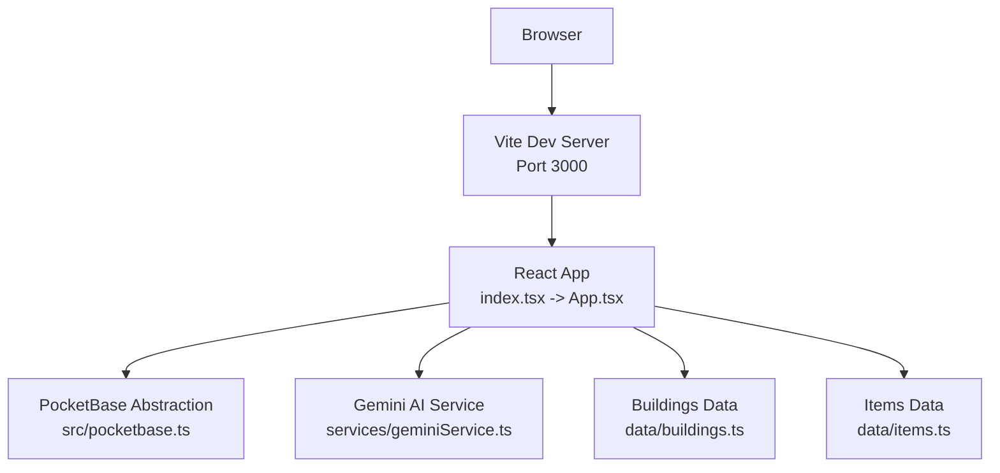
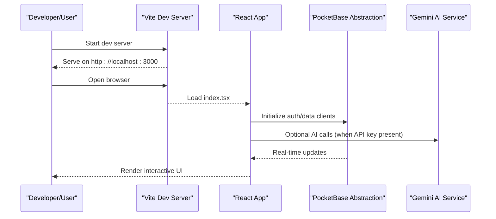
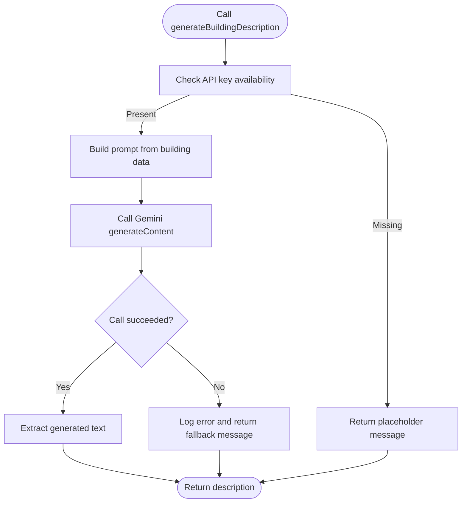
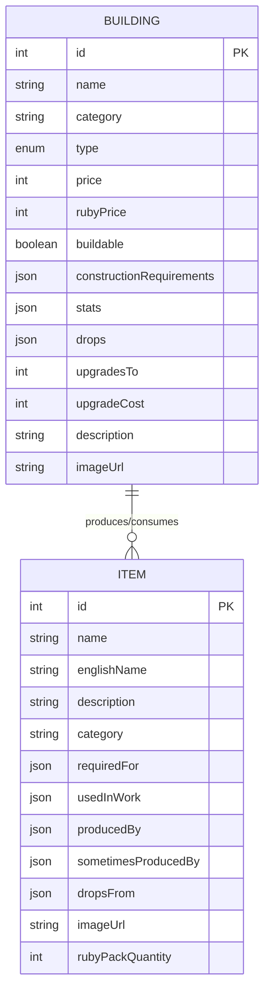
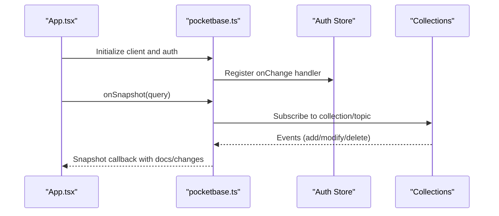
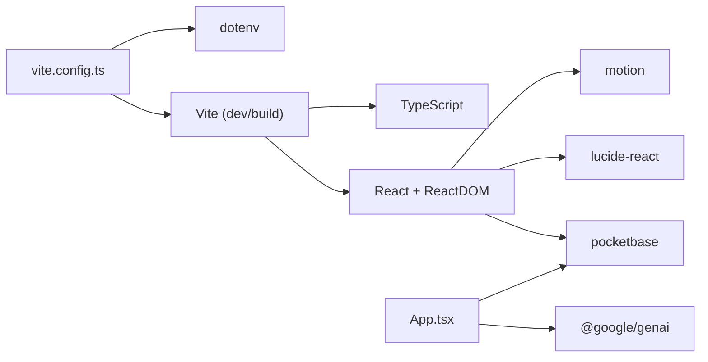

# Getting Started

<cite>
**Referenced Files in This Document**
- [README.md](file://README.md)
- [package.json](file://package.json)
- [vite.config.ts](file://vite.config.ts)
- [index.html](file://index.html)
- [index.tsx](file://index.tsx)
- [src/index.css](file://src/index.css)
- [tsconfig.json](file://tsconfig.json)
- [services/geminiService.ts](file://services/geminiService.ts)
- [src/pocketbase.ts](file://src/pocketbase.ts)
- [App.tsx](file://App.tsx)
- [data/buildings.ts](file://data/buildings.ts)
- [data/items.ts](file://data/items.ts)
- [types.ts](file://types.ts)
</cite>

## Table of Contents
1. [Introduction](#introduction)
2. [Project Structure](#project-structure)
3. [Core Components](#core-components)
4. [Architecture Overview](#architecture-overview)
5. [Detailed Component Analysis](#detailed-component-analysis)
6. [Dependency Analysis](#dependency-analysis)
7. [Performance Considerations](#performance-considerations)
8. [Troubleshooting Guide](#troubleshooting-guide)
9. [Conclusion](#conclusion)
10. [Appendices](#appendices)

## Introduction
This guide helps you set up and run the Basingsemmorpg project locally. It covers prerequisites, installing dependencies, configuring the environment, running the development server, verifying the setup, and understanding the development workflow. It also includes troubleshooting tips for common issues such as port conflicts, missing dependencies, and API key configuration.

## Project Structure
The project is a Vite-powered React application with TypeScript. It integrates:
- A PocketBase backend abstraction for real-time data synchronization
- An AI service powered by Google Generative AI for dynamic content generation
- A rich game world built from static data files

**Diagram sources**
- [index.html:1-15](file://index.html#L1-L15)
- [index.tsx:1-20](file://index.tsx#L1-L20)
- [vite.config.ts:1-29](file://vite.config.ts#L1-L29)
- [src/pocketbase.ts:1-121](file://src/pocketbase.ts#L1-L121)
- [services/geminiService.ts:1-43](file://services/geminiService.ts#L1-L43)
- [data/buildings.ts:1-800](file://data/buildings.ts#L1-L800)
- [data/items.ts:1-415](file://data/items.ts#L1-L415)

**Section sources**
- [README.md:1-21](file://README.md#L1-L21)
- [package.json:1-31](file://package.json#L1-L31)
- [vite.config.ts:1-29](file://vite.config.ts#L1-L29)
- [index.html:1-15](file://index.html#L1-L15)
- [index.tsx:1-20](file://index.tsx#L1-L20)
- [src/index.css:1-2](file://src/index.css#L1-L2)
- [tsconfig.json:1-29](file://tsconfig.json#L1-L29)

## Core Components
- Application bootstrap and rendering: [index.tsx:1-20](file://index.tsx#L1-L20)
- Root HTML shell: [index.html:1-15](file://index.html#L1-L15)
- Vite configuration (port, plugin, aliases, build settings): [vite.config.ts:1-29](file://vite.config.ts#L1-L29)
- TypeScript compiler options: [tsconfig.json:1-29](file://tsconfig.json#L1-L29)
- PocketBase abstraction for auth and Firestore-like operations: [src/pocketbase.ts:1-121](file://src/pocketbase.ts#L1-L121)
- AI integration via Google Generative AI: [services/geminiService.ts:1-43](file://services/geminiService.ts#L1-L43)
- Game data models and types: [types.ts:1-197](file://types.ts#L1-L197)
- Static building definitions: [data/buildings.ts:1-800](file://data/buildings.ts#L1-L800)
- Static item definitions: [data/items.ts:1-415](file://data/items.ts#L1-L415)

**Section sources**
- [index.tsx:1-20](file://index.tsx#L1-L20)
- [index.html:1-15](file://index.html#L1-L15)
- [vite.config.ts:1-29](file://vite.config.ts#L1-L29)
- [tsconfig.json:1-29](file://tsconfig.json#L1-L29)
- [src/pocketbase.ts:1-121](file://src/pocketbase.ts#L1-L121)
- [services/geminiService.ts:1-43](file://services/geminiService.ts#L1-L43)
- [types.ts:1-197](file://types.ts#L1-L197)
- [data/buildings.ts:1-800](file://data/buildings.ts#L1-L800)
- [data/items.ts:1-415](file://data/items.ts#L1-L415)

## Architecture Overview
The app runs in the browser, served by Vite’s development server. React renders the UI, interacts with PocketBase for real-time data, and optionally calls the Gemini AI service for dynamic content.

**Diagram sources**
- [vite.config.ts:8-11](file://vite.config.ts#L8-L11)
- [index.tsx:1-20](file://index.tsx#L1-L20)
- [src/pocketbase.ts:1-121](file://src/pocketbase.ts#L1-L121)
- [services/geminiService.ts:1-43](file://services/geminiService.ts#L1-L43)

## Detailed Component Analysis

### Setup Prerequisites and Environment
- Node.js is required to run the project locally.
- Install dependencies using the project’s package manager.
- Configure the Gemini API key for AI features.

Step-by-step:
1) Install dependencies
- Run the package manager install command defined in the scripts section.
- Reference: [package.json:6-11](file://package.json#L6-L11)

2) Configure the Gemini API key
- Add your API key to the environment configuration so the app can call the AI service.
- Reference: [README.md:16-20](file://README.md#L16-L20), [vite.config.ts:13-16](file://vite.config.ts#L13-L16), [services/geminiService.ts:4-8](file://services/geminiService.ts#L4-L8)

3) Run the development server
- Start the Vite dev server using the script defined in the scripts section.
- The server listens on the port configured in the Vite config.
- Reference: [vite.config.ts:8-11](file://vite.config.ts#L8-L11), [README.md:19-20](file://README.md#L19-L20)

Verification:
- Open the URL shown by the dev server in your browser.
- Confirm the React root mounts and the UI loads.
- References: [index.html:10-14](file://index.html#L10-L14), [index.tsx:12-19](file://index.tsx#L12-L19)

**Section sources**
- [README.md:11-21](file://README.md#L11-L21)
- [package.json:6-11](file://package.json#L6-L11)
- [vite.config.ts:8-16](file://vite.config.ts#L8-L16)
- [services/geminiService.ts:4-8](file://services/geminiService.ts#L4-L8)
- [index.html:10-14](file://index.html#L10-L14)
- [index.tsx:12-19](file://index.tsx#L12-L19)

### AI Integration with Gemini
The AI service initializes a client using the configured API key and generates content based on building data. If the key is missing, it logs a warning and returns a placeholder message.

**Diagram sources**
- [services/geminiService.ts:12-43](file://services/geminiService.ts#L12-L43)

**Section sources**
- [services/geminiService.ts:1-43](file://services/geminiService.ts#L1-L43)

### Data Layer and Types
The game world is composed of typed building and item definitions, and the UI consumes these definitions to render the game.

**Diagram sources**
- [types.ts:42-96](file://types.ts#L42-L96)
- [types.ts:10-23](file://types.ts#L10-L23)
- [data/buildings.ts:4-96](file://data/buildings.ts#L4-L96)
- [data/items.ts:4-415](file://data/items.ts#L4-L415)

**Section sources**
- [types.ts:1-197](file://types.ts#L1-L197)
- [data/buildings.ts:1-800](file://data/buildings.ts#L1-L800)
- [data/items.ts:1-415](file://data/items.ts#L1-L415)

### PocketBase Abstraction
The app wraps PocketBase to provide a familiar Firestore-like API surface for auth and data operations. It handles conversions between game IDs and PocketBase record IDs, and manages real-time subscriptions.

**Diagram sources**
- [src/pocketbase.ts:1-121](file://src/pocketbase.ts#L1-L121)
- [src/pocketbase.ts:578-707](file://src/pocketbase.ts#L578-L707)

**Section sources**
- [src/pocketbase.ts:1-825](file://src/pocketbase.ts#L1-L825)
- [App.tsx:1-50](file://App.tsx#L1-L50)

## Dependency Analysis
The project relies on Vite for dev/build, React for UI, TypeScript for type safety, and several libraries for networking and AI.

**Diagram sources**
- [package.json:12-29](file://package.json#L12-L29)
- [vite.config.ts:1-29](file://vite.config.ts#L1-L29)
- [index.tsx:1-20](file://index.tsx#L1-L20)
- [App.tsx:1-50](file://App.tsx#L1-L50)

**Section sources**
- [package.json:1-31](file://package.json#L1-L31)
- [vite.config.ts:1-29](file://vite.config.ts#L1-L29)

## Performance Considerations
- The Vite build configuration enables source maps and sets a chunk size warning threshold suitable for development.
- Real-time subscriptions are throttled to reduce unnecessary updates.
- Consider disabling source maps in production builds for smaller bundles.

[No sources needed since this section provides general guidance]

## Troubleshooting Guide

Common issues and resolutions:
- Port conflict on 3000
  - The dev server binds to port 3000 by default. Change the port in the Vite config if needed.
  - Reference: [vite.config.ts:8-11](file://vite.config.ts#L8-L11)

- Missing dependencies after clone
  - Reinstall dependencies using the package manager install command.
  - Reference: [package.json:6-11](file://package.json#L6-L11)

- API key not configured for AI
  - Add the Gemini API key to the environment configuration so the app can call the AI service.
  - Reference: [README.md:18-19](file://README.md#L18-L19), [vite.config.ts:13-16](file://vite.config.ts#L13-L16), [services/geminiService.ts:4-8](file://services/geminiService.ts#L4-L8)

- Application does not render
  - Ensure the React root element exists and the app mounts without errors.
  - Reference: [index.html:10-14](file://index.html#L10-L14), [index.tsx:7-19](file://index.tsx#L7-L19)

- Real-time data not updating
  - Verify the PocketBase client initialization and subscription logic.
  - Reference: [src/pocketbase.ts:1-121](file://src/pocketbase.ts#L1-L121), [App.tsx:720-747](file://App.tsx#L720-L747)

**Section sources**
- [vite.config.ts:8-16](file://vite.config.ts#L8-L16)
- [package.json:6-11](file://package.json#L6-L11)
- [README.md:16-20](file://README.md#L16-L20)
- [services/geminiService.ts:4-8](file://services/geminiService.ts#L4-L8)
- [index.html:10-14](file://index.html#L10-L14)
- [index.tsx:7-19](file://index.tsx#L7-L19)
- [src/pocketbase.ts:1-121](file://src/pocketbase.ts#L1-L121)
- [App.tsx:720-747](file://App.tsx#L720-L747)

## Conclusion
You now have the essentials to set up the Basingsemmorpg project locally, configure the Gemini API key, run the development server, and troubleshoot common issues. The React app integrates with PocketBase for real-time data and can optionally leverage the Gemini AI service for dynamic content generation.

[No sources needed since this section summarizes without analyzing specific files]

## Appendices

### Development Workflow
- Hot reloading
  - Vite provides fast refresh during development. Edit files and see changes reflected instantly.
  - Reference: [vite.config.ts:1-29](file://vite.config.ts#L1-L29)

- Debugging
  - Use browser developer tools to inspect React components and network requests.
  - Check console logs for PocketBase and AI-related messages.
  - References: [src/pocketbase.ts:787-800](file://src/pocketbase.ts#L787-L800), [services/geminiService.ts:39-42](file://services/geminiService.ts#L39-L42)

- Testing
  - The project defines a lint script using TypeScript compiler checks. Use it to validate types.
  - Reference: [package.json:10-10](file://package.json#L10-L10)

**Section sources**
- [vite.config.ts:1-29](file://vite.config.ts#L1-L29)
- [src/pocketbase.ts:787-800](file://src/pocketbase.ts#L787-L800)
- [services/geminiService.ts:39-42](file://services/geminiService.ts#L39-L42)
- [package.json:10-10](file://package.json#L10-L10)