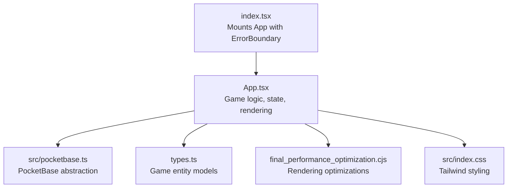
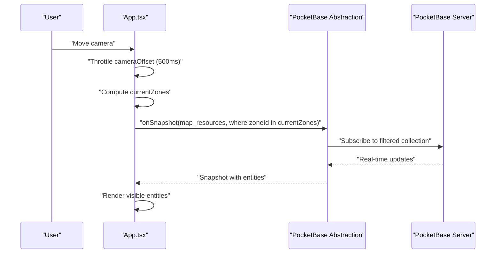
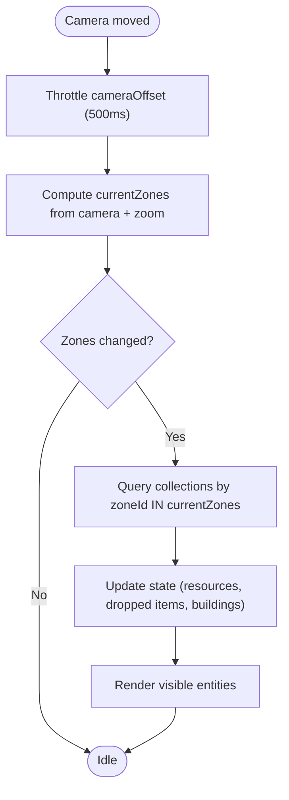
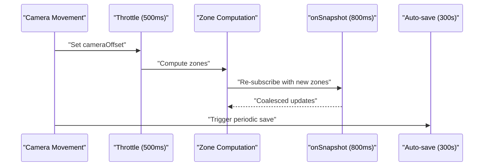
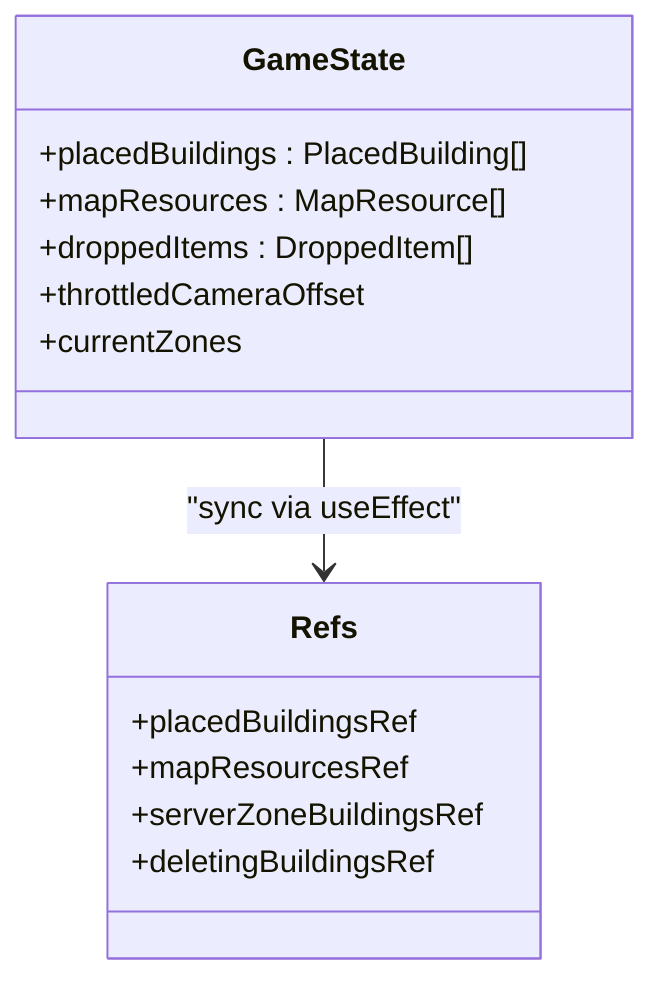
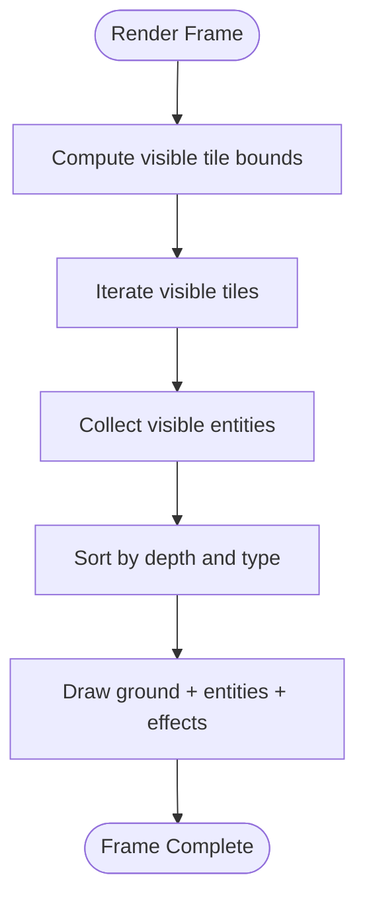
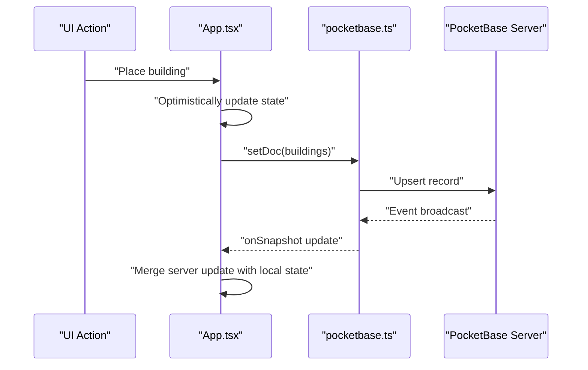
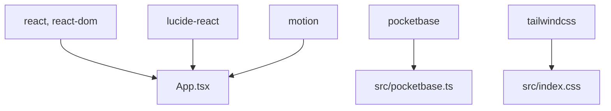

# Performance Optimization

<cite>
**Referenced Files in This Document**
- [index.tsx](file://index.tsx)
- [App.tsx](file://App.tsx)
- [pocketbase.ts](file://src/pocketbase.ts)
- [types.ts](file://types.ts)
- [final_performance_optimization.cjs](file://final_performance_optimization.cjs)
- [package.json](file://package.json)
- [index.css](file://src/index.css)
</cite>

## Table of Contents
1. [Introduction](#introduction)
2. [Project Structure](#project-structure)
3. [Core Components](#core-components)
4. [Architecture Overview](#architecture-overview)
5. [Detailed Component Analysis](#detailed-component-analysis)
6. [Dependency Analysis](#dependency-analysis)
7. [Performance Considerations](#performance-considerations)
8. [Troubleshooting Guide](#troubleshooting-guide)
9. [Conclusion](#conclusion)

## Introduction
This document presents a comprehensive guide to performance optimization for a real-time strategy game built with React and integrated with PocketBase for real-time data synchronization. It focuses on:
- Zone-based loading and spatial partitioning to manage large worlds efficiently
- Throttled operations for high-frequency updates
- Memory management for large datasets
- Rendering optimization for smooth gameplay
- Integration with PocketBase under concurrent multiplayer loads
- Profiling and monitoring techniques for sustained performance

## Project Structure
The project follows a React-based architecture with a central App component orchestrating state, rendering, and PocketBase integration. Key areas:
- Entry point mounts the app with strict mode and error boundary
- App.tsx defines constants, state, refs, and performance-critical logic
- src/pocketbase.ts abstracts PocketBase operations and real-time subscriptions
- types.ts defines game entity models
- final_performance_optimization.cjs applies targeted rendering optimizations

**Diagram sources**
- [index.tsx:1-20](file://index.tsx#L1-L20)
- [App.tsx:1-120](file://App.tsx#L1-L120)
- [pocketbase.ts:1-40](file://src/pocketbase.ts#L1-L40)
- [types.ts:1-40](file://types.ts#L1-L40)
- [final_performance_optimization.cjs:1-20](file://final_performance_optimization.cjs#L1-L20)
- [index.css:1-2](file://src/index.css#L1-L2)

**Section sources**
- [index.tsx:1-20](file://index.tsx#L1-L20)
- [App.tsx:1-120](file://App.tsx#L1-L120)
- [pocketbase.ts:1-40](file://src/pocketbase.ts#L1-L40)
- [types.ts:1-40](file://types.ts#L1-L40)
- [final_performance_optimization.cjs:1-20](file://final_performance_optimization.cjs#L1-L20)
- [index.css:1-2](file://src/index.css#L1-L2)

## Core Components
- Zone-based spatial partitioning: The world is divided into fixed-size zones (ZONE_SIZE) to limit real-time subscriptions and rendering to visible regions.
- Throttled camera updates: Camera offset changes are throttled to reduce zone recomputation and subscription churn.
- Optimized rendering pipeline: Visibility checks and sorted draw order minimize overdraw and unnecessary computations.
- PocketBase integration: Real-time subscriptions with throttling and optimistic updates improve responsiveness under concurrency.

**Section sources**
- [App.tsx:36-95](file://App.tsx#L36-L95)
- [App.tsx:570-576](file://App.tsx#L570-L576)
- [App.tsx:781-820](file://App.tsx#L781-L820)
- [App.tsx:2761-3199](file://App.tsx#L2761-L3199)

## Architecture Overview
The system integrates React rendering with PocketBase real-time updates. Zones bound the dataset fetched per frame, and throttling limits subscription storms during camera movement.

**Diagram sources**
- [App.tsx:570-576](file://App.tsx#L570-L576)
- [App.tsx:781-820](file://App.tsx#L781-L820)
- [App.tsx:822-877](file://App.tsx#L822-L877)
- [pocketbase.ts:578-707](file://src/pocketbase.ts#L578-L707)

**Section sources**
- [App.tsx:570-576](file://App.tsx#L570-L576)
- [App.tsx:781-820](file://App.tsx#L781-L820)
- [App.tsx:822-877](file://App.tsx#L822-L877)
- [pocketbase.ts:578-707](file://src/pocketbase.ts#L578-L707)

## Detailed Component Analysis

### Zone-Based Loading and Spatial Partitioning
- World constants define tile sizes, world dimensions, and zone grid:
  - WORLD_WIDTH_TILES, WORLD_HEIGHT_TILES, ZONE_SIZE, ZONES_X, ZONES_Y
  - Zone ID computed via getZoneId(x, y)
- Camera-driven zone computation:
  - Throttled cameraOffset updates zone set every 500 ms
  - Zone neighborhood expansion ensures contiguous coverage
- Subscriptions scoped to currentZones:
  - map_resources and dropped_items queries filter by zoneId
  - buildings queries combine owner-specific and zone-based filters

**Diagram sources**
- [App.tsx:570-576](file://App.tsx#L570-L576)
- [App.tsx:781-820](file://App.tsx#L781-L820)
- [App.tsx:822-877](file://App.tsx#L822-L877)
- [App.tsx:2125-2145](file://App.tsx#L2125-L2145)

**Section sources**
- [App.tsx:36-95](file://App.tsx#L36-L95)
- [App.tsx:570-576](file://App.tsx#L570-L576)
- [App.tsx:781-820](file://App.tsx#L781-L820)
- [App.tsx:822-877](file://App.tsx#L822-L877)
- [App.tsx:2125-2145](file://App.tsx#L2125-L2145)

### Throttled Operations for High-Frequency Updates
- Camera throttling:
  - 500 ms timeout to compute throttledCameraOffset and zones
- Real-time subscription throttling:
  - PocketBase onSnapshot includes a 800 ms throttle on update handler to coalesce events
- Auto-save throttling:
  - User data auto-save runs every 300 seconds to reduce write pressure

**Diagram sources**
- [App.tsx:570-576](file://App.tsx#L570-L576)
- [pocketbase.ts:678-696](file://src/pocketbase.ts#L678-L696)
- [App.tsx:1639-1645](file://App.tsx#L1639-L1645)

**Section sources**
- [App.tsx:570-576](file://App.tsx#L570-L576)
- [pocketbase.ts:678-696](file://src/pocketbase.ts#L678-L696)
- [App.tsx:1639-1645](file://App.tsx#L1639-L1645)

### Memory Management for Large Datasets
- Efficient state references:
  - useRef for placedBuildingsRef, mapResourcesRef, and other frequently accessed arrays
  - Refs synchronized via useEffect to avoid stale closures
- Controlled data growth:
  - getDocs used for infrequent bulk reads (clans, market)
  - onSnapshot used for real-time streams with zone scoping
- Cleanup and deduplication:
  - Town Hall cleanup prevents redundant structures
  - Deleting buildings tracked to avoid UI flicker

**Diagram sources**
- [App.tsx:383-399](file://App.tsx#L383-L399)
- [App.tsx:2024-2091](file://App.tsx#L2024-L2091)
- [App.tsx:2496-2542](file://App.tsx#L2496-L2542)

**Section sources**
- [App.tsx:383-399](file://App.tsx#L383-L399)
- [App.tsx:2024-2091](file://App.tsx#L2024-L2091)
- [App.tsx:2496-2542](file://App.tsx#L2496-L2542)

### Rendering Optimization for Smooth Gameplay
- Visibility culling:
  - Ground tile loop computes visible tile bounds based on canvas and zoom
  - Entity sorting filtered by approximate visibility reduces overdraw
- Draw order and batching:
  - Entities sorted by (x+y) and type to ensure correct layering
  - Images preloaded to avoid render stalls
- Visual effects:
  - Effects rendered after entities with alpha blending and shadows

**Diagram sources**
- [final_performance_optimization.cjs:28-46](file://final_performance_optimization.cjs#L28-L46)
- [final_performance_optimization.cjs:5-25](file://final_performance_optimization.cjs#L5-L25)
- [App.tsx:2761-3199](file://App.tsx#L2761-L3199)

**Section sources**
- [final_performance_optimization.cjs:1-56](file://final_performance_optimization.cjs#L1-L56)
- [App.tsx:2761-3199](file://App.tsx#L2761-L3199)

### Integration with PocketBase for Real-Time Synchronization
- Abstractions:
  - doc, collection, getDoc, getDocs, setDoc, updateDoc, deleteDoc, onSnapshot
  - Sanitization of IDs to 15-character alphanumeric
- Real-time subscriptions:
  - Safe subscribe with jitter and retries for stale client IDs
  - Update handler throttled to coalesce bursts
- Optimistic updates:
  - Local state updated immediately for actions like building placement and movement
  - Server sync reconciled with sticky interaction logic to prevent rollback

**Diagram sources**
- [pocketbase.ts:287-356](file://src/pocketbase.ts#L287-L356)
- [pocketbase.ts:578-707](file://src/pocketbase.ts#L578-L707)
- [App.tsx:1539-1555](file://App.tsx#L1539-L1555)
- [App.tsx:2093-2145](file://App.tsx#L2093-L2145)

**Section sources**
- [pocketbase.ts:1-800](file://src/pocketbase.ts#L1-L800)
- [App.tsx:1539-1555](file://App.tsx#L1539-L1555)
- [App.tsx:2093-2145](file://App.tsx#L2093-L2145)

### Common Performance Bottlenecks and Mitigations
- Coordinate calculations:
  - worldToScreen and screenToWorld used extensively; ensure minimal recomputation via memoization and throttling
- State updates:
  - Sticky interaction logic prevents rollback; ensure lastInteractionRef is cleared when server confirms local changes
- UI rendering:
  - Visibility culling and entity sorting reduce draw calls; preload images to avoid layout thrash

**Section sources**
- [App.tsx:473-487](file://App.tsx#L473-L487)
- [App.tsx:2056-2091](file://App.tsx#L2056-L2091)
- [App.tsx:2562-2630](file://App.tsx#L2562-L2630)

## Dependency Analysis
External libraries and their roles:
- react, react-dom: UI framework and renderer
- lucide-react: Icons
- pocketbase: Backend-as-a-Service with real-time subscriptions
- motion: Animations (used in UI)
- Tailwind CSS: Styling

**Diagram sources**
- [package.json:12-29](file://package.json#L12-L29)
- [index.css:1-2](file://src/index.css#L1-L2)

**Section sources**
- [package.json:12-29](file://package.json#L12-L29)
- [index.css:1-2](file://src/index.css#L1-L2)

## Performance Considerations
- Zone sizing and granularity:
  - ZONE_SIZE balances subscription volume vs. precision; tune based on average screen size and typical entity density
- Subscription coalescing:
  - 800 ms throttle in onSnapshot helps stabilize updates under bursty writes
- Rendering cadence:
  - Keep render loop efficient; avoid unnecessary re-renders by leveraging refs and memoization
- Network resilience:
  - Staggered subscriptions and retries mitigate transient connection issues
- Memory hygiene:
  - Periodic cleanup of redundant structures (e.g., duplicate Town Halls) prevents state bloat

[No sources needed since this section provides general guidance]

## Troubleshooting Guide
- Stale or missing data:
  - Verify zone subscriptions are updating by checking currentZones changes
  - Confirm getZoneId correctness and zone boundaries
- Rollback or jitter:
  - Inspect sticky interaction logic and lastInteractionRef clearing
  - Ensure optimistic updates are merged with server state properly
- Rendering artifacts:
  - Validate visibility culling and draw order; confirm entity sorting by (x+y) and type
- Network errors:
  - Review PocketBase error handling and retry logic; check sanitized IDs and collection filters

**Section sources**
- [App.tsx:2056-2091](file://App.tsx#L2056-L2091)
- [App.tsx:2761-3199](file://App.tsx#L2761-L3199)
- [pocketbase.ts:787-800](file://src/pocketbase.ts#L787-L800)

## Conclusion
The game employs a robust, layered performance strategy:
- Spatial partitioning via zones limits data scope
- Throttling controls real-time subscription churn
- Optimistic updates and sticky logic improve perceived responsiveness
- Rendering optimizations cull off-screen content and streamline draw order
- PocketBase integration is tuned for stability and throughput

Adhering to these patterns and continuously monitoring rendering and network metrics will sustain smooth performance across diverse hardware configurations.