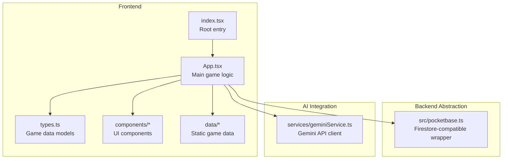
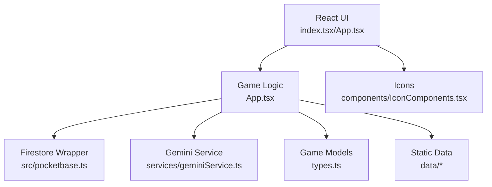
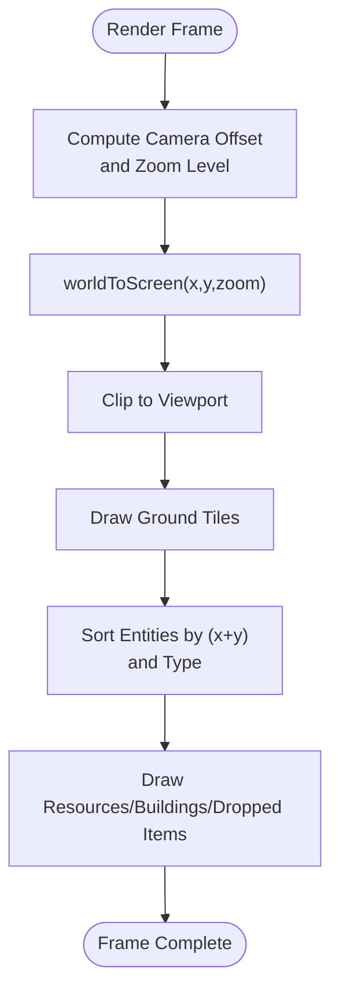
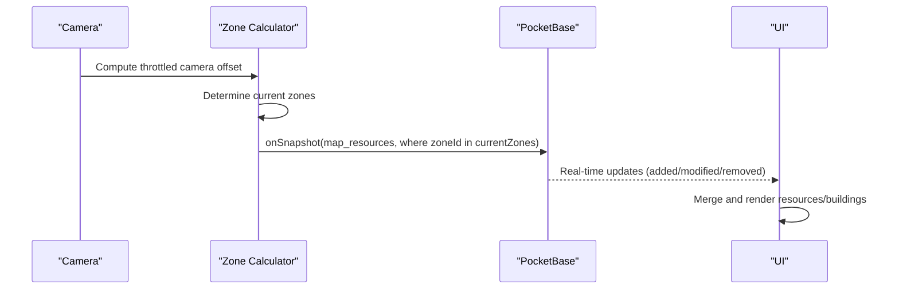
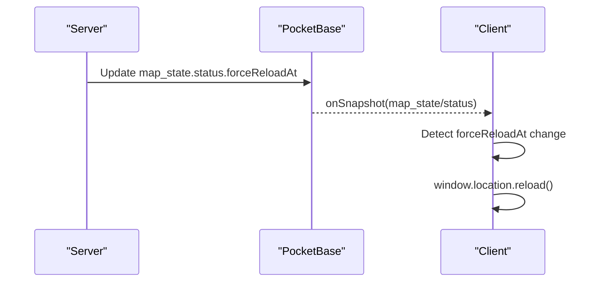
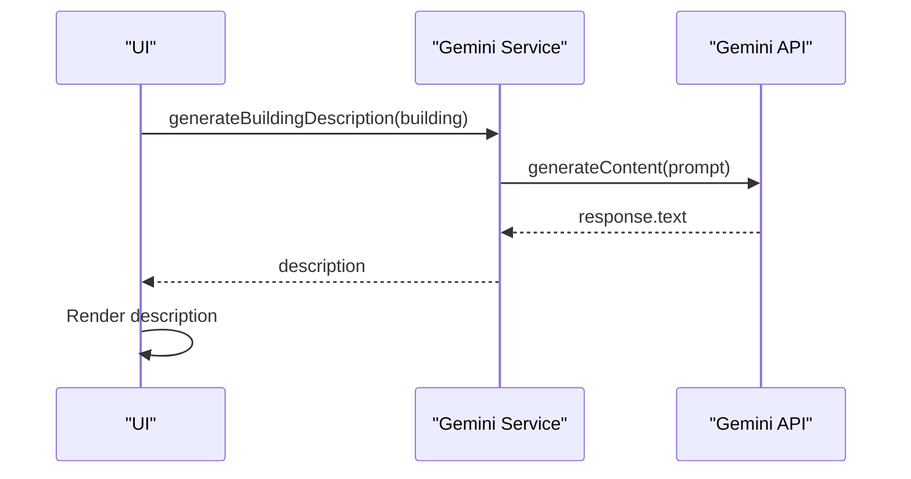
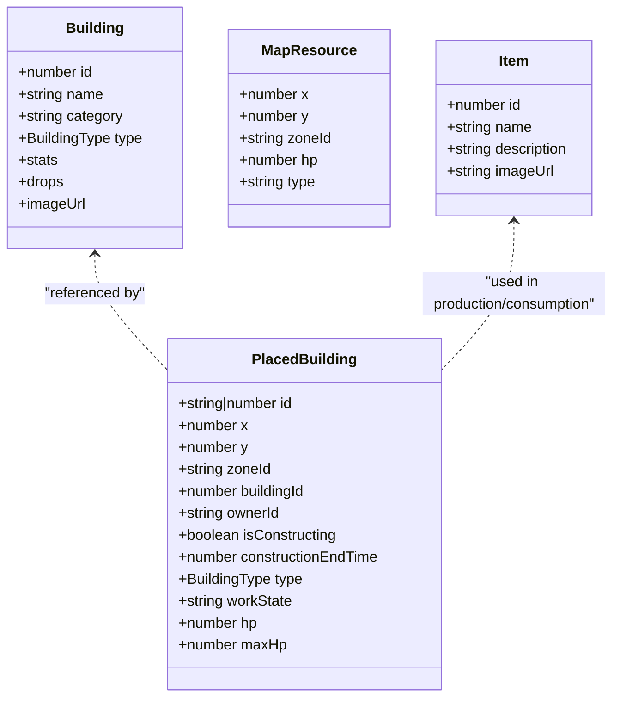
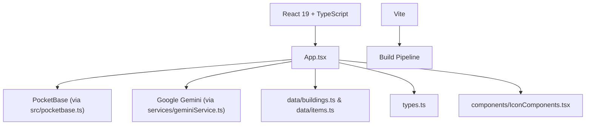

# Project Overview

<cite>
**Referenced Files in This Document**
- [README.md](file://README.md)
- [package.json](file://package.json)
- [index.tsx](file://index.tsx)
- [App.tsx](file://App.tsx)
- [types.ts](file://types.ts)
- [pocketbase.ts](file://src/pocketbase.ts)
- [geminiService.ts](file://services/geminiService.ts)
- [buildings.ts](file://data/buildings.ts)
- [items.ts](file://data/items.ts)
- [IconComponents.tsx](file://components/IconComponents.tsx)
</cite>

## Table of Contents
1. [Introduction](#introduction)
2. [Project Structure](#project-structure)
3. [Core Components](#core-components)
4. [Architecture Overview](#architecture-overview)
5. [Detailed Component Analysis](#detailed-component-analysis)
6. [Dependency Analysis](#dependency-analysis)
7. [Performance Considerations](#performance-considerations)
8. [Troubleshooting Guide](#troubleshooting-guide)
9. [Conclusion](#conclusion)

## Introduction
This project is a browser-based MMORPG with real-time strategy gameplay and persistent world state synchronization. Players explore a 200x200 isometric world, manage resources, construct buildings, and interact socially in real time. The game emphasizes persistent state across sessions, with world events and player actions synchronized through a backend database. It integrates AI assistance via Google Gemini to enhance storytelling and world immersion.

Key goals:
- Provide a seamless, real-time MMORPG experience in the browser
- Persist world state and synchronize it across players
- Offer strategic depth through resource management, building placement, and combat mechanics
- Deliver social features such as chat, clans, and trading
- Demonstrate modern web technologies for scalable, real-time gameplay

## Project Structure
The project follows a React 19 + TypeScript frontend with a Vite build pipeline. The backend abstraction layer maps PocketBase APIs to a Firestore-like interface for familiar real-time subscriptions and document operations. AI integration is provided through Google Gemini for dynamic content generation.

**Diagram sources**
- [index.tsx:1-20](file://index.tsx#L1-L20)
- [App.tsx:1-120](file://App.tsx#L1-L120)
- [types.ts:1-197](file://types.ts#L1-L197)
- [pocketbase.ts:1-120](file://src/pocketbase.ts#L1-L120)
- [geminiService.ts:1-43](file://services/geminiService.ts#L1-L43)

**Section sources**
- [README.md:1-21](file://README.md#L1-L21)
- [package.json:1-31](file://package.json#L1-L31)
- [index.tsx:1-20](file://index.tsx#L1-L20)

## Core Components
- Game engine and rendering: Isometric canvas rendering, tile-to-screen conversions, and layered drawing order for resources, buildings, and dropped items.
- Zone-based data partitioning: The world is divided into 5x5 zones (each 40x40 tiles) to optimize real-time subscriptions and reduce bandwidth.
- Real-time synchronization: Subscriptions to map resources, dropped items, and buildings using a Firestore-compatible abstraction over PocketBase.
- Persistent world state: World generation, resource spawning, and global reload signaling ensure consistent state across clients.
- Social and economic systems: Chat, clans, market listings, and inventory management.
- AI-assisted storytelling: Dynamic building descriptions generated with Google Gemini.

**Section sources**
- [App.tsx:36-120](file://App.tsx#L36-L120)
- [App.tsx:800-820](file://App.tsx#L800-L820)
- [App.tsx:822-953](file://App.tsx#L822-L953)
- [types.ts:111-147](file://types.ts#L111-L147)
- [pocketbase.ts:578-707](file://src/pocketbase.ts#L578-L707)

## Architecture Overview
The game uses a layered architecture:
- UI layer built with React 19 and TypeScript
- Game logic and rendering in App.tsx
- Data access through a Firestore-compatible wrapper around PocketBase
- AI integration via Google Gemini service
- Static game data loaded from data/* files

**Diagram sources**
- [index.tsx:1-20](file://index.tsx#L1-L20)
- [App.tsx:1-120](file://App.tsx#L1-L120)
- [pocketbase.ts:1-120](file://src/pocketbase.ts#L1-L120)
- [geminiService.ts:1-43](file://services/geminiService.ts#L1-L43)
- [types.ts:1-197](file://types.ts#L1-L197)
- [buildings.ts:1-120](file://data/buildings.ts#L1-L120)
- [items.ts:1-120](file://data/items.ts#L1-L120)
- [IconComponents.tsx:1-187](file://components/IconComponents.tsx#L1-L187)

## Detailed Component Analysis

### Isometric Rendering and Canvas Drawing
The game renders an isometric grid using a canvas. Tile-to-screen transformations convert world coordinates to screen positions, and entities are drawn in sorted order to ensure correct layering.

**Diagram sources**
- [App.tsx:473-487](file://App.tsx#L473-L487)
- [App.tsx:2813-2826](file://App.tsx#L2813-L2826)

**Section sources**
- [App.tsx:473-487](file://App.tsx#L473-L487)
- [App.tsx:2813-2826](file://App.tsx#L2813-L2826)

### Zone-Based Data Partitioning and Real-Time Subscriptions
The world is partitioned into 5x5 zones (each 40x40 tiles). The camera position determines which zones are currently subscribed to, minimizing data transfer and improving responsiveness.

**Diagram sources**
- [App.tsx:570-576](file://App.tsx#L570-L576)
- [App.tsx:800-820](file://App.tsx#L800-L820)
- [App.tsx:822-877](file://App.tsx#L822-L877)
- [pocketbase.ts:578-707](file://src/pocketbase.ts#L578-L707)

**Section sources**
- [App.tsx:800-820](file://App.tsx#L800-L820)
- [App.tsx:822-877](file://App.tsx#L822-L877)
- [pocketbase.ts:578-707](file://src/pocketbase.ts#L578-L707)

### Persistent World State and Global Reload
The game ensures consistent world state across clients using a global reload mechanism. When the server signals a reload, clients refresh to synchronize with the latest world state.

**Diagram sources**
- [App.tsx:719-747](file://App.tsx#L719-L747)

**Section sources**
- [App.tsx:719-747](file://App.tsx#L719-L747)

### AI-Assisted Content Generation
Google Gemini is used to generate dynamic building descriptions, enhancing storytelling and world immersion.

**Diagram sources**
- [geminiService.ts:12-43](file://services/geminiService.ts#L12-L43)
- [BuildingDetail.tsx:50-56](file://components/BuildingDetail.tsx#L50-L56)

**Section sources**
- [geminiService.ts:12-43](file://services/geminiService.ts#L12-L43)
- [BuildingDetail.tsx:50-56](file://components/BuildingDetail.tsx#L50-L56)

### Data Models: PlacedBuilding, MapResource, and Game Entities
Core data structures define the game world and entities.

**Diagram sources**
- [types.ts:42-96](file://types.ts#L42-L96)
- [types.ts:111-117](file://types.ts#L111-L117)
- [types.ts:119-147](file://types.ts#L119-L147)
- [types.ts:10-23](file://types.ts#L10-L23)

**Section sources**
- [types.ts:42-96](file://types.ts#L42-L96)
- [types.ts:111-117](file://types.ts#L111-L117)
- [types.ts:119-147](file://types.ts#L119-L147)
- [types.ts:10-23](file://types.ts#L10-L23)

### Practical Examples: Real-Time Capabilities and Social Features
- Real-time building placement and movement: Players can place or move buildings; the UI optimistically updates and synchronizes with the backend.
- Resource harvesting: Players can harvest trees and other resources; energy costs and glory rewards are tracked.
- Chat and social interactions: Players can chat, share locations, and manage friends and private messages.
- Market and economy: Players can buy and sell items, with listings persisted in the database.

These features rely on real-time subscriptions and optimistic UI updates to provide immediate feedback while maintaining eventual consistency.

**Section sources**
- [App.tsx:1040-1067](file://App.tsx#L1040-L1067)
- [App.tsx:1170-1200](file://App.tsx#L1170-L1200)
- [App.tsx:355-381](file://App.tsx#L355-L381)
- [App.tsx:337-348](file://App.tsx#L337-L348)

## Dependency Analysis
The project leverages a clear separation of concerns:
- React 19 and TypeScript for the UI and type safety
- Vite for fast builds and hot module replacement
- PocketBase as the backend with a Firestore-compatible abstraction
- Google Gemini for AI-assisted content generation
- Static data files for buildings and items

**Diagram sources**
- [package.json:12-29](file://package.json#L12-L29)
- [pocketbase.ts:1-120](file://src/pocketbase.ts#L1-L120)
- [geminiService.ts:1-43](file://services/geminiService.ts#L1-L43)
- [buildings.ts:1-120](file://data/buildings.ts#L1-L120)
- [items.ts:1-120](file://data/items.ts#L1-L120)
- [types.ts:1-197](file://types.ts#L1-L197)
- [IconComponents.tsx:1-187](file://components/IconComponents.tsx#L1-L187)

**Section sources**
- [package.json:12-29](file://package.json#L12-L29)

## Performance Considerations
- Zone-based loading reduces the number of live subscriptions and minimizes data transfer.
- Throttled camera updates prevent excessive re-subscriptions.
- Optimistic UI updates improve perceived performance; conflicts are resolved via sticky interaction logic.
- Sorting entities by (x+y) and type ensures correct rendering order without expensive z-index calculations.
- Visible tile range optimization limits rendering to the canvas bounds.

[No sources needed since this section provides general guidance]

## Troubleshooting Guide
Common issues and resolutions:
- Permission errors: The Firestore error handler logs detailed validation errors and suggests checking PocketBase API rules for the affected collection.
- Stale client ID errors: The real-time subscription layer retries with jitter to recover from stale client IDs.
- Network failures: The Firestore wrapper catches and logs errors during CRUD operations, preventing app crashes while allowing manual recovery.

**Section sources**
- [pocketbase.ts:787-816](file://src/pocketbase.ts#L787-L816)
- [pocketbase.ts:587-621](file://src/pocketbase.ts#L587-L621)

## Conclusion
This MMORPG prototype demonstrates a robust architecture for real-time strategy gameplay in the browser. By combining isometric rendering, zone-based data partitioning, and real-time synchronization, it delivers a responsive and persistent world experience. The integration of AI-assisted content generation enhances storytelling, while the modular design supports future expansion. The project serves as a solid foundation for building scalable, real-time multiplayer experiences with modern web technologies.