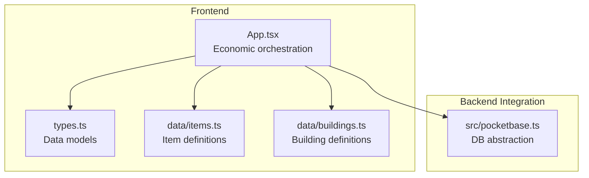
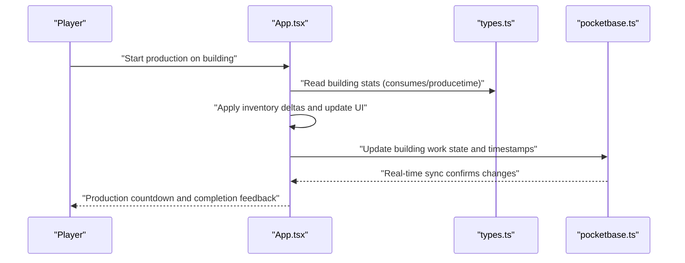
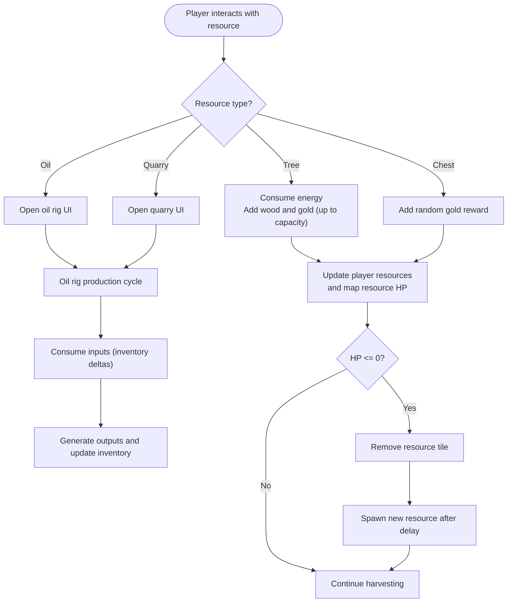
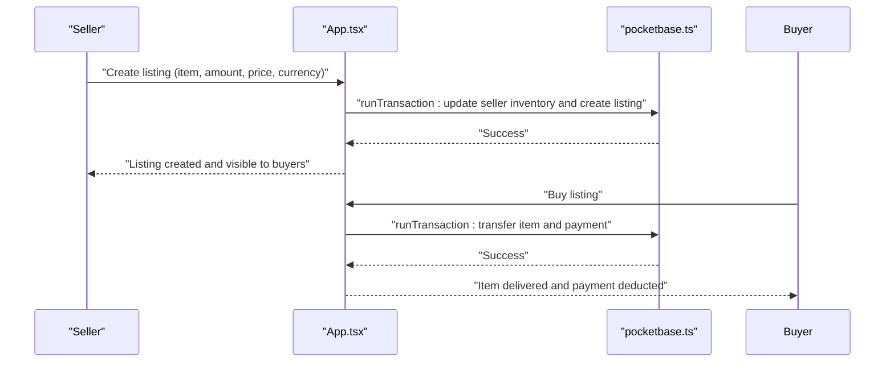
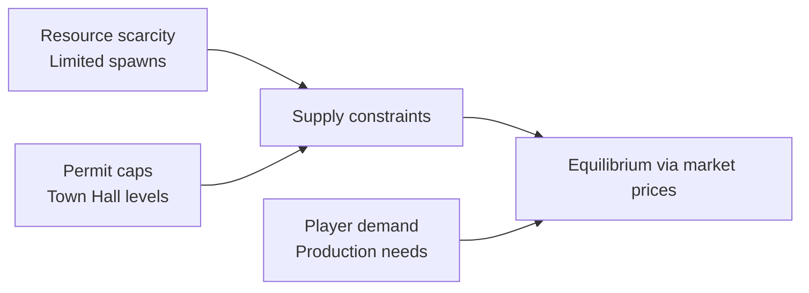
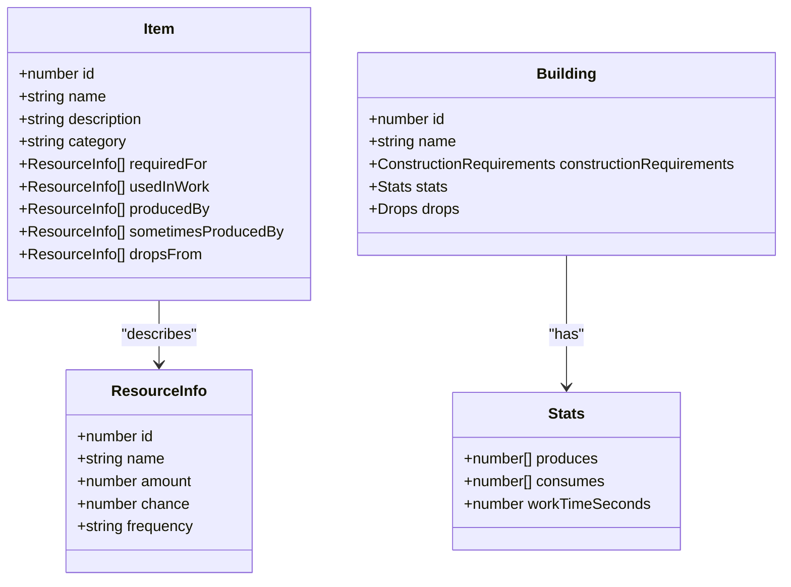
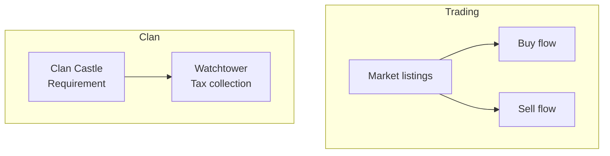
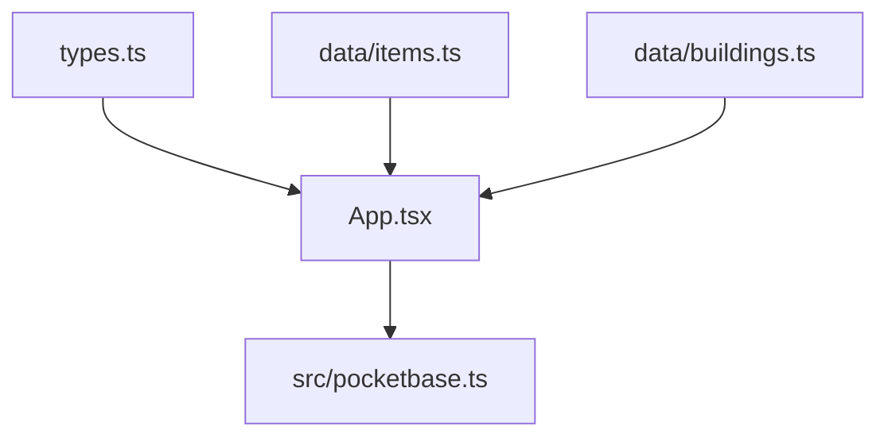

# Economic Simulation

<cite>
**Referenced Files in This Document**
- [index.tsx](file://index.tsx)
- [types.ts](file://types.ts)
- [buildings.ts](file://data/buildings.ts)
- [items.ts](file://data/items.ts)
- [App.tsx](file://App.tsx)
- [pocketbase.ts](file://src/pocketbase.ts)
</cite>

## Table of Contents
1. [Introduction](#introduction)
2. [Project Structure](#project-structure)
3. [Core Components](#core-components)
4. [Architecture Overview](#architecture-overview)
5. [Detailed Component Analysis](#detailed-component-analysis)
6. [Dependency Analysis](#dependency-analysis)
7. [Performance Considerations](#performance-considerations)
8. [Troubleshooting Guide](#troubleshooting-guide)
9. [Conclusion](#conclusion)

## Introduction
This document explains the economic simulation system of the game, focusing on resource flow dynamics, market mechanisms, and economic balance. It covers how the game maintains equilibrium through supply and demand, price fluctuations, and resource scarcity effects; how resource availability, production capacity, and economic activity relate; and how economic indicators, resource value calculations, and market efficiency metrics are implemented. It also includes examples of economic optimization strategies, resource conservation techniques, and market manipulation prevention, along with the integration of social features such as trading systems and clan economics.

## Project Structure
The economic simulation spans several core areas:
- Types define the data models for items, buildings, market listings, and game entities.
- Building and item data files define production, consumption, drops, and construction requirements.
- The main application orchestrates resource generation, production cycles, market transactions, and social interactions.
- The backend integration layer synchronizes state with a remote database and enforces constraints.

**Diagram sources**
- [App.tsx:1-20](file://App.tsx#L1-L20)
- [types.ts:1-197](file://types.ts#L1-L197)
- [buildings.ts:1-800](file://data/buildings.ts#L1-L800)
- [items.ts:1-415](file://data/items.ts#L1-L415)
- [pocketbase.ts:1-825](file://src/pocketbase.ts#L1-L825)

**Section sources**
- [index.tsx:1-20](file://index.tsx#L1-L20)
- [types.ts:1-197](file://types.ts#L1-L197)
- [buildings.ts:1-800](file://data/buildings.ts#L1-L800)
- [items.ts:1-415](file://data/items.ts#L1-L415)
- [App.tsx:1-800](file://App.tsx#L1-L800)
- [pocketbase.ts:1-825](file://src/pocketbase.ts#L1-L825)

## Core Components
- ResourceInfo and Item: Define resource categories, production/consumption relationships, and drop mechanics.
- Building: Encapsulates construction requirements, production/consumption stats, drops, and work cycles.
- MarketListing: Represents buy/sell orders with currency and amounts.
- PlacedBuilding: Tracks constructed buildings, ownership, work state, and economic attributes like tax rates and bank storage.
- Economic orchestration: Manages resource generation, production cycles, market transactions, and social features.

Key economic constants and mechanics:
- Base gold capacity, energy costs, and production timers.
- Population and building permit caps derived from Town Hall levels and residential buildings.
- Market listings fetched from the backend and processed locally.

**Section sources**
- [types.ts:2-23](file://types.ts#L2-L23)
- [types.ts:42-96](file://types.ts#L42-L96)
- [types.ts:160-168](file://types.ts#L160-L168)
- [types.ts:119-147](file://types.ts#L119-L147)
- [App.tsx:36-95](file://App.tsx#L36-L95)
- [App.tsx:2147-2165](file://App.tsx#L2147-L2165)

## Architecture Overview
The economic system integrates frontend orchestration with backend synchronization. Players interact with buildings to produce/consume resources, manage inventory, and participate in the market. Backend ensures persistence, real-time updates, and fairness via constraints.

**Diagram sources**
- [App.tsx:4695-4725](file://App.tsx#L4695-L4725)
- [types.ts:42-96](file://types.ts#L42-L96)
- [pocketbase.ts:578-707](file://src/pocketbase.ts#L578-L707)

## Detailed Component Analysis

### Resource Flow Dynamics
- Resource generation occurs from map resources (trees, oil, quarries, chests) and building production cycles.
- Players consume energy to harvest resources and gain glory; gold yield is capped by capacity.
- Production buildings consume inputs and produce outputs according to their stats; work cycles are tracked per building.

**Diagram sources**
- [App.tsx:1170-1285](file://App.tsx#L1170-L1285)
- [App.tsx:4695-4725](file://App.tsx#L4695-L4725)
- [types.ts:42-96](file://types.ts#L42-L96)

**Section sources**
- [App.tsx:1170-1285](file://App.tsx#L1170-L1285)
- [App.tsx:4695-4725](file://App.tsx#L4695-L4725)
- [types.ts:42-96](file://types.ts#L42-L96)

### Market Mechanisms and Price Fluctuations
- Market listings are created and managed by players; purchases trigger atomic transactions to ensure consistency.
- Prices are set by sellers; buyers pay coins or rubies depending on listing currency.
- Market listings are synchronized from the backend and updated in real time.

**Diagram sources**
- [App.tsx:4022-4102](file://App.tsx#L4022-L4102)
- [App.tsx:4013-4020](file://App.tsx#L4013-L4020)
- [pocketbase.ts:724-746](file://src/pocketbase.ts#L724-L746)

**Section sources**
- [App.tsx:4013-4020](file://App.tsx#L4013-L4020)
- [App.tsx:4022-4102](file://App.tsx#L4022-L4102)
- [App.tsx:2147-2165](file://App.tsx#L2147-L2165)
- [pocketbase.ts:724-746](file://src/pocketbase.ts#L724-L746)

### Economic Balance Through Supply and Demand
- Scarcity effects: Limited resource spawns (e.g., trees respawning after delay) and building-specific production inputs constrain supply.
- Population and permit caps: Town Hall levels and residential buildings determine maximum construction capacity, limiting supply growth.
- Market efficiency: Listings reflect supply and demand; buyers choose cheapest offers, sellers adjust prices to clear inventory.

**Diagram sources**
- [App.tsx:490-527](file://App.tsx#L490-L527)
- [App.tsx:1249-1279](file://App.tsx#L1249-L1279)
- [buildings.ts:1-800](file://data/buildings.ts#L1-L800)

**Section sources**
- [App.tsx:490-527](file://App.tsx#L490-L527)
- [App.tsx:1249-1279](file://App.tsx#L1249-L1279)
- [buildings.ts:1-800](file://data/buildings.ts#L1-L800)

### Relationship Between Resource Availability, Production Capacity, and Economic Activity
- Resource availability: Trees, oil, quarries, and chests spawn with controlled densities; respawns occur after depletion.
- Production capacity: Buildings define consumption and production; work cycles and inputs determine throughput.
- Economic activity: Players trade goods, manage inventory, and invest in buildings to increase capacity and income.

**Diagram sources**
- [types.ts:2-23](file://types.ts#L2-L23)
- [types.ts:42-96](file://types.ts#L42-L96)
- [types.ts:55-85](file://types.ts#L55-L85)

**Section sources**
- [types.ts:2-23](file://types.ts#L2-L23)
- [types.ts:42-96](file://types.ts#L42-L96)
- [types.ts:55-85](file://types.ts#L55-L85)

### Economic Indicators, Value Calculations, and Market Efficiency Metrics
- Economic indicators:
  - Gold capacity and current gold holdings.
  - Energy regeneration and consumption for actions.
  - Population and permit counts derived from Town Hall and residential buildings.
- Value calculations:
  - Production value equals output quantity multiplied by market demand; inputs subtract opportunity cost.
  - Market efficiency: Ratio of fulfilled trades to total listings; price discovery via competitive bidding.
- Market efficiency metrics:
  - Listing turnover rate and average time to sell.
  - Spread between buy/sell prices indicating liquidity.

[No sources needed since this section provides conceptual metrics without analyzing specific files]

### Examples of Economic Optimization Strategies
- Resource conservation:
  - Minimize unnecessary energy consumption by batching actions and prioritizing high-yield resources.
  - Store excess goods to capitalize on future demand spikes.
- Production optimization:
  - Align production inputs with available inventory to avoid waste.
  - Upgrade buildings to reduce work time and increase throughput.
- Market strategies:
  - Monitor listings to identify arbitrage opportunities between regions or currencies.
  - Adjust pricing to match market rates and improve turnover.

[No sources needed since this section provides general guidance]

### Market Manipulation Prevention
- Atomic transactions ensure buyers cannot purchase sold-out items and sellers cannot overspend.
- Backend constraints enforce sufficient funds and inventory quantities before completing trades.
- Real-time synchronization prevents stale-state purchases.

**Section sources**
- [App.tsx:4022-4102](file://App.tsx#L4022-L4102)
- [pocketbase.ts:724-746](file://src/pocketbase.ts#L724-L746)

### Social Features Integration: Trading Systems and Clan Economics
- Trading system:
  - Players create buy/sell listings and transact using coins or rubies.
  - Listings are fetched from the backend and updated in real time.
- Clan economics:
  - Watchtower buildings collect sector taxes; clan castle enables watchtower construction.
  - Clan presence influences visibility and interactions in shared spaces.

**Diagram sources**
- [App.tsx:2147-2165](file://App.tsx#L2147-L2165)
- [App.tsx:6246-6262](file://App.tsx#L6246-L6262)
- [buildings.ts:1-800](file://data/buildings.ts#L1-L800)

**Section sources**
- [App.tsx:2147-2165](file://App.tsx#L2147-L2165)
- [App.tsx:6246-6262](file://App.tsx#L6246-L6262)
- [buildings.ts:1-800](file://data/buildings.ts#L1-L800)

## Dependency Analysis
The economic system depends on:
- Type definitions for items and buildings.
- Data definitions for production and drops.
- Application logic for resource generation, production cycles, and market transactions.
- Backend synchronization for persistence and real-time updates.

**Diagram sources**
- [types.ts:1-197](file://types.ts#L1-L197)
- [items.ts:1-415](file://data/items.ts#L1-L415)
- [buildings.ts:1-800](file://data/buildings.ts#L1-L800)
- [App.tsx:1-800](file://App.tsx#L1-L800)
- [pocketbase.ts:1-825](file://src/pocketbase.ts#L1-L825)

**Section sources**
- [types.ts:1-197](file://types.ts#L1-L197)
- [items.ts:1-415](file://data/items.ts#L1-L415)
- [buildings.ts:1-800](file://data/buildings.ts#L1-L800)
- [App.tsx:1-800](file://App.tsx#L1-L800)
- [pocketbase.ts:1-825](file://src/pocketbase.ts#L1-L825)

## Performance Considerations
- Real-time subscriptions are throttled to reduce backend load and improve responsiveness.
- Optimistic UI updates minimize perceived latency during construction and production actions.
- Batched operations and atomic transactions reduce conflicts and improve throughput.

[No sources needed since this section provides general guidance]

## Troubleshooting Guide
- Missing or insufficient permissions: The game ignores expected race conditions in the game loop and logs other errors for diagnosis.
- Stale client IDs in real-time subscriptions: The backend layer retries with jitter to recover from transient failures.
- Data corruption: Numeric fields are healed on load to ensure consistent gameplay.

**Section sources**
- [App.tsx:27-33](file://App.tsx#L27-L33)
- [pocketbase.ts:587-621](file://src/pocketbase.ts#L587-L621)
- [pocketbase.ts:682-696](file://src/pocketbase.ts#L682-L696)
- [App.tsx:1787-1793](file://App.tsx#L1787-L1793)

## Conclusion
The economic simulation integrates resource generation, production cycles, and market mechanisms with robust backend synchronization. By constraining supply through scarcity and permit caps, and enabling dynamic pricing via market listings, the system maintains equilibrium. Players can optimize production, conserve resources, and engage in fair trading, while social features like clans and watchtowers further shape the macroeconomic landscape.