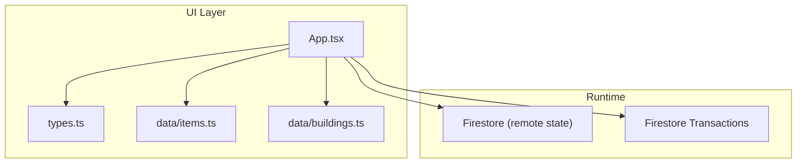
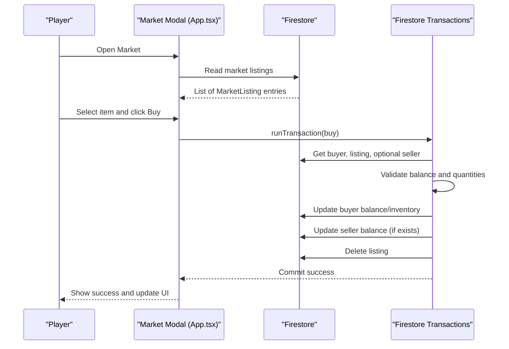
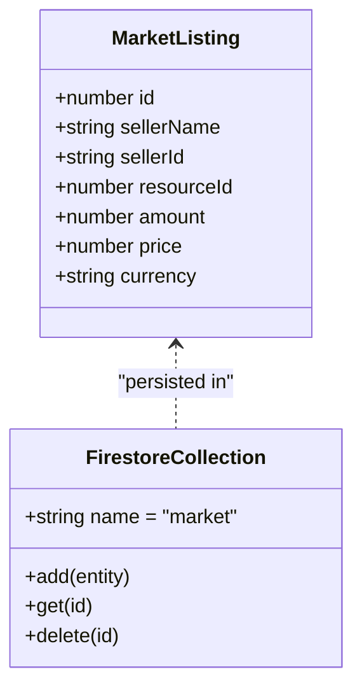
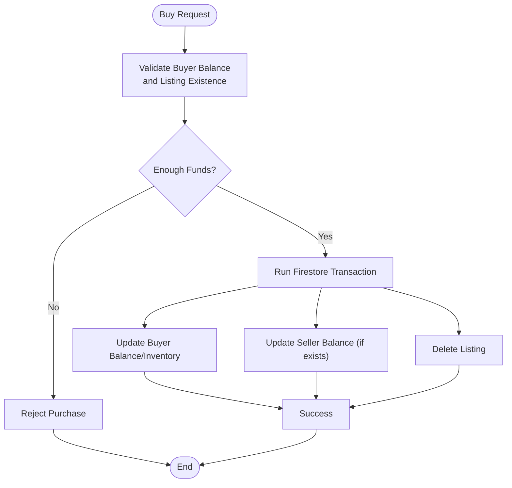
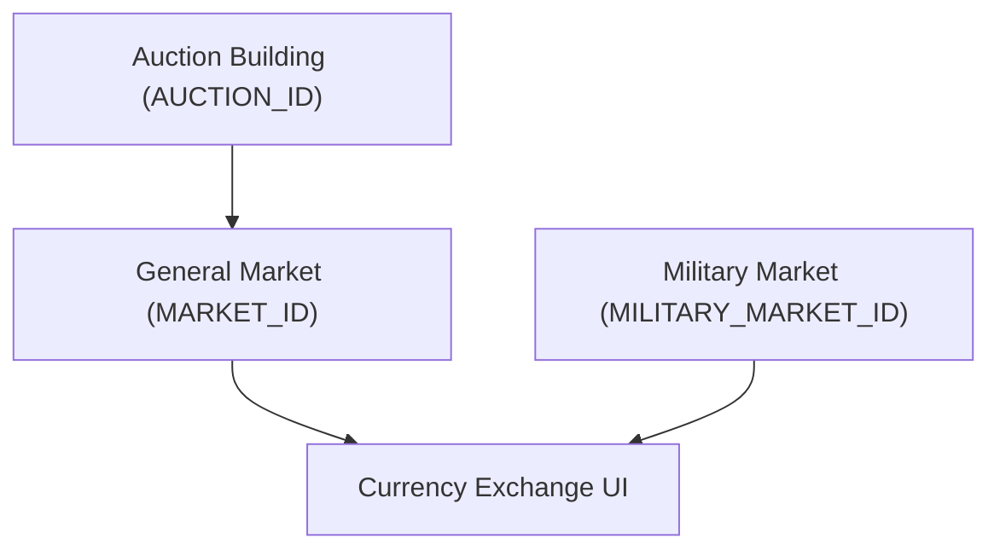
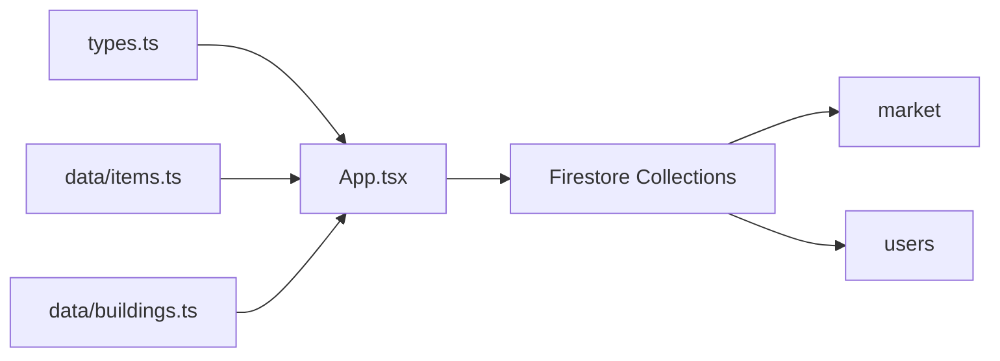

# Market Mechanics

<cite>
**Referenced Files in This Document**
- [App.tsx](file://App.tsx)
- [types.ts](file://types.ts)
- [items.ts](file://data/items.ts)
- [buildings.ts](file://data/buildings.ts)
- [index.tsx](file://index.tsx)
</cite>

## Table of Contents
1. [Introduction](#introduction)
2. [Project Structure](#project-structure)
3. [Core Components](#core-components)
4. [Architecture Overview](#architecture-overview)
5. [Detailed Component Analysis](#detailed-component-analysis)
6. [Dependency Analysis](#dependency-analysis)
7. [Performance Considerations](#performance-considerations)
8. [Troubleshooting Guide](#troubleshooting-guide)
9. [Conclusion](#conclusion)

## Introduction
This document explains the market system mechanics implemented in the game, focusing on trading algorithms, price discovery, supply-demand matching, and economic feedback loops. It covers how the market maintains equilibrium via automated price adjustments, resource allocation, and currency exchange, and how player transactions influence market liquidity and economic stability. It also documents the market infrastructure (auction systems, trading posts, currency exchange), prevention of market manipulation, price stabilization techniques, and integration with social features like clan trading and cooperative economic activities.

## Project Structure
The market system is implemented primarily in the main application component and supported by shared types and data definitions:
- Market UI and logic: [App.tsx](file://App.tsx)
- Data models and enums: [types.ts](file://types.ts)
- Item catalog: [items.ts](file://data/items.ts)
- Building definitions (including market-related buildings): [buildings.ts](file://data/buildings.ts)
- Application entry point: [index.tsx](file://index.tsx)

**Diagram sources**
- [App.tsx:1-200](file://App.tsx#L1-L200)
- [types.ts:160-168](file://types.ts#L160-L168)
- [items.ts:1-415](file://data/items.ts#L1-L415)
- [buildings.ts:1-800](file://data/buildings.ts#L1-L800)

**Section sources**
- [index.tsx:1-20](file://index.tsx#L1-L20)
- [App.tsx:1-200](file://App.tsx#L1-L200)

## Core Components
- MarketListing model: Defines the structure for buy/sell offers, including resource ID, amount, price, currency, seller identity, and listing metadata.
- Market modal: Provides tabs for buying and selling, listing management, and real-time market feed.
- Currency exchange: Supports conversion between coins and rubies with a fixed exchange rate.
- Auction building: Allows players to manage auctions and interact with marketplace listings.
- Trading posts: General market and military market buildings that enable buying/selling.

Key data structures and their roles:
- MarketListing: Central entity for all trades, persisted in Firestore under the "market" collection.
- Player resources: Track coins, rubies, and inventory items for buyers and sellers.
- Building types: Market, military market, and auction buildings integrate with the market UI.

**Section sources**
- [types.ts:160-168](file://types.ts#L160-L168)
- [App.tsx:70-110](file://App.tsx#L70-L110)
- [App.tsx:2147-2165](file://App.tsx#L2147-L2165)

## Architecture Overview
The market architecture combines a client-side UI with Firestore-backed persistence and atomic transactions for trade execution. Players interact with the market via the App component, which reads and writes to Firestore collections. The system ensures consistency using Firestore transactions for purchases and listing creation/cancellation.

**Diagram sources**
- [App.tsx:3914-4020](file://App.tsx#L3914-L4020)
- [App.tsx:2147-2165](file://App.tsx#L2147-L2165)

## Detailed Component Analysis

### Market Model and Data Flow
The MarketListing entity defines the core contract for trading:
- Fields: seller identity, resource ID, amount, price, currency choice.
- Persistence: listings stored in Firestore under the "market" collection.
- Real-time updates: UI subscribes to the market collection for live updates.

**Diagram sources**
- [types.ts:160-168](file://types.ts#L160-L168)
- [App.tsx:2147-2165](file://App.tsx#L2147-L2165)

**Section sources**
- [types.ts:160-168](file://types.ts#L160-L168)
- [App.tsx:2147-2165](file://App.tsx#L2147-L2165)

### Trading Algorithms and Price Discovery
The market operates on a simple order-book-like mechanism:
- Buyers submit buy orders (MarketListing) specifying desired resource, quantity, and price.
- Sellers submit sell orders (MarketListing) specifying resource, quantity, and asking price.
- Price discovery occurs when a buyer's bid meets or exceeds a seller's ask; the transaction executes atomically.

Key behaviors:
- Atomic execution: Purchases use Firestore transactions to ensure consistency across buyer, seller, and listing removal.
- Immediate execution: When a buyer selects a listing, the system validates funds and updates balances/inventory accordingly.
- Listing lifecycle: Sellers can create listings and cancel them; cancellations refund items/rubies atomically.

**Diagram sources**
- [App.tsx:3914-4020](file://App.tsx#L3914-L4020)

**Section sources**
- [App.tsx:3914-4020](file://App.tsx#L3914-L4020)

### Supply-Demand Matching and Equilibrium
Equilibrium emerges from:
- Dynamic pricing: Buyers set bids; sellers set asks; price converges at the intersection of supply and demand.
- Automated clearing: Listings are removed upon successful sale, preventing stale orders.
- Player-driven liquidity: Active buyers and sellers increase market depth and reduce volatility.

Mechanisms:
- Listing visibility: UI displays all active listings, enabling informed decisions.
- Quantity enforcement: Purchases consume the exact listed amount; partial fills are not supported in the current implementation.
- Currency flexibility: Listings support both coins and rubies, allowing price adjustments across currencies.

**Section sources**
- [App.tsx:6442-6650](file://App.tsx#L6442-L6650)
- [App.tsx:4021-4141](file://App.tsx#L4021-L4141)

### Market Infrastructure: Auctions, Trading Posts, and Exchange
- Auction building: Integrates with the market UI to allow auction management and participation.
- Trading posts:
  - General market: Standard buy/sell functionality.
  - Military market: Specialized market for military items.
- Currency exchange: Fixed-rate exchange between coins and rubies, with a configurable rate and exchange button.

**Diagram sources**
- [App.tsx:70-85](file://App.tsx#L70-L85)
- [App.tsx:6191-6262](file://App.tsx#L6191-L6262)
- [App.tsx:6442-6650](file://App.tsx#L6442-L6650)
- [App.tsx:4409-4415](file://App.tsx#L4409-L4415)

**Section sources**
- [App.tsx:70-85](file://App.tsx#L70-L85)
- [App.tsx:6191-6262](file://App.tsx#L6191-L6262)
- [App.tsx:4409-4415](file://App.tsx#L4409-L4415)

### Economic Feedback Loops and Stability
Feedback loops observed:
- Price adjustments: Buyers and sellers adjust prices based on recent trades and inventory needs.
- Liquidity provision: Active sellers increase market depth; active buyers reduce spreads.
- Capacity constraints: Player inventory and currency limits act as natural dampeners on rapid price swings.

Stabilization techniques:
- Fixed exchange rate: Provides predictable conversion between coins and rubies, reducing currency-driven volatility.
- Listing cancellation: Sellers can withdraw listings to adjust expectations and reduce oversupply.

**Section sources**
- [App.tsx:4409-4415](file://App.tsx#L4409-L4415)
- [App.tsx:4114-4141](file://App.tsx#L4114-L4141)

### Social Features: Clan Trading and Cooperative Activities
Integration points:
- Clan presence: The market UI integrates with online player lists and presence data, enabling social interactions around trading.
- Clan-specific chat: While not a direct market feature, clan chat supports coordination for bulk trades and cooperative economic activities.
- Reputation system: Reputation affects interactions and can indirectly influence trust in trades.

Note: Specific "clan trading" features are not explicitly implemented in the referenced code; however, the presence system and chat infrastructure support social coordination around market activities.

**Section sources**
- [App.tsx:1821-1840](file://App.tsx#L1821-L1840)
- [App.tsx:1936-1993](file://App.tsx#L1936-L1993)

## Dependency Analysis
The market system depends on:
- Shared types for MarketListing and enums for building categories.
- Firestore collections for market listings and user data.
- UI components for market modal, exchange, and building interactions.

**Diagram sources**
- [types.ts:160-168](file://types.ts#L160-L168)
- [items.ts:1-415](file://data/items.ts#L1-L415)
- [buildings.ts:1-800](file://data/buildings.ts#L1-L800)
- [App.tsx:2147-2165](file://App.tsx#L2147-L2165)

**Section sources**
- [types.ts:160-168](file://types.ts#L160-L168)
- [App.tsx:2147-2165](file://App.tsx#L2147-L2165)

## Performance Considerations
- Firestore transactions: Used for atomic purchases and cancellations to maintain consistency under concurrent access.
- Real-time subscriptions: Market listings are fetched via snapshots; initial load uses getDocs for efficiency.
- UI responsiveness: Optimistic updates (e.g., immediate UI refresh) combined with server reconciliation to minimize perceived latency.

[No sources needed since this section provides general guidance]

## Troubleshooting Guide
Common issues and resolutions:
- Insufficient funds: The purchase flow checks buyer balance before executing; ensure sufficient coins or rubies.
- Listing not found: Purchases validate listing existence; if removed or sold, the UI updates accordingly.
- Inventory capacity: Excess purchases are capped by player capacity; ensure inventory can accommodate new items.
- Exchange rate: Fixed exchange rate prevents dynamic fluctuations; verify the configured rate for expected conversions.

**Section sources**
- [App.tsx:3914-4020](file://App.tsx#L3914-L4020)
- [App.tsx:4409-4415](file://App.tsx#L4409-L4415)

## Conclusion
The market system integrates a straightforward order-driven mechanism with Firestore-backed persistence and atomic transactions to ensure reliable trade execution. Price discovery emerges from buyer and seller interactions, while supply-demand matching is enforced through immediate execution and listing lifecycle management. Currency exchange and specialized markets (general and military) provide flexible pricing and item categories. Social infrastructure supports coordination, and performance is optimized through targeted Firestore operations and optimistic UI updates.