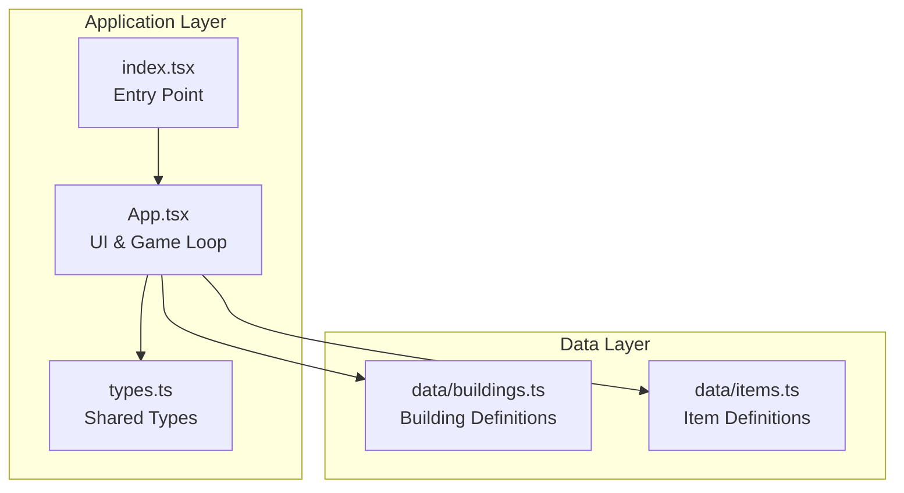
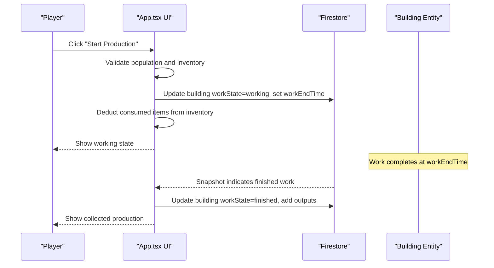
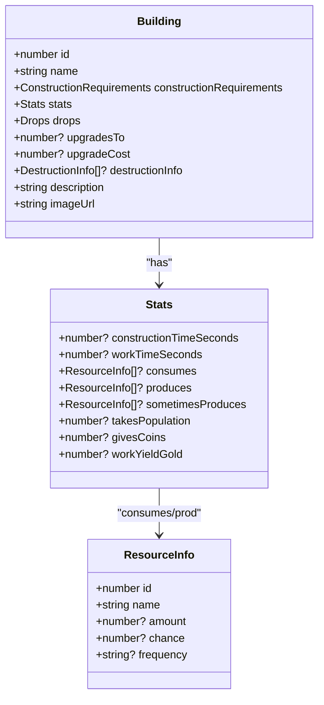
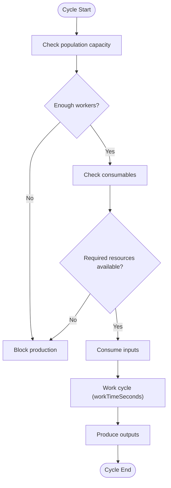
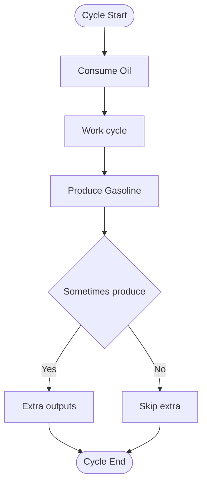
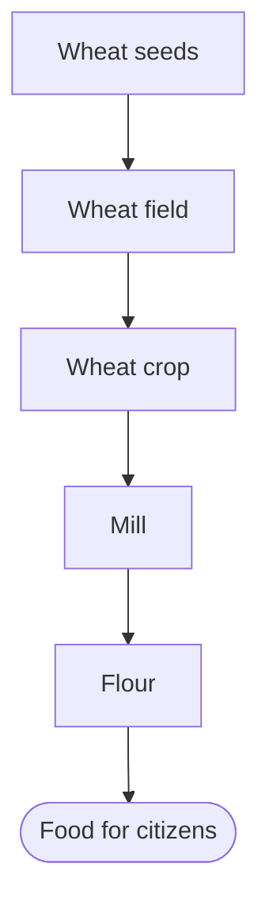
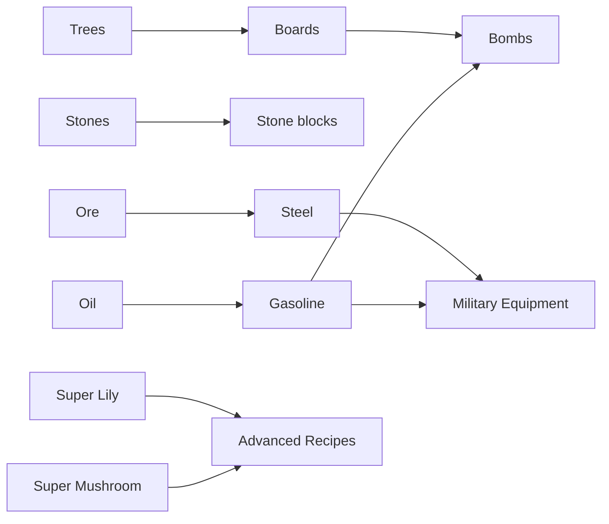

# Production Chains

<cite>
**Referenced Files in This Document**
- [App.tsx](file://App.tsx)
- [buildings.ts](file://data/buildings.ts)
- [items.ts](file://data/items.ts)
- [types.ts](file://types.ts)
- [index.tsx](file://index.tsx)
</cite>

## Table of Contents
1. [Introduction](#introduction)
2. [Project Structure](#project-structure)
3. [Core Components](#core-components)
4. [Architecture Overview](#architecture-overview)
5. [Detailed Component Analysis](#detailed-component-analysis)
6. [Dependency Analysis](#dependency-analysis)
7. [Performance Considerations](#performance-considerations)
8. [Troubleshooting Guide](#troubleshooting-guide)
9. [Conclusion](#conclusion)

## Introduction
This document explains the production chain simulation in the game, focusing on how raw materials are transformed into intermediate and final goods through various production facilities. It covers capacity calculations, bottleneck identification, efficiency optimization, interdependencies between production stages, and the impact on economic output. It also documents how building upgrades influence production rates and economic growth patterns.

## Project Structure
The production chain system spans several core files:
- Application runtime and UI logic: [App.tsx](file://App.tsx)
- Building definitions and production metadata: [buildings.ts](file://data/buildings.ts)
- Item definitions and resource relationships: [items.ts](file://data/items.ts)
- Shared type definitions: [types.ts](file://types.ts)
- Application entry point: [index.tsx](file://index.tsx)

**Diagram sources**
- [App.tsx:1-200](file://App.tsx#L1-L200)
- [buildings.ts:1-120](file://data/buildings.ts#L1-L120)
- [items.ts:1-60](file://data/items.ts#L1-L60)
- [types.ts:1-120](file://types.ts#L1-L120)
- [index.tsx:1-20](file://index.tsx#L1-L20)

**Section sources**
- [App.tsx:1-200](file://App.tsx#L1-L200)
- [buildings.ts:1-120](file://data/buildings.ts#L1-L120)
- [items.ts:1-60](file://data/items.ts#L1-L60)
- [types.ts:1-120](file://types.ts#L1-L120)
- [index.tsx:1-20](file://index.tsx#L1-L20)

## Core Components
- Building metadata: Defines production capacity, consumption/production flows, work time, and upgrade paths.
- Item metadata: Describes resource relationships, required inputs, outputs, and drop sources.
- Game loop and UI: Manages production scheduling, resource checks, and state transitions.

Key building categories involved in production chains:
- Extraction: Oil rig, quarry, mine, wild quarry
- Processing: Sawmill, stone crusher, steel mill, gold smelter, alchemical plant, mill
- Manufacturing: Firecracker factory, military factories, recommendation factory, steel rolling mill, emerald factory
- Special: Pond with lilies, mushroom beds, bomb patch

Key item categories:
- Raw materials: Tree, stone, ore, super lily, giant wheat seeds
- Intermediate goods: Boards, stone blocks, steel, gold, gasoline, recommendations
- Consumables: Firecrackers, bombs, detonators, super detonators, atomic bombs

**Section sources**
- [buildings.ts:800-1200](file://data/buildings.ts#L800-L1200)
- [buildings.ts:2100-2300](file://data/buildings.ts#L2100-L2300)
- [buildings.ts:2600-2900](file://data/buildings.ts#L2600-L2900)
- [buildings.ts:3330-3430](file://data/buildings.ts#L3330-L3430)
- [items.ts:1-200](file://data/items.ts#L1-L200)
- [types.ts:42-96](file://types.ts#L42-L96)

## Architecture Overview
Production chain architecture centers on building work cycles:
- Buildings define workTimeSeconds, consumes[], produces[], sometimesProduces[]
- Players trigger production via UI, which validates population and inventory constraints
- On successful start, buildings enter a working state until workEndTime is reached
- Upon completion, outputs are credited and inventory is updated

**Diagram sources**
- [App.tsx:4547-4670](file://App.tsx#L4547-L4670)
- [App.tsx:6078-6107](file://App.tsx#L6078-L6107)
- [types.ts:119-147](file://types.ts#L119-L147)

**Section sources**
- [App.tsx:4547-4670](file://App.tsx#L4547-L4670)
- [App.tsx:6078-6107](file://App.tsx#L6078-L6107)
- [types.ts:119-147](file://types.ts#L119-L147)

## Detailed Component Analysis

### Building Metadata Model
Buildings encapsulate production logic:
- stats.workTimeSeconds: Cycle duration
- stats.consumes[]: Required inputs per cycle
- stats.produces[]: Guaranteed outputs per cycle
- stats.sometimesProduces[]: Probabilistic outputs per cycle
- stats.takesPopulation: Labor requirement per cycle
- stats.givesCoins / stats.workYieldGold: Economic benefits

**Diagram sources**
- [types.ts:42-96](file://types.ts#L42-L96)
- [types.ts:2-8](file://types.ts#L2-L8)

**Section sources**
- [types.ts:42-96](file://types.ts#L42-L96)

### Production Chain Examples

#### Example 1: Wood to Boards (Sawmill)
- Input: Tree (consumes 5 units per cycle)
- Output: Boards (produces 4 units per cycle)
- Capacity: Determined by workTimeSeconds and labor availability
- Bottlenecks: Tree supply, population slots (takesPopulation), and sawmill upgrades

**Diagram sources**
- [buildings.ts:2100-2140](file://data/buildings.ts#L2100-L2140)
- [App.tsx:4547-4670](file://App.tsx#L4547-L4670)

**Section sources**
- [buildings.ts:2100-2140](file://data/buildings.ts#L2100-L2140)
- [App.tsx:4547-4670](file://App.tsx#L4547-L4670)

#### Example 2: Oil to Gasoline (Alchemical Plant)
- Input: Oil barrel (consumes 11 units per cycle)
- Output: Gasoline canister (produces 5 units per cycle)
- Probabilistic: Occasionally yields valuable items (ore, nugget)
- Bottlenecks: Oil supply, population slots, and plant upgrades

**Diagram sources**
- [buildings.ts:2857-2900](file://data/buildings.ts#L2857-L2900)
- [items.ts:100-120](file://data/items.ts#L100-L120)

**Section sources**
- [buildings.ts:2857-2900](file://data/buildings.ts#L2857-L2900)
- [items.ts:100-120](file://data/items.ts#L100-L120)

#### Example 3: Food Production (Wheat → Flour → Bread)
- Wheat field: Produces wheat crops
- Mill: Converts wheat seeds into flour
- Bottlenecks: Land area, population slots, and mill upgrades

**Diagram sources**
- [buildings.ts:1504-1535](file://data/buildings.ts#L1504-L1535)
- [buildings.ts:3477-3517](file://data/buildings.ts#L3477-L3517)
- [items.ts:260-270](file://data/items.ts#L260-L270)

**Section sources**
- [buildings.ts:1504-1535](file://data/buildings.ts#L1504-L1535)
- [buildings.ts:3477-3517](file://data/buildings.ts#L3477-L3517)
- [items.ts:260-270](file://data/items.ts#L260-L270)

### Interdependencies Between Stages
- Upstream extraction feeds downstream processing:
  - Trees → Boards (Sawmill)
  - Stones → Stone blocks (Stone crusher)
  - Ore → Steel (Steel mill)
  - Nuggets → Gold (Gold smelter)
- Downstream manufacturing depends on intermediate goods:
  - Boards + Gasoline → Bombs (Bomb patch)
  - Steel + Gasoline → Military equipment (Military factories)
- Special producers accelerate throughput:
  - Pond with lilies → Super lilies (used in advanced recipes)
  - Mushroom beds → Super mushrooms (used in advanced recipes)

**Section sources**
- [buildings.ts:2100-2140](file://data/buildings.ts#L2100-L2140)
- [buildings.ts:3330-3379](file://data/buildings.ts#L3330-L3379)
- [buildings.ts:3380-3425](file://data/buildings.ts#L3380-L3425)
- [buildings.ts:2620-2677](file://data/buildings.ts#L2620-L2677)
- [buildings.ts:2857-2900](file://data/buildings.ts#L2857-L2900)
- [buildings.ts:1429-1470](file://data/buildings.ts#L1429-L1470)
- [buildings.ts:2725-2855](file://data/buildings.ts#L2725-L2855)
- [buildings.ts:1570-1781](file://data/buildings.ts#L1570-L1781)

### Production Capacity Calculations
- Units per hour = 3600 / workTimeSeconds × quantityPerCycle
- Effective capacity = min(unitsPerHour_upstream, unitsPerHour_downstream)
- Population constraint: total takesPopulation across all working buildings ≤ maxPopulation
- Upgrade impact: higher-tier buildings often increase workYieldGold, givesCoins, and sometimesProduces chance

Example metrics:
- Alchemical plant: ~174 units/hour (126s cycle, 5 gasoline)
- Steel mill: ~103 units/hour (4349s cycle, 1 steel)
- Oil rig: ~120 units/hour (1096s cycle, 300 oil)
- Super lily 5: ~1800 units/hour (6s cycle, 1 super lily)

**Section sources**
- [buildings.ts:2857-2900](file://data/buildings.ts#L2857-L2900)
- [buildings.ts:3380-3425](file://data/buildings.ts#L3380-L3425)
- [buildings.ts:2605-2677](file://data/buildings.ts#L2605-L2677)
- [buildings.ts:1765-1781](file://data/buildings.ts#L1765-L1781)

### Bottleneck Identification
Common bottlenecks:
- Labor shortage: Population slots insufficient for desired production
- Input scarcity: Consumed items not available in inventory
- Low-tier facilities: Slow workTimeSeconds and low yields
- Complex recipes: Require multiple intermediate steps

Detection:
- UI validation checks population and inventory before starting production
- If insufficient, production is blocked and user is notified

**Section sources**
- [App.tsx:4547-4670](file://App.tsx#L4547-L4670)
- [App.tsx:6078-6107](file://App.tsx#L6078-L6107)

### Efficiency Optimization Strategies
- Upgrade facilities to reduce workTimeSeconds and increase outputs
- Balance production ratios to prevent inventory overflow
- Use probabilistic outputs strategically (e.g., super lilies, elite wood)
- Consolidate production lines to minimize transport and storage costs
- Monitor economic indicators (coins, gold yield) to adjust priorities

**Section sources**
- [buildings.ts:2100-2140](file://data/buildings.ts#L2100-L2140)
- [buildings.ts:2857-2900](file://data/buildings.ts#L2857-L2900)
- [buildings.ts:3380-3425](file://data/buildings.ts#L3380-L3425)

### Supply Chain Optimization
- Map dependencies: Which buildings consume outputs from others
- Identify choke points: Facilities whose capacity limits the whole chain
- Plan upgrades: Prioritize bottlenecks first, then supporting facilities
- Resource conservation: Minimize waste by aligning production schedules and storage capacities

**Section sources**
- [buildings.ts:2100-2140](file://data/buildings.ts#L2100-L2140)
- [buildings.ts:2605-2677](file://data/buildings.ts#L2605-L2677)
- [buildings.ts:2857-2900](file://data/buildings.ts#L2857-L2900)

### Relationship Between Building Upgrades, Production Rates, and Economic Growth
- Higher tiers reduce workTimeSeconds and increase workYieldGold and givesCoins
- Some upgrades enable new recipes or increase sometimesProduces chance
- Economic growth accelerates as production throughput increases and more advanced goods become available

Examples:
- Oil rig → Two oil rigs: increased production rate and coin yield
- Steel mill: upgraded variants increase steel output and occasionally rare items
- Alchemical plant: optimized conversion from oil to gasoline

**Section sources**
- [buildings.ts:2605-2677](file://data/buildings.ts#L2605-L2677)
- [buildings.ts:3380-3425](file://data/buildings.ts#L3380-L3425)
- [buildings.ts:2857-2900](file://data/buildings.ts#L2857-L2900)

## Dependency Analysis
Production chain dependencies form a directed graph:
- Extraction nodes feed processing nodes
- Processing nodes feed manufacturing nodes
- Special nodes (ponds, mushroom beds) feed specialized recipes

**Diagram sources**
- [buildings.ts:2100-2140](file://data/buildings.ts#L2100-L2140)
- [buildings.ts:3330-3379](file://data/buildings.ts#L3330-L3379)
- [buildings.ts:3380-3425](file://data/buildings.ts#L3380-L3425)
- [buildings.ts:2605-2677](file://data/buildings.ts#L2605-L2677)
- [buildings.ts:2857-2900](file://data/buildings.ts#L2857-L2900)
- [buildings.ts:1429-1470](file://data/buildings.ts#L1429-L1470)
- [buildings.ts:1765-1781](file://data/buildings.ts#L1765-L1781)

**Section sources**
- [buildings.ts:2100-2140](file://data/buildings.ts#L2100-L2140)
- [buildings.ts:3330-3379](file://data/buildings.ts#L3330-L3379)
- [buildings.ts:3380-3425](file://data/buildings.ts#L3380-L3425)
- [buildings.ts:2605-2677](file://data/buildings.ts#L2605-L2677)
- [buildings.ts:2857-2900](file://data/buildings.ts#L2857-L2900)
- [buildings.ts:1429-1470](file://data/buildings.ts#L1429-L1470)
- [buildings.ts:1765-1781](file://data/buildings.ts#L1765-L1781)

## Performance Considerations
- Minimize UI refreshes by batching Firestore updates
- Use throttled camera and zone subscriptions to reduce database load
- Optimize production scheduling to avoid idle periods
- Prefer upgrading facilities with the highest marginal returns

[No sources needed since this section provides general guidance]

## Troubleshooting Guide
Common issues and resolutions:
- Production blocked due to insufficient population: Increase residential buildings or town hall level to raise maxPopulation
- Production blocked due to missing consumables: Ensure sufficient inventory before starting production
- Unexpected delays: Verify building workTimeSeconds and upgrade levels
- Economic stagnation: Rebalance production lines and prioritize bottleneck facilities

**Section sources**
- [App.tsx:4547-4670](file://App.tsx#L4547-L4670)
- [App.tsx:6078-6107](file://App.tsx#L6078-L6107)

## Conclusion
The production chain simulation integrates building metadata, item relationships, and UI-driven workflows to model resource transformation and economic output. By understanding capacity calculations, identifying bottlenecks, and optimizing interdependencies, players can scale efficient production systems and drive sustained economic growth. Upgrades play a crucial role in accelerating throughput and unlocking advanced recipes, reinforcing the strategic depth of the simulation.