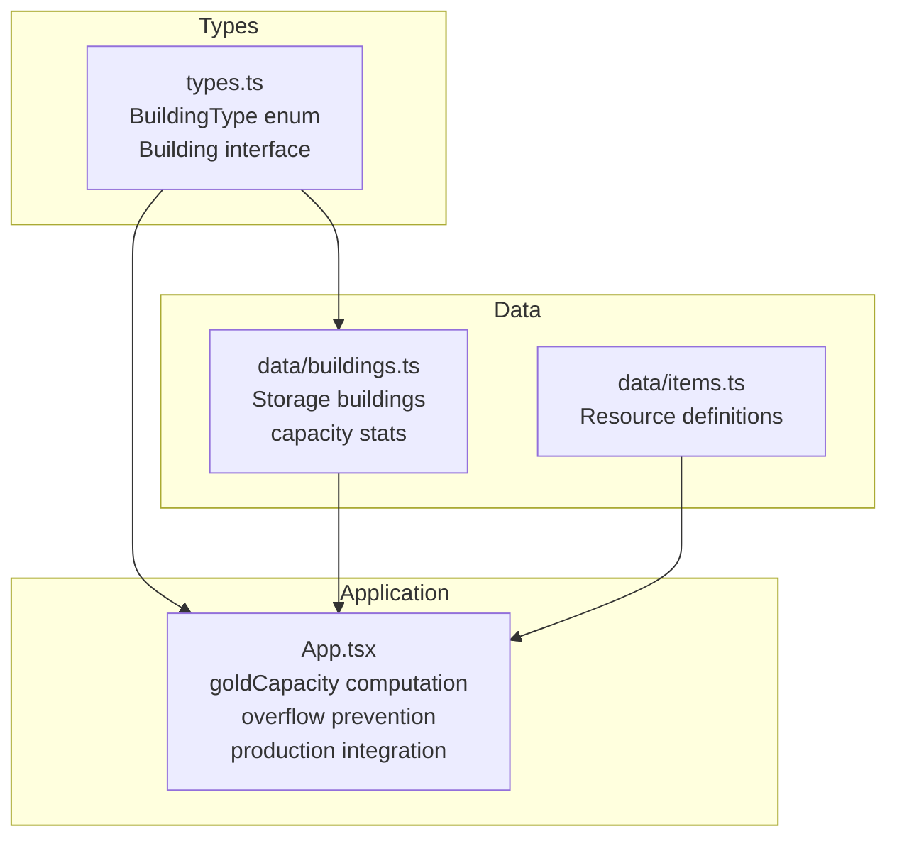
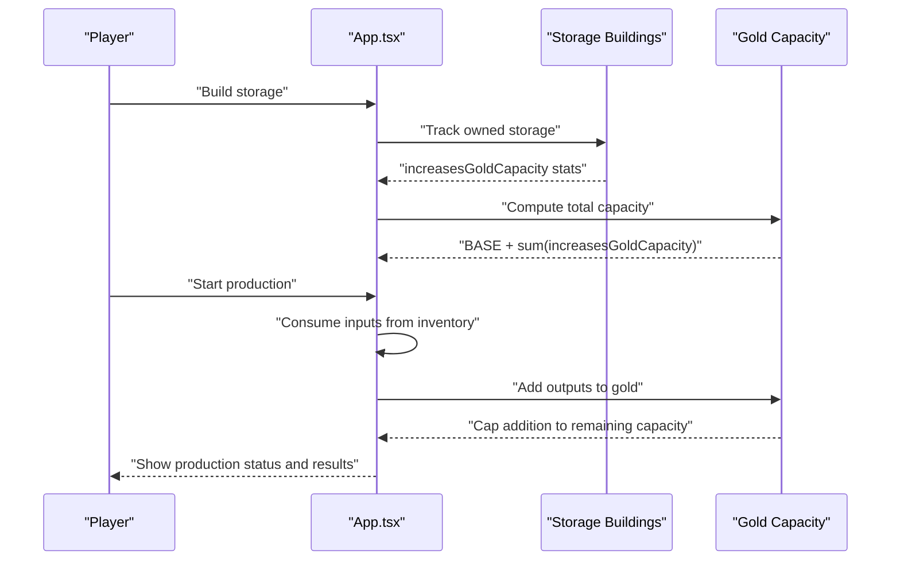
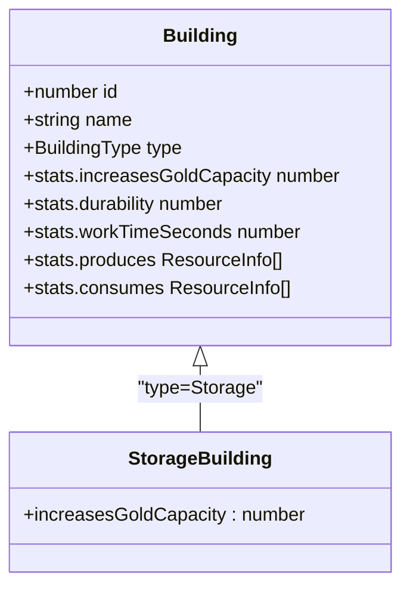
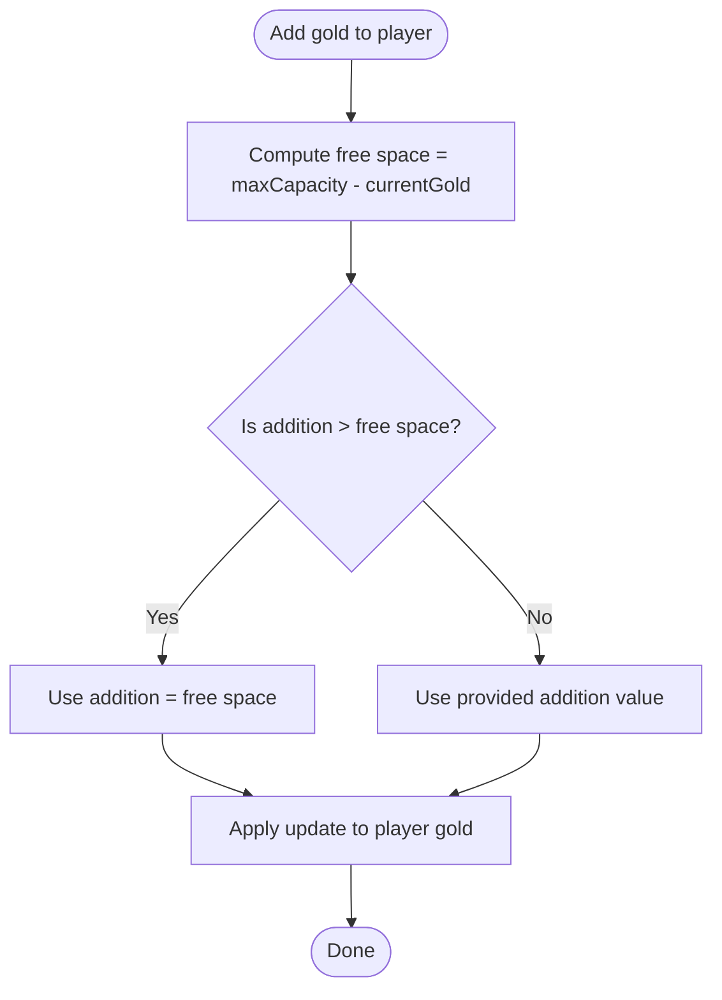
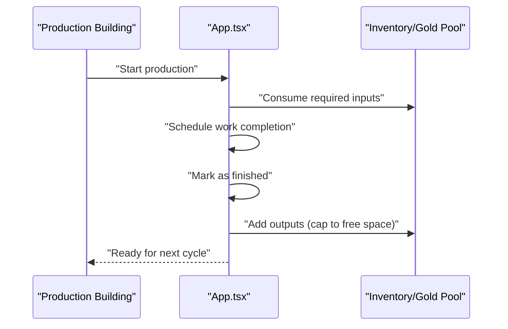
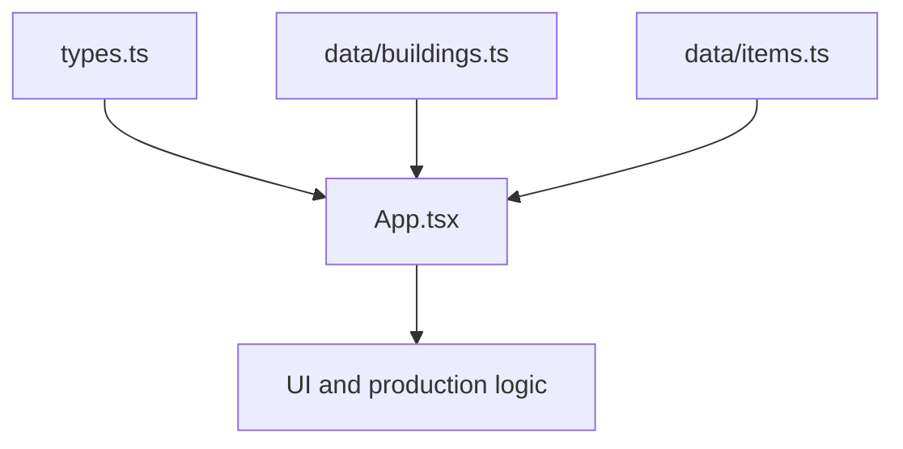

# Storage Systems

<cite>
**Referenced Files in This Document**
- [App.tsx](file://App.tsx)
- [buildings.ts](file://data/buildings.ts)
- [items.ts](file://data/items.ts)
- [types.ts](file://types.ts)
</cite>

## Table of Contents
1. [Introduction](#introduction)
2. [Project Structure](#project-structure)
3. [Core Components](#core-components)
4. [Architecture Overview](#architecture-overview)
5. [Detailed Component Analysis](#detailed-component-analysis)
6. [Dependency Analysis](#dependency-analysis)
7. [Performance Considerations](#performance-considerations)
8. [Troubleshooting Guide](#troubleshooting-guide)
9. [Conclusion](#conclusion)

## Introduction
This document explains the storage capacity management, inventory optimization, and resource accumulation systems in the game. It covers how storage buildings, warehouses, and container systems work together to manage resource flow, prevent overflow, and maintain economic sustainability. It also documents storage efficiency calculations, capacity utilization metrics, and practical optimization strategies.

## Project Structure
The storage system spans three primary areas:
- Types and interfaces define building categories and stats (including storage capacity).
- Building definitions enumerate storage structures and their capacity boosts.
- Application logic manages gold capacity, overflow prevention, and integration with production systems.

**Diagram sources**
- [types.ts:35-96](file://types.ts#L35-L96)
- [buildings.ts:2452-3237](file://data/buildings.ts#L2452-L3237)
- [App.tsx:3863-3866](file://App.tsx#L3863-L3866)

**Section sources**
- [types.ts:35-96](file://types.ts#L35-L96)
- [buildings.ts:2452-3237](file://data/buildings.ts#L2452-L3237)
- [App.tsx:3863-3866](file://App.tsx#L3863-L3866)

## Core Components
- Storage Building Type: Storage buildings are explicitly categorized and include a stat that increases the player’s gold capacity.
- Capacity Calculation: The effective gold capacity equals a base amount plus bonuses from owned storage buildings.
- Overflow Prevention: When adding gold to inventory, the system caps additions to the remaining free space in the capacity.
- Production Integration: Production buildings consume resources and yield outputs; storage capacity determines whether yields can be safely accumulated.

Key implementation references:
- Storage type definition and stats: [types.ts:35-96](file://types.ts#L35-L96)
- Storage building entries and capacity boosts: [buildings.ts:2452-3237](file://data/buildings.ts#L2452-L3237)
- Capacity computation and overflow logic: [App.tsx:3863-3866](file://App.tsx#L3863-L3866), [App.tsx:1647-1676](file://App.tsx#L1647-L1676)

**Section sources**
- [types.ts:35-96](file://types.ts#L35-L96)
- [buildings.ts:2452-3237](file://data/buildings.ts#L2452-L3237)
- [App.tsx:3863-3866](file://App.tsx#L3863-L3866)
- [App.tsx:1647-1676](file://App.tsx#L1647-L1676)

## Architecture Overview
The storage system integrates with the economy and production pipeline as follows:
- Storage buildings increase the player’s maximum gold capacity.
- Production buildings consume inputs and produce outputs; outputs are added to the player’s inventory/gold pool.
- Overflow prevention ensures that gold additions never exceed the current capacity.
- UI and logic coordinate capacity display, production start/finish, and resource consumption.

**Diagram sources**
- [App.tsx:3863-3866](file://App.tsx#L3863-L3866)
- [App.tsx:1647-1676](file://App.tsx#L1647-L1676)
- [buildings.ts:2452-3237](file://data/buildings.ts#L2452-L3237)

## Detailed Component Analysis

### Storage Buildings and Capacity Boosts
Storage buildings contribute to the player’s maximum gold capacity via a dedicated stat. Examples include:
- Basic gold storage with modest capacity boost.
- Larger warehouse-style storage with higher capacity.
- Upgradable storage tiers with increasing capacity.

These entries define:
- Category as "Хранилище" (Storage) or "Бизнес" (Business).
- Type as BuildingType.Storage.
- increasesGoldCapacity stat indicating capacity gain per building.
- Construction requirements and costs.

References:
- [buildings.ts:2452-2473](file://data/buildings.ts#L2452-L2473)
- [buildings.ts:3181-3237](file://data/buildings.ts#L3181-L3237)

**Diagram sources**
- [types.ts:42-96](file://types.ts#L42-L96)
- [buildings.ts:2452-3237](file://data/buildings.ts#L2452-L3237)

**Section sources**
- [buildings.ts:2452-2473](file://data/buildings.ts#L2452-L2473)
- [buildings.ts:3181-3237](file://data/buildings.ts#L3181-L3237)
- [types.ts:42-96](file://types.ts#L42-L96)

### Capacity Calculation and Overflow Prevention
The effective gold capacity is computed by summing:
- A base capacity constant.
- Bonuses from all owned, non-construction storage buildings.

Overflow prevention:
- When adding gold to the player’s account, the system calculates the difference between current gold and maximum capacity.
- Actual addition is capped at the remaining free space to prevent overflow.

References:
- Capacity computation: [App.tsx:3863-3866](file://App.tsx#L3863-L3866)
- Overflow logic: [App.tsx:1647-1676](file://App.tsx#L1647-L1676)

**Diagram sources**
- [App.tsx:1647-1676](file://App.tsx#L1647-L1676)

**Section sources**
- [App.tsx:3863-3866](file://App.tsx#L3863-L3866)
- [App.tsx:1647-1676](file://App.tsx#L1647-L1676)

### Integration with Production Systems
Production buildings consume inputs and produce outputs. The storage system indirectly supports production by:
- Ensuring sufficient capacity exists to accumulate outputs.
- Preventing overflow during production cycles.

Key integration points:
- Production start validates population and resource availability.
- Production finish triggers output accumulation with overflow checks.
- Storage buildings increase capacity to accommodate larger production runs.

References:
- Production start/validation: [App.tsx:4547-4570](file://App.tsx#L4547-L4570), [App.tsx:4672-4725](file://App.tsx#L4672-L4725)
- Production finish and output accumulation: [App.tsx:4660-4670](file://App.tsx#L4660-L4670)
- Storage capacity impact: [App.tsx:3863-3866](file://App.tsx#L3863-L3866)

**Diagram sources**
- [App.tsx:4547-4570](file://App.tsx#L4547-L4570)
- [App.tsx:4660-4670](file://App.tsx#L4660-L4670)
- [App.tsx:3863-3866](file://App.tsx#L3863-L3866)

**Section sources**
- [App.tsx:4547-4570](file://App.tsx#L4547-L4570)
- [App.tsx:4660-4670](file://App.tsx#L4660-L4670)
- [App.tsx:3863-3866](file://App.tsx#L3863-L3866)

### Storage Efficiency and Utilization Metrics
Efficiency metrics derived from the codebase:
- Capacity utilization ratio = currentGold / maxCapacity
- Free capacity = maxCapacity - currentGold
- Effective capacity growth rate = sum(increasesGoldCapacity from owned storage)

Operational implications:
- Higher utilization ratios indicate efficient storage use; low ratios suggest underutilized capacity or insufficient storage.
- Free capacity directly impacts production throughput; insufficient capacity can bottleneck output accumulation.

References:
- Capacity computation: [App.tsx:3863-3866](file://App.tsx#L3863-L3866)

**Section sources**
- [App.tsx:3863-3866](file://App.tsx#L3863-L3866)

### Optimization Strategies
Practical strategies supported by the codebase:
- Storage stacking: Place multiple storage buildings to maximize capacity.
- Production-to-storage alignment: Match production output volumes to available free capacity to avoid overflow.
- Resource rotation: Use production systems to convert raw materials into tradable goods, then store excess to prevent overflow.

References:
- Storage capacity boosting: [buildings.ts:2452-3237](file://data/buildings.ts#L2452-L3237)
- Overflow prevention: [App.tsx:1647-1676](file://App.tsx#L1647-L1676)

**Section sources**
- [buildings.ts:2452-3237](file://data/buildings.ts#L2452-L3237)
- [App.tsx:1647-1676](file://App.tsx#L1647-L1676)

## Dependency Analysis
The storage system depends on:
- Building definitions specifying storage capacity boosts.
- Type definitions enabling categorization of storage buildings.
- Application logic computing capacity and enforcing overflow limits.

**Diagram sources**
- [types.ts:35-96](file://types.ts#L35-L96)
- [buildings.ts:2452-3237](file://data/buildings.ts#L2452-L3237)
- [App.tsx:3863-3866](file://App.tsx#L3863-L3866)

**Section sources**
- [types.ts:35-96](file://types.ts#L35-L96)
- [buildings.ts:2452-3237](file://data/buildings.ts#L2452-L3237)
- [App.tsx:3863-3866](file://App.tsx#L3863-L3866)

## Performance Considerations
- Capacity recalculation occurs when storage buildings change; this is efficient because it scans only owned storage buildings.
- Overflow checks are constant-time operations performed during resource updates.
- Production scheduling and completion checks run on intervals; ensure intervals are tuned to balance responsiveness and performance.

## Troubleshooting Guide
Common issues and resolutions:
- Overflow prevention: If gold additions appear truncated, verify that free capacity is sufficient; consider upgrading storage buildings.
- Production bottlenecks: If production finishes but outputs do not accumulate, confirm that free capacity is available and that the production cycle completes successfully.
- Storage visibility: Verify that storage buildings are owned and not under construction; only active storage contributes to capacity.

References:
- Overflow logic: [App.tsx:1647-1676](file://App.tsx#L1647-L1676)
- Production finish handling: [App.tsx:4850-4868](file://App.tsx#L4850-L4868)

**Section sources**
- [App.tsx:1647-1676](file://App.tsx#L1647-L1676)
- [App.tsx:4850-4868](file://App.tsx#L4850-L4868)

## Conclusion
The storage system integrates storage buildings, capacity computation, and overflow prevention to ensure sustainable economic growth. By aligning production output with storage capacity and employing strategic storage stacking, players can optimize throughput, minimize waste, and maintain efficient resource accumulation. The modular design allows for straightforward scaling and future enhancements.