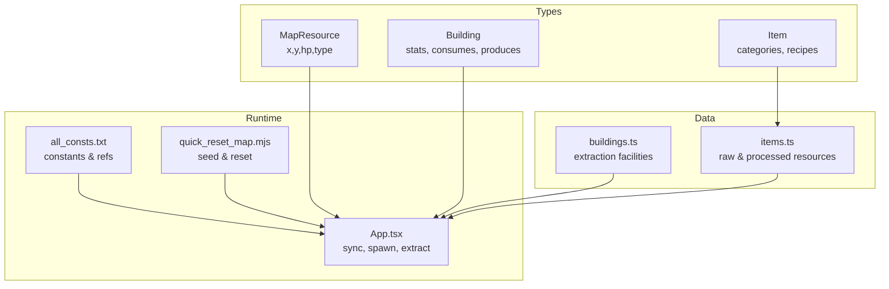
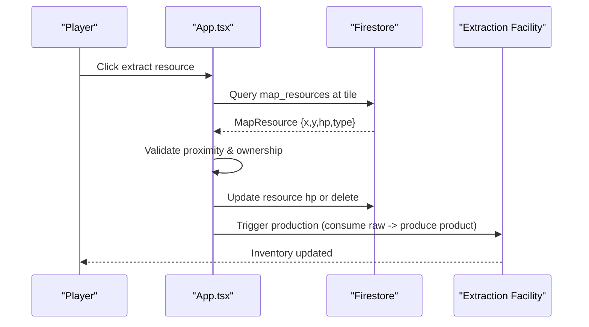
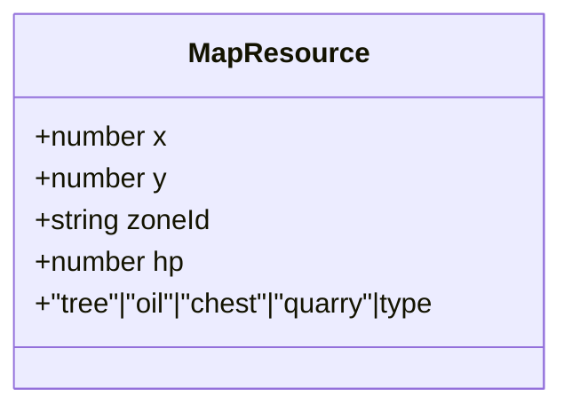
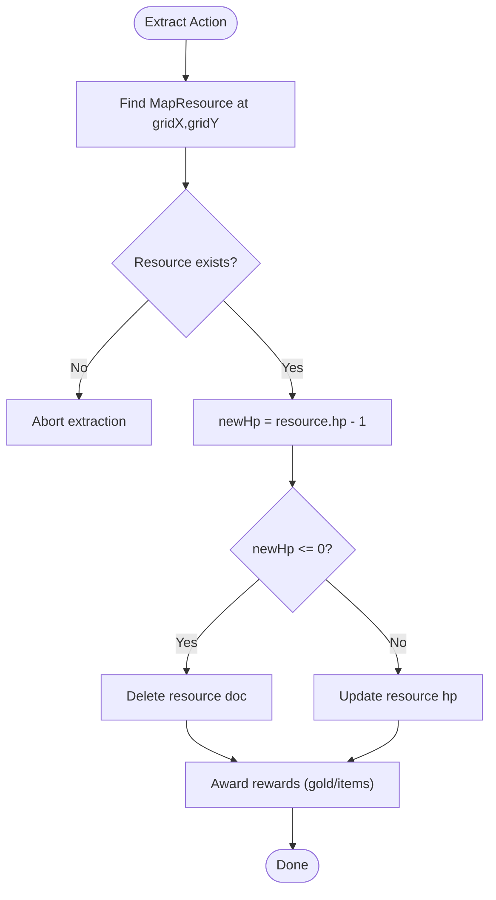
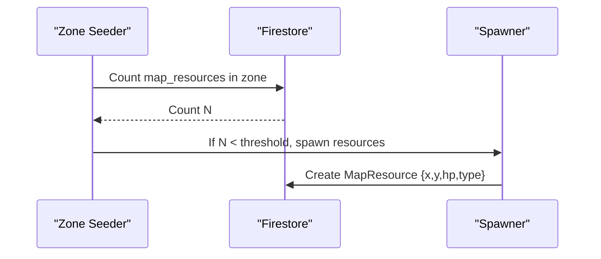
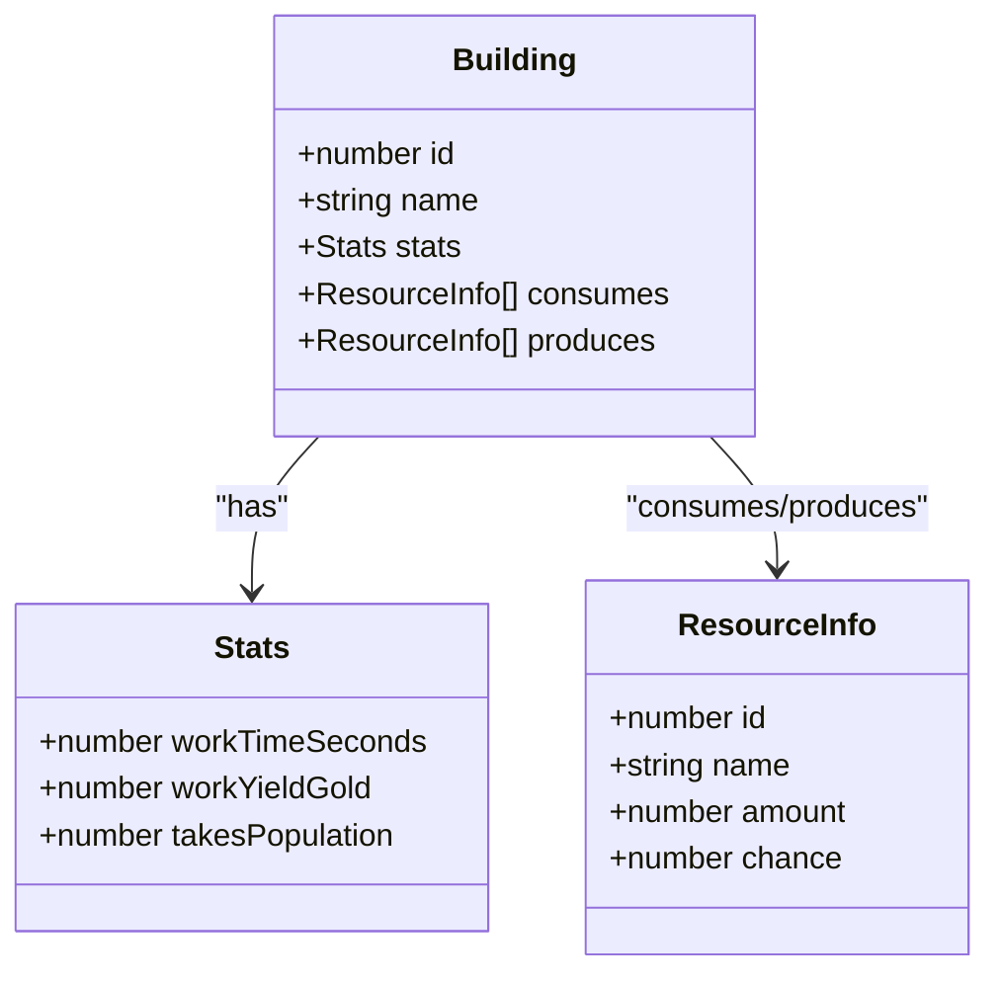
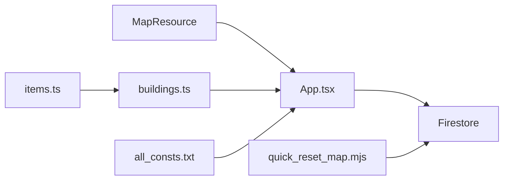

# Extraction Mechanics

<cite>
**Referenced Files in This Document**
- [types.ts](file://types.ts)
- [buildings.ts](file://data/buildings.ts)
- [items.ts](file://data/items.ts)
- [App.tsx](file://App.tsx)
- [all_consts.txt](file://all_consts.txt)
- [quick_reset_map.mjs](file://quick_reset_map.mjs)
</cite>

## Table of Contents
1. [Introduction](#introduction)
2. [Project Structure](#project-structure)
3. [Core Components](#core-components)
4. [Architecture Overview](#architecture-overview)
5. [Detailed Component Analysis](#detailed-component-analysis)
6. [Dependency Analysis](#dependency-analysis)
7. [Performance Considerations](#performance-considerations)
8. [Troubleshooting Guide](#troubleshooting-guide)
9. [Conclusion](#conclusion)

## Introduction
This document explains the extraction mechanics system that governs how players harvest resources from the world map using tools and specialized extraction facilities. It covers the MapResource entity, extraction algorithms, resource depletion, regeneration, and integration with buildings such as sawmills and mines. It also documents collision detection, extraction cooldowns, player proximity requirements, and performance considerations for large-scale resource harvesting.

## Project Structure
The extraction system spans several modules:
- Types define the MapResource entity and related structures.
- Building definitions describe extraction facilities and their production/consumption mechanics.
- Item definitions enumerate raw materials and products.
- Application logic handles map resource synchronization, spawning, and extraction interactions.
- Utility scripts reset and seed map resources.

**Diagram sources**
- [types.ts:111-117](file://types.ts#L111-L117)
- [buildings.ts:2100-2146](file://data/buildings.ts#L2100-L2146)
- [items.ts:14-36](file://data/items.ts#L14-L36)
- [App.tsx:822-877](file://App.tsx#L822-L877)
- [all_consts.txt:1025-107](file://all_consts.txt#L1025-L107)
- [quick_reset_map.mjs:111-151](file://quick_reset_map.mjs#L111-L151)

**Section sources**
- [types.ts:111-117](file://types.ts#L111-L117)
- [buildings.ts:2100-2146](file://data/buildings.ts#L2100-L2146)
- [items.ts:14-36](file://data/items.ts#L14-L36)
- [App.tsx:822-877](file://App.tsx#L822-L877)
- [all_consts.txt:1025-107](file://all_consts.txt#L1025-L107)
- [quick_reset_map.mjs:111-151](file://quick_reset_map.mjs#L111-L151)

## Core Components
- MapResource: Represents a world resource node with position, hit points, and type (tree, oil, chest, quarry).
- Extraction Facilities: Buildings that consume raw resources and produce items (e.g., sawmill, mine).
- Items: Define raw materials and products used in extraction and crafting.
- Runtime Logic: Subscribes to Firestore for map resources, spawns new nodes, and coordinates extraction actions.

Key implementation references:
- MapResource definition: [types.ts:111-117](file://types.ts#L111-L117)
- Sawmill facility: [buildings.ts:2100-2146](file://data/buildings.ts#L2100-L2146)
- Mine facility: [buildings.ts:3640-3679](file://data/buildings.ts#L3640-L3679)
- Tree resource spawn: [App.tsx:920-931](file://App.tsx#L920-L931)
- Oil/quarry/chest spawn: [quick_reset_map.mjs:111-151](file://quick_reset_map.mjs#L111-L151)

**Section sources**
- [types.ts:111-117](file://types.ts#L111-L117)
- [buildings.ts:2100-2146](file://data/buildings.ts#L2100-L2146)
- [buildings.ts:3640-3679](file://data/buildings.ts#L3640-L3679)
- [App.tsx:920-931](file://App.tsx#L920-L931)
- [quick_reset_map.mjs:111-151](file://quick_reset_map.mjs#L111-L151)

## Architecture Overview
The extraction pipeline connects world resources to production facilities and player actions:
- World resources are stored as MapResource entities in Firestore.
- Players trigger extraction via UI interactions; the runtime locates the resource tile and applies consumption rules.
- Extraction facilities (e.g., sawmill, mine) transform raw resources into products according to their stats.
- Proximity and ownership checks ensure only valid extractions occur.

**Diagram sources**
- [App.tsx:822-877](file://App.tsx#L822-L877)
- [App.tsx:949-982](file://App.tsx#L949-L982)
- [buildings.ts:2100-2146](file://data/buildings.ts#L2100-L2146)

## Detailed Component Analysis

### MapResource Entity
MapResource defines the atomic unit of extractable content on the map:
- Position: x, y grid coordinates
- Zone: zoneId for efficient batching
- Durability: hp indicates remaining yield
- Type: tree, oil, chest, quarry

**Diagram sources**
- [types.ts:111-117](file://types.ts#L111-L117)

**Section sources**
- [types.ts:111-117](file://types.ts#L111-L117)

### Extraction Algorithms and Resource Depletion
Extraction proceeds by validating the tile, applying damage, and updating state:
- Locate resource at grid cell
- Compute new HP = hp - 1
- If HP <= 0, remove the resource
- Optionally award gold or items based on constants and zone ownership

**Diagram sources**
- [App.tsx:949-982](file://App.tsx#L949-L982)
- [all_consts.txt:977-982](file://all_consts.txt#L977-L982)

**Section sources**
- [App.tsx:949-982](file://App.tsx#L949-L982)
- [all_consts.txt:977-982](file://all_consts.txt#L977-L982)

### Tool Effectiveness and Player Proximity
- Proximity: Extraction occurs only when the player clicks on a tile containing a MapResource.
- Ownership: The system checks ownership and protection states before allowing extraction.
- Tool effectiveness: While the repository does not expose explicit tool-to-resource multipliers, the extraction loop uniformly decrements HP by 1 per click.

References:
- Tile lookup and resource retrieval: [App.tsx:949-960](file://App.tsx#L949-L960)
- Ownership/protection checks: [App.tsx:843-870](file://App.tsx#L843-L870)

**Section sources**
- [App.tsx:949-960](file://App.tsx#L949-L960)
- [App.tsx:843-870](file://App.tsx#L843-L870)

### Resource Regeneration and Spawning
- Automatic spawning: The runtime seeds zones with trees and monsters when a zone is underpopulated.
- Manual reset/seed: A script creates oil deposits, quarries, and chests across the map.

**Diagram sources**
- [App.tsx:904-953](file://App.tsx#L904-L953)
- [quick_reset_map.mjs:111-151](file://quick_reset_map.mjs#L111-L151)

**Section sources**
- [App.tsx:904-953](file://App.tsx#L904-L953)
- [quick_reset_map.mjs:111-151](file://quick_reset_map.mjs#L111-L151)

### Integration with Extraction Facilities (Sawmills and Mines)
Extraction facilities consume raw resources and produce items:
- Sawmill consumes wood to produce boards and occasionally elite wood.
- Mine consumes stone-like resources to produce stone and occasionally rare items.

**Diagram sources**
- [buildings.ts:2100-2146](file://data/buildings.ts#L2100-L2146)
- [buildings.ts:3640-3679](file://data/buildings.ts#L3640-L3679)
- [types.ts:42-96](file://types.ts#L42-L96)

Operational flow:
- Place facility on top of a resource node (e.g., oil deposit or quarry).
- Facility consumes required raw resources and periodically produces items.
- Production is governed by workTimeSeconds and yields defined in stats.

**Section sources**
- [buildings.ts:2100-2146](file://data/buildings.ts#L2100-L2146)
- [buildings.ts:3640-3679](file://data/buildings.ts#L3640-L3679)
- [types.ts:42-96](file://types.ts#L42-L96)

### Collision Detection and Placement
- Collision detection prevents placing buildings or resources on occupied tiles.
- The runtime maintains sets of occupied positions and rejects duplicates.

References:
- Occupancy checks: [App.tsx:84-84](file://App.tsx#L84-L84)
- Occupied positions set: [App.tsx:2997-3002](file://App.tsx#L2997-L3002)

**Section sources**
- [App.tsx:84-84](file://App.tsx#L84-L84)
- [App.tsx:2997-3002](file://App.tsx#L2997-L3002)

### Concrete Examples from the Codebase
- Tree spawn on zone seed: [App.tsx:920-931](file://App.tsx#L920-L931)
- Oil/quarry/chest spawn via migration script: [quick_reset_map.mjs:111-151](file://quick_reset_map.mjs#L111-L151)
- Extraction update logic: [App.tsx:949-982](file://App.tsx#L949-L982)
- Facility consumption/production: [buildings.ts:2122-2131](file://data/buildings.ts#L2122-L2131), [buildings.ts:3664-3666](file://data/buildings.ts#L3664-L3666)

**Section sources**
- [App.tsx:920-931](file://App.tsx#L920-L931)
- [quick_reset_map.mjs:111-151](file://quick_reset_map.mjs#L111-L151)
- [App.tsx:949-982](file://App.tsx#L949-L982)
- [buildings.ts:2122-2131](file://data/buildings.ts#L2122-L2131)
- [buildings.ts:3664-3666](file://data/buildings.ts#L3664-L3666)

## Dependency Analysis
Extraction depends on:
- MapResource entities for world content
- Building definitions for facility behavior
- Item definitions for raw/processed materials
- Firestore subscriptions for real-time updates
- Constants for reward and cooldown logic

**Diagram sources**
- [types.ts:111-117](file://types.ts#L111-L117)
- [buildings.ts:2100-2146](file://data/buildings.ts#L2100-L2146)
- [items.ts:14-36](file://data/items.ts#L14-L36)
- [App.tsx:822-877](file://App.tsx#L822-L877)
- [all_consts.txt:1025-107](file://all_consts.txt#L1025-L107)
- [quick_reset_map.mjs:111-151](file://quick_reset_map.mjs#L111-L151)

**Section sources**
- [types.ts:111-117](file://types.ts#L111-L117)
- [buildings.ts:2100-2146](file://data/buildings.ts#L2100-L2146)
- [items.ts:14-36](file://data/items.ts#L14-L36)
- [App.tsx:822-877](file://App.tsx#L822-L877)
- [all_consts.txt:1025-107](file://all_consts.txt#L1025-L107)
- [quick_reset_map.mjs:111-151](file://quick_reset_map.mjs#L111-L151)

## Performance Considerations
- Zone-based queries: Fetch only resources in currently visible zones to reduce load.
- Batch updates: Minimize per-tile writes by batching extraction updates.
- Limit resource density: Control spawn rates to avoid excessive MapResource churn.
- Facility throughput: Tune workTimeSeconds and consumes/produces to balance gameplay and server load.
- Client-side caching: Keep recent zones cached to reduce repeated Firestore reads.

[No sources needed since this section provides general guidance]

## Troubleshooting Guide
Common issues and resolutions:
- No resources appear: Verify zone seeding and Firestore counts; use the reset script to populate oil/quarry/chest.
- Extraction has no effect: Confirm the tile contains a MapResource and the player is within proximity; check ownership/protection flags.
- Facilities not producing: Ensure required raw resources are available and facility is not under construction or destroyed.

**Section sources**
- [App.tsx:904-953](file://App.tsx#L904-L953)
- [quick_reset_map.mjs:111-151](file://quick_reset_map.mjs#L111-L151)
- [App.tsx:843-870](file://App.tsx#L843-L870)

## Conclusion
The extraction mechanics combine MapResource entities, player-triggered extraction, and facility-based production to form a cohesive resource economy. By leveraging zone-based queries, controlled spawning, and structured building stats, the system supports scalable resource gathering while maintaining clear ownership and proximity rules. Extending the system can involve adding new resource types, adjusting facility recipes, and tuning regeneration rates to match desired gameplay pacing.