# Factory Systems

<cite>
**Referenced Files in This Document**
- [App.tsx](file://App.tsx)
- [buildings.ts](file://data/buildings.ts)
- [items.ts](file://data/items.ts)
- [types.ts](file://types.ts)
</cite>

## Table of Contents
1. [Introduction](#introduction)
2. [Project Structure](#project-structure)
3. [Core Components](#core-components)
4. [Architecture Overview](#architecture-overview)
5. [Detailed Component Analysis](#detailed-component-analysis)
6. [Dependency Analysis](#dependency-analysis)
7. [Performance Considerations](#performance-considerations)
8. [Troubleshooting Guide](#troubleshooting-guide)
9. [Conclusion](#conclusion)

## Introduction
This document explains the factory systems and industrial production mechanics implemented in the codebase. It covers factory architecture, production queues, assembly-line-like workflows, quality control processes, capacity management, scheduling, and resource allocation strategies. It also documents how different factory types handle various production categories, from basic crafting to complex manufacturing, and how inter-factory collaboration and optimization could be approached within the existing framework.

## Project Structure
The factory system is primarily implemented in the main application file with supporting data definitions:
- Application logic and runtime mechanics: [App.tsx](file://App.tsx)
- Building definitions and stats: [buildings.ts](file://data/buildings.ts)
- Item definitions and relationships: [items.ts](file://data/items.ts)
- Type definitions for buildings, items, and game entities: [types.ts](file://types.ts)

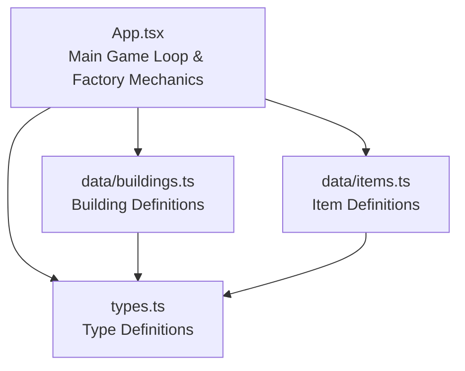

**Diagram sources**
- [App.tsx](file://App.tsx)
- [buildings.ts](file://data/buildings.ts)
- [items.ts](file://data/items.ts)
- [types.ts](file://types.ts)

**Section sources**
- [App.tsx](file://App.tsx)
- [buildings.ts](file://data/buildings.ts)
- [items.ts](file://data/items.ts)
- [types.ts](file://types.ts)

## Core Components
The factory system centers around building entities with production capabilities and lifecycle states:
- Production-capable buildings expose production timing, yields, and consumption via stats
- Buildings cycle through construction, idle, working, and finished states
- Player actions trigger production starts and collections
- Dropped items represent production outputs and resources

Key production-related building stats include:
- Work time and work state for timed production
- Consumption and production arrays for resource flows
- Durability and health for quality and maintenance
- Capacity and storage bonuses for throughput

**Section sources**
- [types.ts](file://types.ts)
- [buildings.ts](file://data/buildings.ts)
- [App.tsx](file://App.tsx)

## Architecture Overview
The factory architecture integrates building lifecycle management with real-time state synchronization:
- Buildings maintain workState, workEndTime, and construction timers
- The game loop periodically checks timers and transitions states
- Production completion triggers output drops and state updates
- Player interactions (start/collect) are validated against capacity and requirements

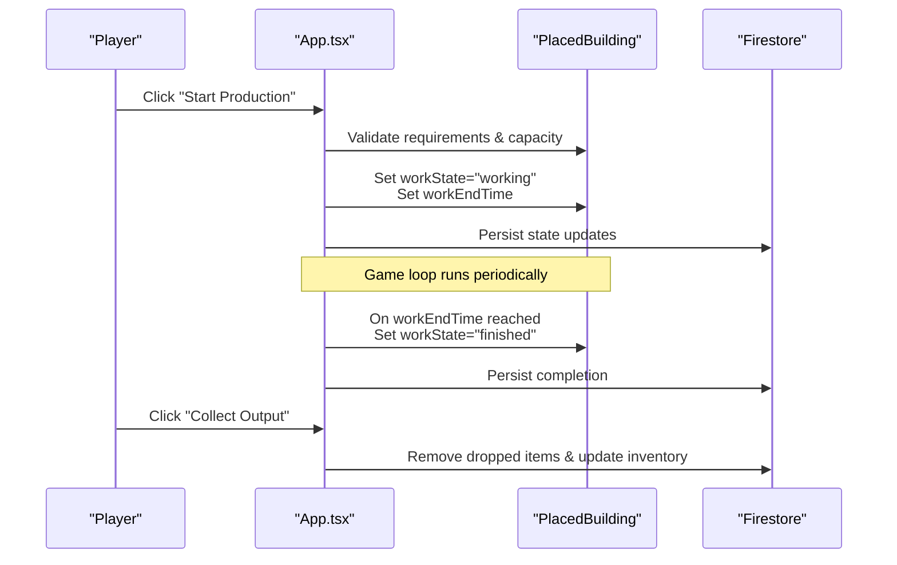

**Diagram sources**
- [App.tsx](file://App.tsx)
- [types.ts](file://types.ts)

**Section sources**
- [App.tsx](file://App.tsx)
- [types.ts](file://types.ts)

## Detailed Component Analysis

### Factory Architecture and Lifecycle
Factories are represented as buildings with production capabilities:
- Construction phase: isConstructing with constructionEndTime
- Idle phase: ready to accept production orders
- Working phase: production in progress with workEndTime
- Finished phase: output ready to collect

The lifecycle is managed by the game loop, which evaluates timers and applies state transitions.

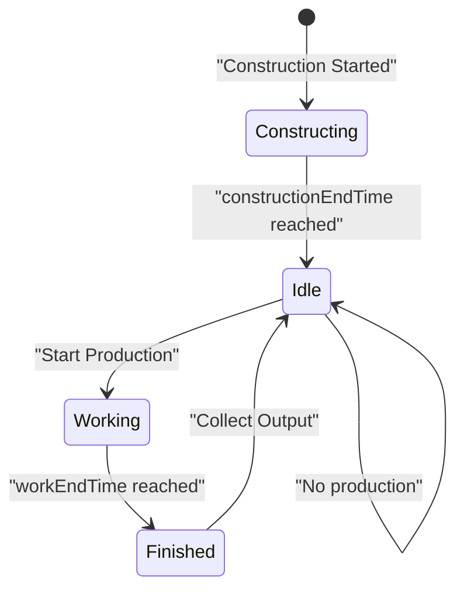

**Diagram sources**
- [App.tsx](file://App.tsx)
- [types.ts](file://types.ts)

**Section sources**
- [App.tsx](file://App.tsx)
- [types.ts](file://types.ts)

### Production Queues and Assembly Lines
While there is no explicit queue data structure, production follows an assembly-line pattern:
- Single-item production per building at a time
- Timed production cycles with deterministic workTimeSeconds
- No parallel processing within a single building

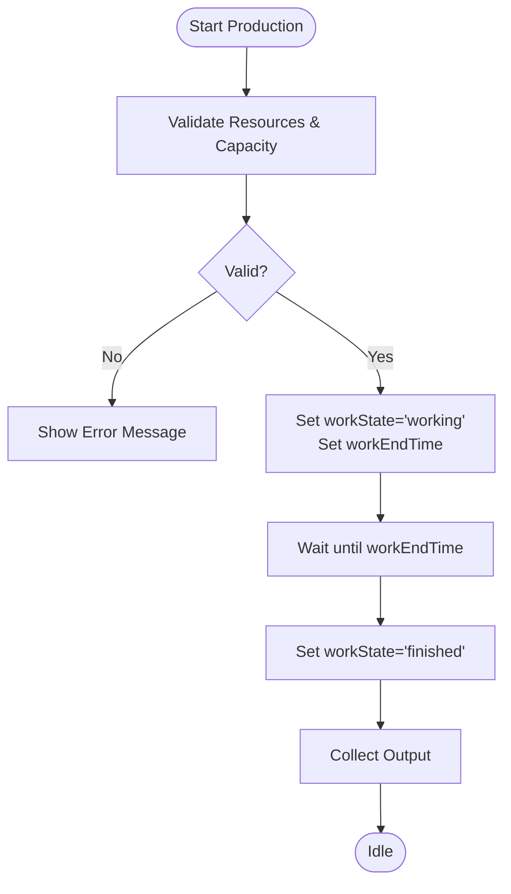

**Diagram sources**
- [App.tsx](file://App.tsx)
- [types.ts](file://types.ts)

**Section sources**
- [App.tsx](file://App.tsx)
- [types.ts](file://types.ts)

### Quality Control Processes
Quality is modeled implicitly through building stats:
- Durability and health determine structural integrity
- Damage thresholds and explosion drops simulate quality failures
- Population and construction requirements act as quality gates

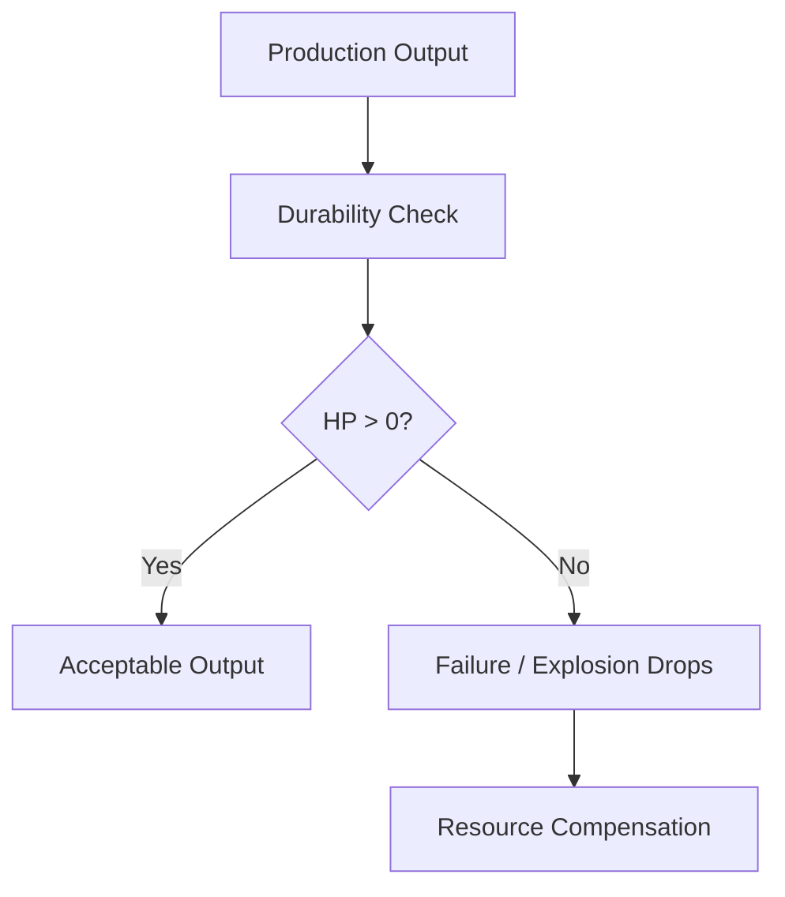

**Diagram sources**
- [App.tsx](file://App.tsx)
- [types.ts](file://types.ts)

**Section sources**
- [App.tsx](file://App.tsx)
- [types.ts](file://types.ts)

### Factory Capacity Management
Capacity is enforced through:
- Per-building capacity and workTimeSeconds
- Player-level derived max energy and population limits
- Storage buildings increasing gold capacity
- Construction requirements limiting new building placement

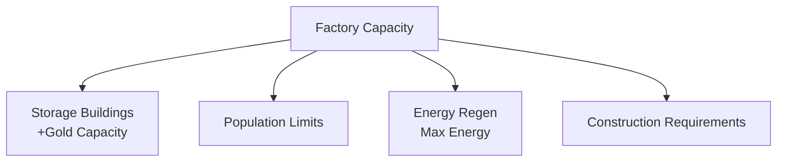

**Diagram sources**
- [App.tsx](file://App.tsx)
- [types.ts](file://types.ts)

**Section sources**
- [App.tsx](file://App.tsx)
- [types.ts](file://types.ts)

### Production Scheduling Algorithms
The scheduling mechanism relies on:
- Fixed-duration work cycles (workTimeSeconds)
- Timer-based transitions in the game loop
- No dynamic scheduling or priority queues

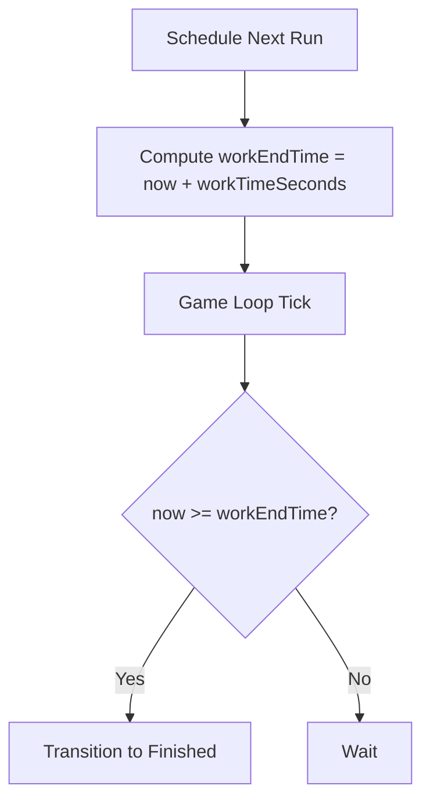

**Diagram sources**
- [App.tsx](file://App.tsx)
- [types.ts](file://types.ts)

**Section sources**
- [App.tsx](file://App.tsx)
- [types.ts](file://types.ts)

### Resource Allocation Strategies
Resource allocation occurs through:
- Building stats specifying consumes and produces
- Player inventory and gold balances
- Market transactions for external resource acquisition
- Dropped items representing production outputs

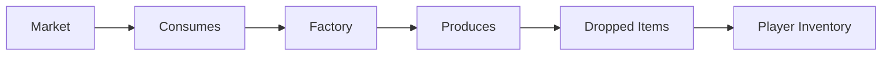

**Diagram sources**
- [App.tsx](file://App.tsx)
- [items.ts](file://data/items.ts)
- [types.ts](file://types.ts)

**Section sources**
- [App.tsx](file://App.tsx)
- [items.ts](file://data/items.ts)
- [types.ts](file://types.ts)

### Factory Types and Production Categories
The codebase defines building categories and types that influence production:
- Residential, Storage, TownHall, and Default categories
- Stats for workTimeSeconds, produces, consumes, durability, and capacity
- Examples of production-capable buildings appear in the building data

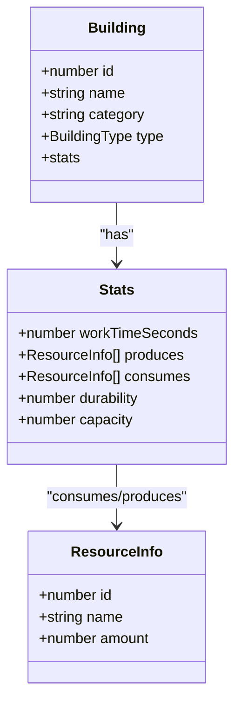

**Diagram sources**
- [types.ts](file://types.ts)
- [buildings.ts](file://data/buildings.ts)

**Section sources**
- [types.ts](file://types.ts)
- [buildings.ts](file://data/buildings.ts)

### Network Optimization and Inter-Factory Sharing
The codebase does not implement explicit factory networks or inter-factory resource sharing. However, the foundation supports:
- Shared resource drops and market transactions
- Centralized storage buildings increasing capacity
- Player-driven coordination via chat and clans

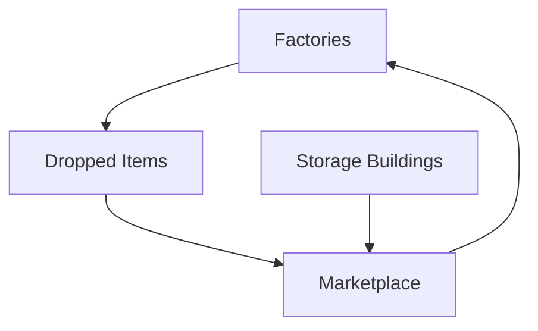

**Diagram sources**
- [App.tsx](file://App.tsx)
- [types.ts](file://types.ts)

**Section sources**
- [App.tsx](file://App.tsx)
- [types.ts](file://types.ts)

### Collaborative Production Systems
Collaboration is supported through:
- Shared resource drops and marketplaces
- Clan castles enabling coordinated defense and taxation
- Watchtowers enabling sector-based taxation and oversight

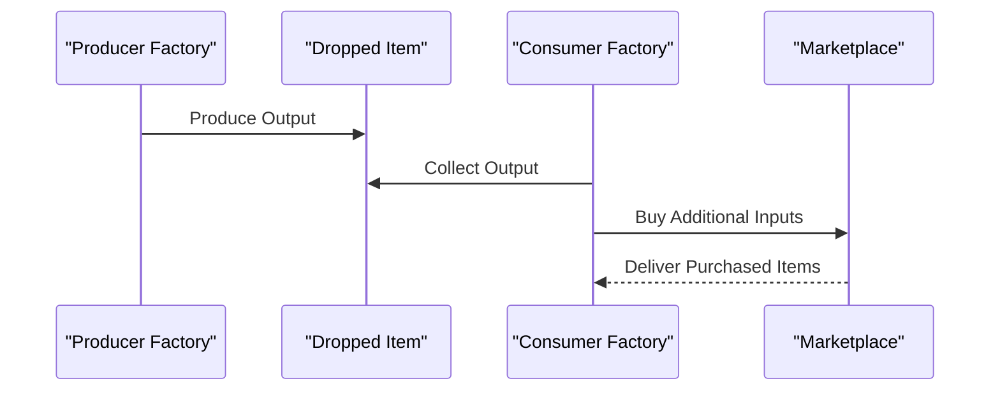

**Diagram sources**
- [App.tsx](file://App.tsx)
- [types.ts](file://types.ts)

**Section sources**
- [App.tsx](file://App.tsx)
- [types.ts](file://types.ts)

### Efficiency, Maintenance, and Quality Standards
Efficiency and quality are governed by:
- Work time and yield stats
- Durability and health thresholds
- Population and energy constraints
- Maintenance through repairs and upgrades

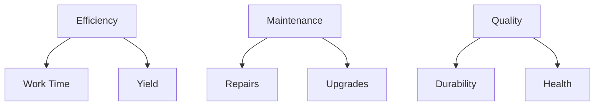

**Diagram sources**
- [App.tsx](file://App.tsx)
- [types.ts](file://types.ts)

**Section sources**
- [App.tsx](file://App.tsx)
- [types.ts](file://types.ts)

## Dependency Analysis
The factory system depends on:
- Building definitions for production specs
- Item definitions for resource flows
- Type definitions for consistent data structures
- Firestore for persistent state and synchronization

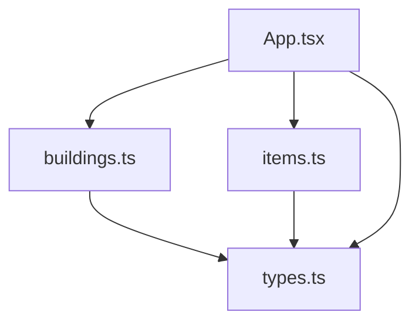

**Diagram sources**
- [buildings.ts](file://data/buildings.ts)
- [items.ts](file://data/items.ts)
- [types.ts](file://types.ts)
- [App.tsx](file://App.tsx)

**Section sources**
- [buildings.ts](file://data/buildings.ts)
- [items.ts](file://data/items.ts)
- [types.ts](file://types.ts)
- [App.tsx](file://App.tsx)

## Performance Considerations
- The game loop evaluates timers and applies state transitions efficiently
- Zone-based subscriptions minimize Firestore reads
- Optimistic UI updates improve responsiveness
- Consider adding parallelization for multiple factories and batching Firestore writes for large-scale production networks

## Troubleshooting Guide
Common issues and resolutions:
- Production not starting: Verify construction completion and resource availability
- Production not finishing: Check workTimeSeconds and ensure no desync
- Output not collected: Confirm building is in finished state and player has access
- Capacity exceeded: Add storage buildings or reduce concurrent production

**Section sources**
- [App.tsx](file://App.tsx)
- [types.ts](file://types.ts)

## Conclusion
The factory systems implement a robust, timer-driven production model with clear lifecycle states, resource flows, and quality controls. While explicit network orchestration is not present, the underlying mechanisms support scalable collaborative production through shared drops, markets, and storage. Future enhancements could introduce queue management, dynamic scheduling, and inter-factory resource sharing to further optimize throughput and efficiency.