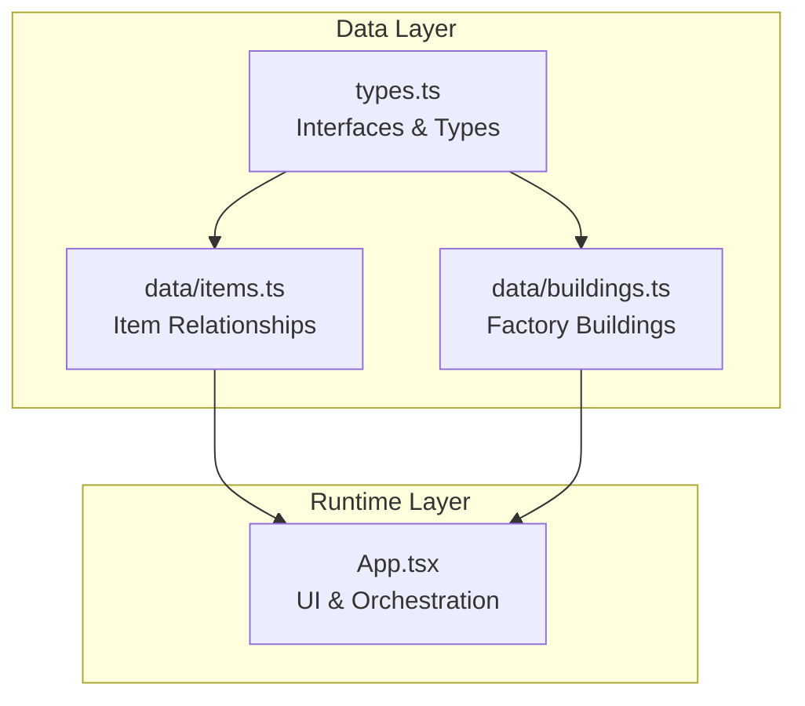
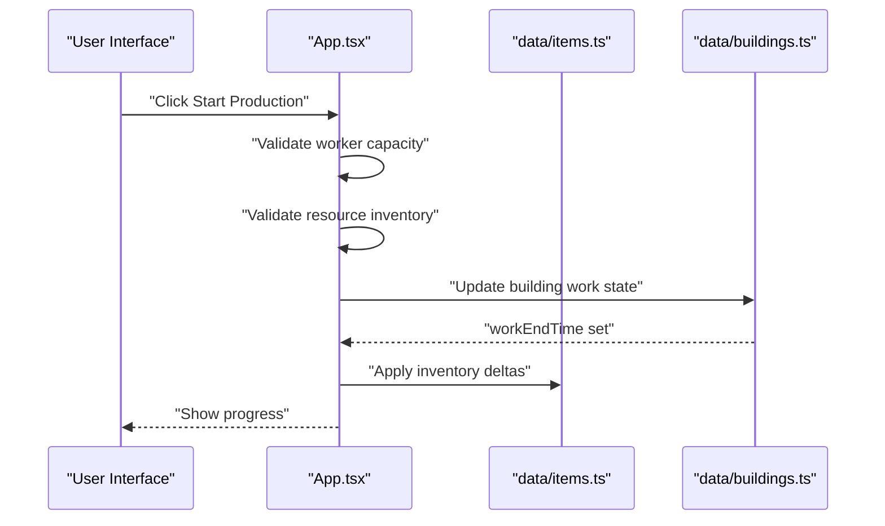
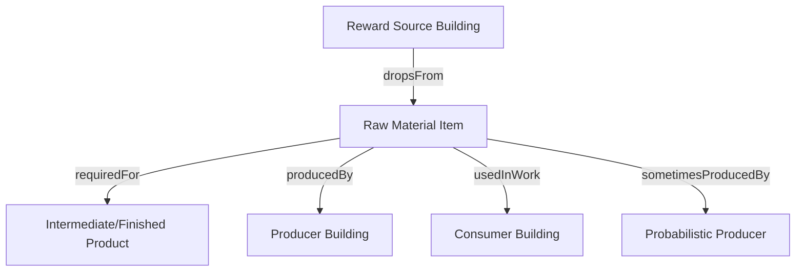
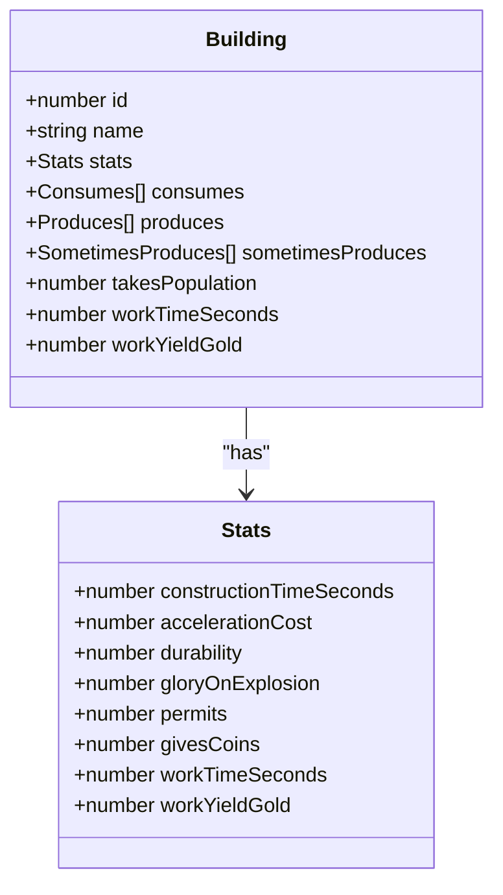
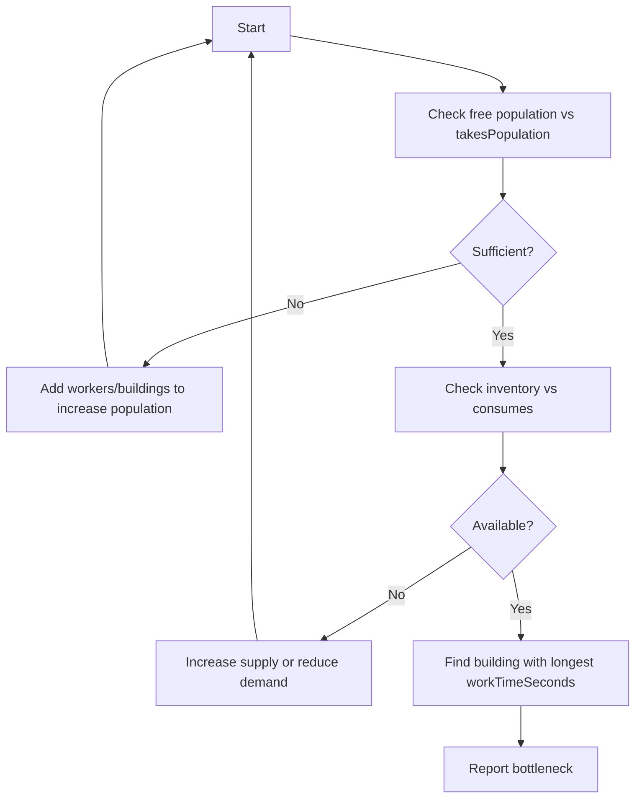
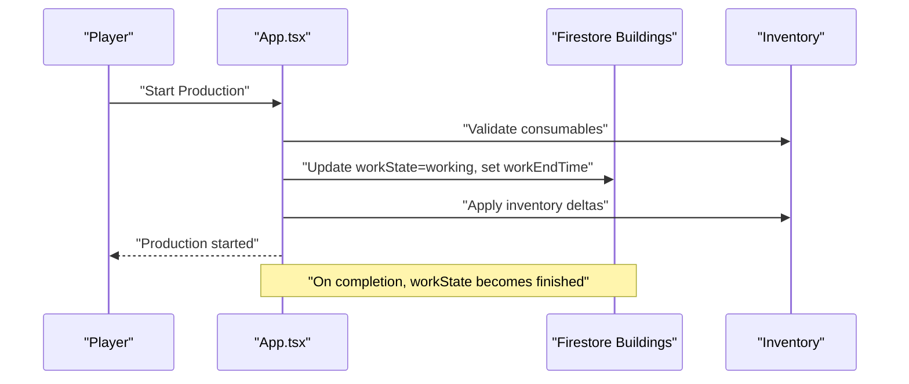
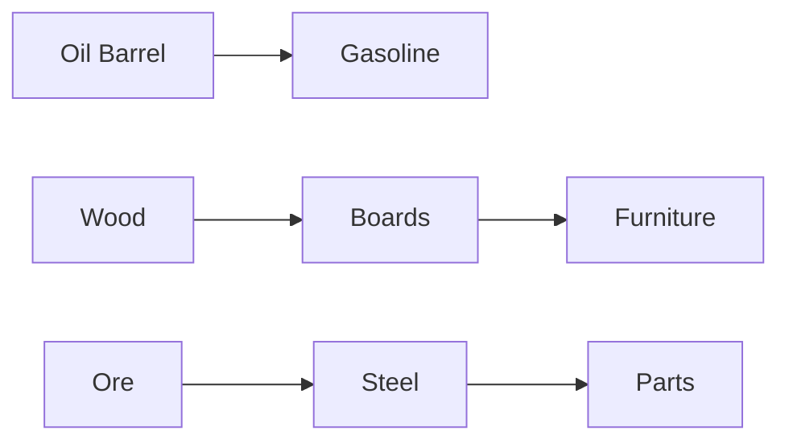
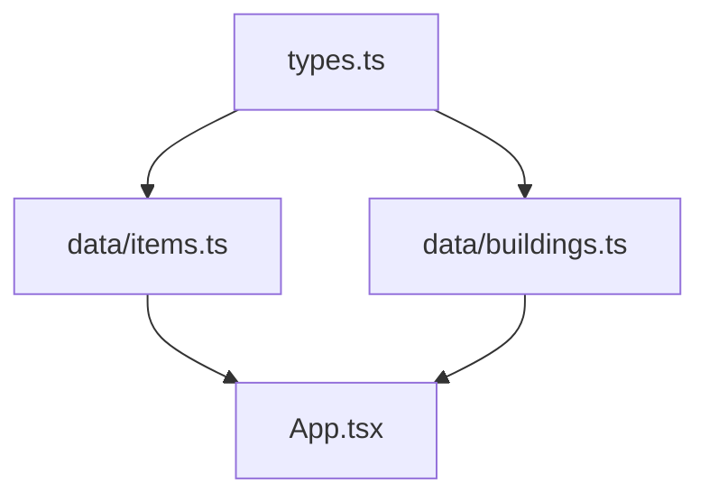

# Production Chains

<cite>
**Referenced Files in This Document**
- [items.ts](file://data/items.ts)
- [buildings.ts](file://data/buildings.ts)
- [types.ts](file://types.ts)
- [App.tsx](file://App.tsx)
</cite>

## Table of Contents
1. [Introduction](#introduction)
2. [Project Structure](#project-structure)
3. [Core Components](#core-components)
4. [Architecture Overview](#architecture-overview)
5. [Detailed Component Analysis](#detailed-component-analysis)
6. [Dependency Analysis](#dependency-analysis)
7. [Performance Considerations](#performance-considerations)
8. [Troubleshooting Guide](#troubleshooting-guide)
9. [Conclusion](#conclusion)

## Introduction
This document explains the production chain system that powers manufacturing, building production mechanics, and resource transformation workflows. It focuses on how items.ts defines production relationships between raw materials and finished products via requiredFor, producedBy, and usedInWork arrays, and how buildings.ts orchestrates the factory system with throughput limitations, consumption/production cycles, and worker capacity. We also cover production rate calculations, building efficiency modifiers, bottleneck identification, and practical optimization strategies for resource allocation and building placement.

## Project Structure
The production system spans three primary areas:
- Data model definitions in types.ts
- Item relationships in data/items.ts
- Building factories and mechanics in data/buildings.ts
- Runtime orchestration and UI interactions in App.tsx

**Diagram sources**
- [types.ts:10-96](file://types.ts#L10-L96)
- [items.ts:4-415](file://data/items.ts#L4-L415)
- [buildings.ts:4-4665](file://data/buildings.ts#L4-L4665)
- [App.tsx:22-25](file://App.tsx#L22-L25)

**Section sources**
- [types.ts:10-96](file://types.ts#L10-L96)
- [items.ts:4-415](file://data/items.ts#L4-L415)
- [buildings.ts:4-4665](file://data/buildings.ts#L4-L4665)
- [App.tsx:22-25](file://App.tsx#L22-L25)

## Core Components
- Item model: Defines categories, descriptions, and production relationships (requiredFor, producedBy, usedInWork, sometimesProducedBy, dropsFrom).
- Building model: Encapsulates production mechanics (consumes, produces, sometimesProduces), worker capacity (takesPopulation), and timing (workTimeSeconds, workYieldGold).
- Runtime orchestration: Manages production start/stop, worker availability checks, and resource deltas.

Key relationships:
- Items declare what buildings produce them (producedBy) and what buildings consume them (usedInWork).
- Buildings declare their production cycles and resource needs.

**Section sources**
- [types.ts:10-23](file://types.ts#L10-L23)
- [types.ts:42-96](file://types.ts#L42-L96)
- [items.ts:19-29](file://data/items.ts#L19-L29)
- [items.ts:43-52](file://data/items.ts#L43-L52)
- [buildings.ts:2113-2131](file://data/buildings.ts#L2113-L2131)

## Architecture Overview
The production chain architecture connects items to buildings and enforces constraints like worker capacity and resource availability. The runtime ensures that production starts only when prerequisites are met and updates inventory accordingly.

**Diagram sources**
- [App.tsx:4547-4570](file://App.tsx#L4547-L4570)
- [App.tsx:6066-6107](file://App.tsx#L6066-L6107)
- [buildings.ts:2113-2131](file://data/buildings.ts#L2113-L2131)
- [items.ts:43-52](file://data/items.ts#L43-L52)

## Detailed Component Analysis

### Item Relationships and Production Graph
Items define production relationships that form a directed graph:
- requiredFor: Items that require this item as input
- producedBy: Buildings that produce this item
- usedInWork: Buildings that consume this item during production
- sometimesProducedBy: Buildings that occasionally produce this item
- dropsFrom: Buildings that may drop this item as a reward

These arrays enable:
- Forward propagation: Which buildings can produce a given item
- Backward propagation: Which items are needed to construct or operate a building
- Probabilistic outputs: Items produced with a chance

**Diagram sources**
- [items.ts:19-29](file://data/items.ts#L19-L29)
- [items.ts:43-52](file://data/items.ts#L43-L52)
- [items.ts:25-35](file://data/items.ts#L25-L35)

**Section sources**
- [items.ts:19-29](file://data/items.ts#L19-L29)
- [items.ts:43-52](file://data/items.ts#L43-L52)
- [items.ts:25-35](file://data/items.ts#L25-L35)

### Building Factory Mechanics
Buildings encapsulate production logic:
- consumes: Required inputs per cycle
- produces: Guaranteed outputs per cycle
- sometimesProduces: Chance-based outputs
- takesPopulation: Worker capacity consumed per cycle
- workTimeSeconds: Cycle duration
- workYieldGold: Economic yield per cycle

Examples:
- Sawmill consumes wood and produces boards with occasional elite wood
- Oil Rig produces barrels of oil
- Steel Mill consumes fuel and ore to produce steel
- Alchemical Plant converts oil into gasoline with rare finds

**Diagram sources**
- [buildings.ts:42-96](file://data/buildings.ts#L42-L96)
- [buildings.ts:2113-2131](file://data/buildings.ts#L2113-L2131)
- [buildings.ts:2620-2627](file://data/buildings.ts#L2620-L2627)
- [buildings.ts:3400-3414](file://data/buildings.ts#L3400-L3414)

**Section sources**
- [buildings.ts:42-96](file://data/buildings.ts#L42-L96)
- [buildings.ts:2113-2131](file://data/buildings.ts#L2113-L2131)
- [buildings.ts:2620-2627](file://data/buildings.ts#L2620-L2627)
- [buildings.ts:3400-3414](file://data/buildings.ts#L3400-L3414)

### Production Rate Calculations and Efficiency Modifiers
Production rates are governed by:
- workTimeSeconds: Base cycle time
- workYieldGold: Monetary yield per cycle
- sometimesProduces: Chance-based outputs modify effective throughput

Efficiency modifiers observed in the codebase:
- Population capacity: Buildings specify takesPopulation; production requires sufficient free population
- Acceleration cost: Some buildings expose accelerationCost affecting construction or production speed
- Upgrade tiers: Buildings often increase yields or change sometimesProduces rates

Throughput per hour can be approximated as:
- Throughput = 3600 / workTimeSeconds (cycles per hour)
- Effective output = Throughput × average output per cycle (including probabilistic outputs)

**Section sources**
- [buildings.ts:856-867](file://data/buildings.ts#L856-L867)
- [buildings.ts:2118-2127](file://data/buildings.ts#L2118-L2127)
- [buildings.ts:2621-2626](file://data/buildings.ts#L2621-L2626)
- [buildings.ts:3400-3404](file://data/buildings.ts#L3400-L3404)

### Bottleneck Identification
Bottlenecks occur when:
- Worker capacity is insufficient (takesPopulation exceeds free population)
- Input resources are unavailable (inventory below required amounts)
- Cycle time dominates output (long workTimeSeconds)

Identification steps:
- Map all buildings that consume a given item (use usedInWork)
- Sum their takesPopulation and required consumptions
- Compare against available population and inventory
- Identify the building with the longest workTimeSeconds among bottlenecks

**Diagram sources**
- [App.tsx:4547-4570](file://App.tsx#L4547-L4570)
- [buildings.ts:2118-2131](file://data/buildings.ts#L2118-L2131)

**Section sources**
- [App.tsx:4547-4570](file://App.tsx#L4547-L4570)
- [buildings.ts:2118-2131](file://data/buildings.ts#L2118-L2131)

### Factory System: Throughput Limitations and Queue Management
The runtime enforces:
- Worker capacity checks before starting production
- Resource availability validation
- Work state transitions (idle → working → finished)
- Inventory deltas applied at production start

Queue management:
- Buildings maintain workEndTime timestamps
- UI reflects workState and remaining time
- Collection actions are gated until finished

**Diagram sources**
- [App.tsx:4547-4570](file://App.tsx#L4547-L4570)
- [App.tsx:6066-6107](file://App.tsx#L6066-L6107)

**Section sources**
- [App.tsx:4547-4570](file://App.tsx#L4547-L4570)
- [App.tsx:6066-6107](file://App.tsx#L6066-L6107)

### Practical Examples: Optimization Strategies
- Example 1: Wood → Boards pipeline
  - Use sawmills with higher sometimesProduces rates for elite wood
  - Ensure sufficient population (takesPopulation) and wood inventory
  - Monitor workTimeSeconds to balance throughput vs. cost

- Example 2: Oil → Gasoline
  - Run alchemical plants with steady oil supply
  - Account for probabilistic rare outputs (gold nodules) when evaluating ROI

- Example 3: Steel production
  - Combine ore mining, fuel supply, and super lily maintenance
  - Upgrade to higher tiers to improve yields and reduce cycle times

- Example 4: Military equipment
  - Plan fuel and component pipelines for military factories
  - Manage population capacity for multiple simultaneous production lines

Optimization tips:
- Prioritize buildings with shorter workTimeSeconds for high-volume items
- Increase population capacity to unlock more concurrent production
- Balance supply chains to prevent stockouts of critical consumables
- Use probabilistic outputs strategically (e.g., reserve rare drops for crafting)

**Section sources**
- [buildings.ts:2118-2131](file://data/buildings.ts#L2118-L2131)
- [buildings.ts:2870-2890](file://data/buildings.ts#L2870-L2890)
- [buildings.ts:3400-3414](file://data/buildings.ts#L3400-L3414)

### Relationship Between Buildings and Interdependencies
Buildings depend on each other through:
- Consumes → Produces relationships (e.g., oil → gasoline)
- Population interdependencies (e.g., multiple buildings requiring workers)
- Upgrade chains (e.g., basic oil rig → upgraded oil rig)

Interdependencies can be visualized as a directed graph:
- Edges represent consumption/production relationships
- Nodes represent buildings or items
- Paths reveal multi-stage transformations

**Diagram sources**
- [buildings.ts:2620-2627](file://data/buildings.ts#L2620-L2627)
- [buildings.ts:2118-2131](file://data/buildings.ts#L2118-L2131)
- [buildings.ts:3400-3414](file://data/buildings.ts#L3400-L3414)

**Section sources**
- [buildings.ts:2620-2627](file://data/buildings.ts#L2620-L2627)
- [buildings.ts:2118-2131](file://data/buildings.ts#L2118-L2131)
- [buildings.ts:3400-3414](file://data/buildings.ts#L3400-L3414)

## Dependency Analysis
The production system exhibits tight coupling between data models and runtime logic:
- types.ts defines the canonical interfaces used by both items.ts and buildings.ts
- items.ts provides the semantic relationships used by App.tsx to validate production readiness
- buildings.ts encodes the operational constraints enforced by App.tsx

**Diagram sources**
- [types.ts:10-96](file://types.ts#L10-L96)
- [items.ts:4-415](file://data/items.ts#L4-L415)
- [buildings.ts:4-4665](file://data/buildings.ts#L4-L4665)
- [App.tsx:22-25](file://App.tsx#L22-L25)

**Section sources**
- [types.ts:10-96](file://types.ts#L10-L96)
- [items.ts:4-415](file://data/items.ts#L4-L415)
- [buildings.ts:4-4665](file://data/buildings.ts#L4-L4665)
- [App.tsx:22-25](file://App.tsx#L22-L25)

## Performance Considerations
- Minimize long workTimeSeconds bottlenecks by upgrading buildings or adding parallel lines
- Reduce inventory churn by aligning production schedules with consumption patterns
- Leverage probabilistic outputs to optimize resource utilization
- Monitor population capacity; insufficient workers stall production regardless of supplies

## Troubleshooting Guide
Common issues and resolutions:
- Insufficient population: Add residential buildings or upgrades to increase population bonus
- Missing consumables: Establish upstream production (e.g., oil rig → alchemical plant)
- Long cycle times: Upgrade to higher tiers or add parallel production lines
- UI shows "Production in progress": Wait for workEndTime to elapse before collecting outputs

**Section sources**
- [App.tsx:4547-4570](file://App.tsx#L4547-L4570)
- [App.tsx:6066-6107](file://App.tsx#L6066-L6107)

## Conclusion
The production chain system integrates item relationships with building mechanics to create a robust, scalable factory system. By understanding item-to-building mappings, enforcing worker and resource constraints, and optimizing for throughput and efficiency, players can design resilient production networks that scale with their empire’s growth.