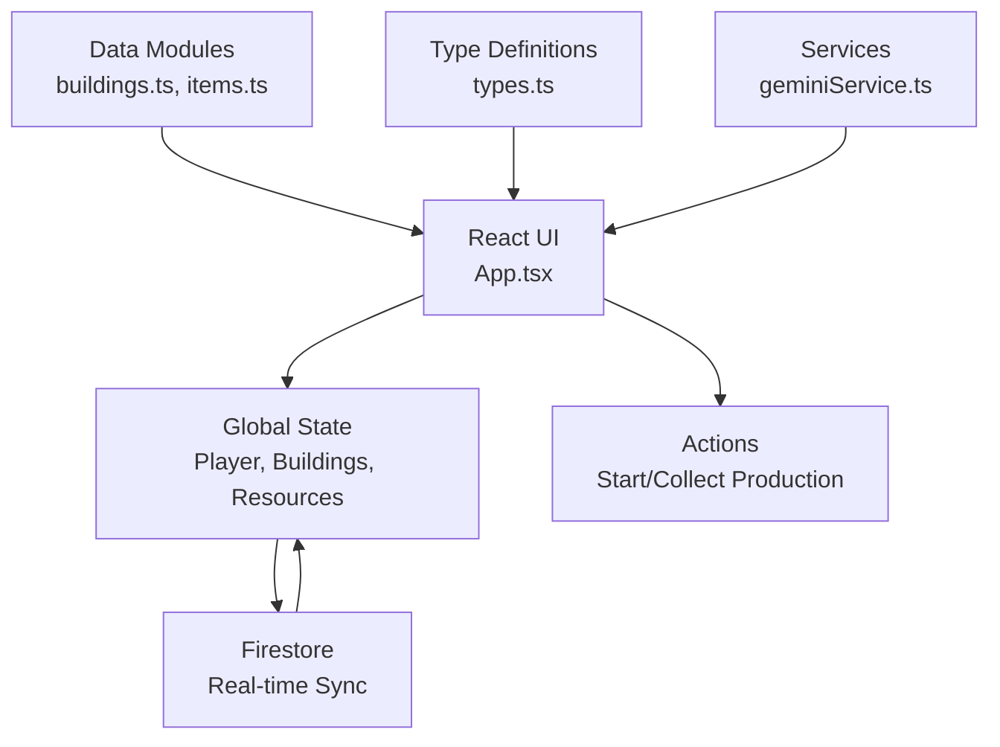
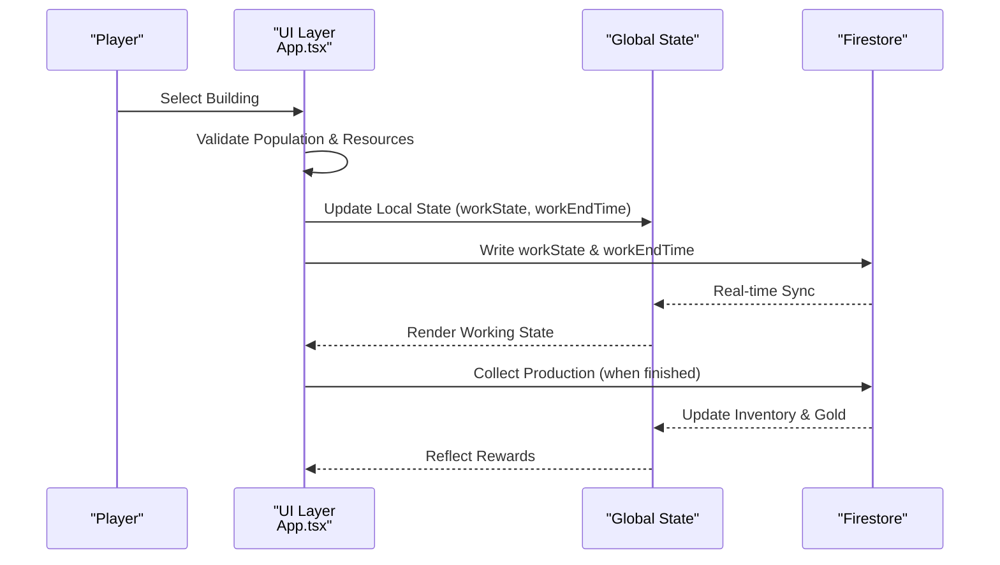
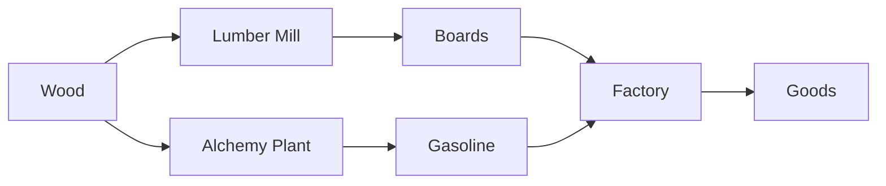
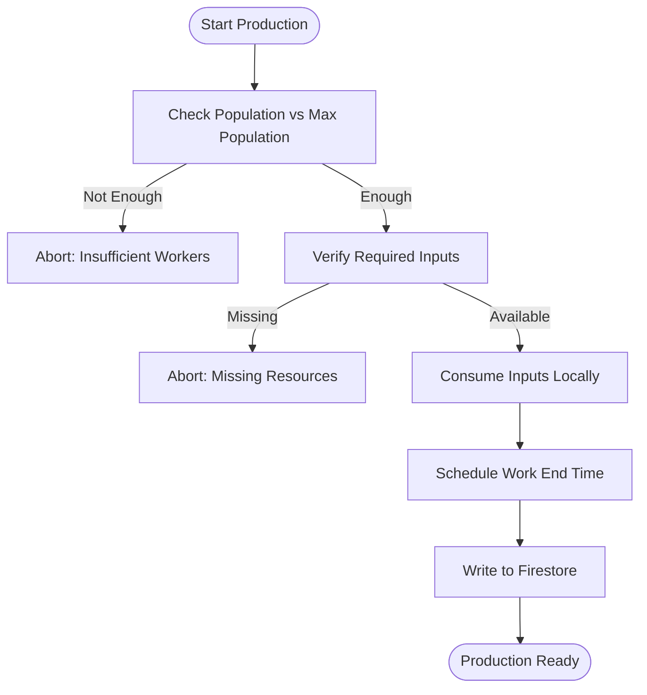
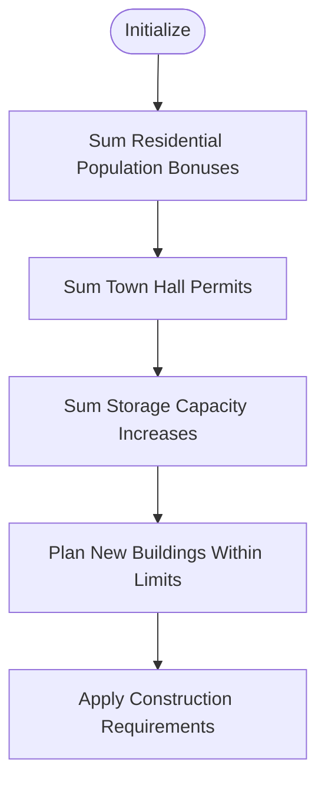
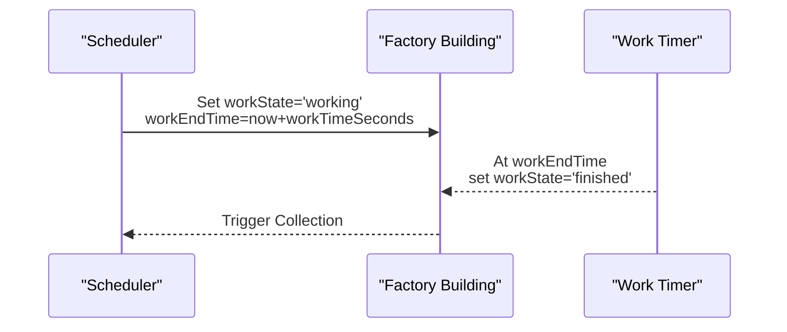
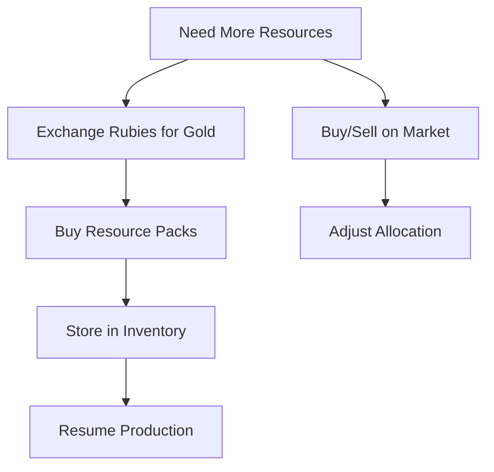
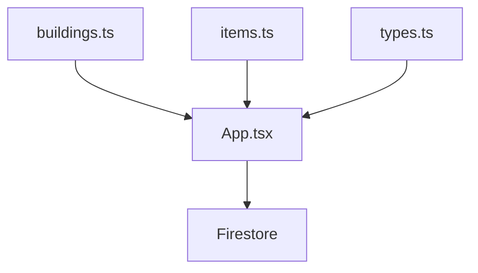

# Production Optimization

<cite>
**Referenced Files in This Document**
- [App.tsx](file://App.tsx)
- [buildings.ts](file://data/buildings.ts)
- [items.ts](file://data/items.ts)
- [types.ts](file://types.ts)
- [geminiService.ts](file://services/geminiService.ts)
- [index.tsx](file://index.tsx)
</cite>

## Table of Contents
1. [Introduction](#introduction)
2. [Project Structure](#project-structure)
3. [Core Components](#core-components)
4. [Architecture Overview](#architecture-overview)
5. [Detailed Component Analysis](#detailed-component-analysis)
6. [Dependency Analysis](#dependency-analysis)
7. [Performance Considerations](#performance-considerations)
8. [Troubleshooting Guide](#troubleshooting-guide)
9. [Conclusion](#conclusion)

## Introduction
This document presents a comprehensive guide to production optimization strategies and efficiency maximization for the game. It focuses on identifying bottlenecks, analyzing production chains, planning capacity, optimizing building placement, minimizing resource transport distances, balancing production rates, automating scheduling, managing queues, and dynamically allocating resources. It also covers cost-benefit analysis of building upgrades and strategies for handling surpluses and shortages, integrating with real-time market data and demand forecasting.

## Project Structure
The project is a React-based single-page application with Firestore-backed real-time state. Production logic is implemented in the main application component, with data-driven building and item definitions in TypeScript modules.

**Diagram sources**
- [App.tsx:255-8217](file://App.tsx#L255-L8217)
- [buildings.ts:1-4665](file://data/buildings.ts#L1-L4665)
- [items.ts:1-415](file://data/items.ts#L1-L415)
- [types.ts:1-197](file://types.ts#L1-L197)
- [geminiService.ts:1-43](file://services/geminiService.ts#L1-L43)

**Section sources**
- [index.tsx:1-20](file://index.tsx#L1-L20)
- [App.tsx:255-8217](file://App.tsx#L255-L8217)

## Core Components
- Building definitions define production mechanics, consumption, yields, and upgrade paths.
- Player state tracks inventory, gold, population, and building counts.
- Production actions orchestrate start/collect cycles, resource consumption, and yield distribution.
- Market integration enables buying/selling and rubies exchange for dynamic resource allocation.

Key production-related building categories:
- Residential: Population capacity and bonuses.
- Storage: Gold capacity increases.
- Factories: Consumption of raw materials to produce goods or gold yield.
- Specialized producers: Unique outputs (e.g., super lilies, mushroom patches).

**Section sources**
- [buildings.ts:1-4665](file://data/buildings.ts#L1-L4665)
- [types.ts:42-96](file://types.ts#L42-L96)
- [App.tsx:4547-6107](file://App.tsx#L4547-L6107)

## Architecture Overview
Production optimization spans UI interactions, state synchronization, and Firestore transactions. The flow below illustrates the production lifecycle from selection to completion and reward distribution.

**Diagram sources**
- [App.tsx:4547-4670](file://App.tsx#L4547-L4670)
- [App.tsx:4672-4964](file://App.tsx#L4672-L4964)

## Detailed Component Analysis

### Production Chain Analysis
Production chains are modeled as sequences of buildings with defined inputs and outputs:
- Input nodes consume raw materials (e.g., lumber mill consumes wood).
- Transformation nodes convert inputs into outputs (e.g., lumber mill produces boards).
- Output nodes accumulate inventory or generate gold yield (e.g., market storage increases capacity).

**Diagram sources**
- [buildings.ts:2100-2191](file://data/buildings.ts#L2100-L2191)
- [buildings.ts:2857-2900](file://data/buildings.ts#L2857-L2900)

**Section sources**
- [buildings.ts:2100-2191](file://data/buildings.ts#L2100-L2191)
- [buildings.ts:2857-2900](file://data/buildings.ts#L2857-L2900)

### Bottleneck Identification Algorithms
Common bottlenecks:
- Population constraint: Some factories require workers (takesPopulation).
- Resource availability: Factories consume specific inputs; shortages halt production.
- Capacity limits: Storage buildings increase inventory/gold capacity.

Identification logic:
- Population check before starting production.
- Pre-flight resource verification against inventory.
- Capacity checks via storage building stats.

**Diagram sources**
- [App.tsx:4547-4586](file://App.tsx#L4547-L4586)
- [App.tsx:4672-4729](file://App.tsx#L4672-L4729)

**Section sources**
- [App.tsx:4547-4586](file://App.tsx#L4547-L4586)
- [App.tsx:4672-4729](file://App.tsx#L4672-L4729)

### Capacity Planning Systems
Capacity planning involves:
- Tracking total population capacity from residential buildings.
- Monitoring building permits from town halls.
- Evaluating storage capacity increases from storage buildings.

**Diagram sources**
- [App.tsx:492-527](file://App.tsx#L492-L527)

**Section sources**
- [App.tsx:492-527](file://App.tsx#L492-L527)

### Optimizing Building Placement for Maximum Throughput
Guidelines:
- Place factories near resource sources to minimize transport distance.
- Cluster specialized producers (e.g., super lilies) to maximize shared zones.
- Position storage buildings close to high-output factories to reduce bottlenecks.
- Ensure adequate population coverage for worker-intensive factories.

Evidence from data:
- Factories specify consumes/prod produces arrays indicating resource needs and outputs.
- Specialized producers (e.g., super lilies) have short workTimeSeconds for rapid turnover.

**Section sources**
- [buildings.ts:1570-1781](file://data/buildings.ts#L1570-L1781)
- [buildings.ts:2857-2900](file://data/buildings.ts#L2857-L2900)

### Minimizing Resource Transportation Distances
Strategies:
- Locate lumber mills adjacent to forests.
- Position oil rigs near oil deposits.
- Co-locate gas plants with oil rigs to streamline supply chains.

**Section sources**
- [buildings.ts:2605-2676](file://data/buildings.ts#L2605-L2676)
- [buildings.ts:2857-2900](file://data/buildings.ts#L2857-L2900)

### Balancing Production Rates Across Facilities
Balancing techniques:
- Match factory input rates with output rates of downstream facilities.
- Use multiple smaller factories for flexibility versus fewer large ones for throughput.
- Monitor sometimesProduces to account for probabilistic outputs.

**Section sources**
- [buildings.ts:1448-1457](file://data/buildings.ts#L1448-L1457)
- [buildings.ts:1589-1591](file://data/buildings.ts#L1589-L1591)

### Automated Production Scheduling
Automation approach:
- Use workTimeSeconds to schedule production completion.
- Track workEndTime to enable automatic collection.
- Queue management: Only one active work cycle per building; prevent overlapping.

**Diagram sources**
- [App.tsx:4571-4585](file://App.tsx#L4571-L4585)
- [App.tsx:4672-4729](file://App.tsx#L4672-L4729)

**Section sources**
- [App.tsx:4571-4585](file://App.tsx#L4571-L4585)
- [App.tsx:4672-4729](file://App.tsx#L4672-L4729)

### Queue Management Systems
Queue behavior:
- Single concurrent work cycle per building.
- UI prevents interactions during workState='working'.
- Collection triggers reward distribution and resets state.

**Section sources**
- [App.tsx:6093-6107](file://App.tsx#L6093-L6107)
- [App.tsx:4672-4729](file://App.tsx#L4672-L4729)

### Dynamic Resource Allocation Strategies
Allocation mechanisms:
- Rubies exchange for gold to fund purchases.
- Shop system allows buying resource packs with rubies.
- Market listings enable buying/selling goods.

**Diagram sources**
- [App.tsx:4410-4437](file://App.tsx#L4410-L4437)
- [App.tsx:4365-4408](file://App.tsx#L4365-L4408)
- [App.tsx:4327-4363](file://App.tsx#L4327-L4363)

**Section sources**
- [App.tsx:4410-4437](file://App.tsx#L4410-L4437)
- [App.tsx:4365-4408](file://App.tsx#L4365-L4408)
- [App.tsx:4327-4363](file://App.tsx#L4327-L4363)

### Practical Examples of Production Chain Optimization
Example 1: Wood-to-Boards-to-Goods
- Lumber mill consumes wood and produces boards.
- Alchemy plant converts oil into gasoline.
- Factory consumes boards and gasoline to produce goods.

Example 2: Rapid Gold Yield
- Super lilies and mushroom patches offer fast workTimeSeconds with occasional higher-value outputs.

**Section sources**
- [buildings.ts:2100-2191](file://data/buildings.ts#L2100-L2191)
- [buildings.ts:2857-2900](file://data/buildings.ts#L2857-L2900)
- [buildings.ts:1570-1781](file://data/buildings.ts#L1570-L1781)

### Cost-Benefit Analysis of Building Upgrades
Upgrade evaluation criteria:
- Compare constructionTimeSeconds and accelerationCost against increased yields or capacity.
- Factor in permits and population bonuses for town halls.
- Evaluate storage capacity increases for throughput buffering.

**Section sources**
- [buildings.ts:1-4665](file://data/buildings.ts#L1-L4665)

### Handling Production Surpluses and Shortages
Surplus mitigation:
- Redirect excess goods to market sales.
- Increase storage capacity to buffer production.

Shortage prevention:
- Monitor inventory deltas before starting production.
- Pre-position inputs near factories.

**Section sources**
- [App.tsx:4563-4569](file://App.tsx#L4563-L4569)
- [App.tsx:4778-4783](file://App.tsx#L4778-L4783)

### Integration with Real-Time Market Data and Demand Forecasting
Market integration:
- Market listings support buying/selling.
- Rubies exchange enables dynamic gold acquisition.
- Shop system facilitates bulk resource acquisition.

Forecasting:
- Use historical production data and market trends to anticipate demand.
- Adjust production schedules proactively.

**Section sources**
- [App.tsx:4327-4363](file://App.tsx#L4327-L4363)
- [App.tsx:4410-4437](file://App.tsx#L4410-L4437)
- [App.tsx:4365-4408](file://App.tsx#L4365-L4408)

## Dependency Analysis
Production logic depends on:
- Building definitions for stats (consumes, produces, workTimeSeconds).
- Player state for inventory and population.
- Firestore for persistence and real-time synchronization.

**Diagram sources**
- [buildings.ts:1-4665](file://data/buildings.ts#L1-L4665)
- [items.ts:1-415](file://data/items.ts#L1-L415)
- [types.ts:1-197](file://types.ts#L1-L197)
- [App.tsx:255-8217](file://App.tsx#L255-L8217)

**Section sources**
- [buildings.ts:1-4665](file://data/buildings.ts#L1-L4665)
- [items.ts:1-415](file://data/items.ts#L1-L415)
- [types.ts:1-197](file://types.ts#L1-L197)
- [App.tsx:255-8217](file://App.tsx#L255-L8217)

## Performance Considerations
- Minimize Firestore writes by batching and using optimistic UI updates.
- Use throttled camera-based zone subscriptions to reduce snapshot churn.
- Prefer local calculations for derived metrics (population, permits, capacity) to reduce DB reads.
- Optimize rendering by memoizing expensive computations.

[No sources needed since this section provides general guidance]

## Troubleshooting Guide
Common issues and resolutions:
- Insufficient workers: Ensure currentPopulation plus takesPopulation does not exceed maxPopulation.
- Missing resources: Verify inventory contains required amounts before starting production.
- Transaction conflicts: Use Firestore transactions for atomic updates and handle errors gracefully.
- UI stuck in working state: Confirm workEndTime has elapsed and Firestore sync reflects finished state.

**Section sources**
- [App.tsx:4547-4586](file://App.tsx#L4547-L4586)
- [App.tsx:4672-4729](file://App.tsx#L4672-L4729)
- [App.tsx:4327-4363](file://App.tsx#L4327-L4363)

## Conclusion
Production optimization hinges on understanding building mechanics, managing capacity and population constraints, aligning input/output chains, and leveraging real-time market dynamics. By applying the strategies outlined—bottleneck identification, placement optimization, automated scheduling, queue management, and dynamic allocation—you can maximize throughput, minimize waste, and maintain efficient operations under varying demand conditions.