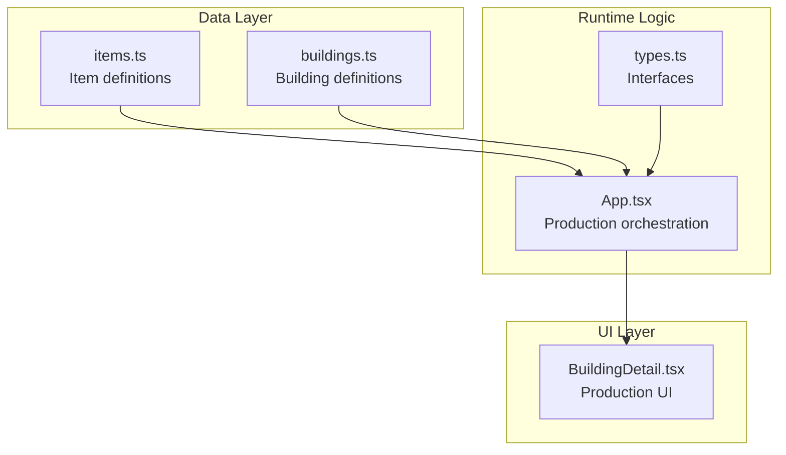
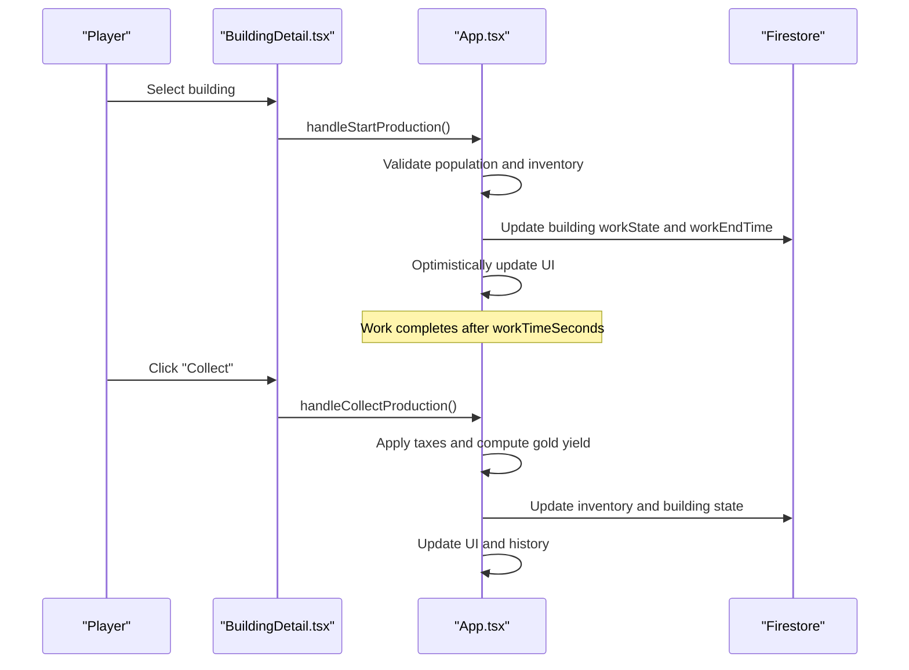
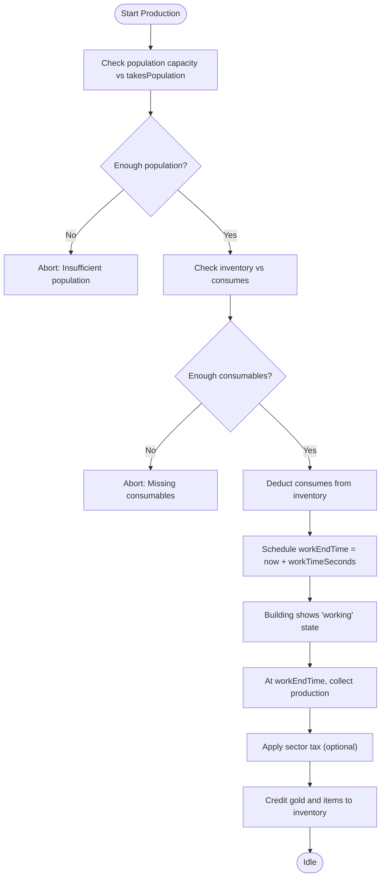
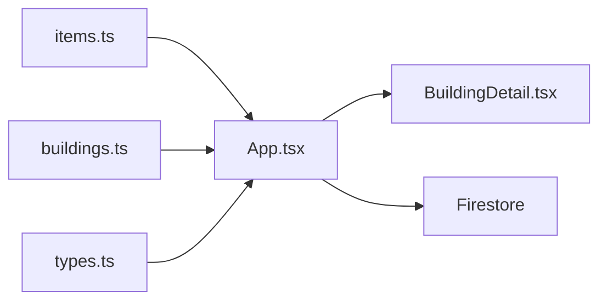

# Resource Transformation

<cite>
**Referenced Files in This Document**
- [App.tsx](file://App.tsx)
- [types.ts](file://types.ts)
- [buildings.ts](file://data/buildings.ts)
- [items.ts](file://data/items.ts)
- [BuildingDetail.tsx](file://components/BuildingDetail.tsx)
</cite>

## Table of Contents
1. [Introduction](#introduction)
2. [Project Structure](#project-structure)
3. [Core Components](#core-components)
4. [Architecture Overview](#architecture-overview)
5. [Detailed Component Analysis](#detailed-component-analysis)
6. [Dependency Analysis](#dependency-analysis)
7. [Performance Considerations](#performance-considerations)
8. [Troubleshooting Guide](#troubleshooting-guide)
9. [Conclusion](#conclusion)

## Introduction
This document explains how raw materials are transformed into intermediate and final products through defined production relationships in the game. It covers:
- How items relate to buildings via consumption and production fields
- Transformation ratios and processing times
- Supply chain coordination between extraction buildings and processing facilities
- Inventory management and resource flow
- Strategies for minimizing waste and optimizing throughput

## Project Structure
The resource transformation system spans three primary areas:
- Data model definitions for items and buildings
- Production logic in the game’s main application
- UI components that expose production controls

**Diagram sources**
- [App.tsx](file://App.tsx)
- [types.ts](file://types.ts)
- [buildings.ts](file://data/buildings.ts)
- [items.ts](file://data/items.ts)
- [BuildingDetail.tsx](file://components/BuildingDetail.tsx)

**Section sources**
- [App.tsx](file://App.tsx)
- [types.ts](file://types.ts)
- [buildings.ts](file://data/buildings.ts)
- [items.ts](file://data/items.ts)
- [BuildingDetail.tsx](file://components/BuildingDetail.tsx)

## Core Components
- Item definitions describe categories, drop sources, and production relationships.
- Building definitions define production capabilities, consumption, yields, and durations.
- Runtime logic coordinates production start, progress tracking, and collection.
- UI surfaces production controls and displays resource requirements.

Key runtime functions:
- Start production for buildings with consumption and work time
- Collect production with optional taxation and gold yield
- World-based production for plant beds (mushrooms, lilies)

**Section sources**
- [App.tsx](file://App.tsx)
- [types.ts](file://types.ts)
- [buildings.ts](file://data/buildings.ts)
- [items.ts](file://data/items.ts)

## Architecture Overview
The production pipeline integrates UI, data, and runtime logic:

**Diagram sources**
- [App.tsx](file://App.tsx)
- [BuildingDetail.tsx](file://components/BuildingDetail.tsx)

## Detailed Component Analysis

### Item-to-Production Relationships
Items define how they are used in production and what they produce:
- requiredFor: Items needed to craft other items
- usedInWork: Items consumed by buildings during production
- producedBy: Buildings that produce an item
- dropsFrom: Buildings that occasionally drop an item

These fields establish the supply chain:
- Extraction buildings (e.g., mushroom beds) produce primary resources
- Processing buildings consume primary resources to produce intermediates/final goods
- Craft buildings consume intermediates to produce final products

Examples from data:
- Mushroom beds produce mushrooms and occasionally super mushrooms
- Some buildings produce gold as a byproduct

**Section sources**
- [items.ts](file://data/items.ts)
- [buildings.ts](file://data/buildings.ts)

### Building Production Mechanics
Buildings declare:
- consumes: Required inputs per cycle
- produces: Outputs per cycle
- sometimesProduces: Probabilistic outputs
- workTimeSeconds: Duration of a production cycle
- takesPopulation: Labor requirement per cycle
- workYieldGold: Fixed gold yield per cycle (subject to taxation)

Runtime logic:
- Validates population capacity against takesPopulation
- Validates inventory against consumes
- Deducts consumed items from inventory
- Sets building workState to working and schedules completion via workEndTime
- On completion, applies taxes and credits gold and items

**Diagram sources**
- [App.tsx](file://App.tsx)
- [types.ts](file://types.ts)
- [buildings.ts](file://data/buildings.ts)

**Section sources**
- [App.tsx](file://App.tsx)
- [types.ts](file://types.ts)
- [buildings.ts](file://data/buildings.ts)

### Extraction vs Processing Coordination
Extraction buildings (e.g., mushroom beds) operate differently:
- They do not consume items from inventory
- They require population to send workers
- They produce items periodically with optional probabilistic bonuses

Processing buildings:
- Consume items from inventory
- Produce items and optionally yield gold
- Can be taxed by nearby watchtowers/clan castles

Coordination tips:
- Ensure sufficient population for extraction buildings
- Maintain buffer inventory for processing buildings
- Position watchtowers/clan castles to collect taxes on processed goods

**Section sources**
- [App.tsx](file://App.tsx)
- [buildings.ts](file://data/buildings.ts)

### Inventory Management and Waste Minimization
- Monitor inventory deltas when starting production to avoid over-consumption
- Prefer buildings with lower consumable ratios and shorter work times for throughput
- Use probabilistic outputs (sometimesProduces) to plan for variability
- Avoid overstocking by aligning production rates with demand (requiredFor)

**Section sources**
- [App.tsx](file://App.tsx)
- [items.ts](file://data/items.ts)
- [buildings.ts](file://data/buildings.ts)

### Resource Availability, Capacity, and Scheduling
- Population capacity limits concurrent production
- Construction requirements (population and resources) gate building placement
- Work time determines throughput; batching multiple cycles can improve efficiency
- Taxes reduce net gold yield; plan production locations accordingly

**Section sources**
- [App.tsx](file://App.tsx)
- [buildings.ts](file://data/buildings.ts)

## Dependency Analysis
The production system depends on:
- Item definitions for consumption/production relationships
- Building definitions for production parameters
- Runtime logic for state transitions and UI updates
- Firestore for persistence and synchronization

**Diagram sources**
- [App.tsx](file://App.tsx)
- [types.ts](file://types.ts)
- [buildings.ts](file://data/buildings.ts)
- [items.ts](file://data/items.ts)
- [BuildingDetail.tsx](file://components/BuildingDetail.tsx)

**Section sources**
- [App.tsx](file://App.tsx)
- [types.ts](file://types.ts)
- [buildings.ts](file://data/buildings.ts)
- [items.ts](file://data/items.ts)
- [BuildingDetail.tsx](file://components/BuildingDetail.tsx)

## Performance Considerations
- Batch production cycles to reduce UI churn
- Prefer buildings with short workTimeSeconds for rapid feedback
- Use optimistic UI updates to minimize perceived latency
- Limit subscriptions to relevant zones to reduce Firestore overhead

## Troubleshooting Guide
Common issues and resolutions:
- “Insufficient population”: Upgrade residential buildings or wait for population growth
- “Missing consumables”: Ensure inventory has required items before starting production
- “Construction requirements not met”: Fulfill population and resource prerequisites
- “Action blocked by cooldown”: Wait for synchronization cooldown to expire

**Section sources**
- [App.tsx](file://App.tsx)

## Conclusion
The resource transformation system combines item and building definitions with robust runtime logic to coordinate extraction, processing, and distribution. By aligning production schedules with population capacity, managing inventory buffers, and leveraging taxation insights, players can optimize throughput and minimize waste across their supply chains.