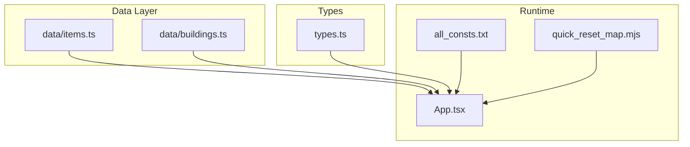
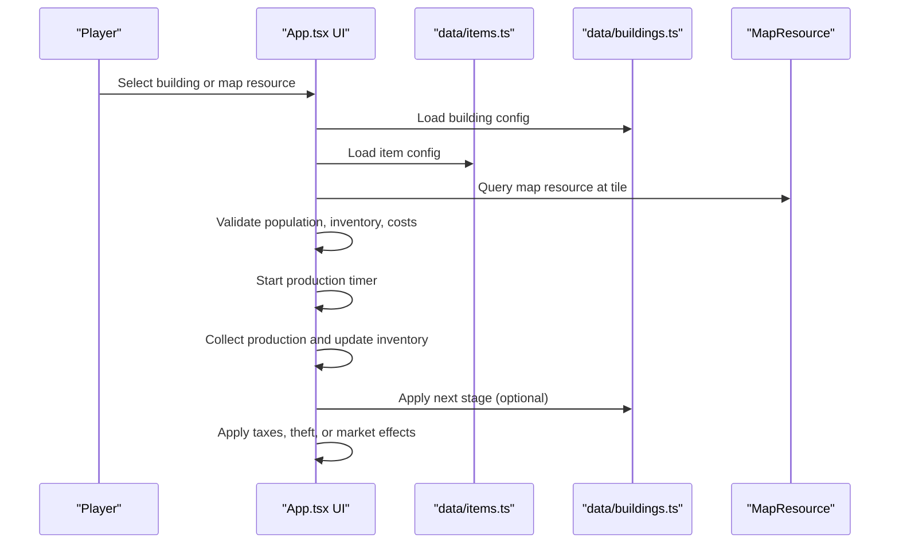
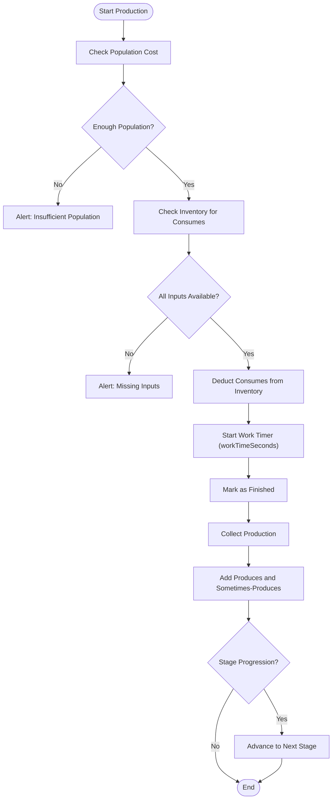
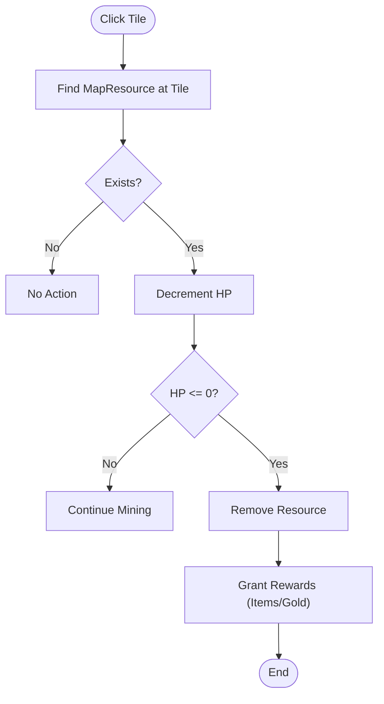
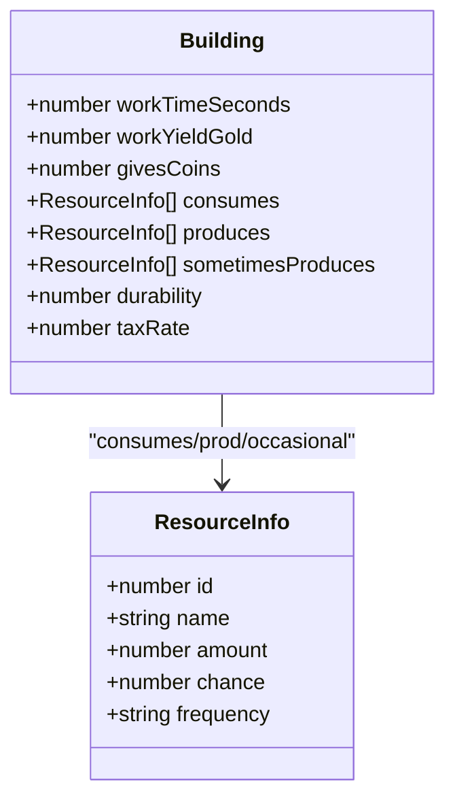
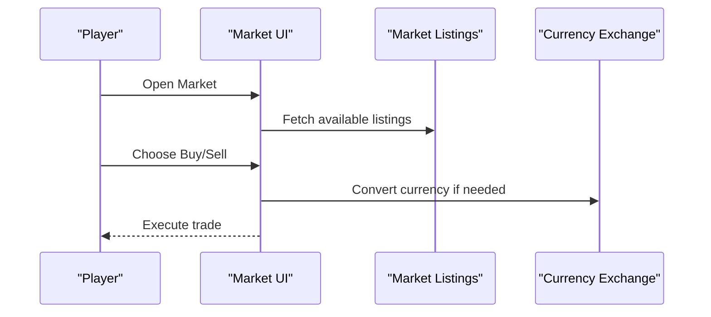
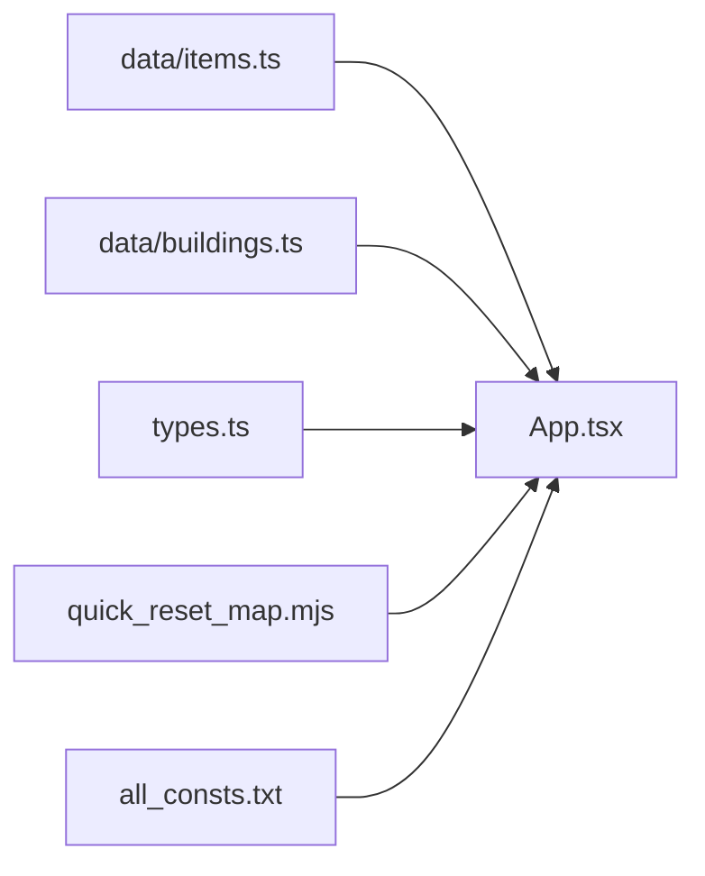

# Resource Management

<cite>
**Referenced Files in This Document**
- [data/items.ts](file://data/items.ts)
- [data/buildings.ts](file://data/buildings.ts)
- [types.ts](file://types.ts)
- [App.tsx](file://App.tsx)
- [all_consts.txt](file://all_consts.txt)
- [quick_reset_map.mjs](file://quick_reset_map.mjs)
</cite>

## Table of Contents
1. [Introduction](#introduction)
2. [Project Structure](#project-structure)
3. [Core Components](#core-components)
4. [Architecture Overview](#architecture-overview)
5. [Detailed Component Analysis](#detailed-component-analysis)
6. [Dependency Analysis](#dependency-analysis)
7. [Performance Considerations](#performance-considerations)
8. [Troubleshooting Guide](#troubleshooting-guide)
9. [Conclusion](#conclusion)
10. [Appendices](#appendices)

## Introduction
This document explains the resource management system of the game, focusing on extraction mechanics, production chains, storage systems, and economic simulation. It documents the resource types defined in data/items.ts, their properties, and how they feed building production chains. It also covers extraction algorithms for MapResource entities, production rate calculations, storage capacity management, item drop mechanics, temporary resource collection, and market interactions. Finally, it outlines the relationship between resource management and building systems, including input/output relationships, efficiency calculations, and common issues such as resource depletion, production bottlenecks, and storage overflow, with practical optimization strategies.

## Project Structure
The resource management system spans several core files:
- Data definitions: items and building configurations
- Type definitions: shared interfaces for items, buildings, map resources, and game entities
- Runtime logic: production, collection, theft, taxation, and market interactions
- Map resource generation and extraction mechanics

**Diagram sources**
- [data/items.ts](file://data/items.ts)
- [data/buildings.ts](file://data/buildings.ts)
- [types.ts](file://types.ts)
- [App.tsx](file://App.tsx)
- [all_consts.txt](file://all_consts.txt)
- [quick_reset_map.mjs](file://quick_reset_map.mjs)

**Section sources**
- [data/items.ts](file://data/items.ts)
- [data/buildings.ts](file://data/buildings.ts)
- [types.ts](file://types.ts)
- [App.tsx](file://App.tsx)
- [all_consts.txt](file://all_consts.txt)
- [quick_reset_map.mjs](file://quick_reset_map.mjs)

## Core Components
- Resource definitions: Items describe categories, production/consumption links, drops, and ruby pack quantities.
- Building definitions: Buildings define consumption, production, sometimes-produces, work time, yields, and drops.
- Map resources: MapResource entities represent world deposits (trees, oil, chests, quarries) with HP and type.
- Player inventory and capacities: Player gold, rubies, population, and inventory deltas drive production decisions.
- Production lifecycle: Start production, progress timer, collect yield, optional super-resource progression.
- Economic mechanisms: Taxes, theft, market listings, and currency exchange.

**Section sources**
- [data/items.ts](file://data/items.ts)
- [data/buildings.ts](file://data/buildings.ts)
- [types.ts](file://types.ts)
- [App.tsx](file://App.tsx)

## Architecture Overview
The resource management architecture connects data-driven definitions with runtime logic:
- Items define interdependencies (requiredFor, usedInWork, producedBy, dropsFrom).
- Buildings define production parameters (consumes, produces, sometimesProduces, workTimeSeconds, workYieldGold).
- MapResource entities are consumed by players to produce items or trigger building conversions.
- Production flow is orchestrated in App.tsx with Firestore updates and optimistic UI.

**Diagram sources**
- [App.tsx](file://App.tsx)
- [data/items.ts](file://data/items.ts)
- [data/buildings.ts](file://data/buildings.ts)
- [types.ts](file://types.ts)

## Detailed Component Analysis

### Resource Types and Properties
- Categories: Resources are grouped under a dedicated category for resource items.
- Production links:
  - producedBy: Which buildings produce an item.
  - usedInWork: Which buildings consume an item for operation.
  - requiredFor: Which buildings require an item for construction/upgrades.
  - dropsFrom: Which buildings can drop an item occasionally.
- Ruby pack quantity: Defines how many units are granted per ruby purchase for balancing.

Examples from the dataset:
- Wood (Tree) is consumed by lumber mills and required for housing.
- Boards are produced by lumber mills and used in construction.
- Oil barrel is produced from oil rigs and refined into gasoline.
- Super mushroom/pumpkin/potato pieces are rare drops from special farms.

**Section sources**
- [data/items.ts](file://data/items.ts)

### Building Production Chains
- Consumption and production:
  - consumes: Required inputs per work cycle.
  - produces: Guaranteed outputs per work cycle.
  - sometimesProduces: Random chance outputs with amounts.
- Work timing and yield:
  - workTimeSeconds: Duration of a work cycle.
  - workYieldGold: Fixed gold yield per cycle.
  - givesCoins: Alternative gold yield field for certain buildings.
- Special stages and progression:
  - Some buildings cycle through stages (e.g., mushroom/lily farms) with 20% chance to advance to a higher-tier output.

**Diagram sources**
- [App.tsx](file://App.tsx)
- [data/buildings.ts](file://data/buildings.ts)

**Section sources**
- [App.tsx](file://App.tsx)
- [data/buildings.ts](file://data/buildings.ts)

### Extraction Mechanics for MapResource Entities
- MapResource types:
  - tree: Harvested for wood/logs.
  - oil: Converted to oil rig and refined into fuel.
  - chest: Found treasure chests.
  - quarry: Mined for stone.
- Extraction algorithm:
  - Players click a tile containing a MapResource.
  - The system decrements the resource HP until exhaustion.
  - On depletion, the resource disappears and may drop items or trigger building placement (e.g., oil rig).
  - Temporary gold rewards may be given upon extraction.

**Diagram sources**
- [App.tsx](file://App.tsx)
- [all_consts.txt](file://all_consts.txt)
- [quick_reset_map.mjs](file://quick_reset_map.mjs)
- [types.ts](file://types.ts)

**Section sources**
- [App.tsx](file://App.tsx)
- [all_consts.txt](file://all_consts.txt)
- [quick_reset_map.mjs](file://quick_reset_map.mjs)
- [types.ts](file://types.ts)

### Production Rate Calculations and Efficiency
- Cycle time: workTimeSeconds defines the length of a production cycle.
- Output rates: produces and sometimesProduces define deterministic and probabilistic outputs per cycle.
- Gold yield: workYieldGold or givesCoins determines income per cycle.
- Efficiency factors:
  - Taxes: Watchtower/Clan Castle taxRate reduces player share.
  - Theft: Den of Thieves allows stealing production from others.
  - Super-resource chance: Certain farms have a fixed 20% chance to upgrade output tiers.

**Diagram sources**
- [data/buildings.ts](file://data/buildings.ts)
- [types.ts](file://types.ts)

**Section sources**
- [App.tsx](file://App.tsx)
- [data/buildings.ts](file://data/buildings.ts)
- [types.ts](file://types.ts)

### Storage Systems and Capacity Management
- Player capacity:
  - goldCapacity: Maximum gold a player can carry.
  - playerGold vs goldCapacity: Collection caps at capacity.
- Building banks:
  - Clan Castle bank accumulates collected taxes.
- Overflow handling:
  - When capacity is reached, further gold gains are prevented until inventory is freed.
  - Building bank growth is capped by external mechanisms (not shown here).

**Section sources**
- [App.tsx](file://App.tsx)
- [types.ts](file://types.ts)

### Item Drop Mechanics and Temporary Collection
- Building drops:
  - frequent and rare drop groups define guaranteed and probabilistic rewards.
- World drops:
  - MapResource depletion may grant coins and items.
- Temporary collection:
  - Extracted items appear as dropped items on the ground for nearby players to collect.

**Section sources**
- [data/buildings.ts](file://data/buildings.ts)
- [App.tsx](file://App.tsx)
- [types.ts](file://types.ts)

### Market Interactions
- Listings:
  - Market supports buying/selling items with coins or rubies.
- Currency exchange:
  - Rubies can be exchanged for coins at a fixed rate.
- Military market:
  - Specialized items filtered for military purchases.

**Diagram sources**
- [App.tsx](file://App.tsx)

**Section sources**
- [App.tsx](file://App.tsx)

### Relationship Between Resource Management and Building Systems
- Input/output relationships:
  - Buildings consume raw materials (e.g., logs) to produce refined goods (e.g., boards).
  - Farms may produce super-resources with a fixed chance.
- Efficiency calculations:
  - Tax collectors reduce player share by a configurable percentage.
  - Theft mechanics allow players to steal production if eligible.
- Bottlenecks:
  - Population cost limits throughput.
  - Missing consumables halt production.
  - Capacity limits prevent further accumulation.

**Section sources**
- [data/items.ts](file://data/items.ts)
- [data/buildings.ts](file://data/buildings.ts)
- [App.tsx](file://App.tsx)

## Dependency Analysis
Resource management depends on:
- Data definitions for items and buildings.
- Runtime logic for production timers, taxes, theft, and market trades.
- Map resource generation and extraction mechanics.

**Diagram sources**
- [data/items.ts](file://data/items.ts)
- [data/buildings.ts](file://data/buildings.ts)
- [types.ts](file://types.ts)
- [App.tsx](file://App.tsx)
- [quick_reset_map.mjs](file://quick_reset_map.mjs)
- [all_consts.txt](file://all_consts.txt)

**Section sources**
- [data/items.ts](file://data/items.ts)
- [data/buildings.ts](file://data/buildings.ts)
- [types.ts](file://types.ts)
- [App.tsx](file://App.tsx)
- [quick_reset_map.mjs](file://quick_reset_map.mjs)
- [all_consts.txt](file://all_consts.txt)

## Performance Considerations
- Production timers: Client-side intervals update finished state; avoid excessive polling by batching Firestore writes.
- Taxes and theft: These operations involve multiple reads; cache nearby buildings to minimize latency.
- Market listings: Filter and paginate to reduce UI load.
- Map resource generation: Use spatial checks to avoid overlapping placements.

## Troubleshooting Guide
Common issues and resolutions:
- Resource depletion:
  - Symptom: MapResource disappears immediately.
  - Cause: HP decrement logic or incorrect tile queries.
  - Resolution: Verify tile lookup and HP decrement paths.
- Production bottlenecks:
  - Symptom: Production stalls due to missing inputs.
  - Cause: Inventory checks fail or population cost exceeds availability.
  - Resolution: Ensure required inputs are available and population is sufficient.
- Storage overflow:
  - Symptom: Gold gains do not increase past capacity.
  - Cause: Player gold equals goldCapacity.
  - Resolution: Free inventory or upgrade capacity.
- Tax evasion:
  - Symptom: Player receives full yield despite taxes.
  - Cause: Tax collector not found or taxRate not applied.
  - Resolution: Confirm tax collector presence and correct taxRate logic.
- Theft blocked:
  - Symptom: Cannot steal production.
  - Cause: Missing Den of Thieves or level requirement.
  - Resolution: Build Den of Thieves and meet level threshold.

**Section sources**
- [App.tsx](file://App.tsx)
- [all_consts.txt](file://all_consts.txt)

## Conclusion
The resource management system integrates data-driven item and building definitions with robust runtime logic for extraction, production, taxation, theft, and market interactions. By understanding the input/output relationships, capacity constraints, and efficiency factors, players can optimize production chains, manage storage effectively, and participate in the economic ecosystem. Proper handling of resource depletion, bottlenecks, and overflow ensures a balanced and engaging gameplay loop.

## Appendices

### Practical Optimization Strategies
- Stockpile consumables: Pre-position inputs near high-yield buildings to avoid idle time.
- Use taxes strategically: Adjust tax rates to maximize clan bank growth while maintaining productivity.
- Leverage theft: Deploy Den of Thieves to steal from rivals’ idle production.
- Rotate farm stages: Focus on farms with 20% super-resource chance for higher long-term yields.
- Manage capacity: Regularly collect gold and items to prevent overflow and maintain throughput.