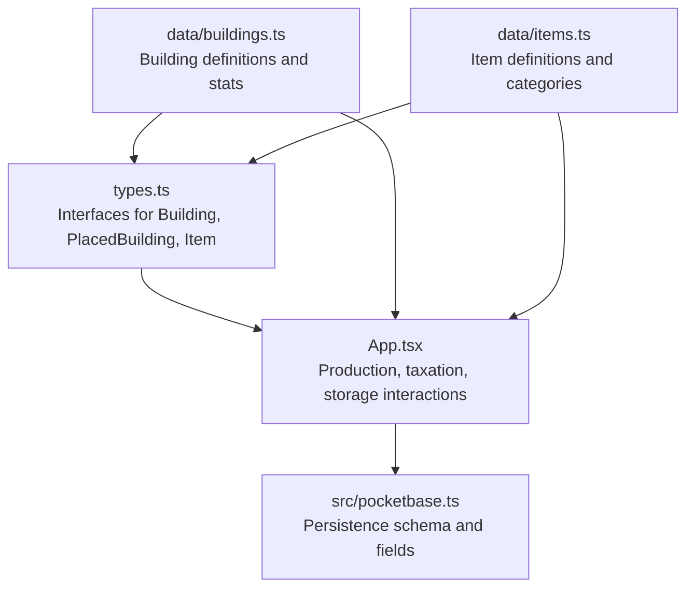
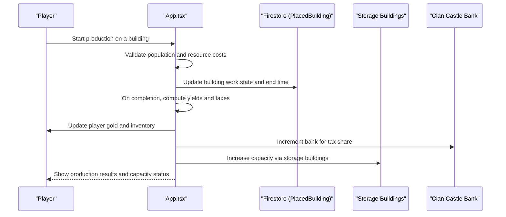
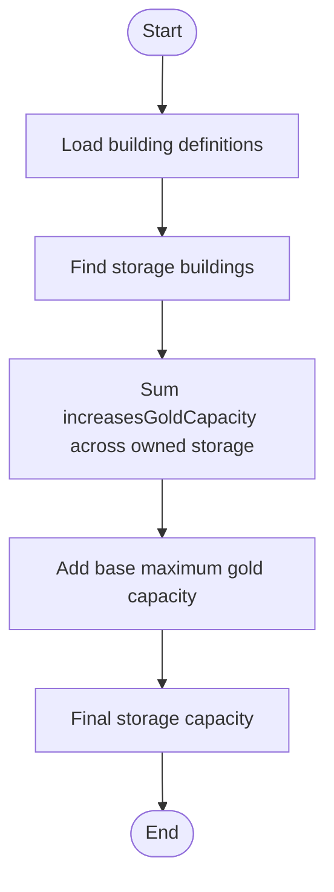
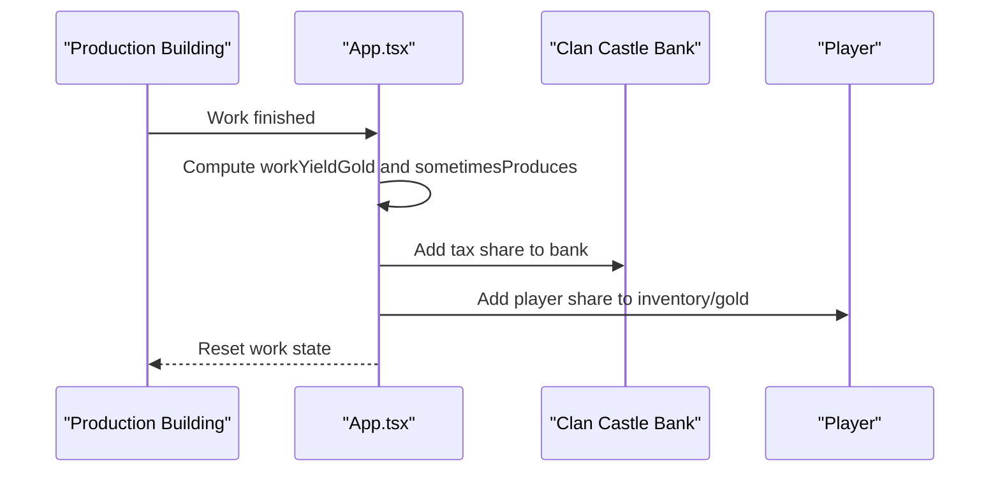
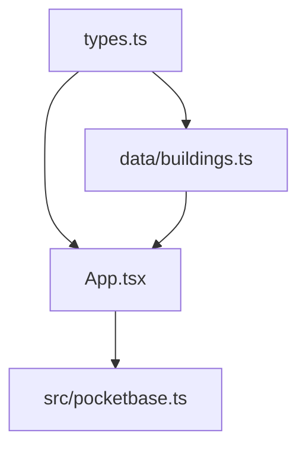

# Storage Systems

<cite>
**Referenced Files in This Document**
- [buildings.ts](file://data/buildings.ts)
- [items.ts](file://data/items.ts)
- [types.ts](file://types.ts)
- [App.tsx](file://App.tsx)
- [pocketbase.ts](file://src/pocketbase.ts)
</cite>

## Table of Contents
1. [Introduction](#introduction)
2. [Project Structure](#project-structure)
3. [Core Components](#core-components)
4. [Architecture Overview](#architecture-overview)
5. [Detailed Component Analysis](#detailed-component-analysis)
6. [Dependency Analysis](#dependency-analysis)
7. [Performance Considerations](#performance-considerations)
8. [Troubleshooting Guide](#troubleshooting-guide)
9. [Conclusion](#conclusion)

## Introduction
This document explains the storage system mechanics across the game, focusing on capacity management, resource accumulation, overflow handling, and the storage hierarchy from individual buildings to clan-wide storage networks. It covers:
- Storage capacity calculations for different building types
- Warehouse and storage building mechanics
- Resource depot and tax collection behavior
- Automatic resource transfer and redistribution strategies
- Storage optimization algorithms and capacity utilization tracking
- Examples of preventing overflow, redistributing resources, and expanding storage
- Relationship between storage capacity and production scaling, including economic bottlenecks

## Project Structure
The storage system spans several core files:
- Data definitions for buildings and items
- Type definitions for building stats and game entities
- Application logic for production, taxation, and storage interactions
- Persistence layer for player and building state

**Diagram sources**
- [buildings.ts](file://data/buildings.ts)
- [items.ts](file://data/items.ts)
- [types.ts](file://types.ts)
- [App.tsx](file://App.tsx)
- [pocketbase.ts](file://src/pocketbase.ts)

**Section sources**
- [buildings.ts](file://data/buildings.ts)
- [items.ts](file://data/items.ts)
- [types.ts](file://types.ts)
- [App.tsx](file://App.tsx)
- [pocketbase.ts](file://src/pocketbase.ts)

## Core Components
- Storage buildings increase the maximum gold capacity and optionally provide other capacities (e.g., energy).
- Production buildings consume resources, produce goods, and yield gold or items.
- Tax collection routes production earnings to clan castles and players.
- Player inventory tracks carried resources and gold.
- Persistence stores building state, including bank balances for clan castles.

Key storage-related fields:
- Building stats: increasesGoldCapacity, increasesEnergyCapacity, capacity, bandCapacity
- PlacedBuilding: bank (gold stored in buildings)
- Player inventory and gold tracked via persistence fields

Examples of storage-capacity-increasing buildings:
- Gold Storage (small capacity)
- Coin Storage (medium capacity)
- Coin Storage 2 (larger capacity)
- Coin Storage 3 (even larger capacity)

These are defined as Storage-type buildings and expose increasesGoldCapacity in their stats.

**Section sources**
- [buildings.ts](file://data/buildings.ts)
- [types.ts](file://types.ts)
- [pocketbase.ts](file://src/pocketbase.ts)

## Architecture Overview
The storage system integrates building definitions, production logic, taxation, and persistence.

**Diagram sources**
- [App.tsx](file://App.tsx)
- [buildings.ts](file://data/buildings.ts)
- [types.ts](file://types.ts)

## Detailed Component Analysis

### Storage Capacity Mechanics
- Storage buildings define increasesGoldCapacity to expand maximum gold capacity.
- The base maximum gold capacity is defined in constants.
- Storage buildings can be upgraded to further increase capacity.

**Diagram sources**
- [buildings.ts](file://data/buildings.ts)
- [App.tsx](file://App.tsx)

**Section sources**
- [buildings.ts](file://data/buildings.ts)
- [App.tsx](file://App.tsx)

### Resource Depot and Tax Collection
- Production buildings can yield gold and produce items.
- A portion of gold may be routed to the nearest clan castle’s bank as tax.
- Player receives their share after tax deduction.

**Diagram sources**
- [App.tsx](file://App.tsx)
- [buildings.ts](file://data/buildings.ts)

**Section sources**
- [App.tsx](file://App.tsx)
- [buildings.ts](file://data/buildings.ts)

### Automatic Resource Transfer and Redistribution
- The game does not implement an explicit automatic transfer system between buildings.
- Players can manually manage production and storage by selecting buildings and triggering actions.
- Tax collection is automatic when production completes near a clan castle.

Practical redistribution strategies:
- Upgrade storage buildings to increase capacity before ramping production.
- Temporarily pause high-consumption production if storage is near capacity.
- Use clan castle bank to accumulate gold during peak production periods.

**Section sources**
- [App.tsx](file://App.tsx)
- [buildings.ts](file://data/buildings.ts)

### Storage Expansion Mechanics
- Storage buildings can be upgraded to larger variants with higher increasesGoldCapacity.
- Upgrading requires resources and population as per construction requirements.
- Base maximum gold capacity is a constant and is additive with storage building increases.

Concrete examples:
- Gold Storage → Coin Storage → Coin Storage 2 → Coin Storage 3
- Each step increases the effective storage capacity for gold.

**Section sources**
- [buildings.ts](file://data/buildings.ts)
- [App.tsx](file://App.tsx)

### Overflow Prevention Strategies
- Monitor inventory and storage capacity before starting production.
- If storage is nearly full, reduce production or upgrade storage.
- Use tax collection to offload gold into clan castle bank temporarily.

**Section sources**
- [App.tsx](file://App.tsx)
- [buildings.ts](file://data/buildings.ts)

### Relationship Between Storage and Production Scaling
- Storage limits can create bottlenecks when production outpaces capacity.
- To scale production effectively, ensure storage capacity grows alongside production throughput.
- Population and resource consumption constraints also affect production feasibility.

**Section sources**
- [App.tsx](file://App.tsx)
- [buildings.ts](file://data/buildings.ts)

## Dependency Analysis
Storage system dependencies:
- Building definitions depend on types for stats and categories.
- Production and taxation logic depends on building definitions and PlacedBuilding persistence.
- Player inventory and gold are persisted via the backend schema.

**Diagram sources**
- [types.ts](file://types.ts)
- [buildings.ts](file://data/buildings.ts)
- [App.tsx](file://App.tsx)
- [pocketbase.ts](file://src/pocketbase.ts)

**Section sources**
- [types.ts](file://types.ts)
- [buildings.ts](file://data/buildings.ts)
- [App.tsx](file://App.tsx)
- [pocketbase.ts](file://src/pocketbase.ts)

## Performance Considerations
- Frequent updates to building work states and tax collections should be batched where possible.
- Limit unnecessary Firestore writes by consolidating state changes.
- Use client-side caching for building and item definitions to minimize repeated reads.

## Troubleshooting Guide
Common issues and resolutions:
- Storage overflow: Reduce production rate or upgrade storage buildings.
- Insufficient population or resources: Verify construction requirements and adjust accordingly.
- Tax not appearing in clan castle: Ensure the building is placed within the correct zone and is not under construction.

**Section sources**
- [App.tsx](file://App.tsx)
- [buildings.ts](file://data/buildings.ts)

## Conclusion
The storage system centers on storage buildings that increase maximum gold capacity, combined with production and taxation mechanics. Effective scaling requires balancing production throughput with storage capacity and leveraging tax collection to manage gold accumulation. While there is no explicit automatic transfer mechanism, manual management and strategic upgrades provide robust control over resource flow and prevent overflow.