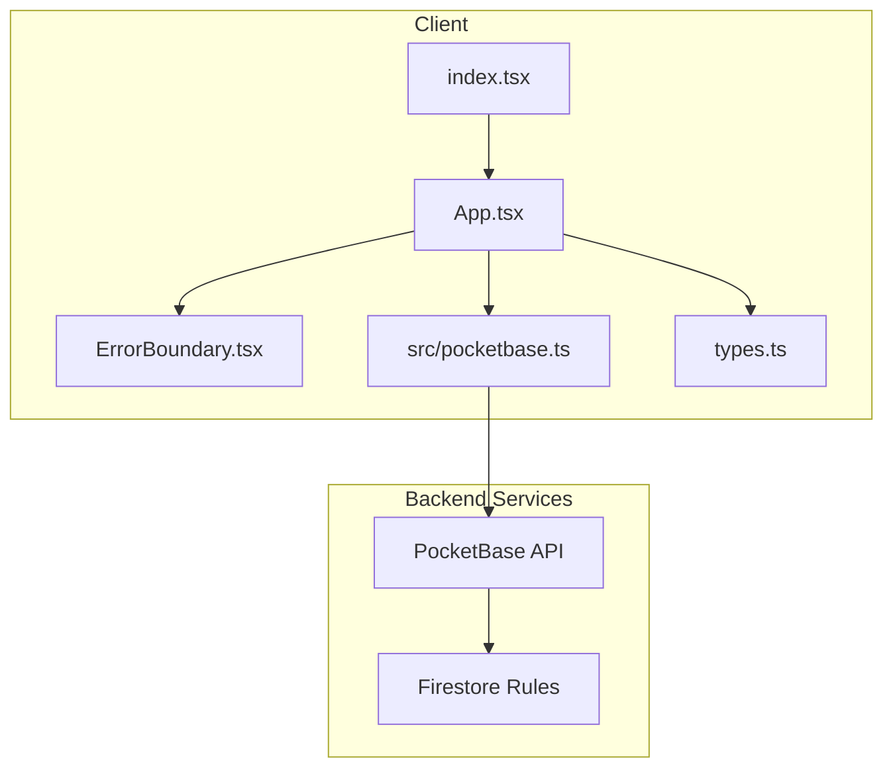
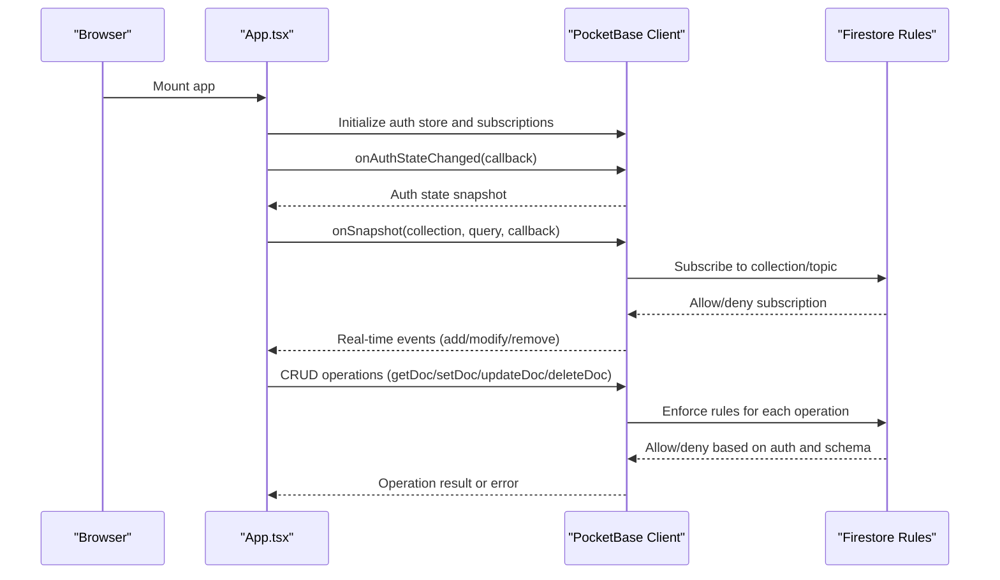
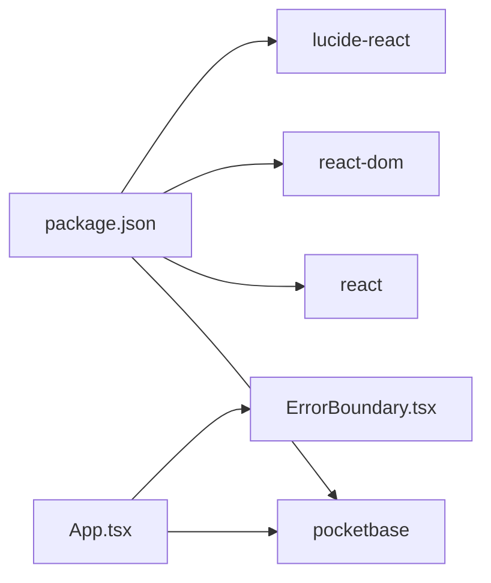

# Security Considerations

<cite>
**Referenced Files in This Document**
- [pocketbase.ts](file://src/pocketbase.ts)
- [firestore.rules](file://firestore.rules)
- [App.tsx](file://App.tsx)
- [ErrorBoundary.tsx](file://components/ErrorBoundary.tsx)
- [types.ts](file://types.ts)
- [index.tsx](file://index.tsx)
- [package.json](file://package.json)
- [check_rules.mjs](file://check_rules.mjs)
- [README.md](file://README.md)
</cite>

## Table of Contents
1. [Introduction](#introduction)
2. [Project Structure](#project-structure)
3. [Core Components](#core-components)
4. [Architecture Overview](#architecture-overview)
5. [Detailed Component Analysis](#detailed-component-analysis)
6. [Dependency Analysis](#dependency-analysis)
7. [Performance Considerations](#performance-considerations)
8. [Troubleshooting Guide](#troubleshooting-guide)
9. [Conclusion](#conclusion)
10. [Appendices](#appendices)

## Introduction
This document consolidates the security posture of the Basingsemmorpg application with a focus on authentication, authorization, data validation, real-time synchronization safety, and operational controls. It explains how PocketBase and Firestore rules collaborate to protect game data, outlines safeguards against common web vulnerabilities, and provides practical guidance for extending and hardening security as the application evolves.

## Project Structure
Security-relevant areas of the codebase include:
- Authentication and session management via PocketBase
- Firestore security rules enforcing access control and data validation
- A thin Firestore-compatible wrapper around PocketBase
- Real-time subscriptions with throttling and stale-client handling
- An error boundary to surface and manage errors gracefully
- Application entrypoint and dependencies

**Diagram sources**
- [index.tsx:1-20](file://index.tsx#L1-L20)
- [App.tsx:1-10](file://App.tsx#L1-L10)
- [ErrorBoundary.tsx:1-78](file://components/ErrorBoundary.tsx#L1-L78)
- [pocketbase.ts:1-120](file://src/pocketbase.ts#L1-L120)
- [types.ts:1-20](file://types.ts#L1-L20)

**Section sources**
- [index.tsx:1-20](file://index.tsx#L1-L20)
- [package.json:1-31](file://package.json#L1-L31)

## Core Components
- Authentication and Authorization
  - PocketBase-backed auth store with automatic token refresh and change listeners
  - Helpers mirroring Firebase auth APIs for user sign-in/sign-out and state observation
  - Admin detection via email claim and user role fields
- Data Access Layer
  - Firestore-compatible wrappers around PocketBase collections
  - Strict sanitization of record IDs to a fixed length and character set
  - Data transformation helpers to normalize fields and merge free-form data into a structured JSON field
- Real-Time Subscriptions
  - Staggered and throttled collection subscriptions to mitigate “subscription storms”
  - Robust retry logic for stale client IDs
- Error Handling
  - Centralized error logging and user-visible messaging via an error boundary
- Data Validation
  - Firestore rules define strict shape and domain checks for all collections
  - Admin bypass gates are constrained and auditable

**Section sources**
- [pocketbase.ts:14-121](file://src/pocketbase.ts#L14-L121)
- [pocketbase.ts:252-276](file://src/pocketbase.ts#L252-L276)
- [pocketbase.ts:578-707](file://src/pocketbase.ts#L578-L707)
- [firestore.rules:60-96](file://firestore.rules#L60-L96)
- [firestore.rules:102-236](file://firestore.rules#L102-L236)
- [ErrorBoundary.tsx:14-78](file://components/ErrorBoundary.tsx#L14-L78)

## Architecture Overview
The client authenticates with PocketBase and interacts with Firestore via PocketBase’s Firestore-compatible APIs. Firestore rules enforce fine-grained access control and data validation. Real-time subscriptions are managed with built-in resilience to transient failures.

**Diagram sources**
- [App.tsx:720-747](file://App.tsx#L720-L747)
- [pocketbase.ts:578-707](file://src/pocketbase.ts#L578-L707)
- [firestore.rules:242-354](file://firestore.rules#L242-L354)

## Detailed Component Analysis

### Authentication Flow Using PocketBase
- Initialization
  - A PocketBase client is created pointing to a reachable endpoint, with auto-cancellation disabled to keep tokens alive.
- Auth state management
  - A Firebase-like auth store is exposed, with helpers for sign-in, sign-up, sign-out, and onAuthStateChanged callbacks.
- User conversion
  - Internal mapping converts PocketBase records to a normalized user object, caching to minimize churn.
- OAuth support
  - Google OAuth is supported via PocketBase’s OAuth2 provider, ensuring downstream user documents exist.

Security considerations:
- Token lifecycle is managed centrally; disabling auto-cancellation reduces accidental logout during long sessions.
- The auth store change handler ensures UI reacts to login/logout promptly.
- OAuth providers require a real domain; the code references a dynamic DNS approach suitable for development.

**Section sources**
- [pocketbase.ts:8-14](file://src/pocketbase.ts#L8-L14)
- [pocketbase.ts:18-37](file://src/pocketbase.ts#L18-L37)
- [pocketbase.ts:83-98](file://src/pocketbase.ts#L83-L98)
- [pocketbase.ts:107-121](file://src/pocketbase.ts#L107-L121)
- [pocketbase.ts:50-78](file://src/pocketbase.ts#L50-L78)

### Authorization Patterns and Firestore Rules
Firestore rules define:
- Authentication gatekeepers (isAuthenticated, isOwner, isAdmin)
- Domain validators for each collection’s schema and semantics
- Granular allow statements for reads/writes/deletes per collection

Key enforcement points:
- Users: read allowed; create/update require ownership or admin; delete reserved for admins
- Buildings: create/update/delete gated by ownership, admin, or special-case game-owned entities; restricted field updates enforced
- Market, Clans, Chat, Private Messages, Presence, Map Resources, Dropped Items: tailored allow rules with domain validations
- Admin detection: via verified email claim or user role fields

Operational notes:
- Admin bypasses are explicit and auditable via helper functions.
- Domain validators ensure only allowed fields are present and typed correctly.

**Section sources**
- [firestore.rules:60-96](file://firestore.rules#L60-L96)
- [firestore.rules:102-236](file://firestore.rules#L102-L236)
- [firestore.rules:246-291](file://firestore.rules#L246-L291)
- [firestore.rules:293-298](file://firestore.rules#L293-L298)
- [firestore.rules:300-309](file://firestore.rules#L300-L309)
- [firestore.rules:317-324](file://firestore.rules#L317-L324)
- [firestore.rules:326-330](file://firestore.rules#L326-L330)
- [firestore.rules:332-342](file://firestore.rules#L332-L342)
- [firestore.rules:344-348](file://firestore.rules#L344-L348)

### Data Validation Strategies
- Client-side ID normalization
  - All record IDs are sanitized to a strict 15-character alphanumeric form to prevent schema leakage and ID collision risks.
- Data wrapping/unwrapping
  - Arbitrary game data is moved into a dedicated JSON field while top-level fields remain strictly typed and validated by Firestore rules.
- Type restoration
  - Numeric fields are restored to numbers after retrieval to preserve game logic expectations.
- Timestamp normalization
  - Creation timestamps are mapped to a consistent field for cross-collection compatibility.

These transformations reduce risk by:
- Preventing accidental schema drift
- Ensuring only validated fields reach the backend
- Maintaining deterministic typing for numeric fields

**Section sources**
- [pocketbase.ts:252-276](file://src/pocketbase.ts#L252-L276)
- [pocketbase.ts:165-218](file://src/pocketbase.ts#L165-L218)

### Real-Time Database Security Considerations
- Subscription resilience
  - Subscriptions are retried on stale client ID errors with exponential backoff-like delays.
  - Initial fetch is separated from subscription to avoid redundant loads.
- Throttling
  - Collection updates are throttled to reduce load spikes and improve stability under concurrent changes.
- Ownership and scope
  - Subscriptions operate within the bounds of Firestore rules; unauthorized topics are rejected by the backend.

Practical implications:
- Real-time updates are safe from unauthorized manipulation because they are filtered by rules.
- Stale client handling prevents cascading failures during reconnect storms.

**Section sources**
- [pocketbase.ts:587-621](file://src/pocketbase.ts#L587-L621)
- [pocketbase.ts:678-700](file://src/pocketbase.ts#L678-L700)

### API Security and Abuse Prevention
- Backend enforcement
  - All client actions pass through PocketBase, which enforces Firestore rules; there is no direct API bypass.
- Admin controls
  - Admin detection supports targeted moderation and administrative overrides with explicit checks.
- Operational scripts
  - A script demonstrates how to inspect collection rules programmatically, aiding audits and compliance checks.

Recommendations:
- Rate limiting should be considered at the PocketBase ingress layer if traffic spikes occur.
- Consider adding request quotas or abuse detection hooks in PocketBase for high-frequency operations.

**Section sources**
- [firestore.rules:68-74](file://firestore.rules#L68-L74)
- [check_rules.mjs:1-17](file://check_rules.mjs#L1-L17)

### Vulnerability Mitigation Guidance
- SQL injection
  - The backend is Firestore/PocketBase, not SQL; schema validation and allow lists in rules prevent malicious mutations.
- XSS
  - Client-side rendering should sanitize user-generated content. The codebase does not include dedicated sanitization utilities; consider adding a library for HTML sanitization in UI components that render untrusted text.
- CSRF
  - The application relies on browser cookies and PocketBase auth; CSRF protections are implicit via SameSite cookies and origin policies. No custom CSRF tokens are implemented in the client code.

Note: The above guidance is conceptual and not tied to specific code lines.

### Secure Coding Practices Observed
- Centralized error handling and logging
  - A shared error handler logs operation type, path, and validation details; the error boundary surfaces user-friendly messages.
- Defensive ID handling
  - All IDs are sanitized before use to a strict format.
- Controlled mutation paths
  - CRUD helpers encapsulate wrapping/unwrapping and error handling, reducing ad-hoc mistakes.

**Section sources**
- [pocketbase.ts:787-816](file://src/pocketbase.ts#L787-L816)
- [ErrorBoundary.tsx:24-48](file://components/ErrorBoundary.tsx#L24-L48)
- [pocketbase.ts:252-276](file://src/pocketbase.ts#L252-L276)

## Dependency Analysis
- Client dependencies include React, PocketBase SDK, and UI libraries. There is no direct dependency on Firebase SDK; Firestore rules are enforced by PocketBase.
- The application mounts inside an ErrorBoundary to capture and display errors.

**Diagram sources**
- [package.json:12-30](file://package.json#L12-L30)
- [index.tsx:1-20](file://index.tsx#L1-20)

**Section sources**
- [package.json:12-30](file://package.json#L12-L30)
- [index.tsx:1-20](file://index.tsx#L1-20)

## Performance Considerations
- Real-time throttling reduces update frequency and minimizes network overhead.
- Chunked deletion operations prevent server overload when clearing large collections.
- Staggered subscriptions reduce initial load spikes.

[No sources needed since this section provides general guidance]

## Troubleshooting Guide
Common issues and remedies:
- Permission denied errors
  - The centralized error handler logs permission denials and suggests checking collection rules.
- Stale client ID during real-time subscriptions
  - The subscription logic retries with backoff and jitter; ensure clients are not rapidly disconnecting/reconnecting.
- Unexpected race conditions in game loops
  - The application ignores benign permission and not-found errors during periodic updates to avoid noisy logs.

**Section sources**
- [pocketbase.ts:787-816](file://src/pocketbase.ts#L787-L816)
- [pocketbase.ts:587-621](file://src/pocketbase.ts#L587-L621)
- [App.tsx:27-33](file://App.tsx#L27-L33)

## Conclusion
The Basingsemmorpg application employs a layered security model: PocketBase manages authentication and session state, Firestore rules enforce strict access control and data validation, and the client code centralizes error handling and resilient real-time subscriptions. While the backend is not SQL-based, the same principles of least privilege, input validation, and auditability apply. Extending security should focus on robust error surfacing, rate limiting at ingress, and defensive rendering practices for user-generated content.

## Appendices

### Appendix A: Data Models and Validation Boundaries
- Users: validated fields include identifiers, level, glory, energy, reputation, inventory, currency balances, and optional role/avatar.
- Buildings: validated fields include coordinates, type, owner, and optional stats; admin or owner-only updates are permitted.
- Market listings, clans, chat, private messages, presence, map resources, and dropped items: each has tailored validators and allow rules.

**Section sources**
- [firestore.rules:102-236](file://firestore.rules#L102-L236)
- [firestore.rules:246-291](file://firestore.rules#L246-L291)
- [firestore.rules:293-298](file://firestore.rules#L293-L298)
- [firestore.rules:300-309](file://firestore.rules#L300-L309)
- [firestore.rules:317-324](file://firestore.rules#L317-L324)
- [firestore.rules:326-330](file://firestore.rules#L326-L330)
- [firestore.rules:332-342](file://firestore.rules#L332-L342)
- [firestore.rules:344-348](file://firestore.rules#L344-L348)

### Appendix B: Example Secure Operations
- Creating a user document
  - Use the sign-up helper to register and immediately authenticate; the backend validates required fields and roles.
- Updating a building
  - Use the update helper to compute incremental changes; only allowed fields are persisted, and ownership/admin checks are enforced.
- Real-time subscription
  - Use the onSnapshot helper to subscribe to a scoped query; the client handles retries and throttling.

**Section sources**
- [pocketbase.ts:26-37](file://src/pocketbase.ts#L26-L37)
- [pocketbase.ts:358-426](file://src/pocketbase.ts#L358-L426)
- [pocketbase.ts:578-707](file://src/pocketbase.ts#L578-L707)