# Chat System

<cite>
**Referenced Files in This Document**
- [App.tsx](file://App.tsx)
- [pocketbase.ts](file://src/pocketbase.ts)
- [index.tsx](file://index.tsx)
- [README.md](file://README.md)
</cite>

## Table of Contents
1. [Introduction](#introduction)
2. [Project Structure](#project-structure)
3. [Core Components](#core-components)
4. [Architecture Overview](#architecture-overview)
5. [Detailed Component Analysis](#detailed-component-analysis)
6. [Dependency Analysis](#dependency-analysis)
7. [Performance Considerations](#performance-considerations)
8. [Troubleshooting Guide](#troubleshooting-guide)
9. [Conclusion](#conclusion)

## Introduction
This document provides comprehensive documentation for the chat system implementation in the game. It covers the multi-channel chat architecture with general, banya, loot, and clan tabs, real-time messaging with instant synchronization, message history management, user presence indicators, emoji integration, moderation features, the shout system for global announcements, location sharing mechanics, and private messaging capabilities. It also explains the integration with the real-time database for synchronized chat experiences and the challenges of maintaining message consistency across multiple concurrent users.

## Project Structure
The chat system is implemented primarily in the main application file (`App.tsx`) and integrates with a compatibility layer for the real-time database (`src/pocketbase.ts`). The application bootstraps via `index.tsx`, and the project includes supporting UI components and data models.

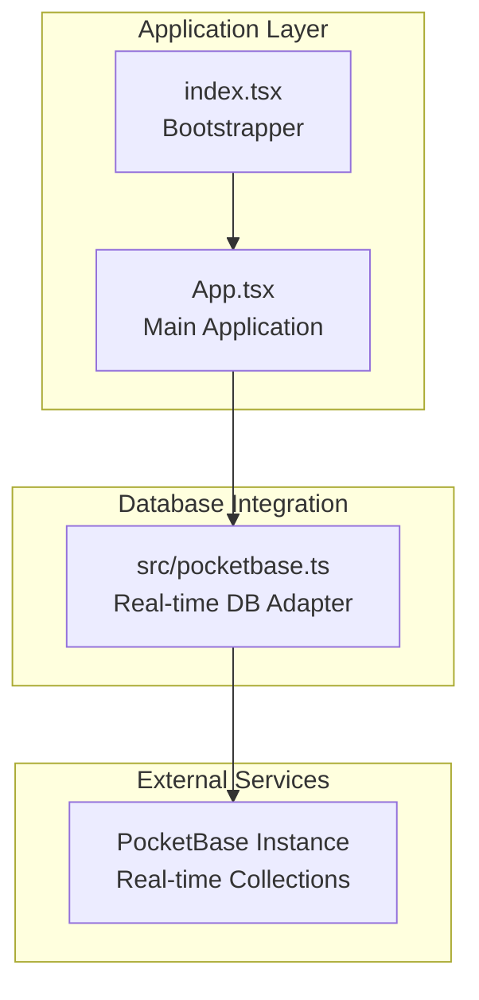

**Diagram sources**
- [index.tsx:1-20](file://index.tsx#L1-L20)
- [App.tsx:1-200](file://App.tsx#L1-L200)
- [pocketbase.ts:1-120](file://src/pocketbase.ts#L1-L120)

**Section sources**
- [index.tsx:1-20](file://index.tsx#L1-L20)
- [App.tsx:1-200](file://App.tsx#L1-L200)
- [pocketbase.ts:1-120](file://src/pocketbase.ts#L1-L120)

## Core Components
- Multi-channel chat architecture with four tabs: general, banya, loot, and clan.
- Real-time message synchronization using a real-time database adapter.
- Message history management with filtering by channel and clan membership.
- User presence indicators with tab awareness and location tracking.
- Emoji integration using classic-style smileys.
- Moderation features including bans, punishments, curses, and reputation actions.
- Shout system for global announcements with resource costs.
- Location sharing with cooldown and teleport coordinates.
- Private messaging with anonymous mode and mail integration.

**Section sources**
- [App.tsx:159-175](file://App.tsx#L159-L175)
- [App.tsx:355-382](file://App.tsx#L355-L382)
- [App.tsx:1841-1862](file://App.tsx#L1841-L1862)
- [App.tsx:1864-1901](file://App.tsx#L1864-L1901)
- [App.tsx:1936-1993](file://App.tsx#L1936-L1993)
- [App.tsx:141-156](file://App.tsx#L141-L156)
- [App.tsx:5520-5597](file://App.tsx#L5520-L5597)
- [App.tsx:5617-5647](file://App.tsx#L5617-L5647)
- [App.tsx:5500-5511](file://App.tsx#L5500-L5511)

## Architecture Overview
The chat system uses a real-time database adapter to subscribe to collections and synchronize messages instantly. The main application manages state for chat history, active tab, presence, and moderation features. The adapter handles connection management, subscription retries, and data transformation between the game's internal models and the database schema.

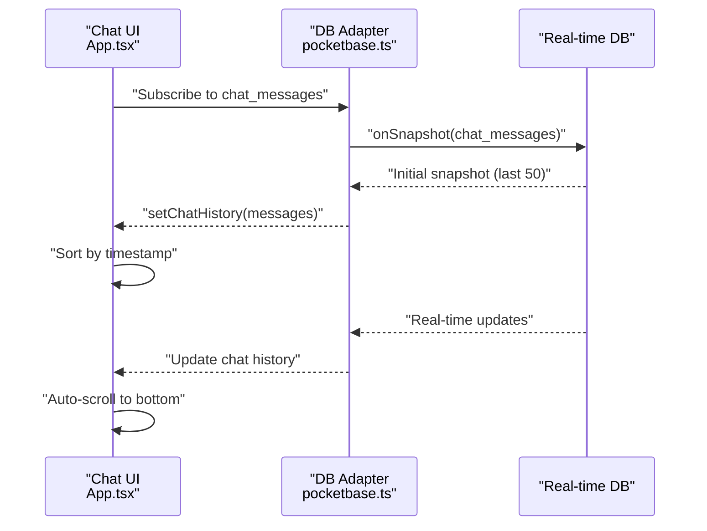

**Diagram sources**
- [App.tsx:1841-1862](file://App.tsx#L1841-L1862)
- [pocketbase.ts:571-707](file://src/pocketbase.ts#L571-L707)

**Section sources**
- [App.tsx:1841-1862](file://App.tsx#L1841-L1862)
- [pocketbase.ts:571-707](file://src/pocketbase.ts#L571-L707)

## Detailed Component Analysis

### Multi-Channel Chat Architecture
The chat system defines four channels: general, banya, loot, and clan. Each message includes a tab identifier and, for clan messages, a clan ID. Filtering logic ensures users only see messages appropriate to their current tab and clan membership.

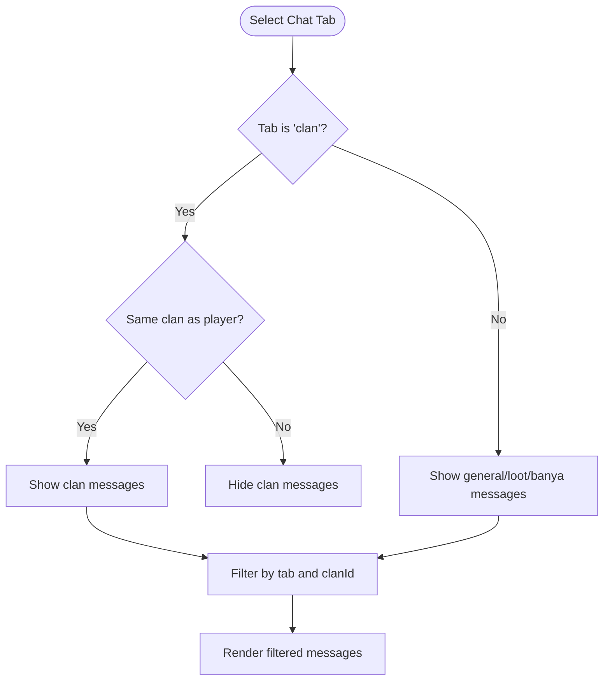

**Diagram sources**
- [App.tsx:5797-5804](file://App.tsx#L5797-L5804)

**Section sources**
- [App.tsx:159-175](file://App.tsx#L159-L175)
- [App.tsx:5797-5804](file://App.tsx#L5797-L5804)

### Real-Time Messaging and Synchronization
Real-time synchronization is achieved through a subscription mechanism that listens to the chat_messages collection. The adapter performs an initial fetch and then subscribes to real-time updates with throttling to prevent excessive refreshes.

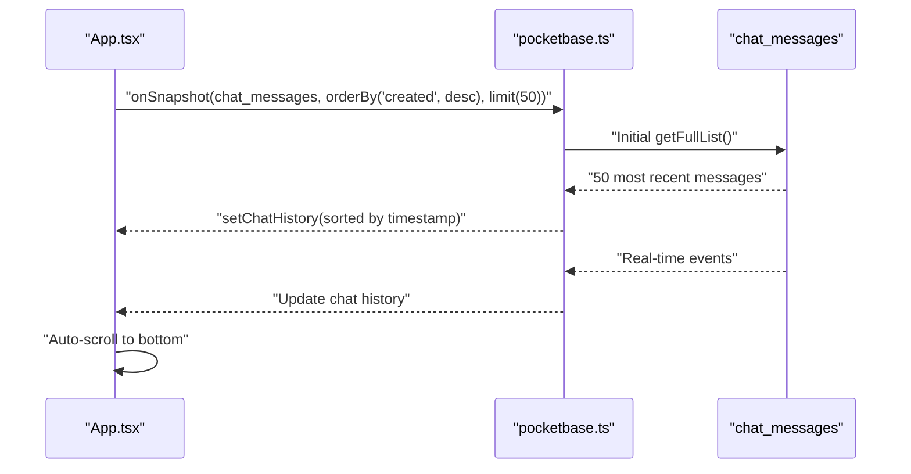

**Diagram sources**
- [App.tsx:1841-1862](file://App.tsx#L1841-L1862)
- [pocketbase.ts:571-707](file://src/pocketbase.ts#L571-L707)

**Section sources**
- [App.tsx:1841-1862](file://App.tsx#L1841-L1862)
- [pocketbase.ts:571-707](file://src/pocketbase.ts#L571-L707)

### Message History Management
Message history is maintained in state and includes both system messages and real-time chat messages. The system ensures that system messages remain visible while appending newly received messages in chronological order.

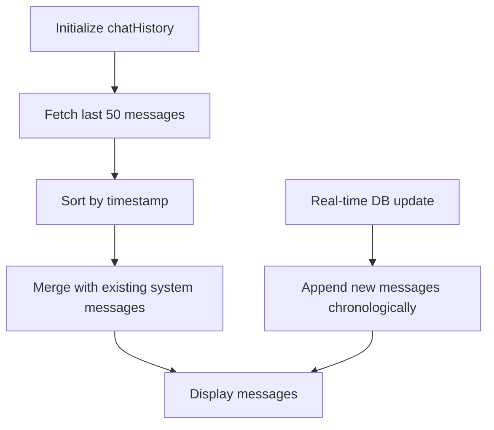

**Diagram sources**
- [App.tsx:1841-1862](file://App.tsx#L1841-L1862)

**Section sources**
- [App.tsx:1841-1862](file://App.tsx#L1841-L1862)

### User Presence Indicators
Presence is tracked via a dedicated collection and updated periodically. The system captures the active tab, coordinates, level, glory, reputation, avatar, and active curse effects. Online users are filtered by activity thresholds and clan membership for the clan tab.

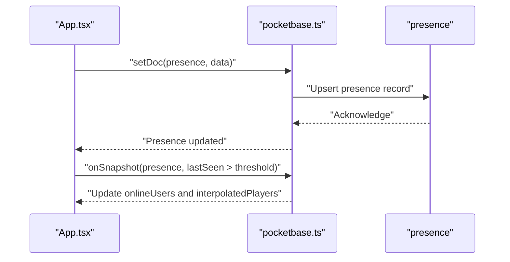

**Diagram sources**
- [App.tsx:1864-1901](file://App.tsx#L1864-L1901)
- [App.tsx:1936-1993](file://App.tsx#L1936-L1993)
- [pocketbase.ts:571-707](file://src/pocketbase.ts#L571-L707)

**Section sources**
- [App.tsx:1864-1901](file://App.tsx#L1864-L1901)
- [App.tsx:1936-1993](file://App.tsx#L1936-L1993)
- [pocketbase.ts:571-707](file://src/pocketbase.ts#L571-L707)

### Emoji Integration
The system supports classic-style emoji integration using a predefined set of smileys. Users can select emojis from a picker, which appends the emoji code to the chat input. The display logic converts emoji codes into inline images during rendering.

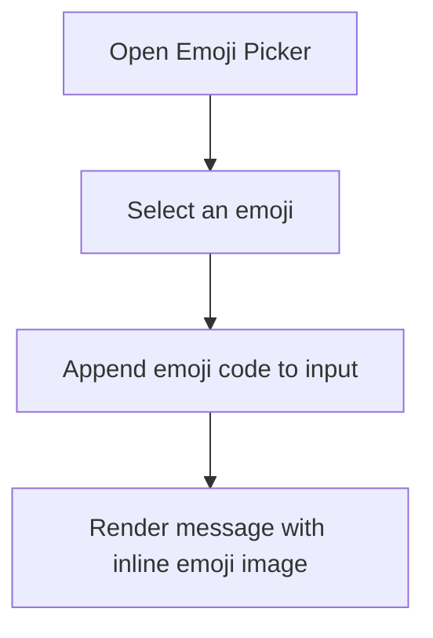

**Diagram sources**
- [App.tsx:141-156](file://App.tsx#L141-L156)
- [App.tsx:5649-5667](file://App.tsx#L5649-L5667)
- [App.tsx:8121-8133](file://App.tsx#L8121-L8133)

**Section sources**
- [App.tsx:141-156](file://App.tsx#L141-L156)
- [App.tsx:5649-5667](file://App.tsx#L5649-L5667)
- [App.tsx:8121-8133](file://App.tsx#L8121-L8133)

### Moderation Features
Moderation includes bans, punishments, curses, and reputation actions. Bans can be applied for varying durations with associated costs. Punishments and curses require in-game resources. Reputation actions allow players to praise or complain about others.

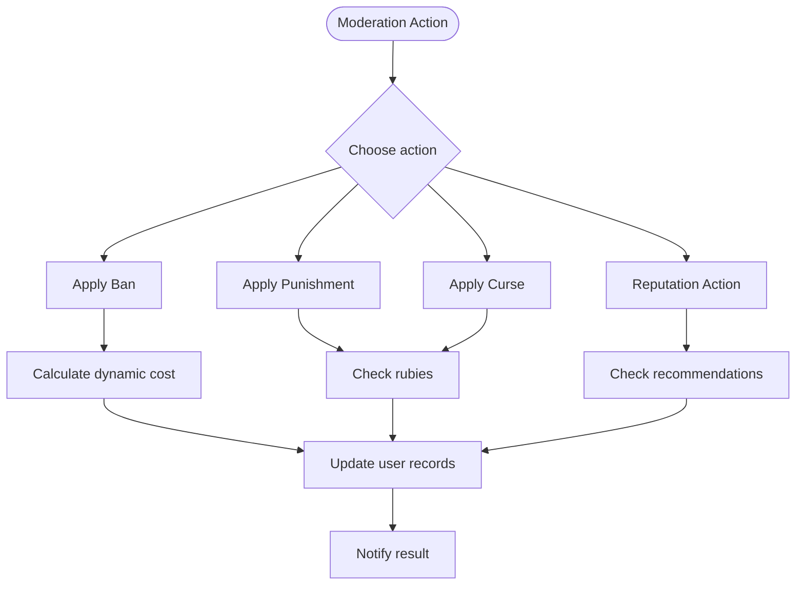

**Diagram sources**
- [App.tsx:2348-2399](file://App.tsx#L2348-L2399)
- [App.tsx:2276-2347](file://App.tsx#L2276-L2347)
- [App.tsx:2377-2399](file://App.tsx#L2377-L2399)

**Section sources**
- [App.tsx:2348-2399](file://App.tsx#L2348-L2399)
- [App.tsx:2276-2347](file://App.tsx#L2276-L2347)
- [App.tsx:2377-2399](file://App.tsx#L2377-L2399)

### Shout System for Global Announcements
The shout system allows players to send messages visible to all channels. It requires gold and energy as costs and displays a confirmation modal before sending.

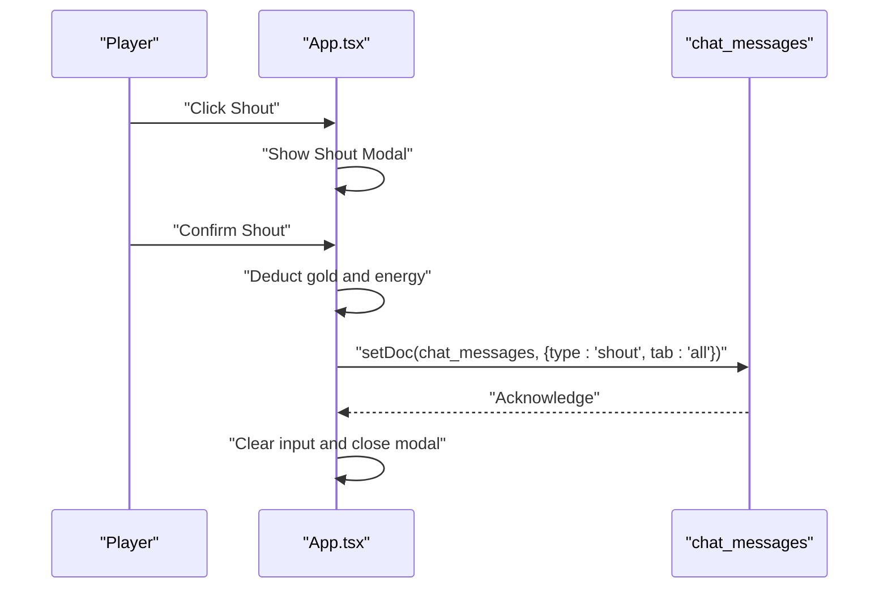

**Diagram sources**
- [App.tsx:5556-5597](file://App.tsx#L5556-L5597)

**Section sources**
- [App.tsx:5556-5597](file://App.tsx#L5556-L5597)

### Location Sharing Mechanics
Location sharing sends a message containing teleport coordinates derived from the player's current screen-to-world position. A cooldown prevents spamming.

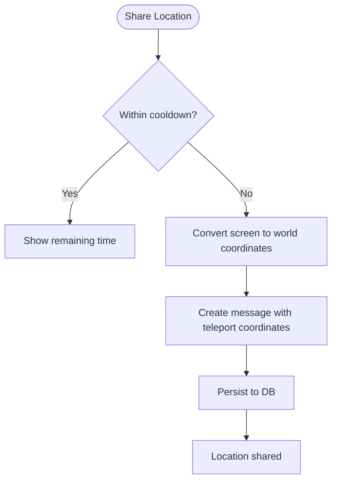

**Diagram sources**
- [App.tsx:5617-5647](file://App.tsx#L5617-L5647)

**Section sources**
- [App.tsx:5617-5647](file://App.tsx#L5617-L5647)

### Private Messaging Capabilities
Private messaging supports anonymous mode, with separate chat IDs for anonymous conversations. The mail interface aggregates private chats and shows unread counts.

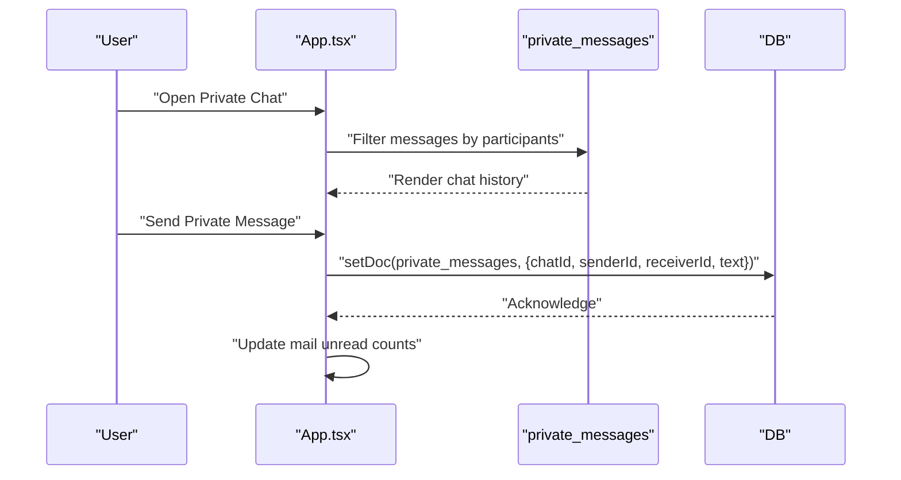

**Diagram sources**
- [App.tsx:5500-5511](file://App.tsx#L5500-L5511)
- [App.tsx:5835-5859](file://App.tsx#L5835-L5859)

**Section sources**
- [App.tsx:5500-5511](file://App.tsx#L5500-L5511)
- [App.tsx:5835-5859](file://App.tsx#L5835-L5859)

## Dependency Analysis
The chat system relies on several key dependencies and integration points:
- Real-time database adapter for subscriptions and mutations
- Authentication integration for user identification
- Presence tracking for user availability and location
- Moderation systems for administrative controls

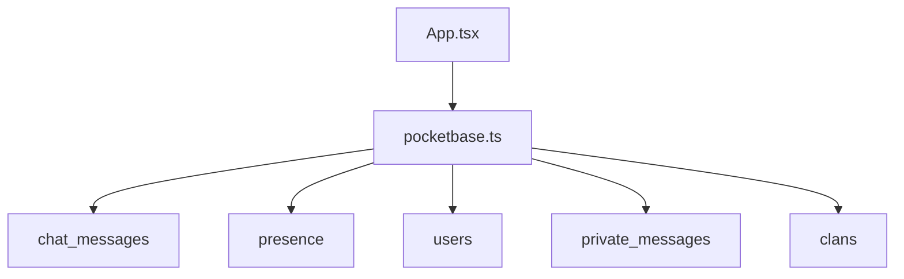

**Diagram sources**
- [App.tsx:1-200](file://App.tsx#L1-L200)
- [pocketbase.ts:150-161](file://src/pocketbase.ts#L150-L161)

**Section sources**
- [App.tsx:1-200](file://App.tsx#L1-L200)
- [pocketbase.ts:150-161](file://src/pocketbase.ts#L150-L161)

## Performance Considerations
- Subscription throttling reduces the frequency of real-time updates to prevent UI thrashing.
- Initial fetch limits minimize the payload for first-load scenarios.
- Presence updates use periodic heartbeats with reasonable intervals to balance responsiveness and bandwidth.
- Auto-scrolling occurs only when necessary to avoid unnecessary re-renders.

[No sources needed since this section provides general guidance]

## Troubleshooting Guide
Common issues and resolutions:
- Real-time subscription failures: The adapter includes retry logic for stale client IDs and logs errors for diagnosis.
- Presence errors: Presence updates are wrapped to prevent game flow interruptions.
- Message ordering: Sorting by timestamp ensures chronological display.
- Moderation conflicts: Dynamic cost calculations and resource checks prevent invalid operations.

**Section sources**
- [pocketbase.ts:587-621](file://src/pocketbase.ts#L587-L621)
- [App.tsx:1890-1892](file://App.tsx#L1890-L1892)
- [App.tsx:1854-1858](file://App.tsx#L1854-L1858)
- [App.tsx:2377-2399](file://App.tsx#L2377-L2399)

## Conclusion
The chat system provides a robust, real-time communication layer with multi-channel support, presence tracking, moderation tools, and private messaging. Its integration with the real-time database ensures immediate synchronization across concurrent users while managing consistency through careful subscription handling and state updates.