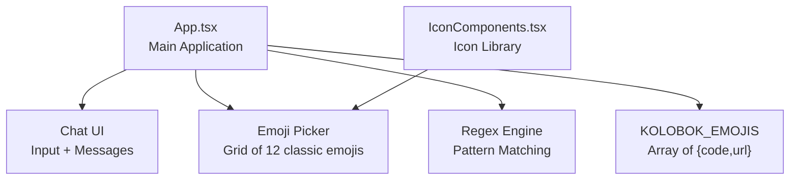
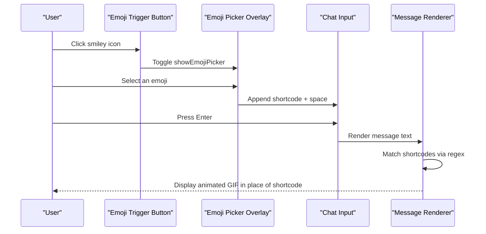
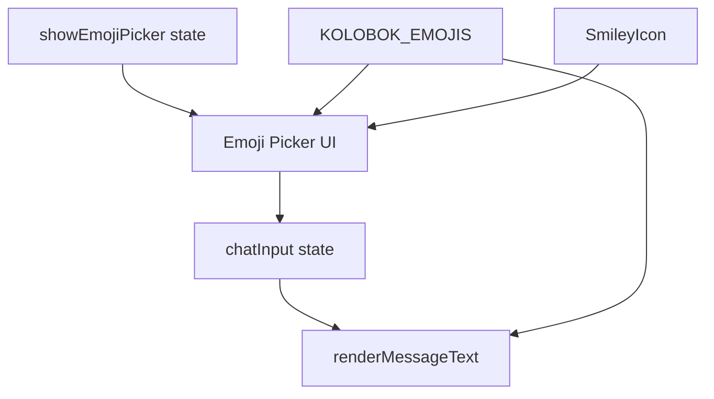

# Emoji Integration

<cite>
**Referenced Files in This Document**
- [App.tsx](file://App.tsx)
- [IconComponents.tsx](file://components/IconComponents.tsx)
</cite>

## Table of Contents
1. [Introduction](#introduction)
2. [Project Structure](#project-structure)
3. [Core Components](#core-components)
4. [Architecture Overview](#architecture-overview)
5. [Detailed Component Analysis](#detailed-component-analysis)
6. [Dependency Analysis](#dependency-analysis)
7. [Performance Considerations](#performance-considerations)
8. [Troubleshooting Guide](#troubleshooting-guide)
9. [Conclusion](#conclusion)

## Introduction
This document explains the emoji system integrated into the chat interface. It covers the classic Kolobok-style emoji integration, the custom emoji picker, the KOLOBOK_EMOJIS array structure, emoji replacement algorithms, and the showEmojiPicker state management. It also documents how emojis integrate with chat input, how text codes like ":)" are converted to animated GIF representations, and how the system handles performance and fallbacks. Accessibility considerations for emoji content are addressed, along with user preference and category relationships.

## Project Structure
The emoji system is implemented within the main application component and a dedicated icon component:
- App.tsx: Contains the emoji constants, state, rendering logic, and chat integration
- IconComponents.tsx: Provides the SmileyIcon used in the emoji picker trigger button

**Diagram sources**
- [App.tsx:143-156](file://App.tsx#L143-L156)
- [App.tsx:8119-8149](file://App.tsx#L8119-L8149)
- [IconComponents.tsx:183-187](file://components/IconComponents.tsx#L183-L187)

**Section sources**
- [App.tsx:143-156](file://App.tsx#L143-L156)
- [App.tsx:8119-8149](file://App.tsx#L8119-L8149)
- [IconComponents.tsx:183-187](file://components/IconComponents.tsx#L183-L187)

## Core Components
- KOLOBOK_EMOJIS: An array of classic animated emoji entries, each with a shortcode code and a remote GIF url
- showEmojiPicker: A boolean state controlling the visibility of the emoji picker overlay
- handleEmojiClick: Adds a selected emoji shortcode plus a trailing space to the chat input and hides the picker
- renderMessageText: Converts shortcode codes in chat messages to inline animated GIF images

Key implementation references:
- KOLOBOK_EMOJIS array definition and structure
- Emoji picker UI and interaction
- Message rendering with shortcode-to-GIF replacement
- SmileyIcon usage for the picker trigger

**Section sources**
- [App.tsx:143-156](file://App.tsx#L143-L156)
- [App.tsx:8119-8149](file://App.tsx#L8119-L8149)
- [App.tsx:5649-5667](file://App.tsx#L5649-L5667)
- [IconComponents.tsx:183-187](file://components/IconComponents.tsx#L183-L187)

## Architecture Overview
The emoji system integrates with the chat UI through a state-driven picker and a rendering pipeline that converts shortcodes to animated images.

**Diagram sources**
- [App.tsx:8119-8149](file://App.tsx#L8119-L8149)
- [App.tsx:5649-5667](file://App.tsx#L5649-L5667)

## Detailed Component Analysis

### Emoji Array: KOLOBOK_EMOJIS
Structure and purpose:
- Each entry defines a shortcode code and a remote GIF url
- Used for both picker display and message rendering
- Enables classic animated smileys similar to the Kolobok project

Implementation highlights:
- Centralized emoji catalog for consistent rendering and picker UI
- Shortcodes are matched literally in the renderer to ensure precise replacement

**Section sources**
- [App.tsx:143-156](file://App.tsx#L143-L156)

### Emoji Picker UI and State Management
Behavior:
- showEmojiPicker toggles the picker overlay positioned above the chat input
- The picker renders a 6-column grid of 12 emoji buttons
- Each button triggers handleEmojiClick when selected

User interaction flow:
- Clicking the SmileyIcon toggles the picker
- Clicking an emoji appends its shortcode plus a space to chatInput and closes the picker

Accessibility and UX:
- Tooltips show the shortcode on hover
- Buttons use a compact 6x6 grid for efficient scanning
- Absolute positioning ensures the picker does not disrupt chat layout

**Section sources**
- [App.tsx:8119-8149](file://App.tsx#L8119-L8149)
- [IconComponents.tsx:183-187](file://components/IconComponents.tsx#L183-L187)

### Emoji Replacement Algorithm
Processing logic:
- renderMessageText receives the raw message text
- Builds a regex pattern from all KOLOBOK_EMOJIS codes
- Splits the text by the regex to isolate shortcode segments
- Replaces each matching shortcode with an inline animated GIF img tag
- Preserves non-matching text as-is

Performance characteristics:
- Regex compilation occurs per-render; consider memoization for heavy usage
- Split-and-map approach avoids nested loops and is easy to extend
- Inline img tags ensure consistent vertical alignment

Edge cases handled:
- Non-matching segments remain as plain text
- Empty or whitespace-only messages pass through unchanged

**Section sources**
- [App.tsx:5654-5667](file://App.tsx#L5654-L5667)

### Chat Integration and Message Formatting
Integration points:
- chatInput state holds the current message being composed
- handleEmojiClick appends the chosen shortcode to chatInput
- handleSendMessage persists the message and clears chatInput
- renderMessageText is used inside the message list to display formatted content

Formatting behavior:
- Emojis appear inline with text at 6x6 pixels
- Titles and alt attributes reflect the shortcode for accessibility
- Level icons and usernames remain unaffected by emoji rendering

**Section sources**
- [App.tsx:5649-5667](file://App.tsx#L5649-L5667)
- [App.tsx:8072-8099](file://App.tsx#L8072-L8099)

### Visual Emoji Picker Interface
Layout and styling:
- Positioned absolutely above the input with a z-index to overlay chat content
- Uses a grid layout with 6 columns and dynamic rows
- Rounded borders, subtle shadows, and hover effects improve usability

Interaction:
- Each emoji button triggers handleEmojiClick
- Picker auto-hides after selection to prevent accidental re-open

**Section sources**
- [App.tsx:8119-8149](file://App.tsx#L8119-L8149)

### Conversion Between Text Codes and Animated GIFs
Mechanism:
- Shortcode-to-GIF mapping is explicit in KOLOBOK_EMOJIS
- renderMessageText performs the conversion during display
- handleEmojiClick inserts the shortcode into chat input for later rendering

Examples of usage in chat:
- Typing ":)" and pressing Enter displays a smiley GIF
- Selecting ":D" from the picker inserts ":D " into the input field
- Multiple emojis can be mixed in a single message

**Section sources**
- [App.tsx:143-156](file://App.tsx#L143-L156)
- [App.tsx:5649-5667](file://App.tsx#L5649-L5667)

### User Preference System and Categories
Current state:
- No explicit user preferences for emoji categories are implemented
- All 12 classic emojis are shown in a single grid
- Users can enable/disable the picker globally via showEmojiPicker

Extensibility:
- Adding categories would require extending KOLOBOK_EMOJIS and updating the picker UI
- A preference store could persist user-selected categories or favorites

**Section sources**
- [App.tsx:8119-8149](file://App.tsx#L8119-L8149)

### Relationship Between Selection and Chat Message Formatting
Flow:
- Picker selection → chatInput append → send → Firestore persistence → message list render → shortcode-to-GIF replacement

Consistency:
- The same KOLOBOK_EMOJIS dataset drives both picker and renderer
- Shortcodes are preserved in the database and re-rendered on load

**Section sources**
- [App.tsx:5649-5667](file://App.tsx#L5649-L5667)
- [App.tsx:8072-8099](file://App.tsx#L8072-L8099)

## Dependency Analysis
The emoji system depends on:
- KOLOBOK_EMOJIS for emoji definitions
- showEmojiPicker state for UI visibility
- renderMessageText for shortcode-to-GIF conversion
- SmileyIcon for the picker trigger

**Diagram sources**
- [App.tsx:373](file://App.tsx#L373)
- [App.tsx:8119-8149](file://App.tsx#L8119-L8149)
- [App.tsx:5649-5667](file://App.tsx#L5649-L5667)
- [App.tsx:143-156](file://App.tsx#L143-L156)
- [IconComponents.tsx:183-187](file://components/IconComponents.tsx#L183-L187)

**Section sources**
- [App.tsx:373](file://App.tsx#L373)
- [App.tsx:8119-8149](file://App.tsx#L8119-L8149)
- [App.tsx:5649-5667](file://App.tsx#L5649-L5667)
- [App.tsx:143-156](file://App.tsx#L143-L156)
- [IconComponents.tsx:183-187](file://components/IconComponents.tsx#L183-L187)

## Performance Considerations
- Rendering pipeline: The regex split-and-map approach is straightforward and scales linearly with message length
- Network dependencies: GIFs are loaded from external URLs; consider caching strategies or local hosting for improved performance
- Memory management: Animated GIFs are rendered as img elements; unmounting or hiding the picker reduces DOM overhead
- Accessibility: Alt text and titles are present; ensure lazy loading and error handling for network failures

[No sources needed since this section provides general guidance]

## Troubleshooting Guide
Common issues and resolutions:
- Emojis not appearing: Verify the shortcode exists in KOLOBOK_EMOJIS and that renderMessageText is invoked
- Picker not closing: Ensure handleEmojiClick updates showEmojiPicker to false
- Network failures: External GIFs may fail to load; implement fallbacks or preload images
- Layout conflicts: Confirm the picker's absolute positioning and z-index do not overlap critical UI elements

**Section sources**
- [App.tsx:5649-5667](file://App.tsx#L5649-L5667)
- [App.tsx:8119-8149](file://App.tsx#L8119-L8149)

## Conclusion
The emoji system provides a lightweight, classic animated emoji experience integrated directly into the chat interface. The KOLOBOK_EMOJIS array centralizes emoji definitions, the picker offers quick selection, and renderMessageText ensures consistent shortcode-to-GIF conversion. While the current implementation focuses on simplicity and immediate usability, future enhancements could include user preferences, categorized emoji sets, and performance optimizations such as preloading and caching.