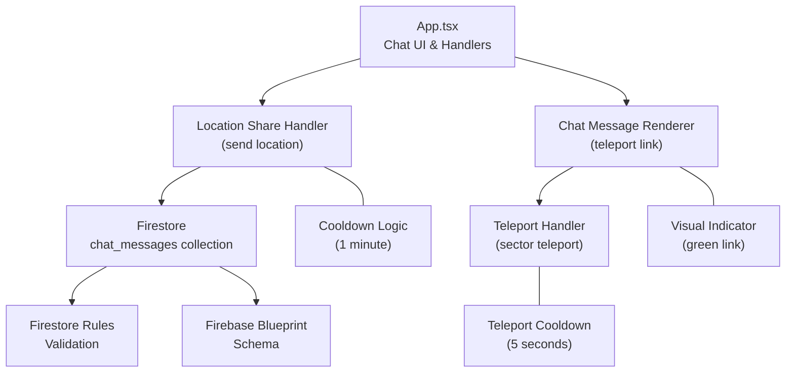
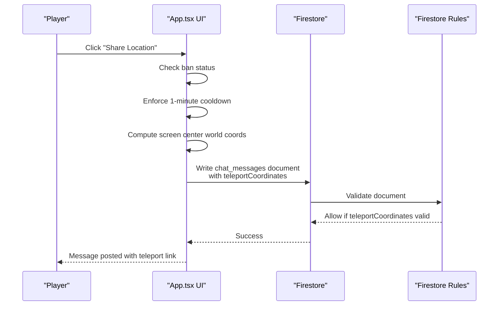
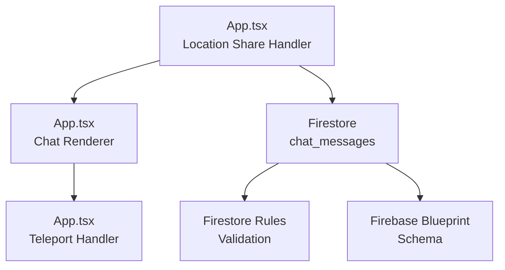

# Location Sharing

<cite>
**Referenced Files in This Document**
- [App.tsx](file://App.tsx)
- [firestore.rules](file://firestore.rules)
- [firebase-blueprint.json](file://firebase-blueprint.json)
</cite>

## Table of Contents
1. [Introduction](#introduction)
2. [Project Structure](#project-structure)
3. [Core Components](#core-components)
4. [Architecture Overview](#architecture-overview)
5. [Detailed Component Analysis](#detailed-component-analysis)
6. [Dependency Analysis](#dependency-analysis)
7. [Performance Considerations](#performance-considerations)
8. [Troubleshooting Guide](#troubleshooting-guide)
9. [Conclusion](#conclusion)

## Introduction
This document explains the location sharing feature that lets players broadcast their current coordinates to chat. It covers the cooldown system, cost structure, teleportation mechanics, the teleportCoordinates property in chat messages, integration with the game’s teleport system, visual indicators, examples of commands and coordinate formatting, safety mechanisms against abuse, state management for lastLocationShareTime, the relationship with the teleport cooldown system, and privacy controls for location visibility.

## Project Structure
The location sharing feature is implemented in the main application file and backed by Firestore security rules and schema definitions. Key areas:
- UI and logic for sending location shares and rendering chat messages with teleport links
- Teleport-to-coordinates functionality integrated into chat message rendering
- Firestore rules validating the presence and shape of teleportCoordinates
- Firebase schema documenting the ChatMessage type and its teleportCoordinates field

**Diagram sources**
- [App.tsx](file://App.tsx)
- [firestore.rules](file://firestore.rules)
- [firebase-blueprint.json](file://firebase-blueprint.json)

**Section sources**
- [App.tsx](file://App.tsx)
- [firestore.rules](file://firestore.rules)
- [firebase-blueprint.json](file://firebase-blueprint.json)

## Core Components
- Location share handler: validates bans, enforces cooldown, computes current screen center coordinates, constructs a chat message with teleportCoordinates, and writes to Firestore.
- Chat renderer: displays messages and renders teleportCoordinates as clickable green links that trigger sector teleportation.
- Teleport system: handles sector teleport with a fixed cooldown after teleport actions.
- Firestore validation: ensures teleportCoordinates is present and conforms to the expected shape when included.
- Schema: documents the ChatMessage type and the optional teleportCoordinates object.

Key implementation references:
- Location share handler and cooldown enforcement
- Teleport link rendering and click handler
- Teleport-to-coordinates logic
- Firestore rules for teleportCoordinates validation
- Firebase blueprint schema for ChatMessage

**Section sources**
- [App.tsx](file://App.tsx)
- [firestore.rules](file://firestore.rules)
- [firebase-blueprint.json](file://firebase-blueprint.json)

## Architecture Overview
The location sharing workflow integrates UI, state, and backend validation:

**Diagram sources**
- [App.tsx](file://App.tsx)
- [firestore.rules](file://firestore.rules)

## Detailed Component Analysis

### Location Share Handler
Responsibilities:
- Prevents banned players from sharing location
- Enforces a 1-minute cooldown between shares
- Computes current world coordinates at the screen center
- Builds a ChatMessage with teleportCoordinates and sends it to Firestore

Behavior highlights:
- Cooldown uses lastLocationShareTime and a constant 60,000 ms
- Coordinates are floored to integer grid positions
- Message includes sender, text, type, timestamp, tab, and optional clanId

Safety mechanisms:
- Ban check blocks the action early
- Cooldown prevents spam by rate-limiting shares

Integration points:
- Uses screenToWorld to convert viewport center to world coordinates
- Writes to chat_messages with a generated id

**Section sources**
- [App.tsx](file://App.tsx)

### Chat Message Rendering and Teleport Link
Responsibilities:
- Render chat messages
- Detect teleportCoordinates in messages
- Display a clickable green link for coordinates
- Trigger sector teleport when clicked

Behavior highlights:
- Clicking the link invokes the teleport handler with the stored coordinates
- Visual indicator is a green, underlined, hoverable link element

Privacy controls:
- Visibility depends on chat tab membership and existing privacy controls in the UI
- No explicit per-user privacy toggle for location visibility is shown in the analyzed code

**Section sources**
- [App.tsx](file://App.tsx)

### Teleport-to-Coordinates Mechanics
Responsibilities:
- Perform sector teleport to the given coordinates
- Apply a teleport cooldown after teleport actions
- Update camera offset to center the destination

Behavior highlights:
- Uses a fixed cooldown duration for teleport actions
- Converts world coordinates to isometric screen positions and centers the camera

Relationship to location sharing:
- The teleportCoordinates value from a shared location becomes the destination for teleportation
- Both systems share the same cooldown and camera logic

**Section sources**
- [App.tsx](file://App.tsx)

### Firestore Validation and Schema
Responsibilities:
- Validate incoming chat_messages documents
- Ensure teleportCoordinates, when present, is a map with numeric x and y fields

Schema details:
- ChatMessage includes optional teleportCoordinates object
- Firestore rules enforce the shape of teleportCoordinates when present

**Section sources**
- [firestore.rules](file://firestore.rules)
- [firebase-blueprint.json](file://firebase-blueprint.json)

### Coordinate Formatting and Examples
Coordinate representation:
- Stored as integer grid positions (floored world coordinates)
- Displayed as a clickable link in chat messages

Examples of usage:
- Command: “Share Location” button triggers the handler
- Output: A chat message appears with a green “teleport link”
- Interaction: Clicking the link teleports the player to the shared coordinates

Note: The code does not define a command-line command; sharing is performed via the UI.

**Section sources**
- [App.tsx](file://App.tsx)

### Safety Mechanisms Against Abuse
- Ban enforcement: Players who are banned cannot share location
- Cooldown enforcement: 1-minute cooldown prevents rapid repeated shares
- Firestore validation: Ensures teleportCoordinates shape when included
- Teleport cooldown: Separate 5-second cooldown prevents immediate re-teleportation after a teleport action

**Section sources**
- [App.tsx](file://App.tsx)
- [firestore.rules](file://firestore.rules)

### State Management and Real-Time Accuracy
State management:
- lastLocationShareTime tracks the last successful share time
- lastTeleportTime and activeTeleportDuration manage teleport cooldown state
- These states are used to block actions during cooldown windows

Real-time accuracy:
- Coordinates are computed at the moment of share using the current viewport center and camera offset
- The system does not maintain continuous location updates; shares are snapshot-based

Potential challenges:
- Camera offset and zoom can change between share and teleport clicks
- Coordinates are snapshots; they do not reflect moving targets

**Section sources**
- [App.tsx](file://App.tsx)

## Dependency Analysis
The location sharing feature depends on:
- UI handlers in App.tsx for sending and rendering
- Teleport system for executing destination movement
- Firestore for persistence and validation
- Security rules and schema for data integrity

**Diagram sources**
- [App.tsx](file://App.tsx)
- [firestore.rules](file://firestore.rules)
- [firebase-blueprint.json](file://firebase-blueprint.json)

**Section sources**
- [App.tsx](file://App.tsx)
- [firestore.rules](file://firestore.rules)
- [firebase-blueprint.json](file://firebase-blueprint.json)

## Performance Considerations
- Cooldown checks are O(1) and avoid unnecessary Firestore writes
- Teleport actions trigger camera updates; batching or throttling is not observed in the analyzed code
- Rendering of teleport links is conditional on the presence of teleportCoordinates

[No sources needed since this section provides general guidance]

## Troubleshooting Guide
Common issues and resolutions:
- Cannot share location:
  - Verify ban status; banned players are blocked
  - Wait for the 1-minute cooldown to expire
- Teleport link does not appear:
  - Ensure the message includes teleportCoordinates
  - Confirm Firestore rules allow the document
- Teleport fails or seems delayed:
  - A 5-second teleport cooldown may be active after recent teleport actions
- Coordinates seem incorrect:
  - Shares capture the viewport center at the moment of posting
  - Camera zoom and offset can affect perceived position

**Section sources**
- [App.tsx](file://App.tsx)
- [firestore.rules](file://firestore.rules)

## Conclusion
The location sharing feature provides a simple, rate-limited mechanism for players to broadcast their current coordinates to chat. It integrates with the existing teleport system, uses Firestore validation to ensure data integrity, and includes safety measures against abuse. While shares are snapshot-based and do not continuously track movement, the combination of cooldowns and visual indicators offers a practical balance between usability and moderation.