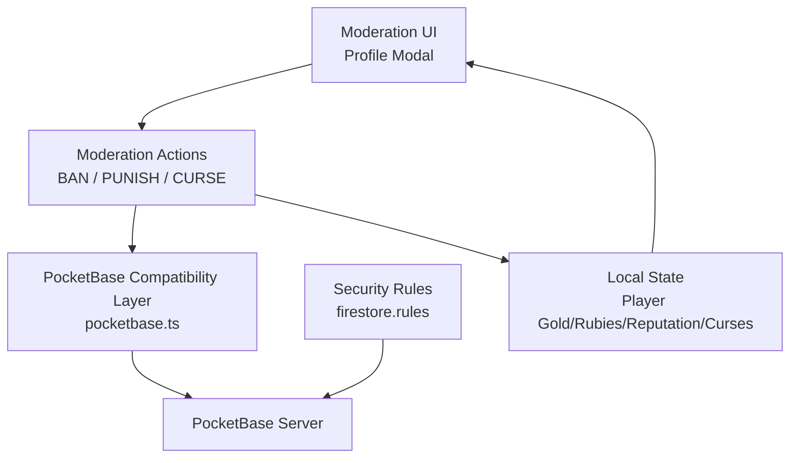
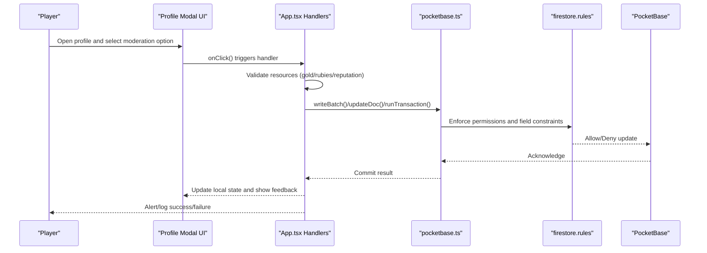
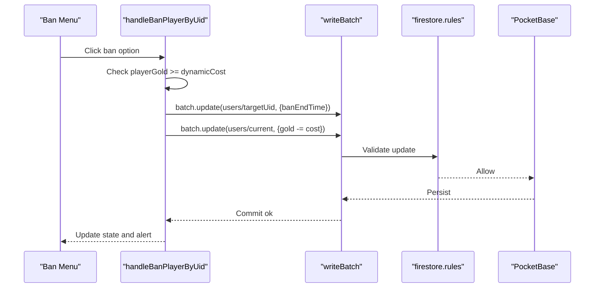
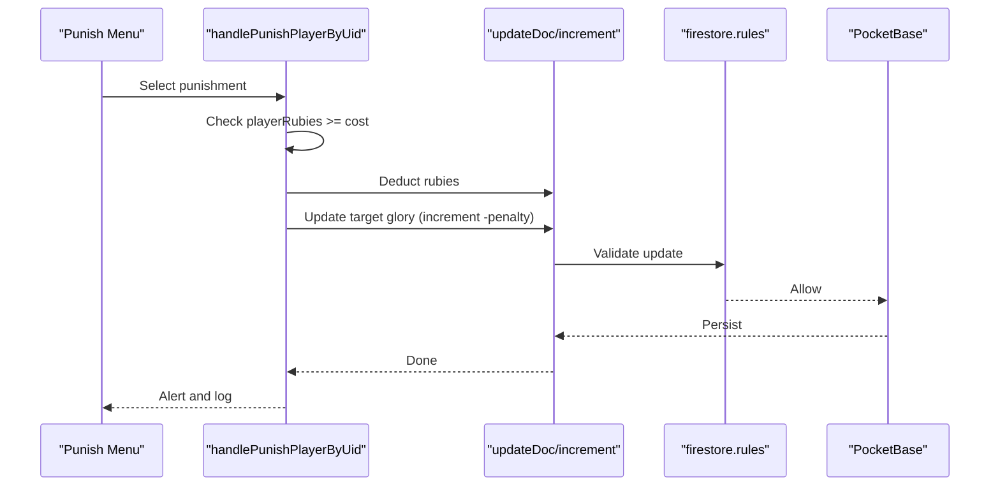
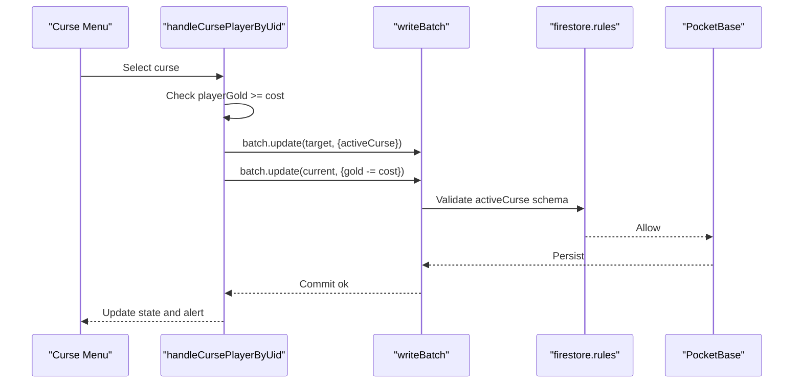
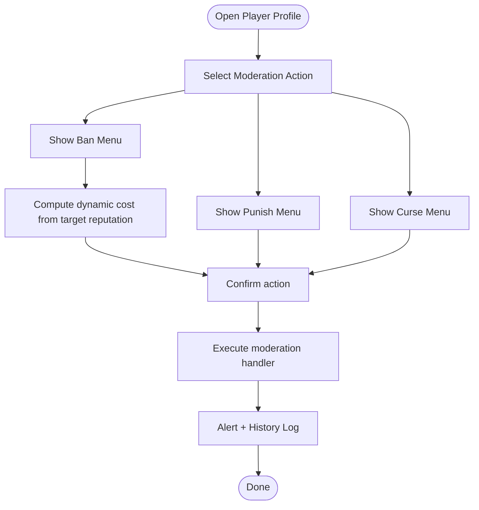
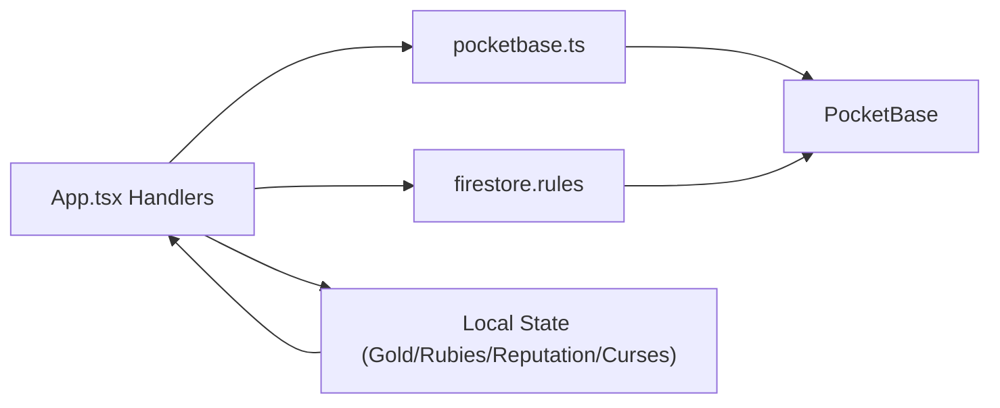

# Moderation Tools

<cite>
**Referenced Files in This Document**
- [App.tsx](file://App.tsx)
- [firestore.rules](file://firestore.rules)
- [pocketbase.ts](file://src/pocketbase.ts)
</cite>

## Table of Contents
1. [Introduction](#introduction)
2. [Project Structure](#project-structure)
3. [Core Components](#core-components)
4. [Architecture Overview](#architecture-overview)
5. [Detailed Component Analysis](#detailed-component-analysis)
6. [Dependency Analysis](#dependency-analysis)
7. [Performance Considerations](#performance-considerations)
8. [Troubleshooting Guide](#troubleshooting-guide)
9. [Conclusion](#conclusion)

## Introduction
This document describes the chat moderation system, covering ban, punishment, and curse functionalities. It explains administrative tools available to moderators and admins, including the BAN_OPTIONS, PUNISHMENT_OPTIONS, and CURSE_OPTIONS arrays. It also documents the moderation UI components (showBanMenu, showPunishMenu, showCurseMenu), cost structures, visual feedback, user targeting mechanisms, integration with player reputation systems, active curses tracking, temporary status effects, and the relationship between moderation actions and player privileges. Security considerations, permission checking, and audit trails are addressed.

## Project Structure
The moderation system spans UI components and state logic in the main application file and enforces access control via Firestore security rules. Data persistence and transactions are handled through a PocketBase compatibility layer.

**Diagram sources**
- [App.tsx](file://App.tsx)
- [firestore.rules](file://firestore.rules)
- [pocketbase.ts](file://src/pocketbase.ts)

**Section sources**
- [App.tsx](file://App.tsx)
- [firestore.rules](file://firestore.rules)
- [pocketbase.ts](file://src/pocketbase.ts)

## Core Components
- BAN_OPTIONS: Defines ban durations and base costs for temporary bans.
- PUNISHMENT_OPTIONS: Defines actions that reduce target glory, priced in rubies.
- CURSE_OPTIONS: Defines temporary prefixes applied to a target’s name for a limited time, priced in gold.
- Moderation UI: Buttons and menus to trigger moderation actions from the player profile modal.
- Player targeting: Targets either the selected chat user or a selected profile user ID.
- Privileges and permissions: Admin/moderator roles and server-side enforcement.
- Audit trail: Logging of moderation actions via history logs.

**Section sources**
- [App.tsx](file://App.tsx)
- [firestore.rules](file://firestore.rules)

## Architecture Overview
The moderation flow involves UI selection, client-side checks, and server-side updates with enforced permissions and atomicity where applicable.

**Diagram sources**
- [App.tsx](file://App.tsx)
- [firestore.rules](file://firestore.rules)
- [pocketbase.ts](file://src/pocketbase.ts)

## Detailed Component Analysis

### Ban System
- Options and Costs:
  - BAN_OPTIONS defines fixed-duration bans with increasing base costs.
  - Dynamic cost increases with target reputation to discourage targeting higher-rep players.
- Targeting:
  - Uses selected profile user ID for batch updates.
- Execution:
  - Batch updates target’s banEndTime and payer’s gold.
  - Local optimistic update for self-bans.
- Feedback:
  - Alerts and history log entries.
- Enforcement:
  - Server allows updates when affected keys are banEndTime and the new value is in the future.

**Diagram sources**
- [App.tsx](file://App.tsx)
- [firestore.rules](file://firestore.rules)

**Section sources**
- [App.tsx](file://App.tsx)
- [firestore.rules](file://firestore.rules)

### Punishment System
- Options and Costs:
  - PUNISHMENT_OPTIONS defines actions with associated ruby cost and glory penalty.
- Targeting:
  - Uses selected profile user ID.
- Execution:
  - Deducts rubies from the current player.
  - Updates target glory directly or via increment; for self, reduces own glory.
- Feedback:
  - Alerts and history logs.

**Diagram sources**
- [App.tsx](file://App.tsx)
- [firestore.rules](file://firestore.rules)

**Section sources**
- [App.tsx](file://App.tsx)
- [firestore.rules](file://firestore.rules)

### Curse System
- Options and Costs:
  - CURSE_OPTIONS defines temporary prefixes with duration minutes and gold cost.
- Targeting:
  - Uses selected profile user ID.
- Execution:
  - Batch sets activeCurse with prefix and endTime on target.
  - Deducts gold from the current player.
  - Optimistic local update of target’s activeCurse.
- Enforcement:
  - Server validates activeCurse shape and timing.

**Diagram sources**
- [App.tsx](file://App.tsx)
- [firestore.rules](file://firestore.rules)

**Section sources**
- [App.tsx](file://App.tsx)
- [firestore.rules](file://firestore.rules)

### Moderation UI Components
- Profile Modal:
  - Displays player stats and moderation buttons.
  - Toggles submenus: showBanMenuInProfile, showPunishMenuInProfile, showCurseMenuInProfile.
- Ban Menu:
  - Lists BAN_OPTIONS with dynamic cost based on target reputation.
- Punish Menu:
  - Lists PUNISHMENT_OPTIONS with ruby cost and glory penalty.
- Curse Menu:
  - Lists CURSE_OPTIONS with gold cost and duration.

**Diagram sources**
- [App.tsx](file://App.tsx)

**Section sources**
- [App.tsx](file://App.tsx)

### User Targeting Mechanisms
- Selected Chat User:
  - Used for immediate chat context actions.
- Selected Profile User ID:
  - Used for profile-based moderation actions.
- UID Resolution:
  - Handlers resolve UID from selected name or profile ID before applying updates.

**Section sources**
- [App.tsx](file://App.tsx)

### Integration with Reputation Systems
- Reputation Changes:
  - Positive/Negative reputation adjustments via transactions using recommendation items.
- Cost Implications:
  - Ban cost scales with target reputation to reflect privilege and impact.
- Local vs Remote:
  - Presence-based reputation can be updated locally; remote updates use transactions.

**Section sources**
- [App.tsx](file://App.tsx)

### Active Curses Tracking and Temporary Status Effects
- Data Model:
  - activeCurse stored per user with prefix and endTime.
- Client Tracking:
  - Local activeCurses map updated for UI feedback.
- Enforcement:
  - Server validates activeCurse shape and prevents overriding ongoing curses until expired.

**Section sources**
- [App.tsx](file://App.tsx)
- [firestore.rules](file://firestore.rules)

### Relationship Between Moderation Actions and Player Privileges
- Roles:
  - Admin or moderator role enables privileged operations.
- Enforcement:
  - Security rules allow admin-only deletes and broad updates for moderation-related fields.

**Section sources**
- [firestore.rules](file://firestore.rules)

## Dependency Analysis
Moderation handlers depend on:
- UI state and selections (profile modal, selected user).
- Resource availability (gold, rubies, reputation).
- PocketBase compatibility layer for database operations.
- Security rules for authorization and schema validation.

**Diagram sources**
- [App.tsx](file://App.tsx)
- [firestore.rules](file://firestore.rules)
- [pocketbase.ts](file://src/pocketbase.ts)

**Section sources**
- [App.tsx](file://App.tsx)
- [firestore.rules](file://firestore.rules)
- [pocketbase.ts](file://src/pocketbase.ts)

## Performance Considerations
- Batch Operations:
  - Use writeBatch for paired updates (e.g., curse + gold deduction) to minimize round-trips.
- Atomicity:
  - Prefer runTransaction for reputation changes to avoid race conditions.
- Local Optimistic Updates:
  - Improve perceived responsiveness for curses and self-bans.
- Rule Validation:
  - Keep moderation updates minimal and constrained to specific fields to reduce validation overhead.

## Troubleshooting Guide
- Insufficient Resources:
  - Handlers check playerGold and playerRubies before proceeding; alerts guide users to acquire more resources.
- Permission Denied:
  - Ensure the user has sufficient privileges; admin/moderator roles are required for certain operations.
- Concurrency Issues:
  - Use runTransaction for reputation adjustments to prevent inconsistent state.
- Error Handling:
  - Centralized error logging via handleFirestoreError for diagnostics.

**Section sources**
- [App.tsx](file://App.tsx)
- [pocketbase.ts](file://src/pocketbase.ts)

## Conclusion
The moderation system combines intuitive UI menus with robust backend enforcement. It balances cost, privilege, and reputation to govern chat behavior effectively. By leveraging batch writes, transactions, and strict security rules, it ensures reliable, auditable moderation actions with responsive user feedback.