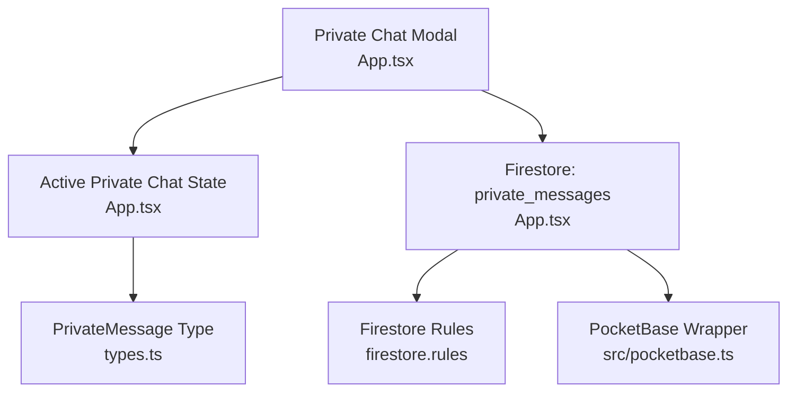
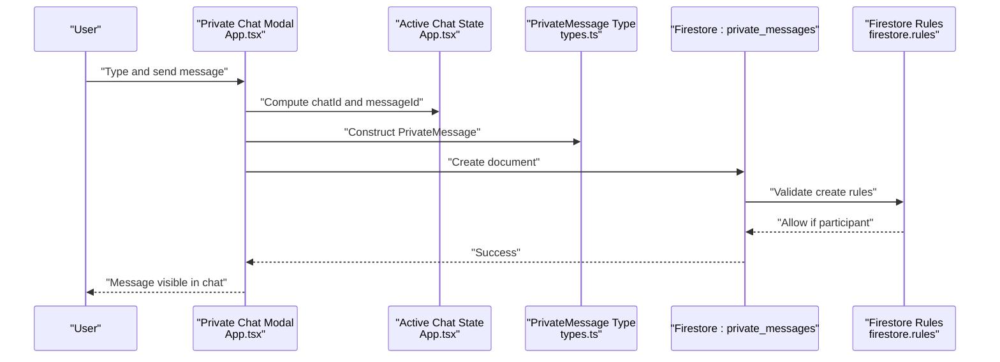
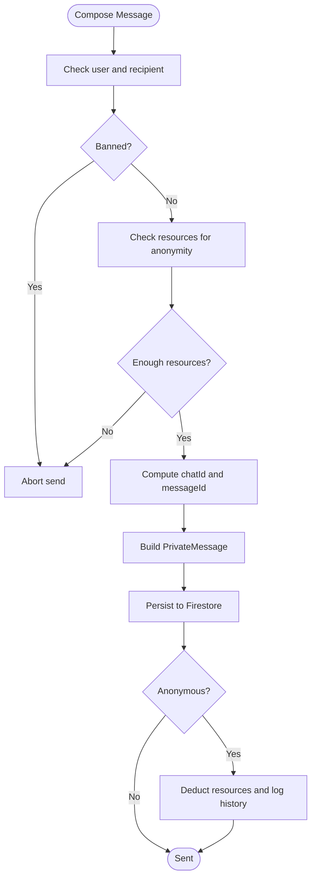
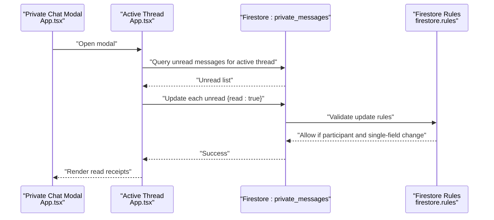
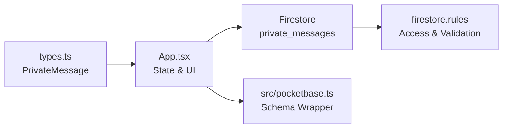

# Private Messaging

<cite>
**Referenced Files in This Document**
- [App.tsx](file://App.tsx)
- [types.ts](file://types.ts)
- [firestore.rules](file://firestore.rules)
- [pocketbase.ts](file://src/pocketbase.ts)
</cite>

## Table of Contents
1. [Introduction](#introduction)
2. [Project Structure](#project-structure)
3. [Core Components](#core-components)
4. [Architecture Overview](#architecture-overview)
5. [Detailed Component Analysis](#detailed-component-analysis)
6. [Dependency Analysis](#dependency-analysis)
7. [Performance Considerations](#performance-considerations)
8. [Troubleshooting Guide](#troubleshooting-guide)
9. [Conclusion](#conclusion)

## Introduction
This document explains the private messaging system in the project, focusing on one-on-one direct conversations, friend-based message routing, and the private chat modal. It covers the PrivateMessage data structure, delivery confirmation, and privacy controls enforced by Firestore rules. It also documents state management for active private chats, message threading, and the integration with the broader chat ecosystem. Privacy considerations, message persistence, and the relationship between private messages and public chat are addressed.

## Project Structure
The private messaging feature spans UI, state, and persistence layers:
- UI and state: implemented in the main application component
- Data model: defined in shared types
- Persistence: Firestore collections for private messages and auxiliary collections
- Security: Firestore rules enforce access, validation, and update constraints

**Diagram sources**
- [App.tsx](file://App.tsx)
- [types.ts](file://types.ts)
- [firestore.rules](file://firestore.rules)
- [pocketbase.ts](file://src/pocketbase.ts)

**Section sources**
- [App.tsx](file://App.tsx)
- [types.ts](file://types.ts)
- [firestore.rules](file://firestore.rules)
- [pocketbase.ts](file://src/pocketbase.ts)

## Core Components
- PrivateMessage data structure defines the shape persisted for each message.
- Active private chat state tracks the current recipient and chat thread identifier.
- Private chat modal renders the conversation UI, handles sending, and marks messages as read.
- Firestore rules define who can read/write/update/delete private messages and validate fields.
- PocketBase wrapper normalizes schema fields for persistence.

Key responsibilities:
- Message creation and persistence
- Conversation filtering and rendering
- Delivery confirmation via read flag updates
- Privacy enforcement via participant-only access

**Section sources**
- [types.ts:187-196](file://types.ts#L187-L196)
- [App.tsx:367-372](file://App.tsx#L367-L372)
- [App.tsx:5466-5511](file://App.tsx#L5466-L5511)
- [App.tsx:7007-7107](file://App.tsx#L7007-L7107)
- [firestore.rules:317-324](file://firestore.rules#L317-L324)
- [pocketbase.ts:150-167](file://src/pocketbase.ts#L150-L167)

## Architecture Overview
The private messaging flow connects UI actions to Firestore persistence with strict access control.

**Diagram sources**
- [App.tsx:5466-5511](file://App.tsx#L5466-L5511)
- [types.ts:187-196](file://types.ts#L187-L196)
- [firestore.rules:317-324](file://firestore.rules#L317-L324)

## Detailed Component Analysis

### PrivateMessage Data Structure
PrivateMessage encapsulates the minimal fields required for secure, participant-only messaging:
- id: unique message identifier
- chatId: thread identifier derived from sorted participant UIDs, with optional suffix for anonymous mode
- senderId: author identifier or special anonymous marker
- receiverId: recipient identifier
- text: message body with length constraints
- timestamp: creation time
- read: delivery/read confirmation flag
- participants: exactly two identifiers forming the conversation pair

Validation and access are enforced by Firestore rules.

**Section sources**
- [types.ts:187-196](file://types.ts#L187-L196)
- [firestore.rules:208-219](file://firestore.rules#L208-L219)
- [firestore.rules:317-324](file://firestore.rules#L317-L324)

### Active Private Chat State Management
State variables track the current conversation:
- activePrivateChat: recipient user identifier or anonymous marker
- activePrivateChatId: normalized chat thread identifier
- privateMessageText: input buffer for outgoing messages
- showPrivateChatModal: visibility of the modal UI
- isAnonymousMessage: toggles anonymous mode for the current thread

Behavior:
- Compose and send messages using computed chatId and messageId
- Toggle anonymity switches the active thread identifier to include an anonymous suffix
- Open modal from profile or friend list interactions

**Section sources**
- [App.tsx:367-372](file://App.tsx#L367-L372)
- [App.tsx:7085-7103](file://App.tsx#L7085-L7103)
- [App.tsx:7156-7162](file://App.tsx#L7156-L7162)

### Private Chat Modal and Rendering
The modal displays:
- Recipient identity (avatar/name/level) or anonymous indicator
- Conversation history filtered by active thread
- Message bubbles with timestamps and optional anonymous header
- Input area with send button and anonymous toggle

Filtering logic:
- Anonymous threads: filter by exact chatId
- Normal threads: filter by bidirectional pair of sender/receiver and exclude anonymous chats

**Section sources**
- [App.tsx:7007-7107](file://App.tsx#L7007-L7107)
- [App.tsx:7039-7064](file://App.tsx#L7039-L7064)

### Message Creation and Persistence
Creation flow:
- Validate user, recipient, and text
- Enforce ban status and resource costs for anonymous mode
- Compute chatId from sorted UIDs and append anonymous suffix when enabled
- Generate unique messageId
- Construct PrivateMessage with sender/receiver/participants
- Persist to Firestore private_messages collection
- Deduct resources and log history for anonymous messages

**Diagram sources**
- [App.tsx:5466-5511](file://App.tsx#L5466-L5511)

**Section sources**
- [App.tsx:5466-5511](file://App.tsx#L5466-L5511)

### Delivery Confirmation and Read Status
Delivery confirmation is implemented via a read flag:
- On modal open, unread messages matching the active thread are marked read
- Updates are performed per-message document
- Firestore rules restrict updates to the read field and require participant access

**Diagram sources**
- [App.tsx:2546-2560](file://App.tsx#L2546-L2560)
- [firestore.rules:322](file://firestore.rules#L322)

**Section sources**
- [App.tsx:2546-2560](file://App.tsx#L2546-L2560)
- [firestore.rules:322](file://firestore.rules#L322)

### Privacy Controls and Access Enforcement
Firestore rules ensure:
- Read access: only participants in the conversation can read
- Create access: authenticated users can create; anonymous sender allowed if participant
- Update access: only participants can mark messages as read
- Delete access: admin-only

Field validation enforces:
- Required fields and types
- Text length limits
- Participants list size and types

**Section sources**
- [firestore.rules:317-324](file://firestore.rules#L317-L324)
- [firestore.rules:208-219](file://firestore.rules#L208-L219)

### Integration with the Friends System
- Users can add others to friends; this augments social features
- Private chat can be initiated from profile interactions
- Friendship does not automatically grant access to private messages; access is governed by participants list

**Section sources**
- [App.tsx:2638-2684](file://App.tsx#L2638-L2684)
- [App.tsx:7156-7162](file://App.tsx#L7156-L7162)

### Relationship to the Broader Chat Ecosystem
- Public chat messages are stored separately and handled by distinct UI/tab logic
- Private messages are isolated by participant list and thread identifiers
- Presence and other systems coexist without affecting private message privacy

**Section sources**
- [App.tsx:5520-5554](file://App.tsx#L5520-L5554)
- [firestore.rules:311-315](file://firestore.rules#L311-L315)

## Dependency Analysis
Private messaging depends on:
- UI state and rendering in the main application component
- Strongly typed PrivateMessage model
- Firestore for persistence with strict rules
- PocketBase wrapper for schema normalization

**Diagram sources**
- [types.ts](file://types.ts)
- [App.tsx](file://App.tsx)
- [firestore.rules](file://firestore.rules)
- [pocketbase.ts](file://src/pocketbase.ts)

**Section sources**
- [types.ts](file://types.ts)
- [App.tsx](file://App.tsx)
- [firestore.rules](file://firestore.rules)
- [pocketbase.ts](file://src/pocketbase.ts)

## Performance Considerations
- Message filtering occurs in memory; keep the privateMessages list reasonably sized
- Read updates are per-document; batching is not used but the volume is bounded by active conversations
- UI rendering uses simple list mapping; consider virtualization for very long histories
- Firestore queries are scoped by thread identifiers; ensure indexes exist for chatId and read fields if needed

## Troubleshooting Guide
Common issues and resolutions:
- Cannot send anonymous message
  - Verify sufficient resources and that ban status allows sending
  - Confirm activePrivateChatId reflects the intended anonymous thread
- Messages not appearing
  - Ensure activePrivateChatId matches the expected thread identifier
  - Check that the conversation pair matches sender/receiver expectations
- Read receipts not updating
  - Confirm modal is open for the active thread
  - Verify participant access and that only the read field is being updated
- Permission denied errors
  - Confirm the user is authenticated and included in the participants list
  - Review Firestore rules for create/update constraints

**Section sources**
- [App.tsx:5466-5511](file://App.tsx#L5466-L5511)
- [App.tsx:2546-2560](file://App.tsx#L2546-L2560)
- [firestore.rules:317-324](file://firestore.rules#L317-L324)

## Conclusion
The private messaging system provides secure, participant-only communication with clear thread management, delivery confirmation, and robust privacy controls enforced by Firestore rules. The UI integrates seamlessly with the broader chat ecosystem, enabling one-on-one conversations and anonymous messaging when permitted. State management ensures smooth switching between conversations, while the data model and persistence layer support scalability and safety.