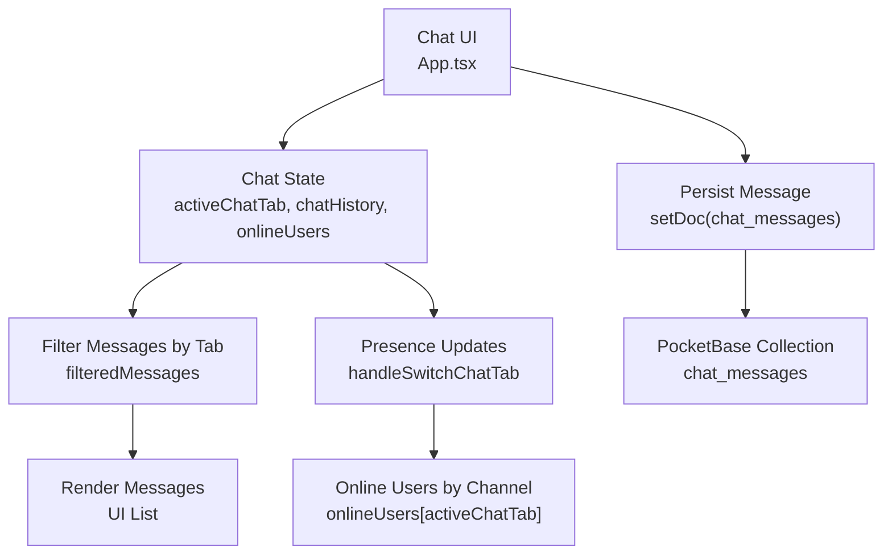
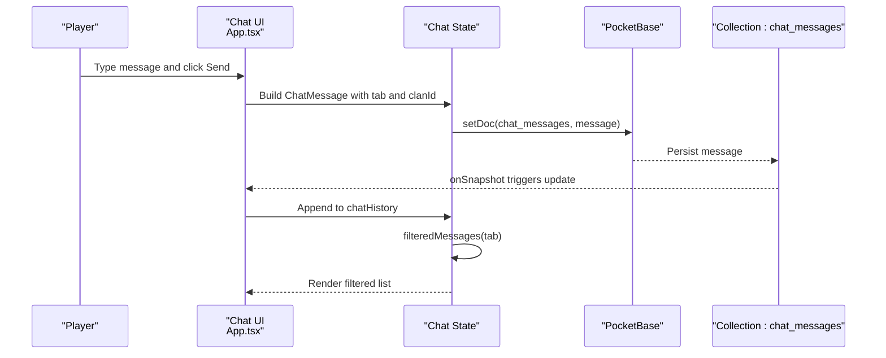
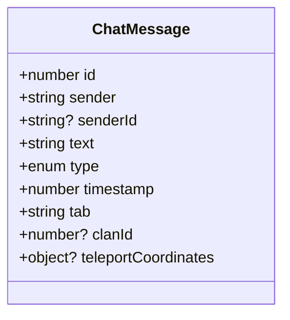
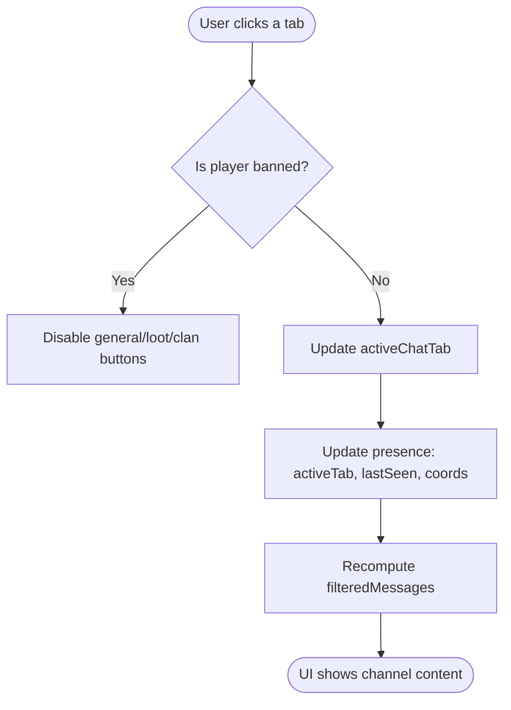
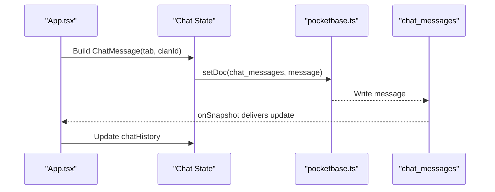
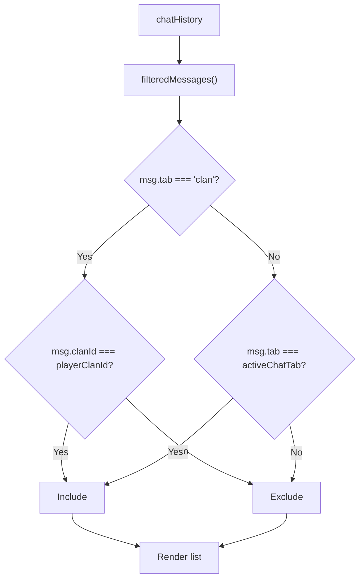
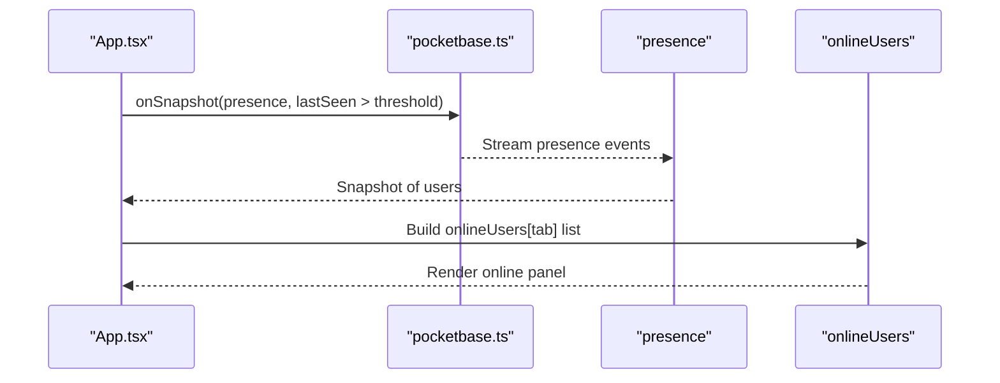
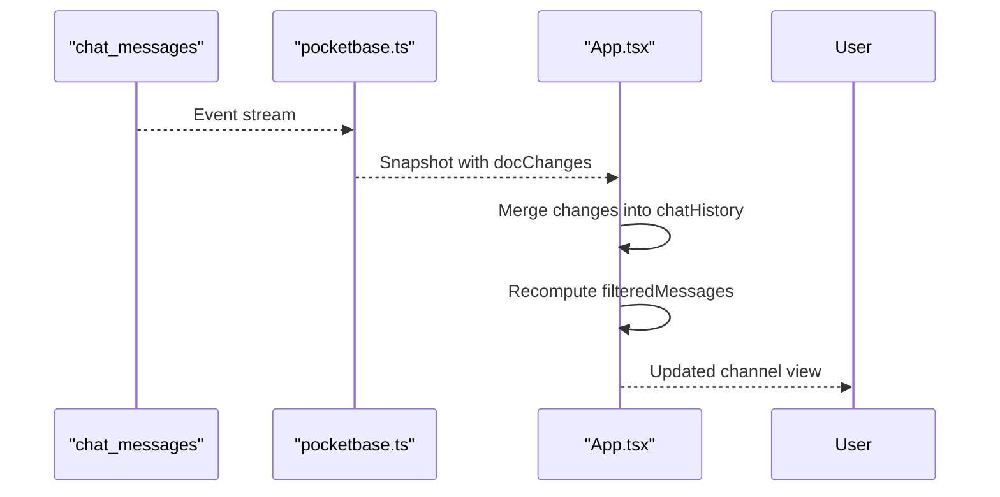
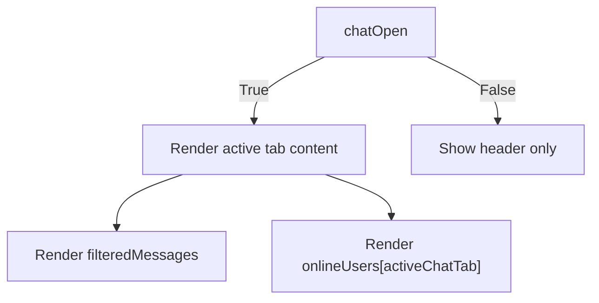
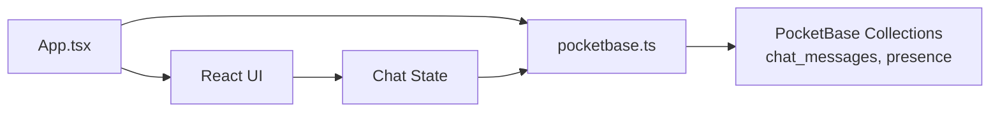

# Public Chat Channels

<cite>
**Referenced Files in This Document**
- [App.tsx](file://App.tsx)
- [pocketbase.ts](file://src/pocketbase.ts)
- [all_consts.txt](file://all_consts.txt)
- [fix_schema.mjs](file://fix_schema.mjs)
</cite>

## Table of Contents
1. [Introduction](#introduction)
2. [Project Structure](#project-structure)
3. [Core Components](#core-components)
4. [Architecture Overview](#architecture-overview)
5. [Detailed Component Analysis](#detailed-component-analysis)
6. [Dependency Analysis](#dependency-analysis)
7. [Performance Considerations](#performance-considerations)
8. [Troubleshooting Guide](#troubleshooting-guide)
9. [Conclusion](#conclusion)

## Introduction
This document describes the public chat channel system in the game. It covers the four main channels—general (world chat), banya (social chat), loot (item sharing), and clan (clan members only)—along with channel switching, message filtering by tab, real-time synchronization, and the chat message structure. It also explains how channel-specific user lists are maintained and how the UI handles channel visibility.

## Project Structure
The chat system spans UI rendering, state management, and persistence via a Firestore-compatible wrapper around PocketBase. Key areas:
- UI and state: App.tsx
- Persistence abstraction: src/pocketbase.ts
- Database schema and indexing hints: fix_schema.mjs and PocketBase collection definitions
- Chat query and presence subscriptions: all_consts.txt

**Diagram sources**
- [App.tsx:5598-5615](file://App.tsx#L5598-L5615)
- [App.tsx:5796-5811](file://App.tsx#L5796-L5811)
- [App.tsx:8021-8174](file://App.tsx#L8021-L8174)
- [pocketbase.ts:150-161](file://src/pocketbase.ts#L150-L161)
- [fix_schema.mjs:24-32](file://fix_schema.mjs#L24-L32)

**Section sources**
- [App.tsx:5598-5615](file://App.tsx#L5598-L5615)
- [App.tsx:5796-5811](file://App.tsx#L5796-L5811)
- [App.tsx:8021-8174](file://App.tsx#L8021-L8174)
- [pocketbase.ts:150-161](file://src/pocketbase.ts#L150-L161)
- [fix_schema.mjs:24-32](file://fix_schema.mjs#L24-L32)

## Core Components
- ChatMessage interface defines the message structure with sender, type, timestamp, tab, and optional clan association.
- Chat tabs: general, banya, loot, clan.
- Message routing: outgoing messages are written to the chat_messages collection with tab and optional clanId.
- Filtering: filteredMessages displays only messages matching the active tab.
- Presence: switching tabs updates presence with activeTab and coordinates.

**Section sources**
- [App.tsx:164-174](file://App.tsx#L164-L174)
- [App.tsx:359-365](file://App.tsx#L359-L365)
- [App.tsx:5538-5547](file://App.tsx#L5538-L5547)
- [App.tsx:5796-5804](file://App.tsx#L5796-L5804)
- [App.tsx:5598-5615](file://App.tsx#L5598-L5615)

## Architecture Overview
Real-time chat relies on a Firestore-compatible abstraction over PocketBase. Messages are stored in a single collection with filterable fields and a JSON data bag. Subscriptions drive live updates to the UI. Presence documents track which tab users are viewing for channel-specific online lists.

**Diagram sources**
- [App.tsx:5538-5551](file://App.tsx#L5538-L5551)
- [pocketbase.ts:337-356](file://src/pocketbase.ts#L337-L356)
- [all_consts.txt:1543-1547](file://all_consts.txt#L1543-L1547)

## Detailed Component Analysis

### Chat Message Structure
- Fields include sender, senderId, text, type (normal/shout/system), timestamp, tab, and optional clanId for clan channel messages.
- The UI renders sender name, level icon, timestamp, and message text, with special handling for location share messages.

**Diagram sources**
- [App.tsx:164-174](file://App.tsx#L164-L174)

**Section sources**
- [App.tsx:164-174](file://App.tsx#L164-L174)
- [App.tsx:8072-8098](file://App.tsx#L8072-L8098)

### Channel Switching Mechanism
- Tabs: banya, general, loot, clan.
- Switching updates presence with activeTab and current world coordinates, enabling channel-specific online user lists.
- UI disables general/loot/clan buttons when banned; clan button shows a message if not in a clan.

**Diagram sources**
- [App.tsx:5598-5615](file://App.tsx#L5598-L5615)
- [App.tsx:8031-8059](file://App.tsx#L8031-L8059)

**Section sources**
- [App.tsx:5598-5615](file://App.tsx#L5598-L5615)
- [App.tsx:8031-8059](file://App.tsx#L8031-L8059)

### Message Routing and Persistence
- Outgoing messages are constructed with activeChatTab and, for clan tab, clanId derived from the player’s current clan.
- Messages are persisted to the chat_messages collection using a Firestore-compatible wrapper.

**Diagram sources**
- [App.tsx:5538-5551](file://App.tsx#L5538-L5551)
- [pocketbase.ts:337-356](file://src/pocketbase.ts#L337-L356)

**Section sources**
- [App.tsx:5538-5551](file://App.tsx#L5538-L5551)
- [pocketbase.ts:337-356](file://src/pocketbase.ts#L337-L356)

### Message Filtering by Tab
- filteredMessages filters chatHistory to show only messages whose tab matches the active tab or clan messages restricted to the player’s clan.
- Auto-scroll ensures new messages are visible.

**Diagram sources**
- [App.tsx:5796-5804](file://App.tsx#L5796-L5804)

**Section sources**
- [App.tsx:5796-5804](file://App.tsx#L5796-L5804)
- [App.tsx:5806-5811](file://App.tsx#L5806-L5811)

### Channel-Specific User Lists
- Presence documents store activeTab and lastSeen timestamps.
- The UI builds onlineUsers by tab from recent presence entries, filtering to show only users in the active tab and, for clan tab, only users in the same clan.

**Diagram sources**
- [App.tsx:1936-1963](file://App.tsx#L1936-L1963)
- [App.tsx:8106-8116](file://App.tsx#L8106-L8116)

**Section sources**
- [App.tsx:1936-1963](file://App.tsx#L1936-L1963)
- [App.tsx:8106-8116](file://App.tsx#L8106-L8116)

### Real-Time Synchronization Across Channels
- Live updates are driven by onSnapshot subscriptions to collections (chat_messages and presence).
- The Firestore-compatible wrapper manages subscriptions, throttling, and stale client ID handling.

**Diagram sources**
- [pocketbase.ts:578-707](file://src/pocketbase.ts#L578-L707)
- [all_consts.txt:1543-1547](file://all_consts.txt#L1543-L1547)

**Section sources**
- [pocketbase.ts:578-707](file://src/pocketbase.ts#L578-L707)
- [all_consts.txt:1543-1547](file://all_consts.txt#L1543-L1547)

### UI Handling of Channel Visibility
- The chat window toggles open/closed and renders the active tab’s messages.
- The right panel shows online users for the active tab, including level icons and clickable names.

**Diagram sources**
- [App.tsx:8021-8174](file://App.tsx#L8021-L8174)
- [App.tsx:8106-8116](file://App.tsx#L8106-L8116)

**Section sources**
- [App.tsx:8021-8174](file://App.tsx#L8021-L8174)
- [App.tsx:8106-8116](file://App.tsx#L8106-L8116)

## Dependency Analysis
- App.tsx depends on the Firestore-compatible wrapper for reads/writes and subscriptions.
- Presence and chat subscriptions are coordinated to keep UI state consistent.
- The PocketBase schema defines known fields and JSON data handling for flexible message storage.

**Diagram sources**
- [pocketbase.ts:150-161](file://src/pocketbase.ts#L150-L161)
- [fix_schema.mjs:24-32](file://fix_schema.mjs#L24-L32)

**Section sources**
- [pocketbase.ts:150-161](file://src/pocketbase.ts#L150-L161)
- [fix_schema.mjs:24-32](file://fix_schema.mjs#L24-L32)

## Performance Considerations
- Subscription throttling reduces update frequency for presence and chat streams.
- Limiting presence queries to recent activity minimizes payload sizes.
- Auto-scrolling occurs only when filtered messages change, avoiding unnecessary DOM work.

[No sources needed since this section provides general guidance]

## Troubleshooting Guide
- If chat does not update in real time, verify presence and chat subscriptions are active and not stale.
- If messages do not appear in the clan tab, confirm the message’s clanId matches the player’s clan and the tab filter logic.
- If bans prevent sending messages, ensure the ban state is respected before enabling actions.

**Section sources**
- [App.tsx:5598-5615](file://App.tsx#L5598-L5615)
- [App.tsx:5796-5804](file://App.tsx#L5796-L5804)
- [App.tsx:8038-8059](file://App.tsx#L8038-L8059)

## Conclusion
The chat system integrates a simple, unified message model with tab-based filtering and presence-driven online lists. Messages are persisted to a single collection with filterable fields and JSON data, enabling flexible storage and efficient real-time updates across channels. Channel switching updates presence to power per-channel user lists, while UI auto-scrolling and tab-aware filtering ensure a responsive, localized chat experience.