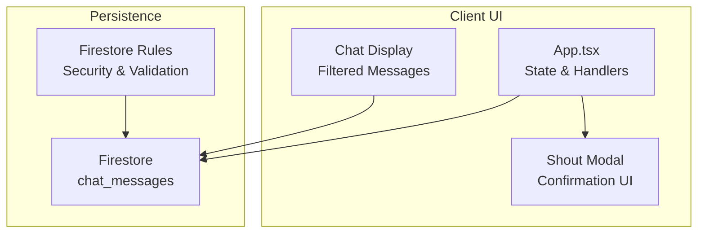
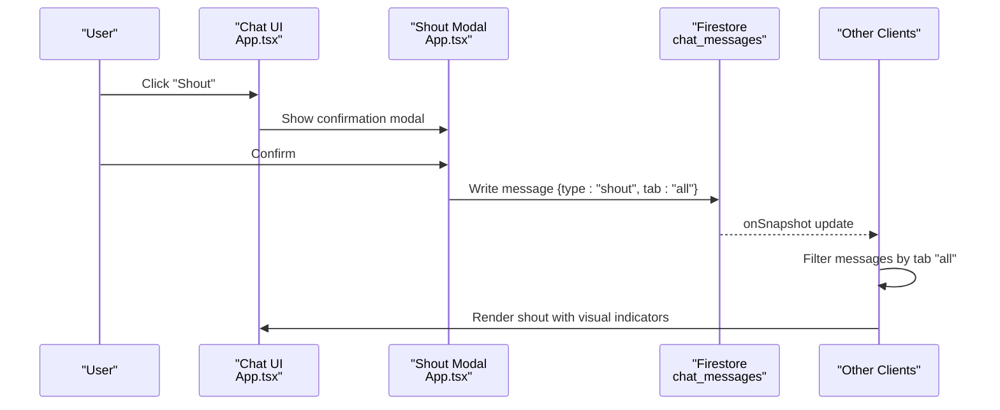
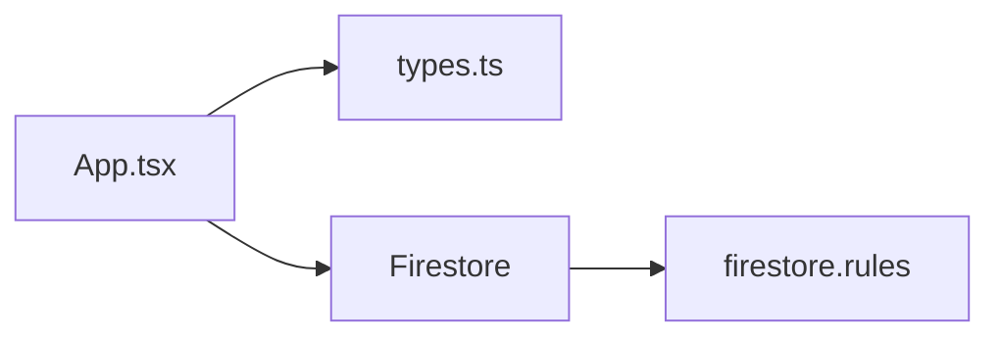

# Shout System

<cite>
**Referenced Files in This Document**
- [App.tsx](file://App.tsx)
- [types.ts](file://types.ts)
- [firestore.rules](file://firestore.rules)
- [index.tsx](file://index.tsx)
</cite>

## Table of Contents
1. [Introduction](#introduction)
2. [Project Structure](#project-structure)
3. [Core Components](#core-components)
4. [Architecture Overview](#architecture-overview)
5. [Detailed Component Analysis](#detailed-component-analysis)
6. [Dependency Analysis](#dependency-analysis)
7. [Performance Considerations](#performance-considerations)
8. [Troubleshooting Guide](#troubleshooting-guide)
9. [Conclusion](#conclusion)

## Introduction
This document explains the global announcement system and the shout feature for cross-server messaging. It covers cost structure (gold and energy), cooldown and permission checks, the visual shout confirmation modal, real-time broadcasting via Firestore, recipient filtering, and integration with the chat display system. It also outlines moderation controls to prevent spam, and discusses the technical challenges of maintaining message order across all players.

## Project Structure
The shout system is implemented within the main application component and integrates with Firestore for persistence and real-time updates. Key areas:
- Constants and state for costs and UI state
- Message composition and validation
- Firestore write and read operations
- Chat rendering and filtering
- Moderation and permission checks

**Diagram sources**
- [App.tsx](file://App.tsx)
- [firestore.rules](file://firestore.rules)

**Section sources**
- [App.tsx](file://App.tsx)
- [firestore.rules](file://firestore.rules)

## Core Components
- Shout cost constants and UI state
  - Gold and energy cost for shouting
  - Modal visibility state
  - Player stats (gold, energy) used for validation
- Message composition and validation
  - Type marking for global broadcasts
  - Tab targeting for recipients
  - Curse prefix integration
- Real-time broadcast and display
  - Firestore writes for new messages
  - Snapshot subscription for live updates
  - Sorting and filtering for display

Key implementation references:
- Cost constants and state: [App.tsx](file://App.tsx)
- Message handlers and modal: [App.tsx](file://App.tsx)
- Firestore read/write and chat display: [App.tsx](file://App.tsx)
- Security rules for chat: [firestore.rules](file://firestore.rules)

**Section sources**
- [App.tsx](file://App.tsx)
- [firestore.rules](file://firestore.rules)

## Architecture Overview
The shout feature follows a client-driven pattern:
- User triggers a shout via the chat UI
- A confirmation modal validates player resources and permissions
- On confirmation, a message document is written to Firestore with type set to global
- All clients subscribe to chat messages and filter for global delivery
- Moderation and bans are enforced by Firestore rules and client-side checks

**Diagram sources**
- [App.tsx](file://App.tsx)
- [firestore.rules](file://firestore.rules)

**Section sources**
- [App.tsx](file://App.tsx)
- [firestore.rules](file://firestore.rules)

## Detailed Component Analysis

### Shout Cost and Permission Checks
- Costs
  - Gold cost: constant defined in the app
  - Energy cost: constant defined in the app
- Validation
  - Player must have sufficient gold and energy
  - Banned players cannot shout
- Visual feedback
  - Disabled button state when insufficient resources
  - Color-coded cost labels indicating affordability

Implementation references:
- Cost constants: [App.tsx](file://App.tsx)
- Validation and state updates: [App.tsx](file://App.tsx)
- Button disabled state and labels: [App.tsx](file://App.tsx)

**Section sources**
- [App.tsx](file://App.tsx)

### Shout Confirmation Modal
- Purpose
  - Re-confirms the user’s intent and displays the effective message
  - Shows resource costs and current balances
- Behavior
  - Clicking outside or cancel closes the modal
  - Confirm triggers the broadcast after validation

Implementation references:
- Modal UI and layout: [App.tsx](file://App.tsx)
- Confirmation handler: [App.tsx](file://App.tsx)

**Section sources**
- [App.tsx](file://App.tsx)

### Message Composition and Broadcasting
- Message fields
  - Sender, text, timestamp
  - Type: global ("shout")
  - Tab: global ("all")
  - Optional curse prefix applied if active
- Persistence
  - Writes to the chat_messages collection
  - Uses a unique message ID combining timestamp and sender
- Moderation integration
  - Banned users are blocked from sending
  - Firestore rules enforce read/write policies

Implementation references:
- Message composition and write: [App.tsx](file://App.tsx)
- Firestore rules for chat: [firestore.rules](file://firestore.rules)

**Section sources**
- [App.tsx](file://App.tsx)
- [firestore.rules](file://firestore.rules)

### Chat Display and Recipient Filtering
- Subscription
  - Subscribes to recent chat messages
  - Sorts by timestamp for chronological order
- Filtering
  - Global shout messages are shown when viewing the global tab
  - Other tabs show only relevant channels
- Rendering
  - Special visual treatment for shout messages
  - Emojis and curse prefixes supported

Implementation references:
- Subscription and sorting: [App.tsx](file://App.tsx)
- Filtering and rendering: [App.tsx](file://App.tsx)

**Section sources**
- [App.tsx](file://App.tsx)

### Moderation and Spam Prevention
- Resource cost discourages spam
- Ban enforcement prevents shouting while penalized
- Firestore rules govern read/write access and message validity
- Optional administrative controls exist for message deletion

Implementation references:
- Ban check and alerts: [App.tsx](file://App.tsx)
- Firestore rules for chat: [firestore.rules](file://firestore.rules)

**Section sources**
- [App.tsx](file://App.tsx)
- [firestore.rules](file://firestore.rules)

### Example Scenarios
- Using the shout command
  - Open chat, type a message, click "Shout"
  - Review cost and confirm in the modal
  - On confirmation, the message appears globally
- Cost calculations
  - Deduct gold and energy equal to the constants
  - Insufficient funds disables the send button
- Moderation
  - Banned players see an alert and cannot shout
  - Administrators can manage messages via backend controls

Implementation references:
- Handler invocation and confirmation: [App.tsx](file://App.tsx)
- Cost constants: [App.tsx](file://App.tsx)
- Ban enforcement: [App.tsx](file://App.tsx)

**Section sources**
- [App.tsx](file://App.tsx)

## Dependency Analysis
- App.tsx depends on:
  - Firestore SDK for reads/writes
  - React state for UI and player stats
  - Types for message shape
- Firestore rules depend on:
  - Authentication state
  - Message schema validation
  - Administrative privileges

**Diagram sources**
- [App.tsx](file://App.tsx)
- [types.ts](file://types.ts)
- [firestore.rules](file://firestore.rules)

**Section sources**
- [App.tsx](file://App.tsx)
- [types.ts](file://types.ts)
- [firestore.rules](file://firestore.rules)

## Performance Considerations
- Firestore read/write patterns
  - Subscribe to a capped number of recent messages to avoid heavy loads
  - Sort locally by timestamp for consistent ordering
- UI responsiveness
  - Keep modal lightweight and avoid unnecessary re-renders
  - Debounce or disable repeated clicks during validation
- Scalability
  - Global broadcasts increase message volume; moderation and filtering help maintain readability
  - Consider rate limits at the application layer if needed

[No sources needed since this section provides general guidance]

## Troubleshooting Guide
- Cannot send a shout
  - Verify sufficient gold and energy
  - Check if banned; resolve ban before shouting
- Shout does not appear
  - Ensure you are viewing the correct chat tab
  - Confirm Firestore connectivity and subscription status
- Visual indicators missing
  - Confirm the message type is set to global and tab is "all"
  - Check client-side filtering logic

**Section sources**
- [App.tsx](file://App.tsx)
- [firestore.rules](file://firestore.rules)

## Conclusion
The shout system combines client-side validation, a confirmation modal, and Firestore-backed real-time messaging to deliver a global announcement mechanism. Costs and moderation controls help prevent abuse, while filtering ensures recipients only see relevant messages. The architecture leverages Firestore snapshots for live updates and maintains order through timestamp-based sorting.