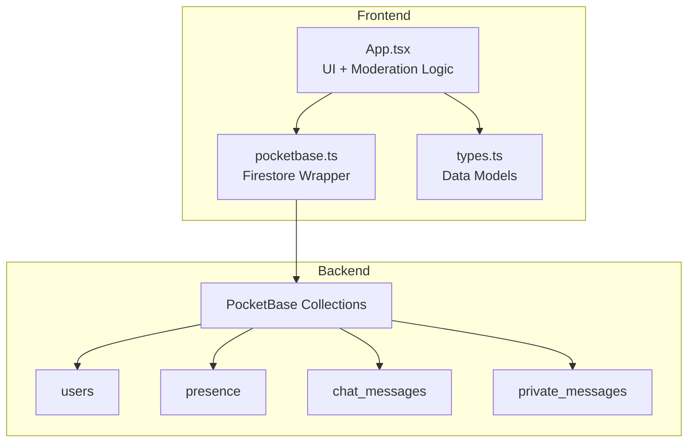
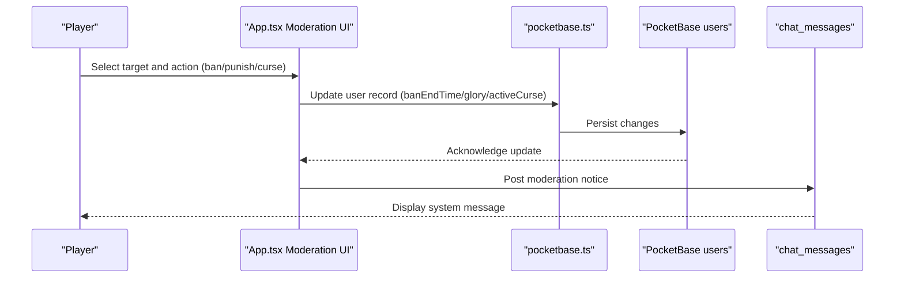
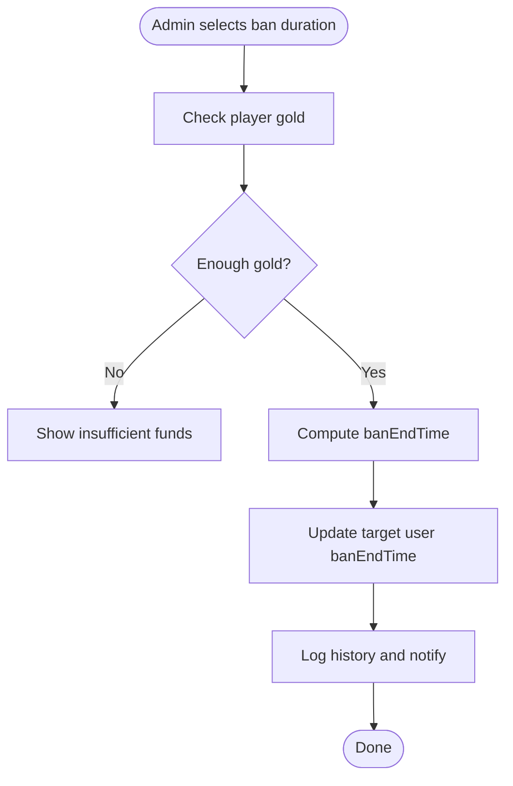
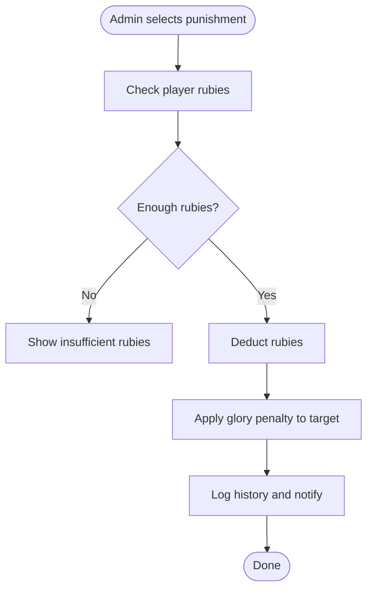
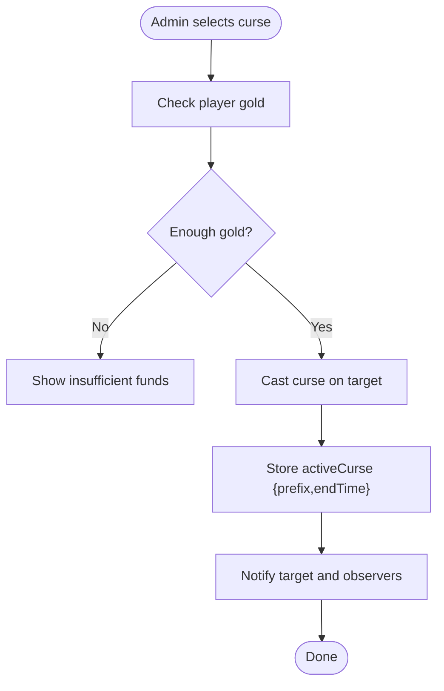
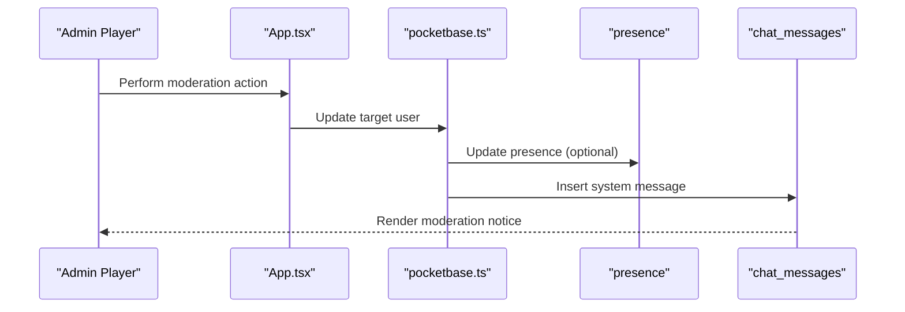
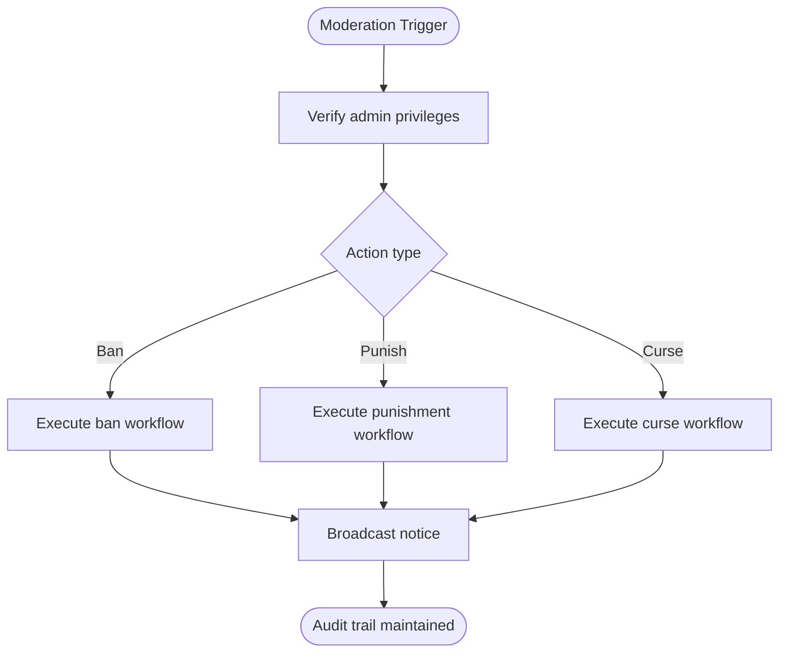
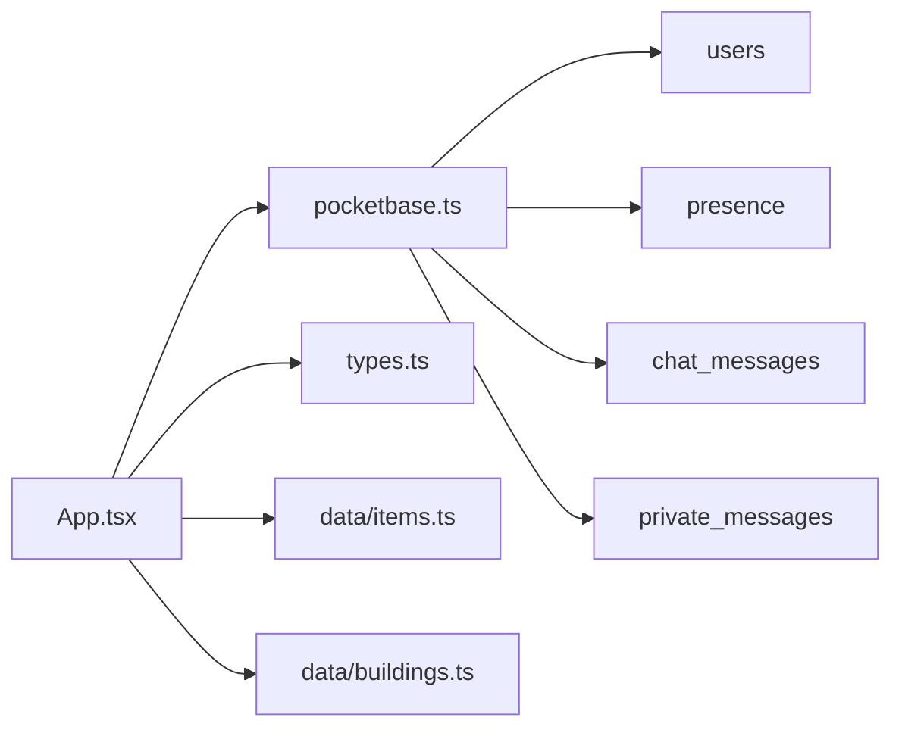

# Administrative Features and Moderation

<cite>
**Referenced Files in This Document**
- [App.tsx](file://App.tsx)
- [pocketbase.ts](file://src/pocketbase.ts)
- [types.ts](file://types.ts)
- [buildings.ts](file://data/buildings.ts)
- [items.ts](file://data/items.ts)
</cite>

## Table of Contents
1. [Introduction](#introduction)
2. [Project Structure](#project-structure)
3. [Core Components](#core-components)
4. [Architecture Overview](#architecture-overview)
5. [Detailed Component Analysis](#detailed-component-analysis)
6. [Dependency Analysis](#dependency-analysis)
7. [Performance Considerations](#performance-considerations)
8. [Troubleshooting Guide](#troubleshooting-guide)
9. [Conclusion](#conclusion)

## Introduction
This document describes the administrative features and moderation system implemented in the game. It covers the ban system (including temporary bans, duration options, and costs), the punishment system (disciplinary actions, glory penalties, and administrative procedures), and the curse system (magical effects, duration limits, and usage restrictions). It also documents administrative workflows, moderation tools, integration with the chat system, coordination between clan leaders and server administrators, and abuse prevention measures.

## Project Structure
The moderation system spans several key areas:
- Frontend UI and logic for administrative actions (ban, punish, curse) in the main application component
- Backend integration via a Firestore-compatible wrapper for PocketBase
- Game state and persistence for user attributes like ban end time and active curses
- Data definitions for items and buildings that influence moderation mechanics

**Diagram sources**
- [App.tsx](file://App.tsx)
- [pocketbase.ts](file://src/pocketbase.ts)
- [types.ts](file://types.ts)

**Section sources**
- [App.tsx](file://App.tsx)
- [pocketbase.ts](file://src/pocketbase.ts)
- [types.ts](file://types.ts)

## Core Components
- Ban system: Temporary bans with configurable durations and associated costs; enforced client-side and persisted server-side
- Punishment system: Disciplinary actions with glory penalties and rubies cost; affects target player’s glory
- Curse system: Magical effects applied to players with prefixes and time-limited duration; persists across sessions
- Chat integration: Administrative actions trigger chat notifications and presence updates
- Abuse prevention: Reputation system via recommendation items influences ban severity; presence and cooldowns mitigate abuse

**Section sources**
- [App.tsx](file://App.tsx)
- [items.ts](file://data/items.ts)

## Architecture Overview
The moderation system integrates frontend UI actions with backend persistence through a Firestore-compatible abstraction layer. Administrative actions update user records and broadcast relevant events to chat and presence channels.

**Diagram sources**
- [App.tsx](file://App.tsx)
- [pocketbase.ts](file://src/pocketbase.ts)

## Detailed Component Analysis

### Ban System
- Duration options: Predefined presets for 1 minute, 5 minutes, 30 minutes, 1 hour, and 1 day
- Cost structure: Costs increase with duration; paid in gold
- Enforcement: Client checks ban status and redirects to restricted chat tab when banned
- Persistence: Updates target user’s banEndTime field; supports self-ban and remote ban

**Diagram sources**
- [App.tsx](file://App.tsx)

**Section sources**
- [App.tsx](file://App.tsx)
- [items.ts](file://data/items.ts)

### Punishment System
- Disciplinary actions: Five escalating actions with increasing glory penalties and rubies cost
- Effect: Deducts glory from target player; supports both self-punishment and remote punishment
- Persistence: Updates target user’s glory via incremental updates

**Diagram sources**
- [App.tsx](file://App.tsx)

**Section sources**
- [App.tsx](file://App.tsx)

### Curse System
- Magical effects: Five animals with distinct prefixes and durations
- Cost: Paid in gold; higher tiers cost more
- Persistence: Stores activeCurse object with prefix and endTime; updates presence and chat
- Restrictions: Enforced by cooldowns and availability of required items

**Diagram sources**
- [App.tsx](file://App.tsx)

**Section sources**
- [App.tsx](file://App.tsx)
- [items.ts](file://data/items.ts)

### Chat Integration and Notifications
- Presence: Tracks online users and their active tabs; restricts banned users to a restricted chat tab
- Chat messages: Posts moderation notices and loot alerts; supports teleport coordinates for location sharing
- Private messaging: Integrates with presence and chat collections for DMs

**Diagram sources**
- [App.tsx](file://App.tsx)
- [pocketbase.ts](file://src/pocketbase.ts)

**Section sources**
- [App.tsx](file://App.tsx)
- [pocketbase.ts](file://src/pocketbase.ts)

### Administrative Workflows and Procedures
- Reputation influence: Recommendation items enable praise/complain actions affecting reputation; reputation influences ban severity
- Clan coordination: Clan leaders coordinate with server administrators for moderation decisions; presence and chat facilitate communication
- Appeal process: Not explicitly implemented in the codebase; could leverage private messages and chat channels for appeals
- Oversight and abuse prevention: Presence monitoring, cooldowns, and reputation system help prevent abuse

**Diagram sources**
- [App.tsx](file://App.tsx)
- [items.ts](file://data/items.ts)

**Section sources**
- [App.tsx](file://App.tsx)
- [items.ts](file://data/items.ts)

## Dependency Analysis
- App.tsx depends on pocketbase.ts for Firestore operations and on types.ts for data models
- Moderation actions rely on presence and chat collections for visibility and enforcement
- Items and buildings define prerequisites and interactions that indirectly affect moderation (e.g., watchtower tax rate, clan castle requirement)

**Diagram sources**
- [App.tsx](file://App.tsx)
- [pocketbase.ts](file://src/pocketbase.ts)
- [types.ts](file://types.ts)
- [items.ts](file://data/items.ts)
- [buildings.ts](file://data/buildings.ts)

**Section sources**
- [App.tsx](file://App.tsx)
- [pocketbase.ts](file://src/pocketbase.ts)
- [types.ts](file://types.ts)
- [items.ts](file://data/items.ts)
- [buildings.ts](file://data/buildings.ts)

## Performance Considerations
- Batch operations: Use writeBatch for combined updates to minimize round-trips during moderation actions
- Presence updates: Heartbeat updates occur at intervals to balance responsiveness and bandwidth
- Real-time subscriptions: Throttled updates and selective filtering reduce load on the backend

## Troubleshooting Guide
- Authentication errors: Translated error messages for common PocketBase failures (invalid credentials, unique constraints)
- Firestore errors: Centralized error handler logs and surfaces meaningful messages for debugging
- Presence anomalies: Presence updates ignore stale client IDs and retry with jitter to avoid storms

**Section sources**
- [pocketbase.ts](file://src/pocketbase.ts)
- [App.tsx](file://App.tsx)

## Conclusion
The moderation system combines intuitive UI actions with robust backend persistence to enforce community standards. Temporary bans, escalating punishments, and magical curses provide layered moderation capabilities. Integration with chat and presence ensures transparency and accountability, while reputation and cooldown mechanisms help prevent abuse. Future enhancements could include formal appeal workflows and administrative dashboards for oversight.