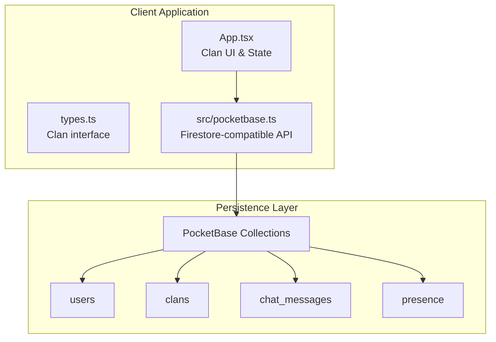
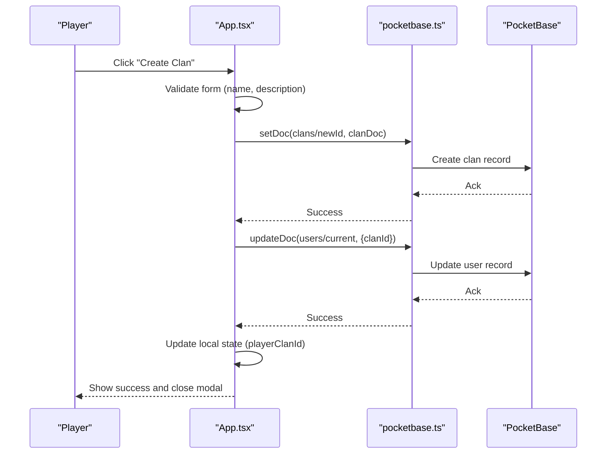
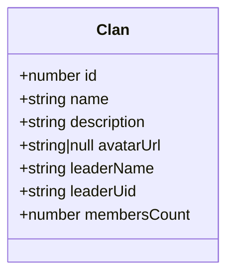
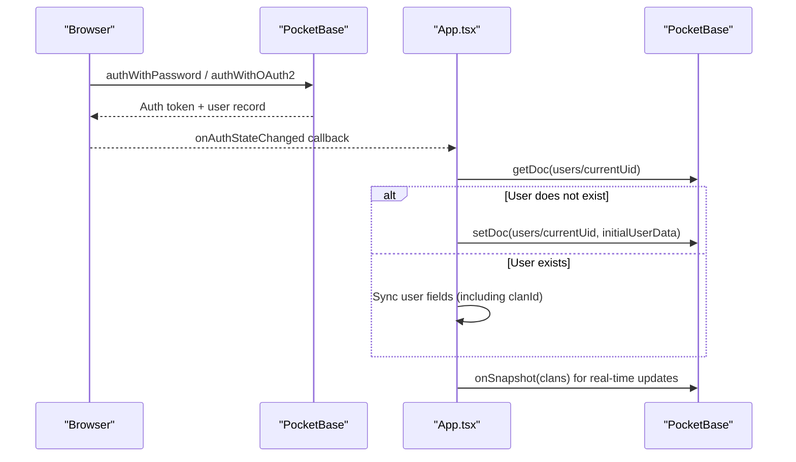
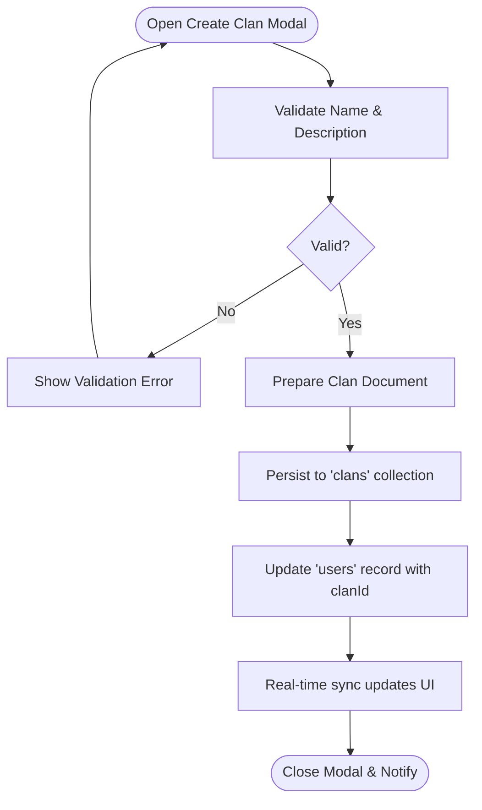
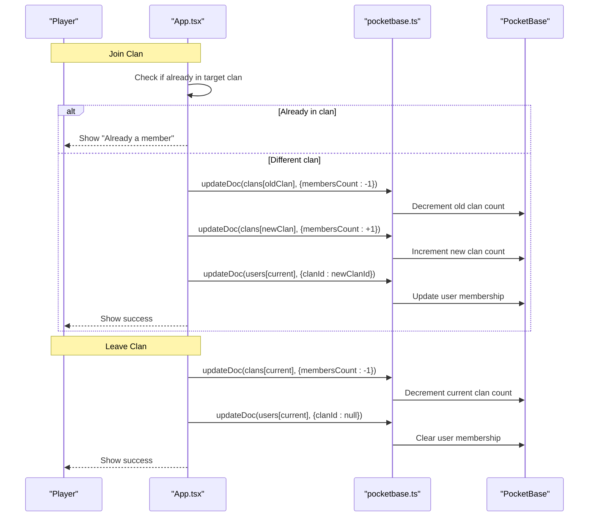
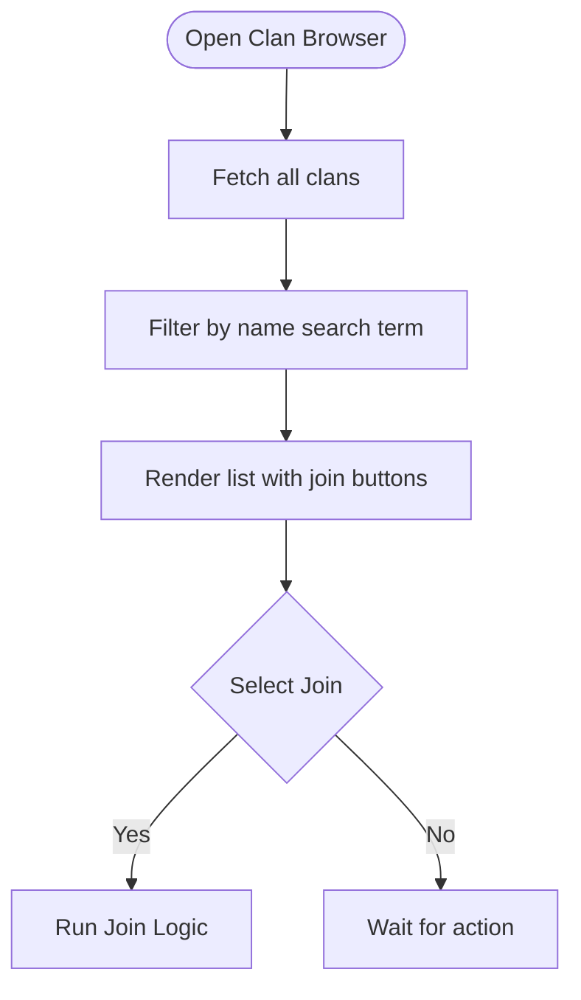
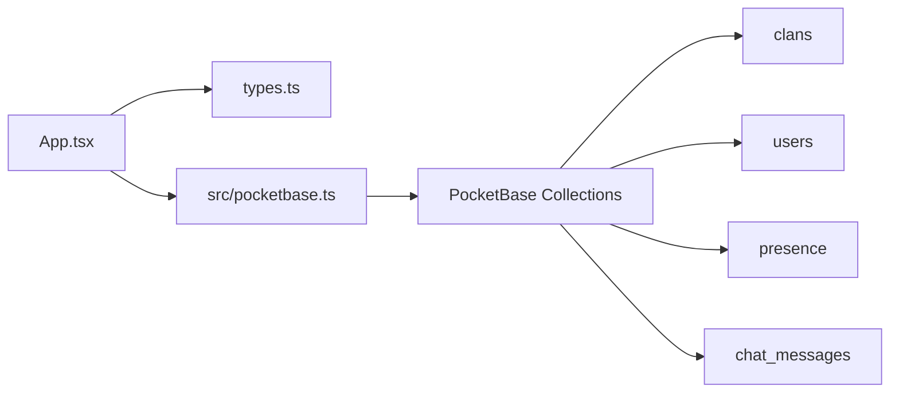

# Clan Creation and Management

<cite>
**Referenced Files in This Document**
- [App.tsx](file://App.tsx)
- [types.ts](file://types.ts)
- [pocketbase.ts](file://src/pocketbase.ts)
- [README.md](file://README.md)
- [package.json](file://package.json)
</cite>

## Table of Contents
1. [Introduction](#introduction)
2. [Project Structure](#project-structure)
3. [Core Components](#core-components)
4. [Architecture Overview](#architecture-overview)
5. [Detailed Component Analysis](#detailed-component-analysis)
6. [Dependency Analysis](#dependency-analysis)
7. [Performance Considerations](#performance-considerations)
8. [Troubleshooting Guide](#troubleshooting-guide)
9. [Conclusion](#conclusion)

## Introduction
This document describes the clan creation and management system implemented in the project. It covers the complete lifecycle of clans: founding requirements, registration and verification, hierarchical structure, member management, and integration with the authentication and persistence layers. The system is built with React and integrates with PocketBase for authentication and data synchronization.

## Project Structure
The clan system spans several key areas:
- UI and state management for clan creation, joining, leaving, and browsing in the main application component
- Type definitions for the clan entity
- Persistence layer abstraction for Firestore-style operations backed by PocketBase
- Authentication integration via PocketBase

**Diagram sources**
- [App.tsx](file://App.tsx)
- [types.ts](file://types.ts)
- [pocketbase.ts](file://src/pocketbase.ts)

**Section sources**
- [README.md](file://README.md)
- [package.json](file://package.json)

## Core Components
- Clan entity: defines the structure of a clan record persisted in the database
- Firestore-compatible wrapper: translates Firestore-style operations to PocketBase calls
- Authentication integration: user session management and user document initialization
- Clan UI: modal-driven workflows for creating, joining, leaving, and browsing clans

Key responsibilities:
- Persist and synchronize clan data in real time
- Enforce basic membership transitions (join/leave)
- Track player membership via user records
- Provide a searchable, browsable list of clans

**Section sources**
- [types.ts](file://types.ts)
- [pocketbase.ts](file://src/pocketbase.ts)
- [App.tsx](file://App.tsx)

## Architecture Overview
The clan system uses a real-time, event-driven architecture:
- UI state drives user actions (create, join, leave)
- Operations are executed against PocketBase collections
- Real-time subscriptions keep the UI synchronized
- Authentication state determines eligibility and ownership

**Diagram sources**
- [App.tsx](file://App.tsx)
- [pocketbase.ts](file://src/pocketbase.ts)

## Detailed Component Analysis

### Clan Entity Model
The clan record is defined with essential fields for identification, leadership, and membership tracking.

- Fields:
  - id: numeric identifier for the clan
  - name: display name
  - description: short description (up to 500 characters)
  - avatarUrl: optional logo URL
  - leaderName: display name of the founder/leader
  - leaderUid: PocketBase user ID of the leader
  - membersCount: integer count of members

- Persistence mapping:
  - Stored in the "clans" collection
  - Known fields are mapped to top-level fields; extras go into a JSON "data" field

**Diagram sources**
- [types.ts](file://types.ts)
- [pocketbase.ts](file://src/pocketbase.ts)

**Section sources**
- [types.ts](file://types.ts)
- [pocketbase.ts](file://src/pocketbase.ts)

### Authentication Integration
The application authenticates via PocketBase and initializes user records upon first login. Clan membership is tracked through the user record.

- User fields used by the clan system:
  - uid: PocketBase user ID
  - displayName: used as player name
  - clanId: current clan membership

- Initialization ensures the user record exists with baseline attributes before clan operations proceed.

**Diagram sources**
- [pocketbase.ts](file://src/pocketbase.ts)
- [App.tsx](file://App.tsx)

**Section sources**
- [pocketbase.ts](file://src/pocketbase.ts)
- [App.tsx](file://App.tsx)

### Clan Creation Workflow
The creation flow validates input, persists the new clan, assigns leadership, and updates the current user’s membership.

- Prerequisites:
  - Player must be authenticated
  - Player must own a specific building type required for founding (checked in UI)
  - Form must include name and description (with length constraints)

- Persistence:
  - Creates a new clan document with leader metadata and initial membersCount
  - Updates the current user's record to reflect membership

- Post-creation effects:
  - Local state sets playerClanId
  - UI reflects the new clan and closes the modal

**Diagram sources**
- [App.tsx](file://App.tsx)
- [pocketbase.ts](file://src/pocketbase.ts)

**Section sources**
- [App.tsx](file://App.tsx)
- [pocketbase.ts](file://src/pocketbase.ts)

### Clan Joining and Leaving
Joining enforces single-clan membership by decrementing the previous clan’s member count and incrementing the new clan’s count. Leaving decrements the current clan’s count and clears the user’s membership.

- Constraints:
  - Players can only belong to one clan at a time
  - Member counts are atomically updated via document writes

**Diagram sources**
- [App.tsx](file://App.tsx)
- [pocketbase.ts](file://src/pocketbase.ts)

**Section sources**
- [App.tsx](file://App.tsx)
- [pocketbase.ts](file://src/pocketbase.ts)

### Clan Browsing and Search
The UI presents a searchable list of clans, displaying name, leader, and member count. Players can join available clans directly from the list.

- Data source:
  - Real-time subscription to the "clans" collection
  - Filtering performed client-side on the name field

- UX:
  - Shows avatar placeholder if none is set
  - Provides "Вступить" (Join) button per clan

**Diagram sources**
- [App.tsx](file://App.tsx)
- [pocketbase.ts](file://src/pocketbase.ts)

**Section sources**
- [App.tsx](file://App.tsx)
- [pocketbase.ts](file://src/pocketbase.ts)

### Naming Conventions and Registration
- Naming:
  - Name is a required string with a maximum length enforced in the UI
  - Description is optional but limited to 500 characters
- Registration:
  - Requires authenticated user session
  - Requires possession of a specific building type to qualify for founding
  - On successful creation, the leader becomes the sole member

Verification:
- No external verification step is implemented in the codebase; membership is managed by updating counts and user records.

**Section sources**
- [App.tsx](file://App.tsx)

### Hierarchical Structure and Permissions
The codebase defines a minimal clan model with no explicit role fields (leader, officers, members). Membership is tracked as a single integer count and a leader identity. There is no dedicated role assignment mechanism in the current implementation.

- Leader identity:
  - Stored as leaderName and leaderUid
  - Used for display and potential future role checks

- Roles:
  - Not modeled in the current data schema
  - No UI or logic for assigning/offering roles

Implications:
- Administrative controls (promotion/demotion, role-specific actions) are not present in the current codebase
- Succession planning is not implemented; leadership transitions would require extending the schema and adding role management logic

**Section sources**
- [types.ts](file://types.ts)
- [App.tsx](file://App.tsx)

### Integration with Authentication and Privileges
- Authentication:
  - Managed by PocketBase; user sessions persist across browser refreshes
- Clan membership effects:
  - playerClanId is maintained in UI state
  - Presence updates include clanId for visibility in the "clan" chat tab
  - Clan chat visibility is restricted to users in the same clan

Administrative controls:
- No server-side admin commands or moderation features are present in the codebase
- Clan dissolution is not implemented; the closest action is leaving a clan

**Section sources**
- [pocketbase.ts](file://src/pocketbase.ts)
- [App.tsx](file://App.tsx)

## Dependency Analysis
The clan system depends on:
- UI state and rendering in App.tsx
- Strongly typed models in types.ts
- PocketBase-backed persistence in pocketbase.ts
- Real-time subscriptions for live updates

**Diagram sources**
- [App.tsx](file://App.tsx)
- [types.ts](file://types.ts)
- [pocketbase.ts](file://src/pocketbase.ts)

**Section sources**
- [App.tsx](file://App.tsx)
- [types.ts](file://types.ts)
- [pocketbase.ts](file://src/pocketbase.ts)

## Performance Considerations
- Real-time subscriptions:
  - Clans are fetched once and subscribed to for updates; this reduces repeated network overhead
  - Chat messages are limited to recent entries to avoid heavy initial loads
- Client-side filtering:
  - Clan search is performed on the client, minimizing server queries
- Batch operations:
  - Member count updates are single-field writes, avoiding complex transactions

Recommendations:
- Consider pagination for very large numbers of clans
- Debounce search input to reduce unnecessary filtering
- Add optimistic UI updates for join/leave actions to improve perceived performance

## Troubleshooting Guide
Common issues and resolutions:
- Cannot create a clan:
  - Ensure you are authenticated and own the required building type
  - Verify name and description meet length requirements
- Cannot join a clan:
  - Confirm you are not already a member of another clan
  - Check that the target clan still exists and is visible
- Clan count not updating:
  - Refresh the page to resync real-time subscriptions
  - Verify network connectivity to PocketBase
- Presence not showing clan affiliation:
  - Ensure presence updates are firing and user record includes clanId

Operational logging:
- Errors are handled centrally and logged with operation type and path for debugging

**Section sources**
- [App.tsx](file://App.tsx)
- [pocketbase.ts](file://src/pocketbase.ts)

## Conclusion
The clan system provides a functional foundation for forming, joining, and leaving clans with real-time synchronization. It integrates tightly with the authentication layer and uses a simple, extensible data model. Future enhancements could include formal role assignments, administrative controls, succession planning, and clan dissolution workflows by extending the schema and adding corresponding UI and backend logic.