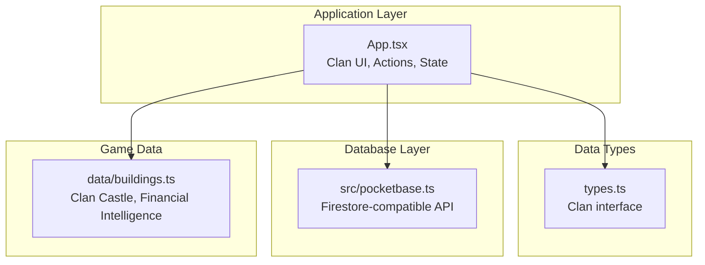
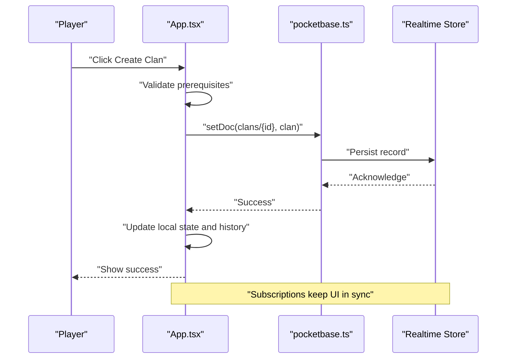
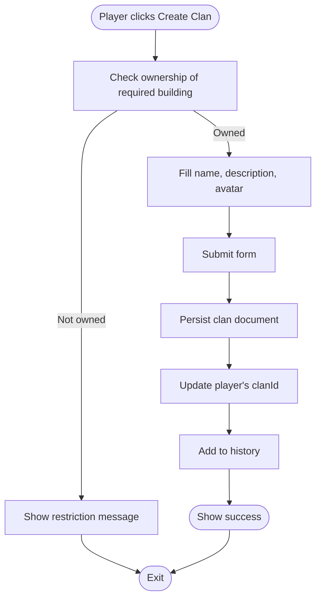
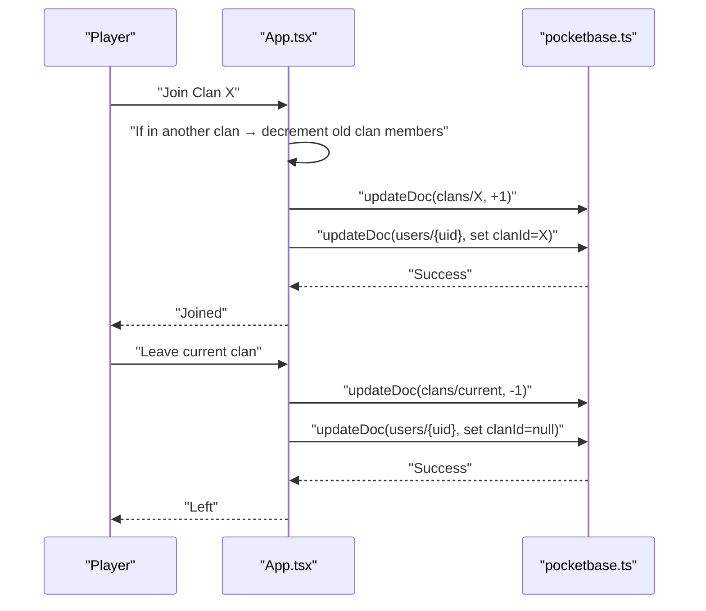
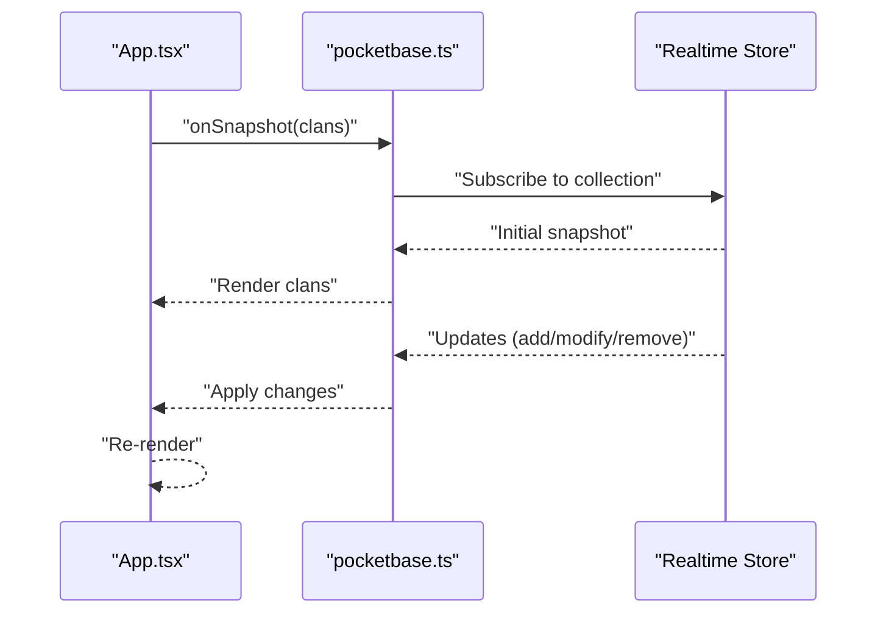
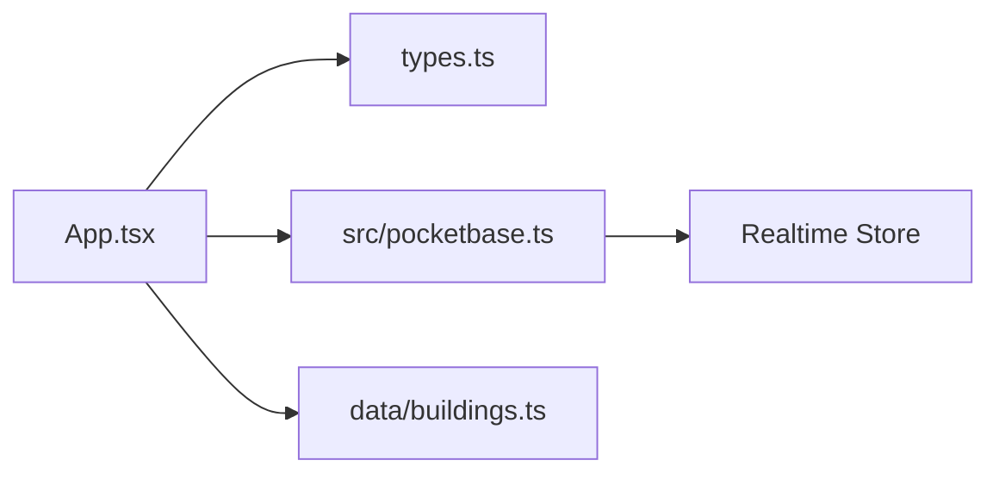

# Clan System

<cite>
**Referenced Files in This Document**
- [App.tsx](file://App.tsx)
- [types.ts](file://types.ts)
- [pocketbase.ts](file://src/pocketbase.ts)
- [buildings.ts](file://data/buildings.ts)
- [README.md](file://README.md)
</cite>

## Table of Contents
1. [Introduction](#introduction)
2. [Project Structure](#project-structure)
3. [Core Components](#core-components)
4. [Architecture Overview](#architecture-overview)
5. [Detailed Component Analysis](#detailed-component-analysis)
6. [Dependency Analysis](#dependency-analysis)
7. [Performance Considerations](#performance-considerations)
8. [Troubleshooting Guide](#troubleshooting-guide)
9. [Conclusion](#conclusion)

## Introduction
This document explains the clan system implementation in the game, focusing on how clans are created, managed, and integrated with the real-time database. It covers membership workflows, territorial control via clan buildings, financial intelligence mechanics, and administrative features such as bans and promotions. Practical examples are drawn from the codebase to illustrate the end-to-end flows for forming a clan, joining, leaving, and interacting with clan-specific mechanics.

## Project Structure
The clan system spans several modules:
- Application state and UI logic for clan actions and presentation
- Type definitions for clans and related entities
- Real-time database integration via a Firestore-compatible wrapper
- Building definitions that include clan-related structures

**Diagram sources**
- [App.tsx:1-120](file://App.tsx#L1-L120)
- [types.ts:170-179](file://types.ts#L170-L179)
- [pocketbase.ts:140-165](file://src/pocketbase.ts#L140-L165)
- [buildings.ts:1-20](file://data/buildings.ts#L1-L20)

**Section sources**
- [README.md:1-21](file://README.md#L1-L21)
- [App.tsx:1-120](file://App.tsx#L1-L120)
- [types.ts:170-179](file://types.ts#L170-L179)
- [pocketbase.ts:140-165](file://src/pocketbase.ts#L140-L165)
- [buildings.ts:1-20](file://data/buildings.ts#L1-L20)

## Core Components
- Clan entity definition: The system defines a minimal clan model with identification, leadership, and membership metrics.
- Clan creation workflow: Players form a clan when they own a specific building and submit a creation form.
- Membership management: Joining, leaving, and counting members are handled through database updates.
- Real-time synchronization: Clans are persisted and subscribed to in real time via the database abstraction.

Key implementation references:
- Clan interface: [types.ts:170-179](file://types.ts#L170-L179)
- Clan creation handler: [App.tsx:5690-5711](file://App.tsx#L5690-L5711)
- Join/leave handlers: [App.tsx:5713-5772](file://App.tsx#L5713-L5772)
- Clan fetching and subscription: [App.tsx:1821-1839](file://App.tsx#L1821-L1839), [pocketbase.ts:578-707](file://src/pocketbase.ts#L578-L707)

**Section sources**
- [types.ts:170-179](file://types.ts#L170-L179)
- [App.tsx:5690-5772](file://App.tsx#L5690-L5772)
- [App.tsx:1821-1839](file://App.tsx#L1821-L1839)
- [pocketbase.ts:578-707](file://src/pocketbase.ts#L578-L707)

## Architecture Overview
The clan system integrates UI actions with a Firestore-compatible backend. The UI triggers operations (create, update, delete) that are translated into database calls. Real-time subscriptions keep the UI synchronized with remote changes.

**Diagram sources**
- [App.tsx:5690-5711](file://App.tsx#L5690-L5711)
- [pocketbase.ts:337-356](file://src/pocketbase.ts#L337-L356)
- [pocketbase.ts:578-707](file://src/pocketbase.ts#L578-L707)

## Detailed Component Analysis

### Clan Creation Workflow
- Prerequisites: The player must own a specific building that enables clan creation.
- Form submission: The UI collects name, description, and optional avatar, then writes a new clan document.
- State updates: The player’s current clan association is set, and the UI logs the event.

**Diagram sources**
- [App.tsx:5690-5711](file://App.tsx#L5690-L5711)
- [App.tsx:535-542](file://App.tsx#L535-L542)

**Section sources**
- [App.tsx:535-542](file://App.tsx#L535-L542)
- [App.tsx:5690-5711](file://App.tsx#L5690-L5711)

### Membership Management
- Joining a clan:
  - If the player is already in another clan, membership is transferred by decrementing the old clan’s count and incrementing the new one.
  - The player’s user document is updated with the new clanId.
- Leaving a clan:
  - The player’s user document is cleared of clanId.
  - The former clan’s member count is decremented.

**Diagram sources**
- [App.tsx:5713-5772](file://App.tsx#L5713-L5772)
- [pocketbase.ts:358-426](file://src/pocketbase.ts#L358-L426)

**Section sources**
- [App.tsx:5713-5772](file://App.tsx#L5713-L5772)
- [pocketbase.ts:358-426](file://src/pocketbase.ts#L358-L426)

### Territorial Control Mechanics
Territory is represented by buildings and resources. While the code does not define a dedicated “territory” entity, territorial control is modeled through:
- Ownership: Buildings carry an owner identifier and owner name.
- Protection: Certain buildings (e.g., watchtowers and clan castles) grant protective effects or visibility within a clan context.
- Presence: Online users’ locations are tracked to infer proximity and potential territorial awareness.

Key references:
- Ownership fields on placed buildings: [types.ts:119-147](file://types.ts#L119-L147)
- Clan castle detection: [App.tsx:535-542](file://App.tsx#L535-L542)
- Watchtower/clan castle checks: [App.tsx:4745-4760](file://App.tsx#L4745-L4760), [App.tsx:4897-4915](file://App.tsx#L4897-L4915), [App.tsx:6117-6140](file://App.tsx#L6117-L6140)

**Section sources**
- [types.ts:119-147](file://types.ts#L119-L147)
- [App.tsx:535-542](file://App.tsx#L535-L542)
- [App.tsx:4745-4760](file://App.tsx#L4745-L4760)
- [App.tsx:4897-4915](file://App.tsx#L4897-L4915)
- [App.tsx:6117-6140](file://App.tsx#L6117-L6140)

### Clan Castle Functionality
- Requirement: The player must own a clan castle to enable clan creation.
- UI gating: The “Create Clan” button is shown only when the prerequisite building is present and not under construction.
- Interaction: Additional UI elements (e.g., protection menus) are gated behind owning a clan castle.

References:
- Constant for clan castle ID: [App.tsx:58-59](file://App.tsx#L58-L59)
- Ownership check: [App.tsx:535-542](file://App.tsx#L535-L542)
- UI gating: [App.tsx:7545-7552](file://App.tsx#L7545-L7552)

**Section sources**
- [App.tsx:58-59](file://App.tsx#L58-L59)
- [App.tsx:535-542](file://App.tsx#L535-L542)
- [App.tsx:7545-7552](file://App.tsx#L7545-L7552)

### Financial Intelligence Systems
- Purpose: Provides economic insights and capabilities for clan members.
- Availability: Detected by the presence of specific buildings in the player’s inventory.
- Advanced variants: Higher-tier financial intelligence buildings offer enhanced capabilities.

References:
- Constant for financial intelligence base ID: [App.tsx:60-61](file://App.tsx#L60-L61)
- Detection logic: [App.tsx:540-546](file://App.tsx#L540-L546)

**Section sources**
- [App.tsx:60-61](file://App.tsx#L60-L61)
- [App.tsx:540-546](file://App.tsx#L540-L546)

### Administrative Features: Bans and Promotions
- Ban menu: Allows selecting ban durations and costs, affecting a target player’s ability to act.
- Punishment and curse menus: Provide non-combat penalties and temporary status effects.
- UI controls: Buttons and selection lists drive these actions.

References:
- Ban options: [App.tsx:104-110](file://App.tsx#L104-L110)
- Punishment options: [App.tsx:112-118](file://App.tsx#L112-L118)
- Curse options: [App.tsx:120-126](file://App.tsx#L120-L126)

**Section sources**
- [App.tsx:104-110](file://App.tsx#L104-L110)
- [App.tsx:112-118](file://App.tsx#L112-L118)
- [App.tsx:120-126](file://App.tsx#L120-L126)

### Real-Time Database Integration
- Firestore-compatible API: The application wraps database operations to mimic Firestore semantics.
- Real-time subscriptions: Collections and documents are subscribed to, with change events applied to local state.
- Error handling: Dedicated handlers log and manage database errors consistently.

**Diagram sources**
- [pocketbase.ts:578-707](file://src/pocketbase.ts#L578-L707)
- [App.tsx:1821-1839](file://App.tsx#L1821-L1839)

**Section sources**
- [pocketbase.ts:578-707](file://src/pocketbase.ts#L578-L707)
- [App.tsx:1821-1839](file://App.tsx#L1821-L1839)

### Clan Wars and Protection Systems
- Clan war context: The UI supports clan-focused chat tabs and presence filtering by clanId, enabling coordinated interactions.
- Protection mechanics: Certain buildings (e.g., clan castle and watchtowers) gate advanced UI features and protections.

References:
- Clan chat tab: [App.tsx:159-160](file://App.tsx#L159-L160)
- Presence filtering by clan: [App.tsx:1959-1967](file://App.tsx#L1959-L1967)
- Protection gating: [App.tsx:6117-6140](file://App.tsx#L6117-L6140)

**Section sources**
- [App.tsx:159-160](file://App.tsx#L159-L160)
- [App.tsx:1959-1967](file://App.tsx#L1959-L1967)
- [App.tsx:6117-6140](file://App.tsx#L6117-L6140)

## Dependency Analysis
The clan system depends on:
- UI state and actions in App.tsx for user-driven operations
- Strongly-typed models in types.ts for data contracts
- Database abstraction in pocketbase.ts for persistence and subscriptions
- Building definitions in buildings.ts for prerequisites and mechanics

**Diagram sources**
- [App.tsx:1-120](file://App.tsx#L1-L120)
- [types.ts:170-179](file://types.ts#L170-L179)
- [pocketbase.ts:140-165](file://src/pocketbase.ts#L140-L165)
- [buildings.ts:1-20](file://data/buildings.ts#L1-L20)

**Section sources**
- [App.tsx:1-120](file://App.tsx#L1-L120)
- [types.ts:170-179](file://types.ts#L170-L179)
- [pocketbase.ts:140-165](file://src/pocketbase.ts#L140-L165)
- [buildings.ts:1-20](file://data/buildings.ts#L1-L20)

## Performance Considerations
- Real-time throttling: Subscriptions are designed to avoid excessive reload storms; initial fetches and updates are throttled to balance responsiveness and load.
- Batch operations: The database abstraction supports batched writes to minimize round trips.
- Presence updates: Heartbeat intervals are tuned to keep state fresh without overloading the server.

[No sources needed since this section provides general guidance]

## Troubleshooting Guide
Common issues and remedies:
- Missing or insufficient permissions: The game loop ignores expected permission errors during normal operations to prevent UI noise.
- Stale client ID errors: Real-time subscriptions retry with jitter to recover from transient client ID mismatches.
- Database errors: Centralized error handler logs operation type, path, and details for diagnostics.

**Section sources**
- [App.tsx:27-33](file://App.tsx#L27-L33)
- [pocketbase.ts:600-621](file://src/pocketbase.ts#L600-L621)
- [pocketbase.ts:787-800](file://src/pocketbase.ts#L787-L800)

## Conclusion
The clan system integrates cleanly with the game’s UI and real-time database layer. It provides a robust foundation for forming clans, managing memberships, and enabling clan-centric mechanics such as territorial control and financial intelligence. Administrative features like bans and punishments are exposed through intuitive UI controls. The Firestore-compatible abstraction ensures scalable, synchronized operations across clients.