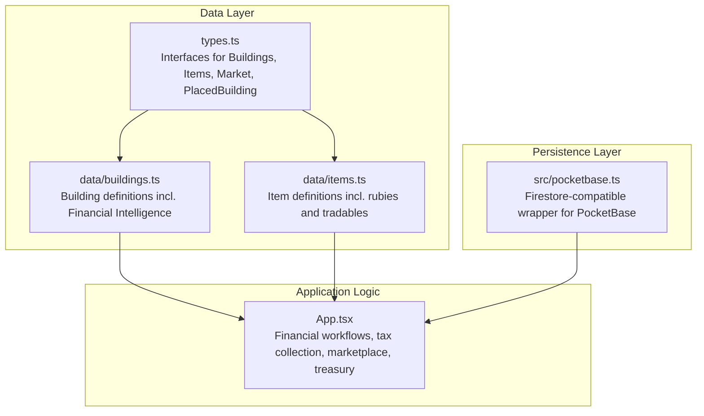
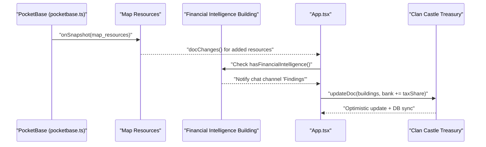
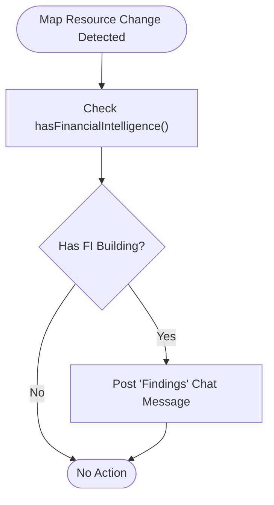
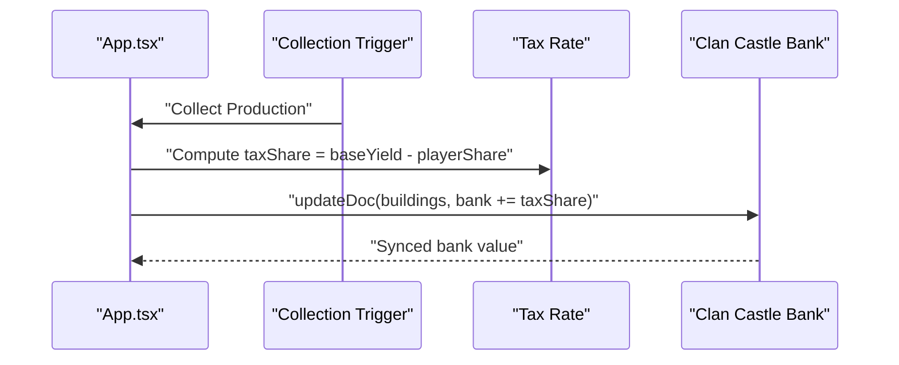
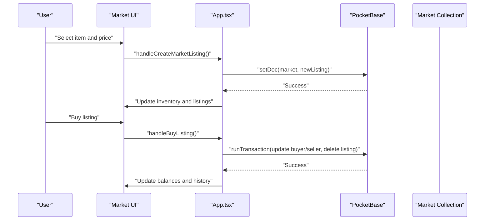
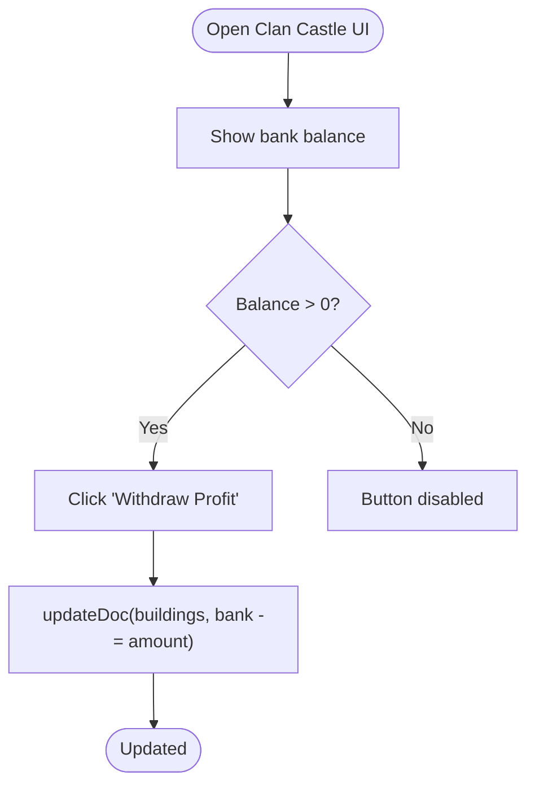
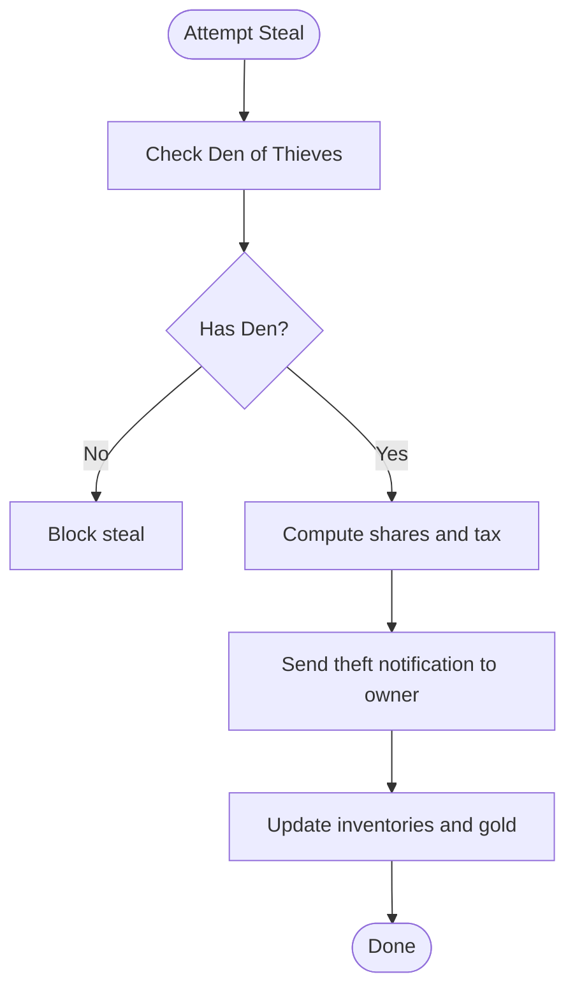
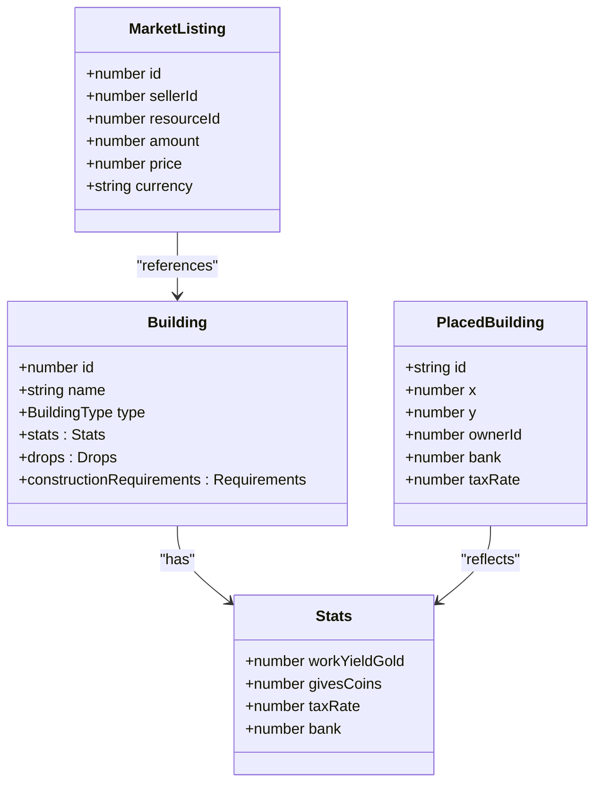
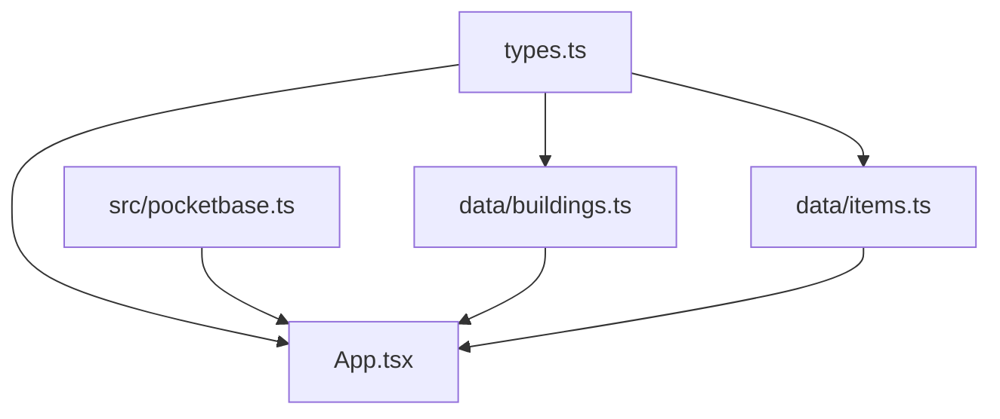

# Financial Intelligence and Resource Sharing

<cite>
**Referenced Files in This Document**
- [README.md](file://README.md)
- [types.ts](file://types.ts)
- [pocketbase.ts](file://src/pocketbase.ts)
- [buildings.ts](file://data/buildings.ts)
- [items.ts](file://data/items.ts)
- [App.tsx](file://App.tsx)
- [firebase_dump.json](file://firebase_dump.json)
</cite>

## Table of Contents
1. [Introduction](#introduction)
2. [Project Structure](#project-structure)
3. [Core Components](#core-components)
4. [Architecture Overview](#architecture-overview)
5. [Detailed Component Analysis](#detailed-component-analysis)
6. [Dependency Analysis](#dependency-analysis)
7. [Performance Considerations](#performance-considerations)
8. [Troubleshooting Guide](#troubleshooting-guide)
9. [Conclusion](#conclusion)

## Introduction
This document describes the Financial Intelligence and Resource Sharing system implemented in the application. It covers surveillance capabilities for detecting resource deposits, resource tracking across the map, threat detection via theft mechanics, and the integrated clan treasury system. It also explains the marketplace integration, member contribution and distribution mechanisms, and financial transparency features such as tax collection and profit sharing.

The system centers around three pillars:
- Financial Intelligence buildings that detect resource deposits and notify players
- Tax collection and clan treasury operations for shared wealth
- Marketplace integration for buying/selling goods and rubies

## Project Structure
The system spans TypeScript interfaces, building/item data definitions, a PocketBase compatibility layer, and the main application logic that orchestrates financial workflows.

**Diagram sources**
- [types.ts:1-197](file://types.ts#L1-L197)
- [buildings.ts:1-800](file://data/buildings.ts#L1-L800)
- [items.ts:1-415](file://data/items.ts#L1-L415)
- [pocketbase.ts:1-825](file://src/pocketbase.ts#L1-L825)
- [App.tsx:540-739](file://App.tsx#L540-L739)

**Section sources**
- [README.md:1-21](file://README.md#L1-L21)
- [types.ts:1-197](file://types.ts#L1-L197)
- [pocketbase.ts:1-825](file://src/pocketbase.ts#L1-L825)

## Core Components
- Financial Intelligence buildings (levels 1–3) that detect resource deposits and notify players when new deposits appear on the map.
- Tax collection system that calculates player share and credits the clan castle’s treasury.
- Marketplace integration for buying/selling goods and rubies, with transaction safety and history logging.
- Clan treasury operations allowing authorized withdrawals from the clan bank.
- Player gold and inventory tracking, rubies as premium currency, and audit trails via history logs.

**Section sources**
- [buildings.ts:2193-2293](file://data/buildings.ts#L2193-L2293)
- [App.tsx:4757-4970](file://App.tsx#L4757-L4970)
- [App.tsx:3986-4102](file://App.tsx#L3986-L4102)
- [App.tsx:6136-6153](file://App.tsx#L6136-L6153)
- [types.ts:160-168](file://types.ts#L160-L168)

## Architecture Overview
The Financial Intelligence and Resource Sharing system integrates real-time map resource detection, tax collection, marketplace transactions, and clan treasury accounting through a unified persistence layer.

**Diagram sources**
- [pocketbase.ts:571-707](file://src/pocketbase.ts#L571-L707)
- [App.tsx:822-839](file://App.tsx#L822-L839)
- [App.tsx:4757-4774](file://App.tsx#L4757-L4774)
- [App.tsx:6136-6153](file://App.tsx#L6136-L6153)

## Detailed Component Analysis

### Financial Intelligence Surveillance
Financial Intelligence buildings (levels 1–3) enable players to discover new resource deposits as they appear on the map. The system listens for new map resource entries and triggers notifications in the “Findings” chat channel.

Key behaviors:
- Detects newly added map resources via real-time subscriptions
- Triggers notifications when Financial Intelligence is present
- Supports multiple levels of detection capability (more advanced levels uncover oil and hidden treasures)

**Diagram sources**
- [App.tsx:822-839](file://App.tsx#L822-L839)
- [App.tsx:540-546](file://App.tsx#L540-L546)
- [buildings.ts:2193-2293](file://data/buildings.ts#L2193-L2293)

**Section sources**
- [App.tsx:822-839](file://App.tsx#L822-L839)
- [App.tsx:540-546](file://App.tsx#L540-L546)
- [buildings.ts:2193-2293](file://data/buildings.ts#L2193-L2293)

### Tax Collection and Clan Treasury Operations
When a player’s production is collected, the system computes the player’s share after applying the applicable tax rate and credits the nearby clan castle’s treasury with the tax portion.

Highlights:
- Calculates player share as a percentage of base yield
- Identifies the nearest clan castle in the same zone
- Updates the clan castle’s bank field atomically using increment sentinel
- Supports both online and offline modes with optimistic updates

**Diagram sources**
- [App.tsx:4757-4774](file://App.tsx#L4757-L4774)
- [App.tsx:4906-4932](file://App.tsx#L4906-L4932)
- [types.ts:138-147](file://types.ts#L138-L147)

**Section sources**
- [App.tsx:4757-4774](file://App.tsx#L4757-L4774)
- [App.tsx:4906-4932](file://App.tsx#L4906-L4932)
- [types.ts:138-147](file://types.ts#L138-L147)

### Marketplace Integration and Member Contributions
The marketplace supports buying and selling goods and rubies. Transactions are processed with safety checks and history logging. Rubies can be purchased at the Auction building and later sold on the general market.

Features:
- Buy/sell listings with quantity and price
- Inventory and gold/rubies updates
- Transaction rollback in case of failure
- History logging for economic actions

**Diagram sources**
- [App.tsx:3986-4102](file://App.tsx#L3986-L4102)
- [App.tsx:4022-4102](file://App.tsx#L4022-L4102)
- [types.ts:160-168](file://types.ts#L160-L168)
- [pocketbase.ts:337-356](file://src/pocketbase.ts#L337-L356)

**Section sources**
- [App.tsx:3986-4102](file://App.tsx#L3986-L4102)
- [App.tsx:4022-4102](file://App.tsx#L4022-L4102)
- [types.ts:160-168](file://types.ts#L160-L168)
- [pocketbase.ts:337-356](file://src/pocketbase.ts#L337-L356)

### Clan Treasury Withdrawals and Accounting
Authorized clan members can withdraw profits from the clan treasury. The UI displays the treasury balance and enables withdrawal actions.

Highlights:
- Displays clan bank balance
- Enables withdrawal button when funds are available
- Integrates with building updates for treasury accounting

**Diagram sources**
- [App.tsx:6136-6153](file://App.tsx#L6136-L6153)
- [types.ts:138-147](file://types.ts#L138-L147)

**Section sources**
- [App.tsx:6136-6153](file://App.tsx#L6136-L6153)
- [types.ts:138-147](file://types.ts#L138-L147)

### Theft Detection and Notifications
When a player steals production from another player’s building, the system notifies the victim and updates the thief’s inventory and gold accordingly. Notifications are posted to the victim’s system messages.

Key steps:
- Verify ownership and level requirements
- Compute shares and update inventories
- Post theft notification to victim’s chat

**Diagram sources**
- [App.tsx:4870-4970](file://App.tsx#L4870-L4970)
- [App.tsx:4961-4970](file://App.tsx#L4961-L4970)

**Section sources**
- [App.tsx:4870-4970](file://App.tsx#L4870-L4970)
- [App.tsx:4961-4970](file://App.tsx#L4961-L4970)

### Data Models and Interfaces
The system relies on strongly-typed interfaces for buildings, items, market listings, and placed buildings. These models define the structure of persisted data and inform UI rendering and logic.

**Diagram sources**
- [types.ts:42-96](file://types.ts#L42-L96)
- [types.ts:119-147](file://types.ts#L119-L147)
- [types.ts:160-168](file://types.ts#L160-L168)

**Section sources**
- [types.ts:42-96](file://types.ts#L42-L96)
- [types.ts:119-147](file://types.ts#L119-L147)
- [types.ts:160-168](file://types.ts#L160-L168)

## Dependency Analysis
The application composes financial intelligence, tax collection, marketplace, and treasury operations through a shared persistence layer and typed models.

**Diagram sources**
- [types.ts:1-197](file://types.ts#L1-L197)
- [pocketbase.ts:1-825](file://src/pocketbase.ts#L1-L825)
- [buildings.ts:1-800](file://data/buildings.ts#L1-L800)
- [items.ts:1-415](file://data/items.ts#L1-L415)
- [App.tsx:540-739](file://App.tsx#L540-L739)

**Section sources**
- [types.ts:1-197](file://types.ts#L1-L197)
- [pocketbase.ts:1-825](file://src/pocketbase.ts#L1-L825)
- [buildings.ts:1-800](file://data/buildings.ts#L1-L800)
- [items.ts:1-415](file://data/items.ts#L1-L415)
- [App.tsx:540-739](file://App.tsx#L540-L739)

## Performance Considerations
- Real-time subscriptions are throttled to reduce unnecessary reloads and database load.
- Incremental updates are used for treasury and inventory to minimize write contention.
- Optimistic UI updates improve responsiveness during transactions, with fallback error handling.

[No sources needed since this section provides general guidance]

## Troubleshooting Guide
Common issues and resolutions:
- Stale client ID errors in real-time subscriptions: The persistence layer retries with jitter and clears stale subscriptions.
- Transaction failures: The marketplace uses transaction wrappers to roll back changes on failure and logs errors.
- Offline mode discrepancies: Treasury and inventory updates fall back to optimistic local state until synchronization occurs.

**Section sources**
- [pocketbase.ts:571-707](file://src/pocketbase.ts#L571-L707)
- [pocketbase.ts:724-746](file://src/pocketbase.ts#L724-L746)
- [App.tsx:3986-4000](file://App.tsx#L3986-L4000)

## Conclusion
The Financial Intelligence and Resource Sharing system provides a robust foundation for surveillance, taxation, marketplace commerce, and clan treasury management. Its modular design leverages typed models, a reliable persistence layer, and clear UI workflows to ensure transparency, fairness, and scalability for clan economic activities.